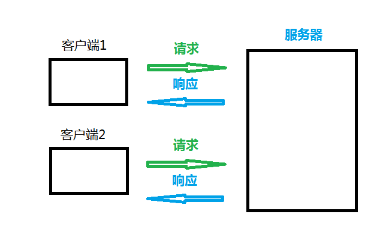
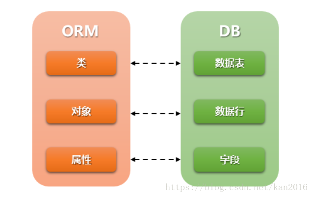

[TOC]

# 1. Django基础

## 1）Django框架的介绍

### 1.1 起源&现状

- 2005年发布,采用Python语言编写的开源web框架
- 一个重量级的 Python Web框架，Django 配备了常用的大部分组件
  1. 基本配置
  1. 路由系统
  1. 原生HTML模板系统
  1. 视图 view
  1. Model模型,数据库连接和ORM数据库管理
  1. 中间件
  1. Cookie & Seesion
  1. 数据库后台管理系统admin
- Django的用途
  - 网站后端开发
  - 微信公众号、微信小程序等后台开发
  - 基于HTTP/HTTPS协议的后台服务器开发
    - 在线语音/图像识别服务器
    - 在线第三方身份验证服务器等
- Django的版本
  - 最新版本:4.0.x
  - 当前教学版本:3.2.13
- Django的官网
  - 官方网址: <http://www.djangoproject.com>
  - 中文文档(第三方):
    - <https://yiyibooks.cn/>


### 1.2 Django的安装

- 查看已安装的版本

  ```python
  $ python3 -m django --version
  3.2.13
  ```

- 安装

  1. 在线安装
     - `sudo pip3 install django`  安装django的最新版本
     - `$ sudo pip3 install django[==版本]` 安装django的指定版本
     - 如: `$ sudo pip3 install django==3.2.13`
  2. 离线安装
     - 官网下载安装包:
     - 安装离线包
       - `$ tar -zxvf Django-3.2.13.tar.gz`
       - `$ cd Django-3.2.13`
       - `$ sudo python3 setup.py install`

- Django的卸载

  `sudo pip3 uninstall django`

- Django 的开发环境

  - Django 3.2.13 支持 3.6，3.7，3.8，3.9，3.10

    

## 2）创建Django项目

### 2.1 创建项目的指令

  - $ django-admin startproject 项目名称

    `django-admin startproject mysite1`

  - 运行

    ```shell
    $ cd mysite1
    $ python3 manage.py runserver
    # 或
    $ python3 manage.py runserver 5000  # 指定只能本机使用127.0.0.1的5000端口访问本机
    ```

### 2.2 Django项目的目录结构

- 示例:

  ```shell
  $ django-admin startproject mysite1
  $ tree mysite1/
  mysite1/
  ├── manage.py
  └── mysite1
      ├── __init__.py
      ├── settings.py
      ├── asgi.py
      ├── urls.py
      └── wsgi.py
  
  1 directory, 5 files
  ```

- 项目目录结构解析:

  - manage.py

    - 此文件是项目管理的主程序,在开发阶段用于管理整个项目的开发运行的调式
    - `manage.py` 包含项目管理的子命令, 如:
      - `python3 manage.py runserver` 启动服务
      - `python3 manage.py startapp` 创建应用
      - `python3 manage.py migrate` 数据库迁移
      - `...`

  - mysite1 项目文件夹

    - 项目包的主文件夹(默认与项目名称一致)

    1. `__init__.py`
       - 包初始化文件,当此项目包被导入(import)时此文件会自动运行
    2. `wsgi.py`
       - WSGI 即 Web Server Gateway Interface
       - WEB服务网关接口的配置文件，仅部署项目时使用
    3. `urls.py`
       - 项目的主路由配置文件，所有的动态路径必须先走该文件进行匹配
    4. `settings.py`
       - Django项目的配置文件, 此配置文件中的一些全局变量将为Django框架的运行传递一些参数
       - setting.py 配置文件,启动服务时自动调用，
       - 此配置文件中也可以定义一些自定义的变量用于作用全局作用域的数据传递
    5. `asgi.py`
       - 对现有WSGI支持的补充。Django打算在可预见的未来支持这两个项目。目前异步功能将仅适用于在ASGI下运行的应用程序。


### 2.3 settings.py文件介绍

https://docs.djangoproject.com/en/3.2/ref/settings/

1. `BASE_DIR`

   - 用于绑定当前项目的绝对路径(动态计算出来的), 所有文件都可以依懒此路径

2. `DEBUG`

   - 用于配置Django项目的启动模式, 取值:
     1. True 表示开发环境中使用 `调试模式`(用于开发中)
     2. False 表示当前项目运行在`生产环境中`(不启用调试)

3. `ALLOWED_HOSTS`

   - 设置允许访问到本项目的host请求头的值,取值:

     1. [] 空列表,表示只有host请求头为`127.0.0.1`, `localhost`能访问本项目 - DEBUG = True时生效
     2. ['*']，表示任何请求头的host都能访问到当前项目
     3. ['192.168.1.3', '127.0.0.1'] 表示只有当前两个host头的值能访问当前项目

     - 注意:

       - 如果要在局域网其它主机也能访问此主机,启动方式应使用如下模式:

         `python3 manage.py runserver 0.0.0.0:5000` # 指定网络设备如果内网环境下其他主机想正常访问该站点，需加`ALLOWED_HOSTS = ['内网ip'] 

4. `INSTALLED_APPS`

   - 指定当前项目中安装的应用列表

5. `MIDDLEWARE`

   - 用于注册中间件

6. `TEMPLATES`

   - 用于指定模板的配置信息

7. `DATABASES`

   - 用于指定数据库的配置信息

8. `LANGUAGE_CODE`

   - 用于指定语言配置
   - 取值:
     - 英文 : `"en-us"`
     - 中文 : `"zh-Hans"`

9. `TIME_ZONE`

   - 用于指定当前服务器端时区
   - 取值:
     - 世界标准时间: `"UTC"`
     - 中国时区 : `"Asia/Shanghai"`

10. `ROOT_URLCONF`

    - 用于配置根级 url 配置 'mysite1.urls'
    - 如:
      - `ROOT_URLCONF = 'mysite1.urls'`

> 注: 此模块可以通过 `from django.conf import settings` 导入和使用

## 3）URL 介绍

### 3.1 URL定义

- URL 即统一资源定位符 Uniform Resource Locator

- 作用:

  - 用来表示互联网上某个资源的地址。

- 说明:

  - 互联网上的每个文件都有一个唯一的URL，它包含的信息指出文件的位置以及浏览器应该怎么处理它。

- URL的一般语法格式为：

  ```
  protocol :// hostname[:port] / path [?query][#fragment]
  ```

- 如:

  ```
  http://tts.tmooc.cn/video/showVideo?menuId=657421&version=AID201908#subject
  ```

- 说明:

  - protocol（协议）
    - http 通过 HTTP 访问该资源。 格式 `http://`
    - https 通过安全的 HTTPS 访问该资源。 格式 `https://`
    - file 资源是本地计算机上的文件。格式: `file:///`
    - ...

  - hostname（主机名）
    - 是指存放资源的服务器的域名系统(DNS) 主机名、域名 或 IP 地址。

  - port（端口号）
    - 整数，可选，省略时使用方案的默认端口；
    - 各种传输协议都有默认的端口号，如http的默认端口为80。
  - path（路由地址）
    - 由零或多个“/”符号隔开的字符串，一般用来表示主机上的一个目录或文件地址。路由地址决定了服务器端如何处理这个请求

  - query(查询)
    - 可选，用于给动态网页传递参数，可有多个参数，用“&”符号隔开，每个参数的名和值用“=”符号隔开。
  - fragment（信息片断）
    - 字符串，用于指定网络资源中的片断。例如一个网页中有多个名词解释，可使用fragment直接定位到某一名词解释。
  - 注: [] 代表其中的内容可省略

### 3.2 Django处理URL对应请求

```python
浏览器  http://127.0.0.1:8000/page/1016/

1,Django 从配置文件中 根据 ROOT_URLCONF 找到 主路由文件；默认情况下，该文件在 项目同名目录下的urls; 例如 mysite1/mysite1/urls.py
2,Django 加载 主路由文件中的 urlpatterns 变量
3,依次匹配 urlpatterns 中的 URL， 匹配到第一个合适的中断后续匹配
4,匹配成功 - 调用对应的视图函数处理请求，返回响应
5,匹配失败 - 返回404响应

主路由-urls.py样例
from django.urls import path
from . import views

urlpatterns = [
    path('admin/', admin.site.urls)
    path('page/1001/', views.page_1001),
    path('page/1002/', views.page_1002),
]
```

### 3.3 视图函数(view)

- 视图函数是用于接收一个浏览器请求并通过HttpResponse对象返回数据的函数。此函数可以接收浏览器请求并根据业务逻辑返回相应的内容给浏览器

- 视图处理的函数的语法格式:

  ```python
  def xxx_view(request[, 其它参数...]):
      return HttpResponse对象
  ```

- 参数:

  - request用于绑定HttpRequest对象，通过此对象可以获取浏览器的参数和数据

- 返回值

  ​	HttpResponse的对象；Django会提供一系列的response对象；

  

- 示例:

  - 视图处理函数 `views.py` 

    ```python
    # file : <项目同名文件夹下>/views.py
    from django.http import HttpResponse
    
    def page1_view(request):
        html = "<h1>这是第1个页面</h1>"
        return HttpResponse(html)
    ```

## 4）Django 路由配置

#### 4.1 说明

- settings.py 中的`ROOT_URLCONF` 指定了主路由配置列表urlpatterns的文件位置

- urls.py 主路由配置文件

  ```python
  # file : <项目同名文件夹>/urls.py
  urlpatterns = [
      path('admin/', admin.site.urls),
      ...  # 此处配置主路由
  ]
  ```

#### 4.2 path() 函数

- 用于描述路由与视图函数的对应关系
- 模块
  - `from django.urls import path`
- 语法:
  - path(route, views, name=None)
  - 参数：
    1. route: 字符串类型，匹配的请求路径
    2. views: 指定路径所对应的视图处理函数的名称
    3. name: 为地址起别名，在模板中地址反向解析时使用

- 练习（**使用mysite1项目**）
  - 建立一个小网站:
    - 输入网址: http://127.0.0.1:8000, 在网页中输出 : 这是我的首页
    - 输入网址: http://127.0.0.1:8000/page/1, 在网页中输出 : 这是编号为1的网页
    - 输入网址: http://127.0.0.1:8000/page/2, 在网页中输出 : 这是编号为2的网页
    - 思考
      - 建立如上一百个网页该怎么办？

**path转换器**

语法： \<转换器类型:自定义名>

作用：若转换器类型匹配到对应类型的数据，则将数据按照关键字传参的方式传递给视图函数

| 转换器 | 效果                                                      | 案例                                                |
| ------ | --------------------------------------------------------- | --------------------------------------------------- |
| str    | 匹配除了 `'/'` 之外的非空字符串                           | "v1/users/\<str:username>"匹配 /v1/users/guoxiaonao |
| int    | 匹配0或任何正整数。返回一个 int                           | "page/\<int:page>" 匹配 /page/100                   |
| slug   | 匹配任意由 ASCII 字母或数字以及连字符和下划线组成的短标签 | "detail/\<slug:sl>" 匹配 /detail/this-is-django     |
| path   | 匹配非空字段，包括路径分隔符 `'/'`                        | "v1/users/\<path:ph>"匹配 /v1/goods/a/b/c           |

- 练习:

  - 定义一个路由的格式为:
    - http://127.0.0.1:8000/整数/操作字符串/整数

  - 从路由中提取数据，做相应的操作后返回给浏览器
  - 如：

  ```
  输入: 127.0.0.1:8000/100/add/200
      页面显示结果：300
  输入: 127.0.0.1:8000/100/sub/200
      页面显示结果：-100
  输入: 127.0.0.1:8000/100/mul/200
      页面显示结果：20000
  输入: 127.0.0.1:8000/100/div/200
      页面显示结果：0.5
  ```


## 5）HTTP协议的请求和响应

- 请求是指浏览器端通过HTTP协议发送给服务器端的数据
- 响应是指服务器端接收到请求后做相应的处理后再回复给浏览器端的数据



### 5.1 HTTP 请求

```python
POST /v1/tokens HTTP/1.1     -> 起始行

Host: 127.0.0.1:8000         -> headers
User-Agent: Mozilla/5.0 (X11; Ubuntu; Linux x86_64; rv:74.0) Gecko/20100101 Firefox/74.0
Accept: */*
Accept-Language: zh-CN,zh;q=0.8,zh-TW;q=0.7,zh-HK;q=0.5,en-US;q=0.3,en;q=0.2
Accept-Encoding: gzip, deflate
Content-Type: application/json
Content-Length: 58
Origin: http://127.0.0.1:7000
Connection: keep-alive
Referer: http://127.0.0.1:7000/dadashop/templates/login.html

{"username":"chaogege"}     -> body 
```


- 根据HTTP标准，HTTP请求可以使用多种请求方法。

- HTTP1.0定义了三种请求方法： GET, POST 和 HEAD方法(最常用)

- HTTP1.1新增了五种请求方法：OPTIONS, PUT, DELETE, TRACE 和 CONNECT 方法。

- HTTP1.1 请求详述

  | 序号 |  方法   | 描述                                                         |
  | :--: | :-----: | :----------------------------------------------------------- |
  |  1   |   GET   | 请求指定的页面信息，并返回实体主体。                         |
  |  2   |  HEAD   | 类似于get请求，只不过返回的响应中没有具体的内容，用于获取报头 |
  |  3   |  POST   | 向指定资源提交数据进行处理请求（例如提交表单或者上传文件）。数据被包含在请求体中。POST请求可能会导致新的资源的建立和/或已有资源的修改。 |
  |  4   |   PUT   | 从客户端向服务器传送的数据取代指定的文档的内容。             |
  |  5   | DELETE  | 请求服务器删除指定的页面。                                   |
  |  6   | CONNECT | HTTP/1.1协议中预留给能够将连接改为管道方式的代理服务器。     |
  |  7   | OPTIONS | 允许客户端查看服务器的性能。                                 |
  |  8   |  TRACE  | 回显服务器收到的请求，主要用于测试或诊断。                   |


- HttpRequest对象
  - 视图函数的第一个参数是HttpRequest对象
  - 服务器接收到http协议的请求后，会根据请求数据报文创建HttpRequest对象
  - HttpRequest属性
    - path_info: URL字符串
    - method：字符串，表示HTTP请求方法，常用值：'GET'、'POST'
    - GET：QueryDict查询字典的对象，包含查询字符串的所有数据
    - POST：QueryDict查询字典的对象，包含post表单提交方式的所有数据
    - FILES：类似于字典的对象，包含所有的上传文件信息
    - COOKIES：Python字典，包含所有的cookie，键和值都为字符串
    - session：似于字典的对象，表示当前的会话
    - body: 字节串，请求体的内容(POST或PUT)
    - scheme : 请求协议('http'/'https')
    - request.get_full_path() : 请求的完整路径
    - request.get_host() : 请求的主机
    - request.META : 请求中的元数据(消息头)
      - request.META['REMOTE_ADDR']  : 客户端IP地址

### 5.2 HTTP 响应

```python
HTTP/1.0 200 OK                        -> 起始行

Date: Sat, 21 Mar 2020 09:44:15 GMT    -> headers
Server: WSGIServer/0.2 CPython/3.6.8
Content-Type: application/json
X-Frame-Options: SAMEORIGIN
Content-Length: 217
Vary: Origin
Access-Control-Allow-Origin: *

{"code": 200, "username": "guoxiaonao"} -> body 
```


- 当浏览者访问一个网页时，浏览者的浏览器会向网页所在服务器发出请求。当浏览器接收并显示网页前，此网页所在的服务器会返回一个包含HTTP状态码的信息头用以响应浏览器的请求。

- HTTP状态码的英文为HTTP Status Code。

- 下面是常见的HTTP状态码：

  - 200 - 请求成功 
  - 301 - 永久重定向-资源（网页等）被永久转移到其它URL
  - 302 - 临时重定向
  - 404 - 请求的资源（网页等）不存在
  - 500 - 内部服务器错误

- HTTP状态码分类

  - HTTP状态码由三个十进制数字组成，第一个十进制数字定义了状态码的类型，后两个数字没有分类的作用。HTTP状态码共分为5种类型：

    | 分类 | 分类描述                                       |
    | :--: | ---------------------------------------------- |
    | 1**  | 信息，服务器收到请求，需要请求者继续执行操作   |
    | 2**  | 成功，操作被成功接收并处理                     |
    | 3**  | 重定向，需要进一步的操作以完成请求             |
    | 4**  | 客户端错误，请求包含语法错误或无法完成请求     |
    | 5**  | 服务器错误，服务器在处理请求的过程中发生了错误 |

- Django中的响应对象HttpResponse:

  - 构造函数格式:

    - `HttpResponse(content=响应体, content_type=响应体数据类型, status=状态码)`

  - 作用:

    - 向客户端浏览器返回响应，同时携带响应体内容

  - 参数:

    - content：表示返回的内容。

    - status_code：返回的HTTP响应状态码(默认为200)。

    - content_type：指定返回数据的的MIME类型(默认为"text/html")。浏览器会根据这个属性，来显示数据。如果是text/html，那么就会解析这个字符串，如果text/plain，那么就会显示一个纯文本。

      - 常用的Content-Type如下：
        - `'text/html'`（默认的，html文件）
        - `'text/plain'`（纯文本）
        - `'text/css'`（css文件）
        - `'text/javascript'`（js文件）
        - `'multipart/form-data'`（文件提交）
        - `'application/json'`（json传输）
      - `'application/xml'`（xml文件）

      > 注： 关键字MIME(Multipurpose Internet Mail Extensions)是指多用途互联网邮件扩展类型。

- HttpResponse 子类

  | 类型                    | 作用           | 状态码 |
  | ----------------------- | -------------- | ------ |
  | HttpResponseRedirect    | 重定向         | 302    |
  | HttpResponseNotModified | 未修改         | 304    |
  | HttpResponseBadRequest  | 错误请求       | 400    |
  | HttpResponseNotFound    | 没有对应的资源 | 404    |
  | HttpResponseForbidden   | 请求被禁止     | 403    |
  | HttpResponseServerError | 服务器错误     | 500    |


## 6）Django处理GET和POST请求

- 无论是GET还是POST，统一都由视图函数接收请求，通过判断request.method 区分具体的请求动作 

- 样例：

  ```python
  if request.method == 'GET':
      处理GET请求时的业务逻辑
  elif request.method == 'POST':
      处理POST请求的业务逻辑
  else:
      其他请求业务逻辑
  ```

### 6.1 GET处理

- GET请求动作，一般用于向服务器获取数据

- 能够产生GET请求的场景：

  - 浏览器地址栏中输入URL,回车后

    `<a href="地址?参数=值&参数=值">`

  - form表单中的method为get

    ```html
    <form method='get' action="/user/login">
        姓名:<input type="text" name="uname">
    </form>
    ```

- GET请求方式中，如果有数据需要传递给服务器，通常会用查询字符串(Query String)传递    【注意：不要传递敏感数据】

  - URL 格式: `xxx?参数名1=值1&参数名2=值2...`

    - 如: `http://127.0.0.1:8000/page1?a=100&b=200`

  - 服务器端接收参数

    获取客户端请求GET请求提交的数据

    ```python
    request.GET # QueryDict
    request.GET.get('参数名','默认值')
    request.GET.getlist('参数名')
    # mypage?a=100&b=200&c=300&b=400
    # request.GET ：QueryDict({'a':['100'], 'b':['200','400'], 'c':['300']})
    # a = request.GET['a']
    # b = request.GET['b']  # Error
    ```


### 6.2 POST处理

- POST请求动作，一般用于向服务器提交大量数据

- 客户端通过表单等POST请求将数据传递给服务器端,如:

  ```html
  <form method='post' action="/login/">
      姓名:<input type="text" name="username">
      <input type='submit' value='登录'>
  </form>
  ```

  - form 表单的name属性

    - 在form表单控件提交数据时，会自动搜索本表单控件内部的子标签的name属性及相应的值，再将这些名字和值以键-值对的形式提交给action指定的服务器相关位置

    - 在form内能自动搜集到的name属性的标签的控件有

      ```html
      <input name='xxx'>
      <select name='yyy'></select>
      <textarea name='zzz'></textarea>
      ```

- 服务器端接收参数

  - 通过 request.method 来判断是否为POST请求,如:

  ```python
  if request.method == 'POST':
      处理POST请求的数据并响应
  else:
      处理非POST 请求的响应
  ```

- 使用post方式接收客户端数据

  ```python
  request.POST['参数名']  # request.POST 绑定QueryDict
  request.POST.get('参数名','')
  request.POST.getlist('参数名')
  ```

- 取消csrf验证,否则Django将会拒绝客户端发来的POST请求

  - 取消 csrf 验证

    - 禁止掉 settings.py 中 MIDDLEWARE 中的 CsrfViewsMiddleWare 的中间件

    ```python
    MIDDLEWARE = [
        ...
        # 'django.middleware.csrf.CsrfViewMiddleware',
        ...
    ]
    ```

### 6.3 练习

- 访问地址: http://127.0.0.1:8000/birthday
- 最终输出: 生日为: xxxx年xx月xx日
- 要求：
  - GET请求：以查询字符串方式传递：`year=xxxx&month=xx&day=xx`
  - POST请求：在表单中传递

# 2. 设计模式及模板

## 1）Django的框架设计模式

- MVC 设计模式
  - MVC 代表 Model-View-Controller（模型-视图-控制器） 模式。
  - 作用: 降低模块间的耦合度(解耦)
  - MVC
    - M 模型层(Model), 主要用于对数据库层的封装
    - V 视图层(View), 用于向用户展示结果
    - C 控制(Controller ，用于处理请求、获取数据、返回结果(重要)
  - MVC模式如图:
    
- MTV 模式
  MTV 代表 Model-Template-View（模型-模板-视图） 模式。这种模式用于应用程序的分层开发
  - 作用: 
    - 降低模块间的耦合度(解耦)
  - MTV 
    - M -- 模型层(Model)  负责与数据库交互
    - T -- 模板层(Template)  负责呈现内容到浏览器
    - V -- 视图层(View)  是核心，负责接收请求、获取数据、返回结果
  - MTV模式如图:
    

## 2）模板 Templates

- 什么是模板
  1. 模板是可以根据字典数据动态变化的html网页
  2. 模板可以根据视图中传递的字典数据动态生成相应的HTML网页。

- 模板的配置
  - 创建模板文件夹`<项目名>/templates`
  - 在 settings.py 中 TEMPLATES 配置项
    1. BACKEND : 指定模板的引擎
    2. DIRS : 模板的搜索目录(可以是一个或多个)
    3. APP_DIRS : 是否要在应用中的 `templates` 文件夹中搜索模板文件
    4. OPTIONS : 有关模板的选项

- 默认的模块文件夹`templates`
- 修改settings.py文件，设置TEMPLATES的DIRS值为`'DIRS': [BASE_DIR / 'templates'],`

```python
# file: settings.py
TEMPLATES = [
    {
        'BACKEND': 'django.template.backends.django.DjangoTemplates',
        # 'DIRS': [],
        'DIRS': [BASE_DIR / 'templates'],  # 添加模板路径
        'APP_DIRS': True,  # 是否索引各app里的templates目录
        ...
    },
]
```

3. 模板的加载

   使用 render() 直接加载并响应模板

   ```python
   from django.shortcuts import render
   return render(request,'模板文件名', 字典数据)
   ```

###  2.1 Django 模板语言

#### 2.1.1 模板的传参

- 模板传参是指把数据形成字典，传参给模板，为模板渲染提供数据

  ```python
  return render(request,'xxx.html',字典数据)
  ```

#### 2.2.2 模板的变量

1. 在模板中使用变量语法
   - `{{ 变量名 }}`

   - `{{ 变量名.index }}`

   - `{{ 变量名.key}}`

   - `{{ 对象.方法 }}`

   - `{{ 函数名 }}`

2. 视图函数中必须将变量封装到字典中才允许传递到模板上

```python
def xxx_view(request)
    dic = {
        "变量1":"值1",
        "变量2":"值2",
    }
    return render(request, 'xxx.html', dic)
```

3. 如果变量过多，可以使用 locals() 将局部变量自动生成字典

```python
def xxx_view(request)
	变量1 = 值1
    变量2 = 值2
    ...
    return render(request, 'xxx.html', locals())
```


#### 2.2.3 模板的标签

文档可参见：https://docs.djangoproject.com/en/2.2/ref/templates/builtins/#built-in-tag-reference

1. 作用

   - 将一些服务器端的功能嵌入到模板中

2. 标签语法

   ```
   
   ...
   
   ```

3. if 标签

   ```
   
   ...
   
   ...
   
   ...
   
   ...
   
   ```

4. if 标签里的布尔运算符

   - if 条件表达式里可以用的运算符 ==, !=, <, >, <=, >=, in, not in, is, is not, not、and、or
   - 在if标记中使用实际括号是无效的语法。 如果您需要它们指示优先级，则应使用嵌套的if标记。

5. for 标签

   语法

   ```
   
       ... 循环语句
   
       ... 可迭代对象无数据时填充的语句
   
   ```

## 3）静态文件

1. 什么是静态文件

   - 不能与服务器端做动态交互的文件都是静态文件
   - 如:图片,css,js,音频,视频,html文件(部分)

2. 静态文件配置

   - 在 settings.py 中配置一下两项内容:

   1. 配置静态文件的访问路径

      - 通过哪个url地址找静态文件
      - STATIC_URL = '/static/'
      - 说明:
        - 指定访问静态文件时是需要通过 /static/xxx或 127.0.0.1:8000/static/xxx
        - xxx 表示具体的静态资源位置

   2. 配置静态文件的存储路径 `STATICFILES_DIRS`

      - STATICFILES_DIRS保存的是静态文件在服务器端的存储位置

   3. 示例:

      ```python
      # file: setting.py
      STATICFILES_DIRS = (
          BASE_DIR / "static",
      )
      ```

3. 访问静态文件

   1. 使用静态文件的访问路径进行访问

      - 访问路径: STATIC_URL = '/static/'

      - 示例:

        ```python
        
        
        ```

   2. 通过 标签访问静态文件

      - `` 表示的就是静态文件访问路径

      1. 加载 static
         - ``
      2. 使用静态资源时
         - 语法:
           - ``
         - 示例:
           - ``

# 3. 应用及模型层

## 1）Django中的应用app

- 应用在Django项目中是一个独立的业务模块,可以包含自己的路由,视图,模板,模型

###  1.1 创建应用app

- 创建步骤

  1. 用manage.py 中的子命令 startapp 创建应用文件夹

     `python3 manage.py startapp 应用名称`

      如：python3 manage.py startapp music

    2. 在settings.py里注册应用

   ```python
  INSTALLED_APPS = [
      # ....
      'user',  #用户信息模块
      'music',  #音乐模块
  ]
   ```

### 1.2 应用的结构

1. `migrations` 文件夹
   - 保存数据迁移的中间文件
2. `__init__.py`
   - 应用子包的初始化文件
3. `admin.py`
   - 应用的后台管理配置文件  
4. `apps.py`
   - 应用的属性配置文件
5. `models.py`
   - 与数据库相关的模型映射类文件
6. `tests.py`
   - 应用的单元测试文件
7. `views.py`
   - 定义视图处理函数的文件

### 1.3 应用的分布式路由

- Django中，主路由配置文件(urls.py)可以不处理用户具体路由，主路由配置文件的可以做请求的分发(分布式请求处理)。具体的请求可以由各自的应用来进行处理
- 如图:
  - 

#### include 函数

- 作用:

  - 用于分发将当前路由转到各个应用的路由配置文件的 urlpatterns 进行分布式处理

- 函数格式

  - include('app命字.url模块名')

  > 模块`app命字/url模块名.py` 文件件里必须有urlpatterns 列表
  > 使用前需要使用 `from django.conf.urls import include` 导入此函数

- 练习:

  ```
  1.创建两个应用    
      1.创建 sport 应用,并注册
      2.创建 news  应用,并注册
   
  2.创建分布式路由系统
     	1. http://127.0.0.1:8000/sport/index
          交给 sport 应用中的 index_view() 函数处理
      2. http://127.0.0.1:8000/news/index
          交给 news  应用中的 index_view() 函数处理
  ```

### 1.4 应用的模板

```python
应用内部可以配置模板目录
1，应用下手动创建 templates 文件夹
2，settings.py中确认 TEMPLATE 配置项中 的 'APP_DIRS' 值
   例如 ： 'APP_DIRS': True

#应用下templates 和 外层templates 都存在时，django得查找模板规则
1，优先查找外层templates目录下的模板
2，按INSTALLED_APPS配置下的 应用顺序 逐层查找
```

## 2）模型层

### 2.1 Django下配置使用 mysql 数据库

1. 安装 mysqlclient [版本 mysqlclient 1.3.13以上 ，官网目前为1.4.x]
   - 安装前确认ubuntu是否已安装 python3-dev 和  default-libmysqlclient-dev

   - sudo apt list --installed|grep -E 'libmysqlclient-dev|python3-dev' 

- 若命令无输出则需要安装 -  sudo apt-get install python3-dev default-libmysqlclient-dev

  - 确保上述两个库已经安装，执行 sudo pip3 install mysqlclient即可 

      

2. 创建 和 配置数据库

   1. 创建数据库

      - 创建 `create database 数据库名 default charset utf8;`

   2. 数据库的配置
   
      - sqlite 数据库配置

        ```python
        # file: settings.py
         DATABASES = {
          'default': {
                     'ENGINE': 'django.db.backends.sqlite3',
                     'NAME': BASE_DIR / 'db.sqlite3',
             }
         }
        
         - mysql 数据库配置
        
           ```python
           DATABASES = {
                'default' : {
                 'ENGINE': 'django.db.backends.mysql',
                    'NAME': 'mywebdb',  # 数据库名称,需要自己定义
                    'USER': 'root',
                    'PASSWORD': '123456',  # 管理员密码
                    'HOST': '127.0.0.1',
                    'PORT': '3306',
                }
            }
      
   3. 关于数据为的SETTING设置
   
      1. ENGINE
   
         - 指定数据库的后端引擎
   
         ```
         'django.db.backends.mysql'
         'django.db.backends.sqlite3'
         'django.db.backends.oracle'
         'django.db.backends.postgresql'
         ```
   
         - mysql引擎如下:
           - 'django.db.backends.mysql'
   
   2. NAME
   
         - 指定要连接的数据库的名称
      - `'NAME': 'mywebdb'`
   
   3. USER
   
         - 指定登录到数据库的用户名
      - `'USER':'root'`
   
   4. PASSWORD
   
         - 接数据库的密码。
      - `'PASSWORD':'123456'`
   
   5. HOST
   
         - 连接数据库时使用哪个主机。
      - `'HOST':'127.0.0.1'`
   
   6. PORT
   
         - 连接数据库时使用的端口。
      - `'PORT':'3306'`

### 2.2 模型（Models）

- 模型是一个Python类，它是由django.db.models.Model派生出的子类。
- 一个模型类代表数据库中的一张数据表
- 模型类中每一个类属性都代表数据库中的一个字段。
- 模型是数据交互的接口，是表示和操作数据库的方法和方式


### 2.3 Django 的 ORM框架

- ORM（Object Relational Mapping）即对象关系映射，它是一种程序技术，它允许你使用类和对象对数据库进行操作,从而避免通过SQL语句操作数据库
- ORM框架的作用
  1. 建立模型类和表之间的对应关系，允许我们通过面向对象的方式来操作数据库。
  2. 根据设计的模型类生成数据库中的表格。
  3. 通过简单的配置就可以进行数据库的切换。
- ORM 好处:
  1. 只需要面向对象编程, 不需要面向数据库编写代码.
     - 对数据库的操作都转化成对类属性和方法的操作.
     - 不用编写各种数据库的sql语句.
  2. 实现了数据模型与数据库的解耦, 屏蔽了不同数据库操作上的差异.
     - 不在关注用的是mysql、oracle...等数据库的内部细节.
     - 通过简单的配置就可以轻松更换数据库, 而不需要修改代码.
- ORM 缺点
  1. 对于复杂业务，使用成本较高
  2. 根据对象的操作转换成SQL语句,根据查询的结果转化成对象, 在映射过程中有性能损失.
- ORM 示意
  - 

### 2.4 模型示例

- 此示例为添加一个 bookstore_book 数据表来存放图书馆中书目信息

- 添加一个 bookstore 的 app

  ```shell
  $ python3 manage.py startapp bookstore
  ```

- 注册app

  ```python
  # file : setting.py
  INSTALLED_APPS = [
      ...
      'bookstore',
  ]
  ```

- 添加模型类

  ```python
  # file : bookstore/models.py
  from django.db import models
  
  class Book(models.Model): 
      title = models.CharField("书名", max_length=50, default='')
      price = models.DecimalField('定价', max_digits=7, decimal_places=2, default=0.0)
  ```

- 数据库的迁移

  - 迁移是Django同步您对模型所做更改（添加字段，删除模型等） 到您的数据库模式的方式

  1. 生成或更新迁移文件

  ​	将每个应用下的models.py文件生成一个中间文件,并保存在migrations文件夹中

  ​	`python3 manage.py makemigrations`

  2. 执行迁移脚本程序

     执行迁移程序实现迁移。将每个应用下的migrations目录中的中间文件同步回数据库

     `python3 manage.py migrate`

     注:  每次修改完模型类再对服务程序运行之前都需要做以上两步迁移操作。

### 2.5 模型类Models 创建

- 模型类需继承自`django.db.models.Model`

  Models的语法规范

  ```
  from django.db import models
  class 模型类名(models.Model):
      字段名 = models.字段类型(字段选项)
  ```

  > 模型类名是数据表名的一部分，建议类名首字母大写
  > 字段名又是当前类的类属性名，此名称将作为数据表的字段名
  > 字段类型用来映射到数据表中的字段的类型
  > 字段选项为这些字段提供附加的参数信息

#### 2.5.1 字段类型

1. BooleanField()

   - 数据库类型:tinyint(1)
   - 编程语言中:使用True或False来表示值
   - 在数据库中:使用1或0来表示具体的值

2. CharField()

   - 数据库类型:varchar
   - 注意:
     - 必须要指定max_length参数值

3. DateField()

   - 数据库类型:date
   - 作用:表示日期
   - 参数:
     - auto_now: 每次保存对象时，自动设置该字段为当前时间(取值:True/False)。
     - auto_now_add: 当对象第一次被创建时自动设置当前时间(取值:True/False)。
     - default: 设置当前时间(取值:字符串格式时间如: '2019-6-1')。
     - 以上三个参数只能多选一

4. DateTimeField()

   - 数据库类型:datetime(6)
   - 作用:表示日期和时间
   - 参数同DateField

5. DecimalField()

   - 数据库类型:decimal(x,y)

   - 编程语言中:使用小数表示该列的值

   - 在数据库中:使用小数

   - 参数:

     - max_digits: 位数总数，包括小数点后的位数。 该值必须大于等于decimal_places.
     - decimal_places: 小数点后的数字数量

   - 示例:

     ```
     money=models.DecimalField(
         max_digits=7,
         decimal_places=2,
         default=0.0
     )
     ```

6. FloatField()

   - 数据库类型:double
   - 编程语言中和数据库中都使用小数表示值

7. EmailField()

   - 数据库类型:varchar
   - 编程语言和数据库中使用字符串

8. IntegerField()

   - 数据库类型:int
   - 编程语言和数据库中使用整数


#### 2.5.2 字段选项

- 字段选项, 指定创建的列的额外的信息
- 允许出现多个字段选项,多个选项之间使用,隔开

1. primary_key
   - 如果设置为True,表示该列为主键,如果指定一个字段为主键，则此数库表不会创建id字段
3. null
   - 如果设置为True,表示该列值允许为空。
   - 默认为False,如果此选项为False建议加入default选项来设置默认值
4. default
   - 设置所在列的默认值,如果字段选项null=False建议添加此项
5. db_index
   - 如果设置为True,表示为该列增加索引
6. unique
   - 如果设置为True,表示该字段在数据库中的值必须是唯一(不能重复出现的)
7. db_column
   - 指定列的名称,如果不指定的话则采用属性名作为列名
8. verbose_name
   - 设置此字段在admin界面上的显示名称。

- 示例:

  ```python
  # 创建一个属性,表示用户名称,长度30个字符,必须是唯一的,不能为空,添加索引
  name = models.CharField(max_length=30, unique=True, null=False, db_index=True)
  ```

  


#### 2.5.3 Meta内部类

- 使用内部 Meta类 来给模型赋予属性，Meta类下有很多内建的类属性，可对模型类做一些控制

- 示例：

  ```python
  # file : bookstore/models.py
  from django.db import models
  
  class Book(models.Model): 
      title = models.CharField("书名", max_length=50, default='')
      price = models.DecimalField('定价', max_digits=7, decimal_places=2, default=0.0)
      class Meta:
          db_table = 'book'  #可改变当前模型类对应的表名
  ```

  


### 2.6 数据库迁移的错误处理方法

- 当执行 `$ python3 manage.py makemigrations` 出现如下迁移错误时的处理方法

  - 错误信息

    ```
    You are trying to add a non-nullable field 'des' to book without a default; we can't do that (the database needs something to populate existing rows).
    Please select a fix:
     1) Provide a one-off default now (will be set on all existing rows with a null value for this column)
     2) Quit, and let me add a default in models.py
    Select an option:  
    ```

  - 翻译为中文如下:

    ```
    您试图添加一个非空字段'des'来预订没有默认;我们不能这样做(数据库需要填充现有行)
    请选择修复:
    1)现在提供一次性默认值(将对所有现有行设置此列的空值)
    2)退出，让我在models.py中添加一个默认值
    选择一个选项:
    ```

  - 错误原因

    - 当对模型类新添加一个字段时可出现该错误
    - 原理是 添加新字段后，数据库不知道原来已有数据对于新建字段该如何赋值，所以新增字段时，务必要添加default默认值。

  - 处理方法:

    退出当前生成迁移文件的过程，自己去修改models.py, 新增加一个`default=XXX` 的缺省值(推荐使用)

- 数据库的迁移文件混乱的解决办法

  1. 删除 所有 migrations 里所有的 000?_XXXX.py (`__init__.py`除外)
  2. 删除 数据库
     - sql> drop database mywebdb;
  3. 重新创建 数据库
     - sql> create datebase mywebdb default charset...;
  4. 重新生成migrations里所有的 000?_XXXX.py
     - python3 manage.py makemigrations
  5. 重新更新数据库
     - python3 manage.py migrate


## 3）模型层的基本操作   

- 基本操作包括增删改查操作，即(CRUD操作)
- CRUD是指在做计算处理时的增加(Create)、读取查询(Read)、更新(Update)和删除(Delete)

### 3.1 管理器对象

- 每个继承自 models.Model 的模型类，都会有一个 objects 对象被同样继承下来。这个对象叫管理器对象

- 数据库的增删改查可以通过模型的管理器实现

  ```python
  class MyModel(models.Model):
      ...
  MyModel.objects.create(...) # objects 是管理器对象
  ```

### 3.2 创建数据对象

- Django 使用一种直观的方式把数据库表中的数据表示成Python 对象

- 创建数据中每一条记录就是创建一个数据对象

  1. MyModel.objects.create(属性1=值1, 属性2=值1,...)

     - 成功: 返回创建好的实体对象
     - 失败: 抛出异常

  2. 创建 MyModel 实例对象,并调用 save() 进行保存

     ```python
     obj = MyModel(属性=值,属性=值)
     obj.属性=值
     obj.save()
     ```

### 3.3 Django shell 的使用

- 在Django提供了一个交互式的操作项目叫 `Django Shell` 它能够在交互模式用项目工程的代码执行相应的操作

- 利用 Django Shell 可以代替编写View的代码来进行直接操作

- 在Django Shell 下只能进行简单的操作，不能运行远程调式

- 启动方式:

  ```shell
  $ python3 manage.py shell
  ```

- 练习:

  ```
  在 bookstore/models.py 应用中添加两个model类
  1. Book - 图书
      1. title - CharField 书名,非空,唯一
      2. pub - CharField 出版社,字符串,非空
      3. price - DecimalField 图书定价 总长6位/小数点2位
      4. market_price - 图书零售价 总长6位/小数点2位
  2. Author - 作者
      1. name - CharField 姓名,非空
      2. age - IntegerField, 年龄,非空，缺省值为1
      3. email - EmailField, 邮箱,允许为空
  ```

  - 然后用 Django Shell 添加如下数据

    - 图书信息

      | 书名   | 定价  | 零售价 | 出版社         |
      | ------ | ----- | ------ | -------------- |
      | Python | 20.00 | 25.00  | 清华大学出版社 |
      | Django | 70.00 | 75.00  | 清华大学出版社 |
      | JQuery | 90.00 | 85.00  | 机械工业出版社 |
      | Linux  | 80.00 | 65.00  | 机械工业出版社 |
      | HTML5  | 90.00 | 105.00 | 清华大学出版社 |

    - 作者信息:

      | 姓名   | 年龄 | 邮箱                |
      | ------ | ---- | ------------------- |
      | 王老师 | 28   | wangweichao@tedu.cn |
      | 吕老师 | 31   | lvze@tedu.cn        |
      | 祁老师 | 30   | qitx@tedu.cn        |


### 3.4 查询数据

- 数据库的查询需要使用管理器对象进行 

- 通过 MyModel.objects 管理器方法调用查询接口

  | 方法      | 说明                              |
  | --------- | --------------------------------- |
  | all()     | 查询全部记录,返回QuerySet查询对象 |
  | get()     | 查询符合条件的单一记录            |
  | filter()  | 查询符合条件的多条记录            |
  | exclude() | 查询符合条件之外的全部记录        |
  | ...       |                                   |

1. 条件查询 - get

   - 方法: get(条件)

   - 语法:

     - MyModel.objects.get(条件)

   - 作用：

     - 返回满足条件的唯一一条数据

   - 说明:

     - 该方法只能返回一条数据
     - 查询结果多余一条数据则抛出,Model.MultipleObjectsReturned异常
     - 查询结果如果没有数据则抛出Model.DoesNotExist异常

   - 示例:

     ```python
     from bookstore.models import Book
     
     book = Book.objects.get(id=1)
     print(book.title)
     ```

2. all()方法

   - 方法: all()

   - 用法: MyModel.objects.all()

   - 作用: 查询MyModel实体中所有的数据

     - 等同于
       - select * from tabel;

   - 返回值: QuerySet容器对象,内部存放 MyModel 实例

   - 示例:

     ```python
     from bookstore.models import Book
     
     books = Book.objects.all()
     for book in books:
         print("书名", book.title, '出版社:', book.pub)
     ```

3. 条件查询 - filter

   - 方法: filter(条件)

   - 语法: 

     ```python
     MyModel.objects.filter(属性1=值1, 属性2=值2)
     ```

   - 返回值:

     - QuerySet容器对象,内部存放 MyModel 实例

   - 说明:

     - 当多个属性在一起时为"与"关系，即当`Books.objects.filter(price=20, pub="清华大学出版社")` 返回定价为20 `且` 出版社为"清华大学出版社"的全部图书

   - 示例:

     ```python
     # 查询书中出版社为"清华大学出版社"的图书
     from bookstore.models import Book
     
     books = Book.objects.filter(pub="清华大学出版社")
     for book in books:
         print("书名:", book.title)
     
     # 查询Author实体中name为王老师并且age是28岁的
         authors=Author.objects.filter(name='王老师',age=28)
     ```

4. 条件查询 - exclude

   - 方法: exclude(条件)

   - 语法:

     - MyModel.objects.exclude(条件)

   - 作用:

     - 返回不包含此 `条件` 的 全部的数据集

   - 示例:

     - 查询 `清华大学出版社，定价等于50` 以外的全部图书

     ```python
     books = Book.objects.exclude(pub="清华大学出版社", price=50)
     for book in books:
         print(book)
     ```

5. 在模型类中定义 `def __str__(self): ` 方法可以自定义默认的字符串

   ```python
   class Book(models.Model):
       title = ...
       def __str__(self):
           return "书名: %s, 出版社: %s, 定价: %s" % (self.title, self.pub, self.price)
   ```

6. 查询返回指定列(字典表示)

   - 方法: values('列1', '列2')

   - 用法: MyModel.objects.values(...)

   - 作用: 查询部分列的数据并返回

     - select 列1,列2 from xxx

   - 返回值: QuerySet

     - 返回查询结果容器，容器内存字典，每个字典代表一条数据,
     - 格式为: {'列1': 值1, '列2': 值2}

   - 示例:

     ```python
     from bookstore.models import Book
     
     books = Book.objects.values("title", "pub")
     for book in books:
         print("书名", book["title"], '出版社:', book['pub'])
         print("book=", book)
     ```

7. 查询返回指定列（元组表示)

   - 方法:values_list('列1','列2')

   - 用法:MyModel.objects.values_list(...)

   - 作用:

     - 返回元组形式的查询结果

   - 返回值: QuerySet容器对象,内部存放 `元组`

     - 会将查询出来的数据封装到元组中,再封装到查询集合QuerySet中

   - 示例:

     ```python
     from bookstore.models import Book
     
     books = Book.objects.values_list("title", "pub")
     for book in books:
         print("书名", book[0], '出版社:', book[1])
         print("book=", book)  # ('Python', '清华大学出版社')...
     ```

8. 排序查询

   - 方法:order_by

   - 用法:MyModel.objects.order_by('-列','列')

   - 作用:

     - 与all()方法不同，它会用SQL 语句的ORDER BY 子句对查询结果进行根据某个字段选择性的进行排序

   - 说明:

   - ​    默认是按照升序排序,降序排序则需要在列前增加'-'表示

   - 示例: 

     ```python
     from bookstore.models import Book
     
     books = Book.objects.order_by("price")
     for book in books:
     print("书名:", book.title, '定价:', book.price)
     ```

### 3.5 查询谓词

- 每一个查询谓词是一个独立的查询功能

1. `__exact` : 等值匹配

   ```python
   Author.objects.filter(id__exact=1)
   # 等同于select * from author where id=1;
   ```

2. `__in` : 查找数据是否在指定范围内

   - 示例

   ```python
   Author.objects.filter(country__in=['中国','日本','韩国'])
   # 等同于 select * from author where country in ('中国','日本','韩国');
   ```

3. `__contains` : 包含指定值

   ```python
   Author.objects.filter(name__contains='w')
   # 等同于 select * from author where name like '%w%';
   ```

4. `__startswith` : 以 XXX 开始

5. `__endswith` : 以 XXX 结束

6. `__gt` : 大于指定值

   ```python
   Author.objects.filer(age__gt=50)
   # 等同于 select * from author where age>50;
   ```

7. `__gte` : 大于等于

8. `__lt` : 小于

9. `__lte` : 小于等于

10. `__range`: 查找数据是否在指定的区间范围内

   ```python
   # 查找年龄在某一区间内的所有作者
   Author.objects.filter(age__range=(35,50))
   # 等同于 SELECT ... WHERE Author BETWEEN 35 and 50;
   ```

- 练习:

  1. 查询Book表中price大于等于50的信息

  2. 查询Author表中姓王的人的信息

  3. 查询Author表中Email中包含"w "的人的信息


### 3.6 修改数据

1. 修改单个实体的某些字段值的步骤:

   1. 查
      - 通过 get() 得到要修改的实体对象
   2. 改
      - 通过 对象.属性 的方式修改数据 
   3. 保存
      - 通过 对象.save() 保存数据

   - 如:

     ```python
     from bookstore.models import Book
     
     abook = Book.objects.get(id=10)
     abook.market_price = "10.5"
     abook.save()
     ```

2. 通过 QuerySet 批量修改 对应的全部字段

   - 直接调用QuerySet的update(属性=值) 实现批量修改

   - 返回值：更新数据的数量

   - 如:

     ```python
     # 将id大于3的所有图书价格定为0元
     books = Book.objects.filter(id__gt=3)
     books.update(price=0)
     
     # 将所有书的零售价定为100元
     books = Book.objects.all()
     books.update(market_price=100)
     ```

### 3.7 删除数据

- 删除记录是指删除数据库中的一条或多条记录
- 删除单个MyModel对象或删除一个查询结果集(QuerySet)中的全部对象都是调用 delete()方法

1. 删除单个对象

   - 步骤

     1. 查找查询结果对应的一个数据对象
     2. 调用这个数据对象的delete()方法实现删除

   - 示例:

     ```python
     try:
         auth = Author.objects.get(id=1)
         auth.delete()
     except:
         print("删除失败")
     ```

2. 删除查询结果集

   - 步骤

     1. 查找查询结果集中满足条件的全部QuerySet查询集合对象
     2. 调用查询集合对象的delete()方法实现删除

   - 示例:

     ```python
     # 删除全部作者中，年龄大于65的全部信息
     auths = Author.objects.filter(age__gt=65)
     auths.delete()
     ```

### 3.8 聚合查询

- 聚合查询是指对一个数据表中的一个字段的数据进行部分或全部进行统计查询,查bookstore_book数据表中的全部书的平均价格，查询所有书的总个数等,都要使用聚合查询

1. 不带分组聚合

   - 不带分组的聚合查询是指导将全部数据进行集中统计查询

   - 聚合函数【需要导入】:

     - 导入方法: `from django.db.models import *`
     - 聚合函数: 
       - Sum, Avg, Count, Max, Min

   - 语法: 

     - MyModel.objects.aggregate(结果变量名=聚合函数('列'))

   - 返回结果:

     - 由 结果变量名和值组成的字典
     - 格式为:
       - `{"结果变量名": 值}

   - 示例:    

     ```python
     # 得到所有书的平均价格
     from bookstore.models import Book
     from django.db.models import Avg
     
     result = Book.objects.aggregate(myAvg=Avg('price'))
     print("平均价格是:", result['myAvg'])
     print("result=", result)  # {"myAvg": 58.2}
     
     # 得到数据表里有多少本书
     from django.db.models import Count
     
     result = Book.objects.aggregate(mycnt=Count('title'))
     print("数据记录总个数是:", result['mycnt'])
     print("result=", result)  # {"mycnt": 10}
     ```

2. 分组聚合

   - 分组聚合是指通过计算查询结果中每一个对象所关联的对象集合，从而得出总计值(也可以是平均值或总和)，即为查询集的每一项生成聚合。

   - 语法: 

     - QuerySet.annotate(结果变量名=聚合函数('列'))

   - 用法步骤:

     1. 通过先用查询结果MyModel.objects.values 查找查询要分组聚合的列

        - MyModel.objects.values('列1', '列2')

        - 如: 

          ```python
          pub_set = Book.objects.values('pub')
          print(pub_set)  # <QuerySet [{'pub': '清华大学出版社'}, {'pub': '清华大学出版社'}, {'pub_hou {'pub': '机械工业出版社'}, {'pub': '清华大学出版社'}]>
          ```

     2. 通过返回结果的 QuerySet.annotate 方法分组聚合得到分组结果

        - QuerySet.annotate(名=聚合函数('列'))

        - 返回 QuerySet 结果集,内部存储结果的字典

        - 如:

          ```python
          pub_count_set = pub_set.annotate(myCount=Count('pub'))
          print(pub_count_set)  # <QuerySet [{'pub': '清华大学出版社', 'myCount': 7}, {'pub': '机械工业出版社', 'myCount': 3}]>
          ```

   - 示例:

     - 得到每个出版社出版多少本书

     ```python
     from django.db.models import Count
     from bookstore.models import Book
     
     def test_annotate(request):
         # 得到所有出版社的查询集合QuerySet
         pub_set = Book.objects.values('pub')
         # 根据出版社查询分组，出版社和Count的分组聚合查询集合
         pub_count_set = pub_set.annotate(myCount=Count('pub'))  # 返回查询集合
         for item in pub_count_set:
             print("出版社:", item['pub'], "图书有：", item['myCount'])
             
         return HttpResponse('请查看服务器端控制台获取结果')
     ```

### 3.9 F对象

- 一个F对象代表数据库中某条记录的字段的信息

1. 作用:

   - 通常是对数据库中的字段值在不获取的情况下进行操作
   - 用于类属性(字段)之间的比较。

2. 用法

   - F对象在数据包 django.db.models 中，使用时需要先导入
     - `from django.db.models import F`

3. 语法:

   ```python
   from django.db.models import F
   F('列名')  
   ```

4. 说明:

   - 一个 F() 对象代表了一个model的字段的值
   - F对象通常是对数据库中的字段值在不加载到内存中的情况下直接在数据库服务器端进行操作


5. 示例1

   - 更新Book实例中所有的零售价涨10元

   ```python
   Book.objects.all().update(market_price=F('market_price')+10)
   'UPDATE `bookstore_book` SET `market_price` = (`bookstore_book`.`market_price` + 10) 
   
   # 以上做法好于如下代码
   books = Book.objects.all()
   for book in books:
       book.market_price=book.marget_price+10
       book.save()
   ```

6. 示例2

   - 对数据库中两个字段的值进行比较，列出哪些书的零售价高于定价?

   ```python
   from django.db.models import F
   from bookstore.models import Book
   
   books = Book.objects.filter(market_price__gt=F('price'))
   'SELECT * FROM `bookstore_book` WHERE `bookstore_book`.`market_price` > (`bookstore_book`.`price`)
   
   for book in books:
       print(book.title, '定价:', book.price, '现价:', book.market_price)
   ```

### 3.10 Q对象

- 当在获取查询结果集 使用复杂的逻辑或  `|` 、 逻辑非 `~` 等操作时可以借助于 Q对象进行操作

- 如: 想找出定价低于20元 或 清华大学出版社的全部书，可以写成

  ```python
  Book.objects.filter(Q(price__lt=20)|Q(pub="清华大学出版社"))
  ```

- Q对象在 数据包 django.db.models 中。需要先导入再使用

  - `from django.db.models import Q`

1. 作用

   - 在条件中用来实现除 and(&) 以外的 or(|) 或 not(~) 操作

2. 运算符:

   - & 与操作
   - | 或操作
   - 〜 非操作

3. 语法

   ```python
   from django.db.models import Q
   Q(条件1)|Q(条件2)  # 条件1成立或条件2成立
   Q(条件1)&Q(条件2)  # 条件1和条件2同时成立
   Q(条件1)&~Q(条件2)  # 条件1成立且条件2不成立
   ...
   ```

4. 示例

   ```python
   from django.db.models import Q
   # 查找清华大学出版社的书或价格低于50的书
   Book.objects.filter(Q(market_price__lt=50) | Q(pub='清华大学出版社'))
   # 查找不是机械工业出版社的书且价格低于50的书
   Book.objects.filter(Q(market_price__lt=50) & ~Q(pub='机械工业出版社'))
   ```

### 3.11 原生的数据库操作方法

- 使用MyModel.objects.raw()进行 数据库查询操作查询

  - 在django中，可以使用模型管理器的raw方法来执行select语句进行数据查询

  1. 语法: 

     - `MyModel.objects.raw(sql语句，[拼接参数])`
  2. 用法

     - `MyModel.objects.raw('sql语句', [拼接参数])`
  3. 返回值:

     - RawQuerySet 集合对象 【只支持基础操作，比如循环】

  4. 示例

```python
books = Book.objects.raw('select * from bookstore_book')
for book in books:
    print(book)

#sql注入问题
s1 = Book.objects.raw('select * from bookstore_book where id=%s'%('1 or 1=1'))

s2 = Book.objects.raw('select * from bookstore_book where id=%s',['1 or 1=1'])
    
```

- 使用django中的游标cursor对数据库进行  增删改查 操作

  - 在Django中跨过模型类直接操作数据库

  - 使用步骤:

    1. 导入cursor所在的包

       - Django中的游标cursor定义在 django.db.connection包中，使用前需要先导入
       - 如：
         - `from django.db import connection`

    2. 用创建cursor类的构造函数创建cursor对象，再使用cursor对象,为保证在出现异常时能释放cursor资源,通常使用with语句进行创建操作

       - 如:

         ```python
         from django.db import connection
         with connection.cursor() as cur:
             cur.execute('执行SQL语句', '拼接参数')
         ```

  - 示例

    ```python
    # 用SQL语句将id 为 10的 书的出版社改为 "XXX出版社"
    from django.db import connection
    with connection.cursor() as cur: 
    	cur.execute('update bookstore_book set pub_house="XXX出版社" where id=10')
    
    with connection.cursor() as cur:
        # 删除 id为10的一条记录
        cur.execute('delete from bookstore_book where id=10;')   
    ```


## 4）admin 后台数据库管理

- django 提供了比较完善的后台管理数据库的接口，可供开发过程中调用和测试使用

- django 会搜集所有已注册的模型类，为这些模型类提拱数据管理界面，供开发者使用

- 使用步骤:

  1. 创建后台管理帐号:

     - 后台管理--创建管理员帐号

       - `$ python3 manage.py createsuperuser`            
       - 根据提示完成注册,参考如下:

       ```shell
       $ python3 manage.py createsuperuser
       Username (leave blank to use 'tarena'): tarena  # 此处输入用户名
       Email address: laowei@tedu.cn  # 此处输入邮箱
       Password: # 此处输入密码(密码要复杂些，否则会提示密码太简单)
       Password (again): # 再次输入重复密码
       Superuser created successfully.
       $ 
       ```

  2. 用注册的帐号登录后台管理界面

     - 后台管理的登录地址:
       - <http://127.0.0.1:8000/admin/>

### 4.1 注册自定义模型类

- 若要自己定义的模型类也能在 `/admin` 后台管理界中显示和管理，需要将自己的类注册到后台管理界面

- 添加自己定义模型类的后台管理数据表的,需要用`admin.site.register(自定义模型类)` 方法进行注册

  - 配置步骤如下:

    1. 在应用app中的admin.py中导入注册要管理的模型models类, 如:

       ```python
       from .models import Book
       ```

    2. 调用 admin.site.register 方法进行注册,如:

       ```python
       from django.contrib import admin
       admin.site.register(自定义模型类)
       ```

  - 如: 在 bookstore/admin.py 添加如下代码对Book类进行管理

  - 示例:

    ```python
    # file: bookstore/admin.py
    from django.contrib import admin
    # Register your models here.
    
    from . import models
    ...
    admin.site.register(models.Book)  # 将Book类注册为可管理页面
    ```

### 4.2 修改自定义模型类的展现样式

- 在admin后台管理数据库中对自定义的数据记录都展示为 `XXXX object` 类型的记录，不便于阅读和判断

- 在用户自定义的模型类中可以重写 `def __str__(self):` 方法解决显示问题,如:

  - 在 自定义模型类中重写 __str__(self) 方法返回显示文字内容:

  ```python
  class Book(models.Model):
      ...
      def __str__(self):
          return "书名" + self.title
  ```

### 4.3 模型管理器类

- 作用:

  - 为后台管理界面添加便于操作的新功能。

- 说明:

  - 后台管理器类须继承自 `django.contrib.admin` 里的 `ModelAdmin` 类

- 模型管理器的使用方法:

  1. 在 `<应用app>/admin.py` 里定义模型管理器类

     ```python
     class XXXXManager(admin.ModelAdmin):
         ......
     ```

  2. 绑定注册模型管理器和模型类

     ```python
     from django.contrib import admin
     from .models import *
     admin.site.register(YYYY, XXXXManager) # 绑定 YYYY 模型类与 管理器类 XXXXManager
     ```

  - 示例:

    ```python
    # file : bookstore/admin.py
    from django.contrib import admin
    from .models import Book
    
    class BookManager(admin.ModelAdmin):
        list_display = ['id', 'title', 'price', 'market_price']
    
    admin.site.register(Book, BookManager)
    ```

    -    进入<http://127.0.0.1:8000/admin/bookstore/book/> 查看显示方式和以前有所不同

 - 模型管理器类ModelAdmin中实现的高级管理功能

   1. list_display 去控制哪些字段会显示在Admin 的修改列表页面中。
   2. list_display_links 可以控制list_display中的字段是否应该链接到对象的“更改”页面。
   3. list_filter 设置激活Admin 修改列表页面右侧栏中的过滤器 
   4. search_fields 设置启用Admin 更改列表页面上的搜索框。  
   5. list_editable 设置为模型上的字段名称列表，这将允许在更改列表页面上进行编辑。
   6. 其它参见<https://docs.djangoproject.com/en/2.2/ref/contrib/admin/>


### 4.4 再谈Meta类

通过Meta内嵌类 定义模型类的属性

- 模型类可以通过定义内部类class Meta 来重新定义当前模型类和数据表的一些属性信息

- 用法格式如下:

  ```python
  class Book(models.Model):
      title = CharField(....)
      class Meta:
          1. db_table = '数据表名'
              - 该模型所用的数据表的名称。(设置完成后需要立马更新同步数据库)
          2. verbose_name = '单数名'
              - 给模型对象的一个易于理解的名称(单数),用于显示在/admin管理界面中
          3. verbose_name_plural = '复数名'
              - 该对象复数形式的名称(复数),用于显示在/admin管理界面中
  ```

- 练习:

  - 将Author 模型类加入后台管理
  - 制作一个AuthorManager管理器类，让后台管理Authors列表中显示作者的ID、姓名、年龄信息
  - 用后台管理程序 添加三条 Author 记录
  - 修改其中一条记录的年龄 - Author
  - 删除最后一条添加的记录 - Author

# 4. 关系映射

## 1）数据表关联关系映射

-   常用的表关联方式有三种:
    1. 一对一映射
       - 如: 一个身份证对应一个人
    2. 一对多映射
       - 如: 一个班级可以有多个学生
    3. 多对多映射
       - 如: 一个学生可以报多个课程，一个课程可以有多个学生学习

### 1.1 一对一映射

- 一对一是表示现实事物间存在的一对一的对应关系。
- 如:一个家庭只有一个户主，一个男人有一个妻子，一个人有一个唯一的指纹信息等

语法

```python
class A(models.Model):
    ...
class B(models.Model):
    属性 = models.OneToOneField(A, on_delete=xxx)
```

外键类字段选项

- 特殊字段参数【必须项】:
  - on_delete
    1. models.CASCADE  级联删除。 Django模拟SQL约束ON DELETE CASCADE的行为，并删除包含ForeignKey的对象。
    2. models.PROTECT 抛出ProtectedError 以阻止被引用对象的删除;[等同于mysql默认的RESTRICT]
    3. models.SET_NULL 设置ForeignKey null；需要指定null=True
    4. models.SET_DEFAULT  将ForeignKey设置为其默认值；必须设置ForeignKey的默认值。
    5. ... 其它参请参考文档 <https://docs.djangoproject.com/en/2.2/ref/models/fields/#foreignkey>

- 用法示例


1. 创建作家和作家妻子类

   ```python
   # file : xxxxxxxx/models.py
   from django.db import models
   
   class Author(models.Model):
       '''作家模型类'''
       name = models.CharField('作家', max_length=50)
   
   class Wife(models.Model):
       '''作家妻子模型类'''
       name = models.CharField("妻子", max_length=50)
       author = models.OneToOneField(Author, on_delete=models.CASCADE)  # 增加一对一属性 
   ```

2. 创建一对一的数据记录

   ```python
   from .models import *
   author1 = Author.objects.create(name='王老师')
   wife1 = Wife.objects.create(name='王夫人', author=author1)  # 关联王老师
   author2 = Author.objects.create(name='小泽老师')  # 一对一可以没有数据对应的数据 
   ```

3. 数据查询

   1. 正向查询

      - 直接通过关联属性查询即可

      ```python
      # 通过 wife 找 author
      from .models import Wife
      wife = Wife.objects.get(name='王夫人')
      print(wife.name, '的老公是', wife.author.name)
      ```

   2. 反向查询

      - 通过反向关联属性查询
      - 反向关联属性为`实例对象.引用类名(小写)`，如作家的反向引用为`作家对象.wife`
      - 当反向引用不存在时，则会触发异常

      ```python
      # 通过 author.wife 关联属性 找 wife,如果没有对应的wife则触发异常
      author1 = Author.objects.get(name='王老师')
      print(author1.name, '的妻子是', author1.wife.name)
      author2 = Author.objects.get(name='小泽老师')
      
      try:
          print(author2.name, '的妻子是', author2.wife.name)
      except:
          print(author2.name, '还没有妻子')
      ```


### 1.2 一对多映射

- 一对多是表示现实事物间存在的一对多的对应关系。
- 如:一个学校有多个班级,一个班级有多个学生, 一本图书只能属于一个出版社,一个出版社允许出版多本图书

1. 语法

   - 当一个A类对象可以关联多个B类对象时

   ```python
   class A(model.Model):
       ...
   
   class B(model.Model):
       属性 = models.ForeignKey("一"的模型类, on_delete=xx)
   ```

2. 用法示例

   - 有二个出版社对应五本书的情况.
     1. `清华大学出版社` 有书
        1. C++
        2. Java
        3. Python

     2. `北京大学出版社` 有书
        1. 西游记
        2. 水浒

3. 创建模型类

   ```python
   # file: otm/models.py
   from django.db import models
   
   class Publisher(models.Model):
   	'''出版社【一】'''
       name = models.CharField('名称', max_length=50, unique=True)
   
   class Book(models.Model):
       '''书【多】'''
       title = models.CharField('书名', max_length=50)
       publisher = ForeignKey(Publisher, on_delete=models.CASCADE)
       
   ```

4. 创建数据

   ```python
   #先创建 '一' ，再创建 '多'
   from .models import *
   pub1 = Publisher.objects.create(name='清华大学出版社')
   Book.objects.create(title='C++', publisher=pub1)
   Book.objects.create(title='Java', publisher_id=1)
   
   #高级创建 - 利用 反向属性
   pub2 = Publisher.objects.create(name='北京大学出版社')
   pub2.book_set.create(title='西游记')
   ```

   

5. 数据查询

   通过 Book 查询 Publisher【正向】

   ```python
   通过 publisher 属性查询即可
   book.publisher
    
   abook = Book.objects.get(id=1)
   print(abook.title, '的出版社是:', abook.publisher.name)
   ```

   通过 Publisher 查询 对应的所有的 Book 【反向】

   ```python
   Django会在Publisher中增加一个属性来表示对对应的Book们的查询引用
   属性:book_set
   
   # 通过出版社查询对应的书
   pub1 = Publisher.objects.get(name='清华大学出版社')
   books = pub1.book_set.all()  # 通过book_set 获取pub1对应的多个Book数据对象
   #books = Book.objects.filter(publisher=pub1)  # 也可以采用此方式获取
   
   print("清华大学出版社的书有:")
   for book in books:
      print(book.title)
   ```


### 1.3 多对多映射

- 多对多表达对象之间多对多复杂关系，如: 每个人都有不同的学校(小学，初中，高中,...),每个学校都有不同的学生...

1. 语法

   - 在关联的两个类中的任意一个类中,增加:

   ```python
   属性 = models.ManyToManyField(MyModel)
   ```

2. 用法示例

   - 一个作者可以出版多本图书
   - 一本图书可以被多名作者同时编写

   ```python
   class Author(models.Model):
       ...
   
   class Book(models.Model):
       ...
       authors = models.ManyToManyField(Author)
   ```

3. 创建模型类

   ```python
   class Author(models.Model):
       '''作家模型类'''
       name = models.CharField('作家', max_length=50)
       
       def __str__(self):
           return self.name
       
   class Book(models.Model):
       '''书模型类'''
       title = models.CharField('书名', max_length=50)
       authors = models.ManyToManyField(Author)
       
       def __str__(self):
      		return self.title 
   ```

4. 创建数据

   ```python
   方案1 先创建 author 再关联 book
       author1 = Author.objects.create(name='吕老师')
       author2 = Author.objects.create(name='王老师')
       # 吕老师和王老师同时写了一本Python
       book11 = author1.book_set.create(title="Python")
       author2.book_set.add(book11) 
       
   方案2 先创建 book 再关联 author
       book = Book.objects.create(title='python1')
       #郭小闹和吕老师都参与了 python1 的 创作
       author3 = book.authors.create(name='guoxiaonao')
       book.authors.add(author1)
   ```

   

5. 数据查询

   1. 通过 Book 查询对应的所有的 Author【正向】

   ```python
   book.authors.all() -> 获取 book 对应的所有的author的信息
   book.authors.filter(age__gt=80) -> 获取book对应的作者中年龄大于80岁的作者的信息
   ```

   2. 通过 Author 查询对应的所有的Book【反向】

   - Django会生成一个反向属性 book_set 用于表示对对应的book的查询对象相关操作

   ```python
   author.book_set.all()
   author.book_set.filter()
   ```


## 2）cookies 和 session

- 会话 - 从打开浏览器访问一个网站，到关闭浏览器结束此次访问，称之为一次会话
- HTTP协议是无状态的，导致会话状态难以保持
- 试想一下，如果不保持会话状态，在电商网站购物的场景体验？

Cookies和Session就是为了保持会话状态而诞生的两个存储技术

### 2.1 cookies

- cookies是保存在客户端浏览器上的存储空间

- Chrome 浏览器 可能通过开发者工具的 `Application` >> `Storage` >> `Cookies` 查看和操作浏览器端所有的 Cookies 值

- 火狐浏览器 可能通过开发者工具的 存储 -> Cookie

  - cookies 在浏览器上是以键-值对的形式进行存储的，键和值都是以ASCII字符串的形存储(不能是中文字符串)
  - cookies中的数据是按域存储隔离的，不同的域之间无法访问

  - cookies 的内部的数据会在每次访问此网址时都会携带到服务器端，如果cookies过大会降低响应速度

- 在Django 设置浏览器的COOKIE 必须通过 HttpResponse 对象来完成

  - 添加、修改COOKIE

    - HttpResponse.set_cookie(key, value='', max_age=None, expires=None)
      - key:cookie的名字
      - value:cookie的值
      - max_age:cookie存活时间，秒为单位
      - expires:具体过期时间
      - 当不指定max_age和expires 时,关闭浏览器时此数据失效

  - 删除COOKIE

    - HttpResponse.delete_cookie(key)
    - 删除指定的key 的Cookie。 如果key 不存在则什么也不发生。

  - 获取cookie

    - 通过 request.COOKIES 绑定的字典(dict) 获取客户端的 COOKIES数据

      ```python
      value = request.COOKIES.get('cookies名', '默认值')
      print("cookies名 = ", value)
      ```

- 示例

  - 以下示例均在视图函数中调用

  - 添加cookie

    ```python
    # 为浏览器添加键为 my_var1,值为123，过期时间为1个小时的cookie
    responds = HttpResponse("已添加 my_var1,值为123")
    responds.set_cookie('my_var1', 123, 3600)
    return responds
    ```

  - 修改cookie

    ```python
    # 为浏览器添加键为 my_var1,修改值为456，过期时间为2个小时的cookie
    responds = HttpResponse("已修改 my_var1,值为456")
    responds.set_cookie('my_var1', 456, 3600*2)
    return responds 
    ```

  - 删除cookie

    ```python
    # 删除浏览器键为 my_var1的cookie
    responds = HttpResponse("已删除 my_var1")
    responds.delete_cookie('my_var1')
    return responds
    ```

  - 获取cookie

    ```python
    # 获取浏览器中 my_var变量对应的值
    value = request.COOKIES.get('my_var1', '没有值!')
    print("cookie my_var1 = ", value)
    return HttpResponse("my_var1:" + value)
    ```


### 2.2 session 

- session又名会话控制，是在服务器上开辟一段空间用于保留浏览器和服务器交互时的重要数据

- 实现方式

  - 使用 session 需要在浏览器客户端启动 cookie，且用在cookie中存储sessionid
  - 每个客户端都可以在服务器端有一个独立的Session
  - 注意：不同的请求者之间不会共享这个数据，与请求者一一对应

- Django中配置Session

  - 在 settings.py 文件中

  - 向 INSTALLED_APPS 列表中添加：

    ```python
    INSTALLED_APPS = [
        # 启用 sessions 应用
        'django.contrib.sessions',
    ]
    ```

  - 向 MIDDLEWARE 列表中添加：

    ```python
    MIDDLEWARE = [
        # 启用 Session 中间件
        'django.contrib.sessions.middleware.SessionMiddleware',
    ]
    ```

- session的基本操作:

  - session对于象是一个类似于字典的SessionStore类型的对象, 可以用类拟于字典的方式进行操作
  - session 只能够存储能够序列化的数据,如字典，列表等。

  1. 保存 session 的值到服务器
     - `request.session['KEY'] = VALUE`
  2. 获取session的值
     - `VALUE = request.session['KEY']`
     - `VALUE = request.session.get('KEY', 缺省值)`

  3. 删除session的值
     - del request.session['KEY']`

- 在 settings.py 中有关 session 的设置

  1. SESSION_COOKIE_AGE
     - 作用: 指定sessionid在cookies中的保存时长(默认是2周)，如下:
     - `SESSION_COOKIE_AGE = 60 * 60 * 24 * 7 * 2`
  2. SESSION_EXPIRE_AT_BROWSER_CLOSE = True
     设置只要浏览器关闭时,session就失效(默认为False)  

- 注: 当使用session时需要迁移数据库,否则会出现错误

``` sh
python3 manage.py migrate
```

```python
django 原生session 问题：
1，django_session表是 单表设计； 且该表数据量持续增持【浏览器故意删掉sessionid&过期数据未删除】
2，可以每晚执行 python3 manage.py clearsessions 【该命令可删除已过期的session数据】
```

### 2.3 Cookies vs session

```python
存储位置：
C- 浏览器中   s- 服务器中【mysql】
安全性：
C - 不安全    s- 相对安全一些

不管C还是S , 不要存储敏感数据 【密码】
```


# 5. 缓存

## 1）什么是缓存？

缓存是一类可以更快的读取数据的介质统称，也指其它可以加快数据读取的存储方式。一般用来存储临时数据，常用介质的是读取速度很快的内存

## 2）为什么使用缓存？

视图渲染有一定成本，对于低频变动的页面可以考虑使用缓存技术，减少实际渲染次数

案例分析

```python
from django.shortcuts import render

def index(request):
    # 时间复杂度极高的渲染
    book_list = Book.objects.all()  #-> 此处假设耗时2s
    return render(request, 'index.html', locals())
```

优化思想

```python
given a URL, try finding that page in the cache

if the page is in the cache:
    return the cached page
else:
    generate the page
    save the generated page in the cache (for next time)
    return the generated page
```


## 3）使用缓存场景

1，博客列表页

2，电商商品详情页

3，缓存导航及页脚


## 4）Django中设置缓存

Django中提供多种缓存方式，如需使用需要在settings.py中进行配置

1,数据库缓存  改配置  migrate ,    添加缓存配置项  createcachetable

Django可以将其缓存的数据存储在您的数据库中

```python
CACHES = {
    'default': {
        'BACKEND': 'django.core.cache.backends.db.DatabaseCache',
        'LOCATION': 'my_cache_table',
        'TIMEOUT': 300,  #缓存保存时间 单位秒，默认值为300, 
        'OPTIONS':{
            'MAX_ENTRIES': 300, #缓存最大数据条数
            'CULL_FREQUENCY': 2,#缓存条数达到最大值时 删除1/x的缓存数据
        }
    }
}
```

创建缓存表

```python
python3 manage.py createcachetable
```


2,文件系统缓存

```python
CACHES = {
    'default': {
        'BACKEND': 'django.core.cache.backends.filebased.FileBasedCache',
        'LOCATION': '/var/tmp/django_cache',#这个是文件夹的路径
        #'LOCATION': 'c:\test\cache',#windows下示例
    }
}
```


3, 本地内存缓存

```python
CACHES = {
    'default': {
        'BACKEND': 'django.core.cache.backends.locmem.LocMemCache',
        'LOCATION': 'unique-snowflake'
    }
}
```

## 5）Django中使用缓存

- 在视图View中使用
- 在路由URL中使用
- 在模板中使用

在视图View中使用cache

```python
from django.views.decorators.cache import cache_page

@cache_page(30)  -> 单位s
def my_view(request):
    ...
```

在路由中使用

```python
from django.views.decorators.cache import cache_page

urlpatterns = [
    path('foo/', cache_page(60)(my_view)  ),
]
```

在模板中使用

```python
        


    .. sidebar for logged in user ..

```

- 缓存api

  作用：局部缓存部分结果

  使用：

  ```PYTHON
  #指定配置引入
  from django.core.cache import caches
  cache1 = caches['myalias']
  cache2 = caches['myalias_2']
  
  #默认配置引入【指的配置中的default项】 等同于 caches['default']
  from django.core.cache import cache
  
  #常规命令 set
  #key: 字符串类型
  #value: Python对象
  #timeout：缓存存储时间  默认值为settings.py CACHES对应配置的TIMEOUT
  #返回值：None
  cache.set('my_key', 'myvalue', 30)
  
  #常规命令 get
  #返回值：为key的具体值，如果没有数据，则返回None
  cache.get('my_key')
  #可添加默认值，如果没取到返回默认值
  cache.get('my_key', 'default值')
  
  #常规命令 add 只有在key不存在的时候 才能设置成功
  #返回值 True or False
  cache.add('my_key', 'value') #如果my_key已经存在，则此次赋值失效
  
  #常规命令 get_or_set 如果未获取到数据 则执行set操作
  #返回值 key的值
  cache.get_or_set('my_key', 'value', 10)
  
  #常规命令 get_many(key_list) set_many(dict,timeout)
  #返回值  set_many:返回插入不成功的key数组 
  #       get_many:取到的key和value的字典
  >>> cache.set_many({'a': 1, 'b': 2, 'c': 3})
  >>> cache.get_many(['a', 'b', 'c'])
  {'a': 1, 'b': 2, 'c': 3}
  
  #常规命令 delete
  #返回值  None
  cache.delete('my_key')
  
  #常规命令 delete_many
  #返回值  成功删除的数据条数
  cache.delete_many(['a', 'b', 'c'])
  
  ```

# 6. 中间件及发送邮件

## 1）中间件 Middleware

- 中间件是 Django 请求/响应处理的钩子框架。它是一个轻量级的、低级的“插件”系统，用于全局改变 Django 的输入或输出。
- 每个中间件组件负责做一些特定的功能。例如，Django 包含一个中间件组件 AuthenticationMiddleware，它使用会话将用户与请求关联起来。
- 中间件类:
  - 中间件类须继承自 `django.utils.deprecation.MiddlewareMixin`类
  - 中间件类须实现下列五个方法中的一个或多个:
    - `def process_request(self, request):` 执行路由之前被调用，在每个请求上调用，返回None或HttpResponse对象 
    - `def process_view(self, request, callback, callback_args, callback_kwargs):` 调用视图之前被调用，在每个请求上调用，返回None或HttpResponse对象
    - `def process_response(self, request, response):` 所有响应返回浏览器  被调用，在每个请求上调用，返回HttpResponse对象
    - `def process_exception(self, request, exception):` 当处理过程中抛出异常时调用，返回一个HttpResponse对象
    - `def process_template_response(self, request, response):` 在视图函数执行完毕且试图返回的对象中包含render方法时被调用；该方法需要返回实现了render方法的响应对象
  - 注： 中间件中的大多数方法在返回None时表示忽略当前操作进入下一项事件，当返回HttpResponese对象时表示此请求结束，直接返回给客户端

- 编写中间件类:

```python
# file : middleware/mymiddleware.py
from django.http import HttpResponse
from django.utils.deprecation import MiddlewareMixin

class MyMiddleWare(MiddlewareMixin):
    def process_request(self, request):
        print("中间件方法 process_request 被调用")

    def process_view(self, request, callback, callback_args, callback_kwargs):
        print("中间件方法 process_view 被调用")

    def process_response(self, request, response):
        print("中间件方法 process_response 被调用")
        return response
```

- 注册中间件:

```python
# file : settings.py
MIDDLEWARE = [
    ...
       ]
```

- 中间件的执行过程
  - 


- 练习
  - 用中间件实现强制某个IP地址只能向/test 发送 5 次GET请求
  - 提示:
    - request.META['REMOTE_ADDR'] 可以得到远程客户端的IP地址
    - request.path_info 可以得到客户端访问的GET请求路由信息


## 2）电子邮件发送

- 利用QQ邮箱发送电子邮件
- django.core.mail 子包封装了 电子邮件的自动发送SMTP协议
- 前期准备:
  1. 申请QQ号
  2. 用QQ号登陆QQ邮箱并修改设置
     - 用申请到的QQ号和密码登陆到 <https://mail.qq.com/>
     - 修改 `QQ邮箱->设置->帐户->“POP3/IMAP......服务”`
  3. 设置Django服务器端的，用简单邮件传输协议SMTP(Simple Mail Transfer Protocol) 发送电子邮件
- settings.py 设置

```python
# 发送邮件设置
EMAIL_BACKEND = 'django.core.mail.backends.smtp.EmailBackend' # 固定写法
EMAIL_HOST = 'smtp.qq.com' # 腾讯QQ邮箱 SMTP 服务器地址
EMAIL_PORT = 25  # SMTP服务的端口号
EMAIL_HOST_USER = 'xxxx@qq.com'  # 发送邮件的QQ邮箱
EMAIL_HOST_PASSWORD = '******'  # 在QQ邮箱->设置->帐户->“POP3/IMAP......服务” 里得到的在第三方登录QQ邮箱授权码
EMAIL_USE_TLS = True  # 与SMTP服务器通信时，是否启动TLS链接(安全链接)默认false
```

视图函数中

```python
from django.core import mail
mail.send_mail(
            subject,  #题目
            message,  # 消息内容
            from_email,  # 发送者[当前配置邮箱]
            recipient_list=['xxx@qq.com'],  # 接收者邮件列表
            )
```
