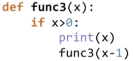
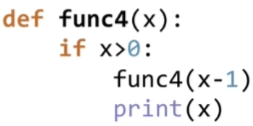

# 1 时间复杂度

## 1.1 时间复杂度概念

* 时间复杂度：用来评估算法运算效率的一个式子
  * 时间复杂度记为$$O({\log_2n})$$或$$O(logn)$$
  * 当算法过程出现循环折半的时候，复杂度式子中会出现$$logn$$
* 时间复杂度是用来估计算法运行时间的一个式子（单位）
* 一般来说，时间复杂度高的算法比复杂度低的算法慢
* 常见的时间复杂度（按效率排序）
  * **$$O(1)<O(logn)<O(n)<O(nlogn)<O(n^2)<O(n^2logn)<O(n^3)$$**
* 复杂问题的时间复杂度
  * $$O(n!)\quad O(2^n)\quad O(n^n)$$

## 1.2 判断时间复杂度

* 快速判断时间算法复杂度（适用于绝大多数简单情况）
  * 确定问题规模n
  * 循环减半过程 –> $logn$
  * k层关于n的循环 –> $n^k$
* 复杂情况：根据算法执行过程判断

## 1.3 空间复杂度

* 空间复杂度：用来评估算法内存占用大小的式子
* 空间复杂度的表示方式与时间复杂度完全一样
  * 算法使用了几个变量：$O(1)$
  * 算法使用了长度为n的一维列表：$O(n)$                                                                                    
  * 算法使用了m行n列的二维列表：$O(mn)$
* 空间换时间

# 2 递归

## 2.1 特点

* 调用自身
* 结束条件

​                    


​                    

* func3结果为 3 2 1
* func4结果为 1 2 3

## 2.2 递归实例：汉诺塔问题

```python
def hanoi(n, a, b, c):
    if n > 0:
        hanoi(n - 1, a, c, b)
        print("moving from %s to %s" % (a, c))
        hanoi(n - 1, b, a, c)


hanoi(3, 'A', 'B', 'C')
# 结果：
# moving from A to C
# moving from A to B
# moving from C to B
# moving from A to C
# moving from B to A
# moving from B to C
# moving from A to C
```

* 汉诺塔移动次数的递推式：$h(x)=2h(x-1)+1$
* $h(64)=18446744073709551615$
* 假设婆罗门每秒钟搬一个盘子，则总共需要5800亿年

# 3 列表查找

## 3.1 查找概念

* 查找：在一些数据元素中，通过一定的方法找出与给定关键字相同的数据元素的过程
* 列表查找（线性表查找）：从列表中查找指定元素
  * 输入：列表、待查找元素
  * 
