# 自然语言处理（NLP）讲义

## 一、NLP概述

### 1. NLP的定义

NLP（Nature Language Processing，自然语言处理）是计算机学科及人工智能领域一个重要的子学科，它主要研究计算机如何处理、理解及应用人类语言。所谓自然语言，指人说的话、人写的文章，是人类在长期进化过程中形成的一套复杂的符号系统（类似于C/Java等计算机语言则称为人造语言）。以下是关于自然语言处理常见的定义：

- 自然语言处理是计算机科学与语言中关于计算机与人类语言转换的领域。——中文维基百科
- 自然语言处理是人工智能领域中一个重要的方向。它研究实现人与计算机之间用自然语言进行有效沟通的各种理论和方法。——百度百科
- 自然语言处理研究在人与人交际中及人与计算机交际中的语言问题的一门学科。NLP要研制表示语言能力和语言应用的模型，建立计算机框架来实现这些语言模型，提出相应的方法来不断完善这种模型，并根据语言模型设计各种实用系统，以及对这些系统的评测技术。——Bill Manaris，《从人机交互的角度看自然语言处理》

自然语言处理还有其它一些名称，例如：自然语言理解（Natural Language Understanding），计算机语言学（Computational Linguistics），人类语言技术（Human Language Technology）等等。


### 2. NLP的主要任务

NLP的主要任务可以分为两大类，一类是基于现有文本或语料的分析，另一类是生成新的文本或语料。

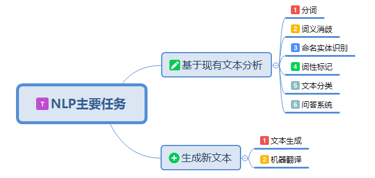

#### 1）分词

该任务将文本或语料分隔成更小的语言单元（例如，单词）。对于拉丁语系，词语之间有空格分隔，对于中文、日文等语言，分词就是一项重要的基本任务，分词直接影响对文本语义的理解。例如：

```
文本：吉林市长春药店
分词1：吉林市/长春/药店
分词2：吉林/市长/春药/店
```

#### 2）词义消歧

词义消歧是识别单词正确含义的任务。例如，在句子“The dog <u>barked</u> at the mailman”（狗对邮递员吠叫）和“Tree <u>bark</u> is sometimes used as a medicine”（树皮有时用作药物）中，单词bark有两种不同的含义。词义消歧对于诸如问答之类的任务至关重要。

#### 3）命名实体识别（NER）

NER尝试从给定的文本主体或文本语料库中提取实体（例如，人物、位置和组织）。例如，句子：

```
John gave Mary two apples at school on Monday
```

将转换为：


#### 4）词性标记（PoS）

PoS标记是将单词分配到各自对应词性的任务。它既可以是名词、动词、形容词、副词、介词等基本词、也可以是专有名词、普通名词、短语动词、动词等。

#### 5）文本分类

文本分类有许多应用场景，例如垃圾邮件检测、新闻文章分类（例如，政治、科技和运动）和产品评论评级（即正向或负向）。我们可以用标记数据（即人工对评论标上正面或负面的标签）训练一个分类模型来实现这项任务。

#### 6）语言生成

可以利用NLP模型来生成新的文本或语料，例如机器写作（天气预报、新闻报道、模仿唐诗），生成文本摘要等。以下是一段机器合成的"诗"：

```
向塞唯何近，空令极是辞。向睹一我扇，猛绶临来惊。
向面炎交好，荷莎正若隳。即住长非乱，休分去此垂。
却定何人改，松仙绕绮霞。偶笑寒栖咽，长闻暖顶时。
失个亦垂谏，守身丈韦鸿。忆及他年事，应愁一故名。
坐忆山高道，为随夏郭间。到乱唯无己，千方得命赊。
```

#### 5）问答（QA）系统

QA技术具有很高的商业价值，这些技术是聊天机器人和VA（例如，Google Assistant和Apple Siri）的基础。许多公司已经采用聊天机器人来提供客户支持。以下是一段与聊天机器人的对话：


#### 6）机器翻译（MT）

机器翻译（Machine Translation，MT）指将文本由一种语言翻译成另一种语言，本质是根据一个序列，生成语义最相近的另一种语言序列。


### 3. NLP的发展历程

NLP的发展轨迹为：基于规则 → 基于统计 → 基于深度学习，其发展大致经历了4个阶段：1956年以前的萌芽期；1957~1970年的快速发展期；1971~1993年的低速发展期；1994年至今的复苏融合期。

#### 1）萌芽期（1956年以前）

- 1946年：第一台电子计算机诞生
- 1948年：Shannon把离散马尔可夫过程的概率模型应用于描述语言的自动机。接着，他又把热力学中“熵”(entropy)的概念引用于语言处理的概率算法中
- 1956年：Chomsky又提出了上下文无关语法，并把它运用到自然语言处理中

#### 2）快速发展期（1957~1970）

自然语言处理在这一时期很快融入了人工智能的研究领域中。由于有基于规则和基于概率这两种不同方法的存在，自然语言处理的研究在这一时期分为了两大阵营。一个是基于规则方法的符号派(symbolic)，另一个是采用概率方法的随机派(stochastic)。这一时期，两种方法的研究都取得了长足的发展。从50年代中期开始到60年代中期，以Chomsky为代表的符号派学者开始了形式语言理论和生成句法的研究，60年代末又进行了形式逻辑系统的研究。而随机派学者采用基于贝叶斯方法的统计学研究方法，在这一时期也取得了很大的进步。

这一时期的重要研究成果包括1959年宾夕法尼亚大学研制成功的TDAP系统，布朗美国英语语料库的建立等。1967年美国心理学家Neisser提出认知心理学的概念，直接把自然语言处理与人类的认知联系起来了。

#### 3）低速发展期（1971~1993）

随着研究的深入，由于人们看到基于自然语言处理的应用并不能在短时间内得到解决，而一连串的新问题又不断地涌现，于是，许多人对自然语言处理的研究丧失了信心。从70年代开始，自然语言处理的研究进入了低谷时期。
但尽管如此，一些研究人员依旧坚持继续着他们的研究。由于他们的出色工作，自然语言处理在这一低谷时期同样取得了一些成果。70年代，基于隐马尔可夫模型(Hidden Markov Model, HMM)的统计方法在语音识别领域获得成功。80年代初，话语分析(Discourse Analysis)也取得了重大进展。之后，由于自然语言处理研究者对于过去的研究进行了反思，有限状态模型和经验主义研究方法也开始复苏。

#### 4）复苏融合期（1994年至今）

90年代中期以后，有两件事从根本上促进了自然语言处理研究的复苏与发展。一件事是90年代中期以来，计算机的速度和存储量大幅增加，为自然语言处理改善了物质基础，使得语音和语言处理的商品化开发成为可能；另一件事是1994年Internet商业化和同期网络技术的发展使得基于自然语言的信息检索和信息抽取的需求变得更加突出。以下列举除了2000年之后NLP领域的几个里程碑事件：

- 2001年：神经语言模型

- 2008年：多任务学习

- 2013年： Word嵌入

- 2013年：NLP的神经网络

- 2014年：序列到序列模型

- 2015年：注意力机制

- 2015年：基于记忆的神经网络

- 2018年：预训练语言模型

  

### 4. NLP的困难与挑战

#### 1）语言歧义

**不同分词导致的歧义**

```
例如：自动化研究所取得的成就
理解一：自动化 / 研究 / 所 / 取得 / 的 / 成就
理解二：自动化 / 研究所 / 取得 / 的 / 成就
```

**词性歧义**

```
动物保护警察
```

“保护”理解成动词、名词，语义不一样

**结构歧义**

```
喜欢乡下的孩子
关于鲁迅的文章
```

**语音歧义**

```
节假日期间，所有博物馆全部（不）对外开放
```

#### 2）不同语言结构差异


#### 3）未知语言不可预测性

语言在不断演化，每年都有为数不少的新词语、新语料出现，给一些NLP处理任务造成困难。以下列举了几个2021年网络上出现的新词语：

```
双减
元宇宙
绝绝子
躺平
```

#### 4）语言表达的复杂性

```
甲：你这是什么意思？
乙：没什么意思，意思意思。
甲：你这就不够意思了。
乙：小意思，小意思。
甲：你这人真有意思。
乙：其实也没有别的意思。
甲：那我就不好意思了。
```

#### 5）机器处理语言缺乏背景与常识

```
中国国家队比赛最没悬念的是乒乓球和足球，他们一个谁也打不过，另一个谁也打不过
如果希拉里当选，她就是全世界唯一一个干过美国总统和干过美国总统的女人，克林顿也将成为全世界唯一一个干过美国总统和干过美国总统的男人
```


### 5. NLP相关知识构成

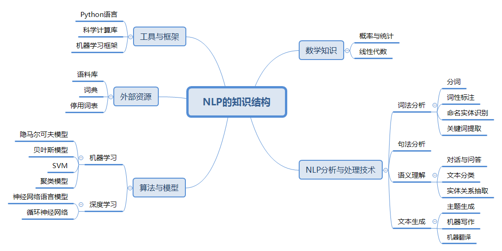


### 6. 语料库

#### 1）什么是语料库

语料库（corpus）是指存放语言材料的仓库。现代的语料库是指存放在计算机里的原始语料文本或经过加工后带有语言学信息标注的语料文本。以语言的真实材料为基础来呈现语言知识，反映语言单位的用法和意义，基本以知识的原型形态表现——语言的原貌。

#### 2）语料库的特征

- 语料库中存放的是实际中真实出现过的语言材料
- 语料库是以计算机为载体承载语言知识的基础资源，但不等于语言知识
- 真实语料需要经过分析、处理和加工，才能成为有用的资源

#### 3）语料库的作用

- 支持语言学研究和语言教学研究
- 支持NLP系统的开发

#### 4）常用语料库介绍

- 北京大学计算机语言所语料库标记（中文），地址：http://opendata.pku.edu.cn/dataverse/icl

- London-Lund英语口语语料库,地址：http://www.helsinki.fi/varieng/CoRD/copora.LLC/

- 腾讯中文语料库。包含800多万个中文词汇，其中每个词对应一个200维的向量，覆盖很多现代词汇，包括最近一两年出现的新词。采用了更大规模的数据和更好算法。https://ai.tencent.com/ailab/nlp/data/Tencent_AILab_ChineseEmbedding.tar.gz
- 中文维基百科语料库。维基百科是最常用且权威的开放网络数据集之一，作为极少数人工编辑、内容丰富、格式规范的文本语料，各类语言的维基百科在NLP中广泛应用。


## 二、传统NLP处理技术

### 1. 中文分词

中文分词是一项重要的基本任务，分词直接影响对文本语义的理解。分词主要有基于规则的分词、基于统计的分词和混合分词。基于规则的分词主要是通过维护词典，在切分语句时，将语句的每个子字符串与词表中的词语进行匹配，找到则切分，找不到则不切分；基于统计的分词，主要是基于统计规则和语言模型，输出一个概率最大的分词序列（由于所需的知识尚未讲解，此处暂不讨论）；混合分词就是各种分词方式混合使用，从而提高分词准确率。下面介绍基于规则的分词。

#### 1）正向最大匹配法

正向最大匹配法（Forward Maximum Matching，FMM）是按照从前到后的顺序对语句进行切分，其步骤为：

- 从左向右取待分汉语句的m个字作为匹配字段，m为词典中最长词的长度；
- 查找词典进行匹配；
- 若匹配成功，则将该字段作为一个词切分出去；
- 若匹配不成功，则将该字段最后一个字去掉，剩下的字作为新匹配字段，进行再次匹配；
- 重复上述过程，直到切分所有词为止。

#### 2）逆向最大匹配法

逆向最大匹配法（Reverse Maximum Matching， RMM）基本原理与FMM基本相同，不同的是分词的方向与FMM相反。RMM是从待分词句子的末端开始，也就是从右向左开始匹配扫描，每次取末端m个字作为匹配字段，匹配失败，则去掉匹配字段前面的一个字，继续匹配。

#### 3）双向最大匹配法

双向最大匹配法（Bi-directional Maximum Matching，Bi-MM）是将正向最大匹配法得到的分词结果和逆向最大匹配法得到的结果进行比较，然后按照最大匹配原则，选取词数切分最少的作为结果。双向最大匹配的规则是：

- 如果正反向分词结果词数不同，则取分词数量少的那个；

- 分词结果相同，没有歧义，返回任意一个；分词结果不同，返回其中单字数量较少的那个。


【示例1】正向最大匹配分词法

```python
# 正向最大匹配分词示例
class MM(object):
    def __init__(self):
        self.window_size = 3

    def cut(self, text):
        result = [] # 分词结果
        start = 0 # 起始位置
        text_len = len(text) # 文本长度

        dic = ["吉林", "吉林市", "市长", "长春", "春药", "药店"]

        while text_len > start:
            for size in range(self.window_size + start, start, -1): # 取最大长度，逐步比较减小
                piece = text[start:size] # 切片
                if piece in dic: # 在字典中
                    result.append(piece) # 添加到列表
                    start += len(piece)
                    break
                else: # 没在字典中，什么都不做
                    if len(piece) == 1:
                        result.append(piece) # 单个字成词
                        start += len(piece)

        return result

if __name__ == "__main__":
    text = "吉林市长春药店"
    tk = MM() # 实例化对象
    result = tk.cut(text)
    print(result)
```

执行结果：

```
['吉林市', '长春', '药店']
```


【示例2】逆向最大匹配分词法

```python
# 逆向最大匹配分词示例
class RMM(object):
    def __init__(self):
        self.window_size = 3

    def cut(self, text):
        result = [] # 分词结果
        start = len(text) # 起始位置
        text_len = len(text) # 文本长度

        dic = ["吉林", "吉林市", "市长", "长春", "春药", "药店"]

        while start > 0:
            for size in range(self.window_size, 0, -1):
                piece = text[start-size:start] # 切片
                if piece in dic: # 在字典中
                    result.append(piece) # 添加到列表
                    start -= len(piece)
                    break
                else: # 没在字典中
                    if len(piece) == 1:
                        result.append(piece) # 单个字成词
                        start -= len(piece)
                        break
        result.reverse()
        return result

if __name__ == "__main__":
    text = "吉林市长春药店"
    tk = RMM() # 实例化对象
    result = tk.cut(text)
    print(result)
```

执行结果：

```
['吉林市', '长春', '药店']
```


【示例3】Jieba库分词

Jieba是一款开源的、功能丰富、使用简单的中文分词工具库，它提供了三种分词模式：

- 精确模式：试图将句子最精确地分词，适合文本分析
- 全模式：把句子中所有可以成词的词语分割出来，速度快，但有重复词和歧义
- 搜索引擎模式：在精确模式基础上，对长词再次切分，提高召回率，适合用于搜索引擎分词

使用Jieba库之前，需要进行安装：

```
pip install jieba==0.42.1
```

分词示例代码如下：

```python
# jieba分词示例
import jieba

text = "吉林市长春药店"

# 全模式
seg_list = jieba.cut(text, cut_all=True)
for word in seg_list:
    print(word, end="/")
print()

# 精确模式
seg_list = jieba.cut(text, cut_all=False)
for word in seg_list:
    print(word, end="/")
print()

# 搜索引擎模式
seg_list = jieba.cut_for_search(text)
for word in seg_list:
    print(word, end="/")
print()
```

执行结果：

```
吉林/吉林市/市长/长春/春药/药店/
吉林市/长春/药店/
吉林/吉林市/长春/药店/
```


【示例4】文本高频词汇提取

```python
# 通过tf-idf提取高频词汇
import glob
import random
import jieba


# 读取文件内容
def get_content(path):
    with open(path, "r", encoding="gbk", errors="ignore") as f:
        content = ""
        for line in f.readlines():
            line = line.strip()
            content += line
        return content


# 统计词频，返回最高前10位词频列表
def get_tf(words, topk=10):
    tf_dict = {}

    for w in words:
        if w not in tf_dict.keys():
            tf_dict[w] =  1 
        else:
            num = tf_dict[w]
            num += 1
            tf_dict[w] =  num

    # 倒序排列
    new_list = sorted(tf_dict.items(), key=lambda x: x[1], reverse=True)

    return new_list[:topk]


# 去除停用词
def get_stop_words(path):
    with open(path, encoding="utf8") as f:
        return [line.strip() for line in f.readlines()]


if __name__ == "__main__":
    # 样本文件
    fname = "d:\\NLP_DATA\\chap_3\\news\\C000008\\11.txt"
    # 读取文件内容
    corpus = get_content(fname)
    # 分词
    tmp_list = list(jieba.cut(corpus))
    # 去除停用词
    stop_words = get_stop_words("d:\\NLP_DATA\\chap_3\\stop_words.utf8")
    split_words = []
    for tmp in tmp_list:
        if tmp not in stop_words:
            split_words.append(tmp)

    # print("样本:\n", corpus)
    print("\n 分词结果: \n" + "/".join(split_words))

    # 统计高频词
    tf_list = get_tf(split_words)
    print("\n top10词 \n:", str(tf_list))
```

执行结果：

```
分词结果:
焦点/个股/苏宁/电器/002024/该股/早市/涨停/开盘/其后/获利盘/抛/压下/略有/回落/强大/买盘/推动/下该/股/已经/再次/封于/涨停/主力/资金/积极/拉升/意愿/相当/强烈/盘面/解析/技术/层面/早市/指数/小幅/探低/迅速/回升/中石化/强势/上扬/带动/指数/已经/成功/翻红/多头/实力/之强/令人/瞠目结舌/市场/高度/繁荣/情形/投资者/需谨慎/操作/必竟/持续/上攻/已经/消耗/大量/多头/动能/盘中/热点/来看/相比/周二/略有/退温/依然/看到/目前/热点/效应/外扩散/迹象/相当/明显/高度/活跌/板块/已经/前期/有色金属/金融/地产股/向外/扩大/军工/概念/航天航空/操作/思路/短线/依然/需/规避/一下/技术性/回调/风险/盘中/切记/不可/追高

top10词:
 [('已经', 4), ('早市', 2), ('涨停', 2), ('略有', 2), ('相当', 2), ('指数', 2), ('多头', 2), ('高度', 2), ('操作', 2), ('盘中', 2)]
```


### 2. 词性标注

#### 1）什么是词性标注

词性是词语的基本语法属性，通常也称为词类。词性标注是判定给定文本或语料中每个词语的词性。有很多词语在不同语境中表现为不同的词性，这就为词性标注带来很大的困难。另一方面，从整体上看，大多数词语，尤其是实词，一般只有一到两个词性，其中一个词性的使用频率远远大于另一个。

#### 2）词性标注的原理

词性标注最主要方法同分词一样，将其作为一个序列生成问题来处理。使用序列模型，根据输入的文本，生成一个对应的词性序列。

#### 3）词性标注规范

词性标注要有一定的标注规范，如将名词、形容词、动词表示为"n", "adj", "v"等。中文领域尚无统一的标注标准，较为主流的有北大词性标注集和宾州词性标注集。以下是北大词性标注集部分词性表示：


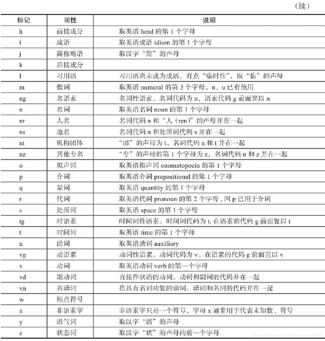

#### 4）经典序列模型：HMM

隐马尔可夫模型（Hidden Markov Model，HMM）是关于时间序列的概率模型，描述一个隐藏的马尔可夫链随机生成不可观测的状态随机序列，再由各个状态生成一个观测从而产生观测随机序列的过程，是一个双随机过程序列模型。以下是一个双随机序列示例：

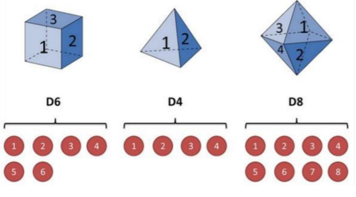


HMM模型包含三个要素：

- 初始概率：$\pi=(0.2, 0.4, 0.4)$
- 转移概率：在不同状态间转换的概率，例如：$P_{AA}=0.8, P_{AB}=0.1, ...$
- 转移矩阵：

$$  A = \left[
\begin{matrix}
0.8 \ \ 0.1 \ \ 0.1 \\
0.5 \ \ 0.1 \ \ 0.4 \\
0.5 \ \ 0.3 \ \ 0.2 \\
\end{matrix}
\right] $$


HMM模型的三个基本问题：

- 概率计算问题。给定初始$\lambda =(A, B, \pi)$和观测序列，计算该模型观测序列出现的概率，概率计算问题使用前向算法、后向算法
- 学习问题。已知观测序列，估计模型参数$\lambda =(A, B, \pi)$，学习问题使用Baum-Welch算法
- 解码问题。已知模型参数$\lambda =(A, B, \pi)$和观测序列，求条件概率最大的状态序列，解码问题使用Viterbi算法


HMM的应用：

- 语音识别：输入语音序列（观测序列），输出文字序列（隐藏序列）

- 分词：输入原始文本，输出分词序列

- 词性标记：输入词语列表，输出词性列表

  

#### 5）Jieba库词性标注

Jieba库提供了词性标注功能，采用结合规则和统计的方式，具体为在词性标注的过程中，词典匹配和HMM共同作用。词性标注流程如下：

第一步：根据正则表达式判断文本是否为汉字；

第二步：如果判断为汉字，构建HMM模型计算最大概率，在词典中查找分出的词性，若在词典中未找到，则标记为"未知"；

第三步：若不如何上面的正则表达式，则继续通过正则表达式进行判断，分别赋予"未知"、”数词“或"英文"。

【示例】Jieba库实现词性标注

```python
import jieba.posseg as psg


def pos(text):
    results = psg.cut(text)
    for w, t in results:
        print("%s/%s" % (w, t), end=" ")
    print("")


text = "呼伦贝尔大草原"
pos(text)

text = "梅兰芳大剧院里星期六晚上有演出"
pos(text)
```

执行结果：

```
呼伦贝尔/nr 大/a 草原/n 
梅兰芳/nr 大/a 剧院/n 里/f 星期六/t 晚上/t 有/v 演出/v 
```


### 3. 命名实体识别（NER）

命名实体识别（Named Entities Recognition，NER）也是自然语言处理的一个基础任务，是信息抽取、信息检索、机器翻译、问答系统等多种自然语言处理技术必不可少的组成部分。其目的是识别语料中人名、地名、组织机构名等命名实体，实体类型包括3大类（实体类、时间类和数字类）和7小类（人名、地名、组织机构名、时间、日期、货币和百分比）。中文命名实体识别主要有以下难点：

（1）各类命名实体的数量众多。

（2）命名实体的构成规律复杂。

（2）嵌套情况复杂。

（4）长度不确定。

命名实体识别方法有：

（1）基于规则的命名实体识别。规则加词典是早期命名实体识别中最行之有效的方式。其依赖手工规则的系统，结合命名实体库，对每条规则进行权重赋值，然后通过实体与规则的相符情况来进行类型判断。这种方式可移植性差、更新维护困难等问题。

（2）基于统计的命名实体识别。基于统计的命名实体识别方法有：隐马尔可夫模型、最大熵模型、条件随机场等。其主要思想是基于人工标注的语料，将命名实体识别任务作为序列标注问题来解决。基于统计的方法对语料库的依赖比较大，而可以用来建设和评估命名实体识别系统的大规模通用语料库又比较少，这是该方法的一大制约。

（3）基于深度学习的方法。利用深度学习模型，预测词（或字）是否为命名实体，并预测出起始、结束位置。

（4）混合方法。将前面介绍的方法混合使用。

命名实体识别在深度学习部分有专门案例进行探讨和演示。


### 4. 关键词提取

关键词提取是提取出代表文章重要内容的一组词，对文本聚类、分类、自动摘要起到重要作用。此外，关键词提取还能使人们便捷地浏览和获取信息。现实中大量文本不包含关键词，自动提取关检测技术具有重要意义和价值。关键词提取包括有监督学习、无监督学习方法两类。

有监督关键词提取。该方法主要通过分类方式进行，通过构建一个较为丰富完整的词表，然后通过判断每个文档与词表中每个词的匹配程度，以类似打标签的方式，达到关键词提取的效果。该方法能获取较高的精度，但需要对大量样本进行标注，人工成本过高。另外，现在每天都有大量新的信息出现，固定词表很难将新信息内容表达出来，但人工实时维护词表成本过高。所以，有监督学习关键词提取方法有较明显的缺陷。

无监督关键词提取。相对于有监督关键词提取，无监督方法对数据要求低得多，既不需要人工维护词表，也不需要人工标注语料辅助训练。因此，在实际应用中更受青睐。这里主要介绍无监督关键词提取算法，包括TF-IDF算法，TextRank算法和主题模型算法。

#### 1）TF-IDF算法

TF-IDF（Term Frequency-Inverse Document Frequency，词频-逆文档频率）是一种基于传统的统计计算方法，常用于评估一个文档集中一个词对某份文档的重要程度。其基本思想是：一个词语在文档中出现的次数越多、出现的文档越少，语义贡献度越大（对文档区分能力越强）。TF-IDF表达式由两部分构成，词频、逆文档频率。词频定义为：
$$
TF_{ij} = \frac{n_{ji}}{\sum_k n_{kj}}
$$
其中，$n_{ij}$表示词语i在文档j中出现的次数，分母$\sum_k n_{kj}$表示所有文档总次数。逆文档频率定义为：
$$
IDF_i = log(\frac{|D|}{|D_i| + 1})
$$
其中，$|D|$为文档总数，$D_i$为文档中出现词i的文档数量，分母加1是避免分母为0的情况（称为拉普拉斯平滑），TF-IDF算法是将TF和IDF综合使用，表达式为：
$$
TF-IDF = TF_{ij} \times IDF_i =\frac{n_{ji}}{\sum_k n_{kj}} \times log(\frac{|D|}{|D_i| + 1})
$$
由公式可知，词频越大，该值越大；出现的文档数越多（说明该词越通用），逆文档频率越接近0，语义贡献度越低。例如有以下文本：

```
世界献血日，学校团体、献血服务志愿者等可到血液中心参观检验加工过程，我们会对检验结果进行公示，同时血液的价格也将进行公示。
```

以上文本词语总数为30，计算几个词的词频：
$$
TF_{献血} = 2 / 30 \approx 0.067 \\ 
TF_{血液} = 2 / 30 \approx 0.067 \\ 
TF_{进行} = 2 / 30 \approx 0.067 \\ 
TF_{公示} = 2 / 30 \approx 0.067
$$
假设出现献血、血液、进行、公示文档数量分别为10、15、100、50，根据TF-IDF计算公式，得：
$$
TF-IDF_{献血} = 0.067 * log(1000/10) = 0.067 * 2 = 0.134\\ 
TF-IDF_{血液} = 0.067 * log(1000/15) = 0.067 * 1.824 = 0.1222 \\ 
TF-IDF_{进行} = 0.067 * log(1000/100) = 0.067 * 1 = 0.067 \\ 
TF-IDF_{公示} = 0.067 * log(1000/50) = 0.067 * 1.30 = 0.08717
$$
“献血”、“血液”的TF-IDF值最高，所以为最适合这篇文档的关键词。

#### 2）TextRank算法

与TF-IDF不一样，TextRank算法可以脱离于语料库，仅对单篇文档进行分析就可以提取该文档的关键词，这也是TextRank算法的一个重要特点。TextRank算法最早用于文档的自动摘要，基于句子维度的分析，利用算法对每个句子进行打分，挑选出分数最高的n个句子作为文档的关键句，以达到自动摘要的效果。

TextRank算法的基本思想来源于Google的PageRank算法，该算法是Google创始人拉里·佩奇和希尔盖·布林于1997年构建早期的搜索系统原型时提出的链接分析法，用于评价搜索系统各覆盖网页重要性的一种方法。随着Google的成功，该算法也称为其它搜索引擎和学术界十分关注的计算模型。

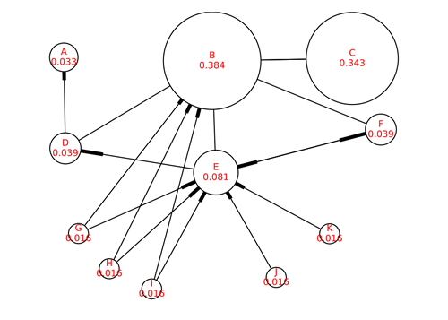

PageRank基本思想有两条：

- 链接数量。一个网页被越多的其它网页链接，说明这个网页越重要
- 链接质量。一个网页被一个越高权值的网页链接，也能表名这个网页越重要

基于上述思想，一个网页的PageRank计算公式可以表示为：
$$
S(V_i) = \sum_{j \in In(V_i)} \Bigg( \frac{1}{Out(V_j)} \times S(V_j) \Bigg)
$$
其中，$In(V_i)$为$V_i$的入链集合，$Out(V_j)$为$V_j$的出链集合，$|Out(V_j)|$为出链的数量。因为每个网页要将它自身的分数平均贡献给每个出链，则$\Bigg( \frac{1}{Out(V_j)} \times S(V_j) \Bigg)$即为$V_i$贡献给$V_j$的分数。将所有入链贡献给它的分数全部加起来，就是$V_i$自身的得分。算法开始时，将所有页面的得分均初始化为1。

对于一些孤立页面，可能链入、链出的页面数量为0，为了避免这种情况，对公式进行了改造，加入了一个阻尼系数$d$，这样，即使孤立页面也有一个得分。改造后的公式如下：
$$
S(V_i) = (1 - d) + d \times \sum_{j \in In(V_i)} \Bigg( \frac{1}{Out(V_j)} \times S(V_j) \Bigg)
$$
以上就是PageRank的理论，也是TextRank的理论基础，不同于的是TextRank不需要与文档中的所有词进行链接，而是采用一个窗口大小，在窗口中的词互相都有链接关系。例如对下面的文本进行窗口划分：

```
世界献血日，学校团体、献血服务志愿者等可到血液中心参观检验加工过程，我们会对检验结果进行公示，同时血液的价格也将进行公示。
```

如果将窗口大小设置为5，则可得到如下计算窗口：

```
[世界，献血，日，学校，团体]
[献血，日，学校，团体，献血]
[日，学校，团体，献血，服务]
[学校，团体，献血，服务，志愿者]
……
```

每个窗口内所有词之间都有链接关系，如[世界]和[献血，日，学校，团体]之间有链接关系。得到了链接关系，就可以套用TextRank公式，计算每个词的得分，最后选择得分最高的N个词作为文档的关键词。

#### 3）关键词提取示例

本案例演示了通过自定义TF-IDF、调用TextRank API实现关键字提取

```python
# -*- coding: utf-8 -*-

import math
import jieba
import jieba.posseg as psg
from gensim import corpora, models
from jieba import analyse
import functools
import numpy as np


# 停用词表加载方法
def get_stopword_list():
    # 停用词表存储路径，每一行为一个词，按行读取进行加载
    # 进行编码转换确保匹配准确率
    stop_word_path = '../data/stopword.txt'
    with open(stop_word_path, "r", encoding="utf-8") as f:
        lines = f.readlines()

    stopword_list = [sw.replace('\n', '') for sw in lines]
    return stopword_list


# 去除停用词
def word_filter(seg_list):
    filter_list = []
    for word in seg_list:
        # 过滤停用词表中的词，以及长度为<2的词
        if not word in stopword_list and len(word) > 1:
            filter_list.append(word)

    return filter_list


# 数据加载，pos为是否词性标注的参数，corpus_path为数据集路径
def load_data(corpus_path):
    # 调用上面方式对数据集进行处理，处理后的每条数据仅保留非干扰词
    doc_list = []
    for line in open(corpus_path, 'r', encoding='utf-8'):  # 循环读取一行(一行即一个文档)
        content = line.strip()  # 去空格
        seg_list = jieba.cut(content)  # 分词
        filter_list = word_filter(seg_list)  # 去除停用词
        doc_list.append(filter_list)  # 将分词后的内容添加到列表

    return doc_list


# idf值统计方法
def train_idf(doc_list):
    idf_dic = {}
    tt_count = len(doc_list)  # 总文档数

    # 每个词出现的文档数
    for doc in doc_list:
        doc_set = set(doc)  # 将词推入集合去重
        for word in doc_set:  # 词语在文档中
            idf_dic[word] = idf_dic.get(word, 0.0) + 1.0  # 文档数加1

    # 按公式转换为idf值，分母加1进行平滑处理
    for word, doc_cnt in idf_dic.items():
        idf_dic[word] = math.log(tt_count / (1.0 + doc_cnt))

    # 对于没有在字典中的词，默认其仅在一个文档出现，得到默认idf值
    default_idf = math.log(tt_count / (1.0))

    return idf_dic, default_idf


# TF-IDF类
class TfIdf(object):
    def __init__(self, idf_dic, default_idf, word_list, keyword_num):
        """
        TfIdf类构造方法
        :param idf_dic: 训练好的idf字典
        :param default_idf: 默认idf值
        :param word_list: 待提取文本
        :param keyword_num: 关键词数量
        """
        self.word_list = word_list
        self.idf_dic, self.default_idf = idf_dic, default_idf # 逆文档频率
        self.tf_dic = self.get_tf_dic()  # 词频
        self.keyword_num = keyword_num

    # 统计tf值
    def get_tf_dic(self):
        tf_dic = {}  # 词频字典
        for word in self.word_list:
            tf_dic[word] = tf_dic.get(word, 0.0) + 1.0

        total = len(self.word_list)  # 词语总数
        for word, word_cnt in tf_dic.items():
            tf_dic[word] = float(word_cnt) / total

        return tf_dic

    # 按公式计算tf-idf
    def get_tfidf(self):
        tfidf_dic = {}
        for word in self.word_list:
            idf = self.idf_dic.get(word, self.default_idf)
            tf = self.tf_dic.get(word, 0)

            tfidf = tf * idf  # 计算TF-IDF
            tfidf_dic[word] = tfidf

        # 根据tf-idf排序，去排名前keyword_num的词作为关键词
        s_list = sorted(tfidf_dic.items(), key=lambda x: x[1], reverse=True)
        # print(s_list)
        top_list = s_list[:self.keyword_num]  # 切出前N个
        for k, v in top_list:
            print(k + ", ", end='')
        print()


def tfidf_extract(word_list, keyword_num=20):
    doc_list = load_data('../data/corpus.txt')  # 读取文件内容
    # print(doc_list)
    idf_dic, default_idf = train_idf(doc_list) # 计算逆文档频率

    tfidf_model = TfIdf(idf_dic, default_idf, word_list, keyword_num)
    tfidf_model.get_tfidf()


def textrank_extract(text, keyword_num=20):
    keywords = analyse.textrank(text, keyword_num)
    # 输出抽取出的关键词
    for keyword in keywords:
        print(keyword + ", ", end='')
    print()


if __name__ == '__main__':
    global stopword_list

    text = """在中国共产党百年华诞的重要时刻，在“两个一百年”奋斗目标历史交汇关键节点，
    党的十九届六中全会的召开具有重大历史意义。全会审议通过的《决议》全面系统总结了党的百年奋斗
    重大成就和历史经验，特别是着重阐释了党的十八大以来党和国家事业取得的历史性成就、发生的历史性变革，
    充分彰显了中国共产党的历史自觉与历史自信。"""

    stopword_list = get_stopword_list()

    seg_list = jieba.cut(text)  # 分词
    filter_list = word_filter(seg_list)

    # TF-IDF提取关键词
    print('TF-IDF模型结果：')
    tfidf_extract(filter_list)

    # TextRank提取关键词
    print('TextRank模型结果：')
    textrank_extract(text)
```

执行结果：

```
TF-IDF模型结果：
历史, 中国共产党, 百年, 历史性, 华诞, 一百年, 奋斗目标, 交汇, 节点, 十九, 六中全会, 全会, 奋斗, 重大成就, 着重, 阐释, 十八, 党和国家, 成就, 变革, 

TextRank模型结果：
历史, 历史性, 意义, 成就, 决议, 审议, 发生, 系统, 总结, 全面, 节点, 关键, 交汇, 召开, 具有, 全会, 取得, 事业, 自信, 变革, 
```


### 6. 综合案例

#### 1）垃圾邮件分类

- 数据集介绍：包含5000份正常邮件、5001份垃圾邮件的样本
- 文本特征处理方式：采用TF-IDF作为文本特征值
- 模型选择：朴素贝叶斯、支持向量机模型
- 基本流程：读取数据 → 去除停用词和特殊符号 → 计算TF-IDF特征值 → 模型训练 → 预测 → 打印结果

```python
# -*- coding: utf-8 -*-
# 利用TF-IDF特征、朴素贝叶斯/支持向量机实现垃圾邮件分类
import numpy as np
import re
import string
import sklearn.model_selection as ms
from sklearn.naive_bayes import MultinomialNB
from sklearn.linear_model import SGDClassifier
from sklearn import metrics

import jieba
from sklearn.feature_extraction.text import TfidfVectorizer

label_name_map = ["垃圾邮件", "正常邮件"]


# 分词
def tokenize_text(text):
    tokens = jieba.cut(text)  # 分词
    tokens = [token.strip() for token in tokens]  # 去空格
    return tokens


def remove_special_characters(text):
    tokens = tokenize_text(text)
    # escape函数对字符进行转义处理
    # compile函数用于编译正则表达式，生成一个 Pattern 对象
    pattern = re.compile('[{}]'.format(re.escape(string.punctuation)))
    # filter() 函数用于过滤序列，过滤掉不符合条件的元素，返回由符合条件元素组成的新列表
    # sub函数进行正则匹配字符串替换
    filtered_tokens = filter(None, [pattern.sub('', token) for token in tokens])
    filtered_text = ' '.join(filtered_tokens)
    return filtered_text


# 去除停用词
def remove_stopwords(text):
    tokens = tokenize_text(text)  # 分词、去空格
    filtered_tokens = [token for token in tokens if token not in stopword_list]  # 去除停用词
    filtered_text = ' '.join(filtered_tokens)
    return filtered_text


# 规范化处理
def normalize_corpus(corpus):
    result = []  # 处理结果

    for text in corpus:  # 遍历每个词汇
        text = remove_special_characters(text)  # 去除标点符号
        text = remove_stopwords(text)  # 去除停用词
        result.append(text)

    return result


def tfidf_extractor(corpus):
    vectorizer = TfidfVectorizer(min_df=1,
                                 norm='l2',
                                 smooth_idf=True,
                                 use_idf=True)
    features = vectorizer.fit_transform(corpus)
    return vectorizer, features


def get_data():
    '''
    获取数据
    :return: 文本数据，对应的labels
    '''
    corpus = []  # 邮件内容
    labels = []  # 标签(0-垃圾邮件 1-正常邮件)

    # 正常邮件
    with open("data/ham_data.txt", encoding="utf-8") as f:
        for line in f.readlines():
            corpus.append(line)
            labels.append(1)

    # 垃圾邮件
    with open("data/spam_data.txt", encoding="utf-8") as f:
        for line in f.readlines():
            corpus.append(line)
            labels.append(0)

    return corpus, labels


# 过滤空文档
def remove_empty_docs(corpus, labels):
    filtered_corpus = []
    filtered_labels = []

    for doc, label in zip(corpus, labels):
        if doc.strip():
            filtered_corpus.append(doc)
            filtered_labels.append(label)

    return filtered_corpus, filtered_labels


# 计算并打印分类指标
def print_metrics(true_labels, predicted_labels):
    # Accuracy
    accuracy = metrics.accuracy_score(true_labels, predicted_labels)

    # Precision
    precision = metrics.precision_score(true_labels,
                                        predicted_labels,
                                        average='weighted')

    # Recall
    recall = metrics.recall_score(true_labels,
                                  predicted_labels,
                                  average='weighted')

    # F1
    f1 = metrics.f1_score(true_labels,
                          predicted_labels,
                          average='weighted')

    print("正确率: %.2f, 查准率: %.2f, 召回率: %.2f, F1: %.2f" % (accuracy, precision, recall, f1))


if __name__ == "__main__":
    global stopword_list

    # 读取停用词
    with open("dict/stop_words.utf8", encoding="utf8") as f:
        stopword_list = f.readlines()

    corpus, labels = get_data()  # 加载数据
    corpus, labels = remove_empty_docs(corpus, labels)
    print("总的数据量:", len(labels))

    # 打印前N个样本
    for i in range(10):
        print("label:", labels[i], " 邮件内容:", corpus[i])

    # 对数据进行划分
    train_corpus, test_corpus, train_labels, test_labels = \
        ms.train_test_split(corpus,
                            labels,
                            test_size=0.10,
                            random_state=36)

    # 规范化处理
    norm_train_corpus = normalize_corpus(train_corpus)
    norm_test_corpus = normalize_corpus(test_corpus)

    # tfidf 特征
    ## 先计算tf-idf
    tfidf_vectorizer, tfidf_train_features = tfidf_extractor(norm_train_corpus)
    ## 再用刚刚训练的tf-idf模型计算测试集tf-idf
    tfidf_test_features = tfidf_vectorizer.transform(norm_test_corpus)
    # print(tfidf_test_features)
    # print(tfidf_test_features)

    # 基于tfidf的多项式朴素贝叶斯模型
    print("基于tfidf的贝叶斯模型")
    nb_model = MultinomialNB()  # 多分类朴素贝叶斯模型
    nb_model.fit(tfidf_train_features, train_labels)  # 训练
    mnb_pred = nb_model.predict(tfidf_test_features)  # 预测
    print_metrics(true_labels=test_labels, predicted_labels=mnb_pred)  # 打印测试集下的分类指标

    print("")

    # 基于tfidf的支持向量机模型
    print("基于tfidf的支持向量机模型")
    svm_model = SGDClassifier()
    svm_model.fit(tfidf_train_features, train_labels)  # 训练
    svm_pred = svm_model.predict(tfidf_test_features)  # 预测
    print_metrics(true_labels=test_labels, predicted_labels=svm_pred)  # 打印测试集下的分类指标

    print("")

    # 打印测试结果
    num = 0
    for text, label, pred_lbl in zip(test_corpus, test_labels, svm_pred):
        print('真实类别:', label_name_map[int(label)], ' 预测结果:', label_name_map[int(pred_lbl)])
        print('邮件内容【', text.replace("\n", ""), '】')
        print("")

        num += 1
        if num == 10:
            break
```

执行结果：

```
基于tfidf的贝叶斯模型
正确率: 0.97, 查准率: 0.97, 召回率: 0.97, F1: 0.97

基于tfidf的支持向量机模型
正确率: 0.98, 查准率: 0.98, 召回率: 0.98, F1: 0.98

真实类别: 正常邮件  预测结果: 正常邮件
邮件内容【 分专业吧，也分导师吧 标  题: Re: 问一个：有人觉得自己博士能混毕业吗 当然很好混毕业了 : 博士读到快中期了，始终感觉什么都不会，文章也没发几篇好的，论文的架构也没有， : 一切跟刚上的时候没有区别。但是事实上我也很辛苦的找资料，做实验，还进公司实习过， : 现在感觉好失败，内心已经放弃了，打算混毕业，不知道过来人有什么高招，请指点一二。 -- 】

真实类别: 垃圾邮件  预测结果: 垃圾邮件
邮件内容【 您好！ 我公司有多余的发票可以向外代开！（国税、地税、运输、广告、海关缴款书）。 如果贵公司（厂）有需要请来电洽谈、咨询！ 联系电话: 01351025****  陈先生 谢谢 顺祝商祺! 】

……
```


## 三、文本表示

### 1. One-hot

One-hot（独热）编码是一种最简单的文本表示方式。如果有一个大小为V的词表，对于第i个词$w_i$，可以用一个长度为V的向量来表示，其中第i个元素为1，其它为0.例如：

```python
减肥：[1, 0, 0, 0, 0]
瘦身：[0, 1, 0, 0, 0]
增重：[0, 0, 1, 0, 0]
```

One-hot词向量构建简单，但也存在明显的弱点：

- 维度过高。如果词数量较多，每个词需要使用更长的向量表示，造成维度灾难；
- 稀疏矩阵。每个词向量，其中只有一位为1，其它位均为零；
- 语义鸿沟。词语之间的相似度、相关程度无法度量。

### 2. 词袋模型

词袋模型(Bag-of-words model，BOW)，BOW模型假定对于一个文档，忽略它的单词顺序和语法、句法等要素，将其仅仅看作是若干个词汇的集合，文档中每个单词的出现都是独立的，不依赖于其它单词是否出现。例如：

```
我把他揍了一顿，揍得鼻青眼肿
他把我揍了一顿，揍得鼻青眼肿
```

构建一个词典：

```python
{"我":0, "把":1, "他":2, "揍":3, "了":4 "一顿":5, "鼻青眼肿":6, "得":7}
```

再将句子向量化，维数和字典大小一致，第i维上的数值代表ID为i的词在句子里出现的频次，两个句子可以表示为：

```python
[1, 1, 1, 2, 1, 1, 1, 1]
[1, 1, 1, 2, 1, 1, 1, 1]
```

词袋模型表示简单，但也存在较为明显的缺点：

- 丢失了顺序和语义。顺序是极其重要的语义信息，词袋模型只统计词语出现的频率，忽略了词语的顺序。例如上述两个句子意思相反，但词袋模型表示却完全一致；
- 高维度和稀疏性。当语料增加时，词袋模型维度也会增加，需要更长的向量来表示。但大多数词语不会出现在一个文本中，所以导致矩阵稀疏。

### 3. TF-IDF

TF-IDF（Term Frequency-Inverse Document Frequency，词频-逆文档频率）是一种基于传统的统计计算方法，常用于评估一个文档集中一个词对某份文档的重要程度。其基本思想是：一个词语在文档中出现的次数越多、出现的文档越少，语义贡献度越大（对文档区分能力越强）。其表达式为：
$$
TF-IDF = TF_{ij} \times IDF_i =\frac{n_{ji}}{\sum_k n_{kj}} \times log(\frac{|D|}{|D_i| + 1})
$$
该指标依然无法保留词语在文本中的位置关系。该指标前面有过详细讨论，此处不再赘述。

### 4. 共现矩阵

共现（co-occurrence）矩阵指通过统计一个事先指定大小的窗口内的词语共现次数，以词语周边的共现词的次数做为当前词语的向量。具体来说，我们通过从大量的语料文本中构建一个共现矩阵来表示词语。例如，有语料如下：

```
I like deep learning.
I like NLP.
I enjoy flying.
```

则共现矩阵表示为：


矩阵定义的词向量在一定程度上缓解了one-hot向量相似度为0的问题，但没有解决数据稀疏性和维度灾难的问题。

### 5. N-Gram表示

N-Gram模型是一种基于统计语言模型，语言模型是一个基于概率的判别模型，它的输入是个句子（由词构成的顺序序列），输出是这句话的概率，即这些单词的联合概率。

N-Gram本身也指一个由N个单词组成的集合，各单词具有先后顺序，且不要求单词之间互不相同。常用的有Bi-gram（N=2）和Tri-gram（N=3）。例如：

句子：L love deep learning

Bi-gram: {I, love}, {love, deep}, {deep, learning}

Tri-gram: {I, love, deep}, {love deep learning}

N-Gram基本思想是将文本里面的内容按照字节进行大小为n的滑动窗口操作，形成了长度是n的字节片段序列。每一个字节片段称为一个gram，对所有gram的出现频度进行统计，并按照事先设置好的频度阈值进行过滤，形成关键gram列表，也就是这个文本向量的特征空间，列表中的每一种gram就是一个特征向量维度。

### 6. 词嵌入

#### 1）什么是词嵌入

词嵌入（word embedding）是一种词的向量化表示方式，该方法将词语映射为一个实数向量，同时保留词语之间语义的相似性和相关性。例如：

|        | Man  | Women | King  | Queen | Apple | Orange |
| ------ | ---- | ----- | ----- | ----- | ----- | ------ |
| Gender | -1   | 1     | -0.95 | 0.97  | 0.00  | 0.01   |
| Royal  | 0.01 | 0.02  | 0.93  | 0.95  | -0.01 | 0.00   |
| Age    | 0.03 | 0.02  | 0.70  | 0.69  | 0.03  | -0.02  |
| Food   | 0.09 | 0.01  | 0.02  | 0.01  | 0.95  | 0.97   |

我们用一个四维向量来表示man，Women，King，Queen，Apple，Orange等词语（在实际中使用更高维度的表示，例如100~300维），这些向量能进行语义的表示和计算。例如，用Man的向量减去Woman的向量值：
$$
e_{man} - e_{woman} = \left[
\begin{matrix}
-1 \\
0.01 \\
0.03 \\
0.09 \\
\end{matrix}
\right] -\left[
\begin{matrix}
1 \\
0.02 \\
0.02 \\
0.01 \\
\end{matrix}
\right] = \left[
\begin{matrix}
-2 \\
-0.01 \\
0.01 \\
0.08 \\
\end{matrix}
\right] \approx \left[
\begin{matrix}
-2 \\
0 \\
0 \\
0 \\
\end{matrix}
\right]
$$
类似地，如果用King的向量减去Queen的向量，得到相似的结果：
$$
e_{king} - e_{queen} = \left[
\begin{matrix}
-0.95 \\
0.93 \\
0.70 \\
0.02 \\
\end{matrix}
\right] -\left[
\begin{matrix}
0.97 \\
0.85 \\
0.69 \\
0.01 \\
\end{matrix}
\right] = \left[
\begin{matrix}
-1.92 \\
-0.02 \\
0.01 \\
0.01 \\
\end{matrix}
\right] \approx \left[
\begin{matrix}
-2 \\
0 \\
0 \\
0 \\
\end{matrix}
\right]
$$
我们可以通过某种降维算法，将向量映射到低纬度空间中，相似的词语位置较近，不相似的词语位置较远，这样能帮助我们更直观理解词嵌入对语义的表示。如下图所示：


实际任务中，词汇量较大，表示维度较高，因此，我们不能手动为大型文本语料库开发词向量，而需要设计一种方法来使用一些机器学习算法（例如，神经网络）自动找到好的词嵌入，以便有效地执行这项繁重的任务。

#### 2）词嵌入的优点

- 特征稠密；
- 能够表征词与词之间的相似度；
- 泛化能力更好，支持语义计算。


## 四、语言模型

### 1. 什么是语言模型

语言模型在文本处理、信息检索、机器翻译、语音识别中承担这重要的任务。从通俗角度来说，语言模型就是通过给定的一个词语序列，预测下一个最可能的词语是什么。传统语言模型有N-gram模型、HMM（隐马尔可夫模型）等，进入深度学习时代后，著名的语言模型有神经网络语言模型（Neural Network Language Model，NNLM），循环神经网络（Recurrent Neural Networks，RNN）等。

语言模型从概率论专业角度来描述就是：为长度为m的字符串确定其概率分布$P(w_1, w_2, ..., w_n)$，其中$w_1$到$w_n$依次表示文本中的各个词语。一般采用链式法则计算其概率值：
$$
P(w_1, w_2, ..., w_n) = P(w_1)P(w_2|w_1)P(w_3|w_1,w_2)...P(w_m|w_1,w_2,...,w_{m-1})
$$
观察上式，可发现，当文本长度过长时计算量过大，所以有人提出N元模型（N-gram）降低计算复杂度。


### 2. N-gram模型

所谓N-gram（N元）模型，就是在计算概率时，忽略长度大于N的上下文词的影响。当N=1时，称为一元模型（Uni-gram Mode），其表达式为：
$$
P(w_1, w_2, ..., w_n) = \prod_{i=1}^m P(w_i)
$$
当N=2时，称为二元模型（Bi-gram Model），其表达式为：
$$
P(w_1, w_2, ..., w_n) = \prod_{i=1}^m P(w_i|w_{i-1})
$$
当N=3时，称为三元模型（Tri-gram Model），其表达式为：
$$
P(w_1, w_2, ..., w_n) = \prod_{i=1}^m P(w_i|w_{i-2}, w_{i-1})
$$
可见，N值越大，保留的词序信息（上下文）越丰富，但计算量也呈指数级增长。


### 3. 神经网络语言模型（NNLM）

 NNLM是利用神经网络对N元条件进行概率估计的一种方法，其基本结构如下图所示：

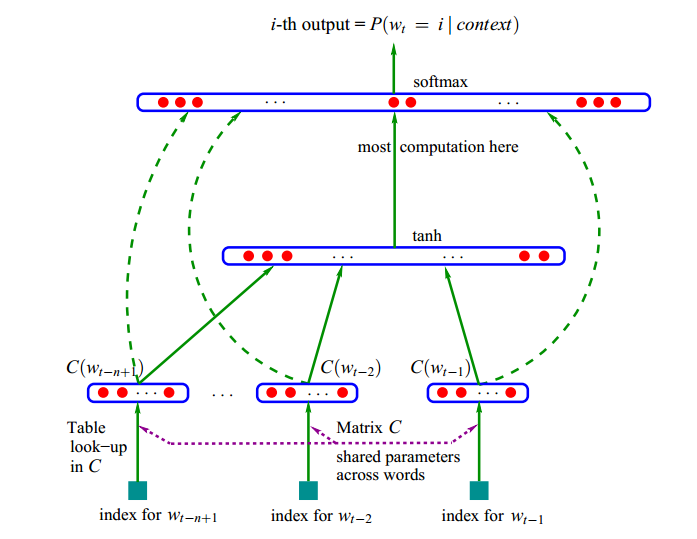

- 输入：前N-1个词语的向量

- 输出：第N个词语的一组概率

- 目标函数：

$$
f(w_t, w_{t-1}, ..., w_{t-n+1}) = p(p_t|w_1^{t-1})
$$

其中，$w_t$表示第t个词，$w_1^{t-1}$表示第1个到第t个词语组成的子序列，每个词语概率均大于0，所有词语概率之和等于1。该模型计算包括两部分：特征映射、计算条件概率

- 特征映射：将输入映射为一个特征向量，映射矩阵$C \in R^{|V| \times m}$
- 计算条件概率分布：通过另一个函数，将特征向量转化为一个概率分布

神经网络计算公式为：
$$
h = tanh(Hx + b) \\
y = Uh + d
$$
H为隐藏层权重矩阵，U为隐藏层到输出层的权重矩阵。输出层加入softmax函数，将y转换为对应的概率。模型参数$\theta$，包括：
$$
\theta = (b, d, H, U, C)
$$


以下是一个计算示例：设词典大小为1000，向量维度为25，N=3，先将前N个词表示成独热向量：

```python
呼：[1,0,0,0,0,...,0]
伦：[0,1,0,0,0,...,0]
贝：[0,0,1,0,0,...,0]
```

输入矩阵为：[3, 1000]

权重矩阵：[1000, 25]

隐藏层：[3, 1000] * [1000, 25] = [3, 25]

输出层权重：[25, 1000]

输出矩阵：[3, 25] * [25, 1000] = [3, 1000] ==> [1, 1000]，表示预测属于1000个词的概率.

### 4. Word2vec

Word2vec是Goolge发布的、应用最广泛的词嵌入表示学习技术，其主要作用是高效获取词语的词向量，目前被用作许多NLP任务的特征工程。Word2vec 可以根据给定的语料库，通过优化后的训练模型快速有效地将一个词语表达成向量形式，为自然语言处理领域的应用研究提供了新的工具，包含Skip-gram（跳字模型）和CBOW（连续词袋模型）来建立词语的词嵌入表示。Skip-gram的主要作用是根据当前词，预测背景词（前后的词）；CBOW的主要作用是根据背景词（前后的词）预测当前词。

#### 1）Skip-gram

Skip-gram的主要作用是根据当前词，预测背景词（前后的词），其结构图如下图所示：

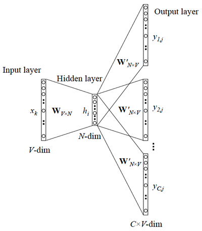

例如有如下语句：呼伦贝尔大草原

```
_ _贝_ _草原
呼_ _尔_ _原
呼伦_ _大_ _
```

预测出前后词的数量，称为window_size（以上示例中windows_size为2），实际是要将以下概率最大化：

```
P(呼|贝)P(伦|贝)P(尔|贝)P(大|贝)
P(伦|尔)P(贝|尔)P(大|尔)P(草|尔)
P(贝|大)P(尔|大)P(草|大)P(草|原)
```

可以写出概率的一般化表达式，设有文本Text，由N个单词组成：
$$
Text = {w_1, w_2, w_3, ..., w_n}
$$
目标函数可以写作：
$$
argmax \prod_{w \in Text} \ \ \prod_{c \in c(w)} P(c|w; \theta)
$$
其中，$w$为当前词，$c$为$w$的上下文词，$\theta$为要优化的参数，这个参数即每个词（或字）的稠密向量表示，形如：

$$  \left[
\begin{matrix}
呼: \theta_{11} \ \ \theta_{12} \ \ \theta_{13}\ ...\ \ \theta_{1n} \\
伦: \theta_{21} \ \ \theta_{22} \ \ \theta_{23}\ ...\ \ \theta_{2n} \\
贝: \theta_{31} \ \ \theta_{32} \ \ \theta_{33}\ ...\ \ \theta_{3n} \\
尔: \theta_{41} \ \ \theta_{42} \ \ \theta_{43}\ ...\ \ \theta_{4n} \\
大: \theta_{51} \ \ \theta_{52} \ \ \theta_{53}\ ...\ \ \theta_{5n} \\
草: \theta_{61} \ \ \theta_{62} \ \ \theta_{63}\ ...\ \ \theta_{6n} \\
原: \theta_{71} \ \ \theta_{72} \ \ \theta_{73}\ ...\ \ \theta_{7n} \\
\end{matrix}
\right] $$

该参数$\theta$能够使得目标函数最大化。因为概率均为0~1之间的数字，连乘计算较为困难，所以转换为对数相加形式：
$$
argmax \sum_{w \in Text} \ \sum_{c \in c(w)} logP(c|w;\theta)
$$
再表示为softmax形式：
$$
argmax \sum_{w \in Text} \sum_{c \in c(w)} log \Big(e^{u_c \cdot v_w} / \sum_{c' \in vocab } e^{u_{c'} \cdot v_w} \Big)
$$
其中，U为上下文单词矩阵，V为同样大小的中心词矩阵，因为每个词可以作为上下文词，同时也可以作为中心词，$u_c \cdot v_w$表示上下文词和中心词向量的内积（内积表示向量的相似度），相似度越大，概率越高；分母部分是以$w$为中心词，其它所有上下文词$c'$内积之和，再将上一步公式进行简化：
$$
= argmax \sum_{w \in Text} \sum_{c \in c(w)} \Big(log(e^{u_c \cdot v_w}) - log(\sum_{c' \in vocab } e^{u_{c'} \cdot v_w}) \Big)\\ 
= argmax \sum_{w \in Text} \sum_{c \in c(w)} \Big(u_c \cdot v_w - log \sum_{c' \in vocab }e^{u_{c'} \cdot v_w} \Big)
$$
上式中，由于需要在整个词汇表中进行遍历，如果词汇表很大，计算效率会很低。所以，真正进行优化时，采用另一种优化形式。例如有如下语料库：

```
文本：呼伦贝尔大草原
```

将window_size设置为1，构建正案例词典、负案例词典（一般来说，负样本词典比正样本词典大的多）：

```python
正样本：D = {(呼，伦)，(伦，呼)，(伦，贝)，(贝，伦),(贝，尔),(尔，贝)，(尔，大)，(大，尔)，(大，草)(草，大)，(草，原)，(原，草)}

负样本：D’= {(呼，贝),(呼，尔),(呼，大)，(呼，草)，(呼，原)，(伦，尔),(伦，大),(伦，草),(伦，原),(贝，呼),(贝，大),(贝，草),(贝，原),(尔，呼),(尔，伦)(尔，草),(尔，原),(大，呼),(大，伦),(大，原)，(草，呼)，(草，伦)，(草，贝)，(原，呼)，(原，伦)，(原，贝)，(原，尔)，(原，大)}
```

词向量优化的目标函数定义为正样本、负样本公共概率最大化函数：
$$
argmax (\prod_{w,c \in D} log P(D=1|w,c; \theta) \prod_{w, c \in D'} P(D=0|w, c; \theta))  \\
= argmax (\prod_{w,c \in D} \frac{1}{1+exp(-U_c \cdot V_w)} \prod_{w, c \in D'} [1- \frac{1}{1+exp(-U_c \cdot V_w)}])  \\
= argmax(\sum_{w,c \in D} log \sigma (U_c \cdot V_w) + \sum_{w,c \in D'} log \sigma (-U_c \cdot V_w))
$$
在实际训练时，会从负样本集合中选取部分样本（称之为“负采样”）来进行计算，从而降低运算量.要训练词向量，还需要借助于语言模型.

#### 2）CBOW模型

CBOW模型全程为Continous Bag of Words（连续词袋模型），其核心思想是用上下文来预测中心词，例如：

```
呼伦贝_大草原
```

其模型结构示意图如下：


- 输入：$C \times V$的矩阵，C表示上下文词语的个数，V表示词表大小
- 隐藏层：$V \times N$的权重矩阵，一般称为word-embedding，N表示每个词的向量长度，和输入矩阵相乘得到$C \times N$的矩阵。综合考虑上下文中所有词信息预测中心词，所以将$C \times N$矩阵叠加，得到$1 \times N$的向量
- 输出层：包含一个$N \times V$的权重矩阵，隐藏层向量和该矩阵相乘，输出$1 \times V$的向量，经过softmax转换为概率，对应每个词表中词语的概率

#### 3）示例：训练词向量

数据集：来自中文wiki文章，AIStudio下数据集名称：中文维基百科语料库

代码：建议在AIStudio下执行

- 安装gensim

```shell
!pip install gensim==3.8.1 # 如果不在AIStudio下执行去掉前面的叹号
```

- 用于解析XML，读取XML文件中的数据，并写入到新的文本文件中

```python
import logging
import os
import os.path
from gensim.corpora import WikiCorpus

# 获取输入数据
input_file = "data/data104767/articles.xml.bz2"

# 创建输出文件
out_file = open("wiki.zh.text", "w", encoding="utf-8")

# 调用gensim读取xml压缩文件
count = 0
# lemmatize: 词性还原？
wiki = WikiCorpus(input_file, lemmatize=False, dictionary={})

for text in wiki.get_texts():
    out_file.write(" ".join(text) + "\n") # 向文件写入一行
    count += 1

    if count % 200 == 0:
        print("count:", count)

    if count >= 20000: # 2万笔时退出
        break

out_file.close()
```

- 生成分词文件

```python
import jieba
import jieba.analyse
import codecs # python封装的文件工具包

def process_wiki_text(src_file, dest_file):
    with codecs.open(src_file, "r", "utf-8") as f_in, codecs.open(dest_file, "w", "utf-8") as f_out:
        num = 1
        for line in f_in.readlines():
            line_seg = " ".join(jieba.cut(line)) # 分词
            f_out.writelines(line_seg) # 写入目标文件
            num += 1

            if num % 200 == 0:
                print("处理完成:", num)

    f_in.close()
    f_out.close()

process_wiki_text("wiki.zh.text", "wiki.zh.text.seg")
```

- 训练

```python
import logging
import sys
import multiprocessing
from gensim.models import Word2Vec
from gensim.models.word2vec import LineSentence # 按行读取

logger = logging.getLogger(__name__)
# format: 指定输出的格式和内容，format可以输出很多有用信息，
# %(asctime)s: 打印日志的时间
# %(levelname)s: 打印日志级别名称
# %(message)s: 打印日志信息
logging.basicConfig(format='%(asctime)s: %(levelname)s: %(message)s')
logging.root.setLevel(level=logging.INFO)

in_file = "wiki.zh.text.seg" # 输入文件(经过分词后的)
out_file1 = "wiki.zh.text.model" # 模型
out_file2 = "wiki.zh.text.vector" # 权重

# 模型训练
model = Word2Vec(LineSentence(in_file), # 输入
                 size=100, # 词向量维度(推荐25~300之间)
                 window=3, # 窗口大小
                 min_count=5, # 如果语料中单词出现次数小于5，忽略该词
                 workers=multiprocessing.cpu_count()) # 线程数量
# 保存模型
model.save(out_file1)
# 保存权重矩阵C
model.wv.save_word2vec_format(out_file2, # 文件路径
                              binary=False) # 不保存二进制
```

- 测试

```python
import gensim
from gensim.models import Word2Vec

# 加载模型
model = Word2Vec.load("wiki.zh.text.model")
count = 0

for word in model.wv.index2word:
    print(word, model[word]) # 打印
    count += 1
    if count >= 10:
        break

print("==================================")

result = model.most_similar(u"铁路")
for r in result:
    print(r)

print("==================================")

result = model.most_similar(u"中药")
for r in result:
    print(r)
```

输出（训练过程略）：

```
('高速铁路', 0.8310302495956421)
('客运专线', 0.8245105743408203)
('高铁', 0.8095601201057434)
('城际', 0.802475094795227)
('联络线', 0.7837506532669067)
('成昆铁路', 0.7820425033569336)
('支线', 0.7775323390960693)
('通车', 0.7751388549804688)
('沪', 0.7748854756355286)
('京广', 0.7708789110183716)
==============================================
('草药', 0.9046826362609863)
('中药材', 0.8511005640029907)
('气功', 0.8384993672370911)
('中医学', 0.8368280529975891)
('调味', 0.8364394307136536)
('冶炼', 0.8328938484191895)
('药材', 0.8304706811904907)
('有机合成', 0.8298543691635132)
('针灸', 0.8297436833381653)
('药用', 0.8281913995742798)
```


### 5. 循环神经网络（RNN）

前面提到的关于NLP的模型及应用，都未考虑词的顺序问题，而在自然语言中，词语顺序又是极其重要的特征。循环神经网络（Recurrent Neural Network，RNN）能够在原有神经网络的基础上增加记忆单元，处理任意长度的序列（理论上），并且在前后词语（或字）之间建立起依赖关系。相比于CNN，RNN更适合处理视频、语音、文本等与时序相关的问题。

#### 1）原生RNN

##### ① RNN起源及发展

1982年，物理学家约翰·霍普菲尔德（John Hopfield）利用电阻、电容和运算放大器等元件组成的模拟电路实现了对网络神经元的描述，该网络从输出到输入有反馈连接。1986年，迈克尔·乔丹（Michael Jordan，不是打篮球那哥们，而是著名人工智能学者、美国科学院院士、吴恩达的导师）借鉴了Hopfield网络的思想，正式将循环连接拓扑结构引入神经网络。1990年，杰弗里·埃尔曼（Jeffrey Elman）又在Jordan的研究基础上做了部分简化，正式提出了RNN模型（那时还叫Simple Recurrent Network，SRN）。

##### ② RNN的结构

RNN结构如下图所示：

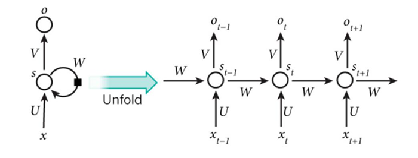

上图中，左侧为不展开的画法，右侧为展开画法。内部结构如下图所示：

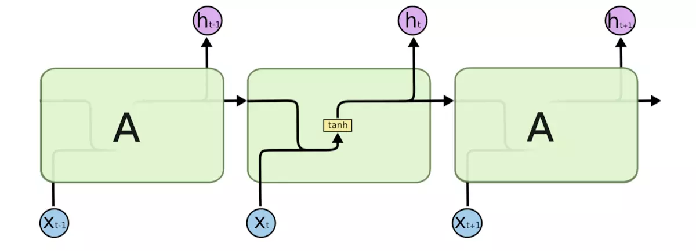

计算公式可表示为：
$$
s_t = f(U \cdot x_t + W \cdot s_{t-1} + b) \\ 
y_t = g(V \cdot s_t + d)
$$
其中，$x_t$表示$t$时刻的输入；$s_t$表示$t$时刻隐藏状态；$f$和$g$表示激活函数；$U，V，W$分别表示输入层 → 隐藏层权重、隐藏层 → 输出层权重、隐藏层 → 隐藏层权重。对于任意时刻$t$，所有权重和偏置都共享，这极大减少了模型参数量。

计算时，首先利用前向传播算法，依次按照时间顺序进行计算，再利用反向传播算法进行误差传递，和普通BP（Back Propagation）网络唯一区别是，加入了时间顺序，计算方式有些微差别，称为BPTT（Back Propagation Through Time）算法。

##### ③ RNN的功能

RNN善于处理跟序列相关的信息，如：语音识别，语言建模，翻译，图像字幕。它能根据近期的一些信息来执行/判别/预测当前任务。例如：

```
白色的云朵漂浮在蓝色的____
天空中飞过来一只___
```

根据前面输入的一连串词语，可以预测第一个句子最后一个词为"天空"、第二个句子最后一个词为"鸟"的概率最高。

##### ④ RNN的缺陷

因为计算的缘故，RNN容易出现梯度消失，导致它无法学习过往久远的信息，无法处理长序列、远期依赖任务。例如：

```
我生长在中国，祖上十代都是农民，家里三亩一分地。我是家里老三，我大哥叫大狗子，二哥叫二狗子，我叫三狗子，我弟弟叫狗剩子。我的母语是_____
```

要预测出句子最后的词语，需要根据句子开够的信息"我出生在中国"，才能确定母语是"中文"或"汉语"的概率最高。原生RNN在处理这类远期依赖任务时出现了困难，于是LSTM被提出。

#### 2）长短期记忆模型（LSTM）

长短期记忆模型（Long Short Term Memory，LSTM）是RNN的变种，于1997年Schmidhuber和他的合作者Hochreiter提出，由于独特的设计结构，LSTM可以很好地解决梯度消失问题，能够处理更长的序列，更好解决远期依赖任务。LSTM非常适合构造大型深度神经网络。2009年，用改进版的LSTM，赢得了国际文档分析与识别大赛（ICDAR）手写识别大赛冠军；2014年，Yoshua Bengio的团队提出了一种更好的LSTM变体GRU（Gated Recurrent Unit，门控环单元）；2016年，Google利用LSTM来做语音识别和文字翻译；同年，苹果公司使用LSTM来优化Siri应用。

LSTM同样具有链式结构，它具有4个以特殊方式互相影响的神经网络层。其结构入下图所示：


LSTM的核心是细胞状态，用贯穿细胞的水平线表示。细胞状态像传送带一样。它贯穿整个细胞却只有很少的分支，这样能保证信息不变的流过整个结构。同时，LSTM通过称为门（gate）的结构来对单元状态进行增加或删除，包含三扇门：

- 遗忘门：决定哪些信息丢弃

  

  表达式为：$f_t = \sigma (W_f \cdot [h_{t-1}, x_t] + b_f)$，当输出为1时表示完全保留，输出为0是表示完全丢弃

- 输入门：决定哪些信息输入进来

  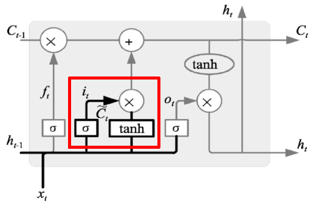

  表达式为：
  $$
  i_t = \sigma (W_i \cdot [h_{t-1}, x_t] + b_i) \\ 
  \tilde{C}_t = tanh(W_c \cdot [h_{t-1}, x_t] + b_c)
  $$

  根据输入、遗忘门作用结果，可以对细胞状态进行更新，如下图所示：

  

  状态更新表达式为：
  $$
  C_t = f_t \cdot C_{t-1} + i_t \cdot \tilde{C}_t
  $$
  遗忘门找到了需要忘掉的信息$f_t$后，再将它与旧状态相乘，丢弃掉确定需要丢弃的信息。再将结果加上$i_t \cdot C_t$使细胞状态获得新的信息，这样就完成了细胞状态的更新。

- 输出门：决定输出哪些信息

  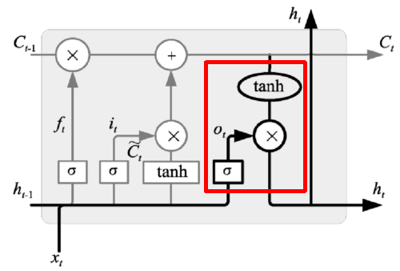

输出门表达式为：
$$
O_t = \sigma (W_o \cdot [h_{t-1}, x_t] + b_o) \\ 
h_t = O_t \cdot tanh(C_t)
$$
在输出门中，通过一个Sigmoid层来确定哪部分的信息将输出，接着把细胞状态通过Tanh进行处理（得到一个在-1～1之间的值）并将它和Sigmoid门的输出相乘，得出最终想要输出的那部分。

#### 3）双向循环神经网络

双向循环神经网络（BRNN）由两个循环神经网络组成，一个正向、一个反向，两个序列连接同一个输出层。正向RNN提取正向序列特征，反向RNN提取反向序列特征。例如有如下两个语句：

```
我喜欢苹果，比安卓用起来更流畅些
我喜欢苹果，基本上每天都要吃一个
```

根据后面的描述，我们可以得知，第一句中的"苹果"指的是苹果手机，第二句中的"苹果"指的是水果。双向循环神经网络结构如下图所示：


权重设置如下图所示：


计算表达式为：
$$
h_t = f(w_1x_t + w_2h_{t-1}) \\ 
h_t' = f(w_3x_t + w_5h'_{t+1}) \\ 
o_t = g(w_4h_t + w_6h'_t)
$$
其中，$h_t$为$t$时刻正向序列计算结果，$h'_t$为$t$时刻反向序列的计算结果，将正向序列、反向序列结果和各自权重矩阵相乘，相加后结果激活函数产生$t$时刻的输出。

通常情况下，双向循环神经网络能获得比单向网络更好的性能。


## 五、NLP应用

### 1. 文本分类

#### 1）什么是文本分类

文本分类就是根据文本内容将文本划分到不同类别，例如新闻系统中，每篇新闻报道会划归到不同的类别。

#### 2）文本分类的应用

- 内容分类（新闻分类）
- 邮件过滤（例如垃圾邮件过滤）
- 用户分类（如商城消费级别、喜好）
- 评论、文章、对话的情感分类（正面、负面、中性）

#### 3）文本分类案例

- 任务：建立文本分类模型，并对模型进行训练、评估，从而实现对中文新闻摘要类别正确划分
- 数据集：从网站上爬取56821条数据中文新闻摘要，包含10种类别，国际、文化、娱乐、体育、财经、汽车、教育、科技、房产、证券，各类别样本数量如下表所示：

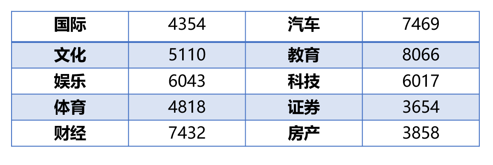

- 模型选择：

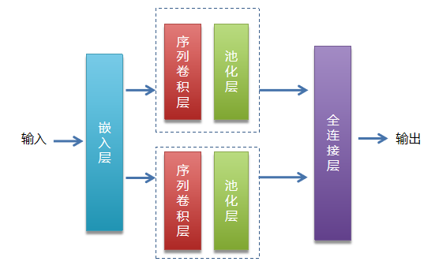

- 步骤：


- 代码

  【预处理部分】

  ```python
  ########################### 数据预处理　#########################
  import os
  from multiprocessing import cpu_count
  import numpy as np
  import paddle
  import paddle.fluid as fluid
  
  #　定义一组公共变量
  data_root = "data/" # 数据集所在目录
  data_file = "news_classify_data.txt" # 原始数据集
  train_file = "train.txt" # 训练集文件
  test_file = "test.txt" # 测试集文件
  dict_file = "dict_txt.txt" # 字典文件(存放字和编码映射关系)
  
  data_file_path = data_root + data_file # 数据集完整路径
  train_file_path = data_root + train_file # 训练集文件完整路径
  test_file_path = data_root + test_file # 测试集文件完整路径
  dict_file_path = data_root + dict_file # 字典文件完整路径
  
  # 取出样本中所有字，对每个字进行编码，将编码结果存入字典文件
  def create_dict():
      dict_set = set() # 集合，用作去重
      with open(data_file_path, "r", encoding="utf-8") as f:
          for line in f.readlines(): # 遍历每行
              line = line.replace("\n", "") # 去除换行符
              tmp_list = line.split("_!_") # 根据分隔符拆分
              title = tmp_list[-1] # 最后一个字段即为标题
              for word in title: # 取出每个字
                  dict_set.add(word)
  
      # 遍历集合，取出每个字进行编号
      dict_txt = {} # 定义字典
      i = 1 # 编码使用的计数器
      for word in dict_set:
          dict_txt[word] = i # 字-编码 键值对添加到字典
          i += 1
  
      dict_txt["<unk>"] = i # 未知字符(在样本中未出现过的字)
  
      # 将字典内容存入文件
      with open(dict_file_path, "w", encoding="utf-8") as f:
          f.write(str(dict_txt))
  
      print("生成字典结束.")
  
  # 传入一个句子，将每个字替换为编码值，和标签一起返回
  def line_encoding(title, dict_txt, label):
      new_line = "" # 编码结果
      for word in title:
          if word in dict_txt: # 在字典中
              code = str(dict_txt[word]) # 取出编码值
          else: # 不在字典中
              code = str(dict_txt["<unk>"]) # 取未知字符编码值
          new_line = new_line + code + "," # 追加到字符串后面
      new_line = new_line[:-1] # 去掉最后一个多余的逗号
      new_line = new_line + "\t" + label + "\n" # 追加标签值
      return new_line
  
  # 读取原始样本，取出标题部分进行编码，将编码后的划分测试集/训练集
  def create_train_test_file():
      # 清空训练集/测试集
      with open(train_file_path, "w") as f:
          pass
      with open(test_file_path, "w") as f:
          pass
  
      # 读取字典文件
      with open(dict_file_path, "r", encoding="utf-8") as f_dict:
          dict_txt = eval(f_dict.readlines()[0]) # 读取字典文件第一行，生成字典对象
  
      # 读取原始样本
      with open(data_file_path, "r", encoding="utf-8") as f_data:
          lines = f_data.readlines()
  
      i = 0
      for line in lines:
          tmp_list = line.replace("\n", "").split("_!_") # 拆分
          title = tmp_list[3] # 标题
          label = tmp_list[1] # 类别
          new_line = line_encoding(title, dict_txt, label) # 对标题编码
  
          if i % 10 == 0: # 写入测试集
              with open(test_file_path, "a", encoding="utf-8") as f:
                  f.write(new_line)
          else: # 写入训练集
              with open(train_file_path, "a", encoding="utf-8") as f:
                  f.write(new_line)
          i += 1
      print("生成训练集/测试集结束.")
  
  create_dict() # 根据样本生成字典
  create_train_test_file()
  ```
  
  
  
  【模型定义与训练】
  
  ```python
  # 读取字典文件，返回字典长度
def get_dict_len(dict_path):
      with open(dict_path, "r", encoding="utf-8") as f:
        dict_txt = eval(f.readlines()[0])
      return len(dict_txt.keys())

  def data_mapper(sample):
      data, label = sample # 赋值到变量
      val = [int(w) for w in data.split(",")] # 将编码值转换位数字(从文件读取为字符串)
      return val, int(label)
  
  def train_reader(train_file_path): # 训练集读取器
      def reader():
          with open(train_file_path, "r") as f:
              lines = f.readlines()
              np.random.shuffle(lines) # 随机化处理
              for line in lines:
                  data, label = line.split("\t") # 拆分
                  yield data, label
      return paddle.reader.xmap_readers(data_mapper, reader, cpu_count(), 1024)
  
  def test_reader(test_file_path): # 训练集读取器
      def reader():
          with open(test_file_path, "r") as f:
              lines = f.readlines()
              
              for line in lines:
                  data, label = line.split("\t") # 拆分
                  yield data, label
      return paddle.reader.xmap_readers(data_mapper, reader, cpu_count(), 1024)
  
  # 定义网络
  def Text_CNN(data, dict_dim, class_dim=10, emb_dim=128,
               hid_dim=128, hid_dim2=128):
      """
      定义TextCNN模型
      :param data:　输入
      :param dict_dim:　词典大小(词语总的数量)
      :param class_dim:　分类的数量
      :param emb_dim: 词嵌入长度
      :param hid_dim:　第一个卷基层卷积核数量
      :param hid_dim2:　第二个卷基层卷积核数量
      :return:　模型预测结果
      """
      # embedding层
      emb = fluid.layers.embedding(input=data, size=[dict_dim, emb_dim])
      # 并列两个卷积/池化层
      conv1 = fluid.nets.sequence_conv_pool(input=emb, # 输入(词嵌入层输出)
                                            num_filters=hid_dim,#　卷积核数量
                                            filter_size=3,#卷积核大小
                                            act="tanh",#激活函数
                                            pool_type="sqrt")#池化类型
      conv2 = fluid.nets.sequence_conv_pool(input=emb, # 输入(词嵌入层输出)
                                            num_filters=hid_dim2,#　卷积核数量
                                            filter_size=4,#卷积核大小
                                            act="tanh",#激活函数
                                            pool_type="sqrt")#池化类型
      # fc
      output = fluid.layers.fc(input=[conv1, conv2], # 输入
                               size=class_dim,#输出值个数
                               act="softmax")#激活函数
      return output
  
  # 定义占位符张量
  words = fluid.layers.data(name="words",
                            shape=[1],
                            dtype="int64",
                            lod_level=1) # LOD张量用来表示变长数据
  label = fluid.layers.data(name="label",
                            shape=[1],
                            dtype="int64")
  dict_dim = get_dict_len(dict_file_path) # 获取字典长度
  # 调用模型函数
  model = Text_CNN(words, dict_dim)
  # 损失函数
  cost = fluid.layers.cross_entropy(input=model, label=label)
  avg_cost = fluid.layers.mean(cost)
  # 优化器
  optimizer = fluid.optimizer.Adam(learning_rate=0.0001)
  optimizer.minimize(avg_cost)
  # 准确率
  accuracy = fluid.layers.accuracy(input=model, label=label)
  
  # 执行器
  place = fluid.CUDAPlace(0)
  exe = fluid.Executor(place)
  exe.run(fluid.default_startup_program())
  
  # reader
  ## 训练集reader
  tr_reader = train_reader(train_file_path)
  batch_train_reader = paddle.batch(tr_reader, batch_size=128)
  ## 测试集reader
  ts_reader = test_reader(test_file_path)
  batch_test_reader = paddle.batch(ts_reader, batch_size=128)
  
  # feeder
  feeder = fluid.DataFeeder(place=place, feed_list=[words, label])
  
  # 开始训练
  for epoch in range(80): # 外层循环控制训练轮次
      for batch_id, data in enumerate(batch_train_reader()): # 内层循环控制批次
          train_cost, train_acc = exe.run(fluid.default_main_program(),#program
                                          feed=feeder.feed(data),#喂入的参数
                                          fetch_list=[avg_cost, accuracy])#返回值
          if batch_id % 100 == 0:
              print("epoch:%d, batch:%d, cost:%f, acc:%f" %
                    (epoch, batch_id, train_cost[0], train_acc[0]))
  
      # 每轮训练结束后进行模型评估
      test_costs_list = [] # 存放测试集损失值
      test_accs_list = [] # 存放测试集准确率
  
      for batch_id, data in enumerate(batch_test_reader()):
          test_cost, test_acc = exe.run(fluid.default_main_program(), 
                                        feed=feeder.feed(data),
                                        fetch_list=[avg_cost, accuracy])
          test_costs_list.append(test_cost[0])
          test_accs_list.append(test_acc[0])
      #　计算所有批次损失值/准确率均值
      avg_test_cost = sum(test_costs_list) / len(test_costs_list)
      avg_test_acc = sum(test_accs_list) / len(test_accs_list)
      print("epoch:%d, test_cost:%f, test_acc:%f" %
            (epoch, avg_test_cost, avg_test_acc))
  
  # 训练结束，保存模型
  model_save_dir = "model/"
  if not os.path.exists(model_save_dir):
      os.makedirs(model_save_dir)
  fluid.io.save_inference_model(model_save_dir, # 保存路径
                                feeded_var_names=[words.name],# 使用时传入参数名称
                                target_vars=[model],#预测结果
                                executor=exe)#执行器
  print("模型保存成功.")
  ```
  
  
  
  【推理预测】
  
  ```python
  model_save_dir = "model/"
  
  def get_data(sentence): # 将传入的句子根据字典中的值进行编码
      with open(dict_file_path, "r", encoding="utf-8") as f:
          dict_txt = eval(f.readlines()[0])
  
      ret = [] # 编码结果
      keys = dict_txt.keys()
      for w in sentence: # 取出每个字
          if not w in keys: # 字不在字典中
              w = "<unk>"
          ret.append(int(dict_txt[w]))
      return ret
  
  # 执行器
  place = fluid.CPUPlace()
exe = fluid.Executor(place)
  exe.run(fluid.default_startup_program())
  
  infer_program, feed_names, target_var = \
  fluid.io.load_inference_model(model_save_dir, exe)
  
  texts = [] # 存放待预测句子
  
  data1 = get_data("在获得诺贝尔文学奖7年之后，莫言15日晚间在山西汾阳贾家庄如是说")
  data2 = get_data("综合'今日美国'、《世界日报》等当地媒体报道，芝加哥河滨警察局表示")
  data3 = get_data("中国队2022年冬奥会表现优秀")
  data4 = get_data("中国人民银行今日发布通知，降低准备金率，预计释放4000亿流动性")
  data5 = get_data("10月20日,第六届世界互联网大会正式开幕")
  data6 = get_data("同一户型，为什么高层比低层要贵那么多？")
  data7 = get_data("揭秘A股周涨5%资金动向：追捧2类股，抛售600亿香饽饽")
  data8 = get_data("宋慧乔陷入感染危机，前夫宋仲基不戴口罩露面，身处国外神态轻松")
  data9 = get_data("此盆栽花很好养，花美似牡丹，三季开花，南北都能养，很值得栽培")  # 不属于任何一个类别
  
  texts.append(data1)
  texts.append(data2)
  texts.append(data3)
  texts.append(data4)
  texts.append(data5)
  texts.append(data6)
  texts.append(data7)
  texts.append(data8)
  texts.append(data9)
  
  base_shape = [[len(c) for c in texts]] # 计算每个句子长度
  tensor_words = fluid.create_lod_tensor(texts, base_shape, place)
  result = exe.run(infer_program,
                   feed={feed_names[0]: tensor_words},
                   fetch_list=target_var)
  names = ["文化", "娱乐", "体育", "财经", "房产","汽车", "教育", "科技", "国际", "证券"]
  for r in result[0]:
      idx = np.argmax(r) # 取出最大值的索引
      print("预测结果:", names[idx], " 概率:", r[idx])
  ```


### 2. 文本情感分析

1）目标：利用训练数据集，对模型训练，从而实现对中文评论语句情感分析。情绪分为正面、负面两种

2）数据集：中文关于酒店的评论，5265笔用户评论数据，其中2822笔正面评价、其余为负面评价

3）步骤：同上一案例

4）模型选择：


5）代码

【数据预处理】

  ```python
# 中文情绪分析：数据预处理部分
import paddle
import paddle.dataset.imdb as imdb
import paddle.fluid as fluid
import numpy as np
import os
import random
from multiprocessing import cpu_count

# 数据预处理，将中文文字解析出来，并进行编码转换为数字，每一行文字存入数组
mydict = {}  # 存放出现的字及编码，格式： 好,1
code = 1
data_file = "data/hotel_discuss2.csv"  # 原始样本路径
dict_file = "data/hotel_dict.txt" # 字典文件路径
encoding_file = "data/hotel_encoding.txt" # 编码后的样本文件路径
puncts = " \n"  # 要剔除的标点符号列表

with open(data_file, "r", encoding="utf-8-sig") as f:
    for line in f.readlines():
        # print(line)
        trim_line = line.strip()
        for ch in trim_line:
            if ch in puncts:  # 符号不参与编码
                continue

            if ch in mydict:  # 已经在编码字典中
                continue
            elif len(ch) <= 0:
                continue
            else:  # 当前文字没在字典中
                mydict[ch] = code
                code += 1
    code += 1
    mydict["<unk>"] = code  # 未知字符

# 循环结束后，将字典存入字典文件
with open(dict_file, "w", encoding="utf-8-sig") as f:
    f.write(str(mydict))
    print("数据字典保存完成！")


# 将字典文件中的数据加载到mydict字典中
def load_dict():
    with open(dict_file, "r", encoding="utf-8-sig") as f:
        lines = f.readlines()
        new_dict = eval(lines[0])
    return new_dict

# 对评论数据进行编码
new_dict = load_dict()  # 调用函数加载
with open(data_file, "r", encoding="utf-8-sig") as f:
    with open(encoding_file, "w", encoding="utf-8-sig") as fw:
        for line in f.readlines():
            label = line[0]  # 标签
            remark = line[1:-1]  # 评论

            for ch in remark:
                if ch in puncts:  # 符号不参与编码
                    continue
                else:
                    fw.write(str(mydict[ch]))
                    fw.write(",")
            fw.write("\t" + str(label) + "\n")  # 写入tab分隔符、标签、换行符

print("数据预处理完成")
  ```


【模型定义与训练】

```python
# 获取字典的长度
def get_dict_len(dict_path):
    with open(dict_path, 'r', encoding='utf-8-sig') as f:
        lines = f.readlines()
        new_dict = eval(lines[0])

    return len(new_dict.keys())

# 创建数据读取器train_reader和test_reader
# 返回评论列表和标签
def data_mapper(sample):
    dt, lbl = sample
    val = [int(word) for word in dt.split(",") if word.isdigit()]
    return val, int(lbl)

# 随机从训练数据集文件中取出一行数据
def train_reader(train_list_path):
    def reader():
        with open(train_list_path, "r", encoding='utf-8-sig') as f:
            lines = f.readlines()
            np.random.shuffle(lines)  # 打乱数据

            for line in lines:
                data, label = line.split("\t")
                yield data, label

    # 返回xmap_readers, 能够使用多线程方式读取数据
    return paddle.reader.xmap_readers(data_mapper,  # 映射函数
                                      reader,  # 读取数据内容
                                      cpu_count(),  # 线程数量
                                      1024)  # 读取数据队列大小

# 定义LSTM网络
def lstm_net(ipt, input_dim):
    ipt = fluid.layers.reshape(ipt, [-1, 1],
                               inplace=True) # 是否替换，True则表示输入和返回是同一个对象
    # 词嵌入层
    emb = fluid.layers.embedding(input=ipt, size=[input_dim, 128], is_sparse=True)

    # 第一个全连接层
    fc1 = fluid.layers.fc(input=emb, size=128)

    # 第一分支：LSTM分支
    lstm1, _ = fluid.layers.dynamic_lstm(input=fc1, size=128)
    lstm2 = fluid.layers.sequence_pool(input=lstm1, pool_type="max")

    # 第二分支
    conv = fluid.layers.sequence_pool(input=fc1, pool_type="max")

    # 输出层：全连接
    out = fluid.layers.fc([conv, lstm2], size=2, act="softmax")

    return out

# 定义输入数据，lod_level不为0指定输入数据为序列数据
dict_len = get_dict_len(dict_file)  # 获取数据字典长度
rmk = fluid.layers.data(name="rmk", shape=[1], dtype="int64", lod_level=1)
label = fluid.layers.data(name="label", shape=[1], dtype="int64")

# 定义长短期记忆网络
model = lstm_net(rmk, dict_len)

# 定义损失函数，情绪判断实际是一个分类任务，使用交叉熵作为损失函数
cost = fluid.layers.cross_entropy(input=model, label=label)
avg_cost = fluid.layers.mean(cost)  # 求损失值平均数
# layers.accuracy接口，用来评估预测准确率
acc = fluid.layers.accuracy(input=model, label=label)

# 定义优化方法
# Adagrad(自适应学习率，前期放大梯度调节，后期缩小梯度调节)
optimizer = fluid.optimizer.AdagradOptimizer(learning_rate=0.001)
opt = optimizer.minimize(avg_cost)

# 定义网络
# place = fluid.CPUPlace()
place = fluid.CUDAPlace(0)
exe = fluid.Executor(place)
exe.run(fluid.default_startup_program())  # 参数初始化

# 定义reader
reader = train_reader(encoding_file)
batch_train_reader = paddle.batch(reader, batch_size=128)

# 定义输入数据的维度，数据的顺序是一条句子数据对应一个标签
feeder = fluid.DataFeeder(place=place, feed_list=[rmk, label])

for pass_id in range(40):
    for batch_id, data in enumerate(batch_train_reader()):
        train_cost, train_acc = exe.run(program=fluid.default_main_program(),
                                        feed=feeder.feed(data),
                                        fetch_list=[avg_cost, acc])

        if batch_id % 20 == 0:
            print("pass_id: %d, batch_id: %d, cost: %0.5f, acc:%.5f" %
                  (pass_id, batch_id, train_cost[0], train_acc))

print("模型训练完成......")

# 保存模型
model_save_dir = "model/chn_emotion_analyses.model"
if not os.path.exists(model_save_dir):
    print("create model path")
    os.makedirs(model_save_dir)

fluid.io.save_inference_model(model_save_dir,  # 保存路径
                              feeded_var_names=[rmk.name],
                              target_vars=[model],
                              executor=exe)  # Executor

print("模型保存完成, 保存路径: ", model_save_dir)
```


【推理预测】

```python
import paddle
import paddle.fluid as fluid
import numpy as np
import os
import random
from multiprocessing import cpu_count

data_file = "data/hotel_discuss2.csv"
dict_file = "data/hotel_dict.txt"
encoding_file = "data/hotel_encoding.txt"
model_save_dir = "model/chn_emotion_analyses.model"

def load_dict():
    with open(dict_file, "r", encoding="utf-8-sig") as f:
        lines = f.readlines()
        new_dict = eval(lines[0])
        return new_dict

# 根据字典对字符串进行编码
def encode_by_dict(remark, dict_encoded):
    remark = remark.strip()
    if len(remark) <= 0:
        return []

    ret = []
    for ch in remark:
        if ch in dict_encoded:
            ret.append(dict_encoded[ch])
        else:
            ret.append(dict_encoded["<unk>"])

    return ret


# 编码,预测
lods = []
new_dict = load_dict()
lods.append(encode_by_dict("总体来说房间非常干净,卫浴设施也相当不错,交通也比较便利", new_dict))
lods.append(encode_by_dict("酒店交通方便，环境也不错，正好是我们办事地点的旁边，感觉性价比还可以", new_dict))
lods.append(encode_by_dict("设施还可以，服务人员态度也好，交通还算便利", new_dict))
lods.append(encode_by_dict("酒店服务态度极差，设施很差", new_dict))
lods.append(encode_by_dict("我住过的最不好的酒店,以后决不住了", new_dict))
lods.append(encode_by_dict("说实在的我很失望，我想这家酒店以后无论如何我都不会再去了", new_dict))

# 获取每句话的单词数量
base_shape = [[len(c) for c in lods]]

# 生成预测数据
place = fluid.CPUPlace()
infer_exe = fluid.Executor(place)
infer_exe.run(fluid.default_startup_program())

tensor_words = fluid.create_lod_tensor(lods, base_shape, place)

infer_program, feed_target_names, fetch_targets = fluid.io.load_inference_model(dirname=model_save_dir, executor=infer_exe)
# tvar = np.array(fetch_targets, dtype="int64")
results = infer_exe.run(program=infer_program,
                  feed={feed_target_names[0]: tensor_words},
                  fetch_list=fetch_targets)

# 打印每句话的正负面预测概率
for i, r in enumerate(results[0]):
    print("负面: %0.5f, 正面: %0.5f" % (r[0], r[1]))
```


### 3. 实体抽取

1）目标：从快递单信息中抽取人名、地址、电话号码

2）数据集：训练集1800笔、测试集200笔经过标注的快递单数据，示例如下：

```
text_a	label
黑龙江省双鸭山市尖山区八马路与东平行路交叉口北40米韦业涛1860000xxxx	A1-BA1-IA1-IA1-IA2-BA2-IA2-IA2-IA3-BA3-IA3-IA4-BA4-IA4-IA4-IA4-IA4-IA4-IA4-IA4-IA4-IA4-IA4-IA4-IA4-IA4-IP-BP-IP-IT-BT-IT-IT-IT-IT-IT-IT-IT-IT-IT-I
......
```

实体标记规则：

| 实体类型 | 符号 | 示例           |
| -------- | ---- | -------------- |
| 姓名     | P    | 张三           |
| 电话     | T    | 13512345678    |
| 省       | A1   | 广东省         |
| 市       | A2   | 深圳市         |
| 区       | A3   | 南山区         |
| 详细地址 | A4   | XXXX路XXXX大厦 |

位置标记规则：

| 符号 | 位置           |
| ---- | -------------- |
| B    | 起始位置       |
| I    | 中间或结束位置 |
| O    | 无关字符       |

标注示例：

```
喻晓*			P-BP-IP-I
云南省			A1-BA1-IA1-I
楚雄彝族自治州	A2-BA2-IA2-IA2-IA2-IA2-IA2-I
南华县			A3-BA3-IA3-I
东街古城路37号	A4-BA4-IA4-IA4-IA4-IA4-IA4-IA4-I
1851338xxxx	T-BT-IT-IT-IT-IT-IT-IT-IT-IT-IT-I
```

3）代码

【第一步：安装paddlenlp】

```shell
!pip install paddlenlp==2.1.0
```

【第二步：下载并解压数据集】

```python
from paddle.utils.download import get_path_from_url
URL = "https://paddlenlp.bj.bcebos.com/paddlenlp/datasets/waybill.tar.gz"
get_path_from_url(URL, "./")
```

【第三步：训练】

```python
from functools import partial

import paddle
from paddlenlp.datasets import MapDataset
from paddlenlp.data import Stack, Tuple, Pad
from paddlenlp.transformers import ErnieTokenizer, ErnieForTokenClassification
from paddlenlp.metrics import ChunkEvaluator
from utils import convert_example, evaluate, predict, load_dict


def load_dataset(datafiles):
    def read(data_path):
        with open(data_path, 'r', encoding='utf-8') as fp:
            next(fp)  # 跳过第一行
            for line in fp.readlines():
                words, labels = line.strip('\n').split('\t')
                words = words.split('\002')
                labels = labels.split('\002')
                yield words, labels

    # 根据datafiles决定读取单个文件还是所有文件
    if isinstance(datafiles, str):
        return MapDataset(list(read(datafiles)))
    elif isinstance(datafiles, list) or isinstance(datafiles, tuple):
        return [MapDataset(list(read(datafile))) for datafile in datafiles]


# Create dataset, tokenizer and dataloader.
train_ds, dev_ds, test_ds = load_dataset(datafiles=('./data/train.txt', './data/dev.txt', './data/test.txt'))

# 打印
# 每条数据包含一句文本和这个文本中每个汉字以及数字对应的label标签
# 之后，还需要对输入句子进行数据处理，如切词，映射词表id等
for i in range(5):
    print(train_ds[i])

# 数据读入
label_vocab = load_dict('./data/tag.dic')
# Tokenizer用于将原始输入文本转化成模型可以接受的输入数据形式。
# PaddleNLP对于各种预训练模型已经内置了相应的Tokenizer，指定想要使用的模型名字即可加载
tokenizer = ErnieTokenizer.from_pretrained('ernie-1.0')

# partial函数：为convert_example函数设置固定参数
trans_func = partial(convert_example, tokenizer=tokenizer, label_vocab=label_vocab)

# 通过调用trans_func对样本进行转换
train_ds.map(trans_func)
dev_ds.map(trans_func)
test_ds.map(trans_func)
print(train_ds[0])

# Pad类：将输入的数据样本按照指定axis填充成最大长度，pad_val参数为要填充的值
ignore_label = -1
batchify_fn = lambda samples, fn=Tuple(  # 创建元组
    Pad(axis=0, pad_val=tokenizer.pad_token_id),  # input_ids
    Pad(axis=0, pad_val=tokenizer.pad_token_type_id),  # token_type_ids
    Stack(),  # seq_len (Stack将样本堆叠成一个批次)
    Pad(axis=0, pad_val=ignore_label)  # labels
): fn(samples)

# 对数据集划分批次
train_loader = paddle.io.DataLoader(dataset=train_ds,  # 数据集
                                    batch_size=36,  # 批次大小
                                    return_list=True,  # 是否返回列表
                                    collate_fn=batchify_fn)  # 堆叠成小批次,该参数为0，则在第0维上堆叠
dev_loader = paddle.io.DataLoader(dataset=dev_ds,
                                  batch_size=36,
                                  return_list=True,
                                  collate_fn=batchify_fn)
test_loader = paddle.io.DataLoader(dataset=test_ds,
                                   batch_size=36,
                                   return_list=True,
                                   collate_fn=batchify_fn)

# 加载预训练模型
# Define the model netword and its loss
model = ErnieForTokenClassification.from_pretrained("ernie-1.0", num_classes=len(label_vocab))
# 设置Fine-Tune优化策略，模型配置
# ChunkEvaluator: 用于设置每个chunk检测精度、召回率、F1等指标
metric = ChunkEvaluator(label_list=label_vocab.keys(), suffix=True)
# ignore_index指定哪些target值忽略不计算loss，负数表示不忽略
loss_fn = paddle.nn.loss.CrossEntropyLoss(ignore_index=ignore_label)
# AdamW: 可以解决Adam优化器中L2正则化失败的问题
optimizer = paddle.optimizer.AdamW(learning_rate=2e-5, parameters=model.parameters())

# 模型训练与评估
step = 0
for epoch in range(10):
    for idx, (input_ids, token_type_ids, length, labels) in enumerate(train_loader):
        logits = model(input_ids, token_type_ids)  # 预测
        loss = paddle.mean(loss_fn(logits, labels))  # 指定loss
        loss.backward()  # 反向传播计算
        optimizer.step()  # 优化器更新参数
        optimizer.clear_grad()  # 清楚优化器梯度，否则梯度会累积
        step += 1
        print("epoch:%d - step:%d - loss: %f" % (epoch, step, loss))

    evaluate(model, metric, dev_loader)  # 评估

    paddle.save(model.state_dict(),  # 将所有待持久化参数写入字典中
                './ernie_result/model_%d.pdparams' % step)  # 保存路径
# model.save_pretrained('./checkpoint')
# tokenizer.save_pretrained('./checkpoint')
```

【utils.py文件】

```python
import numpy as np
import paddle
import paddle.nn.functional as F
from paddlenlp.data import Stack, Tuple, Pad

def load_dict(dict_path):
    vocab = {}
    i = 0
    for line in open(dict_path, 'r', encoding='utf-8'):
        key = line.strip('\n')
        vocab[key] = i
        i+=1
    return vocab

def convert_example(example, tokenizer, label_vocab):
    tokens, labels = example
    tokenized_input = tokenizer(
        tokens, return_length=True, is_split_into_words=True)

    # Token '[CLS]' and '[SEP]' will get label 'O'
    # 处理[CLS]和[SEP]标记
    labels = ['O'] + labels + ['O']
    tokenized_input['labels'] = [label_vocab[x] for x in labels]
    return tokenized_input['input_ids'], tokenized_input['token_type_ids'], tokenized_input['seq_len'], tokenized_input['labels']

# 装饰器：禁用动态图
@paddle.no_grad()
def evaluate(model, metric, data_loader):
    model.eval()
    metric.reset()

    for input_ids, seg_ids, lens, labels in data_loader:
        logits = model(input_ids, seg_ids)
        preds = paddle.argmax(logits, axis=-1)
        n_infer, n_label, n_correct = metric.compute(None, lens, preds, labels)
        metric.update(n_infer.numpy(), n_label.numpy(), n_correct.numpy())
        precision, recall, f1_score = metric.accumulate()
    print("eval precision: %f - recall: %f - f1: %f" %
          (precision, recall, f1_score))
    model.train()

def predict(model, data_loader, ds, label_vocab):
    pred_list = []
    len_list = []
    for input_ids, seg_ids, lens, labels in data_loader:
        logits = model(input_ids, seg_ids)
        pred = paddle.argmax(logits, axis=-1)
        pred_list.append(pred.numpy())
        len_list.append(lens.numpy())
    preds = parse_decodes(ds, pred_list, len_list, label_vocab)
    return preds

def parse_decodes(ds, decodes, lens, label_vocab):
    decodes = [x for batch in decodes for x in batch]
    lens = [x for batch in lens for x in batch]
    id_label = dict(zip(label_vocab.values(), label_vocab.keys()))

    outputs = []
    for idx, end in enumerate(lens):
        sent = ds.data[idx][0][:end]
        tags = [id_label[x] for x in decodes[idx][1:end]]
        sent_out = []
        tags_out = []
        words = ""
        for s, t in zip(sent, tags):
            if t.endswith('-B') or t == 'O':
                if len(words):
                    sent_out.append(words)
                tags_out.append(t.split('-')[0])
                words = s
            else:
                words += s
        if len(sent_out) < len(tags_out):
            sent_out.append(words)
        outputs.append(''.join(
            [str((s, t)) for s, t in zip(sent_out, tags_out)]))
    return outputs

# 预测
def predict(model, data_loader, ds, label_vocab):
    pred_list = []
    len_list = []
    for input_ids, seg_ids, lens, labels in data_loader:
        logits = model(input_ids, seg_ids)
        pred = paddle.argmax(logits, axis=-1)
        pred_list.append(pred.numpy())
        len_list.append(lens.numpy())
    preds = parse_decodes(ds, pred_list, len_list, label_vocab)
    return preds
```


## 附录一：相关数学知识

1）向量余弦相似度

余弦相似度使用来度量向量相似度的指标，当两个向量夹角越大相似度越低；当两个向量夹角越小，相似度越高。


在三角形中，余弦值计算方式为$cos \theta = \frac{a^2 + b^2 - c^2}{2ab}$，向量夹角余弦计算公式为：
$$
cos \theta = \frac{ab}{||a|| \times ||b||}
$$
分子为两个向量的内积，分母是两个向量模长的乘积。


其推导过程如下：
$$
cos \theta = \frac{a^2 + b^2 - c^2}{2ab} \\ 
 = \frac{\sqrt{x_1^2 + y_1^2} + \sqrt{x_2^2 + y_2^2 }+ \sqrt{(x_1 - x_2)^2 + (y_1 - y_2)^2}}{2 \sqrt{x_1^2 + y_1^2} \sqrt{x_2^2 + y_2^2}} \\ 
= \frac{2 x_1 x_2 + 2 y_1 y_2}{2 \sqrt{x_1^2 + y_1^2} \sqrt{x_2^2 + y_2^2}} = \frac{ab}{||a|| \times ||b||}
$$
以上是二维向量的计算过程，推广到N维向量，分子部分依然是向量的内积，分母部分依然是两个向量模长的乘积。由此可计算文本的余弦相似度。


## 附录二：参考文献

1）《Python自然语言处理实践——核心技术与算法》  ，涂铭、刘祥、刘树春 著 ，机械工业出版社

2）《Tensorflow自然语言处理》，【澳】图珊·加内格达拉，机械工业出版社

3）《深度学习之美》，张玉宏，中国工信出版集团 / 电子工业出版社

4）AIStudio系统学习资源

5）网络部分资源


## 附录三：专业词汇列表

| 英文简写       | 英文全写                                  | 中文             |
| -------------- | ----------------------------------------- | ---------------- |
| NLP            | Nature Language Processing                | 自然语言处理     |
| NER            | Named Entities Recognition                | 命名实体识别     |
| PoS            | part-of-speech tagging                    | 词性标记         |
| MT             | Machine Translation                       | 机器翻译         |
| TF-IDF         | Term Frequency-Inverse Document Frequency | 词频-逆文档频率  |
| Text Rank      |                                           | 文本排名算法     |
| One-hot        |                                           | 独热编码         |
| BOW            | Bag-of-Words Model                        | 词袋模型         |
| N-Gram         |                                           | N元模型          |
| word embedding |                                           | 词嵌入           |
| NNLM           | Neural Network Language Model             | 神经网络语言模型 |
| HMM            | Hidden Markov Model                       | 隐马尔可夫模型   |
| RNN            | Recurrent Neural Networks                 | 循环神经网络     |
| Skip-gram      |                                           | 跳字模型         |
| CBOW           | Continous Bag of Words                    | 连续词袋模型     |
| LSTM           | Long Short Term Memory                    | 长短期记忆模型   |
| GRU            | Gated Recurrent Unit                      | 门控环单元       |
| BRNN           | Bi-recurrent neural network               | 双向循环神经网络 |
| FMM            | Forward Maximum Matching                  | 正向最大匹配     |
| RMM            | Reverse Maximum Matching                  | 逆向最大匹配     |
| Bi-MM          | Bi-directional Maximum Matching           | 双向最大匹配法   |

