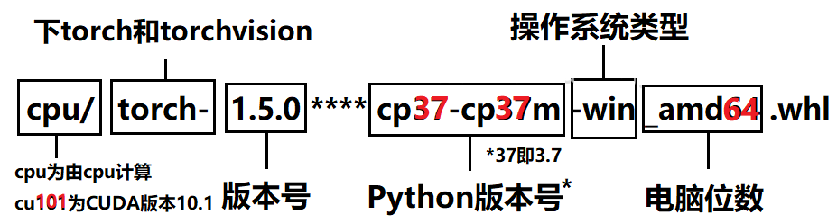
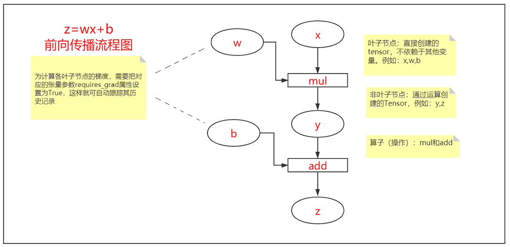
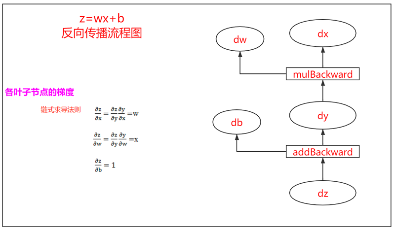
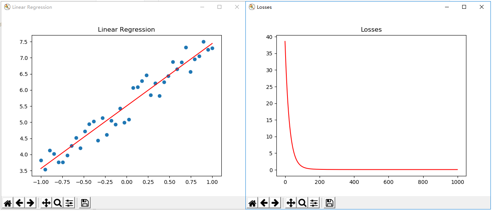
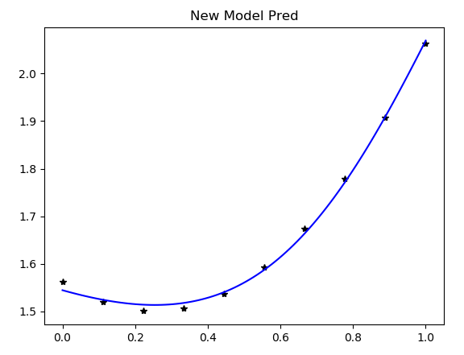

# PyTorch深度学习框架

## 一、PyTorch框架介绍

### 1. PyTorch简介

**1）简介**

PyTorch是一个建立在Torch库之上的Python包，是由Facebook开源的神经网络框架，旨在加速深度学习应用。它提供一种类似NumPy的抽象方法来表征张量（或多维数组），它可以利用GPU来加速训练。Torch 是一个经典的对多维矩阵数据进行操作的张量（tensor ）库，包含自动求导系统的深度神经网络，提供了高度灵活性和效率的深度学习实验性平台，在机器学习和其他数学密集型应用有广泛应用。

与Tensorflow的静态计算图不同，pytorch的计算图是动态的，可以根据计算需要实时改变计算图。

**2）发展历史**

- Pytorch从 2017 年年初发布以来，PyTorch 可谓是异军突起，短时间内取得了一系列成果，成为其中的明星框架。最近Pytorch进行了一些较大的版本更新，0.4版本把Varable与Tensor进行了合并，增加了Windows的支持，实现了张量（Tensor）和变量（Variable）的合并。
- PyTorch 1.0，分布式训练方式大幅更改，PyTorch在分布式计算方面开始对不同的后端有了完善的支持，包括MPI和NCCL等。1.0版本增加了JIT（全称Justintimecompilation，即时编译，它弥补了研究与生产的部署的差距）、更快的分布式、C++扩展等。
- PyTorch 1.1，PyTorch开始支持TensorBoard对于张量的可视化，并且加强了JIT的功能。
- PyTorch 1.2增强了TorchScript的功能，同时增加了Transformer模块，也增加了对视频、文本和音频的训练数据载入的支持。
- PyTorch 1.3，增加了移动端的处理，而且增加了对模型的量化功能（Quantization）的支持。
- PyTorch 1.4，支持Python2的最后一版，支持分布式模型并行、Java程序、移动端等多项新功能。
- 目前最新版本是1.9，新版本不太稳定，1.8版本是距离最新版较稳定的，教学环境使用1.8版本。

**3）优势**

- 简洁。PyTorch的设计追求最少的封装，尽量避免重复造轮子。不像 TensorFlow 中充斥着session、graph、operation、name_scope、variable、tensor、layer等全新的概念，PyTorch 的设计遵循tensor→variable(autograd)→nn.Module 三个由低到高的抽象层次，分别代表高维数组（张量）、自动求导（变量）和神经网络（层/模块），而且这三个抽象之间联系紧密，可以同时进行修改和操作。
- 速度。PyTorch 的灵活性不以速度为代价，在许多评测中，PyTorch 的速度表现胜过 TensorFlow等框架。
- 灵活易用。PyTorch 是所有的框架中面向对象设计的最优雅的一个。PyTorch的面向对象的接口设计来源于Torch，而Torch的接口设计以灵活易用而著称。
- 活跃的社区。PyTorch 提供了完整的文档，循序渐进的指南，作者亲自维护的论坛，供用户交流和求教问题。Facebook 人工智能研究院对 PyTorch 提供了强力支持。

### 2. PyTorch安装

**1）在线安装**

```bash
# cpu版本的
pip3 install torch==1.8.0+cpu torchvision==0.9.0+cpu torchaudio==0.8.0 -f https://download.pytorch.org/whl/torch_stable.html

# CUDA 11.1
pip3 install torch==1.8.0+cu111 torchvision==0.9.0+cu111 torchaudio==0.8.0 -f https://download.pytorch.org/whl/torch_stable.html
```

**2）离线安装**

- 第一步：查看操作系统版本、Python版本，寻找相应的Pytorch安装文件
- 第二步：下载安装包，下载地址：https://download.pytorch.org/whl/torch_stable.html，版本命名规范如下图所示：



- 第三步：执行命令本地安装

  ```bash
  pip3 install 下载路径\***torch-***-cp**-cp**-win_amd64.whl
  pip3 install 下载路径\***torchvision-***-cp**-cp**-win_amd64.whl
  ```

- 第四步：检测安装结果

  ```python
  import torch
  print(torch.__version__)  # 查看pytorch版本
  ```

  

## 二、张量基本操作

### 1. 张量的定义

张量是向量和矩阵的推广。PyTorch中的张量就是元素为同一数据类型性的多维矩阵。PyTorch中，张量以类的形式封装起来，张量类主要起到承载数据并进行计算的作用。张量的处理被封装在张量类中，是通过底层的Aten运算库进行的，Aten是一个C++开发的底层运算库，具有非常好的计算性能。

PyTorch中张量定义有三种方法：

- 将已有的数值转换成张量；
- 根据指定形状、类型生成张量；
- 根据指定形状生成固定值的张量。

**1）将数值转换为张量**

函数torch.tensor()可以将传入的对象转换为张量，该函数既支持Python原生类型，还支持Numpy中的类型。例如：

```python
import torch
import numpy as np

a = torch.tensor(5) # 定义一个张量5
print(a)

arr = np.asarray([4]) # 定义numpy数组
a = torch.tensor(arr)
print(a)
```

**2）根据指定形状生成张量**

```python
import torch

# 根据执行形状生成张量
ts_1 = torch.Tensor(5)
print(ts_1)

ts_2 = torch.Tensor(2, 3)
print(ts_2)

ts_3 = torch.Tensor(2, 3, 4)
print(ts_3)
```

执行结果：

```
tensor([0., 0., 0., 0., 0.])
tensor([[0., 0., 0.],
        [0., 0., 0.]])
tensor([[[1.0286e-38, 9.0919e-39, 8.9082e-39, 9.2755e-39],
         [8.4490e-39, 1.0194e-38, 9.0919e-39, 8.4490e-39],
         [8.7245e-39, 1.1112e-38, 8.9082e-39, 9.5510e-39]],

        [[8.7245e-39, 8.4490e-39, 1.0745e-38, 1.0561e-38],
         [1.0469e-38, 1.0102e-38, 1.0194e-38, 4.2246e-39],
         [1.0286e-38, 1.0653e-38, 1.0194e-38, 4.1328e-39]]])
```

**3）根据指定的值生成张量**

PyTorch中的张量包含了多种类型，每个类型的张量都有单独的定义函数。常见类型函数如下图所示：

| 张量类型               | 函数                 |
| ---------------------- | -------------------- |
| 默认类型（32位浮点型） | torch.Tensor()       |
| 浮点型（32位浮点型）   | torch.FloatTensor()  |
| 整型                   | torch.IntTensor()    |
| 长整型                 | torch.LongTensor()   |
| 双精度浮点型           | torch.DoubleTensor() |

示例：

```python
import torch

# 根据执行值生成张量
a = torch.Tensor([1, 3])
print(a)

b = torch.FloatTensor([1, 3])
print(b)

c = torch.DoubleTensor([1, 3])
print(c)

d = torch.IntTensor([1, 3])
print(d)
```

执行结果：

```
tensor([1., 3.])
tensor([1., 3.])
tensor([1., 3.], dtype=torch.float64)
tensor([1, 3], dtype=torch.int32)
```

**4）生成固定值的张量**

示例：

```python
import torch

# 生成固定值张量
a = torch.ones(2, 3)
print(a)

b = torch.zeros(5)
print(b)

c = torch.ones_like(b)
print(c)
```

执行结果：

```
tensor([[1., 1., 1.],
        [1., 1., 1.]])
tensor([0., 0., 0., 0., 0.])
tensor([1., 1., 1., 1., 1.])
```

**5）生成随机值张量**

示例：

```python
import torch

# 生成随机张量, 服从[0,1)上的均匀分布
t_rand = torch.rand(10)
print(t_rand)

# 生成随机张量，服从均值为0标准差为1的正态分布
t_rand_nor = torch.randn(3, 3)
print(t_rand_nor)

# 根据指定均值、方差生成正态分布随机张量
t_rand_nor2 = torch.normal(mean=0.5, std=2, size=(3, 3))
print(t_rand_nor2)
```

执行结果：

```
tensor([0.4073, 0.2622, 0.6883, 0.7637, 0.3235, 0.3217, 0.4882, 0.8988, 0.4510,
        0.8085])
tensor([[-0.8784, -1.1063,  0.0493],
        [-0.6498,  0.4984, -0.5582],
        [ 2.6824,  0.1671, -0.9245]])
tensor([[-0.5348, -0.5072, -1.0490],
        [-0.8612,  0.0661,  1.0815],
        [ 0.3395, -0.5548,  0.8294]])
```


### 2. 张量的类型操作

**1）判断对象是否为张量**

is_tensor()函数可以判断一个对象是否为张量，例如：

```python
import torch
import numpy as np

a = torch.Tensor(2)
print(torch.is_tensor(a)) # 返回True

b = np.array([1, 2, 3, 4, 5])
print(torch.is_tensor(b)) # 返回False
```

执行结果：

```
True
False
```

**2）张量类型转换**

如果要进行张量类型转换，可以使用张量张量对象的type()方法来实现，对于数值类型，可以通过更简洁的tensor_obj.int()或tensor_obj.double()方法来实现，例如：

```python
import torch

# 类型转换
t_float = torch.FloatTensor([1, 2, 3, 4])
print(t_float)

t_int = t_float.type(torch.IntTensor) # 转换为整型
print(t_int)

t_int2 = t_float.int() # 转换为整型
print(t_int2)

t_double = t_int.double() # 转换为双精度浮点型
print(t_double)
```

执行结果：

```
tensor([1., 2., 3., 4.])
tensor([1, 2, 3, 4], dtype=torch.int32)
tensor([1, 2, 3, 4], dtype=torch.int32)
tensor([1., 2., 3., 4.], dtype=torch.float64)
```


### 3. 张量自变化运算

自变化运算是指在张量本身的基础上做运算，其结果直接作用在张量自身，而不是返回一个张变量。在PyTorch中，所有的自变化运算函数都会带一个下划线。示例：

```python
import torch

a = torch.IntTensor([2])
print(a)

b = torch.IntTensor([3])
print(b)

a.add_(b) # 自变化运算
print(a)
```

执行结果：

```
tensor([2], dtype=torch.int32)
tensor([3], dtype=torch.int32)
tensor([5], dtype=torch.int32)
```


### 4. 张量与Numpy的互转

**1）Numpy对象转张量**

```python
import torch
import numpy as np

# ndarray对象转张量
arr = np.array([[1, 2, 3], [4, 5, 6]])
print(type(arr))
print(arr)
print("-------------------------")

## 方式一
t1 = torch.from_numpy(arr)
print(type(t1))
print(t1)
print("-------------------------")

## 方式二
t2 = torch.FloatTensor(arr)
print(type(t2))
print(t2)
print("-------------------------")

## 方式三
t3 = torch.tensor(arr)
print(type(t3))
print(t3)
```

张量与Numpy对象转换是基于零复制技术实现的。在转换过程中，PyTorch张量与Numpy对象共享同一个内存区域，PyTorch张量会存储一个指向Numpy数组的指针，而不是直接复制数据。

**2）张量转Numpy对象**

```python
import torch
import numpy as np

t = torch.tensor([1, 2, 3, 4]) # 定义张量
arr = t.numpy() # 张量转数组
print(type(arr))
print(arr)
```

**3）张量与Numpy对象互转的陷阱**

PyTorch将Numpy转换为张量时，只是简单地将指针进行赋值，没有对数据进行复制，由于张量和Numpy对象共享一块数据内存，所以一旦修改其中一个，另一个受到到影响。例如：

```python
# ndarray对象转张量的陷阱
import torch
import numpy as np

arr = np.array([1, 2, 3, 4])
t1 = torch.from_numpy(arr)
print(arr)
print(t1)

print("")

arr += 1 # 数组发生了修改，影响张量
print(arr)
print(t1)

print("")

t1.add_(2) # 张量做自变化计算，影响数组
print(arr)
print(t1)
```

执行结果：

```
[1 2 3 4]
tensor([1, 2, 3, 4], dtype=torch.int32)

[2 3 4 5]
tensor([2, 3, 4, 5], dtype=torch.int32)

[4 5 6 7]
tensor([4, 5, 6, 7], dtype=torch.int32)
```

如果要避免这个陷阱，更换一种代码写法，修改数组或张量时，返回另一个对象，则发生内存复制，则可避免。例如：

```python
import torch
import numpy as np

arr2 = np.array([1, 2, 3, 4])
t2 = torch.from_numpy(arr2)
print(arr2)
print(t2)

print("")

arr2 = arr2 + 1 # 返回新对象, 则不影响张量
print(arr2)
print(t2)

print("")

t2 = t2.add(2) # 返回新对象，不影响数组
print(arr2)
print(t2)
```

执行结果：

```
[1 2 3 4]
tensor([1, 2, 3, 4], dtype=torch.int32)

[2 3 4 5]
tensor([1, 2, 3, 4], dtype=torch.int32)

[2 3 4 5]
tensor([3, 4, 5, 6], dtype=torch.int32)
```

### 5. 张量的形状操作

**1）张量变维**

使用reshape()函数可以实现张量维度的变换，在变维时，要保证变维前后元素个数一致。如果将某个维度的值设置为-1，表示该维度由系统计算确定。例如：

```python
# 张量变维
import numpy as np
import torch

t1 = torch.tensor([[1, 2],
                   [3, 4],
                   [5, 6]]) # 3行2列
print(t1.shape)
print(t1)
print("")

# 变维
t2 = torch.reshape(t1, (1, 6)) # 变成1行6列
print(t2.shape)
print(t2)
print("")

t3 = torch.reshape(t1, (-1, 3)) # 变成3列，行数通过计算确定
print(t3.shape)
print(t3)
print("")
```

执行结果：

```
torch.Size([3, 2])
tensor([[1, 2],
        [3, 4],
        [5, 6]])

torch.Size([1, 6])
tensor([[1, 2, 3, 4, 5, 6]])

torch.Size([2, 3])
tensor([[1, 2, 3],
        [4, 5, 6]])
```

**2）张量连接**

使用torch.cat()函数可以将两个张量按照指定的维度连接起来。例如：

```python
import numpy as np
import torch

t1 = torch.tensor([[1, 2], [3, 4]])
t2 = torch.tensor([[5, 6], [7, 8]])
print(t1)
print(t2)

t3 = torch.cat([t1, t2], dim=0) # 纵向连接
print(t3)

t4 = torch.cat([t1, t2], dim=1) # 横向连接
print(t4)
```

执行结果：

```
tensor([[1, 2],
        [3, 4]])
tensor([[5, 6],
        [7, 8]])
tensor([[1, 2],
        [3, 4],
        [5, 6],
        [7, 8]])
tensor([[1, 2, 5, 6],
        [3, 4, 7, 8]])
```

对于三维张量，dim=0表示深度方向叠加；dim=1表示行叠加；dim=2表示列叠加。例如：

```python
# 3维张量连接
import numpy as np
import torch

# dim=0: 深度叠加
# dim=1: 行叠加
# dim=2: 列叠加
tt_1 = torch.tensor([[[1, 1],
                      [2, 2]],
                     [[3, 3],
                      [4, 4]],
                     [[5, 5],
                      [6, 6]]]) # (3, 2, 2)
tt_2 = torch.tensor([[[11, 11],
                      [22, 22]],
                     [[33, 33],
                      [44, 44]],
                     [[55, 55],
                      [66, 66]]]) # (3, 2, 2)
tt_3 = torch.cat([tt_1, tt_2], dim=0)
print(tt_3.shape)
print(tt_3)
```

执行结果：

```
torch.Size([6, 2, 2])
tensor([[[ 1,  1],
         [ 2,  2]],

        [[ 3,  3],
         [ 4,  4]],

        [[ 5,  5],
         [ 6,  6]],

        [[11, 11],
         [22, 22]],

        [[33, 33],
         [44, 44]],

        [[55, 55],
         [66, 66]]])
```

**3）张量分割**

torch.chunk()函数可以将张量在指定的维度上进行均匀分割，torch.split()函数在指定维度上进行不均匀分割。例如：

```python
# 张量分割
import torch

# 均匀分割: chunk函数
print("均匀分割示例:")
a = torch.tensor([[1, 2],
                  [2, 4],
                  [3, 6],
                  [4, 8]])

b = torch.chunk(a, chunks=2, dim=0) # 行方向进行分割
for item in b:
    print(item)
    print("")

c = torch.chunk(a, chunks=2, dim=1) # 列方向进行分割
for item in c:
    print(item)
    print("")

print("")

# 不均匀分割: split函数
print("不均匀分割示例:")
a = torch.tensor([[1, 2, 3],
                  [2, 4, 6],
                  [3, 6, 9],
                  [4, 8, 12],
                  [5, 10, 15]])
b = torch.split(a,
                split_size_or_sections=3, # 每个片段的大小
                dim=0) # 行方向
for item in b:
    print(item)
    print("")

c = torch.split(a,
                split_size_or_sections=2, # 每个片段的大小
                dim=1) # 列方向
for item in c:
    print(item)
    print("")
```

执行结果：

```
均匀分割示例:
tensor([[1, 2],
        [2, 4]])
tensor([[3, 6],
        [4, 8]])
tensor([[1],
        [2],
        [3],
        [4]])
tensor([[2],
        [4],
        [6],
        [8]])

不均匀分割示例:
tensor([[1, 2, 3],
        [2, 4, 6],
        [3, 6, 9]])
tensor([[ 4,  8, 12],
        [ 5, 10, 15]])
tensor([[ 1,  2],
        [ 2,  4],
        [ 3,  6],
        [ 4,  8],
        [ 5, 10]])
tensor([[ 3],
        [ 6],
        [ 9],
        [12],
        [15]])
```


## 三、Variable与自动微分

Variable（变量）是一种特殊张量，它是由Autograd模块对张量进一步封装实现，Variable对象能够自动求导，从而支持神经网络的实现反向传播计算。Autograd（自动微分）模块基于正向计算的结果对当前参数进行微分计算，自动计算模型参数的梯度，从而实现网络权重的更新。

### 1. Tensor与Variable的转换

利用Variable操作可以实现普通张量到Variable的转换，例如：

```python
# Tensor转换为Variable
import torch
from torch.autograd import Variable

a = torch.tensor([1.0, 2.0, 3.0, 4.0]) # 普通张量
print(type(a))
print(a.requires_grad)
print(a)

# 转换为Variable
# requires_grad参数: 指定是否需要进行梯度计算, 前提是张量必须为浮点型
var1 = Variable(a, requires_grad=True)
print(type(var1))
print(var1.requires_grad)
print(var1)
```

执行结果：

```
<class 'torch.Tensor'>
False
tensor([1., 2., 3., 4.])

<class 'torch.Tensor'>
True
tensor([1., 2., 3., 4.], requires_grad=True)
```

从执行结果中可以看到，Tensor和Variable其实为同一类型，即torch.Tensor。

### 2. 打开和关闭梯度计算

可以使用enable_grad()、no_grad()函数打开和关闭梯度计算。例如：

```python
# 打开或关闭变量梯度计算
import torch
from torch.autograd import Variable


@torch.no_grad()  # 装饰器方式关闭梯度计算
# @torch.enable_grad() # 装饰器方式打开梯度
def doubler(x):
    return x * 2


x = torch.ones(2, 2, requires_grad=True)
print(type(x))
print(x)

with torch.no_grad():  # 利用with语句块关闭梯度计算
# with torch.enable_grad(): # 利用with语句块打开梯度计算
    y = x * 2
print(y.requires_grad)  # y的梯度计算被关闭
print(x.requires_grad)  # x梯度计算并没有被关闭

print("")

z = doubler(x)
print(z.requires_grad)  # z的梯度计算被关闭
print(x.requires_grad)  # x梯度计算并没有被关闭
```

执行结果：

```
<class 'torch.Tensor'>
tensor([[1., 1.],
        [1., 1.]], requires_grad=True)
False
True

False
True
```

由于no_grad()和enable_grad()函数规则较为混乱，在实际中，更多是使用set_grad_enabled()函数统一打开或关闭梯度计算。例如：

```python
# 统一打开/关闭梯度计算功能
import torch
from torch.autograd import Variable

x = torch.ones(2, 2, requires_grad=True)
print(type(x))
print(x)

torch.set_grad_enabled(False)  # 统一关闭梯度计算功能
y = x * 2
w = torch.ones(3, 3)
z = torch.ones(3, 3, requires_grad=True)

torch.set_grad_enabled(True) # 统一打开梯度计算功能
m = x ** 2


print("x:", x.requires_grad) # 关闭之前创建的不受影响
print("y:", y.requires_grad) # 计算产生的新张量被关闭
print("w:", w.requires_grad) # 创建的新张量默认为关闭
print("z:", z.requires_grad) # 显示指定requires_grad=True的不被关闭

print("m:", m.requires_grad) # 打开后创建的张量统一默认被打开
```

执行结果：

```
<class 'torch.Tensor'>
tensor([[1., 1.],
        [1., 1.]], requires_grad=True)
关闭梯度计算
打开梯度计算
x: True
y: False
w: False
z: True
m: True
```

### 3. 自动微分实现机制

模型计算过程可以用计算图来表示，计算图是一种有向无环图，用图形方式表示算子与变量之间的关系，直观高效（图下图所示）。其中，圆形表示变量，矩阵表示算子。例如表达式$z=wx+b$，可写成两个表示式$y=wx, z=y+b$，其中x、w、b为变量，是用户创建的变量，不依赖于其他变量，故又称为叶子节点。为计算各叶子节点的梯度，需要把对应的张量参数requires_grad属性设置为True，这样就可自动跟踪其历史记录。y、z是计算得到的变量，非叶子节点，z为根节点。mul和add是算子（或操作或函数）。由这些变量及算子，就构成一个完整的计算过程（或前向传播过程）。



Pytorch调用backward()时，将自动计算各节点的梯度，如下图所示，这是一个反向传播过程。在反向传播过程中，autograd沿着图，从当前根节点z反向溯源，利用导数链式法则，计算所有叶子节点的梯度，其梯度值将累加到grad属性中。对非叶子节点的计算操作记录在grad_fn属性（grad_fn为一个函数地址，根据该函数能求得该参数在该计算节点的梯度）中，叶子节点的grad_fn值为None。



### 4. 自动微分示例

**1）标量自动微分示例**

```python
# 标量反向传播
import torch

# 定义输入张量x
x = torch.Tensor([2])

# 初始化权重参数W,偏移量b、并设置require_grad属性为True，为自动求导
w = torch.randn(1, requires_grad=True)
b = torch.randn(1, requires_grad=True)

# 实现前向传播
y = torch.mul(w, x)  # 等价于w*x
z = torch.add(y, b)  # 等价于y+b

# 查看x,w,b页子节点的requite_grad属性
print("x.requires_grad：", x.requires_grad)
print("w.requires_grad：", w.requires_grad)
print("b.requires_grad：", b.requires_grad)
# 查看is_leaf属性
print("x.is_leaf：", x.is_leaf)
print("w.is_leaf：", w.is_leaf)
print("b.is_leaf：", b.is_leaf)
print("y.is_leaf：", y.is_leaf)
# 查看grad_fn属性
print("x.grad_fn：", x.grad_fn)
print("w.grad_fn：", w.grad_fn)
print("b.grad_fn：", b.grad_fn)
print("y.grad_fn：", y.grad_fn)

z.backward()  # 反向传播求梯度,执行backward之后计算图会自动清空
# z.backward(retain_graph=True) # 可以将参数retain_graph置为True实现梯度累加

## w,b为叶子节点梯度
print("w.grad：", w.grad)
print("b.grad：", b.grad)
## y,z为非叶子节点, 执行backward后，会自动清空
print("y.grad：", y.grad)
print("z.grad：", z.grad)
```

打印结果：

```
x.requires_grad： False
w.requires_grad： True
b.requires_grad： True
x.is_leaf： True
w.is_leaf： True
b.is_leaf： True
y.is_leaf： False
x.grad_fn： None
w.grad_fn： None
b.grad_fn： None
y.grad_fn： <MulBackward0 object at 0x0000027662CDED30>
w.grad： tensor([2.])
b.grad： tensor([1.])
y.grad： None
z.grad： None
```


**2）非标量自动微分示例**

Pytorch有个简单的规定，不让张量(tensor)对张量求导，只允许标量对张量求导，因此，如果目标张量对一个非标量调用backward()，需要传入一个gradient参数,该参数也是张量，而且需要与调用backward()的张量形状相同。

```python
# 非标量反向传播
import torch

x = torch.tensor([1, 2], dtype=torch.float, requires_grad=True)
y = torch.tensor([2, 3], dtype=torch.float, requires_grad=True)
Q = 3 * x ** 2 - y ** 2 # 目标函数

ext_grad = torch.tensor([1.0, 1.0])
Q.backward(gradient=ext_grad) # gradient参数通常是一个全为1的向量

print("x.grad:", x.grad)
print("y.grad:", y.grad)
```

执行结果：

```
x.grad: tensor([ 6., 12.])
y.grad: tensor([-4., -6.])
```

注：backward函数gradient参数的用途见附录1" 利用雅可比公式对非标量求导过程"。


## 四、模型相关操作

### 1. 模型定义

#### 1）利用Module类自定义模型

如果需要自定义一个模型，可以从Module类（即torch.nn.Module，它是所有网络的基类）继承，然后重写forward方法，该方法在模型前向传播时被调用，backward函数不需要显示定义和重写，Pytorch会自动实现利用Autograd机制实现。示例：

```python
import torch
from matplotlib import pyplot as plt
from torch.autograd import Variable
from torch import nn


class LinearRegression(nn.Module):
    def __init__(self):
        # 继承父类构造函数
        super(LinearRegression, self).__init__()
        # 输入和输出的维度都是1
        self.linear = nn.Linear(1, 1)

    def forward(self, x):
        out = self.linear(x)
        return out


# 创建LinearRegression（）的实例
model = LinearRegression()  # 实例化对象
print(model)
num_epochs = 1000  # 迭代次数
learning_rate = 1e-2  # 学习率0.01
Loss = torch.nn.MSELoss()  # 损失函数
optimizer = torch.optim.SGD(model.parameters(), # 指定优化的参数
                            lr=learning_rate)  # 优化函数

# 创建数据集
## unsqueeze指插入一个维度, 否则张量为一维
x = Variable(torch.unsqueeze(torch.linspace(-1, 1, 40), dim=1))
# print("x.shape:", x.shape)
y = Variable(x * 2 + 5 + torch.rand(x.size())) # 计算y值
# plt.scatter(x.data.numpy(),y.data.numpy())
# plt.show()

loss_list = []
epoch_list = []

for epoch in range(num_epochs):
    y_pred = model(x) # 预测
    loss = Loss(y_pred, y) # 计算loss
    optimizer.zero_grad() # 清空梯度, 防止梯度累积
    loss.backward() # 反向传播
    optimizer.step() # 更新参数

    epoch_list.append(epoch)
    loss_list.append(torch.detach(loss).numpy())

    if epoch % 100 == 0:
        print("[%d/%d]  loss:%.4f" % (epoch, num_epochs, loss))

# 样本及模型可视化
plt.figure("Linear Regression")
plt.title("Linear Regression")
plt.scatter(x.data.numpy(), y.data.numpy()) # 样本散点图
plt.plot(x.data.numpy(), y_pred.data.numpy(), 'r-') # 线性模型

# 损失函数可视化
plt.figure("Losses")
plt.title("Losses")
plt.plot(epoch_list, loss_list, c="red")

plt.show()
```

执行结果：



#### 2）ModuleList和Sequential

nn.ModuleList 相当于一个列表（功能类似Python中的列表），可以将module添加到该列表中，加入到 nn.ModuleList 里面的 module 会自动注册到整个网络上，模型参数也会自动添加到整个网络中。示例如下：

```python
import torch
from torch import nn


class Net1(nn.Module):
    def __init__(self):
        super(Net1, self).__init__()  # 父类构造方法
        # 创建两个Linear模型放入ModuleList中
        self.linears = nn.ModuleList([nn.Linear(10, 10) for i in range(2)])

    def forward(self, x):
        for m in self.linears:
            x = m(x)

        return x


# 实例化模型并打印
net = Net1()
print(net)

# 打印模型参数
for param in net.parameters():
    print(type(param.data), param.size())
```

执行结果：

```
Net1(
  (linears): ModuleList(
    (0): Linear(in_features=10, out_features=10, bias=True)
    (1): Linear(in_features=10, out_features=10, bias=True)
  )
)
<class 'torch.Tensor'> torch.Size([10, 10])
<class 'torch.Tensor'> torch.Size([10])
<class 'torch.Tensor'> torch.Size([10, 10])
<class 'torch.Tensor'> torch.Size([10])
```

nn.ModuleList 并没有定义一个网络，它只是将不同的模块储存在一起，这些模块之间并没有什么先后顺序可言，网络的执行顺序是根据forward中的调用顺序来决定的。在Pytorch中，定义多层模型及子模型执行顺序，更多使用nn.Sequential来完成，它实现了内部forward函数，并且按照nn.Sequential中的顺序来逐层执行（这就需要我们在定义nn.Sequential中的每一层操作时，确保每层之间的张量形状是匹配的，否则会引发错误）。示例如下：

```python
import torch
from torch import nn


class Net2(nn.Module):
    def __init__(self):
        super(Net2, self).__init__()
        # 定义顺序执行层
        self.block = nn.Sequential(nn.Conv2d(1, 20, 5),
                                   nn.ReLU(),
                                   nn.Conv2d(20, 64, 5),
                                   nn.ReLU())

    def forward(self, x):
        x = self.block(x)
        return x


net = Net2()
print(net)

# 打印模型参数
for param in net.parameters():
    print(type(param.data), param.size())
```

执行结果：

```
Net2(
  (block): Sequential(
    (0): Conv2d(1, 20, kernel_size=(5, 5), stride=(1, 1))
    (1): ReLU()
    (2): Conv2d(20, 64, kernel_size=(5, 5), stride=(1, 1))
    (3): ReLU()
  )
)
<class 'torch.Tensor'> torch.Size([20, 1, 5, 5])
<class 'torch.Tensor'> torch.Size([20])
<class 'torch.Tensor'> torch.Size([64, 20, 5, 5])
<class 'torch.Tensor'> torch.Size([64])
```


### 2. 模型保存与加载

模型保存有两种，一种是保存整个模型（包括模型结构、参数），另一种是只保存模型参数，下面分别进行介绍。

#### 1）保存/加载整个模型

保存、加载整个模型的API：

```python
# 保存模型:将模型net保存到save_path指定的路径
torch.save(net, save_path)

# 加载模型：从save_path指定的路径加载模型，返回模型
net = torch.load(save_path)
```

示例：

```python
import torch
import torch.nn as nn
import torch.optim as optim


# 定义模型
class Net(nn.Module):
    def __init__(self):
        super(Net, self).__init__()
        self.fc1 = nn.Linear(1, 2)
        self.fc2 = nn.Linear(2, 1)

    def forward(self, x):
        x = torch.sigmoid(self.fc1(x))
        x = self.fc2(x)
        return x


# 创建样本
x = torch.linspace(0, 1, 10).reshape(10, 1)  # 产生10个样本
y = x * x - 0.5 * x + 1.5625  # 计算y

net = Net()  # 实例化模型
optimizer = optim.SGD(net.parameters(), lr=0.1)

for n in range(0, 10000):  # 训练
    optimizer.zero_grad()  # 梯度清零
    y_pred = net(x)  # 前向计算
    loss = sum((y_pred - y) ** 2) / 2
    # loss = sum(abs(y_pred - y))

    loss.backward()  # 反向传播
    optimizer.step()  # 参数更新

    if n % 1000 == 0:
        print(n, loss)

print('Finished Training!')

# 保存模型
torch.save(net, "model/mynet.pt")
print("保存模型成功.")

# 加载模型
net2 = torch.load("model/mynet.pt")

# 测试加载的模型
import matplotlib.pyplot as plt

plt.plot(x, y, "k*")

test_y = []
test_x = torch.linspace(0, 1, 100).reshape(100, 1)
for sample in test_x:
    y_hat = net2(sample)
    #test_y.append(y_hat)
    test_y.append(torch.detach(y_hat).numpy()[0])

plt.plot(torch.detach(test_x).numpy(), test_y, "b-")
plt.show()
```

执行结果：



#### 2）保存/加载模型参数

模型的state_dict( )方法返回模型的全部参数字典，如果只保存参数，在调用torch.save( )时需要传入一个字典对象（而不是模型对象）；加载模型参数时，先创建一个新模型，然后调用该模型的load_state_dict( )方法将参数加载到模型是，API如下所示：

```python
# 保存模型:通过net.state_dict()取得模型参数，保存到save_path指定的路径
torch.save(net.state_dict(), save_path)

# 加载模型： 先定义模型，再加载参数
net2 = Net()  # 定义模型
net = torch.load(torch.load(save_path)) # 加载参数
```

示例：

```python
import torch
import torch.nn as nn
import torch.optim as optim


# 定义模型
class Net(nn.Module):
    def __init__(self):
        super(Net, self).__init__()
        self.fc1 = nn.Linear(1, 2)
        self.fc2 = nn.Linear(2, 1)

    def forward(self, x):
        x = torch.sigmoid(self.fc1(x))
        x = self.fc2(x)
        return x


# 创建样本
x = torch.linspace(0, 1, 10).reshape(10, 1)  # 产生10个样本
y = x * x - 0.5 * x + 1.5625  # 计算y

net = Net()  # 实例化模型
optimizer = optim.SGD(net.parameters(), lr=0.1)

for n in range(0, 10000):  # 训练
    optimizer.zero_grad()  # 梯度清零
    y_pred = net(x)  # 前向计算
    loss = sum((y_pred - y) ** 2) / 2
    # loss = sum(abs(y_pred - y))

    loss.backward()  # 反向传播
    optimizer.step()  # 参数更新

    if n % 1000 == 0:
        #print(n, loss)
        print(n, torch.detach(loss).numpy())

print('Finished Training!')

# 保存模型参数
torch.save(net.state_dict(), "model/mynet-wts.pt")
print(net.state_dict())
print("保存模型成功.\n")

# 加载模型
net2 = Net() # 必须先创建一个模型
net2.load_state_dict(torch.load("model/mynet-wts.pt"))
print(net2.state_dict())

# 测试加载的模型
import matplotlib.pyplot as plt

plt.figure("Model Save and Load")
plt.title("New Model Pred")

plt.plot(x, y, "k*") # 样本

test_y = []
test_x = torch.linspace(0, 1, 100).reshape(100, 1)
for sample in test_x:
    y_hat = net2(sample)
    #test_y.append(y_hat)
    test_y.append(torch.detach(y_hat).numpy()[0])

plt.plot(torch.detach(test_x).numpy(), test_y, "b-")
plt.show()
```

打印输出：

```
OrderedDict([('fc1.weight', tensor([[3.8144],[0.1430]])), 
             ('fc1.bias', tensor([-4.6193, -1.9221])), 
			 ('fc2.weight', tensor([[1.8789, 0.0625]])), 
			 ('fc2.bias', tensor([1.4651]))])
保存模型成功.

OrderedDict([('fc1.weight', tensor([[3.8144],[0.1430]])), 
             ('fc1.bias', tensor([-4.6193, -1.9221])), 
			 ('fc2.weight', tensor([[1.8789, 0.0625]])), 
			 ('fc2.bias', tensor([1.4651]))])
```


## 五、综合案例

### 1）案例一：编写CNN

【任务描述】利用PyTorch编写LeNet，实现在Cifar-10数据集下图像分类任务

【数据集】cifar-10-python.tar.gz（和代码放在同一目录下）

【代码】

```python
import torch
import torch.nn as nn
import torchvision
import torch.optim as optim
import torch.nn.functional as F
import torchvision.transforms as transforms
import os


class LeNet(nn.Module):
    def __init__(self):
        super(LeNet, self).__init__()  # 父类构造方法

        self.conv_block = nn.Sequential(
            nn.Conv2d(3, 16, 5),  # 输入3通道32*32、输出16通道28*28、卷积核大小5
            nn.ReLU(inplace=True),
            nn.MaxPool2d(2, 2),  # 16*14*14

            nn.Conv2d(16, 32, 5),  # 输入16通道、输出32通道10*10、卷积核大小5
            nn.ReLU(inplace=True),
            nn.MaxPool2d(2, 2),  # 32*5*5
        )

        self.classifier = nn.Sequential(
            nn.Linear(32 * 5 * 5, 120),  # fc1
            nn.ReLU(inplace=True),
            nn.Linear(120, 84),  # fc2
            nn.ReLU(inplace=True),
            nn.Linear(84, 10)  # fc3
        )

    def forward(self, x):
        features = self.conv_block(x)
        flat_features = torch.flatten(features, start_dim=1)
        out = torch.nn.Softmax(dim=1)(self.classifier(flat_features))
        return out


def main():
    model_path = './Lenet.pth'

    transform = transforms.Compose(
        [transforms.ToTensor(),
         transforms.Normalize((0.5, 0.5, 0.5), (0.5, 0.5, 0.5))])

    # 训练集读取器
    train_set = torchvision.datasets.CIFAR10(root='./',
                                             train=True,
                                             download=True,
                                             transform=transform)
    train_loader = torch.utils.data.DataLoader(train_set,
                                               batch_size=36,
                                               shuffle=True,
                                               num_workers=0)
    # 评估集读取器
    val_set = torchvision.datasets.CIFAR10(root='./',
                                           train=False,
                                           download=True,
                                           transform=transform)
    val_loader = torch.utils.data.DataLoader(val_set,
                                             batch_size=5000,
                                             shuffle=False,
                                             num_workers=0)
    val_data_iter = iter(val_loader)
    val_image, val_label = next(val_data_iter)

    net = LeNet()  # 模型
    # 加载模型
    if os.path.exists(model_path):
        net.load_state_dict(torch.load(model_path))
        print("加载模型成功.")

    loss_function = nn.CrossEntropyLoss()
    optimizer = optim.Adam(net.parameters(), lr=0.0001)

    for epoch in range(5):  # loop over the dataset multiple times
        running_loss = 0.0
        for step, data in enumerate(train_loader, start=0):

            inputs, labels = data  # 取出输入、标签
            optimizer.zero_grad()  # 梯度清除

            outputs = net(inputs)  # 正向计算

            loss = loss_function(outputs, labels)
            loss.backward()  # 反向传播
            optimizer.step()  # 参数更新

            running_loss += loss.item()
            if step % 500 == 499:  # print every 500 mini-batches
                with torch.no_grad():
                    outputs = net(val_image)  # [batch, 10] # 评估
                    # print(torch.max(outputs, dim=1))
                    predict_y = torch.max(outputs, dim=1)[1]
                    accuracy = torch.eq(predict_y, val_label).sum().item() / val_label.size(0)

                    print('[%d, %5d] train_loss: %.3f  test_accuracy: %.3f' %
                          (epoch + 1, step + 1, running_loss / 500, accuracy))
                    running_loss = 0.0

    print('Finished Training')

    torch.save(net.state_dict(), model_path)


if __name__ == '__main__':
    main()
```


## 附录

### 1. 利用雅可比公式对非标量求导过程

示例代码：

```python
import torch

x = torch.tensor([1, 2], dtype=torch.float, requires_grad=True)
y = torch.tensor([2, 3], dtype=torch.float, requires_grad=True)
z = 3 * x ** 2 - y ** 2
```

求解公式：
$$
z = 3x^2-y^2
$$
此时z是一个矢量，即2*1的向量，那么就需要显式添加参数去计算:
$$
\frac{\partial z}{\partial x} =6x^2
$$

$$
\frac{\partial z}{\partial y} =-2y
$$

设置backward参数为[1,1]，则可将求导公式表示为标量计算：
$$
z_1=3x_1^3-y^2 \\
z_2=3x_2^3-y^2
$$
表示为雅克比公式如下：
$$
\frac{\partial z}{\partial x} =\left[ \begin{matrix}
   {\frac{\partial z_1}{\partial x_1}} & {\frac{\partial z_1}{\partial x_2}}  \\
   {\frac{\partial z_2}{\partial x_1}} & {\frac{\partial z_2}{\partial x_2}}  \\
\end{matrix} \right] \\

\frac{\partial z}{\partial y} =\left[ \begin{matrix}
   {\frac{\partial z_1}{\partial y_1}} & {\frac{\partial z_1}{\partial y_2}}  \\
   {\frac{\partial z_2}{\partial y_1}} & {\frac{\partial z_2}{\partial y_2}}  \\
\end{matrix} \right]
$$
当backward参数为[1,1]，计算公式为：
$$
\left[ \begin{matrix}
   {\frac{\partial z_1}{\partial x_1}} & {\frac{\partial z_1}{\partial x_2}}  \\
   {\frac{\partial z_2}{\partial x_1}} & {\frac{\partial z_2}{\partial x_2}}  \\
\end{matrix} \right] \times 
\left[ \begin{matrix}
1 \\
1
\end{matrix} \right] = 
\left[ \begin{matrix}
6x_1 & 0\\
0 & 6x_2
\end{matrix} \right]
\times
\left[ \begin{matrix}
1 \\
1
\end{matrix} \right] = 
\left[ \begin{matrix}
6 & 0\\
0 & 12
\end{matrix} \right]
\times
\left[ \begin{matrix}
1 \\
1
\end{matrix} \right]=[6,12] \\

\left[ \begin{matrix}
   {\frac{\partial z_1}{\partial y_1}} & {\frac{\partial z_1}{\partial y_2}}  \\
   {\frac{\partial z_2}{\partial y_1}} & {\frac{\partial z_2}{\partial y_2}}  \\
\end{matrix} \right] \times 
\left[ \begin{matrix}
1 \\
1
\end{matrix} \right] = 
\left[ \begin{matrix}
-2y_1 & 0\\
0 & -2y_2
\end{matrix} \right]
\times
\left[ \begin{matrix}
1 \\
1
\end{matrix} \right] = 
\left[ \begin{matrix}
-4 & 0\\
0 & -6
\end{matrix} \right]
\times
\left[ \begin{matrix}
1 \\
1
\end{matrix} \right]=[-4,-6]
$$


