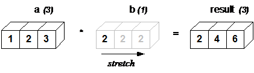
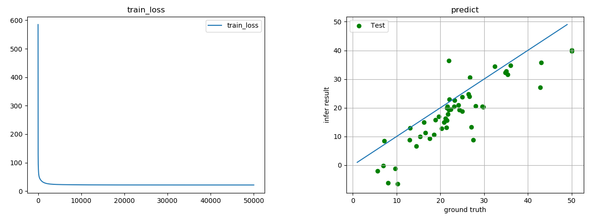

# Tensorflow2.0讲义

## 一、Tensorflow简介

### 1. 简介

TensorFlow由谷歌人工智能团队谷歌大脑（Google Brain）开发和维护的深度学习框架。自2015年11月9日起，TensorFlow依照Apache 2.0 open source license开放源代码。2019年春发布2.0版本。

### 2. 安装

#### 1）支持的软件环境

- Python 3.6–3.9
  - 若要支持 Python 3.9，需要使用 TensorFlow 2.5 或更高版本
  - 若要支持 Python 3.8，需要使用 TensorFlow 2.2 或更高版本
- Ubuntu 16.04 或更高版本
- Windows 7 或更高版本
- macOS 10.12.6 (Sierra) 或更高版本（不支持 GPU），macOS 要求使用 pip 20.3 或更高版本

#### 2）在线安装

TensorFlow 2 软件包需要使用高于 19.0 的 `pip` 版本（对于 macOS 来说，则需要高于 20.3 的 pip 版本）

```bash
pip3 install --upgrade pip
pip3 install tensorflow==2.3.0
```

由于默认使用国外源，所以推荐使用以下命令从国内源安装：

```bash
pip3 install  --user tensorflow==2.3.0 --index-url https://pypi.tuna.tsinghua.edu.cn/simple/  --trusted-host https://pypi.tuna.tsinghua.edu.cn
```

#### 3）离线安装

到以下地址下载响应软件包：https://pypi.org/project/tensorflow/#files

安装指令：

```bash
pip3 install tensorflow-2.3.0-cp37-cp37m-win_amd64.whl
```

### 3. Tensorflow2.X的主要改进

1）更干净的API设计。

2）Eager execution（立即执行）模式。TensorFlow 1.x构建好程序后，需通过session.run方法调用来执行程序。TensorFlow 2.x Eager execution模式下，可以像执行普通Python程序那样执行Tensorflow程序。

3）更少的全局变量。TensorFlow 1.x严重依赖于隐式全局名称空间，例如当您调用tf.Variable时，它将被放入默认图中，并一直保存在哪里，哪怕不再使用。TensorFlow 2.0消除了所有这些机制，支持默认机制：跟踪变量，如果某个变量不再使用，它将被垃圾收集。

4）支持静态图、动态图模式。在TensorFlow 2.0中，默认情况下使用动态图模式，您可以使用tf.function修饰Python函数，将动态图转化成静态图加速。

## 二、Tensorflow基本操作

### 1. 张量

#### 1）张量的定义

张量是具有统一类型（称为 `dtype`）的多维数组。就像 Python 数值和字符串一样，所有张量都是不可变的：永远无法更新张量的内容，只能创建新的张量。

```python
import tensorflow as tf
import numpy as np

# 下面是一个“标量”（或称“0 秩”张量）, 标量包含单个值，但没有“轴”
rank_0 = tf.constant(4)
print(rank_0)

# “向量”（或称“1 秩”张量）就像一个值的列表。向量有 1 个轴
rank_1 = tf.constant([2.0, 3.0, 4.0])
print(rank_1)

# “矩阵”（或称“2 秩”张量）有 2 个轴
rank_2 = tf.constant([[1, 2],
                      [3, 4],
                      [5, 6]], dtype=tf.float16)
print(rank_2)

# 张量的轴可能更多，下面是一个包含 3 个轴的张量
rank_3 = tf.constant([
    [[0, 1, 2, 3, 4],
     [5, 6, 7, 8, 9]],
    [[10, 11, 12, 13, 14],
     [15, 16, 17, 18, 19]],
    [[20, 21, 22, 23, 24],
     [25, 26, 27, 28, 29]], ])

print(rank_3)
```


执行结果：

```
tf.Tensor(4, shape=(), dtype=int32)
tf.Tensor([2. 3. 4.], shape=(3,), dtype=float32)
tf.Tensor(
[[1. 2.]
 [3. 4.]
 [5. 6.]], shape=(3, 2), dtype=float16)
tf.Tensor(
[[[ 0  1  2  3  4]
  [ 5  6  7  8  9]]

 [[10 11 12 13 14]
  [15 16 17 18 19]]

 [[20 21 22 23 24]
  [25 26 27 28 29]]], shape=(3, 2, 5), dtype=int32)
```


#### 2）张量支持的数据类型

tf.dtypes.DType中可以查看所有支持的数据类型，张量支持的常用类型有：

```python
############## 常用类型  ##############  
# 浮点类型
tf.float16: 16-bit half-precision floating-point.
tf.float32: 32-bit single-precision floating-point.
tf.float64: 64-bit double-precision floating-point.
tf.bfloat16: 16-bit truncated floating-point.

# 整数型
tf.int8: 8-bit signed integer.
tf.uint8: 8-bit unsigned integer.
tf.uint16: 16-bit unsigned integer.
tf.uint32: 32-bit unsigned integer.
tf.uint64: 64-bit unsigned integer.
tf.int16: 16-bit signed integer.
tf.int32: 32-bit signed integer.
tf.int64: 64-bit signed integer.
    
# 布尔类型
tf.bool: Boolean.
    
# 字符串类型
tf.string: String.
```

除了这些常用类型外，还支持一些不常用数据类型：

```python
############## 不常用类型  ##############  
# 复数
tf.complex64: 64-bit single-precision complex.
tf.complex128: 128-bit double-precision complex.
    
# 量化类型
tf.qint8: Quantized 8-bit signed integer.
tf.quint8: Quantized 8-bit unsigned integer.
tf.qint16: Quantized 16-bit signed integer.
tf.quint16: Quantized 16-bit unsigned integer.
tf.qint32: Quantized 32-bit signed integer.

# 可变资源类型
tf.resource: Handle to a mutable resource.
    
# 任意类型
tf.variant: Values of arbitrary types.
```

#### 3）张量的形状

张量有形状。下面是几个相关术语：

- **形状**：张量的每个维度的长度（元素数量）。
- **秩**：张量的维度数量。标量的秩为 0，向量的秩为 1，矩阵的秩为 2。
- **轴**或**维度**：张量的一个特殊维度。
- **大小**：张量的总项数，即乘积形状向量。

张量形状可以通过shape属性来获取，例如：

```python
import tensorflow as tf
import numpy as np

rank_4 = tf.zeros([3, 2, 4, 5])
print("Shape of tensor:", rank_4.shape)
print("Elements along axis 0 of tensor:", rank_4.shape[0])
```

张量的形状是一维数组，每个数字表示的含义如下：


#### 4）张量与数组

张量是一个数学概念，数组是一个计算机概念。Python原生语言中没有数组概念，Numpy库中有数组概念（ndarray），张量和数组有密切的关系，但毕竟不是同一个数据类型。可以通过np.array（）或tensor.numpy（）将张量转换为数组。

```python
import tensorflow as tf
import numpy as np

rank_1 = tf.constant([0, 1, 1, 2, 3, 5, 8, 13, 21, 34])

arr1 = np.array(rank_1)
print(arr1)
print(rank_1.numpy())
```

执行结果：

```
[ 0  1  1  2  3  5  8 13 21 34]
[ 0  1  1  2  3  5  8 13 21 34]
```


### 2. 张量基本操作

#### 1）索引与切片操作

TensorFlow 遵循标准 Python 索引规则（类似于在 Python 中为列表或字符串编制索引）以及 NumPy 索引的基本规则：

- 索引从 `0` 开始编制
- 负索引表示按倒序编制索引
- 冒号 `:` 用于切片 `start:stop:step`

```python
import tensorflow as tf
import numpy as np

# 通过索引访问会移除维度
rank_1 = tf.constant([0, 1, 1, 2, 3, 5, 8, 13, 21, 34])
print(rank_1.numpy())

# 使用切片会保留维度
print("Everything:", rank_1[:].numpy())
print("Before 4:", rank_1[:4].numpy())
print("From 4 to the end:", rank_1[4:].numpy())
print("From 2, before 7:", rank_1[2:7].numpy())
print("Every other item:", rank_1[::2].numpy())
print("Reversed:", rank_1[::-1].numpy())
```

可以通过切片、索引组合访问张量元素：

```python
rank_3 = tf.constant([
    [[0, 1, 2, 3, 4],
     [5, 6, 7, 8, 9]],
    [[10, 11, 12, 13, 14],
     [15, 16, 17, 18, 19]],
    [[20, 21, 22, 23, 24],
     [25, 26, 27, 28, 29]], ])

# 选择批次中每个示例的所有位置的最后一个特征
print(rank_3[:, :, 4])
```

操作示意图如下所示：


#### 2）形状操作

可以使用shape属性获取张量形状，使用set_shape函数设置张量形状。示例：

```python
import tensorflow as tf

var1 = tf.Variable(tf.constant([[1], [2], [3]]))
print(var1.shape)  # (3,1)

var2 = tf.Variable(tf.constant([[1, 2, 3],
                                [2, 3, 4],
                                [3, 4, 5],
                                [5, 6, 7]]))
print(var2.shape)  # (4,3)

var_new = tf.reshape(var2, [2, 6]) # 创建新张量，数据内容相同，形状不同
print(var_new.shape)
print(var_new)
```


#### 3）广播机制

- 什么是广播

  广播是从 NumPy 中的等效功能借用的一个概念。简而言之，在一定条件下，对一组张量执行组合运算时，为了适应大张量，会对小张量进行“扩展”。

  最简单和最常见的例子是尝试将张量与标量相乘或相加。在这种情况下会对标量进行广播，使其变成与其他参数相同的形状。

- 广播的原则

  广播主要发生在两种情况，一种是两个张量的维数不相等，但是它们的后缘维度的轴长相符，另外一种是有一方的长度为1。

  

  

  

  以下情况不能广播：

  

- 示例

  ```python
  # 广播
  import tensorflow as tf
  
  x = tf.constant([1, 2, 3])
  y = tf.constant(2)
  z = tf.constant([2, 2, 2])
  
  # 以下两个操作等价
  print(tf.multiply(x, y))
  print(tf.multiply(x, z))
  
  # 复杂一点的广播
  x = tf.reshape(x, [3, 1]) #二维
  y = tf.range(1, 5) # 一维
  print(x)
  print(y)
  print(tf.multiply(x, y))
  ```
  

第二个广播规则如下所示：


#### 4）数学计算

- 矩阵乘法

  矩阵乘法是一个很常用的数学计算，用于定义线性模型、神经网络等操作。矩阵乘法有以下几条规则：

  - 当矩阵A的列数（column）等于矩阵B的行数（row）时，A与B可以相乘
  - 矩阵C的行数等于矩阵A的行数，C的列数等于B的列数
  - 乘积C的第m行第n列的元素等于矩阵A的第m行的元素与矩阵B的第n列对应元素乘积之和

  

  示例：

  ```python
  import tensorflow as tf
  
  x = tf.constant([[1, 2, 3],
                   [4, 5, 6]])
  y = tf.constant([[1, 2],
                   [2, 3],
                   [3, 4]])
  z = tf.matmul(x, y)
  tf.print(z)
  ```

  执行结果：

  ```
  [[14 20]
   [32 47]]
  ```

  

- 向量计算

reduce_xxx在指定轴上进行计算，axis参数表示在哪个轴上计算，0表示列方向，1表示行方向，不设置该值表示所有方向。示例：

```python
import tensorflow as tf

b = tf.constant([[1, 2, 3],
                 [4, 5,6],
                 [7, 8, 9]])
tf.print("reduce_sum0:", tf.reduce_sum(b, axis=0))
tf.print("reduce_sum1:", tf.reduce_sum(b, axis=1))
tf.print("reduce_sum:", tf.reduce_sum(b))
```

执行结果：

```
reduce_sum0: [12 15 18]
reduce_sum1: [6 15 24]
reduce_sum: 45
```


- 求索引

argmax/argmin返回最大/最小值的元素的索引。示例：

```python
import tensorflow as tf

a = tf.constant([9, 7, 5, 3, 1])

tf.print("argmax:", tf.argmax(a))
tf.print("argmin:", tf.argmin(a))
```

执行结果：

```
argmax: 0
argmin: 4
```


### 3. 变量

#### 1）变量的定义

TensorFlow 变量是用于持久化保存数据（或参数）的一种方式。变量通过 tf.Variable 类进行创建和跟踪，可以存储可变数据。创建变量时，需要提供一个初始值。

```python
import tensorflow as tf
import numpy as np

my_tensor = tf.constant([[1.0, 2.0], [3.0, 4.0]])
my_variable = tf.Variable(my_tensor)

# 变量reshape表示创建一个新的变量
print("\nCopying and reshaping: ", tf.reshape(my_variable, ([1,4])))
```

#### 2）重新分配张量（值）

可以使用 tf.Variable.assign 重新分配张量，调用 assign通常不会分配新内存，而会重用现有张量的内存。从现有变量创建新变量会复制内容，两个变量不能共享同一内存空间。

```python
import tensorflow as tf
import numpy as np

a = tf.Variable([2.0, 3.0])
# assign会修改当前变量的值
a.assign([1, 2]) 

# 利用一个变量创建另一个变量，会复制一个新的变量
b = tf.Variable(a)
a.assign([5, 6])

# a and b are different
print(a.numpy())
print(b.numpy())

# There are other versions of assign
print(a.assign_add([2,3]).numpy())  # [7. 9.]
print(a.assign_sub([7,9]).numpy())  # [0. 0.]
```

#### 3）变量的生命周期

在基于 Python 的 TensorFlow 中，tf.Variable实例与其他 Python 对象的生命周期相同。如果没有对变量的引用，则会自动将其解除分配。为了便于跟踪和调试，还可以为变量命名，两个变量可以使用相同的名称。

```python
import tensorflow as tf
import numpy as np

# 创建a和b,具有相同的值，但由不同的张量支持
my_tensor = tf.constant([[1.0, 2.0], [3.0, 4.0]])

a = tf.Variable(my_tensor, name="Mark")
b = tf.Variable(my_tensor + 1, name="Mark")

# These are elementwise-unequal, despite having the same name
print(a == b)
```

#### 4）放置变量与张量

为了提高性能，TensorFlow 会尝试将张量和变量放在与其类型兼容的最快设备上。这意味着如果有 GPU，那么大部分变量都会放置在 GPU 上。

我们可以重写变量的位置。在以下代码段中，即使存在可用的 GPU，我们也可以将一个浮点张量和一个变量放置在 CPU 上。通过打开设备分配日志记录，可以查看变量的所在位置。虽然可以手动放置变量，但不建议这么做，建议使用tf的自动分配机制（注意：如果在有 GPU 和没有 GPU 的不同后端上运行此笔记本，则会看到不同的记录）。

```python
import tensorflow as tf
import numpy as np

with tf.device('CPU:0'):
  # Create some tensors
  a = tf.Variable([[1.0, 2.0, 3.0], [4.0, 5.0, 6.0]])
  b = tf.constant([[1.0, 2.0], [3.0, 4.0], [5.0, 6.0]])
  c = tf.matmul(a, b)

print(c)
```

您可以将变量或张量的位置设置在一个设备上，然后在另一个设备上执行计算。但这样会产生延迟，因为需要在两个设备之间复制数据。不过，如果您有多个 GPU 工作进程，但希望变量只有一个副本，则可以这样做。

```python
with tf.device('CPU:0'):
  a = tf.Variable([[1.0, 2.0, 3.0], [4.0, 5.0, 6.0]])
  b = tf.Variable([[1.0, 2.0, 3.0]])

with tf.device('GPU:0'):
  # Element-wise multiply
  k = a * b

print(k)
```

### 4. 自动微分与梯度带

自动微分(Automatic Differentiation)又称算法微分，是一套计算由计算机程序指定的函数导数的方法，它将函数拆解为一系列基本算术运算（加法、减法、乘法、除法等）和基本函数（exp、log、sin、cos等），通过将链式法则反复应用于这些运算，可以自动计算任意阶导数。自动微分灵活、便捷，可以做到完全向用户隐藏微分求解过程，在现代深度学习系统中得以广泛应用。

梯度带（tf.GradientTape）用来记录操作过程，以实现自动微分。

```python
import tensorflow as tf

x = tf.Variable(4.0)
y = tf.Variable(2.0)

with tf.GradientTape(persistent=True) as tape: # 多次求微分需要persistent=True
    z = x + y
    w = tf.pow(x, 2)

dz_dy = tape.gradient(z, y) # 对函数z求y的梯度
dz_dx = tape.gradient(z, x) # 对函数z求x的梯度
dw_dx = tape.gradient(w, x) # 对函数w求x的梯度

print(dz_dy)
print(dz_dx)
print(dw_dx)

del tape
```

执行结果：

```
tf.Tensor(1.0, shape=(), dtype=float32)
tf.Tensor(1.0, shape=(), dtype=float32)
tf.Tensor(8.0, shape=(), dtype=float32)
```

## 三、基本回归与分类问题

### 1. 回归问题

1）案例名称：波士顿房价预测

2）数据集：506笔数据，13个特征，1个标签值

3）步骤：读取数据 → 归一化 → 初始化模型参数 → 定义线性模型 → 训练

4）代码实现

```python
import tensorflow as tf
import matplotlib.pylab as plt
import numpy as np

# 调用数据
boston_house = tf.keras.datasets.boston_housing
# load_data加载数据，返回训练集/测试集两个元素
(train_x, train_y), (test_x, test_y) = boston_house.load_data(test_split=0.2, 
                                                              seed=116)

# print("train_x.shape:", train_x.shape)
# print("train_y.shape:", train_y.shape)
# print("test_x.shape:", test_x.shape)
# print("test_y.shape:", test_y.shape)
# print("train_x.dtype:", train_x.dtype)
# print("test_x.dtype:", test_x.dtype)

# 输入数据归一化
train_x = (train_x - train_x.min(axis=0)) / (train_x.max(axis=0) - train_x.min(axis=0))
test_x = (test_x - test_x.min(axis=0)) / (test_x.max(axis=0) - test_x.min(axis=0))

train_x = tf.cast(train_x, tf.float32)
test_x = tf.cast(test_x, tf.float32)

# 输出转化为列向量
train_y = train_y.reshape(-1, 1)
test_y = test_y.reshape(-1, 1)

lr = 0.01  # 学习率

# 初始化参数
w = tf.Variable(tf.random.truncated_normal([13, 1], stddev=0.001, seed=1))
b = tf.Variable(tf.random.truncated_normal([1, 1], stddev=0.001, seed=1))
loss_list = []

for i in range(40000):
    with tf.GradientTape() as tape:
        pred = tf.matmul(train_x, w) + b # 计算xw + b
        loss = tf.reduce_mean(tf.square(train_y - pred)) # 损失函数
    loss_list.append(loss)
    grad = tape.gradient(loss, [w, b]) # 求w,b的梯度

    w.assign_sub(lr * grad[0]) # 参数w梯度下降更新
    b.assign_sub(lr * grad[1])# 参数b梯度下降更新

    if i % 1000 == 0:
        print('i: %d, loss:%f' % (i, loss))

# 使用测试集进行预测
pre_test_y = tf.matmul(test_x, w) + b
pre_test_y = pre_test_y.numpy() # 转数组

# 可视化训练过程
plt.figure("train_loss")
plt.title("train_loss")
plt.plot(loss_list, label='train_loss')
plt.legend()
plt.show()

# 可视化预测结果
plt.figure('predict')
plt.title("predict")
plt.xlabel("ground truth")
plt.ylabel("infer result")
x = np.arange(1, 60)
y = x
plt.plot(x, y)
plt.scatter(test_y, pre_test_y, color="green", label="Test")
plt.grid()
plt.legend()
plt.show()
```

执行结果：



### 2. 分类问题

1）案例名称：实现鸢尾花分类

2）数据集：Iris 鸢尾花数据集是一个经典数据集，在统计学习和机器学习领域都经常被用作示例。数据集内包含150 个样本，3个子类，分别为山鸢尾（Iris-setosa）、杂色鸢尾（Iris-versicolor）和维吉尼亚鸢尾（Iris-virginica），每类各 50 个样本，每个样本 4 项特征：花萼长度（SepalLength）、花萼宽度（SepalWidth）、花瓣长度（PetalLength）、花瓣宽度（PetalWidth），可以通过这4个特征预测鸢尾花卉属于哪一品种。


3）步骤

4）代码实现

```python
# 利用tensorflow实现鸢尾花分类
import pandas as pd
import numpy as np
import tensorflow as tf
from matplotlib import pyplot as plt
from sklearn.datasets import load_iris

# 数据读入(返回ndarray)
x_data = load_iris().data  # 返回特征
y_data = load_iris().target  # 返回标签
print(x_data)  # (N, 4)
print(y_data)  # (150,)

# 样本随机化处理
# seed: 随机数种子，是一个整数，当设置之后，每次生成的随机数都一样（为方便教学，以保每位同学结果一致）
# 注意：需要每次调用都seed()一下，表示种子相同，从而生成的随机数相同
np.random.seed(116)  # 使用相同的seed，保证输入特征和标签一一对应
np.random.shuffle(x_data)
np.random.seed(116)
np.random.shuffle(y_data)

# 划分训练集和测试集，训练集为前120行(80%)，测试集为后30行(20%)
x_train = x_data[:120]
y_train = y_data[:120]
x_test = x_data[120:]
y_test = y_data[120:]

# 转换x的数据类型，否则后面矩阵相乘时会因数据类型不一致报错
x_train = tf.cast(x_train, tf.float32)
x_test = tf.cast(x_test, tf.float32)

# 生成特征-标签对，生成batch
train_db = tf.data.Dataset.from_tensor_slices((x_train, y_train)).batch(32)
test_db = tf.data.Dataset.from_tensor_slices((x_test, y_test)).batch(32)

# 搭建神经网络
w1 = tf.Variable(tf.random.truncated_normal([4, 3], stddev=0.1, seed=1))
b1 = tf.Variable(tf.random.truncated_normal([3], stddev=0.1, seed=1))

lr = 0.01  # 学习率
train_loss_results = []  # 记录loss,可视化使用
test_acc = []  # 记录acc,可视化使用
loss_all = 0  # loss累加值，计算均值使用

# 训练
for epoch in range(500):  # 每个epoch循环一次数据集
    for step, (x_train, y_train) in enumerate(train_db):  # 循环一个batch
        with tf.GradientTape() as tape:  # with结构记录梯度信息
            y = tf.matmul(x_train, w1) + b1  # 神经网络乘加运算
            y = tf.nn.softmax(y)  # 转换为概率
            y_true = tf.one_hot(y_train, depth=3)  # 转独热, 方便计算loss和accuracy
            cross_entropy = - tf.reduce_sum(y_true * tf.math.log(y), axis=1)
            loss = tf.reduce_mean(cross_entropy)
            loss_all += loss.numpy()  # loss累加, 求平均值使用

        # 计算loss对各个参数的梯度
        grads = tape.gradient(loss, [w1, b1])

        # 实现梯度更新
        w1.assign_sub(lr * grads[0])  # w1 = w1 - lr * w1_grad
        b1.assign_sub(lr * grads[1])  # b = b - lr * b_grad

        print("epoch: %d, step: %d, loss:%f" % (epoch, step, loss.numpy().mean()))

    # print("Epoch {}, loss: {}".format(epoch, loss_all/4))
    train_loss_results.append(loss_all / 4)  # 将4个step的loss求平均记录在此变量中
    loss_all = 0  # loss_all归零

    # 测试集验证
    total_correct = 0  # 预测对的样本个数
    total_number = 0  # 样本总数

    for x_test, y_test in test_db:
        # 使用更新后的参数进行预测
        y = tf.matmul(x_test, w1) + b1
        y = tf.nn.softmax(y)
        pred = tf.argmax(y, axis=1)  # 返回y中最大值的索引，即预测的分类
        # 将pred转换为y_test的数据类型
        pred = tf.cast(pred, dtype=y_test.dtype)
        # 若分类正确，则correct=1，否则为0，将bool型的结果转换为int型
        correct = tf.cast(tf.equal(pred, y_test), dtype=tf.int32)
        # 将每个batch的correct数加起来
        correct = tf.reduce_sum(correct)
        # 将所有batch中的correct数加起来
        total_correct += int(correct)
        # total_number为测试的总样本数，也就是x_test的行数，shape[0]返回变量的行数
        total_number += x_test.shape[0]

    # 总的准确率等于total_correct/total_number
    acc = total_correct / total_number
    test_acc.append(acc)
    print("Test_acc: %.4f" % acc)

# 可视化
plt.title('Loss Function Curve')  # 图片标题
plt.xlabel('Epoch')  # x轴变量名称
plt.ylabel('Loss')  # y轴变量名称
plt.plot(train_loss_results, label="Loss")  # 逐点画出trian_loss_results值并连线，连线图标是Loss
plt.legend()  # 画出曲线图标
plt.show()  # 画出图像

# 绘制 Accuracy 曲线
plt.title('Acc Curve')  # 图片标题
plt.xlabel('Epoch')  # x轴变量名称
plt.ylabel('Acc')  # y轴变量名称
plt.plot(test_acc, label="Accuracy")  # 逐点画出test_acc值并连线，连线图标是Accuracy
plt.legend()
plt.show()
```

执行结果：


## 四、Keras高级接口

### 1. 什么是Keras

- Keras 是一个主要由 Python 语言开发的开源神经网络计算库，它被设计为高度模块化和易扩展的高层神经网络接口，使得用户可以不需要过多的专业知识就可以简洁、 快速地完成模型的搭建与训练。
- Keras 库分为前端和后端，其中后端可以基于现有的深度学习框架实现，如 Theano， CNTK， TensorFlow，前端接口即 Keras抽象过的统一接口 API。用户通过 Keras 编写的代码可以轻松的切换不同的后端运行，灵
  活性较大。 正是由于 Keras 的高度抽象和易用特性， 截止到 2019 年， Keras 市场份额达到了 26.6%，增长 19.7%， 同类深度学习框架中仅次于 TensorFlow(数据来自 KDnuggets)。

### 2. Keras与Tensorflow的关系

- TensorFlow 与 Keras 存在既竞争，又合作的关系，早在 2015 年 11 月， TensorFlow 被加入 Keras 后端支持。 从 2017 年开始， Keras 的大部分组件被整合到 TensorFlow 框架中。
- 在 TensorFlow 2 版本中， Keras 被正式确定为TensorFlow 的高层 API 唯一接口， 取代了 TensorFlow 1 版本中自带的 tf.layers 等高层接口。 也就是说， 现在只能使用 Keras 的接口来完成 TensorFlow 层方式的模型搭建与训练。在 TensorFlow 中， Keras 被实现在 tf.keras 子模块中。
- 可以说，Keras是一种标准，TensorFlow兼容了这套标准。

### 3. tf.keras模块及功能

tf.keras模块主要包括以下子模块：

| 模块名称         | 模块功能                                                     |
| ---------------- | ------------------------------------------------------------ |
| **activations**  | 激活函数模块，如Relu, tanh, softmax, sigmoid等等             |
| **applications** | 预训练架构模型，如Resnet, VGG16/19, Inception v3等等         |
| backend          | Keras后端API                                                 |
| callbacks        | 在模型训练过程中的特定点调用实用程序                         |
| constraints      | 对权重值施加约束的函数                                       |
| **datasets**     | 用于调试/测试的小型NumPy数据集，如boston_housing, MNIST, imdb, cifar10/100， fashion_mnist等等 |
| estimator        | 评估模块                                                     |
| experimental     | tf.keras.experimental名字空间下的模型                        |
| **initializers** | 初始化模块，如初始化常量、随机值、神经网络参数初始化等等     |
| **layers**       | 封装了一些高级操作，如2D/3D卷积、激活运算、池化运算、BatchNormal、RNN等 |
| **losses**       | 内置损失函数                                                 |
| **metrics**      | 性能度量指标计算模块，如Precesion, Recall, IOU的计算等等     |
| models           | 模型克隆模块                                                 |
| **optimizers**   | 优化器模块，如SGD，Adam，Adagrad，RMSprop等等                |
| preprocessing    | 数据预处理模块                                               |
| **regularizers** | 正则化模块，包含L1/L2正则化计算                              |

### 4. Sequential容器

Sequential 的作用是将多个网络层封装成一个大网络模型，我们只需要调用网络模型的实例一次即可完成数据从第一层到最末层的顺序运算。

【案例一】利用Sequential创建一个多层模型，并查看模型结构

```python
# 利用sequential封装网络
import tensorflow as tf
from tensorflow.keras import layers, Sequential

network = Sequential([
    layers.Dense(3, activation=None),  # 全连接层, 第一个参数为输出值个数
    layers.ReLU(),  # Relu激活层
    layers.Dense(2, activation=None),  # 全连接层
    layers.ReLU()  # Relu激活层
])

x = tf.random.normal([4, 3])  # 产生随机数
tf.print(x)

y = network(x)  # 将x输入到network中，逐层计算
tf.print(y)

network.summary()  # 打印网络结构
```

执行结果：

```
[[0.479928464 2.55855918 1.47927737]
 [-1.42544484 -0.826865494 -0.441263378]
 [1.64479554 -0.706554532 0.245834157]
 [-0.374575049 2.09988928 -1.27151716]]
[[0.382477045 0.0292237978]
 [0 2.49178243]
 [0 0]
 [0.640975595 0.048974812]]
Model: "sequential"
_________________________________________________________________
Layer (type)                 Output Shape              Param #   
=================================================================
dense (Dense)                (4, 3)                    12        
_________________________________________________________________
re_lu (ReLU)                 (4, 3)                    0         
_________________________________________________________________
dense_1 (Dense)              (4, 2)                    8         
_________________________________________________________________
re_lu_1 (ReLU)               (4, 2)                    0         
=================================================================
Total params: 20
Trainable params: 20
Non-trainable params: 0
_________________________________________________________________
```

其中，Param#统计了每一层参数数量，Total params表示总参数数量，Trainable params表示待优化参数数量，Non-trainable params为不需要优化的参数数量。

当通过 Sequential 容量封装多层网络层时，所有层的参数列表将会自动并入Sequential 容器的参数列表中，不需要人为合并网络参数列表。 Sequential 对象的trainable_variables 和 variables 包含了所有层的待优化张量列表和全部张量列表。在上述代码块中，加入以下代码，可以打印待优化参数：

```python
# 打印待优化参数
for p in network.trainable_variables:
    print("name:", p.name, " shape:", p.shape)
```

执行结果：

```
name: dense/kernel:0  shape: (3, 3)
name: dense/bias:0  shape: (3,)
name: dense_1/kernel:0  shape: (3, 2)
name: dense_1/bias:0  shape: (2,)
```


【案例二】利用keras接口实现手写体识别

```python
# 手写体识别案例
import tensorflow as tf

mnist = tf.keras.datasets.mnist  # MNIST数据集对象

(x_train, y_train), (x_test, y_test) = mnist.load_data() # 加载数据集，返回训练集、测试集
x_train, x_test = x_train / 255.0, x_test / 255.0  # 归一化处理，将像素值归一化到0~1之间

# 定义模型
model = tf.keras.models.Sequential([
    tf.keras.layers.Flatten(input_shape=(28, 28)),  # 将输入拉伸成一维
    tf.keras.layers.Dense(128, activation='relu'),  # 第一个fc层
    tf.keras.layers.Dropout(0.2),  # dropout层, 参数为丢弃率
    tf.keras.layers.Dense(10, activation='softmax')  # 输出层, softmax激活函数
])

# 定义优化器、损失函数
model.compile(optimizer='adam',
              # loss: 交叉熵
              # 如果目标是one-hot 编码，比如二分类[0,1] [1,0],损失函数用categorical_crossentropy
              # 如果目标是数字编码,比如二分类0/1, 损失函数用 sparse_categorical_crossentropy
              loss='sparse_categorical_crossentropy',
              metrics=['accuracy'])

# 训练
model.fit(x_train, y_train, epochs=5)

# 模型评价
# verbose参数的作用  0-不输出 1-进度条 2-每个批次输出(不同版本表现不同)
model.evaluate(x_test, y_test, verbose=2)

# 预测
test_img = x_test[0:2]
result = model.predict(test_img)
for r in result:
    print("预测结果:", tf.argmax(r).numpy())


# 抽取两张图像测试并显示
import matplotlib.pyplot as plt

plt.figure("img1")
plt.imshow(test_img[0])
plt.show()

plt.figure("img2")
plt.imshow(test_img[1])
plt.show()
```

执行结果：

```
Epoch 1/5
1875/1875 [==============================] - 5s 2ms/step - loss: 0.4753 - accuracy: 0.8644
Epoch 2/5
1875/1875 [==============================] - 4s 2ms/step - loss: 0.1552 - accuracy: 0.9537
Epoch 3/5
1875/1875 [==============================] - 4s 2ms/step - loss: 0.1111 - accuracy: 0.9667
Epoch 4/5
1875/1875 [==============================] - 4s 2ms/step - loss: 0.0896 - accuracy: 0.9720
Epoch 5/5
1875/1875 [==============================] - 4s 2ms/step - loss: 0.0769 - accuracy: 0.9756
313/313 - 1s - loss: 0.0780 - accuracy: 0.9747
```


## 五、Tensorflow搭建CNN

### 1. 图像分类

```python
# coding: utf-8
import matplotlib.pyplot as plt
import numpy as np
import os
import PIL
import tensorflow as tf

from tensorflow import keras
from tensorflow.keras import layers
from tensorflow.keras.models import Sequential
import pathlib

batch_size = 32
img_height = 180
img_width = 180

# 设置数据集目录路径
data_dir = pathlib.Path("flower")
print("data_dir:", data_dir)
image_count = len(list(data_dir.glob('*/*.jpg')))
print("图片数量: ", image_count)

# 划分训练集、验证集
train_ds = tf.keras.preprocessing.image_dataset_from_directory(
    data_dir,  # 数据集目录
    validation_split=0.2,  # 验证集比率
    subset="training",  # 训练集
    seed=123,  # 随机种子
    image_size=(img_height, img_width),  # 图像大小
    batch_size=batch_size)  # 批次大小

val_ds = tf.keras.preprocessing.image_dataset_from_directory(
    data_dir,
    validation_split=0.2,
    subset="validation",  # 验证集
    seed=123,
    image_size=(img_height, img_width),
    batch_size=batch_size)

# 打印所有类别名称
class_names = train_ds.class_names
print(class_names)

# 显示图像
"""
import matplotlib.pyplot as plt

plt.figure("Show Samples")
for images, labels in train_ds.take(1):
    for i in range(9):
        ax = plt.subplot(3, 3, i + 1)
        plt.imshow(images[i].numpy().astype("uint8"))
        plt.title(class_names[labels[i]])
        plt.axis("off")
"""

# 打印一个批次数据形状
"""
for image_batch, labels_batch in train_ds:
    print(image_batch.shape)
    print(labels_batch.shape)
    break
"""

AUTOTUNE = tf.data.experimental.AUTOTUNE #自动选择合适的数值

train_ds = train_ds.cache().shuffle(1000).prefetch(buffer_size=AUTOTUNE) # 取出若干个元素
val_ds = val_ds.cache().prefetch(buffer_size=AUTOTUNE)

num_classes = 5  # 类别数量

input_shape = (img_height, img_width, 3)  # 输入图像形状
data_augmentation = keras.Sequential([
    # 随机镜像
    layers.experimental.preprocessing.RandomFlip("horizontal",
                                                 input_shape=input_shape),
    # 随机旋转
    layers.experimental.preprocessing.RandomRotation(0.1),
    # 随机缩放
    layers.experimental.preprocessing.RandomZoom(0.1),
])

# 定义模型
model = Sequential([
    data_augmentation, # 数据增强

    layers.experimental.preprocessing.Rescaling(1. / 255), # 归一化

    layers.Conv2D(16, 3, padding='same', activation='relu'), # 第一组卷积池化
    layers.MaxPooling2D(),

    layers.Conv2D(32, 3, padding='same', activation='relu'), # 第二组卷积池化
    layers.MaxPooling2D(),

    layers.Conv2D(64, 3, padding='same', activation='relu'), # 第三组卷积池化
    layers.MaxPooling2D(),

    layers.Dropout(0.2), # dropout

    layers.Flatten(), # 扁平化
    layers.Dense(128, activation='relu'), # 全连接
    layers.Dense(num_classes) # 输出层
])

# 模型编译
# 如果目标是one-hot 编码，比如二分类【0,1】【1,0】，损失函数用 categorical_crossentropy
# 如果目标是数字编码 ，比如二分类0,1损失函数用 sparse_categorical_crossentropy
# SparseCategoricalCrossentropy要求输入的值是和类别相同数量的浮点数
model.compile(optimizer='adam',
              # 为True时，会将y_pred转化为概率(用softmax)
              loss=tf.keras.losses.SparseCategoricalCrossentropy(from_logits=True),
              metrics=['accuracy'])

model.summary()

epochs = 15
# 训练，迭代过程中损失值、指标存放于history中
history = model.fit(
    train_ds,  # 输入
    validation_data=val_ds,  # 验证数据
    epochs=epochs)  # 迭代轮次

acc = history.history['accuracy']  # 获取准确率
val_acc = history.history['val_accuracy']  # 验证集准确率

loss = history.history['loss']  # 损失值
val_loss = history.history['val_loss']  # 验证集损失值

epochs_range = range(epochs)

plt.figure("Accuracy & Loss")
# 第一个子图显示准确率
plt.subplot(1, 2, 1)
plt.plot(epochs_range, acc, label='Training Accuracy')
plt.plot(epochs_range, val_acc, label='Validation Accuracy')
plt.legend(loc='lower right')
plt.title('Training and Validation Accuracy')
# 第二个子图显示损失函数值
plt.subplot(1, 2, 2)
plt.plot(epochs_range, loss, label='Training Loss')
plt.plot(epochs_range, val_loss, label='Validation Loss')
plt.legend(loc='upper right')
plt.title('Training and Validation Loss')
plt.show()

# 预测
img = PIL.Image.open("test_img/5.png" )
img = img.resize((img_height, img_width), PIL.Image.ANTIALIAS)
img_array = keras.preprocessing.image.img_to_array(img)
img_array = tf.expand_dims(img_array, 0)  # Create a batch

predictions = model.predict(img_array)
score = tf.nn.softmax(predictions[0])
print("预测结果:%s, 概率:%.4f" % (class_names[np.argmax(score)], np.max(score)))

plt.imshow(img)
plt.show()
```

置信结果：

