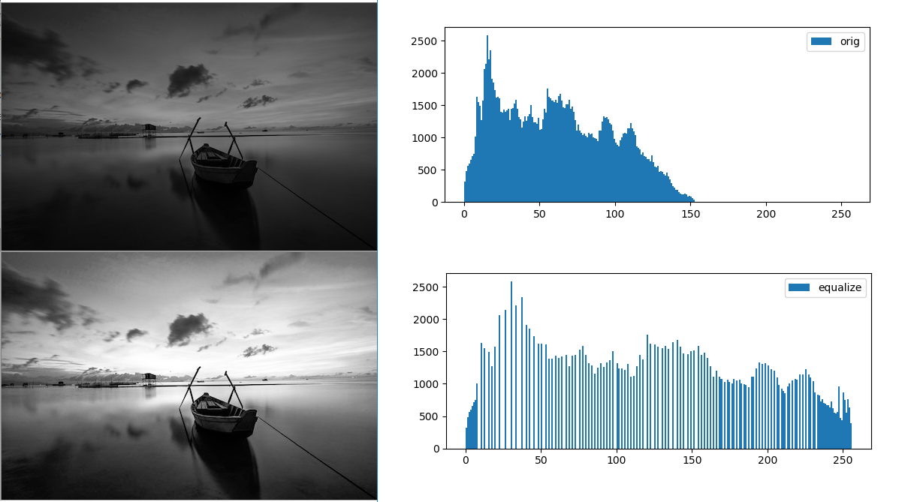
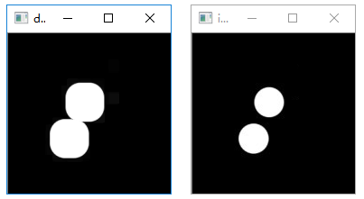
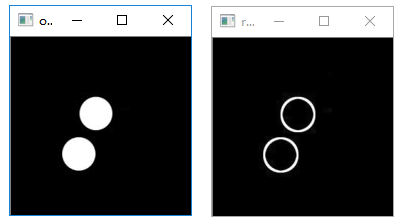
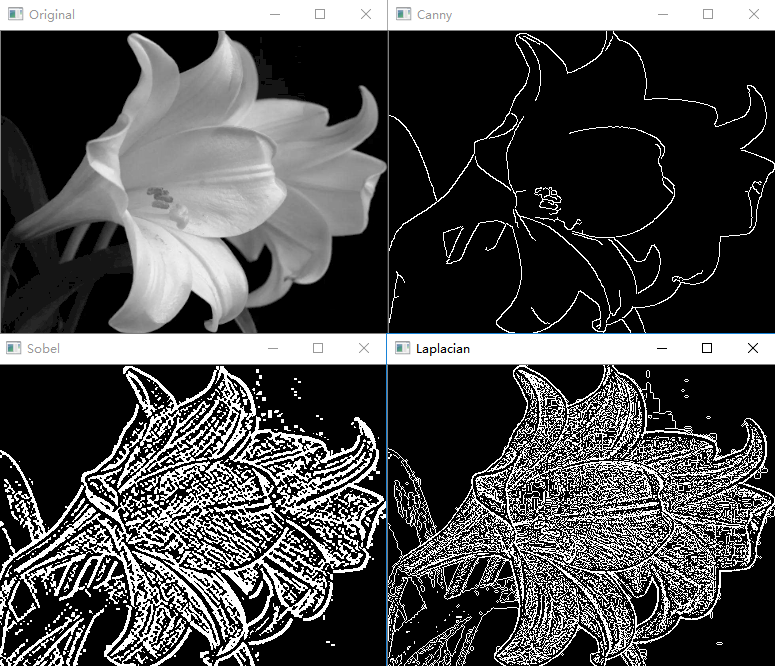
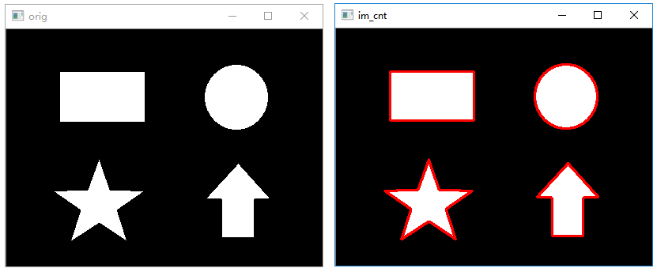
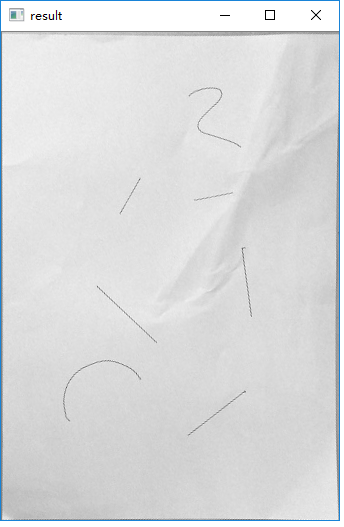

# 深度学习实验手册

[TOC]

## 一、基础理论

### 1. 自定义感知机

```python
# 00_percetron.py
# 实现感知机

# 实现逻辑和
def AND(x1, x2):
    w1, w2, theta = 0.5, 0.5, 0.7
    tmp = x1 * w1 + x2 * w2
    if tmp <= theta:
        return 0
    else:
        return 1

print(AND(1, 1))
print(AND(1, 0))


# 实现逻辑或
def OR(x1, x2):
    w1, w2, theta = 0.5, 0.5, 0.2
    tmp = x1 * w1 + x2 * w2
    if tmp <= theta:
        return 0
    else:
        return 1

print(OR(0, 1))
print(OR(0, 0))

# 实现异或
def XOR(x1, x2):
    s1 = not AND(x1, x2) # 与非门
    s2 = OR(x1, x2)
    y = AND(s1, s2)
    return y

print(XOR(1, 0))
print(XOR(0, 1))
print(XOR(1, 1))
print(XOR(0, 0))
```


### 2.  计算N个概率的交叉熵

```python
# 计算交叉熵
import math

p_true = [0, 1, 0, 0, 0]  # 真实概率
p_pred1 = [0.1, 0.6, 0.1, 0.1, 0.1]  # 预测概率
p_pred2 = [0.1, 0.7, 0.1, 0.05, 0.05]  # 预测概率
p_pred3 = [0.1, 0.8, 0.04, 0.03, 0.03]  # 预测概率

print(sum(p_true))
print(sum(p_pred1))
print(sum(p_pred2))
print(sum(p_pred3))

cross_entropy1 = 0.0
cross_entropy2 = 0.0
cross_entropy3 = 0.0

# 计算每组预测概率和真实概率的交叉熵(实际上只计算对应正确解标签的输出的自然对数)
for i in range(len(p_true)):
    cross_entropy1 += (p_true[i] * math.log(p_pred1[i]))
    cross_entropy2 += (p_true[i] * math.log(p_pred2[i]))
    cross_entropy3 += (p_true[i] * math.log(p_pred3[i]))

# 打印结果
print("交叉熵1:", -cross_entropy1)
print("交叉熵2:", -cross_entropy2)
print("交叉熵3:", -cross_entropy3)
```


### 3.  验证图像卷积运算效果

```python
from scipy import signal
from scipy import misc
import matplotlib.pyplot as plt
import numpy as np
import scipy.ndimage as sn

im = misc.imread("data/zebra.png", flatten=True)
# face = sn.imread("data/zebra.png", flatten=True)
flt = np.array([[-1, 0, 1],
                [-2, 0, 2],
                [-1, 0, 1]])

flt2 = np.array([[1, 2, 1],
                 [0, 0, 0],
                 [-1, -2, -1]])

# 把图像的face数组和设计好的卷积和作二维卷积运算,设计边界处理方式为symm
conv_img1 = signal.convolve2d(im, flt,
                              boundary='symm',
                              mode='same').astype("int32")

conv_img2 = signal.convolve2d(im, flt2,
                              boundary='symm',
                              mode='same').astype("int32")

plt.figure("Conv2D")
plt.subplot(131)
plt.imshow(im, cmap='gray')  # 显示原始的图
plt.xticks([])
plt.yticks([])

plt.subplot(132)
plt.xticks([])
plt.yticks([])
plt.imshow(conv_img1, cmap='gray')  # 卷积后的图

plt.subplot(133)
plt.xticks([])
plt.yticks([])
plt.imshow(conv_img2, cmap='gray')  # 卷积后的图

plt.show()
```

执行结果：


OpenCV版：

```python
from scipy import misc
from scipy import signal
import matplotlib.pyplot as plt
import matplotlib
import numpy as np
import scipy.ndimage as sn
import cv2
import pylab

im = cv2.imread("../data/zebra.png",0)

flt = np.array([[-1,0,1],
                [-2,0,2],
                [-1,0,1]])/2
flt2 = np.array([[1,2,1],
                 [0,0,0],
                 [-1,-2,-1]])/2

conv_img1 = cv2.filter2D(im, -1, flt,borderType=1)
conv_img2 = cv2.filter2D(im, -1, flt2,borderType=1)

cv2.imshow("im",im)
cv2.imshow("conv_img1",conv_img1)
cv2.imshow("conv_img2",conv_img2)
cv2.waitKey()
cv2.destroyAllWindows()
```


## 二、OpenCV部分

### 1. OpenCV安装

执行以下命令安装opencv-python库（核心库）和opencv-contrib-python库（贡献库）。注意：命令拷贝后要合成一行执行，中间不要换行。

```shell
# 安装opencv核心库
pip3 install  --user opencv-python==3.4.2.16 --index-url https://pypi.tuna.tsinghua.edu.cn/simple/  --trusted-host https://pypi.tuna.tsinghua.edu.cn

# 安装opencv贡献库
pip3 install  --user opencv-contrib-python==3.4.2.16 --index-url https://pypi.tuna.tsinghua.edu.cn/simple/  --trusted-host https://pypi.tuna.tsinghua.edu.cn
```


### 2. OpenCV基本操作

#### 1）读取、图像、保存图像

```python
# 读取图像
import cv2

im = cv2.imread("../data/Linus.png", 1) # 1表示3通道彩色，0表示单通道灰度
cv2.imshow("test", im) # 在test窗口中显示图像

print(type(im))  # 打印数据类型
print(im.shape)  # 打印图像尺寸

cv2.imwrite("../data/Linus_2.png", im)  # 将图像保存到指定路径

cv2.waitKey()  # 等待用户按键反馈
cv2.destroyAllWindows()  # 销毁所有创建的窗口
```

执行结果：


### 3. 图像色彩操作

#### 1）彩色图像转换为灰度图像

```python
# 彩色图像转换为灰度图像示例
import cv2

im = cv2.imread("../data/Linus.png", 1)
cv2.imshow("RGB", im) # 在test窗口中显示图像

# 使用cvtColor进行颜色空间变化，COLOR_BGR2GRAY表示BGR to GRAY
img_gray = cv2.cvtColor(im, cv2.COLOR_BGR2GRAY) # 彩色图像灰度化
cv2.imshow("Gray", img_gray)

cv2.waitKey()  # 等待用户按键反馈
cv2.destroyAllWindows()  # 销毁所有创建的窗口
```

执行结果：


#### 2）色彩通道操作

```python
# 色彩通道操作：通道表示为BGR
import numpy as np
import cv2

im = cv2.imread("../data/opencv2.png")
print(im.shape)
cv2.imshow("im", im)

# 取出蓝色通道，当做单通道图像显示
b = im[:, :, 0]
cv2.imshow("b", b)

# 去掉蓝色通道(索引为0的通道)
im[:, :, 0] = 0
cv2.imshow("im-b0", im)

# 去掉绿色通道(索引为1的通道)
im[:, :, 1] = 0
cv2.imshow("im-b0g0", im)

cv2.waitKey()
cv2.destroyAllWindows()
```

执行结果：


#### 3）灰度直方图均衡化

```python
# 直方图均衡化示例
import numpy as np
import cv2
from matplotlib import pyplot as plt

im = cv2.imread("../data/sunrise.jpg", 0)
cv2.imshow("orig", im)

# 直方图均衡化
im_equ = cv2.equalizeHist(im)
cv2.imshow("equ1", im_equ)

# 绘制灰度直方图
## 原始直方图
print(im.ravel())
plt.subplot(2, 1, 1)
plt.hist(im.ravel(), #ravel返回一个连续的扁平数组
         256, [0, 256], label="orig")
plt.legend()

## 均衡化处理后的直方图
plt.subplot(2, 1, 2)
plt.hist(im_equ.ravel(), 256, [0, 256], label="equalize")
plt.legend()

plt.show()

cv2.waitKey()
cv2.destroyAllWindows()
```

执行结果：




#### 4）彩色亮度直方图均衡化

```python
# 彩色图像亮度直方图均衡化
import cv2

# 读取原始图片
original = cv2.imread('../data/sunrise.jpg')
cv2.imshow('Original', original)

# BRG空间转换为YUV空间
# YUV：亮度，色度，饱和度，其中Y通道为亮度通道
yuv = cv2.cvtColor(original, cv2.COLOR_BGR2YUV)
print("yuv.shape:", yuv.shape)

yuv[..., 0] = cv2.equalizeHist(yuv[..., 0])  # 取出亮度通道，均衡化并赋回原图像
equalized_color = cv2.cvtColor(yuv, cv2.COLOR_YUV2BGR)
cv2.imshow('Equalized Color', equalized_color)

cv2.waitKey()
cv2.destroyAllWindows()
```

执行结果：


#### 5）色彩提取

从图片中提取特定颜色

```python
import cv2
import numpy as np

im = cv2.imread("../data/opencv2.png")
hsv = cv2.cvtColor(im, cv2.COLOR_BGR2HSV)
cv2.imshow('opencv', im)

# =============指定蓝色值的范围=============
# 蓝色H通道值为120，通常取120上下10的范围
# S通道和V通道通常取50~255间，饱和度太低、色调太暗计算出来的颜色不准确
minBlue = np.array([110, 50, 50])
maxBlue = np.array([130, 255, 255])
# 确定蓝色区域
mask = cv2.inRange(hsv, minBlue, maxBlue)  # 选取出掩模
# cv2.imshow("mask", mask)
# 通过掩码控制的按位与运算，锁定蓝色区域
blue = cv2.bitwise_and(im, im, mask=mask)  # 执行掩模运算
cv2.imshow('blue', blue)

# =============指定绿色值的范围=============
minGreen = np.array([50, 50, 50])
maxGreen = np.array([70, 255, 255])
# 确定绿色区域
mask = cv2.inRange(hsv, minGreen, maxGreen)
# cv2.imshow("mask", mask)
# 通过掩码控制的按位与运算，锁定绿色区域
green = cv2.bitwise_and(im, im, mask=mask)  # 执行掩模运算
cv2.imshow('green', green)

# =============指定红色值的范围=============
minRed = np.array([0, 50, 50])
maxRed = np.array([30, 255, 255])
# 确定红色区域
mask = cv2.inRange(hsv, minRed, maxRed)
# cv2.imshow("mask", mask)
# 通过掩码控制的按位与运算，锁定红色区域
red = cv2.bitwise_and(im, im, mask=mask)  # 执行掩模运算
cv2.imshow('red', red)

cv2.waitKey()
cv2.destroyAllWindows()
```

执行结果：


#### 6）二值化与反二值化

```python
# 二值化处理
import cv2 as cv

# 读取图像
img = cv.imread("../data/lena.jpg", 0)
cv.imshow("img", img)  # 显示原始图像

# 二值化
t, rst = cv.threshold(img, 127, 255, cv.THRESH_BINARY)
cv.imshow("rst", rst)  # 显示二值化图像

# 反二值化
t, rst2 = cv.threshold(img, 127, 255, cv.THRESH_BINARY_INV)
cv.imshow("rst2", rst2)  # 显示反二值化图像

cv.waitKey()
cv.destroyAllWindows()
```

执行结果：


### 4. 图像形态操作

#### 1）图像翻转

```python
# 图像翻转示例
import numpy as np
import cv2

im = cv2.imread("../data/Linus.png")
cv2.imshow("src", im)

# 0-垂直镜像
im_flip0 = cv2.flip(im, 0)
cv2.imshow("im_flip0", im_flip0)

# 1-水平镜像
im_flip1 = cv2.flip(im, 1)
cv2.imshow("im_flip1", im_flip1)

cv2.waitKey()
cv2.destroyAllWindows()
```

执行结果：


#### 2）图像仿射变换

```python
# 图像仿射变换
import numpy as np
import cv2

def translate(img, x, y):
    """
    坐标平移变换
    :param img: 原始图像数据
    :param x:平移的x坐标
    :param y:平移的y坐标
    :return:返回平移后的图像
    """
    h, w = img.shape[:2]  # 获取图像高、宽

    # 定义平移矩阵
    M = np.float32([[1, 0, x],
                    [0, 1, y]])
    # 使用openCV仿射操作实现平移变换
    shifted = cv2.warpAffine(img, M, (w, h))  # 第三个参数为输出图像尺寸

    return shifted  # 返回平移后的图像


def rotate(img, angle, center=None, scale=1.0):
    """
    图像旋转变换
    :param img: 原始图像数据
    :param angle: 旋转角度
    :param center: 旋转中心，如果为None则以原图中心为旋转中心
    :param scale: 缩放比例，默认为1
    :return: 返回旋转后的图像
    """
    h, w = img.shape[:2]  # 获取图像高、宽

    # 旋转中心默认为图像中心
    if center is None:
        center = (w / 2, h / 2)

    # 计算旋转矩阵
    M = cv2.getRotationMatrix2D(center, angle, scale)

    # 使用openCV仿射变换实现函数旋转
    rotated = cv2.warpAffine(img, M, (w, h))

    return rotated  # 返回旋转后的矩阵

if __name__ == "__main__":
    # 读取并显示原始图像
    im = cv2.imread("../data/Linus.png")
    cv2.imshow("SrcImg", im)

    # 图像向下移动50像素
    shifted = translate(im, 0, 50)
    cv2.imshow("Shifted1", shifted)

    # 图像向左移动40, 下移动40像素
    shifted = translate(im, -40, 40)
    cv2.imshow("Shifted2", shifted)

    # 逆时针旋转45度
    rotated = rotate(im, 45)
    cv2.imshow("rotated1", rotated)

    # 顺时针旋转90度
    rotated = rotate(im, -90)
    cv2.imshow("rorated2", rotated)

    cv2.waitKey()
    cv2.destroyAllWindows()
```

执行结果：


#### 3）图像缩放

```python
# 图像缩放示例
import numpy as np
import cv2

im = cv2.imread("../data/Linus.png")
cv2.imshow("src", im)

h, w = im.shape[:2]  # 获取图像尺寸


dst_size = (int(w/2), int(h/2))  # 缩放目标尺寸，宽高均为原来1/2
resized = cv2.resize(im, dst_size)  # 执行缩放
cv2.imshow("reduce", resized)

dst_size = (200, 300)  # 缩放目标尺寸，宽200，高300
method = cv2.INTER_NEAREST  # 最邻近插值
resized = cv2.resize(im, dst_size, interpolation=method)  # 执行缩放
cv2.imshow("NEAREST", resized)

dst_size = (200, 300)  # 缩放目标尺寸，宽200，高300
method = cv2.INTER_LINEAR  # 双线性插值
resized = cv2.resize(im, dst_size, interpolation=method)  # 执行缩放
cv2.imshow("LINEAR", resized)

cv2.waitKey()
cv2.destroyAllWindows()
```

执行结果：


#### 4）图像裁剪

```python
import numpy as np
import cv2


# 图像随机裁剪
def random_crop(im, w, h):
    start_x = np.random.randint(0, im.shape[1])  # 裁剪起始x像素
    start_y = np.random.randint(0, im.shape[0])  # 裁剪起始y像素

    new_img = im[start_y:start_y + h, start_x: start_x + w]  # 执行裁剪

    return new_img


# 图像中心裁剪
def center_crop(im, w, h):
    start_x = int(im.shape[1] / 2) - int(w / 2)  # 裁剪起始x像素
    start_y = int(im.shape[0] / 2) - int(h / 2)  # 裁剪起始y像素

    new_img = im[start_y:start_y + h, start_x: start_x + w]  # 执行裁剪

    return new_img


im = cv2.imread("../data/banana_1.png", 1)

new_img = random_crop(im, 200, 200)  # 随机裁剪
new_img2 = center_crop(im, 200, 200)  # 中心裁剪

cv2.imshow("orig", im)
cv2.imshow("random_crop", new_img)
cv2.imshow("center_crop", new_img2)

cv2.waitKey()
cv2.destroyAllWindows()
```

执行结果：


#### 5）图像相加

```python
# 图像相加示例
import cv2

a = cv2.imread("../data/lena.jpg", 0)
b = cv2.imread("../data/lily_square.png", 0)

dst1 = cv2.add(a, b)  # 图像直接相加，会导致图像过亮、过白

# 加权求和：addWeighted
# 图像进行加权和计算时，要求src1和src2必须大小、类型相同
dst2 = cv2.addWeighted(a, 0.6, b, 0.4, 0)  # 最后一个参数为亮度调节量

cv2.imshow("a", a)
cv2.imshow("b", b)
cv2.imshow("dst1", dst1)
cv2.imshow("dst2", dst2)

cv2.waitKey()
cv2.destroyAllWindows()
```

执行结果：


#### 6）图像相减

```python
# 图像相减运算示例
import cv2

a = cv2.imread("../data/3.png", 0)
b = cv2.imread("../data/4.png", 0)

dst = cv2.subtract(a, b)  # 两幅图像相减，是求出图像的差异

cv2.imshow("a", a)
cv2.imshow("b", b)
cv2.imshow("dst1", dst)

cv2.waitKey()
cv2.destroyAllWindows()
```

执行结果：


#### 7）透视变换

```python
# 透视变换
import cv2
import numpy as np

img = cv2.imread('../data/pers.png')
rows, cols = img.shape[:2]
print(rows, cols)

pts1 = np.float32([[58, 2], [167, 9], [8, 196], [126, 196]])# 输入图像四个顶点坐标
pts2 = np.float32([[16, 2], [167, 8], [8, 196], [169, 196]])# 输出图像四个顶点坐标

# 生成透视变换矩阵
M = cv2.getPerspectiveTransform(pts1, # 输入图像四个顶点坐标
                                pts2) # 输出图像四个顶点坐标
print(M.shape)
# 执行透视变换，返回变换后的图像
dst = cv2.warpPerspective(img, # 原始图像
                          M, # 3*3的变换矩阵
                          (cols, rows)) # 输出图像大小


# 生成透视变换矩阵
M = cv2.getPerspectiveTransform(pts2, # 输入图像四个顶点坐标
                                pts1) # 输出图像四个顶点坐标
# 执行透视变换，返回变换后的图像
dst2 = cv2.warpPerspective(dst, # 原始图像
                          M, # 3*3的变换矩阵
                          (cols, rows)) # 输出图像大小
cv2.imshow("img", img)
cv2.imshow("dst", dst)
cv2.imshow("dst2", dst2)

cv2.waitKey()
cv2.destroyAllWindows()
```

执行结果：


#### 8）图像腐蚀

```python
# 图像腐蚀
import cv2
import numpy as np

# 读取原始图像
im = cv2.imread("../data/5.png")
cv2.imshow("im", im)

# 腐蚀
kernel = np.ones((3, 3), np.uint8) # 用于腐蚀计算的核
erosion = cv2.erode(im, # 原始图像
                    kernel,  # 腐蚀核
                    iterations=3) # 迭代次数
cv2.imshow("erosion", erosion)

cv2.waitKey()
cv2.destroyAllWindows()
```

执行结果：


#### 9）图像膨胀

```python
# 图像膨胀
import cv2
import numpy as np

# 读取原始图像
im = cv2.imread("../data/6.png")
cv2.imshow("im", im)

# 膨胀
kernel = np.ones((3, 3), np.uint8)  # 用于膨胀计算的核
dilation = cv2.dilate(im,  # 原始图像
                      kernel,  # 膨胀核
                      iterations=5)  # 迭代次数
cv2.imshow("dilation", dilation)

cv2.waitKey()
cv2.destroyAllWindows()
```

执行结果：



#### 10）图像开运算

```python
# 开运算示例
import cv2
import numpy as np

# 读取原始图像
im1 = cv2.imread("../data/7.png")
im2 = cv2.imread("../data/8.png")

# 执行开运算
k = np.ones((10, 10), np.uint8)
r1 = cv2.morphologyEx(im1, cv2.MORPH_OPEN, k)
r2 = cv2.morphologyEx(im2, cv2.MORPH_OPEN, k)

cv2.imshow("im1", im1)
cv2.imshow("result1", r1)

cv2.imshow("im2", im2)
cv2.imshow("result2", r2)

cv2.waitKey()
cv2.destroyAllWindows()
```

执行结果：


#### 11）图像闭运算

```python
# 闭运算示例
import cv2
import numpy as np

# 读取图像
im1 = cv2.imread("../data/9.png")
im2 = cv2.imread("../data/10.png")

# 闭运算
k = np.ones((8, 8), np.uint8)
r1 = cv2.morphologyEx(im1, cv2.MORPH_CLOSE, k, iterations=2)
r2 = cv2.morphologyEx(im2, cv2.MORPH_CLOSE, k, iterations=2)

cv2.imshow("im1", im1)
cv2.imshow("result1", r1)
cv2.imshow("im2", im2)
cv2.imshow("result2", r2)

cv2.waitKey()
cv2.destroyAllWindows()
```

执行结果：


#### 12）形态学梯度

```python
# 形态学梯度示例
import cv2
import numpy as np

o = cv2.imread("../data/6.png")

k = np.ones((3, 3), np.uint8)
r = cv2.morphologyEx(o, cv2.MORPH_GRADIENT, k)

cv2.imshow("original", o)
cv2.imshow("result", r)

cv2.waitKey()
cv2.destroyAllWindows()
```

执行结果：



### 5. 图像梯度处理

#### 1）模糊处理

```python
# 图像模糊处理示例
import cv2
import numpy as np

## 中值滤波
im = cv2.imread("../data/lena.jpg", 0)
cv2.imshow("orig", im)

# 调用medianBlur中值模糊
# 第二个参数为滤波模板的尺寸大小，必须是大于1的奇数，如3、5、7
im_median_blur = cv2.medianBlur(im, 5)
cv2.imshow('median_blur', im_median_blur)

# 均值滤波
# 第二个参数为滤波模板的尺寸大小
im_mean_blur = cv2.blur(im, (3, 3))
cv2.imshow("mean_blur", im_mean_blur)

# 高斯滤波
# 第三个参数为高斯核在X方向的标准差
im_gaussian_blur = cv2.GaussianBlur(im, (5, 5), 3)
cv2.imshow("gaussian_blur", im_gaussian_blur)

# 使用高斯算子和filter2D自定义滤波操作
gaussan_blur = np.array([
    [1, 4, 7, 4, 1],
    [4, 16, 26, 16, 4],
    [7, 26, 41, 26, 7],
    [4, 16, 26, 16, 4],
    [1, 4, 7, 4, 1]], np.float32) / 273
# 使用filter2D, 第二个参数为目标图像的所需深度, -1表示和原图像相同
im_gaussian_blur2 = cv2.filter2D(im, -1, gaussan_blur)  
cv2.imshow("gaussian_blur2", im_gaussian_blur2)

cv2.waitKey()
cv2.destroyAllWindows()
```

执行结果：


#### 2）图像锐化处理

```python
# 图像锐化示例
import cv2
import numpy as np

im = cv2.imread("../data/lena.jpg", 0)
cv2.imshow("orig", im)

# 锐化算子1
sharpen_1 = np.array([[-1, -1, -1],
                      [-1, 9, -1],
                      [-1, -1, -1]])
# 使用filter2D进行滤波操作
im_sharpen1 = cv2.filter2D(im, -1, sharpen_1)
cv2.imshow("sharpen_1", im_sharpen1)

# 锐化算子2
sharpen_2 = np.array([[0, -1, 0],
                      [-1, 8, -1],
                      [0, 1, 0]]) / 4.0
# 使用filter2D进行滤波操作
im_sharpen2 = cv2.filter2D(im, -1, sharpen_2)
cv2.imshow("sharpen_2", im_sharpen2)

cv2.waitKey()
cv2.destroyAllWindows()
```

执行结果：


#### 3）边沿检测

```python
# 边沿检测示例
import cv2 as cv

im = cv.imread('../data/lily.png', 0)
cv.imshow('Original', im)

# # 水平方向滤波
# hsobel = cv.Sobel(im, cv.CV_64F, 1, 0, ksize=5)
# cv.imshow('H-Sobel', hsobel)
# # 垂直方向滤波
# vsobel = cv.Sobel(im, cv.CV_64F, 0, 1, ksize=5)
# cv.imshow('V-Sobel', vsobel)
# 两个方向滤波
# cv2.CV_64F: 输出图像深度，本来应该设置为-1，但如果设成-1，可能会发生计算错误
# 所以通常先设置为精度更高的CV_64F
sobel = cv.Sobel(im, cv.CV_64F, 1, 1, ksize=5)
cv.imshow('Sobel', sobel)

# Laplacian滤波：对细节反映更明显
laplacian = cv.Laplacian(im, cv.CV_64F)
cv.imshow('Laplacian', laplacian)

# Canny边沿提取
canny = cv.Canny(im,
                 50, # 滞后阈值
                 240) # 模糊度
cv.imshow('Canny', canny)

cv.waitKey()
cv.destroyAllWindows()
```

执行结果：




### 6. 轮廓处理

边缘检测虽然能够检测出边缘，但边缘是不连续的，检测到的边缘并不是一个整体。图像轮廓是指将边缘连接起来形成的一个整体，用于后续的计算。

OpenCV提供了查找图像轮廓的函数cv2.findContours（），该函数能够查找图像内的轮廓信息，而函数cv2.drawContours（）能够将轮廓绘制出来。图像轮廓是图像中非常重要的一个特征信息，通过对图像轮廓的操作，我们能够获取目标图像的大小、位置、方向等信息。一个轮廓对应着一系列的点，这些点以某种方式表示图像中的一条曲线。

#### 1）查找并绘制轮廓

- 查找轮廓函数：cv2.findContours

  - 语法格式：image,contours,hierarchy=cv2.findContours（image,mode,method）

  - 返回值

    - image：与函数参数中的原始图像image一致
    - contours：返回的轮廓。该返回值返回的是一组轮廓信息，每个轮廓都是由若干个点所构成的（每个轮廓为一个list表示）。例如，contours\[i\]是第i个轮廓（下标从0开始）,contours\[i\]\[j\]是第i个轮廓内的第j个点
    - hierarchy：图像的拓扑信息（反映轮廓层次）。图像内的轮廓可能位于不同的位置。比如，一个轮廓在另一个轮廓的内部。在这种情况下，我们将外部的轮廓称为父轮廓，内部的轮廓称为子轮廓。按照上述关系分类，一幅图像中所有轮廓之间就建立了父子关系。每个轮廓contours[i]对应4个元素来说明当前轮廓的层次关系。其形式为：[Next,Previous,First_Child,Parent]，分别表示后一个轮廓的索引编号、前一个轮廓的索引编号、第1个子轮廓的索引编号、父轮廓的索引编号

  - 参数

    - image：原始图像。灰度图像会被自动处理为二值图像。在实际操作时，可以根据需要，预先使用阈值处理等函数将待查找轮廓的图像处理为二值图像。
    - mode：轮廓检索模式，有以下取值和含义：

    | 取值              | 含义                                                         |
    | ----------------- | ------------------------------------------------------------ |
    | cv2.RETR_EXTERNAL | 只检测外轮廓                                                 |
    | cv2.RETR_LIST     | 对检测到的轮廓不建立等级关系                                 |
    | cv2.RETR_CCOMP    | 检索所有轮廓并将它们组织成两级层次结构，上面的一层为外边界，下面的一层为内孔的边界 |
    | cv2.RETR_TREE     | 建立一个等级树结构的轮廓                                     |

    - method：轮廓的近似方法，主要有如下取值：

    | 取值                       | 含义                                                         |
    | -------------------------- | ------------------------------------------------------------ |
    | cv2.CHAIN_APPROX_NONE      | 存储所有的轮廓点，相邻两个点的像素位置差不超过1，即max（abs（x1-x2）,abs（y2-y1））=1 |
    | cv2.CHAIN_APPROX_SIMPLE    | 压缩水平方向、垂直方向、对角线方向的元素，只保留该方向的终点坐标 |
    | cv2.CHAIN_APPROX_TC89_L1   | 使用teh-Chinl chain近似算法的一种风格                        |
    | cv2.CHAIN_APPROX_TC89_KCOS | 使用teh-Chinl chain近似算法的一种风格                        |

  - 注意事项

    - 待处理的源图像必须是灰度二值图
    - 都是从黑色背景中查找白色对象。因此，对象必须是白色的，背景必须是黑色的
    - 在OpenCV 4.x中，函数cv2.findContours（）仅有两个返回值

    

- 绘制轮廓：drawContours函数

  - 语法格式：image=cv2.drawContours(image, contours,contourIdx, color)
  - 参数
    - image：待绘制轮廓的图像
    - contours：需要绘制的轮廓，该参数的类型与函数 cv2.findContours（）的输出 contours 相同，都是list类型
    - contourIdx：需要绘制的边缘索引，告诉函数cv2.drawContours（）要绘制某一条轮廓还是全部轮廓。如果该参数是一个整数或者为零，则表示绘制对应索引号的轮廓；如果该值为负数（通常为“-1”），则表示绘制全部轮廓。
    - color：绘制的颜色，用BGR格式表示

```python
# 查找图像轮廓
import cv2
import numpy as np

im = cv2.imread("../data/3.png")
cv2.imshow("orig", im)

gray = cv2.cvtColor(im, cv2.COLOR_BGR2GRAY)

# 图像二值化处理，将大于阈值的设置为最大值，其它设置为0
ret, binary = cv2.threshold(gray, 127, 255, cv2.THRESH_BINARY)

# 查找图像边沿：cv2.findContours
img, contours, hierarchy = cv2.findContours(binary,  # 二值化处理后的图像
                                            cv2.RETR_EXTERNAL,  # 只检测外轮廓
                                            cv2.CHAIN_APPROX_NONE)  # 存储所有的轮廓点
# 打印所有轮廓值
arr_cnt = np.array(contours)
print(arr_cnt[0].shape)
print(arr_cnt[1].shape)
print(arr_cnt[2].shape)
print(arr_cnt[3].shape)
# print(arr_cnt[0])

# 绘制边沿
im_cnt = cv2.drawContours(im,  # 绘制图像
                          contours,  # 轮廓点列表
                          -1,  # 绘制全部轮廓
                          (0, 0, 255),  # 轮廓颜色：红色
                          2)  # 轮廓粗细
cv2.imshow("im_cnt", im_cnt)

cv2.waitKey()
cv2.destroyAllWindows()
```

执行结果：



#### 2）绘制矩形包围框

函数cv2.boundingRect（）能够绘制轮廓的矩形边界。该函数的语法格式为：

```python
retval = cv2.boundingRect(array)  # 格式一
x,y,w,h = cv2.boundingRect(array) # 格式二
"""
参数：
	array：是灰度图像或轮廓
返回值：
	retval：表示返回的矩形边界的左上角顶点的坐标值及矩形边界的宽度和高度
	x, y, w, h: 矩形边界左上角顶点的x坐标、y坐标、宽度、高度
"""
```

代码：

```python
# 绘制图像矩形轮廓
import cv2
import numpy as np

im = cv2.imread("../data/cloud.png", 0)
cv2.imshow("orig", im)

# 提取图像轮廓
ret, binary = cv2.threshold(im, 127, 255, cv2.THRESH_BINARY)
img, contours, hierarchy = cv2.findContours(binary,
                                            cv2.RETR_LIST,  # 不建立等级关系
                                            cv2.CHAIN_APPROX_NONE)  # 存储所有的轮廓点
print("contours[0].shape:", contours[0].shape)

# 返回轮廓定点及边长
x, y, w, h = cv2.boundingRect(contours[0])  # 计算矩形包围框的x,y,w,h
print("x:", x, "y:", y, "w:", w, "h:", h)

# 绘制矩形包围框
brcnt = np.array([[[x, y]], [[x + w, y]], [[x + w, y + h]], [[x, y + h]]])
cv2.drawContours(im,  # 绘制图像
                 [brcnt],  # 轮廓点列表
                 -1,  # 绘制全部轮廓
                 (255, 255, 255),  # 轮廓颜色：白色
                 2)  # 轮廓粗细

cv2.imshow("result", im)  # 显示绘制后的图像

cv2.waitKey()
cv2.destroyAllWindows()
```

执行结果：


#### 3）绘制圆形包围圈

函数 cv2.minEnclosingCircle（）通过迭代算法构造一个对象的面积最小包围圆形。该函数的语法格式为：

```python
center,radius=cv2.minEnclosingCircle(points)
"""
参数：
	points: 轮廓数组
返回值：
	center: 最小包围圆形的中心
	radius: 最小包围圆形的半径
"""
```

代码：

```python
# 绘制最小圆形
import cv2
import numpy as np

im = cv2.imread("../data/cloud.png", 0)
cv2.imshow("orig", im)

# 提取图像轮廓
ret, binary = cv2.threshold(im, 127, 255, cv2.THRESH_BINARY)
img, contours, hierarchy = cv2.findContours(binary, cv2.RETR_LIST, cv2.CHAIN_APPROX_NONE)

(x, y), radius = cv2.minEnclosingCircle(contours[0])
center = (int(x), int(y))
radius = int(radius)
cv2.circle(im, center, radius, (255, 255, 255), 2)  # 绘制圆

cv2.imshow("result", im)  # 显示绘制后的图像

cv2.waitKey()
cv2.destroyAllWindows()
```

执行结果：


#### 4）绘制最佳拟合椭圆

函数cv2.fitEllipse（）可以用来构造最优拟合椭圆。该函数的语法格式是：

```python
retval=cv2.fitEllipse(points)
"""
参数：
	points: 轮廓
返回值：
	retval: 为RotatedRect类型的值，包含外接矩形的质心、宽、高、旋转角度等参数信息，这些信息正好与椭圆的中心点、轴长度、旋转角度等信息吻合
"""
```

代码：

```python
# 绘制最优拟合椭圆
import cv2
import numpy as np

im = cv2.imread("../data/cloud.png")
gray = cv2.cvtColor(im, cv2.COLOR_BGR2GRAY)
cv2.imshow("orig", gray)

# 提取图像轮廓
ret, binary = cv2.threshold(gray, 127, 255, cv2.THRESH_BINARY)
img, contours, hierarchy = cv2.findContours(binary,
                                            cv2.RETR_LIST,
                                            cv2.CHAIN_APPROX_NONE)

ellipse = cv2.fitEllipse(contours[0])  # 拟合最优椭圆
print("ellipse:", ellipse)
cv2.ellipse(im, ellipse, (0, 0, 255), 2)  # 绘制椭圆

cv2.imshow("result", im)  # 显示绘制后的图像

cv2.waitKey()
cv2.destroyAllWindows()
```

执行结果：


#### 5）逼近多边形

函数cv2.approxPolyDP（）用来构造指定精度的逼近多边形曲线。该函数的语法格式为：

```python
approxCurve = cv2.approxPolyDP(curve,epsilon,closed)
"""
参数：
	curve: 轮廓
	epsilon: 精度，原始轮廓的边界点与逼近多边形边界之间的最大距离
	closed: 布尔类型，该值为True时，逼近多边形是封闭的；否则，逼近多边形是不封闭的
返回值：
	approxCurve: 逼近多边形的点集
"""
```

代码：

```python
# 构建多边形，逼近轮廓
import cv2
import numpy as np

im = cv2.imread("../data/cloud.png")
cv2.imshow("im", im)
gray = cv2.cvtColor(im, cv2.COLOR_BGR2GRAY)

# 提取图像轮廓
ret, binary = cv2.threshold(gray, 127, 255, cv2.THRESH_BINARY)
img, contours, hierarchy = cv2.findContours(binary,
                                            cv2.RETR_LIST,
                                            cv2.CHAIN_APPROX_NONE)
# 精度一
adp = im.copy()
epsilon = 0.005 * cv2.arcLength(contours[0], True)  # 精度，根据周长计算
approx = cv2.approxPolyDP(contours[0], epsilon, True)  # 构造多边形
adp = cv2.drawContours(adp, [approx], 0, (0, 0, 255), 2)  # 绘制多边形
cv2.imshow("result_0.005", adp)
# 精度二
adp2 = im.copy()
epsilon = 0.01 * cv2.arcLength(contours[0], True)  # 精度，根据周长计算
approx = cv2.approxPolyDP(contours[0], epsilon, True)  # 构造多边形
adp = cv2.drawContours(adp2, [approx], 0, (0, 0, 255), 2)  # 绘制多边形
cv2.imshow("result_0.01", adp2)

cv2.waitKey()
cv2.destroyAllWindows()
```

执行结果：


### 7. 视频基本处理

#### 1）读取摄像头

```python
import numpy as np
import cv2

cap = cv2.VideoCapture(0)  # 实例化VideoCapture对象, 0表示第一个摄像头
while cap.isOpened():
    ret, frame = cap.read()  # 捕获帧
    cv2.imshow("frame", frame)
    c = cv2.waitKey(1)  # 等待1毫秒，等待用户输入
    if c == 27:  # ESC键
        break

cap.release()  # 释放摄像头
cv2.destroyAllWindows()
```

#### 2）播放视频文件

```python
import numpy as np
import cv2

cap = cv2.VideoCapture("D:\\tmp\\min_nong.mp4")  # 打开视频文件
while cap.isOpened():
    ret, frame = cap.read()  # 读取帧
    cv2.imshow("frame", frame)  # 显示
    c = cv2.waitKey(25)
    if c == 27:  # ESC键
        break

cap.release()  # 释放视频设备
cv2.destroyAllWindows()
```

#### 3）捕获并保存视频

```python
import numpy as np
import cv2

""" 编解码4字标记值说明
cv2.VideoWriter_fourcc（'I','4','2','0'）表示未压缩的YUV颜色编码格式，色度子采样为4:2:0。
    该编码格式具有较好的兼容性，但产生的文件较大，文件扩展名为.avi。
cv2.VideoWriter_fourcc（'P','I','M','I'）表示 MPEG-1编码类型，生成的文件的扩展名为.avi。
cv2.VideoWriter_fourcc（'X','V','I','D'）表示MPEG-4编码类型。如果希望得到的视频大小为平均值，可以选用这个参数组合。
    该组合生成的文件的扩展名为.avi。
cv2.VideoWriter_fourcc（'T','H','E','O'）表示Ogg Vorbis编码类型，文件的扩展名为.ogv。
cv2.VideoWriter_fourcc（'F','L','V','I'）表示Flash视频，生成的文件的扩展名为.flv。
"""
cap = cv2.VideoCapture(0)
fourcc = cv2.VideoWriter_fourcc("I", "4", "2", "0")  # 编解码4字标记值
out = cv2.VideoWriter("output.avi",  # 文件名
                      fourcc,  # 编解码类型
                      20,  # fps(帧速度)
                      (640, 480))  # 视频分辨率

while cap.isOpened():
    ret, frame = cap.read()  # 读取帧
    if ret == True:
        out.write(frame)  # 写入帧
        cv2.imshow("frame", frame)
        if cv2.waitKey(1) == 27:  # ESC键
            break
    else:
        break

cap.release()
out.release()
cv2.destroyAllWindows()
```


### 8. 综合案例

#### 1）利用OpenCV实现图像校正

**【任务描述】**

我们对图像中的目标进行分析和检测时，目标往往具有一定的倾斜角度，自然条件下拍摄的图像，完全平正是很少的。因此，需要将倾斜的目标“扶正”的过程就就叫做图像矫正。该案例中使用的原始图像如下：


**【代码】**

```python
# 图像校正示例
import cv2
import numpy as np
import math

im = cv2.imread("../data/paper.jpg")
gray = cv2.cvtColor(im, cv2.COLOR_BGR2GRAY)
cv2.imshow('im', im)

# 模糊
blurred = cv2.GaussianBlur(gray, (5, 5), 0)
# 膨胀
dilate = cv2.dilate(blurred, (3, 3))
# 检测边沿
edged = cv2.Canny(dilate,  # 原始图像
                  30, 120)  # 滞后阈值、模糊度
# cv2.imshow("edged", edged)

# 轮廓检测
img, cnts, hie = cv2.findContours(edged.copy(),
                                  cv2.RETR_EXTERNAL,  # 只检测外轮廓
                                  cv2.CHAIN_APPROX_SIMPLE)  # 只保留该方向的终点坐标
docCnt = None

# 绘制轮廓
im_cnt = cv2.drawContours(im,  # 绘制图像
                          cnts,  # 轮廓点列表
                          -1,  # 绘制全部轮廓
                          (0, 0, 255),  # 轮廓颜色：红色
                          2)  # 轮廓粗细
cv2.imshow("im_cnt", im_cnt)

# 计算轮廓面积，并排序
if len(cnts) > 0:
    cnts = sorted(cnts,  # 数据
                  key=cv2.contourArea,  # 排序依据，根据contourArea函数结果排序
                  reverse=True)
    for c in cnts:
        peri = cv2.arcLength(c, True)  # 计算轮廓周长
        approx = cv2.approxPolyDP(c, 0.02 * peri, True)  # 轮廓多边形拟合
        # 轮廓为4个点表示找到纸张
        if len(approx) == 4:
            docCnt = approx
            break

print(docCnt)

# 用圆圈标记处角点
points = []
for peak in docCnt:
    peak = peak[0]
    # 绘制圆
    cv2.circle(im,  # 绘制图像
               tuple(peak), 10,  # 圆心、半径
               (0, 0, 255), 2)  # 颜色、粗细
    points.append(peak)  # 添加到列表
print(points)
cv2.imshow("im_point", im)

# 校正
src = np.float32([points[0], points[1], points[2], points[3]])  # 原来逆时针方向四个点
dst = np.float32([[0, 0], [0, 488], [337, 488], [337, 0]])  # 对应变换后逆时针方向四个点
m = cv2.getPerspectiveTransform(src, dst)  # 生成透视变换矩阵
result = cv2.warpPerspective(gray.copy(), m, (337, 488))  # 透视变换

"""  根据勾股定理计算宽度、高度，再做透视变换
h = int(math.sqrt((points[1][0] - points[0][0])**2 + (points[1][1] - points[0][1])**2)) # 宽度
w = int(math.sqrt((points[2][0] - points[1][0])**2 + (points[2][1] - points[1][1])**2)) # 高度
print("w:", w, " h:", h)
dst = np.float32([[0, 0], [0, h], [w, h], [w, 0]])
m = cv2.getPerspectiveTransform(src, dst)  # 生成透视变换矩阵
result = cv2.warpPerspective(gray.copy(), m, (w, h))  # 透视变换
"""

cv2.imshow("result", result)  # 显示透视变换结果

cv2.waitKey()
cv2.destroyAllWindows()
```

**【执行结果】**



#### 2）利用OpenCV检测芯片瑕疵

**【任务描述】**

利用图像技术，检测出芯片镀盘区域瑕疵。样本图像中，粉红色区域为镀盘区域，镀盘内部空洞为瑕疵区域，利用图像技术检测镀盘是否存在瑕疵，如果存在则将瑕疵区域标记出来。


**【代码】**

```python
import cv2
import numpy as np
import math

# 第一步：图像预处理
## 1. 转换成灰度图像，进行二值化处理
im_cpu = cv2.imread("../../data/CPU3.png")
im_gray = cv2.cvtColor(im_cpu, cv2.COLOR_BGR2GRAY)  # 转换成灰度图像

# 提取出度盘轮廓
ret, im_bin = cv2.threshold(im_gray, 162, 255, cv2.THRESH_BINARY)  # 图像二值化
cv2.imshow("im_cpu", im_cpu)
cv2.imshow("im_gray", im_gray)
cv2.imshow("im_bin", im_bin)

# 提取轮廓、绘制边沿
img, contours, hierarchy = cv2.findContours(im_bin, cv2.RETR_EXTERNAL, cv2.CHAIN_APPROX_NONE)

# 绘制前景对象轮廓
mask = np.zeros(im_bin.shape, np.uint8)
mask = cv2.drawContours(mask, contours, -1, (255, 0, 0), -1)  # 绘制实心轮廓
cv2.imshow("mask", mask)

# 前景实心轮廓图和二值化图相减
im_sub = cv2.subtract(mask, im_bin)
cv2.imshow("im_sub", im_sub)

# 图像闭运算，先膨胀后腐蚀，去除内部毛刺
k = np.ones((10, 10), np.uint8)
im_close = cv2.morphologyEx(im_sub, cv2.MORPH_CLOSE, k, iterations=3)
cv2.imshow("im_close", im_close)

# 提取、绘制轮廓、计算面积
img, contours, hierarchy = cv2.findContours(im_close, cv2.RETR_EXTERNAL, cv2.CHAIN_APPROX_NONE)

(x, y), radius = cv2.minEnclosingCircle(contours[1])
center = (int(x), int(y))
radius = int(radius)
print("center:", center, " radius:", radius)
cv2.circle(im_close, center, radius, (255, 0, 0), 2)  # 绘制圆
cv2.imshow("im_gaussian_blur2", im_close)

# 在原始图片上绘制瑕疵
cv2.circle(im_cpu, center, radius, (0, 0, 255), 2)  # 绘制圆
cv2.imshow("im_cpu2", im_cpu)

#计算面积
area = math.pi * radius * radius
print("area:", area)
if area > 12:
    print("度盘表面有缺陷")

cv2.waitKey()
cv2.destroyAllWindows()
```

**【执行结果】**


## 三、Tensorflow

### 1. 查看Tensorflow版本

```python
from __future__ import absolute_import, division, print_function, unicode_literals

# 导入TensorFlow和tf.keras
import tensorflow as tf
from tensorflow import keras

# 导入辅助库
import numpy as np
import matplotlib.pyplot as plt

print(tf.__version__)
```

### 2. Helloworld程序

```python
# tf的helloworld程序
import tensorflow as tf

hello = tf.constant('Hello, world!')  # 定义一个常量
sess = tf.Session()  # 创建一个session
print(sess.run(hello))  # 计算
sess.close()
```

### 3. 张量相加

```python
# 常量加法运算示例
import tensorflow as tf
import os

os.environ['TF_CPP_MIN_LOG_LEVEL'] = '2'  # 调整警告级别

a = tf.constant(5.0)  # 定义常量a
b = tf.constant(1.0)  # 定义常量a
c = tf.add(a, b)
print("c:", c)

graph = tf.get_default_graph()  # 获取缺省图
print(graph)

with tf.Session() as sess:
    print(sess.run(c))  # 执行计算
```

### 4. 查看图对象

```python
# 常量加法运算示例
import tensorflow as tf
import os

os.environ['TF_CPP_MIN_LOG_LEVEL'] = '2'  # 调整警告级别

a = tf.constant(5.0)  # 定义常量a
b = tf.constant(1.0)  # 定义常量a
c = tf.add(a, b)
print("c:", c)

graph = tf.get_default_graph()  # 获取缺省图
print(graph)

with tf.Session() as sess:
    print(sess.run(c))  # 执行计算
    print(a.graph)  # 通过tensor获取graph对象
    print(c.graph)  # 通过op获取graph对象
    print(sess.graph)  # 通过session获取graph对象
```

### 5. 指定执行某个图

```python
# 创建多个图，指定图运行
import tensorflow as tf
import os
os.environ['TF_CPP_MIN_LOG_LEVEL'] = '2'  # 调整警告级别

a = tf.constant(5.0)  # 定义常量a
b = tf.constant(1.0)  # 定义常量b
c = tf.add(a, b)

graph = tf.get_default_graph()  # 获取缺省图
print(graph)

graph2 = tf.Graph()
print(graph2)
with graph2.as_default(): # 在指定图上创建op
    d = tf.constant(11.0)

with tf.Session(graph=graph2) as sess:
    print(sess.run(d))  # 执行计算
    # print(sess.run(c))  # 报错
```

### 6. 查看张量属性

```python
# 创建多个图，指定图运行
import tensorflow as tf
import os

os.environ['TF_CPP_MIN_LOG_LEVEL'] = '2'  # 调整警告级别

# a = tf.constant(5.0)  # 定义常量a
# a = tf.constant([1,2,3])
a = tf.constant([[1,2,3],[4,5,6]])

with tf.Session() as sess:
    print(sess.run(a))  # 执行计算
    print("name:", a.name)
    print("dtype:", a.dtype)
    print("shape:", a.shape)
    print("op:", a.op)
    print("graph:", a.graph)
```

### 7. 生成张量

```python
# 创建张量操作
import tensorflow as tf

# 生成值全为0的张量
tensor_zeros = tf.zeros(shape=[2, 3], dtype="float32")
# 生成值全为1的张量
tensor_ones = tf.ones(shape=[2, 3], dtype="float32")
# 创建正态分布张量
tensor_nd = tf.random_normal(shape=[10],
                             mean=1.7,
                             stddev=0.2,
                             dtype="float32")
# 生成和输入张量形状一样的张量，值全为1
tensor_zeros_like = tf.zeros_like(tensor_ones)

with tf.Session() as sess:
    print(tensor_zeros.eval())  # eval表示在session中计算该张量
    print(tensor_ones.eval())
    print(tensor_nd.eval())
    print(tensor_zeros_like.eval())
```

### 8. 张量类型转换

```python
# 张量类型转换
import tensorflow as tf

tensor_ones = tf.ones(shape=[2, 3], dtype="int32")
tensor_float = tf.constant([1.1, 2.2, 3.3])

with tf.Session() as sess:
    print(tf.cast(tensor_ones, tf.float32).eval())
    # print(tf.cast(tensor_float, tf.string).eval()) #不支持浮点数到字符串直接转换
```

### 9. 占位符使用

```python
# 占位符示例
import tensorflow as tf

# 不确定数据，先使用占位符占个位置
plhd = tf.placeholder(tf.float32, [2, 3])  # 2行3列的tensor
plhd2 = tf.placeholder(tf.float32, [None, 3])  # N行3列的tensor

with tf.Session() as sess:
    d = [[1, 2, 3],
         [4, 5, 6]]
    print(sess.run(plhd, feed_dict={plhd: d}))
    print("shape:", plhd.shape)
    print("name:", plhd.name)
    print("graph:", plhd.graph)
    print("op:", plhd.op)
    print(sess.run(plhd2, feed_dict={plhd2: d}))
```

### 10. 改变张量形状

```python
# 改变张量形状示例(重点)
import tensorflow as tf

pld = tf.placeholder(tf.float32, [None, 3])
print(pld)

pld.set_shape([4, 3])
print(pld)
# pld.set_shape([3, 3]) #报错，静态形状一旦固定就不能再设置静态形状

# 动态形状可以创建一个新的张量，改变时候一定要注意元素的数量要匹配
new_pld = tf.reshape(pld, [3, 4])
print(new_pld)
# new_pld = tf.reshape(pld, [2, 4]) # 报错，元素的数量不匹配

with tf.Session() as sess:
    pass
```

### 11. 数学计算

```python
# 数学计算示例
import tensorflow as tf

x = tf.constant([[1, 2], [3, 4]], dtype=tf.float32)
y = tf.constant([[4, 3], [3, 2]], dtype=tf.float32)

x_add_y = tf.add(x, y)  # 张量相加
x_mul_y = tf.matmul(x, y)  # 张量相乘
log_x = tf.log(x)  # log(x)

# reduce_sum: 此函数计算一个张量的各个维度上元素的总和
x_sum_1 = tf.reduce_sum(x, axis=[1]) #0-列方向 1-行方向

# segment_sum: 沿张量的片段计算总和
# 函数返回的是一个Tensor,它与data有相同的类型,与data具有相同的形状
# 但大小为 k(段的数目)的维度0除外
data = tf.constant([1, 2, 3, 4, 5, 6, 7, 8, 9, 10], dtype=tf.float32)
segment_ids = tf.constant([0, 0, 0, 1, 1, 2, 2, 2, 2, 2], dtype=tf.int32)
x_seg_sum = tf.segment_sum(data, segment_ids)  # [6, 9, 40]

with tf.Session() as sess:
    print(x_add_y.eval())
    print(x_mul_y.eval())
    print(log_x.eval())
    print(x_sum_1.eval())
    print(x_seg_sum.eval())
```


### 12. 变量使用示例

```python
# 变量OP示例
import tensorflow as tf
# 创建普通张量
a = tf.constant([1, 2, 3, 4, 5])
# 创建变量
var = tf.Variable(tf.random_normal([2, 3], mean=0.0, stddev=1.0),
                  name="variable")

# 变量必须显式初始化, 这里定义的是初始化操作，并没有运行
init_op = tf.global_variables_initializer()

with tf.Session() as sess:
    sess.run(init_op)
    print(sess.run([a, var]))
```

### 13. 可视化

第一步：编写代码

```python
# 变量OP示例
import tensorflow as tf

''' 变量OP
1. 变量OP能够持久化保存，普通张量则不可
2. 当定义一个变量OP时，在会话中进行初始化
3. name参数：在tensorboard使用的时候显示名字，可以让相同的OP进行区分
'''

# 创建普通张量
a = tf.constant([1, 2, 3, 4, 5])
# 创建变量
var = tf.Variable(tf.random_normal([2, 3], mean=0.0, stddev=1.0),
                  name="variable")

b = tf.constant(3.0, name="a")
c = tf.constant(4.0, name="b")
d = tf.add(b, c, name="add")

# 变量必须显式初始化, 这里定义的是初始化操作，并没有运行
init_op = tf.global_variables_initializer()

with tf.Session() as sess:
    sess.run(init_op)
    # 将程序图结构写入事件文件
    fw = tf.summary.FileWriter("../summary/", graph=sess.graph)
    print(sess.run([a, var]))
```

第二步：启动tensorborad

```
tensorboard  --logdir="PycharmProjects/tensorflow_study/summary/"
```

第三步：访问tensorborad主页

```
http://127.0.0.1:6006
```

### 14. 实现线性回归

```python
# 线性回归示例
import tensorflow as tf

# 第一步：创建数据
x = tf.random_normal([100, 1], mean=1.75, stddev=0.5, name="x_data")
y_true = tf.matmul(x, [[2.0]]) + 5.0  # 矩阵相乘必须是二维的

# 第二步：建立线性回归模型
# 建立模型时，随机建立权重、偏置 y = wx + b
# 权重需要不断更新，所以必须是变量类型. trainable指定该变量是否能随梯度下降一起变化
weight = tf.Variable(tf.random_normal([1, 1], name="w"),
                     trainable=True)  # 训练过程中值是否允许变化
bias = tf.Variable(0.0, name="b", trainable=True)  # 偏置
y_predict = tf.matmul(x, weight) + bias  # 计算 wx + b

# # 第三步：求损失函数，误差(均方差)
loss = tf.reduce_mean(tf.square(y_true - y_predict))

# # 第四步：使用梯度下降法优化损失
# 学习率是比价敏感的参数，过小会导致收敛慢，过大可能导致梯度爆炸
sgd = tf.train.GradientDescentOptimizer(0.1)
train_op = sgd.minimize(loss)

#### 收集损失值
tf.summary.scalar("losses", loss)
merged = tf.summary.merge_all() #将所有的摘要信息保存到磁盘

init_op = tf.global_variables_initializer()
with tf.Session() as sess:  # 通过Session运行op
    sess.run(init_op)
    # 打印初始权重、偏移值
    print("weight:", weight.eval(), " bias:", bias.eval())

    #### 指定事件文件
    fw = tf.summary.FileWriter("../summary/", graph=sess.graph)

    for i in range(500):  # 循环执行训练
        sess.run(train_op)  # 执行训练
        summary = sess.run(merged) #### 运行合并摘要op
        fw.add_summary(summary, i) #### 写入文件
        print(i, ":", i, "weight:", weight.eval(), " bias:", bias.eval())
```

### 15. 模型保存与加载

```python
# 模型保存示例
import tensorflow as tf
import os

# 第一步：创建数据
x = tf.random_normal([100, 1], mean=1.75, stddev=0.5, name="x_data")
y_true = tf.matmul(x, [[2.0]]) + 5.0  # 矩阵相乘必须是二维的

# 第二步：建立线性回归模型
# 建立模型时，随机建立权重、偏置 y = wx + b
# 权重需要不断更新，所以必须是变量类型. trainable指定该变量是否能随梯度下降一起变化
weight = tf.Variable(tf.random_normal([1, 1], name="w"),
                     trainable=True)  # 训练过程中值是否允许变化
bias = tf.Variable(0.0, name="b", trainable=True)  # 偏置
y_predict = tf.matmul(x, weight) + bias  # 计算 wx + b

# # 第三步：求损失函数，误差(均方差)
loss = tf.reduce_mean(tf.square(y_true - y_predict))

# # 第四步：使用梯度下降法优化损失
# 学习率是比价敏感的参数，过小会导致收敛慢，过大可能导致梯度爆炸
train_op = tf.train.GradientDescentOptimizer(0.1).minimize(loss)

# 收集损失值
tf.summary.scalar("losses", loss)
merged = tf.summary.merge_all() #将所有的摘要信息保存到磁盘

init_op = tf.global_variables_initializer()

saver = tf.train.Saver() #实例化Saver
with tf.Session() as sess:  # 通过Session运行op
    sess.run(init_op)
    print("weight:", weight.eval(), " bias:", bias.eval())     # 打印初始权重、偏移值
    fw = tf.summary.FileWriter("../summary/", graph=sess.graph) # 指定事件文件
    # 训练之前，加载之前训练的模型，覆盖之前的参数
    if os.path.exists("../model/linear_model/checkpoint"):
        saver.restore(sess, "../model/linear_model/")

    for i in range(500):  # 循环执行训练
        sess.run(train_op)  # 执行训练
        summary = sess.run(merged) # 运行合并后的tensor
        fw.add_summary(summary, i)
        print(i, ":", i, "weight:", weight.eval(), " bias:", bias.eval())

    saver.save(sess, "../model/linear_model/")
```

### 16. CSV样本读取

```python
# csv文件读取示例
import tensorflow as tf
import os
def csv_read(filelist):
    # 2. 构建文件队列
    file_queue = tf.train.string_input_producer(filelist)
    # 3. 构建csv reader，读取队列内容（一行）
    reader = tf.TextLineReader()
    k, v = reader.read(file_queue)
    # 4. 对每行内容进行解码
    ## record_defaults：指定每一个样本每一列的类型，指定默认值
    records = [["None"], ["None"]]
    example, label = tf.decode_csv(v, record_defaults=records)  # 每行两个值
    # 5. 批处理
    # batch_size: 跟队列大小无关，只决定本批次取多少数据
    example_bat, label_bat = tf.train.batch([example, label],
                                            batch_size=9,
                                            num_threads=1,
                                            capacity=9)
    return example_bat, label_bat


if __name__ == "__main__":
    # 1. 找到文件，构造一个列表
    dir_name = "./test_data/"
    file_names = os.listdir(dir_name)
    file_list = []
    for f in file_names:
        file_list.append(os.path.join(dir_name, f))  # 拼接目录和文件名
        
    example, label = csv_read(file_list)
    # 开启session运行结果
    with tf.Session() as sess:
        coord = tf.train.Coordinator() # 定义线程协调器
        # 开启读取文件线程
        # 调用 tf.train.start_queue_runners 之后，才会真正把tensor推入内存序列中
        # 供计算单元调用，否则会由于内存序列为空，数据流图会处于一直等待状态
        # 返回一组线程
        threads = tf.train.start_queue_runners(sess, coord=coord)
        print(sess.run([example, label])) # 打印读取的内容
        # 回收线程
        coord.request_stop()
        coord.join(threads)
```

### 18. 图像样本读取

```python
# 图片文件读取示例
import tensorflow as tf
import os

def img_read(filelist):
    # 1. 构建文件队列
    file_queue = tf.train.string_input_producer(filelist)
    # 2. 构建reader读取文件内容，默认读取一张图片
    reader = tf.WholeFileReader()
    k, v = reader.read(file_queue)

    # 3. 对图片数据进行解码
    img = tf.image.decode_jpeg(v)  

    # 4. 批处理, 图片需要处理成统一大小
    img_resized = tf.image.resize(img, [200, 200])  # 200*200
    img_resized.set_shape([200, 200, 3])  # 固定样本形状，批处理时对数据形状有要求
    img_bat = tf.train.batch([img_resized],
                             batch_size=10,
                             num_threads=1)
    return img_bat


if __name__ == "__main__":
    # 1. 找到文件，构造一个列表
    dir_name = "../data/test_img/"
    file_names = os.listdir(dir_name)
    file_list = []
    for f in file_names:
        file_list.append(os.path.join(dir_name, f))  # 拼接目录和文件名
    imgs = img_read(file_list)
    # 开启session运行结果
    with tf.Session() as sess:
        coord = tf.train.Coordinator()  # 定义线程协调器
        # 开启读取文件线程
        # 调用 tf.train.start_queue_runners 之后，才会真正把tensor推入内存序列中
        # 供计算单元调用，否则会由于内存序列为空，数据流图会处于一直等待状态
        # 返回一组线程
        threads = tf.train.start_queue_runners(sess, coord=coord)
        # print(sess.run([imgs]))  # 打印读取的内容
        imgs = imgs.eval()

        # 回收线程
        coord.request_stop()
        coord.join(threads)

## 显示图片
print(imgs.shape)
import matplotlib.pyplot as plt

plt.figure("Img Show", facecolor="lightgray")

for i in range(10):
    plt.subplot(2, 5, i+1)
    plt.xticks([])
    plt.yticks([])
    plt.imshow(imgs[i].astype("int32"))

plt.tight_layout()
plt.show()
```

### 19. 实现手写体识别

```python
# 手写体识别
import tensorflow as tf
from tensorflow.examples.tutorials.mnist import input_data
import pylab

# 读入数据集(如果没有则在线下载)，并转换成独热编码
# 如果不能下载，则到http://yann.lecun.com/exdb/mnist/进行手工下载，下载后拷贝到当前MNIST_data目录下
mnist = input_data.read_data_sets("MNIST_data/", one_hot=True)

x = tf.placeholder(tf.float32, [None, 784])  # 占位符，输入
y = tf.placeholder(tf.float32, [None, 10])  # 占位符，输出

W = tf.Variable(tf.random_normal([784, 10]))  # 权重
b = tf.Variable(tf.zeros([10]))  # 偏置值

# 构建模型
pred_y = tf.nn.softmax(tf.matmul(x, W) + b)  # softmax分类
print("pred_y.shape:", pred_y.shape)
# 损失函数
cross_entropy = -tf.reduce_sum(y * tf.log(pred_y),
                               reduction_indices=1)  # 求交叉熵
cost = tf.reduce_mean(cross_entropy)  # 求损失函数平均值

# 参数设置
lr = 0.01
# 梯度下降优化器
optimizer = tf.train.GradientDescentOptimizer(lr).minimize(cost)

training_epochs = 200
batch_size = 100
saver = tf.train.Saver()
model_path = "../model/mnist/mnist_model.ckpt"  # 模型路径

# 启动session
with tf.Session() as sess:
    sess.run(tf.global_variables_initializer())

    # 循环开始训练
    for epoch in range(training_epochs):
        avg_cost = 0.0
        total_batch = int(mnist.train.num_examples / batch_size)  # 计算总批次

        # 遍历全数据集
        for i in range(total_batch):
            batch_xs, batch_ys = mnist.train.next_batch(batch_size)  # 读取一个批次样本
            params = {x: batch_xs, y: batch_ys}  # 训练参数

            o, c = sess.run([optimizer, cost], feed_dict=params)  # 执行训练

            avg_cost += (c / total_batch)  # 求平均损失值

        print("epoch: %d, cost=%.9f" % (epoch + 1, avg_cost))

    print("Finished!")

    # 模型评估
    correct_pred = tf.equal(tf.argmax(pred_y, 1), tf.argmax(y, 1))
    # 计算准确率
    accuracy = tf.reduce_mean(tf.cast(correct_pred, tf.float32))
    print("accuracy:", accuracy.eval({x: mnist.test.images,
                                      y: mnist.test.labels}))
    # 将模型保存到文件
    save_path = saver.save(sess, model_path)
    print("Model saved:", save_path)

# 测试模型
with tf.Session() as sess:
    sess.run(tf.global_variables_initializer())
    saver.restore(sess, model_path)  # 加载模型

    batch_xs, batch_ys = mnist.test.next_batch(2)  # 读取2个测试样本
    output = tf.argmax(pred_y, 1)  # 预测结果值

    output_val, predv = sess.run([output, pred_y],  # 操作
                                 feed_dict={x: batch_xs})  # 参数

    print("预测结论:\n", output_val, "\n")
    print("实际结果:\n", batch_ys, "\n")
    print("预测概率:\n", predv, "\n")

    # 显示图片
    im = batch_xs[0]  # 第1个测试样本数据
    im = im.reshape(28, 28)
    pylab.imshow(im)
    pylab.show()

    im = batch_xs[1]  # 第2个测试样本数据
    im = im.reshape(28, 28)
    pylab.imshow(im)
    pylab.show()
```

### 20. 利用CNN实现服饰识别

```python
# 在fashion_mnist数据集实现服饰识别
import tensorflow as tf
from tensorflow.contrib.learn.python.learn.datasets.mnist import read_data_sets

class FashionMnist():
    out_featrues1 = 12  # 第一个组卷积池化层输出特征数量(等于第一个卷积层卷积核数量)
    out_featrues2 = 24  # 第二个组卷积池化层输出特征数量(等于第二个卷积层卷积核数量)
    con_neurons = 512 # 全连接层神经元数量

    def __init__(self, path):
        """
        构造方法
        :param path:指定数据集路径
        :return:
        """
        self.sess = tf.Session() # 会话
        self.data = read_data_sets(path, one_hot=True) # 读取样本文件对象

    def init_weight_variable(self, shape):
        """
        初始化权重方法
        :param shape:指定初始化张量的形状
        :return:经过初始化后的张量
        """
        inital = tf.truncated_normal(shape, stddev=0.1) # 截尾正态分布
        return tf.Variable(inital)

    def init_bias_variable(self, shape):
        """
        初始化偏置
        :param shape:指定初始化张量的形状
        :return:经过初始化后的张量
        """
        inital = tf.constant(1.0, shape=shape)
        return tf.Variable(inital)

    def conv2d(self, x, w):
        """
        二维卷积方法
        :param x:原始数据
        :param w:卷积核
        :return:返回卷积后的结果
        """
        # input : 输入数据[batch, in_height, in_width, in_channels]
        # filter : 卷积窗口[filter_height, filter_width, in_channels, out_channels]
        # strides: 卷积核每次移动步数，对应着输入的维度方向
        # padding='SAME' ： 输入和输出的张量形状相同
        return tf.nn.conv2d(x,  # 原始数据
                            w, # 卷积核
                            strides=[1, 1, 1, 1], # 各个维度上的步长值
                            padding="SAME") # 输入和输出矩阵大小相同

    def max_pool_2x2(self, x):
        """
        池化函数
        :param x:原始数据
        :return:池化后的数据
        """
        return tf.nn.max_pool(x,# 原始数据
                              ksize=[1, 2, 2, 1], # 池化区域大小
                              strides=[1, 2, 2, 1], # 各个维度上的步长值
                              padding="SAME")

    def create_conv_pool_layer(self, input, input_features, out_features):
        """
        卷积、激活、池化层
        :param input:原始数据
        :param input_features:输入特征数量
        :param out_features:输出特征数量
        :return:卷积、激活、池化层后的数据
        """
        filter = self.init_weight_variable([5, 5, input_features, out_features])#卷积核
        b_conv = self.init_bias_variable([out_features]) # 偏置，数量和卷积输出大小一致

        h_conv = tf.nn.relu(self.conv2d(input, filter) + b_conv)#卷积，结果做relu激活
        h_pool = self.max_pool_2x2(h_conv) #对激活操作输出做max池化
        return h_pool

    def create_fc_layer(self, h_pool_flat, input_featrues, con_neurons):
        """
        创建全连接层
        :param h_pool_flat:输入数据，经过拉伸后的一维张量
        :param input_featrues:输入特征大小
        :param con_neurons:神经元数量
        :return:全连接
        """
        w_fc = self.init_weight_variable([input_featrues, con_neurons])#输出数量等于神经元数量
        b_fc = self.init_bias_variable([con_neurons]) #偏置数量等于输出数量
        h_fc1 = tf.nn.relu(tf.matmul(h_pool_flat, w_fc) + b_fc) #计算wx+b并且做relu激活
        return h_fc1

    def build(self):
        """
        组建CNN
        :return:
        """
        # 输入数据，N个28*28经过拉伸后的张量
        self.x = tf.placeholder(tf.float32, shape=[None, 784])
        x_image = tf.reshape(self.x, [-1, 28, 28, 1]) # 28*28单通道
        self.y_ = tf.placeholder(tf.float32, shape=[None, 10]) # 标签，对应10个类别
        # 第一组卷积池化层
        h_pool1 = self.create_conv_pool_layer(x_image, 1, self.out_featrues1)
        # 第二组卷积池化层
        h_pool2 = self.create_conv_pool_layer(h_pool1, # 上一层输出作为输入
                                  self.out_featrues1, # 上一层输出特征数量作为输入特征数量
                                  self.out_featrues2)# 第二层输出特征数量
        # 全连接层
        h_pool2_flat_features = 7 * 7 * self.out_featrues2 # 计算特征点数量
        h_pool2_flat = tf.reshape(h_pool2, [-1, h_pool2_flat_features])#拉升成一维张量
        h_fc = self.create_fc_layer(h_pool2_flat, # 输入
                                    h_pool2_flat_features, # 输入特征数量
                                    self.con_neurons) # 输出特征数量
        # dropout层（通过随机丢弃一部分神经元的更新，防止过拟合）
        self.keep_prob = tf.placeholder("float") # 丢弃率
        h_fc1_drop = tf.nn.dropout(h_fc, self.keep_prob)
        # 输出层
        w_fc = self.init_weight_variable([self.con_neurons, 10])#512行10列，产生10个输出
        b_fc = self.init_bias_variable([10]) # 10个偏置
        y_conv = tf.matmul(h_fc1_drop, w_fc) + b_fc # 计算wx+b, 预测结果

        # 评价
        correct_prediction = tf.equal(tf.argmax(y_conv, 1),#取出预测概率中最大的值的索引
                                      tf.argmax(self.y_, 1))#取出真实概率中最大的值的索引
        # 将上一步得到的bool类型数组转换为浮点型，并求准确率
        self.accuracy = tf.reduce_mean(tf.cast(correct_prediction, tf.float32))

        # 损失函数
        loss_func = tf.nn.softmax_cross_entropy_with_logits(labels=self.y_,#真实值
                                                            logits=y_conv)#预测值
        cross_entropy = tf.reduce_mean(loss_func)
        # 优化器
        optimizer = tf.train.AdamOptimizer(0.001)
        self.train_step = optimizer.minimize(cross_entropy)

    def train(self):
        self.sess.run(tf.global_variables_initializer()) #初始化
        merged = tf.summary.merge_all() #摘要合并

        batch_size = 100
        print("beging training...")

        for i in range(10): # 迭代训练
            total_batch = int(self.data.train.num_examples / batch_size)#计算批次数量

            for j in range(total_batch):
                batch = self.data.train.next_batch(batch_size)#获取一个批次样本
                params = {self.x: batch[0], self.y_:batch[1],#输入、标签
                          self.keep_prob: 0.5} #丢弃率

                t, acc = self.sess.run([self.train_step, self.accuracy],# op
                                       params) # 喂入参数
                if j % 100 == 0:
                    print("epoch: %d, pass: %d, acc: %f"  % (i, j, acc))
    # 评价
    def eval(self, x, y, keep_prob):
        params = {self.x: x, self.y_: y, self.keep_prob: keep_prob}
        test_acc = self.sess.run(self.accuracy, params)
        print('Test accuracy %f' % test_acc)
        return test_acc

    # 关闭会话
    def close(self):
        self.sess.close()

if __name__ == "__main__":
    mnist = FashionMnist('FASHION_MNIST_data/')
    mnist.build()
    mnist.train()

    print('\n----- Test -----')
    xs, ys = mnist.data.test.next_batch(100)
    mnist.eval(xs, ys, 1.0)
    mnist.close()
```


## 四、PaddlePaddle

### 1. Helloworld

```python
# helloworld示例
import paddle.fluid as fluid

# 创建两个类型为int64, 形状为1*1张量
x = fluid.layers.fill_constant(shape=[1], dtype="int64", value=5)
y = fluid.layers.fill_constant(shape=[1], dtype="int64", value=1)
z = x + y # z只是一个对象,没有run,所以没有值

# 创建执行器
place = fluid.CPUPlace() # 指定在CPU上执行
exe = fluid.Executor(place) # 创建执行器
result = exe.run(fluid.default_main_program(),
                 fetch_list=[z]) #返回哪个结果
print(result) # result为多维张量
```

### 2. 张量操作

```python
import paddle.fluid as fluid
import numpy

# 创建x, y两个2行3列，类型为float32的变量(张量)
x = fluid.layers.data(name="x", shape=[2, 3], dtype="float32")
y = fluid.layers.data(name="y", shape=[2, 3], dtype="float32")

x_add_y = fluid.layers.elementwise_add(x, y)  # 两个张量按元素相加
x_mul_y = fluid.layers.elementwise_mul(x, y)  # 两个张量按元素相乘

place = fluid.CPUPlace()  # 指定在CPU上执行
exe = fluid.Executor(place)  # 创建执行器
exe.run(fluid.default_startup_program())  # 初始化网络

a = numpy.array([[1, 2, 3],
                 [4, 5, 6]])  # 输入x, 并转换为数组
b = numpy.array([[1, 1, 1],
                 [2, 2, 2]])  # 输入y, 并转换为数组

params = {"x": a, "y": b}
outs = exe.run(fluid.default_main_program(),  # 默认程序上执行
               feed=params,  # 喂入参数
               fetch_list=[x_add_y, x_mul_y])  # 获取结果
for i in outs:
    print(i)
```

### 3. 简单线性回归

```python
# 简单线性回归
import paddle
import paddle.fluid as fluid
import numpy as np
import matplotlib.pyplot as plt

train_data = np.array([[0.5], [0.6], [0.8], [1.1], [1.4]]).astype('float32')
y_true = np.array([[5.0], [5.5], [6.0], [6.8], [6.8]]).astype('float32')

# 定义数据数据类型
x = fluid.layers.data(name="x", shape=[1], dtype="float32")
y = fluid.layers.data(name="y", shape=[1], dtype="float32")
# 通过全连接网络进行预测
y_preict = fluid.layers.fc(input=x, size=1, act=None)
# 添加损失函数
cost = fluid.layers.square_error_cost(input=y_preict, label=y)
avg_cost = fluid.layers.mean(cost)  # 求均方差
# 定义优化方法
optimizer = fluid.optimizer.SGD(learning_rate=0.01)
optimizer.minimize(avg_cost)  # 指定最小化均方差值

# 搭建网络
place = fluid.CPUPlace()  # 指定在CPU执行
exe = fluid.Executor(place)
exe.run(fluid.default_startup_program())  # 初始化系统参数

# 开始训练, 迭代100次
costs = []
iters = []
values = []
params = {"x": train_data, "y": y_true}
for i in range(200):
    outs = exe.run(feed=params, fetch_list=[y_preict.name, avg_cost.name])
    iters.append(i)  # 迭代次数
    costs.append(outs[1][0])  # 损失值
    print("i:", i, " cost:", outs[1][0])

# 线性模型可视化
tmp = np.random.rand(10, 1)  # 生成10行1列的均匀随机数组
tmp = tmp * 2  # 范围放大到0~2之间
tmp.sort(axis=0)  # 排序
x_test = np.array(tmp).astype("float32")
params = {"x": x_test, "y": x_test}  # y参数不参加计算，只需传一个参数避免报错
y_out = exe.run(feed=params, fetch_list=[y_preict.name])  # 预测
y_test = y_out[0]

# 损失函数可视化
plt.figure("Trainging")
plt.title("Training Cost", fontsize=24)
plt.xlabel("Iter", fontsize=14)
plt.ylabel("Cost", fontsize=14)
plt.plot(iters, costs, color="red", label="Training Cost")  # 绘制损失函数曲线
plt.grid()  # 绘制网格线
plt.savefig("train.png")  # 保存图片

# 线性模型可视化
plt.figure("Inference")
plt.title("Linear Regression", fontsize=24)
plt.plot(x_test, y_test, color="red", label="inference")  # 绘制模型线条
plt.scatter(train_data, y_true)  # 原始样本散点图

plt.legend()
plt.grid()  # 绘制网格线
plt.savefig("infer.png")  # 保存图片
plt.show()  # 显示图片
```

### 4. 波士顿房价预测

```python
# 多元回归示例：波士顿房价预测
''' 数据集介绍:
 1) 共506行，每行14列，前13列描述房屋特征信息，最后一列为价格中位数
 2) 考虑了犯罪率（CRIM）        宅用地占比（ZN）
    非商业用地所占尺寸（INDUS）  查尔斯河虚拟变量（CHAS）
    环保指数（NOX）            每栋住宅的房间数（RM）
    1940年以前建成的自建单位比例（AGE）   距离5个波士顿就业中心的加权距离（DIS）
    距离高速公路便利指数（RAD）          每一万元不动产税率（TAX）
    教师学生比（PTRATIO）              黑人比例（B）
    房东属于中低收入比例（LSTAT）
'''
import paddle
import paddle.fluid as fluid
import numpy as np
import os
import matplotlib.pyplot as plt

# step1: 数据准备
# paddle提供了uci_housing训练集、测试集，直接读取并返回数据
BUF_SIZE = 500
BATCH_SIZE = 20

# 训练数据集读取器
random_reader = paddle.reader.shuffle(paddle.dataset.uci_housing.train(),
                                      buf_size=BUF_SIZE)  # 创建随机读取器
train_reader = paddle.batch(random_reader, batch_size=BATCH_SIZE)  # 训练数据读取器

# 打印数据
#train_data = paddle.dataset.uci_housing.train() 
#for sample_data in train_data():
#    print(sample_data)

# step2: 配置网络
# 定义输入、输出，类型均为张量
x = fluid.layers.data(name="x", shape=[13], dtype="float32")
y = fluid.layers.data(name="y", shape=[1], dtype="float32")
# 定义个简单的线性网络，连接输出层、输出层
y_predict = fluid.layers.fc(input=x,  # 输入数据
                            size=1,  # 输出值个数
                            act=None)  # 激活函数
# 定义损失函数，并将损失函数指定给优化器
cost = fluid.layers.square_error_cost(input=y_predict,  # 预测值，张量
                                      label=y)  # 期望值，张量
avg_cost = fluid.layers.mean(cost)  # 求损失值平均数
optimizer = fluid.optimizer.SGDOptimizer(learning_rate=0.001)  # 使用随机梯度下降优化器
opts = optimizer.minimize(avg_cost)  # 优化器最小化损失值

# 创建新的program用于测试计算
#test_program = fluid.default_main_program().clone(for_test=True)

# step3: 模型训练、模型评估
place = fluid.CPUPlace()
exe = fluid.Executor(place)
exe.run(fluid.default_startup_program())

feeder = fluid.DataFeeder(place=place, feed_list=[x, y])

iter = 0
iters = []
train_costs = []

EPOCH_NUM = 120
model_save_dir = "./model/uci_housing"  # 模型保存路径
for pass_id in range(EPOCH_NUM):
    train_cost = 0
    i = 0
    for data in train_reader():
        i += 1
        train_cost = exe.run(program=fluid.default_main_program(),
                             feed=feeder.feed(data),
                             fetch_list=[avg_cost])
        if i % 20 == 0:  # 每20笔打印一次损失函数值
            print("PassID: %d, Cost: %0.5f" % (pass_id, train_cost[0][0]))
        iter = iter + BATCH_SIZE  # 加上每批次笔数
        iters.append(iter)  # 记录笔数
        train_costs.append(train_cost[0][0])  # 记录损失值

# 保存模型
if not os.path.exists(model_save_dir):  # 如果存储模型的目录不存在，则创建
    os.makedirs(model_save_dir)
fluid.io.save_inference_model(model_save_dir,  # 保存模型的路径
                              ["x"],  # 预测需要喂入的数据
                              [y_predict],  # 保存预测结果的变量
                              exe)  # 模型
# 训练过程可视化
plt.figure("Training Cost")
plt.title("Training Cost", fontsize=24)
plt.xlabel("iter", fontsize=14)
plt.ylabel("cost", fontsize=14)
plt.plot(iters, train_costs, color="red", label="Training Cost")
plt.grid()
plt.savefig("train.png")

# step4: 模型预测
infer_exe = fluid.Executor(place)  # 创建用于预测的Executor
infer_scope = fluid.core.Scope()  # 修改全局/默认作用域, 运行时中的所有变量都将分配给新的scope
infer_result = [] #预测值列表
ground_truths = [] #真实值列表

# with fluid.scope_guard(infer_scope):
# 加载模型，返回三个值
# program: 预测程序(包含了数据、计算规则)
# feed_target_names: 需要喂入的变量
# fetch_targets: 预测结果保存的变量
[infer_program, feed_target_names, fetch_targets] = \
    fluid.io.load_inference_model(model_save_dir,  # 模型保存路径
                                  infer_exe)  # 要执行模型的Executor
# 获取测试数据
infer_reader = paddle.batch(paddle.dataset.uci_housing.test(),
                            batch_size=200)  # 测试数据读取器
test_data = next(infer_reader())  # 获取一条数据
test_x = np.array([data[0] for data in test_data]).astype("float32")
test_y = np.array([data[1] for data in test_data]).astype("float32")

x_name = feed_target_names[0]  # 模型中保存的输入参数名称
results = infer_exe.run(infer_program,  # 预测program
                        feed={x_name: np.array(test_x)},  # 喂入预测的值
                        fetch_list=fetch_targets)  # 预测结果
# 预测值
for idx, val in enumerate(results[0]):
    print("%d: %.2f" % (idx, val))
    infer_result.append(val)

# 真实值
for idx, val in enumerate(test_y):
    print("%d: %.2f" % (idx, val))
    ground_truths.append(val)

# 可视化
plt.figure('scatter')
plt.title("TestFigure", fontsize=24)
plt.xlabel("ground truth", fontsize=14)
plt.ylabel("infer result", fontsize=14)
x = np.arange(1, 30)
y = x
plt.plot(x, y)
plt.scatter(ground_truths, infer_result, color="green", label="Test")
plt.grid()
plt.legend()
plt.savefig("predict.png")
plt.show()
```

### 5. 增量模型训练

1）模型训练与保存

```python
# 线性回归增量训练、模型保存、固化
import paddle
import paddle.fluid as fluid
import numpy as np
import matplotlib.pyplot as plt
import os

train_data = np.array([[0.5], [0.6], [0.8], [1.1], [1.4]]).astype('float32')
y_true = np.array([[5.0], [5.5], [6.0], [6.8], [6.8]]).astype('float32')

# 定义数据数据类型
x = fluid.layers.data(name="x", shape=[1], dtype="float32")
y = fluid.layers.data(name="y", shape=[1], dtype="float32")
# 通过全连接网络进行预测
y_predict = fluid.layers.fc(input=x, size=1, act=None)
# 添加损失函数
cost = fluid.layers.square_error_cost(input=y_predict, label=y)
avg_cost = fluid.layers.mean(cost)  # 求均方差
# 定义优化方法
optimizer = fluid.optimizer.SGD(learning_rate=0.01)
optimizer.minimize(avg_cost)  # 指定最小化均方差值

# 搭建网络
place = fluid.CPUPlace()  # 指定在CPU执行
exe = fluid.Executor(place)
exe.run(fluid.default_startup_program())  # 初始化系统参数

model_save_dir = "./model/lr_persis/"
if os.path.exists(model_save_dir):
    fluid.io.load_persistables(exe, model_save_dir, fluid.default_main_program())
    print("加载增量模型成功.")

# 开始迭代训练
costs = []
iters = []
values = []
params = {"x": train_data, "y": y_true}
for i in range(50):
    outs = exe.run(feed=params, fetch_list=[y_predict.name, avg_cost.name])
    iters.append(i)  # 迭代次数
    costs.append(outs[1][0])  # 损失值
    print("%d: %f" % (i, outs[1][0]))

# 损失函数可视化
plt.figure("Trainging")
plt.title("Training Cost", fontsize=24)
plt.xlabel("Iter", fontsize=14)
plt.ylabel("Cost", fontsize=14)
plt.plot(iters, costs, color="red", label="Training Cost")  # 绘制损失函数曲线
plt.grid()  # 绘制网格线
plt.savefig("train.png")  # 保存图片


plt.legend()
plt.grid()  # 绘制网格线
plt.savefig("infer.png")  # 保存图片
# plt.show()  # 显示图片
print("训练完成.")

# 保存增量模型
if not os.path.exists(model_save_dir):  # 如果存储模型的目录不存在，则创建
    os.makedirs(model_save_dir)
fluid.io.save_persistables(exe, model_save_dir, fluid.default_main_program())

print("保存增量模型成功.")

# 保存最终模型
freeze_dir = "./model/lr_freeze/"
if not os.path.exists(freeze_dir):  # 如果存储模型的目录不存在，则创建
    os.makedirs(freeze_dir)
fluid.io.save_inference_model(freeze_dir,  # 保存模型的路径
                              ["x"],  # 预测需要喂入的数据
                              [y_predict],  # 保存预测结果的变量
                              exe)  # 模型

print("模型保存成功.")
```


2）模型加载与使用

```python
# 增量模型加载
import paddle
import paddle.fluid as fluid
import numpy as np
import math
import os
import matplotlib.pyplot as plt

train_data = np.array([[0.5], [0.6], [0.8], [1.1], [1.4]]).astype('float32')
y_true = np.array([[5.0], [5.5], [6.0], [6.8], [6.8]]).astype('float32')

# 模型预测
infer_exe = fluid.Executor(fluid.CPUPlace())  # 创建用于预测的Executor
infer_result = [] #预测值列表

freeze_dir = "./model/lr_freeze/"
[infer_program, feed_target_names, fetch_targets] = \
    fluid.io.load_inference_model(freeze_dir,  # 模型保存路径
                                  infer_exe)  # 要执行模型的Executor


tmp = np.random.rand(10, 1)  # 生成10行1列的均匀随机数组
tmp = tmp * 2  # 范围放大到0~2之间
tmp.sort(axis=0)  # 排序
x_test = np.array(tmp).astype("float32")
x_name = feed_target_names[0]  # 模型中保存的输入参数名称

# 执行预测
y_out = infer_exe.run(infer_program,  # 预测program
                        feed={x_name: x_test},  # 喂入预测的值
                        fetch_list=fetch_targets)  # 预测结果
y_test = y_out[0]


# 线性模型可视化
plt.figure("Inference")
plt.title("Linear Regression", fontsize=24)
plt.plot(x_test, y_test, color="red", label="inference")  # 绘制模型线条
plt.scatter(train_data, y_true)  # 原始样本散点图

plt.legend()
plt.grid()  # 绘制网格线
plt.savefig("infer.png")  # 保存图片
plt.show()  # 显示图片
```

三次增量训练效果：


### 6. 水果识别

1. 数据预处理部分：

```python
# 02_fruits.py
# 利用深层CNN实现水果分类
# 数据集：爬虫从百度图片搜索结果爬取
# 内容：包含1036张水果图片，共5个类别（苹果288张、香蕉275张、葡萄216张、橙子276张、梨251张）

############################# 预处理部分 ################################
import os

name_dict = {"apple":0, "banana":1, "grape":2, "orange":3, "pear":4}
data_root_path = "data/fruits/" # 数据样本所在目录
test_file_path = data_root_path + "test.txt" #测试文件路径
train_file_path = data_root_path + "train.txt" # 训练文件路径
name_data_list = {} # 记录每个类别有哪些图片  key:水果名称  value:图片路径构成的列表

# 将图片路径存入name_data_list字典中
def save_train_test_file(path, name):
    if name not in name_data_list: # 该类别水果不在字典中，则新建一个列表插入字典
        img_list = []
        img_list.append(path) # 将图片路径存入列表
        name_data_list[name] = img_list # 将图片列表插入字典
    else: # 该类别水果在字典中，直接添加到列表
        name_data_list[name].append(path)

# 遍历数据集下面每个子目录，将图片路径写入上面的字典
dirs = os.listdir(data_root_path) # 列出数据集目下所有的文件和子目录
for d in dirs:
    full_path = data_root_path + d  # 拼完整路径

    if os.path.isdir(full_path): # 是一个子目录
        imgs = os.listdir(full_path) # 列出子目录中所有的文件
        for img in imgs:
            save_train_test_file(full_path + "/" + img, #拼图片完整路径
                                 d) # 以子目录名称作为类别名称
    else: # 文件
        pass

# 将name_data_list字典中的内容写入文件
## 清空训练集和测试集文件
with open(test_file_path, "w") as f:
    pass

with open(train_file_path, "w") as f:
    pass

# 遍历字典，将字典中的内容写入训练集和测试集
for name, img_list in name_data_list.items():
    i = 0
    num = len(img_list) # 获取每个类别图片数量
    print("%s: %d张" % (name, num))
    # 写训练集和测试集
    for img in img_list:
        if i % 10 == 0: # 每10笔写一笔测试集
            with open(test_file_path, "a") as f: #以追加模式打开测试集文件
                line = "%s\t%d\n" % (img, name_dict[name]) # 拼一行
                f.write(line) # 写入文件
        else: # 训练集
            with open(train_file_path, "a") as f: #以追加模式打开测试集文件
                line = "%s\t%d\n" % (img, name_dict[name]) # 拼一行
                f.write(line) # 写入文件

        i += 1 # 计数器加1

print("数据预处理完成.")
```

2. 模型训练与评估

```python
import paddle
import paddle.fluid as fluid
import numpy
import sys
import os
from multiprocessing import cpu_count
import time
import matplotlib.pyplot as plt

def train_mapper(sample):
    """
    根据传入的样本数据(一行文本)读取图片数据并返回
    :param sample: 元组，格式为(图片路径，类别)
    :return:返回图像数据、类别
    """
    img, label = sample # img为路径，label为类别
    if not os.path.exists(img):
        print(img, "图片不存在")

    # 读取图片内容
    img = paddle.dataset.image.load_image(img)
    # 对图片数据进行简单变换，设置成固定大小
    img = paddle.dataset.image.simple_transform(im=img, # 原始图像数据
                                                resize_size=128, # 图像要设置的大小
                                                crop_size=128, # 裁剪图像大小
                                                is_color=True, # 彩色图像
                                                is_train=True) # 随机裁剪
    # 归一化处理，将每个像素值转换到0~1
    img = img.astype("float32") / 255.0
    return img, label  # 返回图像、类别

# 从训练集中读取数据
def train_r(train_list, buffered_size=1024):
    def reader():
        with open(train_list, "r") as f:
            lines = [line.strip() for line in f] # 读取所有行，并去空格
            for line in lines:
                # 去掉一行数据的换行符，并按tab键拆分，存入两个变量
                img_path, lab = line.replace("\n","").split("\t")
                yield img_path, int(lab) # 返回图片路径、类别(整数)
    return paddle.reader.xmap_readers(train_mapper, # 将reader读取的数进一步处理
                                      reader, # reader读取到的数据传递给train_mapper
                                      cpu_count(), # 线程数量
                                      buffered_size) # 缓冲区大小

# 搭建CNN函数
# 结构：输入层 --> 卷积/激活/池化/dropout --> 卷积/激活/池化/dropout -->
#      卷积/激活/池化/dropout --> fc --> dropout --> fc(softmax)
def convolution_neural_network(image, type_size):
    """
    创建CNN
    :param image: 图像数据
    :param type_size: 输出类别数量
    :return: 分类概率
    """
    # 第一组 卷积/激活/池化/dropout
    conv_pool_1 = fluid.nets.simple_img_conv_pool(input=image, # 原始图像数据
                                                  filter_size=3, # 卷积核大小
                                                  num_filters=32, # 卷积核数量
                                                  pool_size=2, # 2*2区域池化
                                                  pool_stride=2, # 池化步长值
                                                  act="relu")#激活函数
    drop = fluid.layers.dropout(x=conv_pool_1, dropout_prob=0.5)

    # 第二组
    conv_pool_2 = fluid.nets.simple_img_conv_pool(input=drop, # 以上一个drop输出作为输入
                                                  filter_size=3, # 卷积核大小
                                                  num_filters=64, # 卷积核数量
                                                  pool_size=2, # 2*2区域池化
                                                  pool_stride=2, # 池化步长值
                                                  act="relu")#激活函数
    drop = fluid.layers.dropout(x=conv_pool_2, dropout_prob=0.5)

    # 第三组
    conv_pool_3 = fluid.nets.simple_img_conv_pool(input=drop, # 以上一个drop输出作为输入
                                                  filter_size=3, # 卷积核大小
                                                  num_filters=64, # 卷积核数量
                                                  pool_size=2, # 2*2区域池化
                                                  pool_stride=2, # 池化步长值
                                                  act="relu")#激活函数
    drop = fluid.layers.dropout(x=conv_pool_3, dropout_prob=0.5)

    # 全连接层
    fc = fluid.layers.fc(input=drop, size=512, act="relu")
    # dropout
    drop = fluid.layers.dropout(x=fc, dropout_prob=0.5)
    # 输出层(fc)
    predict = fluid.layers.fc(input=drop, # 输入
                              size=type_size, # 输出值的个数(5个类别)
                              act="softmax") # 输出层采用softmax作为激活函数
    return predict


# 定义reader
BATCH_SIZE = 32  # 批次大小
trainer_reader = train_r(train_list=train_file_path) #原始reader
random_train_reader = paddle.reader.shuffle(reader=trainer_reader,
                                            buf_size=1300) # 包装成随机读取器
batch_train_reader = paddle.batch(random_train_reader,
                                  batch_size=BATCH_SIZE) # 批量读取器
# 变量
image = fluid.layers.data(name="image", shape=[3, 128, 128], dtype="float32")
label = fluid.layers.data(name="label", shape=[1], dtype="int64")

# 调用函数，创建CNN
predict = convolution_neural_network(image=image, type_size=5)
# 损失函数:交叉熵
cost = fluid.layers.cross_entropy(input=predict, # 预测结果
                                  label=label) # 真实结果
avg_cost = fluid.layers.mean(cost)
# 计算准确率
accuracy = fluid.layers.accuracy(input=predict, # 预测结果
                                label=label) # 真实结果
# 优化器
optimizer = fluid.optimizer.Adam(learning_rate=0.001)
optimizer.minimize(avg_cost) # 将损失函数值优化到最小

# 执行器
# place = fluid.CPUPlace()
place = fluid.CUDAPlace(0) # GPU训练
exe = fluid.Executor(place)
exe.run(fluid.default_startup_program())
# feeder
feeder = fluid.DataFeeder(feed_list=[image, label],  # 指定要喂入数据
                          place=place)

model_save_dir = "model/fruits/" # 模型保存路径
costs = [] # 记录损失值
accs = [] # 记录准确度
times = 0
batches = [] # 迭代次数

# 开始训练
for pass_id in range(40):
    train_cost = 0 # 临时变量，记录每次训练的损失值
    for batch_id, data in enumerate(batch_train_reader()): # 循环读取样本，执行训练
        times += 1
        train_cost, train_acc = exe.run(program=fluid.default_main_program(),
                                        feed=feeder.feed(data), # 喂入参数
                                        fetch_list=[avg_cost, accuracy])# 获取损失值、准确率
        if batch_id % 20 == 0:
            print("pass_id:%d, step:%d, cost:%f, acc:%f" %
                  (pass_id, batch_id, train_cost[0], train_acc[0]))
            accs.append(train_acc[0]) # 记录准确率
            costs.append(train_cost[0]) # 记录损失值
            batches.append(times) # 记录迭代次数

# 训练结束后，保存模型
if not os.path.exists(model_save_dir):
    os.makedirs(model_save_dir)
fluid.io.save_inference_model(dirname=model_save_dir,
                              feeded_var_names=["image"],
                              target_vars=[predict],
                              executor=exe)
print("训练保存模型完成!")

# 训练过程可视化
plt.title("training", fontsize=24)
plt.xlabel("iter", fontsize=20)
plt.ylabel("cost/acc", fontsize=20)
plt.plot(batches, costs, color='red', label="Training Cost")
plt.plot(batches, accs, color='green', label="Training Acc")
plt.legend()
plt.grid()
plt.savefig("train.png")
plt.show()
```

3. 预测

```python
from PIL import Image

# 定义执行器
place = fluid.CPUPlace()
infer_exe = fluid.Executor(place)
model_save_dir = "model/fruits/" # 模型保存路径

# 加载数据
def load_img(path):
    img = paddle.dataset.image.load_and_transform(path, 128, 128, False).astype("float32")
    img = img / 255.0
    return img

infer_imgs = [] # 存放要预测图像数据
test_img = "./data/grape_1.png" #待预测图片
infer_imgs.append(load_img(test_img)) #加载图片，并且将图片数据添加到待预测列表
infer_imgs = numpy.array(infer_imgs) # 转换成数组

# 加载模型
infer_program, feed_target_names, fetch_targets = \
    fluid.io.load_inference_model(model_save_dir, infer_exe)
# 执行预测
results = infer_exe.run(infer_program, # 执行预测program
                        feed={feed_target_names[0]: infer_imgs}, # 传入待预测图像数据
                        fetch_list=fetch_targets) #返回结果
print(results)

result = numpy.argmax(results[0]) # 取出预测结果中概率最大的元素索引值
for k, v in name_dict.items(): # 将类别由数字转换为名称
    if result == v:  # 如果预测结果等于v, 打印出名称
        print("预测结果:", k) # 打印出名称

# 显示待预测的图片
img = Image.open(test_img)
plt.imshow(img)
plt.show()
```
### 7. 利用VGG实现图像分类

在水果识别案例第二部分（模型搭建部分）增加如下代码：

```python
# 创建VGG模型
def vgg_bn_drop(image, type_size):
    def conv_block(ipt, num_filter, groups, dropouts):
        # 创建Convolution2d, BatchNorm, DropOut, Pool2d组
        return fluid.nets.img_conv_group(input=ipt, # 输入图像像，[N,C,H,W]格式
                                         pool_stride=2, # 池化步长值
                                         pool_size=2, # 池化区域大小
                                         conv_num_filter=[num_filter] * groups, #卷积核数量
                                         conv_filter_size=3, # 卷积核大小
                                         conv_act="relu", # 激活函数
                                         conv_with_batchnorm=True,#是否使用batch normal
                                         pool_type="max") # 池化类型
    conv1 = conv_block(image, 64, 2, [0.0, 0]) # 最后一个参数个数和组数量相对应
    conv2 = conv_block(conv1, 128, 2, [0.0, 0])
    conv3 = conv_block(conv2, 256, 3, [0.0, 0.0, 0.0])
    conv4 = conv_block(conv3, 512, 3, [0.0, 0.0, 0.0])
    conv5 = conv_block(conv4, 512, 3, [0.0, 0.0, 0.0])

    drop = fluid.layers.dropout(x=conv5, dropout_prob=0.2) # 待调整
    fc1 = fluid.layers.fc(input=drop, size=512, act=None)

    bn = fluid.layers.batch_norm(input=fc1, act="relu") # batch normal
    drop2 = fluid.layers.dropout(x=bn, dropout_prob=0.0)
    fc2 = fluid.layers.fc(input=drop2, size=512, act=None)
    predict = fluid.layers.fc(input=fc2, size=type_size, act="softmax")

    return predict
```

将创建网络部分改为以下代码即可：

```python
# 调用上面的函数创建VGG
predict = vgg_bn_drop(image=image, type_size=5) # type_size和水果类别一致
```

### 8. 中文文本分类

1. 数据预处

```python
# 中文资讯分类示例
# 任务：根据样本，训练模型，将新的文本划分到正确的类别
'''
数据来源：从网站上爬取56821条中文新闻摘要
数据类容：包含10类(国际、文化、娱乐、体育、财经、汽车、教育、科技、房产、证券)
'''

############################## 数据预处理 ##############################
import os
from multiprocessing import cpu_count
import numpy as np
import paddle
import paddle.fluid as fluid

# 定义公共变量
data_root = "data/news_classify/" # 数据集所在目录
data_file = "news_classify_data.txt" # 原始样本文件名
test_file = "test_list.txt" # 测试集文件名称
train_file = "train_list.txt" # 训练集文件名称
dict_file = "dict_txt.txt" # 编码后的字典文件

data_file_path = data_root + data_file # 样本文件完整路径
dict_file_path = data_root + dict_file # 字典文件完整路径
test_file_path = data_root + test_file # 测试集文件完整路径
train_file_path = data_root + train_file # 训练集文件完整路径

# 生成字典文件：把每个字编码成一个数字，并存入文件中
def create_dict():
    dict_set = set()  # 集合，去重
    with open(data_file_path, "r", encoding="utf-8") as f: # 打开原始样本文件
        lines = f.readlines() # 读取所有的行

    # 遍历每行
    for line in lines:
        title = line.split("_!_")[-1].replace("\n", "") #取出标题部分，并取出换行符
        for w in title: # 取出标题部分每个字
            dict_set.add(w) # 将每个字存入集合进行去重

    # 遍历集合，每个字分配一个编码
    dict_list = []
    i = 0 # 计数器
    for s in dict_set:
        dict_list.append([s, i]) # 将"文字,编码"键值对添加到列表中
        i += 1

    dict_txt = dict(dict_list) # 将列表转换为字典
    end_dict = {"<unk>": i} # 未知字符
    dict_txt.update(end_dict) # 将未知字符编码添加到字典中

    # 将字典保存到文件中
    with open(dict_file_path, "w", encoding="utf-8") as f:
        f.write(str(dict_txt))  # 将字典转换为字符串并存入文件

    print("生成字典完成.")

# 对一行标题进行编码
def line_encoding(title, dict_txt, label):
    new_line = ""  # 返回的结果
    for w in title:
        if w in dict_txt: # 如果字已经在字典中
            code = str(dict_txt[w])  # 取出对应的编码
        else:
            code = str(dict_txt["<unk>"]) # 取未知字符的编码
        new_line = new_line + code + "," # 将编码追加到新的字符串后

    new_line = new_line[:-1] # 去掉最后一个逗号
    new_line = new_line + "\t" + label + "\n" # 拼接成一行，标题和标签用\t分隔
    return new_line


# 对原始样本进行编码，对每个标题的每个字使用字典中编码的整数进行替换
# 产生编码后的句子，并且存入测试集、训练集
def create_data_list():
    # 清空测试集、训练集文件
    with open(test_file_path, "w") as f:
        pass
    with open(train_file_path, "w") as f:
        pass

    # 打开原始样本文件，取出标题部分，对标题进行编码
    with open(dict_file_path, "r", encoding="utf-8") as f_dict:
        # 读取字典文件中的第一行(只有一行)，通过调用eval函数转换为字典对象
        dict_txt = eval(f_dict.readlines()[0])

    with open(data_file_path, "r", encoding="utf-8") as f_data:
        lines = f_data.readlines()

    # 取出标题并编码
    i = 0
    for line in lines:
        words = line.replace("\n", "").split("_!_") # 拆分每行
        label = words[1] # 分类
        title = words[3] # 标题

        new_line = line_encoding(title, dict_txt, label)  # 对标题进行编码
        if i % 10 == 0: # 每10笔写一笔测试集文件
            with open(test_file_path, "a", encoding="utf-8") as f:
                f.write(new_line)
        else: # 写入训练集
            with open(train_file_path, "a", encoding="utf-8") as f:
                f.write(new_line)
        i += 1
    print("生成测试集、训练集结束.")

create_dict()  # 生成字典
create_data_list() # 生成训练集、测试集
```

2. 模型训练与评估

```python
# 读取字典文件，并返回字典长度
def get_dict_len(dict_path):
    with open(dict_path, "r", encoding="utf-8") as f:
        line = eval(f.readlines()[0])  # 读取字典文件内容，并返回一个字典对象

    return len(line.keys())


# 定义data_mapper，将reader读取的数据进行二次处理
# 将传入的字符串转换为整型并返回
def data_mapper(sample):
    data, label = sample  # 将sample元组拆分到两个变量
    # 拆分句子，将每个编码转换为数字, 并存入一个列表中
    val = [int(w) for w in data.split(",")]
    return val, int(label)  # 返回整数列表，标签(转换成整数)


# 定义reader
def train_reader(train_file_path):
    def reader():
        with open(train_file_path, "r") as f:
            lines = f.readlines()  # 读取所有的行
            np.random.shuffle(lines)  # 打乱所有样本

            for line in lines:
                data, label = line.split("\t")  # 拆分样本到两个变量中
                yield data, label

    return paddle.reader.xmap_readers(data_mapper,  # reader读取的数据进行下一步处理函数
                                      reader,  # 读取样本的reader
                                      cpu_count(),  # 线程数
                                      1024)  # 缓冲区大小


# 读取测试集reader
def test_reader(test_file_path):
    def reader():
        with open(test_file_path, "r") as f:
            lines = f.readlines()

            for line in lines:
                data, label = line.split("\t")
                yield data, label

    return paddle.reader.xmap_readers(data_mapper,
                                      reader,
                                      cpu_count(),
                                      1024)


# 定义网络
def CNN_net(data, dict_dim, class_dim=10, emb_dim=128, hid_dim=128, hid_dim2=98):
    # embedding(词嵌入层)：生成词向量，得到一个新的粘稠的实向量
    # 以使用较少的维度，表达更丰富的信息
    emb = fluid.layers.embedding(input=data, size=[dict_dim, emb_dim])

    # 并列两个卷积、池化层
    conv1 = fluid.nets.sequence_conv_pool(input=emb,  # 输入，上一个词嵌入层的输出作为输入
                                          num_filters=hid_dim,  # 卷积核数量
                                          filter_size=3,  # 卷积核大小
                                          act="tanh",  # 激活函数
                                          pool_type="sqrt")  # 池化类型

    conv2 = fluid.nets.sequence_conv_pool(input=emb,  # 输入，上一个词嵌入层的输出作为输入
                                          num_filters=hid_dim2,  # 卷积核数量
                                          filter_size=4,  # 卷积核大小
                                          act="tanh",  # 激活函数
                                          pool_type="sqrt")  # 池化类型
    output = fluid.layers.fc(input=[conv1, conv2],  # 输入
                             size=class_dim,  # 输出类别数量
                             act="softmax")  # 激活函数
    return output

# 定义模型、训练、评估、保存
model_save_dir = "model/news_classify/"  # 模型保存路径

words = fluid.layers.data(name="words", shape=[1], dtype="int64",
                          lod_level=1) # 张量层级
label = fluid.layers.data(name="label", shape=[1], dtype="int64")

# 获取字典长度
dict_dim = get_dict_len(dict_file_path)
# 调用函数创建CNN
model = CNN_net(words, dict_dim)
# 定义损失函数
cost = fluid.layers.cross_entropy(input=model, # 预测结果
                                  label=label) # 真实结果
avg_cost = fluid.layers.mean(cost) # 求损失函数均值
# 准确率
acc = fluid.layers.accuracy(input=model, # 预测结果
                            label=label) # 真实结果
# 克隆program用于模型测试评估
# for_test如果为True，会少一些优化
test_program = fluid.default_main_program().clone(for_test=True)
# 定义优化器
optimizer = fluid.optimizer.AdagradOptimizer(learning_rate=0.001)
optimizer.minimize(avg_cost)

# 定义执行器
place = fluid.CPUPlace()
exe = fluid.Executor(place)
exe.run(fluid.default_startup_program())

# 准备数据
tr_reader = train_reader(train_file_path)
batch_train_reader = paddle.batch(reader=tr_reader, batch_size=128)

ts_reader = test_reader(test_file_path)
batch_test_reader = paddle.batch(reader=ts_reader, batch_size=128)

feeder = fluid.DataFeeder(place=place, feed_list=[words, label]) # feeder

# 开始训练
for pass_id in range(20):
    for batch_id, data in enumerate(batch_train_reader()):
        train_cost, train_acc = exe.run(program=fluid.default_main_program(),
                                        feed=feeder.feed(data), # 喂入数据
                                        fetch_list=[avg_cost, acc]) # 要获取的结果
        # 打印
        if batch_id % 100 == 0:
            print("pass_id:%d, batch_id:%d, cost:%f, acc:%f" %
                  (pass_id, batch_id, train_cost[0], train_acc[0]))

    # 每轮次训练完成后，进行模型评估
    test_costs_list = [] # 存放所有的损失值
    test_accs_list = [] # 存放准确率

    for batch_id, data in enumerate(batch_test_reader()):  # 读取一个批次测试数据
        test_cost, test_acc = exe.run(program=test_program, # 执行test_program
                                      feed=feeder.feed(data), # 喂入测试数据
                                      fetch_list=[avg_cost, acc])  # 要获取的结果
        test_costs_list.append(test_cost[0]) # 记录损失值
        test_accs_list.append(test_acc[0]) # 记录准确率

    # 计算平均准确率和损失值
    avg_test_cost = sum(test_costs_list) / len(test_costs_list)
    avg_test_acc = sum(test_accs_list) / len(test_accs_list)

    print("pass_id:%d, test_cost:%f, test_acc:%f" %
          (pass_id, avg_test_cost, avg_test_acc))

# 保存模型
if not os.path.exists(model_save_dir):
    os.makedirs(model_save_dir)
fluid.io.save_inference_model(model_save_dir, # 模型保存路径
                              feeded_var_names=[words.name], # 使用模型时需传入的参数
                              target_vars=[model], # 预测结果
                              executor=exe) # 执行器
print("模型保存完成.")
```

3. 预测

```python
model_save_dir = "model/news_classify/"

def get_data(sentence):
    # 读取字典中的内容
    with open(dict_file_path, "r", encoding="utf-8") as f:
        dict_txt = eval(f.readlines()[0])

    keys = dict_txt.keys()
    ret = []  # 编码结果
    for s in sentence:  # 遍历句子
        if not s in keys:  # 字不在字典中，取未知字符
            s = "<unk>"
        ret.append(int(dict_txt[s]))

    return ret

# 创建执行器
place = fluid.CPUPlace()
exe = fluid.Executor(place)
exe.run(fluid.default_startup_program())

print("加载模型")
infer_program, feeded_var_names, target_var = \
    fluid.io.load_inference_model(dirname=model_save_dir, executor=exe)

# 生成测试数据
texts = []
data1 = get_data("在获得诺贝尔文学奖7年之后，莫言15日晚间在山西汾阳贾家庄如是说")
data2 = get_data("综合'今日美国'、《世界日报》等当地媒体报道，芝加哥河滨警察局表示")
data3 = get_data("中国队无缘2020年世界杯")
data4 = get_data("中国人民银行今日发布通知，降低准备金率，预计释放4000亿流动性")
data5 = get_data("10月20日,第六届世界互联网大会正式开幕")
data6 = get_data("同一户型，为什么高层比低层要贵那么多？")
data7 = get_data("揭秘A股周涨5%资金动向：追捧2类股，抛售600亿香饽饽")
data8 = get_data("宋慧乔陷入感染危机，前夫宋仲基不戴口罩露面，身处国外神态轻松")
data9 = get_data("此盆栽花很好养，花美似牡丹，三季开花，南北都能养，很值得栽培")#不属于任何一个类别

texts.append(data1)
texts.append(data2)
texts.append(data3)
texts.append(data4)
texts.append(data5)
texts.append(data6)
texts.append(data7)
texts.append(data8)
texts.append(data9)

# 获取每个句子词数量
base_shape = [[len(c) for c in texts]]
# 生成数据
tensor_words = fluid.create_lod_tensor(texts, base_shape, place)
# 执行预测
result = exe.run(program=infer_program,
                 feed={feeded_var_names[0]: tensor_words}, # 待预测的数据
                 fetch_list=target_var)

# print(result)

names = ["文化", "娱乐", "体育", "财经", "房产", "汽车", "教育", "科技", "国际", "证券"]

# 获取最大值的索引
for i in range(len(texts)):
    lab = np.argsort(result)[0][i][-1]  # 取出最大值的元素下标
    print("预测结果：%d, 名称:%s, 概率:%f" % (lab, names[lab], result[0][i][lab]))
```

### 9. 中文情绪分析

1. 数据预处理与模型训练

```python
# 中文情绪分析示例：数据预处理部分
''' 数据集介绍
中文酒店评论，7766笔数据，分为正面、负面评价
'''
import paddle
import paddle.dataset.imdb as imdb
import paddle.fluid as fluid
import numpy as np
import os
import random
from multiprocessing import cpu_count

# 数据预处理，将中文文字解析出来，并进行编码转换为数字，每一行文字存入数组
mydict = {}  # 存放出现的字及编码，格式： 好,1
code = 1
data_file = "data/hotel_discuss2.csv"  # 原始样本路径
dict_file = "data/hotel_dict.txt" # 字典文件路径
encoding_file = "data/hotel_encoding.txt" # 编码后的样本文件路径
puncts = " \n"  # 要剔除的标点符号列表

with open(data_file, "r", encoding="utf-8-sig") as f:
    for line in f.readlines():
        # print(line)
        trim_line = line.strip()
        for ch in trim_line:
            if ch in puncts:  # 符号不参与编码
                continue

            if ch in mydict:  # 已经在编码字典中
                continue
            elif len(ch) <= 0:
                continue
            else:  # 当前文字没在字典中
                mydict[ch] = code
                code += 1
    code += 1
    mydict["<unk>"] = code  # 未知字符

# 循环结束后，将字典存入字典文件
with open(dict_file, "w", encoding="utf-8-sig") as f:
    f.write(str(mydict))
    print("数据字典保存完成！")


# 将字典文件中的数据加载到mydict字典中
def load_dict():
    with open(dict_file, "r", encoding="utf-8-sig") as f:
        lines = f.readlines()
        new_dict = eval(lines[0])
    return new_dict

# 对评论数据进行编码
new_dict = load_dict()  # 调用函数加载
with open(data_file, "r", encoding="utf-8-sig") as f:
    with open(encoding_file, "w", encoding="utf-8-sig") as fw:
        for line in f.readlines():
            label = line[0]  # 标签
            remark = line[1:-1]  # 评论

            for ch in remark:
                if ch in puncts:  # 符号不参与编码
                    continue
                else:
                    fw.write(str(mydict[ch]))
                    fw.write(",")
            fw.write("\t" + str(label) + "\n")  # 写入tab分隔符、标签、换行符

print("数据预处理完成")

# 获取字典的长度
def get_dict_len(dict_path):
    with open(dict_path, 'r', encoding='utf-8-sig') as f:
        lines = f.readlines()
        new_dict = eval(lines[0])

    return len(new_dict.keys())

# 创建数据读取器train_reader和test_reader
# 返回评论列表和标签
def data_mapper(sample):
    dt, lbl = sample
    val = [int(word) for word in dt.split(",") if word.isdigit()]
    return val, int(lbl)

# 随机从训练数据集文件中取出一行数据
def train_reader(train_list_path):
    def reader():
        with open(train_list_path, "r", encoding='utf-8-sig') as f:
            lines = f.readlines()
            np.random.shuffle(lines)  # 打乱数据

            for line in lines:
                data, label = line.split("\t")
                yield data, label

    # 返回xmap_readers, 能够使用多线程方式读取数据
    return paddle.reader.xmap_readers(data_mapper,  # 映射函数
                                      reader,  # 读取数据内容
                                      cpu_count(),  # 线程数量
                                      1024)  # 读取数据队列大小

# 定义LSTM网络
def lstm_net(ipt, input_dim):
    ipt = fluid.layers.reshape(ipt, [-1, 1],
                               inplace=True) # 是否替换，True则表示输入和返回是同一个对象
    # 词嵌入层
    emb = fluid.layers.embedding(input=ipt, size=[input_dim, 128], is_sparse=True)

    # 第一个全连接层
    fc1 = fluid.layers.fc(input=emb, size=128)

    # 第一分支：LSTM分支
    lstm1, _ = fluid.layers.dynamic_lstm(input=fc1, size=128)
    lstm2 = fluid.layers.sequence_pool(input=lstm1, pool_type="max")

    # 第二分支
    conv = fluid.layers.sequence_pool(input=fc1, pool_type="max")

    # 输出层：全连接
    out = fluid.layers.fc([conv, lstm2], size=2, act="softmax")

    return out

# 定义输入数据，lod_level不为0指定输入数据为序列数据
dict_len = get_dict_len(dict_file)  # 获取数据字典长度
rmk = fluid.layers.data(name="rmk", shape=[1], dtype="int64", lod_level=1)
label = fluid.layers.data(name="label", shape=[1], dtype="int64")
# 定义长短期记忆网络
model = lstm_net(rmk, dict_len)

# 定义损失函数，情绪判断实际是一个分类任务，使用交叉熵作为损失函数
cost = fluid.layers.cross_entropy(input=model, label=label)
avg_cost = fluid.layers.mean(cost)  # 求损失值平均数
# layers.accuracy接口，用来评估预测准确率
acc = fluid.layers.accuracy(input=model, label=label)

# 定义优化方法
# Adagrad(自适应学习率，前期放大梯度调节，后期缩小梯度调节)
optimizer = fluid.optimizer.AdagradOptimizer(learning_rate=0.001)
opt = optimizer.minimize(avg_cost)

# 定义网络
# place = fluid.CPUPlace()
place = fluid.CUDAPlace(0)
exe = fluid.Executor(place)
exe.run(fluid.default_startup_program())  # 参数初始化

# 定义reader
reader = train_reader(encoding_file)
batch_train_reader = paddle.batch(reader, batch_size=128)

# 定义输入数据的维度，数据的顺序是一条句子数据对应一个标签
feeder = fluid.DataFeeder(place=place, feed_list=[rmk, label])

for pass_id in range(40):
    for batch_id, data in enumerate(batch_train_reader()):
        train_cost, train_acc = exe.run(program=fluid.default_main_program(),
                                        feed=feeder.feed(data),
                                        fetch_list=[avg_cost, acc])

        if batch_id % 20 == 0:
            print("pass_id: %d, batch_id: %d, cost: %0.5f, acc:%.5f" %
                  (pass_id, batch_id, train_cost[0], train_acc))

print("模型训练完成......")

# 保存模型
model_save_dir = "model/chn_emotion_analyses.model"
if not os.path.exists(model_save_dir):
    print("create model path")
    os.makedirs(model_save_dir)

fluid.io.save_inference_model(model_save_dir,  # 保存路径
                              feeded_var_names=[rmk.name],
                              target_vars=[model],
                              executor=exe)  # Executor

print("模型保存完成, 保存路径: ", model_save_dir)
```

2. 预测

```python
import paddle
import paddle.fluid as fluid
import numpy as np
import os
import random
from multiprocessing import cpu_count

data_file = "data/hotel_discuss2.csv"
dict_file = "data/hotel_dict.txt"
encoding_file = "data/hotel_encoding.txt"
model_save_dir = "model/chn_emotion_analyses.model"

def load_dict():
    with open(dict_file, "r", encoding="utf-8-sig") as f:
        lines = f.readlines()
        new_dict = eval(lines[0])
        return new_dict

# 根据字典对字符串进行编码
def encode_by_dict(remark, dict_encoded):
    remark = remark.strip()
    if len(remark) <= 0:
        return []

    ret = []
    for ch in remark:
        if ch in dict_encoded:
            ret.append(dict_encoded[ch])
        else:
            ret.append(dict_encoded["<unk>"])

    return ret


# 编码,预测
lods = []
new_dict = load_dict()
lods.append(encode_by_dict("总体来说房间非常干净,卫浴设施也相当不错,交通也比较便利", new_dict))
lods.append(encode_by_dict("酒店交通方便，环境也不错，正好是我们办事地点的旁边，感觉性价比还可以", new_dict))
lods.append(encode_by_dict("设施还可以，服务人员态度也好，交通还算便利", new_dict))
lods.append(encode_by_dict("酒店服务态度极差，设施很差", new_dict))
lods.append(encode_by_dict("我住过的最不好的酒店,以后决不住了", new_dict))
lods.append(encode_by_dict("说实在的我很失望，我想这家酒店以后无论如何我都不会再去了", new_dict))

# 获取每句话的单词数量
base_shape = [[len(c) for c in lods]]

# 生成预测数据
place = fluid.CPUPlace()
infer_exe = fluid.Executor(place)
infer_exe.run(fluid.default_startup_program())

tensor_words = fluid.create_lod_tensor(lods, base_shape, place)

infer_program, feed_target_names, fetch_targets = fluid.io.load_inference_model(dirname=model_save_dir, executor=infer_exe)
# tvar = np.array(fetch_targets, dtype="int64")
results = infer_exe.run(program=infer_program,
                  feed={feed_target_names[0]: tensor_words},
                  fetch_list=fetch_targets)

# 打印每句话的正负面预测概率
for i, r in enumerate(results[0]):
    print("负面: %0.5f, 正面: %0.5f" % (r[0], r[1]))
```

