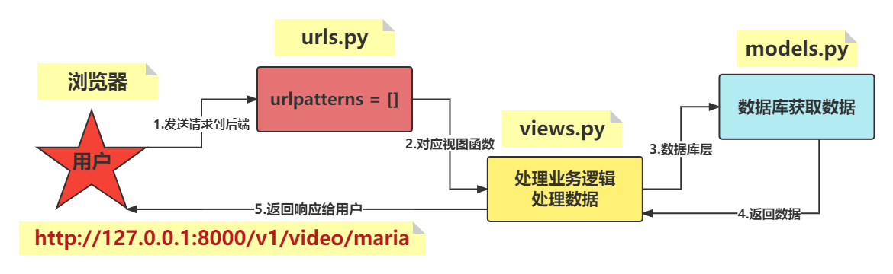
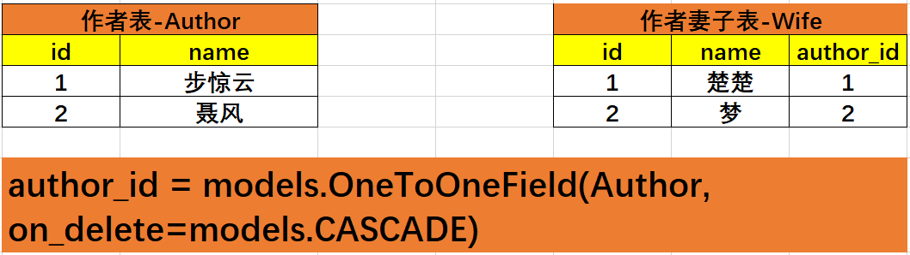
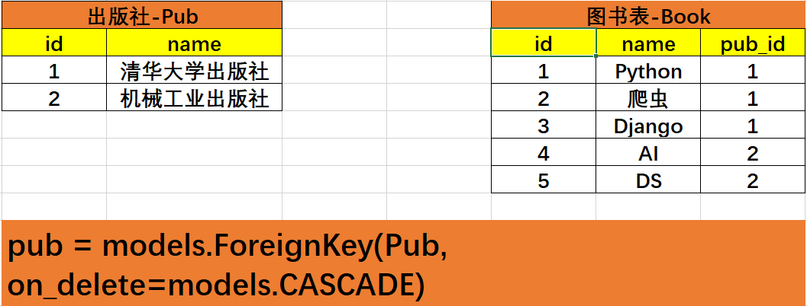
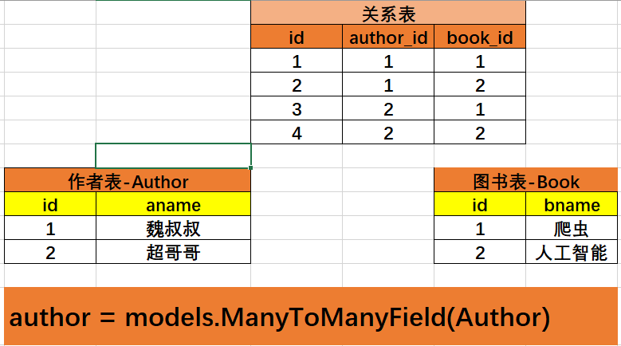
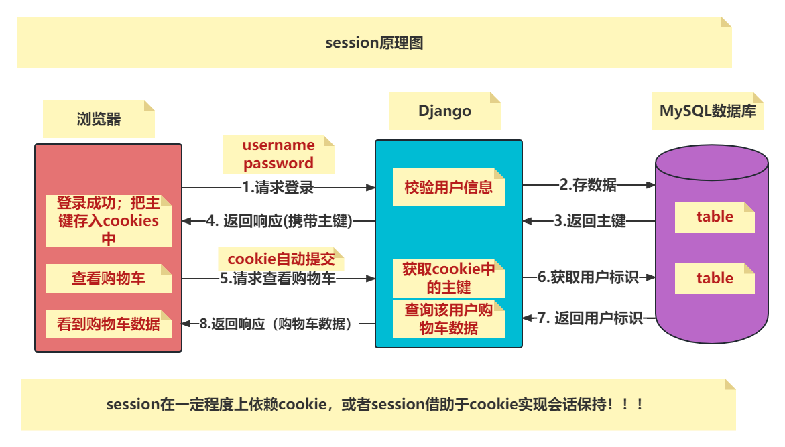
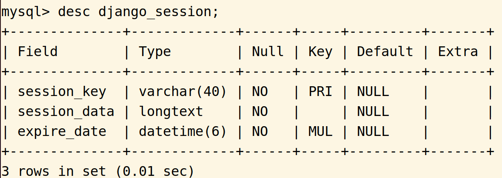
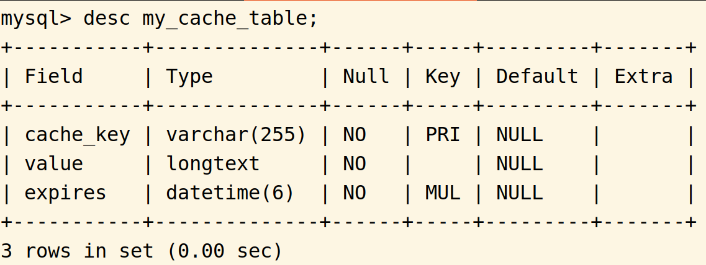
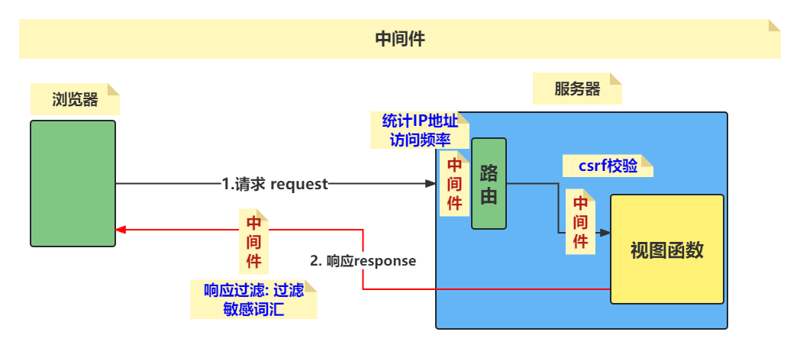

[TOC]

# DJANGO-DAY01

## 一、介绍

### 1）第三阶段课程介绍

* 课程内容（<font color=red>**共计：19个工作日**</font>）
  * Django框架（**6个工作日左右**）
  * Redis数据库（**2个工作日左右**）
  * Ajax（**1个工作日左右**）
  * Project项目（**10个工作日左右**）

* 目的
  * 从事Python开发工程师岗位。
  * 其他岗位的附加技能。
  * 提升编码能力，养成编程思维。

* 特点

  抽象、知识点多、代码量大。

### 2）自我介绍

* 姓名：王伟超
* 邮箱：wangweichao@tedu.cn

## 二、Python可以从事的行业

* 开发工程师（<font color=red>**可以从事**</font>）
* 数据分析工程师（**不好从事**）
* 人工智能工程师（<font color=red>**可以从事**</font>）
* 爬虫工程师（**不好从事，可以补充TTS赠送视频**）
* 自动化测试工程师（**需要补充自动化测试内容**）
* 自动化运维工程师（**不好从事**）

## 三、DJANGO项目

### 1）项目流程



### 2）实现步骤

* 创建并启动项目

  ```linux
  django-admin startproject 项目名
  cd 项目名
  python3 manage.py runserver
  ```

* 编写路由urls.py

  ```python
  from django.urls import path
  from . import views
  
  urlpatterns = [
      path("", views.xxx_view)
  ]
  ```

* 编写视图views.py

  ```python
  from django.http import HttpResponse
  
  def xxx_view(request):
      return HttpResponse("响应体数据")
  ```

* 浏览器测试

### 3）settings.py配置

1. BASE_DIR：`项目目录绝对路径`
2. DEBUG：`开发模式设置为True`
3. ALLOWED_HOST：`允许请求头的host的值,[]表示允许127.0.0.1访问`
4. INSTALLED_APPS：`存放所有应用`
5. TEMPLATES：`模板,用于存放html文件`
6. DATABASES：`配置数据库，一般使用MySQL`
7. LANGUAGE_CODE：`语言,设置zh-Hans`
8. TIME_ZONE：`时区,设置Asia/Shanghai`
9. ROOT_URLCONF：`根级URL配置,项目名.urls`

### 4）path转换器

* 作用

  `将URL地址中的数据按照字典关键字传参的方式给到视图函数。`

* 语法

  `<转换器类型:自定义变量名>`

* 示例

  `path("v1/users/<str:username>/<int:page>")`

  `def xxx_view(request, username, page):`

* 常见的转换器

  * str转换器：匹配除了 / 之外的所有字符串
  * int转换器：匹配整数

### 5）常见服务的端口号

* http：80
* https：443
* MySQL：3306
* django：8000
* SMTP：25

### 6）前端向后端传递数据的方式

* 路由：path转换器

  * 前端：`http://127.0.0.1:8000/v1/users/zhaoliying`

  * 后端：`path("v1/users/<str:username>", views.xxx_view)`

    ​           `def xxx_view(request, username):`

* 查询字符串

  * 前端：`http://127.0.0.1:8000/?username=xxx&password=xxx`
  * 后端：`request.GET`

* 请求体

  * 前端：`<form action="xxx" method="post">`
  * 后端：`request.POST`

## 四、HTTP请求和响应

### 1）请求

#### 1.1 请求内容

* 起始行：`指定请求方法、路由、使用协议`
* 请求头：`Accept、Content-Type请求体类型等`
* 请求体：`需要提交给服务器端数据，可以以Form表单形式提交,也可以使用json形式提交`

#### 1.2 请求方法

* GET：`获取服务器端资源`
* POST：`服务器端新建资源`
* PUT：`更新服务器端资源`
* DELETE：`删除服务器端资源`

<font color=red>**四种请求方式对应了对服务器端资源的增删改查四种操作，这只是一套指导规范，具体以入职后公司的风格为准。**</font>

#### 1.3 请求对象HttpRequest

* 说明

  作为视图函数的第一个参数request，服务器端在接收到请求后，会根据请求数据报文创建请求对象。

* 请求对象属性

  * method属性：请求方法，字符串string

  * GET属性：查询字符串，<QueryDict {}>

  * POST属性：请求体数据(Form表单)，<QueryDict {}>

  * body属性：请求体数据(json形式)，b""

  * COOKIES属性：cookies数据，{}

  * session属性：session数据，{}

  * META属性：请求头信息，{}

    <font color=purple>**request.META: Django会把所有请求头都大写,并加上HTTP_前缀；比如：HTTP_ACCEPT、HTTP_USER_AGENT、REMOTE_ADDR获取IP地址。**</font>

### 2）响应对象HttpResponse

* 响应内容
  * 响应起始行
  * 响应头
  * 响应体

* 视图函数

  HttpResponse(content="响应体", content_type="类型", status=状态码)

  content_type示例：

  * html格式：`text/html;charset=utf-8`
  * 文本格式：`text/plain;charset=utf-8`
  * json格式：`application/json;charset=utf-8`

### 3）目前遇到的状态码

* 404：Page Not Found，检查路由和浏览器URL地址是否匹配。
* 403：403 Forbidden，csrf校验未通过，关闭csrf中间件。
* 500：服务器错误，检查视图函数。

# DJANGO-DAY02

## 一、设计模式

<font color=red>**所有设计模式的最终目的都是为了降低模块间的耦合度。**</font>

### 1）MVC

* M：模型层Models，封装数据库层。
* V：视图层View，展示数据。
* C：控制器层Controller，<font color=red>**核心，**</font>处理用户请求、获取数据、返回结果。

### 2）MVT

* M：模型层Models，封装数据库层。
* V：视图层View，<font color=red>**核心，**</font>，处理用户请求、获取数据、返回结果。
* T：模板层Templates，展示数据。

## 二、模板Template

### 1）定义

​	可以根据视图中传递的字典数据动态生成相应的HTML网页，并呈现给用户。

### 2）使用流程

1. 项目目录下创建模板目录templates。

2. settings.py配置模板选项：TEMPLATES

   * BACKEND：指定模板引擎（<font color=red>**默认**</font>）。
   * DIRS：模板文件的存放目录（<font color=red>**[BASE_DIR / "templates"]**</font>）。
   * APP_DIRS：在应用的templates目录中搜索模板文件。
   * OPTIONS：有关模板的选项（<font color=red>**默认**</font>）。

3. 创建模板html文件。

4. 视图中render()方法加载模板。

   ```python
   from django.shortcuts import render
   
   def xxx_view(request):
       return render(request, "xxx.html", 字典数据)
   ```

<font color=red>**查找模板文件时，优先查找外层templates目录下的模板，如果没有则按照settings.py中INSTALLED_APPS中应用注册的顺序依次逐个查找。**</font>

### 3）模板语言

#### 3.1 模板传参

`return render(request, "xxx.html", 字典数据)`

#### 3.2 模板变量

* 语法格式：`{{  }}`

* 分类

  |        语法        |             作用             |
  | :----------------: | :--------------------------: |
  |    {{ 变量名 }}    |           普通变量           |
  | {{ 变量名.index }} | 列表中指定元素,0 1 2 ... ... |
  |  {{ 变量名.key }}  |       获取字典中的数据       |
  |    {{ 方法名 }}    |     获取指定函数的返回值     |
  | {{ 对象名.方法 }}  |      获取类方法的返回值      |

#### 3.3 模板标签

* 作用：`将一些服务器端的功能嵌入到模板中。`

* 语法

  ```python
  
  
  ```

* 常用标签

  * if标签

    ```python
    
    ...
    
    ...
    
    ...
    
    ```

  * for标签

    ```python
    
    ...
    
    ...
    
    ```

  * 加载静态文件

    ```python
    
    
    ```

## 三、静态文件配置

* settings.py相关配置

  ```python
  STATIC_URL = "/static/"
  STATICFILES_DIRS = (BASE_DIR / "static",)
  ```

* 项目目录下创建static目录并存放静态文件

* 浏览器测试

  `http://127.0.0.1:8000/static/1.jpg`

## 三、应用APP

### 1）定义

​	应用在Django中是一个独立的业务模块，可以包含自己的路由、视图、模板、模型。

### 2）使用流程

1. 创建应用：`python3 manage.py startapp 应用名`

2. 注册应用：`settings.py  INSTALLED_APPS ['应用名',]`

3. 主路由：`注意：include()方法`

   ```python
   from django.urls import path, include
   
   urlpatterns = [
       path("主路由", include("应用名.urls")),
   ]
   ```

4. 分布式路由：`创建urls.py`

5. 视图

# DJANGO-DAY03

## 一、DJANGO配置MySQL

* 创建数据库（**MySQL命令行**）

  `create database 库名 default charset utf8;`

* 配置数据库（**settings.py**）

  <font color=red>**指定数据库引擎、主机地址、用户名、密码、端口、具体库**</font>

  ```python
  DATABASES = {
      "default": {
          "ENGINE": "django.db.backends.mysql",
          "HOST": "127.0.0.1",
          "USER": "root",
          "PASSWORD": "123456",
          "NAME": "库名",
          "PORT": "3306",
      }
  }
  ```

  常见数据库引擎

  ```python
  django.db.backends.mysql
  django.db.backends.oracle
  django.db.backends.sqlite3
  ... ...
  ```

## 二、ORM框架

### 1）定义

​	ORM，对象关系映射，避免使用SQL操作数据库，而是用类和对象对数据库进行操作。

### 2）ORM特点

#### 2.1 优点

* 只需要面向对象编程，无须面向数据库编程。
* 实现了数据模型和数据库的解耦，不用关心公司使用的数据库的细节，通过简单的配置就能更换数据库，无须修改大量代码。

#### 2.2 缺点

* 需要将对应的操作语句转为SQL指令执行，在映射的过程中会有一定程度的性能损失。
* 对于复杂业务使用成本较高。

### 3）ORM映射关系

|    ORM     |   数据库   |
| :--------: | :--------: |
|   一个类   |   一张表   |
| 一个类属性 | 一个表字段 |
|  一个对象  | 一条表记录 |

### 4）ORM使用流程

1. 创建库

2. 配置数据库(settings.py)

3. 创建应用（startapp）

4. 创建模型类（models.py）

   ```python
   from django.db import models
   
   class Xxx(models.Model):
       pass
   ```

5. 迁移同步（两个m）

   ```python
   python3 manage.py makemigrations
   python3 manage.py migrate
   ```

### 5）迁移文件混乱处理方法

1. 删除数据库：`drop database 库名;`

2. 创建数据库：`create database 库名 default charset utf8;`

3. 删除迁移文件：`应用目录/migrations目录/0001_xxx.py`

4. 重新迁移同步

   `python3 manage.py makemigrations`

   `python3 manage.py migrate`

### 6）字段类型

* 数据类型

  1. models.IntegerField()

  2. models.CharField(max_length=宽度)

  3. models.BooleanField()

  4. models.DecimalField(max_digits=10, decimal_places=2)

  5. modles.DateTimeField(auto_now=True)

     models.DateTimeField(auto_now_add=True)

  6. models.EmailField()

* 字段类型需要注意

  1. 字符类型必须指定宽度：`CharField(max_length=宽度)`。
  2. 浮点型必须指定总位数和小数位位数：`DecimalField(max_digits=, decimal_places=)`。
  3. 存储邮箱：`EmailField()`。
  4. 布尔类型，编程中使用True|False。

* 字段选项注意

  1. 主键primary_key

     模型类未指定主键，则Django会自动创建id并设置为主键字段；

     模型类指定了主键，则Django不会自动创建id字段。

  2. 索引db_index

     在经常用来查询的字段上建立索引，也是数据库优化的一种方式。

  3. 唯一unique

     字段的值不允许重复

  4. null

     是否允许为空，null=True|False

  <font color=green>**在现有的模型类中增加字段，务必设置默认值default，因为数据表原来可能有数据，如果未设置默认值则django无法给该字段赋值。**</font>

## 三、ORM操作

<font color=red>**统统使用管理器对象objects，每个继承models.Model的模型类都会同样继承objects。**</font>

* 新增（create()）

  `数据对象 = 模型类.objects.create(x=x,x=x,x=x,x=x)`

* 查询

  * 查询所有数据：`query_set = 模型类.objects.all()`

  * 查询符合条件数据：`query_set = 模型类.objects.filter(x=x,x=x)`

  * 查询符合条件1条数据：`obj = 模型类.objects.get(x=x, x=x)`

    * 没有符合条件的数据：抛出异常
    * 多余1条符合条件的数据：抛出异常
    * 只有1条符合条件的数据：返回数据对象

    <font color=red>**项目中只要用到get()方法查询，必须加上 try except 语句。**</font>

* 修改

  * 单条数据修改

    一查：`user = UserProfile.objects.get(username="zhaoliying")`

    二改：`user.phone = "13988888888"`

    三保存：`user.save()`

  * 批量修改

    `update xxx set xx=xx where id>=3;`

    `UserProfile.objects.filter(id__gte=3).update(xx=xx,xx=xx)`

* 删除

  `一查二删除`

  `UserProfile.objects.get(username="zhaoliying").delete()`

  `UserProfile.objects.filter(id__gte=1).delete()`

# DJANGO-DA04

## 一、模型内部类Meta

​	使用Meta类可以对模型类赋予属性，比如指定表名、指定admin后台数据显示格式、对模型类做出控制。

* 使用示例

  ```python
  # 应用名/models.py
  from django.db import models
  
  class Xxx(models.Model):
      username = models.CharField("用户名", max_length=20)
      class Meta:
          db_table = "表名"
          verbose_name = ""
          verbose_name_plural = ""
  ```

## 二、DJANGO SHELL

* 交互式操作，用于开发调试项目。

* 进入方式：`python3 manage.py shell`

* 注意

  <font color=purple>**当项目代码更新时，django shell环境不会自动同步代码，一定要退出shell环境再重新进入。**</font>

## 三、ORM查询

### 1）常用方法

#### 1.1 values()

* 示例：`query = Address.objects.values("name")`
* 返回值：`<QuerySet [{"name": xxx, "name": xxx}]>`

#### 1.2 values_list()

* 示例：`query = Address.objects.values_list("name")`
* 返回值：`<QuerySet [(), (), (), ...]>`

#### 1.3 order_by()

* 返回值：`<QuerySet []>`

* 示例

  ```python
  # 1.升序：books = Book.objects.order_by("price")
  # 2.降序：books = Book.objects.order_by("-price")
  ```

#### 1.4 查询谓词

<font color=red>所有的查询谓词均用于查询条件，语法格式为：类属性__查询谓词=值。</font>

* __in

  ```python
  query = UserProfile.objects.filter(id__in=[1,3,5])
  query = UserProfile.objects.filter(id__in=(1,3,5))
  query = UserProfile.objects.filter(id__in={1:x, 3:x, 5:x})
  ```

* __contains：包含

  `query = User.Objects.filter(username__contains="王")`

* __startswith：以xxx开头

* __endswith：以xxx结尾

* `__gt、__gte、__lt、__lte`

#### 1.5 aggregate()聚合

* 单纯聚合

* 方法：模型类.objects.aggregate(变量名=聚合函数("列"))

* 示例

  ```python
  from django.db.models import Avg
  
  dic = Book.objects.aggregate(avg_price=Avg("price"))
  # dic: {"avg_price": 88.88}
  ```

#### 1.6 annotate()分组聚合

* 分组聚合

* 方法：`<QuerySet []>.annotate(变量名=聚合函数("列"))`

* 示例

  ```python
  pub_query = Book.objects.values("pub")
  result = pub_query.annotate(my_count=Count("id"))
  
  # result: <QuerySet [{"pub":"清华大学出版社", "my_count": 5}, {"pub": "机械工业出版社", "my_count": 3}]>
  ```


#### 1.7 F对象

<font color=purple>**一个F对象代表数据表中某条记录的字段的信息。**</font>

* 作用：`用于类属性之间的比较。`

* 示例

  ```python
  from django.db.models import F
  # 1.更新
  Book.objects.all().update(price=F("price")+10)
  # 2.查询
  Book.objects.filter(market_price__gt=F("price"))
  ```

#### 1.8 Q对象

* 作用：`用于查询时的复杂条件，比如逻辑与&、逻辑或|、逻辑非~`

* 运算符：`& | ~`

* 语法

  ```python
  from django.db.models import Q
  
  Q(条件1) | Q(条件2)
  Q(条件1) & Q(条件2)
  Q(条件1) | ~Q(条件2)
  ```

## 四、操作原生SQL

### 1）raw()

* 用法：`模型类.objects.raw('SQL指令', [拼接参数])`
* 注意：`raw()方法一定要使用拼接参数来执行SQL命令，避免SQL注入问题。`

### 2）通过游标操控

* 说明：`利用django中的游标cursor()进行操作。`

* 示例

  ```python
  from django.db import transaction
  
  with connection.cursor() as cur:
      cur.execute("SQL指令", [拼接参数])
  ```

### 3）SQL注入

​	SQL注入是Web应用程序对用户输入数据的合法性没有判断或者过滤不严，攻击者可以再Web应用程序中事先在查询语句的末尾加上额外的SQL语句（**比如：id=1 or 1=1**），在管理员不知情的情况下实现非法的操作，以此来实现七篇数据库服务器执行任意查询，从而增加数据库的压力，并且攻击者可以进一步获取更多的数据。

<font color=red>**select xxx from xxx where id=1 or 1=1;**</font>

## 五、admin后台数据管理

### 1）说明

​	使用Django Admin可以快速对数据库中的各个数据表进行可视化的增删改查操作，将所有需要管理的模型集中在一个平台，不仅可以选择性的管理数据表，还可以快速定制数据条目查询、过滤、搜索条件等。

### 2）使用流程

1. 创建管理员用户：`python3 manage.py createsuperuser`

2. 注册模型类：`admin.py`

3. 自定义数据表显示选项

   ```python
   from django.contrib import amdin
   
   class XxxManager(admin.ModelAdmin):
       list_display = []
       list_display_links = []
       search_fields = []
       list_editable = []
       
   admin.siter.register(模型类, XxxManager)
   ```

4. admin管理平台：`http://127.0.0.1:8000/admin/`

## 六、关系映射

### 1）关系

* 一对一

  * 方法：`xx = models.OneToOneField(模型类, on_delete=级联动作)。`

  * 说明：`外键属性在任何一个模型类都可以。`

  * 图解

    

* 一对多

  * 方法：`xx = models.ForeignKey(模型类, on_delete=级联动作)`

  * 说明：`外键属性必须在 多 的模型类身上。`

  * 图解

    

* 多对多

  * 方法：`xx = models.ManyToManyField(模型类)`

  * 说明：`外键在任意一个模型类均可。`

  * 图解

    

  * 注意：<font color=blue>**多对多不需要指定级联动作！**</font>

<font color=red>**注意：级联动作分为4种，CASCADE级联删除，PROTECT如果有相关联的数据则不允许删除，SET NULL是设置为空，SET DEFAULT设置默认值。**</font>

### 2）查询

#### 2.1 正向查询

<font color=red>通过有外键属性的模型类对象查找另一个模型类对象。</font>

* 一对一正向：`数据对象.外键`
* 一对多正向：`数据对象.外键`
* 多对多正向：`数据对象.外键.all()`

#### 2.2 反向查询

<font color=red>通过没有外键属性的模型类对象查找另一个模型类对象。</font>

* 一对一反向：`数据对象.反向属性-另一个类名小写`
* 一对多反向：`数据对象.反向属性(另一个类名小写_set).all()`
* 多对多反向：`数据对象.反向属性(另一个类名小写_set).all()`

# DJANGO-DAY05

## 一、COOKIES

<font color=red>因为HTTP协议是无状态的，所以无法保持客户端和服务器端的会话。</font>

### 1）作用

​	保持客户端和服务器端的会话。

### 2）原理图


### 3）特点

* 保存在客户端浏览器中的存储空间。
* 数据以键值对的方式存储。
* 按域存储隔离，不同域之间无法进行访问。
* 不要太大，会降低响应速度。

### 4）常用方法

<font color=red>通过HttpResponse响应对象进行cookies设置、修改、删除。</font>

<font color=red>通过：request.COOKIES进行获取。</font>

* 设置cookie：`HttpResponse.set_cookie(key, value, max_age)`

* 删除cookie：`HttpResponse.delete_cookie(key)`

* 获取cookie：`request.COOKIES`

  示例：`username = request.COOKIES.get("username")`

### 5）总结

<font color=blue>在浏览器中，Cookie是服务器让浏览器帮忙携带信息的手段，浏览器会存储它，并且在后序的HTTP请求中再次发送给服务器。</font>

## 二、SESSION

<font color=red>因为HTTP协议是无状态的，所以无法保持客户端和服务器端的会话。</font>

### 1）作用

​	保持客户端和服务器端的会话状态。

​	在服务器端开辟一段空间（**django_session表**），用于保存浏览器和服务器端交互时的相关用户标识数据。

### 2）原理图



### 3）DJANGO实现SESSION会话

1. settings.py中添加session应用及session中间件。

   ```python
   1) INSTALLED_APPS = ['django.contrib.sessions',]
   2) MIDDLEWARE = ['django.contrib.sessions.middleware.SessionMiddleware',]
   ```

2. 视图中保存用户标识到django_session表。

   `request.session[key] = value`

   

3. 视图中获取session

   `request.session.get(key)`

### 4）DJANGO常用配置

* SESSION_COOKIE_AGE：`指定sessionId的有效期，默认是2个星期。`
* SESSION_EXPIRE_AT_BROWSER_CLOSE：`浏览器关闭时,session失效。`

### 5）清除已过期的session数据

​	因为django_session表是单表设计，可能还会存在浏览器恶意删掉sessionid以及过期数据为及时清除，导致该表数据量持续增长给服务器端带来巨大的存储压力和查询压力，可以每晚执行 python3 manage.py clearsessions 删除已经过期的session数据。

## 三、缓存

### 1）作用

​	因为视图渲染资源及成本消耗较高，所以将用户访问频率高的数据存入缓存中；

​	用户访问时先从缓存中搜索是否存在所需数据，如果存在直接返回给用户，如果不存在则到数据库中查询数据并缓存到缓存中并返给用户响应。

​	应用场景：博客列表页、电商网站首页、热门商品详情页、热门文章。

## 2）DJANGO中设置缓存

#### 2.1 步骤

* settings.py 配置缓存配置项CACHES

  `指定缓存引擎、缓存区域、缓存时间、缓存最大条数、指定何时清理缓存`

  ```python
  CACHES = {
      'default': {
          'BACKEND': 'django.core.cache.backends.db.DatabaseCache',
          'LOCATION': 'my_cache_table',
          'TIMEOUT': 300,  #缓存保存时间 单位秒，默认值为300,
          'OPTIONS': {
              'MAX_ENTRIES': 300, #缓存最大数据条数
              'CULL_FREQUENCY': 2,#缓存条数达到最大值时 删除1/x的缓存数据
          }
      }
  }
  ```

* 创建缓存表

  `python3 mange.py createcachetable`

  

* 使用缓存装饰器cache_page

  * 视图中使用

    ```python
    from django.views.decorators.cache import cache_page
    
    @cache_page(30)
    def xxx_view(request):
        pass
    ```

  * 路由中使用

    ```python
    from django.views.decorators.cache import cache_page
    
    urlpatterns = [
        path("xxx/xxx", cache_page(30)(views.视图函数名)),
    ]
    ```

#### 2.2 常见缓存引擎

1. Redis缓存引擎：`BACKEND: django_redis.cache.RedisCache`
2. 数据库缓存引擎：`BACKEND: django.core.cache.backends.db.DatabaseCache`
3. 文件系统引擎：`BACKEND: django.core.cache.backends.filebased.FileBasedCache`
4. 本地内存引擎：`BACKEND: django.core.cache.backends.locmem.LocMemCache`

### 3）局部缓存API

* 作用：`缓存部分数据，而不是整个响应（Django自带的缓存装饰器cache_page()是缓存整个响应）。`

* 使用流程

  ```python
  # 1.settings.py添加缓存配置项CACHES
  # 2.视图函数中直接导入调用即可
  from django.core.cache import caches
  
  caches["default"].set(key, value, expire)
  ```

* 常用方法

  * 存入数据：`caches["key"].set(key, value, expire)`
  * 获取数据：`caches["key"].get(key)`
  * 删除数据：`caches["key"].delete(key)`

# DJANGO-DAY06

## 一、中间件

### 1）定义

​	中间件是Django请求/响应处理的钩子框架，<font color=red>用于全局改变Django的输入和输出。</font>

### 2）中间件原理图和分类

* 原理图1

  

* 原理图2

  

### 3）常用中间件及方法

<font color=red>**中间件类必须继承：django.utils.deprecation.MiddlewareMixin**</font>

1. 处理请求request中间件
   * 方法：`process_request(self, request)`
   * 说明：`所有请求在 执行路由之前 ，此方法都会被调用`
   * 返回值
     * None，说明请求校验通过，进入下一个中间件
     * HttpResponse：请求校验未通过，返回响应直接结束
   * 应用场景：IP地址访问次数校验
2. 处理视图view中间件
   - 方法：`process_view(self, request, callback, callback_args, callback_kwargs)`
   - 说明：`所有请求在 进入视图函数之前 ，此方法都会被调用`
   - 返回值
     - None，说明请求校验通过，进入下一个中间件
     - HttpResponse：请求校验未通过，返回响应直接结束
   - 应用场景：crsf校验
3. 处理响应response中间件
   - 方法：`process_response(self, request, response)`
   - 说明：`所有响应在 返回之前 ，此方法都会被调用`
   - 返回值
     - HttpResponse：返回响应直接结束
   - 应用场景：敏感词过滤屏蔽
4. 处理异常exception中间件
   - 方法：`process_exception(self, request, exception)`
   - 说明：`当中间件处理过程中抛出异常时调用此中间件`
   - 返回值
     - HttpResponse：返回响应直接结束
5. 处理响应template中间件
   - 方法：`process_template_response(self, request, response)`
   - 说明：`在视图函数执行完毕并返回响应的对象中包含render()方法时被调用`
   - 返回值
     - render()方法的响应对象

### 4）实现中间件

* 编写中间件的类

  ```python
  from django.utils.deprecation import MiddlewareMixin
  
  class XxxMiddleware(MiddlewareMixin):
      def process_request(self, request):
          pass
  ```

* settings.py中注册中间件

  ```python
  MIDDLEWARE = ["应用名.中间件py文件名.中间件类名",]
  ```

* 浏览器测试

## 二、DJANGO发送邮件

### 1）说明

​	框架在 django.core.mail 模块中集成了发送邮件功能，通常情况下发送邮件需要使用SMTP服务。

### 2）实现步骤

* 将QQ邮箱权限授权给DJANGO

  登录QQ邮箱，设置 - 账户 - POP2/IMAP 服务开启

  <font color=red>手机发送短信，获取到QQ邮箱的授权码。</font>

* settings.py邮件相关配置

  ```python
  # 1.指定邮件引擎
  EMAIL_BACKEND = 'django.core.mail.backends.smtp.EmailBackend'
  # 2.指定SMTP服务器地址
  EMAIL_HOST = 'smtp.qq.com'
  # 3.指定SMTP服务端口
  EMAIL_PORT = 25
  # 4.指定发件人
  EMAIL_HOST_USER = 'xxxx@qq.com'
  # 5.指定授权码
  EMAIL_HOST_PASSWORD = '******'
  # 6.启动TLS安全连接
  EMAIL_USE_TLS = True
  ```

* 调用发送邮件接口

  ```python
  from django.core import mail
  
  mail.send_mail(
  	# 1.邮件标题
      subject="",
      # 2.邮件正文
      message="",
      # 3.发件人
      from_email="",
      # 4.收件人列表
      recipient_list=['xxx@qq.com'],
  )
  ```

# 补充内容

## 一、常用总结

### 1）总结1

* 组合1：创建应用后一定要到settings.py注册应用。
* 组合2：创建模型类并迁移同步（**makemigrations   migrate**）

### 2）常用命令

* python3 manage.py runserver
* python3 manage.py startapp 应用名
* python3 manage.py makemigrations
* python3 manage.py migrate
* python3 manage.py shell
* python3 manage.py createsuperuser
* python3 manage.py clearsessions
* python3 manage.py createcachetable

### 3）常用模块

* from django.urls import path, include
* from django.conf import settings
* from django.http import HttpResponse
* from django.shortcuts import render
* from django.db import models
* from django.db.models import Avg, Sum, Max, Min, Count, F, Q
* from django.db import connection
* from django.contrib import amdin
* from django.views.decorators.cache import cache_page
* from django.utils.deprecation import MiddlewareMixin

## 二、周期性计划任务

* 说明

  在Linux操作系统中自带的一个定时任务的工具。

* 使用

  * 进入周期性计划任务命令：`crontab -e`
  * 选择 2 使用 vim编辑器打开

* 设置周期性计划任务的规则

  ```python
  *  *  *  *  *  Linux命令
  分 时 日 月 周  Linux命令
  
  1.取值范围
    分: 0-59  时: 0-23  日: 1-31  月: 1-12  周: 0-6
  2.示例
    2.1 每天早晨09:00，执行清除过期session数据的指令。
        0 9 * * *  python3 manage.py clearsessions
    2.2 每天09:00-18:00之间,每隔一个小时执行清除指令。
        0 9-18/1 * * * python3 manage.py clearsessions
        # - : 代表时间段
        # / : 代表时间间隔的频率
  ```

## 三、MySQL优化

* 索引层面

  `经常用来查询的字段上建立索引，加快数据检索的速度。`

* 查询语句层面

  `尽量避免全表扫描，尽量命中索引。尽量避免适用 * 、in、!=、not in 等查询条件。`

* 存储引擎
  * InnoDB：`支持外键、支持事务和事务回滚、支持行级锁，默认的存储引擎，写操作多的表使用此引擎。`
  * MyISAM：`不支持外键、不支持事务，支持表级锁，读操作多的表使用此引擎。`
  * MEMORY：`表结构存储在磁盘，表数据存储在内存，适用于临时表或者中间表。`

## 四、哈希加密

* 哈希加密三大特性

  `不可逆、定长输出、雪崩效应`

* Python支持

  ```python
  import hashlib
  
  m = hashlib.md5()
  m.update(b"xxx")
  m.hexdigest()
  ```

## 五、base64编码

* 说明：`base64是一种编码技术，不是加密；既可以编码，也可以解码。`

* 常用方法

  * 编码：`result = base64.b64encode(b"")`
  * 解码：`result = base64.b64decode(b"")`

  <font color=red>base64模块中，编码解码方法的 参数和结果 都是字节串bytes，所以一定要注意 encode() 和 decode() 方法。</font>