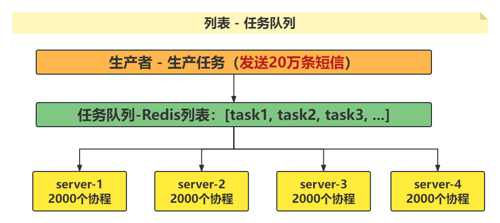

[TOC]

## 一、关于Redis

### 1）Redis特点

* 基于内存，并且支持将数据持久化到磁盘。
* 基于key-value的非关系型数据库（**NoSQL数据库**）。
  * 关系型：`数据以二维表的形式存储，Oracle、MySQL、MariaDB`
  * 非关系型：`数据以键值对方式存储，Redis、MongoDB`
* 数据类型丰富，五大数据类型（**字符串、列表、哈希、集合、有序集合**）。
* 核心指令是单进程单线程。

### 2）应用场景

* 缓存（处理高并发）
* 短信验证码
* 并发计数
* 共同关注、共同好友
* 增量爬虫、分布式爬虫
* 各种排行榜
* 任务队列（消息队列）

### 3）数据类型

* 字符串：`{"name": "xiaoze"}、{"age": 38}`
* 列表：`{"mylist": ["xiaoze", 38, 100.66]} 列表中的元素必须为字符串`
* 哈希：`{"myhash": {"name":"xiaoze", "age": 38}}`
* 集合：`{1,2,"xiaoze",3, 4}`
* 有序集合：`{"rank": {"彩虹": 10000, "安静": 9900, "霍元甲": 9000}}`

## 二、相关操作

### 1）启动和连接

* 服务端启动：`sudo /etc/init.d/redis-server start|stop|restart|status`
* 客户端连接：`redis-cli -h 主机地址 -p 6379 -a 密码`

### 2）相关文件

* 配置文件：`/etc/服务名/xxx.conf`

  ```python
  1. redis配置文件: /etc/redis/redis.conf
  2. mysql配置文件: /etc/mysql/mysql.conf.d/mysqld.conf
  3. nginx配置文件: /etc/nginx/nginx.conf
  ```

* 启动文件：`/etc/init.d/服务名`

  ```python
  1. redis启动文件: sudo /etc/init.d/redis-server start|stop|restart|reload
  2. mysql启动文件: sudo /etc/init.d/mysql start|stop|restart
  3. nginx启动文件: sudo /etc/init.d/nginx start|stop|restart
  ```

* 日志文件：`/var/log/服务名/xxx.log`

  ```python
  1. redis日志文件: /var/log/redis/redis-server.log
  2. mysql日志文件: /var/log/mysql/error.log
  3. nginx日志文件: /var/log/nginx/access.log   /var/log/nginx/error.log
  ```

  <font color=red>**有问题，先看错误日志，tail -20 redis-server.log**</font>

### 3）相关配置

<font color=blue>**后期任何服务，只要更改了配置文件，则一定要重启或者重载服务，配置才会生效。**</font>

* 设置密码：`requirepass 密码`
* 设置远程连接：`# bind 127.0.0.1 ::1   protected-mode no`

## 三、Redis命令

<font color=blue>**通用命令**</font>

1. 查看所有的key：`KEYS *`
2. 查看key的类型：`TYPE key`
3. 删除key：`DEL key`
4. 切换库：`SELECT index`  <font color=blue>**index取值范围：0-15**</font>
5. 清除当前库数据：`FLUSHDB`
6. 清除所有库数据：`FLUSHALL`

### 1）字符串

<font color=green>**应用场景：常规并发计数(点赞数、评论数)、存储短信验证码、缓存热点数据响应（热门商品、热门文章等）提升并发处理能力。**</font>

* 设置key-value：`SET key value nx ex expire`
* 获取key：`GET key`
* +1操作：`INCR key`
* -1操作：`DECR key`

### 2）列表

<font color=green>**应用场景：任务队列、消息队列；生产者消费者模型，Redis充当任务队列的角色，存储任务**</font>



* 列表头部压入元素：`LPUSH key element`
* 列表尾部阻塞弹出元素：`BRPOP key timeout`    timeout为0时代表永久阻塞
* 查看元素：`LRANGE key start stop`
* 保留部分元素：`LTRIM key start stop`
* 查看列表长度：`LLEN key`

<font color=red>注意：LPUSH+BRPOP组合经常用作消息队列，消息入队列LPUSH，消息出队列BRPOP。</font>

### 3）哈希散列

<font color=red>应用场景1：用户不同维度数据的统计，比如：用户的关注数、粉丝数、作品数、获赞数，以用户的id作为key，不同的维度作为field，具体的值作为value。</font>

<font color=blue>应用场景2：存储购物车数据，用户的ID作为redis-key，商品的ID作为Field，数量和选中状态作为 value。</font>

* 设置key-field-value：`HSET key field value field value field value`

* 获取指定field：`HGET key field`

* 获取所有的field-value：`HGETALL key`

* 删除指定的field：`HDEL key field`

* 数值操作：`HINCRBY key field increment`

  `HINCRBYFLOAT key field increment`

### 4）集合

<font color=red>应用场景1：利用集合的交集获取共同好友、共同关注。</font>

<font color=green>应用场景2：增量爬虫，利用Redis集合存储每个请求的指纹，利用sadd 的返回值来确定是否为新更新的数据，返回值为1为新更新，否则为抓取过的数据。</font>

* 添加成员：`SADD key memeber member member`
* 查看成员：`SMEMBERS key`
* 查看长度：`SCARD key`
* 弹出成员：`SPOP key [count]`
* 集合交集：`SINTER key1 key2`
* 集合并集：`SUNION key1 key2`
* 集合差集：`SDIFF key1 key2`

### 5）有序集合

<font color=red>应用场景：各种排行榜</font>

* 添加成员：`ZADD key score member score member`

* 查看成员（升序）：`ZRANGE key start stop [WITHSCORES]`

* 查看成员（降序）：`ZREVRANGE key start stop [WITHSOCRES]`

* 查看成员排名（升序）：`ZRANK key member`

* 查看成员排名（降序）：`ZREVRANK key member`

* 交集：`ZINTERSTORE destination numkeys key [key...] WEIGHTS xx xx AGGREGATE SUM|MAX|MIN`

* 并集：`ZUNIONSTORE destination numkeys key [key...] WEIGHTS xx xx AGGREGATE SUM|MAX|MIN`

  ```python
  # 并集: 不带权重值weight
  r.zunionstore("rank3", ["rank1", "rank2"], aggregate="SUM")
  
  # 并集: 带权重值weight
  r.zunionstore("rank4", {"rank1": 0.5, "rank2": 0.5}, aggregate="MAX")
  ```

## 四、Python和Redis交互

* 模块安装

  * 安装：`pip3 install redis`

  * 在线安装：`pip3 install 模块名 -i 国内pip源`

    ```python
    1.清华大学 ：https://pypi.tuna.tsinghua.edu.cn/simple/
    2.阿里云：http://mirrors.aliyun.com/pypi/simple/
    3.中国科学技术大学 ：http://pypi.mirrors.ustc.edu.cn/simple/
    4.华中科技大学：http://pypi.hustunique.com/
    5.豆瓣源：http://pypi.douban.com/simple/
    6.腾讯源：http://mirrors.cloud.tencent.com/pypi/simple
    7.华为镜像源：https://repo.huaweicloud.com/repository/pypi/simple/
    ```

  * 离线安装

    1. **官网** 下载离线安装包（**xxx.tar.gz**）

    2. 解压并切换到解压后的目录（**tar  -zxvf  xxx.tar.gz**）

    3. 执行安装指令：`sudo python3 setup.py install`

       <font color=red>如果没有setup.py，则去找 README.rst</font>

* 和Python交互

  ```python
  import redis
  
  r = redis.Redis(host="", port=6379, db=0)
  r.set(key, value)
  ```

## 五、Redis数据库持久化

### 1）意义

​	为了数据安全！

​	数据持久化是将内存中的数据保存到磁盘中一份，用于数据备份和数据恢复。当Redis服务宕机或者重启时，Redis会自动将磁盘中的数据快速恢复到内存中一份。

### 2）数据持久化方式

#### 2.1 RDB模式

* 全量备份，每次备份都备份所有数据。

* 全量备份资源消耗较大，所以备份不能太频繁。

* 数据恢复效率高。

* 相关策略

  ```python
  save 900 1
  save 300 10
  save 60 10000
  满足任意一个条件，则自动触发BGSAVE执行全量备份。
  ```

#### 2.2 AOF模式

* 增量备份，每次备份只备份新变化的数据。

* 增量备份资源消耗较小，所以可以高频备份。

* 数据恢复效率低，因为要执行大量的Redis命令。

* 相关策略

  ```python
  appendonlyfasync always   # 不丢失数据
  appendonlyfasync everysec # 最多丢失一秒钟数据
  appendonlyfasync no       # 丢失数据的数量不一定
  
  # AOF文件重写策略
  auto-aof-rewrite-percentage 100
  auto-aof-rewrite-min-size 64mb
  ```

<font color=red>**如果两种备份模式都开启，则数据恢复时默认以AOF方式恢复（appendonfy.aof文件）。**</font>

## 六、主从加哨兵

### 1）特点

* 主 - master：负责读写数据，并且将数据同步给从服务器。
* 从 - slave：负责读数据，不能写数据，减轻master的读压力。

### 2）配置主从

* 配置文件中增加主从配置

  * 设置主从：`SLAVEOF IP PORT`
  * 取消主从：`SLAVEOF NO ONE`

  <font color=red>sudo /etc/init.d/redis-server restart</font>

* 配置哨兵sentinel

  * 安装：`sudo apt install redis-sentinel`

  * 作用：`不断检查master和slaves是否正常，一旦master挂掉，会从slaves中提升一个为新的主，并将其他的从设置为新的主的从。`

  * 配置：`创建配置文件：sentinel.conf`

    ```python
    port 端口号(自定义)
    sentinel monitor 服务名(自定义) 127.0.0.1 6379 投票数(奇数)
    ```

  * 启动哨兵：`redis-sentinel sentinel.conf`

* 测试

  * 将主服务停止，观察哨兵变化。
  * 再将主服务启动，观察哨兵变化。


# 补充

* pip3常见命令
  * 安装：sudo pip3 install xxx 
  * 卸载：sudo pip3 uninstall xxx
  * 下载：sudo pip3 download xxx
  * 升级：sudo pip3 install xxx --upgrade


