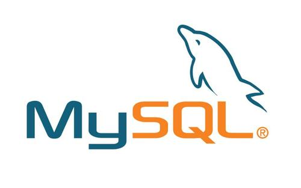
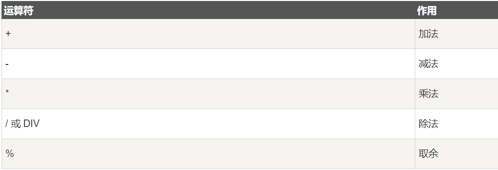

# MySQL

-----------

[TOC]


## 1. 数据库

### 1.1概述

- 数据存储

  - 文件管理阶段

  优点 ：  数据可以长期保存,可以存储大量的数据,使用简单。

  缺点 ：  数据一致性差,数据查找修改不方便,数据冗余度可能比较大。

  * 数据库管理阶段

  优点 ： 数据组织结构化降低了冗余度,提高了增删改查的效率,容易扩展,方便程序调用处理

  缺点 ： 需要使用sql 或者其他特定的语句，相对比较专业


- 数据库应用领域

  数据库的应用领域几乎涉及到了需要数据管理的方方面面，融机构、游戏网站、购物网站、论坛网站 ... ...都需要数据库进行数据存储管理。 


基本概念

- 数据 ： 能够输入到计算机中并被识别处理的信息集合。
- 数据库 ： 按照数据特定的结构，存储管理数据的仓库。数据库是在数据库管理系统管理和控制下，在一定介质上的数据集合。
- 数据库管理系统 ：管理数据库的软件，用于建立和维护数据库。


- 关系型数据库和非关系型数据库

  > 关系型： 采用关系模型（行列构成的二维表）来组织操作呈现数据的数据库 ，如Oracle 、SQL_Server、 MySQL等
  >
  > 非关系型： 不采用关系模型组织呈现数据的数据库，如：MongoDB、Redis等

  

  

### 1.2 MySQL

1996年，MySQL 1.0发布,作者Monty Widenius, 为一个叫TcX的公司打工，当时只是内部发布。到了96年10月，MySQL 3.11.1发布了，一个月后，Linux版本出现了。真正的MySQL关系型数据库于1998年1月发行第一个版本。MySQL是个开源数据库，后来瑞典有了专门的MySQL开发公司，将该数据库发展壮大，在之后被Sun收购，Sun又被Oracle收购。

官网地址：[https://www.mysql.com/](https://www.mysql.com/)



- MySQL特点
  1. 是开源数据库，使用C和C++编写 
  2. 能够工作在众多不同的平台上
  3. 提供了用于C、C++、Python、Java、Perl、PHP、Ruby众多语言的API
  4. 存储结构优良，运行速度快
  5. 功能全面丰富


- MySQL安装
  - Ubuntu安装MySQL服务
    - 终端执行: sudo apt  install mysql-server
  - Windows/MacOS安装MySQL
    - 下载MySQL安装包  [https://dev.mysql.com/downloads/windows/installer/8.0.html](https://dev.mysql.com/downloads/windows/installer/8.0.html)
    - 直接运行安装文件安装


- 启动和连接MySQL服务

  - 服务端启动

    - 查看MySQL状态 : sudo  service  mysql  status
    - 启动/停止/重启服务：sudo  service  mysql    start/stop/restart

  - 连接数据库

    ```sql
    mysql  -u  用户名    -p  
    ```
    
> 注意： 
>
> 1. 回车后输入数据库密码 （我们设置的是123456）

- 关闭连接
  
  ```sql
    ctrl-D
    exit
  ```


- MySQL数据库结构

> 数据元素 --> 记录 -->数据表 --> 数据库


- 基本概念解析
  - 数据表（table） ： 存放数据的表格 
  - 字段（column）： 每个列，用来表示该列数据的含义
  - 记录（row）： 每个行，表示一组完整的数据


### 1.3 SQL语言

- 什么是SQL

结构化查询语言(Structured Query Language)，一种特殊目的的编程语言，是一种数据库查询和程序设计语言，用于存取数据以及查询、更新和管理关系数据库系统。

- SQL语言特点
  - SQL语言基本上独立于数据库本身
  - 各种不同的数据库对SQL语言的支持与标准存在着细微的不同
  - 每条命令以 ; 结尾
  - SQL命令（除了数据库名和表名）关键字和字符串可以不区分字母大小写

## 2. 数据库基础操作

### 2.1 数据库管理

1. 查看已有库

> show databases;

2. 创建库

> create database 库名 [character set utf8];

```sql
e.g. 创建stu数据库，mysql8.0以后默认编码为utf8,如使用5.7之前的版本往往需要设置编码
create database stu;
```

> 注意：数据库中标识符命名规则：
>
> 1. 数字、字母、下划线，但不要使用数字开头
> 3. 尽量不要使用特殊字符和mysql关键字
> 3. 多个单词使用下划线连接

3. 切换库

> use 库名;

```sql
e.g. 使用stu数据库
use stu;
```

4. 删除库

> drop database 库名;

```sql
e.g. 删除test数据库
drop database test;
```


### 2.2 数据表管理

- 基本思考过程
  1. 确定存储内容
  2. 明确字段构成
  3. 确定字段数据类型

#### 2.2.1 基础数据类型

- 数字类型：
  - 整数类型：INT，SMALLINT，TINYINT，MEDIUMINT，BIGINT
  - 浮点类型：FLOAT，DOUBLE，DECIMAL
  - 比特值类型：BIT


> 注意：
>
> 1. 对于准确性要求比较高的东西，比如money，用decimal类型减少存储误差。声明语法是DECIMAL(M,D)。M是数字的最大数字位数，D是小数点右侧数字的位数。比如 DECIMAL(6,2)最多存6位数字，小数点后占2位,取值范围-9999.99到9999.99。
> 2. float(5，2)  float后的数字5表示数字位数，2表示精确到小数点后2位。
> 3. 比特值类型指0，1值表达2种情况，如真，假。

------

- 字符串类型：
  - 普通字符串： CHAR，VARCHAR
  - 存储文本：TEXT
  - 存储二进制数据： BLOB
  - 存储选项型数据：ENUM，SET


> 注意：
>
> 1. char：定长，即指定存储字节数后，无论实际存储了多少字节数据，最终都占指定的字节大小。默认只能存1字节数据。存取效率高。
> 2. varchar：不定长，效率偏低 ，但是节省空间，实际占用空间根据实际存储数据大小而定。必须要指定存储大小 varchar(50)
> 3. enum用来存储给出的多个值中的一个值,即单选，enum('A','B','C')
> 4. set用来存储给出的多个值中一个或多个值，即多选，set('A','B','C')


#### 2.2.2 表的基本操作

- 创建表

> create table 表名(字段名 数据类型 约束,字段名 数据类型 约束,...字段名 数据类型 约束);

```sql
create table class (
name varchar(30),
age tinyint,
sex enum('m','w'),
height float
);
```


- 字段约束
  - 如果你想设置数字为无符号则加上 UNSIGNED
  - 如果你不想字段为 NULL 可以设置字段的属性为 NOT NULL， 在操作数据库时如果输入该字段的数据为NULL ，就会报错。
  - DEFAULT 表示设置一个字段的默认值
  - CHECK 表示约束值的范围
  - COMMENT  增加字段说明
  - AUTO_INCREMENT 定义列为自增的属性，一般用于主键，数值会自动加1。
  - PRIMARY KEY 关键字用于定义列为主键。主键的值不能重复,且不能为空。

```sql
e.g.  创建班级表
create table class (
id int primary key auto_increment,
name varchar(30) not null,
age tinyint unsigned check(age > 15 and age < 25),
sex enum('m','w','o'),
score float default 0
);

e.g. 创建兴趣班表
create table hobby (
id int primary key auto_increment,
name char(30) not null,
hobby set("sing","dance","draw"),
level char  comment "评级",
price decimal(7,2),
remark text  comment "备注信息"
);

```

- 查看数据表

  > show  tables；

- 查看表结构

  > desc  表名;

  ```
  desc class;
  ```

  

- 查看数据表创建信息

  > show  create  table  表名；

  ```
  show create table class;
  ```

  

- 删除表

  > drop  table  表名;
  
  ```
  drop table student;
  ```
  
  


### 2.3 表数据基本操作

#### 2.3.1 插入(insert)

```SQL
insert into 表名 values (值1，值2...),(值1，值2...),...;
insert into 表名 (字段1,...) values (值1，值2...),...;

* values 也可以写 value
```

```sql
insert into class values
(1,"Lily",18,'f',89),
(2,"Lucy",18,'f',76),
(3,"Tom",17,'m',83);

insert into class
(name,age,sex,score)
values
("Levi",18,'m',86),
("Sunny",17,'m',91),
("Eva",17,'f',71);

insert into hobby
(name,hobby,level,price,remark)
values
("Joy","sing,dance","A",56800,"骨骼惊奇"),
("Abby","sing","B",14800.888,"天籁之音"),
("Barom","draw","B",26800.00,"当代达芬奇");

insert into hobby
(name,hobby,level,price)
values
("Jame","dance","C",8800),
("Emma","draw,sing","B",44800),
("Chen","sing","C",16800);

```

```sql
随堂练习：
创建一个数据库  exercise

创建一个数据表  books  类型和约束自己设计 ，字段 ： id  书名   作者   出版社  价格   备注

向其中插入数据若干  >= 6条
参考 ： 老舍  沈从文  鲁迅  冰心  ....
出版社 ： 中国文学  人民教育   机械工业
价格 ：  30-120


创建一个数据库  books
create database books charset=utf8;
use books;

创建一个数据表  books  类型和约束自己设计 ，字段 ： id  书名   作者   出版社  价格   备注
create table books(
id int primary key auto_increment,
bname varchar(50) not null,
author  varchar(30) default "佚名",
press varchar(128),
price float unsigned,
comment text
);


向其中插入数据若干  >= 6条
参考 ： 老舍  沈从文  鲁迅  冰心  ....
出版社 ： 中国文学  人民教育   机械工业
价格 ：  30-120

insert into books
(bname,author,press,price,comment)
values
("边城","沈从文","机械工业出版社",36,"小城故事多"),
("骆驼祥子","老舍","机械工业出版社",43,"你是祥子么？"),
("茶馆","老舍","中国文学出版社",55,"老北京"),
("呐喊","鲁迅","人民教育出版社",71,"最后的声音"),
("朝花夕拾","鲁迅","中国文学出版社",53,"好时光"),
("围城","钱钟书","中国文学出版社",44,"你心中的围城是什么");

insert into books
(bname,author,press,price)
values
("林家铺子","茅盾","机械工业出版社",51),
("子夜","茅盾","人民教育出版社",47);
```


#### 2.3.2 查询(select)

```SQL
select * from 表名 [where 条件];
select 字段1,字段2 from 表名 [where 条件];

```

```sql
e.g. 
select * from class;
select name,age from class;

```


#### 2.3.3 where子句

where子句在sql语句中扮演了重要角色，主要通过一定的运算条件进行数据的筛选，在查询，删除，修改中都有使用。

- 算数运算符



```sql
e.g.
select * from class_1 where age % 2 = 0;

```

- 比较运算符


```sql
e.g.
select * from class where age > 8;
select * from class where age between 8 and 10;
select * from class where age in (8,9);
select * from class where sex is null;
```

- 逻辑运算符


```sql
e.g.
select * from class where sex='m' and age>9;

```


```sql
查询练习

1. 查找30多元的图书
２．查找人民教育出版社出版的图书　
３．查找老舍写的，中国文学出版社出版的图书　
４．查找备注不为空的图书
５．查找价格超过60元的图书，只看书名和价格
６．查找鲁迅写的或者茅盾写的图书


1. 查找30多元的图书
select * from books
where price between 30 and 39.99;

2．查找人民教育出版社出版的图书　
select * from books where press="人民教育出版社";

3．查找老舍写的，中国文学出版社出版的图书　
select * from books
where author="老舍" and press="中国文学出版社";

4．查找备注不为空的图书
select * from books where comment is not null;

5．查找价格超过60元的图书，只看书名和价格
select bname,price from books where price>60;

6．查找鲁迅写的或者茅盾写的图书
select * from books where author in ("鲁迅","茅盾");
```


#### 2.3.4 更新表记录(update)

```SQL
update 表名 set 字段1=值1,字段2=值2,... where 条件;

注意:update语句后如果不加where条件,所有记录全部更新

```

```sql
e.g.
update class set age=18,score=91 where name="Abby";
update class set sex='m' where sex is null;
update class set age=age+1;

```


#### 2.3.5 删除表记录（delete）

```SQL
delete from 表名 where 条件;

注意:delete语句后如果不加where条件,所有记录全部清空
```

```sql
e.g.
delete from class where score=0 and sex='m';
```


#### 2.3.6 表字段的操作(alter)

```SQL
语法 ：alter table 表名 执行动作;

* 添加字段(add)
    alter table 表名 add 字段名 数据类型;
    alter table 表名 add 字段名 数据类型 first;
    alter table 表名 add 字段名 数据类型 after 字段名;
* 删除字段(drop)
    alter table 表名 drop 字段名;
* 修改数据类型(modify)
    alter table 表名 modify 字段名 新数据类型;
* 替换字段(change)
    alter table 表名 change 旧字段名 新字段名 新数据类型;

```

```sql
e.g. 
--增加字段
alter table hobby add phone char(10) after price;

--删除字段
alter table hobby drop level;

--修改字段数据类型
alter table hobby modify phone char(16);

--替换字段
alter table hobby change phone tel char(16);

```


#### 2.3.7 时间类型数据

- 日期 ： DATE
- 日期时间： DATETIME，TIMESTAMP
- 时间： TIME
- 年份 ：YEAR


- 时间格式

  ```sql
  date ："YYYY-MM-DD"
  time ："HH:MM:SS"
  datetime ："YYYY-MM-DD HH:MM:SS"
  timestamp ："YYYY-MM-DD HH:MM:SS"
  
  ```


```sql
e.g.
create table marathon (
id int primary key auto_increment,
athlete varchar(32),
birthday date,
r_time datetime comment "报名时间",
performance time
);

insert into marathon values
(1,"曹操","1998-2-16","2021/5/6 10:10:27","2:38:49"),
(2,"关羽","2000-7-19","2021/4/30 16:22:09","2:27:18"),
(3,"孙策","1995-10-23","2021/5/2 20:1:2","2:44:00");

```


- 日期时间函数

  - now()  返回服务器当前日期时间,可作为字段的默认值使用
  - date() 提取时间中的日期
  - datediff(date1,date2) 得到date1-date2的天数

- 时间操作

  时间类型数据可以进行比较和排序等操作，在写时间字符串时尽量按照标准格式书写。

```sql
  select * from marathon where birthday>='2000-01-01';
  select * from marathon where birthday>="2000-07-01" and performance<="2:30:00";
```


```sql
练习 使用book表
1. 将呐喊的价格修改为45元
2. 增加一个字段出版时间 类型为 date 放在价格后面
3. 修改所有老舍的作品出版时间为 2018-10-1
4. 修改所有中国文学出版社出版的但是不是老舍的作品出版时间为 2020-1-1
5. 修改所有出版时间为Null的图书 出版时间为 2019-10-1
6. 所有鲁迅的图书价格增加5元
7. 删除所有价格超过70元或者不到40元的图书


1.将呐喊的价格修改为45元
update books set price=45 where bname="呐喊";

2.增加一个字段出版时间 类型为 date 放在价格后面
alter table books
add p_time date comment "出版时间" after price;

3.修改所有老舍的作品出版时间为 2018-10-1
update books set p_time="2018-10-1"
where author="老舍";

4.修改所有中国文学出版社出版的但是不是老舍的作品
出版时间为 2020-1-1
update books set p_time="2020-1-1"
where press="中国文学出版社" and author!="老舍";

5.修改所有出版时间为Null的图书出版时间为2019-10-1
update books set p_time="2019-10-1"
where p_time is null;

6.所有鲁迅的图书价格增加5元
update books set price=price+5
where author="鲁迅";

7.删除所有价格超过70元或者不到40元的图书
delete from books where price not between 40 and 70;
```


## 3. 高级查询语句

### 3.1 模糊查询

LIKE用于在where子句中进行模糊查询，SQL LIKE 子句中使用百分号` %`来表示任意0个或多个字符，下划线`_`表示任意一个字符。

```sql
SELECT field1, field2,...fieldN 
FROM table_name
WHERE field1 LIKE condition1

```

```sql
e.g. 
select * from class where name like "T%";
select * from class where name like "____";
select * from hobby where hobby like "%draw%";
```

### 3.2 as 用法

在sql语句中as用于给字段或者表重命名

```sql
select name as 姓名,score as 分数 from class;

select cls.name,cls.score from class as cls where cls.score>80;

```

### 3.3 排序

ORDER BY 子句来设定你想按哪个字段哪种方式来进行排序，再返回搜索结果。

使用 ORDER BY 子句将查询数据排序后再返回数据：

```sql
SELECT field1, field2,...fieldN from table_name1 where field1
ORDER BY field1 [ASC [DESC]]

```

默认情况ASC表示升序，DESC表示降序

```sql
select * from class order by score desc;
select * from class where sex='m' order by score;
```

复合排序：对多个字段排序，即当第一排序项相同时按照第二排序项排序

```sql
select * from class order by age,score desc;
```

### 3.4 分页/限制

LIMIT 子句用于限制由 SELECT 语句返回的数据数量 或者 UPDATE,DELETE语句的操作数量

带有 LIMIT 子句的 SELECT 语句的基本语法如下：

```sql
SELECT column1, column2, columnN 
FROM table_name
WHERE field
LIMIT [num] [OFFSET num]

```

```sql
update class set score=83 limit 1;

--男生第一名
select * from class where sex='m' order by score desc limit 1;

--男生第二名
select * from class where sex='m' order by score desc limit 1 offset 1;
```


### 3.5 联合查询

UNION 操作符用于连接两个以上的 SELECT 语句的结果组合到一个结果集合中。多个 SELECT 	语句会删除重复的数据。

UNION 操作符语法格式：

```sql
SELECT expression1, expression2, ... expression_n
FROM tables
[WHERE conditions]
UNION [ALL | DISTINCT]
SELECT expression1, expression2, ... expression_n
FROM tables
[WHERE conditions];

```

默认UNION后卫 DISTINCT表示删除结果集中重复的数据。如果使用ALL则返回所有结果集，	包含重复数据。

```sql
--分数大于80的男生和分数大于90的女生
select * from class where score>80 and sex='m'
union
select * from class where score>90 and sex='w';

--可以查询不同字段，但是字段数量必须一直
select name,age,score from class where score>80
union
select name,hobby,price from hobby;

--all表示如果查询结果有重复不去重，
--order by只能加在最后表示对union结果一起排序
select * from class where sex='m'
union all
select * from class where score>80
order by score;

```


### 3.6 子查询

- 定义 ： 当一个select 查询语句使用（）括起来，放在其他sql语句中，作为其他sql语句的一部分是，即是一个子查询语句。

- 子查询使用位置：

  1. from 之后 ，此时子查询的内容作为一个新的表内容，再进行外层select查询

  ```sql
  select * from (select * from class where sex='m') as man 
  where score > 80;
  ```

  > 注意：  需要将子查询结果集重命名一下，方便where子句中的引用操作

  2. where子句中，此时select查询到的内容作为外层查询的条件值

  ```sql
   --查询与tom同岁的学生
  select * from class
  where age=(select age from class where name='Tom');
  
   --class  表中 谁报了兴趣爱好班
    select * from class
    where name in (select name from hobby);
  ```

```
 注意：
 1. 子句结果作为一个值使用时，返回的结果需要一个明确值，不能是多行或者多列。
 2. 如果子句结果作为一个集合使用，即where子句中是in操作，则结果可以是一个字段的多个记录。
```

- 查询过程

通过之前的学习看到，一个完整的select语句内容是很丰富的。下面看一下select的执行过程：

```
(5)SELECT DISTINCT <select_list>                     

(1)FROM <left_table> <join_type> JOIN <right_table> ON <on_predicate>

(2)WHERE <where_predicate>

(3)GROUP BY <group_by_specification>

(4)HAVING <having_predicate>

(6)ORDER BY <order_by_list>

(7)LIMIT <limit_number>

```


```sql
高级查询练习

在stu下创建数据报表 sanguo

字段：id  name  gender  country  attack  defense

create table sanguo(
id int primary key auto_increment,
name varchar(30),
gender enum('男','女'),
country enum('魏','蜀','吴'),
attack smallint,
defense tinyint
);


insert into sanguo
values (1, '曹操', '男', '魏', 256, 63),
       (2, '张辽', '男', '魏', 328, 69),
       (3, '甄姬', '女', '魏', 168, 34),
       (4, '夏侯渊', '男', '魏', 366, 83),
       (5, '刘备', '男', '蜀', 220, 59),
       (6, '诸葛亮', '男', '蜀', 170, 54),
       (7, '赵云', '男', '蜀', 377, 66),
       (8, '张飞', '男', '蜀', 370, 80),
       (9, '孙尚香', '女', '蜀', 249, 62),
       (10, '大乔', '女', '吴', 190, 44),
       (11, '小乔', '女', '吴', 188, 39),
       (12, '周瑜', '男', '吴', 303, 60),
       (13, '吕蒙', '男', '吴', 330, 71);

查找练习
1. 查找所有蜀国人信息，按照攻击力排名
2. 吴国英雄攻击力超过300的改为300，最多改2个
3. 查找攻击力超过200的魏国英雄名字和攻击力并显示为姓名， 攻击力
4. 所有英雄按照攻击力降序排序，如果相同则按照防御生序排序
5. 查找名字为3字的
6. 找到魏国防御力排名2-3名的英雄
7. 查找所有女性角色中攻击力大于180的和男性中攻击力小于250的
8. 查找攻击力比魏国最高攻击力的人还要高的蜀国英雄


1. 查找所有蜀国人信息，按照攻击力排名
select * from sanguo
where country="蜀"
order by attack desc;

2. 吴国英雄攻击力超过300的改为300，最多改2个
update sanguo set attack=300
where country="吴" and attack>300
limit 2;

3. 查找攻击力超过200的魏国英雄名字和攻击力并显示为姓名， 攻击力
select name as 姓名,attack as 攻击力
from sanguo
where attack>200 and country="魏";

4. 所有英雄按照攻击力降序排序，如果相同则按照防御生序排序
select * from sanguo
order by attack desc,defense;

5. 查找名字为3字的
select * from sanguo where name like "___";

6. 找到魏国防御力排名2-3名的英雄
select * from sanguo
where country="魏"
order by defense desc
limit 2 offset 1;

7. 查找所有女性角色中攻击力大于180的和男性中攻击力小于250的
select * from sanguo where gender="女" and attack>180
union
select * from sanguo where gender="男" and attack<250;

8. 查找攻击力比魏国最高攻击力的人还要高的蜀国英雄
select * from sanguo
where country="蜀" and
 attack > (select attack from sanguo
where country="魏" order by attack desc
limit 1);

```


## 4. 聚合操作

聚合操作指的是在数据查找基础上对数据的进一步整理筛选行为，实际上聚合操作也属于数据的查询筛选范围。

### 4.1 聚合函数

| 方法          | 功能                 |
| ------------- | -------------------- |
| avg(字段名)   | 该字段的平均值       |
| max(字段名)   | 该字段的最大值       |
| min(字段名)   | 该字段的最小值       |
| sum(字段名)   | 该字段所有记录的和   |
| count(字段名) | 统计该字段记录的个数 |

eg1 : 找出表中的最大攻击力的值？

```mysql
select max(attack) from sanguo;
```

eg2 : 表中共有多少个英雄？

```mysql
select count(name) as number from sanguo;
```

eg3 : 蜀国英雄中攻击值大于200的英雄的数量

```mysql
select count(*) from sanguo where attack > 200; 
```

> 注意： 此时select 后只能写聚合函数，无法查找其他字段，除非该字段值全都一样。


### 4.2 聚合分组

- **group by**

给查询的结果进行分组

e.g.  : 计算每个国家的平均攻击力

```mysql
select country,avg(attack) from sanguo group by country;
```

e.g. :  对多个字段创建分组，此时多个字段都相同时为一组

```mysql
--统计每个国家男性英雄和女性英雄的平均攻击力
select country,gender,avg(attack) from sanguo
group by country,gender;
```

e.g. : 所有国家的男英雄中 英雄数量最多的前2名的 国家名称及英雄数量

```mysql
select country,count(id) as number from sanguo 
where gender='男' group by country
order by number DESC
limit 2;

```

> 注意： 使用分组时select 后的字段为group by分组的字段和聚合函数，不能包含其他内容。group by也可以同时依照多个字段分组，如group by A，B 此时必须A,B两个字段值均相同才算一组。


### 4.3 聚合筛选

- **having语句**

对分组聚合后的结果进行进一步筛选

```mysql
--统计平均攻击力大于250的国家的英雄数量
select country,count(*) from sanguo
group by country
having avg(attack)>250;
```

> 注意
>
> 1. having语句通常与group by联合使用作为组的筛选。
> 2. having语句存在弥补了where关键字不能与聚合函数联合使用的不足,where只能操作表中实际存在的字段。


### 4.4 去重语句

- **distinct语句**

不显示字段重复值

```mysql
eg1 : 表中都有哪些国家
  select distinct country from sanguo;
eg2 : 计算一共有多少个国家
  select count(distinct country) from sanguo;

```

> 注意: distinct和from之间所有字段都相同才会去重  


### 4.5 窗口函数

窗口函数的作用类似于在查询中对数据分组，与group by分组不同的是，窗口不进行整理聚合，而是将分组后计算的结果记录到每条数据中。通俗来说，对分组统计结果中的每一条记录进行计算的场景更适合使用窗口函数，因为group by 分组后每组只统计出一条记录。

窗口函数的语法结构:

```sql
非命名窗口：
select 
窗口函数 OVER ([PARTITION BY 字段名 ORDER BY 字段名 ASC|DESC])  
from [table];

命名窗口：
select 
窗口函数 OVER 窗口名 
from [table] 
WINDOW 窗口名 AS ([PARTITION BY 字段名 ORDER BY 字段名 ASC|DESC]);

OVER 关键字指定窗口的范围:
如果省略后面括号中的内容，则窗口会包含满足WHERE条件的所有记录，窗口函数会基于所有满足WHERE条件的记录进行计算;
PARTITION BY 子句: 指定窗口函数按照哪些字段进行分组, 分组后, 窗口函数可以在每个分组中分别执行;
ORDER BY 子句: 指定窗口函数按照哪些字段进行排序, 执行排序操作使窗口函数按照排序后的数据记录的顺序进行编号;
FRAME 子句: 为分区中的某个子集定义规则, 可以用来作为滑动窗口使用;
```


| 方法         | 功能                                         |
| ------------ | -------------------------------------------- |
| row_number() | 获取序列编号                                 |
| rank()       | 排序每一组的某一字段, 同等级同序号前后不连续 |
| dense_rank() | 排序每一组的某一字段, 同等级同序号前后也连续 |

```sql
e.g. 
查看每个国家英雄按照攻击力排名序列
select *,row_number() over (partition by country order by attack desc) as row_num from sanguo;

查看每个国家英雄按照攻击力排名,同等级同序号前后不连续,如两个攻击力相同则1 1 3 4
select *,rank() over (partition by country order by attack desc) as ranking from sanguo;

查看每个国家英雄按照攻击力排名，同等级同序号前后也连续，如两个攻击力相同则1 1 2 3
select *,dense_rank() over (partition by country order by attack desc) as ranking from sanguo;
```


```
聚合练习

1. 统计每位作家出版图书的平均价格
2. 统计每个出版社出版图书数量
3. 统计同一时间出版图书的最高价格和最低价格
4. 筛选出那些出版过超过50元图书的出版社，并按照其出版图书的平均价格降序排序

1. 统计每位作家出版图书的平均价格
select author,avg(price) from books
group by author;

2. 统计每个出版社出版图书数量
select press,count(*) from books
group by press;

3. 统计同一时间出版图书的最高价格和最低价格
select p_time,max(price),min(price) from books
group by p_time;

4. 筛选出那些出版过超过50元图书的出版社，
并按照其出版图书的平均价格降序排序
select press,avg(price) from books
group by press
having max(price) > 50
order by avg(price) desc;
```


## 5. 索引操作

### 5.1 概述

- **定义**

索引是对数据库表中一列或多列的值进行排序的一种结构，使用索引可快速访问数据库表中的特定信息。

- **优缺点**
  - 优点 ： 加快数据检索速度,提高查找效率
  - 缺点 ：占用数据库物理存储空间，当对表中数据更新时,索引需要动态维护,降低数据写入效率

> 注意 ： 
>
> 1. 通常我们只在经常进行查询操作的字段上创建索引
> 2. 对于数据量很少的表或者经常进行写操作而不是查询操作的表不适合创建索引


### 5.2 索引分类

- 普通(MUL) 

> 普通索引 ：字段值无约束,KEY标志为 MUL

- 唯一索引(UNI)

> 唯一索引(unique) ：字段值不允许重复,但可为 NULL,KEY标志为 UNI

- 主键索引（PRI）

> 一个表中只能有一个主键字段, 主键字段不允许重复,且不能为NULL，KEY标志为PRI。通常设置记录编号字段id,能唯一锁定一条记录


### 5.3 索引创建

- 创建表时直接创建索引

```mysql
create table 表名(
字段名 数据类型，
字段名 数据类型，
index 索引名(字段名)，
unique 索引名(字段名)，
primary key(字段名)
);
```

```sql
e.g.
-- 创建表同时添加索引
create table index_test (
id int primary key auto_increment,
name varchar(30),
unique nameIndex(name)
);
```


- 在已有表中创建索引：

```mysql
create [unique] index 索引名 on 表名(字段名);
```

```sql
e.g.
create index nameIndex on class(name);
```

- 主键索引添加

```sql
 alter table 表名 add primary key(id);
```

- 查看索引

```mysql
1. desc 表名;  --> KEY标志为：MUL 、UNI。
2. show create table [tb];
```

- 删除索引

```mysql
drop index 索引名 on 表名;
alter table 表名 drop primary key;  # 删除主键
```

- 扩展： 借助性能查看选项去查看索引性能

```sql
set  profiling = 1; 打开功能 （项目上线一般不打开）
show profiles;  查看语句执行信息
```


## 6. 外键约束和表关联关系

### 6.1 外键约束

- 约束 : 约束是一种限制，它通过对表的行或列的数据做出限制，来确保表的数据的完整性、关联性
- foreign key 功能 : 建立表与表之间的某种约束的关系，由于这种关系的存在，能够让表与表之间的数据，更加的完整，关连性更强，为了具体说明创建如下部门表和人员表。
- 示例

```sql
-- 创建部门表
CREATE TABLE dept (id int PRIMARY KEY auto_increment,dname VARCHAR(50) not null);

insert into dept values
(1,"技术部"),
(2,"销售部"),
(3,"市场部"),
(4,"行政部"),
(5,'财务部'),
(6,'总裁办公室');
```

```sql
-- 创建人员表
CREATE TABLE person (
  id int PRIMARY KEY AUTO_INCREMENT,
  name varchar(32) NOT NULL,
  age tinyint unsigned,
  salary decimal(8,2),
  dept_id int
) ;

insert into person values
(1,"Lily",29,20000,2),
(2,"Tom",27,16000,1),
(3,"Joy",30,28000,1),
(4,"Emma",24,8000,4),
(5,"Abby",28,17000,3),
(6,"Jame",32,22000,3);
```

上面两个表中每个人员都应该有指定的部门，但是实际上在没有约束的情况下人员是可以没有部门的或者也可以添加一个不存在的部门，这显然是不合理的。

- 主表和从表：若同一个数据库中，B表的外键与A表的主键相对应，则A表为主表，B表为从表。

- foreign key 外键的定义语法：

  ```sql
  [CONSTRAINT symbol] FOREIGN KEY（外键字段） 
  
  REFERENCES tbl_name (主表主键)
  
  [ON DELETE {RESTRICT | CASCADE | SET NULL}]
  
  [ON UPDATE {RESTRICT | CASCADE | SET NULL}]
  
  ```

  该语法可以在 CREATE TABLE 和 ALTER TABLE 时使用

  ```sql
  -- 创建表时直接建立外键
  CREATE TABLE person (
  id int PRIMARY KEY AUTO_INCREMENT,
  name varchar(32) NOT NULL,
  age tinyint unsigned,
  salary decimal(10,2),
  dept_id int ,
  constraint dept_fk foreign key(dept_id) references dept(id)
  );
  ```

建立表后增加外键

```sql
alter table person add
constraint dept_fk
foreign key(dept_id)
references dept(id);
```

> 注意：
>
> 1. 并不是任何情况表关系都需要建立外键来约束，如果没有类似上面的约束关系时也可以不建立。
> 2. 从表的外键字段数据类型与指定的主表主键应该相同。


- 通过外键名称解除外键约束

  ```sql
  alter table person drop foreign key dept_fk;
  
  -- 查看外键名称
  show create table person;
  ```
  
> 注意：删除外键后发现desc查看索引标志还在，其实外键也是一种索引，需要将外键名称的索引删除之后才可以。


- 级联动作

  - restrict(默认)  :  on delete restrict  on update restrict
    - 当主表删除记录时，如果从表中有相关联记录则不允许主表删除
    - 当主表更改主键字段值时，如果从表有相关记录则不允许更改
  - cascade ：数据级联更新  on delete cascade   on update cascade
    
    - 当主表删除记录或更改被参照字段的值时,从表会级联更新
    
      ```sql
      alter table person add
      constraint dept_fk
      foreign key(dept_id)
      references dept(id)
      on delete cascade on update cascade;
      ```
    
  - set null  :   on delete set null    on update set null
    - 当主表删除记录时，从表外键字段值变为null
    
    - 当主表更改主键字段值时，从表外键字段值变为null
    
      ```sql
      alter table person add
      constraint dept_fk
      foreign key(dept_id)
      references dept(id)
      on delete set null on update set null;
      ```
    
      
  

### 6.2 表关联关系

当我们应对复杂的数据关系的时候，数据表的设计就显得尤为重要，认识数据之间的依赖关系是更加合理创建数据表关联性的前提。一对多和多对多是常见的表数据关系：

- 一对多关系

> 一张表中有一条记录可以对应另外一张表中的多条记录；但是反过来，另外一张表的一条记录
> 只能对应第一张表的一条记录，这种关系就是一对多或多对一
>
> 举例： 一个人可以拥有多辆汽车，每辆车登记的车主只有一人。

```sql
create table people(
id varchar(32) primary key,
name varchar(30),
age int
);

create table car(
id varchar(32) primary key,
brand varchar(30),
price decimal(10,2),
pid varchar(32),
foreign key(pid) references people(id)
);

```

- 多对多关系

> 一对表中（A）的一条记录能够对应另外一张表（B）中的多条记录；同时B表中的一条记录
> 也能对应A表中的多条记录
>
> 举例：一个运动员可以报多个项目，每个项目也会有多个运动员参加,这时为了表达多对多关系需要单独创建关系表。

```mysql
CREATE TABLE athlete (
  id int primary key AUTO_INCREMENT,
  name varchar(30),
  age tinyint NOT NULL,
  country varchar(30) NOT NULL
);

CREATE TABLE sports (
  id int primary key AUTO_INCREMENT,
  sport varchar(30) NOT NULL
);

CREATE TABLE athlete_sports (
   id int primary key auto_increment,
   aid int NOT NULL,
   sid int NOT NULL,
   FOREIGN KEY (aid) REFERENCES athlete (id),
   FOREIGN KEY (sid) REFERENCES sports (id)
);

-- 关系表中添加排名字段
alter table athlete_sports add ranking int;
```

```sql
表关系设计练习：
根据所学 用户朋友圈表内容表，使其合理，假设现有如下内容需要存储：
姓名  密码  电话  图片 内容  地点 时间 点赞  评论

create table user(
id int primary key auto_increment,
name varchar(30),
passwd char(64),
tel char(16)
);

create table friends(
id int primary key auto_increment,
image char(50),
content varchar(1024),
time datetime ,
address varchar(50),
user_id int ,
foreign key(user_id) references user(id)
);

create table like_comment(
id int primary key auto_increment,
`like` bit,
comment text,
user_id int ,
friends_id int ,
foreign key(user_id) references user(id),
foreign key(friends_id) references friends(id)
);
```

### 6.3 E-R模型图

- **定义**		

```mysql
E-R模型(Entry-Relationship)即 实体-关系 数据模型,用于数据库设计
用简单的图(E-R图)反映了现实世界中存在的事物或数据以及他们之间的关系

```

- **实体、属性、关系**

​	实体

```mysql
1、描述客观事物的概念
2、表示方法 ：矩形框
3、示例 ：一个人、一本书、一杯咖啡、一个学生

```

​	属性

```mysql
1、实体具有的某种特性
2、表示方法 ：椭圆形
3、示例
   学生属性 ：学号、姓名、年龄、性别、专业 ... 
   感受属性 ：悲伤、喜悦、刺激、愤怒 ...

```

​	关系

```mysql
1、实体之间的联系
2、一对多关联(1:n)
3、多对多关联(m:n) 

```

- **E-R图的绘制**

矩形框代表实体,菱形框代表关系,椭圆形代表属性


```sql
表关系设计练习：
将book表拆分为三张表（图书   作家    出版社）,自行设计表之间的关系，通过E-R图分析表关系和属性，然后写出创建语句

create table author(
id int primary key auto_increment,
name varchar(20),
sex char,
age tinyint
);

create table press(
id int primary key auto_increment,
pname varchar(20),
tel char(16),
address varchar(512)
);

create table book(
id char(18) primary key,
bname varchar(30),
price float,
author_id int,
press_id int ,
foreign key (author_id) references author(id),
foreign key (press_id) references press(id)
);

create table author_press(
id int primary key,
author_id int,
press_id int ,
foreign key (author_id) references author(id),
foreign key (press_id) references press(id)
);

```


### 6.4 表关联查询

如果多个表存在一定关联关系，可以多表在一起进行查询操作，其实表的关联整理与外键约束之间并没有必然联系，但是基于外键约束设计的具有关联性的表往往会更多使用关联查询查找数据。

- 简单多表查询

多个表数据可以联合查询，语法格式如下：

```sql
select  字段1,字段2... from 表1,表2... [where 条件]
```

```sql
e.g.
select c.name,c.score,h.hobby from class as c,hobby as h 
where c.name=h.name;

select name,salary,dname from person,dept
where person.dept_id = dept.id;

select name,salary,dname from person,dept 
where person.dept_id = dept.id and salary>=20000;
```

笛卡尔积现象就是将A表的每一条记录与B表的每一条记录强行拼在一起。所以，如果A表有n条记录，B表有m条记录，笛卡尔积产生的结果就会产生n*m条记录。

```sql
select * from class,hobby;
```

- 内连接

内连接查询只会查找到符合条件的记录，其实结果和表关联查询是一样的,官方更推荐使用内连接查询。


```sql
SELECT 字段列表
    FROM 表1  INNER JOIN  表2
ON 表1.字段 = 表2.字段;

```

```sql
select name,salary,dname from person inner join dept
on person.dept_id = dept.id
where salary>=20000;
```

- 左连接  : 左表全部显示，显示右表中与左表匹配的项


```sql
SELECT 字段列表
    FROM 表1  LEFT JOIN  表2
ON 表1.字段 = 表2.字段;

```

```sql
e.g. 
select name,salary,dname
from person left join dept
on person.dept_id = dept.id
where salary>=20000;

-- 查询每个部门员工人数
select dname,count(name) from dept left join person on dept.id=person.dept_id group by dname;

```

- 右连接 ：右表全部显示，显示左表中与右表匹配的项


```sql
SELECT 字段列表
    FROM 表1  RIGHT JOIN  表2
ON 表1.字段 = 表2.字段;

```

```sql
e.g.
select dname,count(name)
from person right join dept
on person.dept_id = dept.id
group by dname;
```


> 注意：我们尽量使用数据量大的表作为基准表,放在前面。


```sql
综合查询练习

create table class(cid int primary key auto_increment,caption char(4) not null);
                  
create table teacher(tid int primary key auto_increment,tname varchar(32) not null);
                    
create table student(
    sid int primary key auto_increment,
    sname varchar(32) not null,
    gender enum('male','female','others') not null default 'male',
    class_id int,
    foreign key(class_id) references class(cid) 
    on update cascade on delete cascade);
                    
create table course(
    cid int primary key auto_increment,
    cname varchar(16) not null,
    teacher_id int,
    foreign key(teacher_id) references teacher(tid)
    on update cascade on delete cascade);
                   
create table score(
    sid int primary key auto_increment,
    student_id int,
    course_id int,
    number int(3) not null,
    foreign key(student_id) references student(sid)
    on update cascade on delete cascade,
    foreign key(course_id) references course(cid)
    on update cascade on delete cascade);
                   
insert into class(caption) values('三年一班'),('三年二班'),('三年三班');
insert into teacher(tname) values('魏老师'),('祁老师'),('小泽老师');
insert into student(sname,gender,class_id) values('钢蛋','female',1),('铁锤','female',1),('山炮','male',2),('彪哥','male',3),('虎子','male',3),('妞妞','female',2),('建国','male',2);
insert into course(cname,teacher_id) values('生物',1),('体育',1),('物理',2);
insert into score(student_id,course_id,number) values(1,1,60),(1,2,59),(2,2,100),(3,2,78),(4,3,66),(2,3,78),(5,2,77),(6,1,84),(7,1,79),(5,3,80),(3,1,59);

1. 查询每位老师教授的课程数量
2. 查询各科成绩最高和最低的分数,形式 : 课程ID  课程名称 最高分  最低分
3. 查询平均成绩大于85分的所有学生学号,姓名和平均成绩
4. 查询课程编号为2且课程成绩在80以上的学生学号和姓名
5. 查询各个课程及相应的选修人数
6. 查询每位学生的姓名，所在班级和各科平均成绩


1. 查询每位老师教授的课程数量
select tname,count(cname)
from teacher left join course
on teacher.tid = course.teacher_id
group by tname;

2. 查询各科成绩最高和最低的分数,形式 : 课程ID  课程名称 最高分  最低分
select cid as 课程ID,cname as 课程名称,
max(number) as 最高分,min(number) as 最低分
from course left join score
on course.cid = score.course_id
group by cid,cname;

3. 查询平均成绩大于85分的所有学生学号,姓名和平均成绩
select student.sid,sname,avg(number)
from student left join score
on student.sid = score.student_id
group by student.sid,sname
having avg(number) > 85;

4. 查询课程编号为2且课程成绩在80以上的学生学号和姓名
select student.sid,sname,number
from student left join score
on student.sid = score.student_id
where course_id=2 and number>80;

5. 查询各个课程及相应的选修人数
select cname,count(course_id)
from course left join score
on course.cid = score.course_id
group by cname;

6. 查询每位学生的姓名，所在班级和平均成绩
select sname,caption,avg(number)
from student left join class
on student.class_id = class.cid
left join score
on student.sid = score.student_id
group by sname,caption;
```


## 7. 视图

- 视图概念

视图是存储的查询语句,当调用的时候,产生结果集,视图充当的是虚拟表的角色。其实视图可以理解为一个表或多个表中导出来的表，作用和真实表一样，包含一系列带有行和列的数据 视图中，用户可以使用SELECT语句查询数据，也可以使用INSERT，UPDATE，DELETE修改记录，视图可以使用户操作方便，并保障数据库系统安全，如果原表改名或者删除则视图也失效。

- 创建视图

```sql
语法结构：

CREATE [OR REPLACE] VIEW [view_name] AS [SELECT_STATEMENT];

释义：

CREATE VIEW： 创建视图
OR REPLACE : 可选，如果添加原来有同名视图的情况下会覆盖掉原有视图
view_name ： 视图名称
SELECT_STATEMENT ：SELECT语句

e.g.
create view good_student_view
as select name,age,score from class
where score>=80;

-- 如果视图是通过外连接创建的，尽量不要进行写操作，如果是简单多表查询形成的视图写操作也不能同时修改多个基础表数据
create view student_hobby_view
as select class.name,score,hobby,price
from class left join hobby
on class.name=hobby.name;
```

- 视图表的增删改查操作

  视图的增删改查操作与一般表的操作相同，使用insert update delete select即可，但是原数据表的约束条件仍然对视图产生作用。

- 查看现有视图

  ```sql
  show full tables in stu;
  ```
  
- 修改视图

  参考创建视图，将create关键字改为alter 

  ```
  alter view good_student_view
  as select name,age,sex,score from class
  where score>=85;
  ```
  
  
  
- 删除视图

  ```sql
drop   view   [视图名];
drop view  hobby_stu;
  ```

- 视图作用

  - 作用

  1. 是对数据的一种重构，不影响原数据表的使用。

  2. 简化高频复杂操作的过程，就像一种对复杂操作的封装。

  3. 提高安全性，可以给不同用户提供不同的视图。

  4. 让数据更加清晰。
    

  - 缺点

  1. 视图的性能相对较差，从数据库视图查询数据可能会很慢。
  
  
## 8. 函数和存储过程

存储过程和函数是事先经过编译并存储在数据库中的一段sql语句集合，调用存储过程和函数可以简化应用开发工作，提高数据处理的效率。


### 8.1 函数创建

创建函数前，有些数据库系统没有开启创建函数必须的日志管理权限。需要这时需要设置一下：

```
set global log_bin_trust_function_creators=1;
```


```sql
  delimiter 自定义符号　　

  create function 函数名(形参列表) returns 返回类型　　-- 注意是retruns
  begin
    函数体   -- 若干sql语句，但是不要直接写查询
    return val;
  end  自定义符号

  delimiter ;

  释义：
  delimiter 自定义符号 是为了在函数内些语句方便，制定除了;之外的符号作为函数书写结束标志,一般用$$或者//
  形参列表 ： 形参名 类型   类型为mysql支持类型
  返回类型:  函数返回的数据类型,mysql支持类型即可
  函数体： 若干sql语句组成
  return: 返回指定类型返回值
```

```sql
e.g. 
-- 如果函数中有写操作则函数不能放在where语句中使用
create function st() returns int
begin
    update class set sex='m' where name="tonny";
    return (select score from class where name='Tonny');
end $$


create function st1() returns int
begin
    return (select score from class where name='Tonny');
end $$

--局部变量 ： 获得最高分和最低分分数差
create function st2() returns int
begin
    declare num_1 int;
    declare num_2 int;
    set num_1=(select score from class order by score desc limit 1);
    select score from class order by score limit 1 into num_2;
    return num_1-num_2;
end $$
```

```sql
e.g. 含有参数的函数调用
delimiter $$
create function queryNameById(uid int) returns varchar(20)
begin
return  (select name from class where id=uid);
end $$
delimiter ;

select queryNameById(1)
```


- 设置变量
  - 定义用户变量 ： set  @[变量名] = 值；使用时用@[变量名]。
  - 定义局部变量 ： 在函数内部设置  declare   [变量名]    [变量类型]; 局部变量可以使用set赋值或者使用into关键字。

```sql
函数练习：
books表完成 ，编写一个函数，传入两本书的名字，得到两本书的价格之差

create function get_price(book1 varchar(30),book2 varchar(30))
returns float
begin
    declare price1 float;
    declare price2 float;
    select price from books where bname=book1 into price1;
    select price from books where bname=book2 into price2;
    return price1-price2;
end $$
```


### 8.2 存储过程创建

创建存储过程语法与创建函数基本相同，但是没有返回值。

```sql
delimiter 自定义符号　

create procedure 存储过程名(形参列表)
begin
　	存储过程　　　　-- sql语句构成存储过程语句集
end  自定义符号

delimiter ;

释义：
delimiter 自定义符号 是为了在函数内些语句方便，制定除了;之外的符号作为函数书写结束标志
形参列表 ：[ IN | OUT | INOUT ] 形参名 类型
          in 输入，out  输出，inout 可以输入也可以输出
存储过程： 若干sql语句组成，如果只有一条语句也可以不写delimiter和begin,end

```

```sql
e.g. 存储过程创建和调用
create procedure st()
begin
    delete from class where name="James";
    update class set score=71 where name="Emma";
    select * from class;
end $$

call st();
```

- 存储过程三个参数的区别

  - IN 类型参数可以接收变量也可以接收常量，传入的参数在存储过程内部使用即可，但是在存储过程内部的修改无法传递到外部。

  - OUT 类型参数只能接收一个变量，接收的变量不能够在存储过程内部使用（内部为NULL），但是可以在存储过程内对这个变量进行修改。因为定义的变量是全局的，所以外部可以获取这个修改后的值。

  - INOUT类型参数同样只能接收一个变量，但是这个变量可以在存储过程内部使用。在存储过程内部的修改也会传递到外部。

    

```sql
e.g. : 分别将参数类型改为IN OUT INOUT 看一下结果区别
delimiter $$
create procedure p_out ( OUT num int )
begin
    select num;
    set num=100;
    select num;
end $$
delimiter ;

set @num=10;
call p_out(@num)

```

```sql
存储过程练习：
books表，使用存储过程完成，将2020年以前出版的图书价格增加3元，参数传入一个作家的名字，将该作家的图书，在此基础上再涨2元，按照图书价格打印出图书信息，只要书名，作者和价格即可

create procedure get_books(in aname varchar(30))
begin
    update books set price=price+3 where p_time<"2020-01-01";
    update books set price=price+2 where author=aname;
    select bname,author,price from books order by price;
end $$
```


### 8.3 存储过程和存储函数操作

1. 调用存储过程

语法：

```
call 存储过程名字（[存储过程的参数[,……]])
```

2. 调用存储函数

语法：

```
select 存储函数名字（[函数的参数[,……]])
```

3. 使用show create语句查看存储过程和函数的定义

语法：

```
show create  {procedure|function}  存储过程或存储函数的名称
```

4. 查看所有函数或者存储过程

```s
show procedure|function status  where db="stu";
```

5. 删除存储过程或存储函数

语法：

```sql
DROP {PROCEDURE | FUNCTION} sp_name
```


### 8.4 函数和存储过程区别

1. 函数有且只有一个返回值，而存储过程不能有返回值。
2. 函数只能有普通参数，而存储过程可以有in,out,inout多个类型参数。
3. 存储过程中的语句功能更丰富，实现更复杂的业务逻辑，可以理解为一个按照预定步骤调用的执行过程，而函数中不能展示查询结果集语句，只是完成查询的工作后返回一个结果，功能针对性比较强。
4. 存储过程一般是作为一个独立的部分来执行(call调用)。而函数可以作为查询语句的一个部分来调用。


## 9. 事务控制

### 9.1 事务概述

MySQL 事务主要用于处理操作量大，复杂度高的数据。比如说，用户定外卖的整个行为过程，可能需要同时操作多个数据表，订单表，优惠券表，财务账务表，骑手接单表，商家订单表等。如果操作就必须同时操作成功，如果有一个不成功则所有数据都不动。这时候数据库操作语句就构成一个事务。事务主要处理数据的写操作过程。

- 定义

> 一件事从开始发生到结束的完整过程

- 作用

> 确保数据操作过程中的数据完整和使用安全。


### 9.2 事务操作

1. 开启事务

```mysql
mysql>begin; 
```

2. 开始执行事务中的若干条SQL命令
3. 终止事务，若begin之后使用commit提交事务或者使用rollback进行事务回滚。

```mysql
mysql>commit; # 事务中SQL命令都执行成功,提交到数据库,结束!
mysql>rollback; # 有SQL命令执行失败,回滚到初始状态,结束!
```

> 注意：事务操作只针对数据操作。rollback不能对数据库，数据表结构操作恢复。


### 9.3 事务四大特性

1. 原子性（atomicity）

> 一个事务必须视为一个不可分割的最小工作单元，对于一个事务来说，不可能只执行其中的一部分操作,整个事务中的所有操作要么全部提交成功，要么全部失败回滚。

2. 一致性（consistency）

> 事务完成时，数据必须处于一致状态，数据的完整性约束没有被破坏。

3. 隔离性（isolation）

> 数据库允许多个并发事务同时对其数据进行读写和修改的能力，而多个事务相互独立。隔离性可以防止多个事务并发执行时由于交叉执行而导致数据的不一致。

4. 持久性（durability）

> 一旦事务提交，则其所做的修改就会永久保存到数据库中。此时即使系统崩溃，修改的数据也不会丢失。


### 9.4 事务隔离级别

事务四大特性中的隔离性是在使用事务时最为需要注意的特性，因为隔离级别不同带来的操作现象也有区别

- 隔离级别

  - 读未提交：read uncommitted

    > 事物A和事物B，事物A未提交的数据，事物B可以读取到
    > 这里读取到的数据叫做“脏数据”
    > 这种隔离级别最低，这种级别一般是在理论上存在，数据库隔离级别一般都高于该级别

  - 读已提交：read committed

    > 事物A和事物B，事物A提交的数据，事物B才能读取到
    > 这种隔离级别高于读未提交
    > 换句话说，对方事物提交之后的数据，我当前事物才能读取到
    > 这种级别可以避免“脏数据”
    > 这种隔离级别会导致“不可重复读取”

  - 可重复读：repeatable read

    > 事务A和事务B，事务A提交之后的数据，事务B读取不到
    > 事务B是可重复读取数据
    > 这种隔离级别高于读已提交
    > MySQL默认级别
    > 虽然可以达到可重复读取，但是会导致“幻像读”

  - 串行化：serializable

    > 事务A和事务B，事务A在操作数据库时，事务B只能排队等待
    > 这种隔离级别很少使用，吞吐量太低，用户体验差
    > 这种级别可以避免“幻像读”，每一次读取的都是数据库中真实存在数据，事务A与事务B串行，而不并发


##  10.数据库优化


### 10.1 数据库设计范式

设计关系数据库时，遵从不同的规范要求，设计出合理的关系型数据库，这些不同的规范要求被称为不同的范式。

> 目前关系数据库有六种范式：第一范式（1NF）、第二范式（2NF）、第三范式（3NF）、巴斯-科德范式（BCNF）、第四范式(4NF）和第五范式（5NF，又称完美范式）。

各种范式呈递次规范，越高的范式数据库冗余越小。但是范式越高也意味着表的划分更细，一个数据库中需要的表也就越多，此时多个表联接在一起的花费是巨大的，尤其是当需要连接的两张或者多张表数据非常庞大的时候，表连接操作几乎是一个噩梦，这严重地降低了系统运行性能。所以通常数据库设计遵循第一第二第三范式，以避免数据操作异常,又不至于表关系过于复杂。

范式简介：

- 第一范式： 数据库表的每一列都是不可分割的原子数据项，而不能是集合，数组，记录等组合的数据项。简单来说要求数据库中的表示二维表，每个数据元素不可再分。

  例如： 在国内的话通常理解都是姓名是一个不可再拆分的单位，这时候就符合第一范式；但是在国外的话还要分为FIRST NAME和LAST NAME，这时候姓名这个字段就是还可以拆分为更小的单位的字段，就不符合第一范式了。

- 第二范式： 第二范式（2NF）要求数据库表中的每个实例或记录必须可以被唯一地区分，所有属性依赖于主属性。即选取一个能区分每个实体的属性或属性组，作为实体的唯一标识，每个属性都能被主属性筛选。其实简单理解要设置一个区分各个记录的主键就好了。

- 第三范式： 在第二范式的基础上属性不传递依赖，即每个属性不依赖其他非主属性。要求一个表中不包含已在其它表中包含的非主关键字信息。其实简单来说就是合理使用外键，使不同的表中不要有重复的字段就好了。


### 10.2  MySQL存储引擎

- **定义**： mysql数据库管理系统中用来处理表的处理器
- **基本操作**

```mysql
1、查看所有存储引擎
   mysql> show engines;
2、查看已有表的存储引擎
   mysql> show create table 表名;
3、创建表指定
   create table 表名(...)engine=MyISAM;
4、已有表指定
   alter table 表名 engine=InnoDB;
```

- **常用存储引擎特点** 

  **InnoDB**		

  ```mysql
  1. 支持行级锁,仅对指定的记录进行加锁，这样其它进程还是可以对同一个表中的其它记录进		行操作。
  2. 支持外键、事务、事务回滚
  3. 表字段和索引同存储在一个文件中
  		 1. 表名.frm ：表结构
   		 2. 表名.ibd : 表记录及索引文件
  
  ```

  **MyISAM**

  ```sql
  1. 支持表级锁,在锁定期间，其它进程无法对该表进行写操作。如果你是写锁，则其它进程则		读也不允许
  2.  表字段和索引分开存储
        	 1. 表名.frm ：表结构
           2. 表名.MYI : 索引文件(my index)
           3. 表名.MYD : 表记录(my data)
  ```
  
  
  
- **如何选择存储引擎**

  ```mysql
  1. 执行查操作多的表用 MyISAM(使用InnoDB加过多的锁浪费资源)
  2. 执行写操作多的表用 InnoDB
  
  CREATE TABLE user(
  id int(11) NOT NULL AUTO_INCREMENT,
  name varchar(30) DEFAULT NULL,
  sex varchar(2) DEFAULT NULL,
  PRIMARY KEY (id)
  )ENGINE=MyISAM;
  
  alter table hobby engine=myisam;
  ```


### 10.3 字段数据类型和键的选择

- 数据类型优先程度   数字类型 -->  时间日期类型  --> 字符串类型
- 同一级别   占用空间小的 --> 占用空间大的

```
字符串在查询比较排序时数据处理慢
占用空间少，数据库占磁盘少，读写处理就更快
```

- Innodb如果不设置主键也会自己设置隐含的主键，所以最好自己设置
- 尽量设置占用空间小的字段为主键
- 建立外键会自动建立索引，在表关联查询时建议使用外键子段作为关联条件
- 外键虽然可以保持数据完整性，但是会降低数据导入和操作效率，增加维护成本

### 10.4 SQL优化

* explain工具

使用 EXPLAIN 关键字可以模拟优化器执行SQL查询语句，从而知道MySQL是如何处理你的SQL语句的。这可以帮你分析你的查询语句或是表结构的性能瓶颈。通过explain命令可以得到:

- 表的读取顺序
- 数据读取操作的操作类型
- 哪些索引可以使用
- 哪些索引被实际使用
- 表之间的引用
- 每张表有多少行被优化器查询

```sql
explain select * from class where id <5;
```


EXPLAIN主要字段解析：

- table：显示这一行的数据是关于哪张表的
- type：这是最重要的字段之一，显示查询使用了何种类型。从最好到最差的连接类型为system、const、eq_reg、ref、range、index和ALL，一般来说，得保证查询至少达到range级别，最好能达到ref。

```
type中包含的值：
- system、const： 可以将查询的变量转为常量. 如id=1; id为 主键或唯一键.
- eq_ref： 访问索引,返回某单一行的数据.(通常在联接时出现，查询使用的索引为主键或唯一键)
- ref： 访问索引,返回某个值的数据.(可以返回多行) 通常使用=时发生 
- range： 这个连接类型使用索引返回一个范围中的行，比如使用>或<查找东西，并且该字段上建有索引时发生的情况
- index： 以索引的顺序进行全表扫描，优点是不用排序,缺点是还要全表扫描 
- ALL： 全表扫描，应该尽量避免

```

- possible_keys：显示可能应用在这张表中的索引。如果为空，表示没有可能应用的索引。
- key：实际使用的索引。如果为NULL，则没有使用索引。
- key_len：使用的索引的长度。在不损失精确性的情况下，长度越短越好
- rows：MySQL认为必须检索的用来返回请求数据的行数


SQL语句优化方法

- 尽量选择数据类型占空间少，在where ，group by，order by中出现的频率高的字段建立索引

- 尽量避免使用 select * ...;用具体字段代替 * ,不要返回用不到的任何字段 

- 尽量控制使用自定义函数

- 查询最后添加 LIMIT 会停止全表扫描

- 尽量避免 NULL 值判断,否则会进行全表扫描，默认值为空时可以用默认0代替

  优化前：select number from t1 where number is null;

  优化后：select number from t1 where number=0;

- 尽量避免 or 连接条件,否则会放弃索引进行全表扫描，可以用union代替

  优化前：select id from t1 where id=10 or id=20;

  优化后： select id from t1 where id=10 union all  select id from t1 where id=20;

- 尽量避免使用 in 和 not in,否则会全表扫描

  优化前：select id from t1 where id in (1,2,3,4);

  优化后：select id from t1 where id between 1 and 4;


### 10.5 表的拆分

垂直拆分 ： 表中列太多，分为多个表，每个表是其中的几个列。将常查询的放到一起，blob或者text类型字段放到另一个表

水平拆分 ： 减少每个表的数据量，通过关键字进行划分然后拆成多个表


## 11. 数据备份和导入


### 11.1 表内容复制

1. 表能根据实际需求复制数据
2. 复制表时不会把KEY属性复制过来

**语法**

```mysql
create table 表名 select 查询命令;

create table student select name,age,score from class where score>80
```


### 11.2 数据库备份

1. 备份命令格式

> mysqldump   -u  用户名   -p   源库名  >  stu.sql

```shell
mysqldump -u root -p stu > stu.sql

如果只想备份某些表也可以在库名后直接加表名： 
mysqldump -u root -p stu class > class.sql
```


2. 恢复命令格式

> mysql   -u  root   -p    目标库名 <  stu.sql

```shell
mysql -u root -p student < stu.sql
```


## 12. 用户与权限

### 12.1 添加用户和授权

```mysql
1. 用root用户登录mysql
   mysql -u root -p
   
2. 添加用户 % 表示自动选择可用IP
   CREATE USER 'username'@'host' IDENTIFIED BY 'password';
   
3. 权限管理

   # 增加权限
   grant 权限列表 on 库.表 to "用户名"@"%" with grant option;
   
   # 删除权限 注意该操作指定的库.表必须与grant时写法一致
   revoke insert,update,select on 库.表 from 'user'@'%';
   
4. 刷新权限
   flush privileges;
   
5. 删除用户
   drop user "用户名"@"%"

```

**权限列表**

```
all privileges ，select ，insert ，update，delete，alter，create，drop等。
库.表 ： *.* 代表所有库的所有表

权限添加和删除时指定库表的方式需要一样
```

**示例**

```mysql
1. 创建用户
  mysql>create user  'work'@'%'  identified by '123';
  
2. 添加授权用户work,密码123,对所有库的所有表有所有权限
  mysql>grant all privileges on *.* to 'work'@'%' with grant option;
  mysql>flush privileges;
  
3. 添加用户duty，密码123,对books库中所有表有查看，插入权限
  mysql>grant select,insert on books.* to 'duty'@'%' with grant option;
  mysql>flush privileges;
  
4. 删除work用户的删除权限
  mysql>revoke delete on *.* from "work"@"%";
  
5. 删除用户duty
  drop user "duty"@"%";

```


## 13. pymysql模块

pymysql是一个第三方库，如果自己的计算机上没有可以在终端使用命令进行安装。

```
sudo pip3 install pymysql
```

- pymysql使用流程

1. 建立数据库连接：db = pymysql.connect(...)
2. 创建游标对象：cur = db.cursor()
3. 游标方法:  cur.execute("insert ....")
4. 提交到数据库或者获取数据 :  db.commit() / cur.fetchall()
5. 关闭游标对象 ：cur.close()
6. 断开数据库连接 ：db.close()


- 常用函数

```python
db = pymysql.connect(参数列表)
功能: 链接数据库

host ：主机地址,本地 localhost
port ：端口号,默认3306
user ：用户名
password ：密码
database ：库
charset ：编码方式,推荐使用 utf8

cur = db.cursor() 
功能： 创建游标
返回值：返回游标对象,用于执行具体SQL命令
```

```
cur.execute(sql,args_list) 
功能： 执行SQL命令
参数： sql sql语句
      args_list  列表，用于给sql语句传递参量
      
cur.executemany(sql命令,args_list)
功能： 多次执行SQL命令，执行次数由列表中元组数量决定
参数： sql sql语句
      args_list  列表中包含元组 每个元组用于给sql语句传递参量，一般用于写操作。

```

```python
db.commit() 提交到数据库执行，必须支持事务操作才有效
db.rollback() 回到原来的数据形态，必须支持事务操作才有效
cur.fetchone() 获取查询结果集的第一条数据，查找到返回一个元组否则返回None
cur.fetchmany(n) 获取前n条查找到的记录，返回结果为元组嵌套元组， ((记录1),(记录2))，查询不到内容返回空元组。
cur.fetchall() 获取所有查找到的记录，返回结果形式同上。

```

```python
cur.close() 关闭游标对象
db.close() 关闭数据库连接

```

```python
连接关闭数据库示例：

"""
数据库操作基本结构示例
"""
import pymysql

kwargs = {
    "host": "localhost",
    "port": 3306,
    "user": "root",
    "passwd": "123456",
    "database": "stu",
    "charset": "utf8"
}
# 链接数据库
db = pymysql.connect(**kwargs)

# 生成游标  游标：调用sql操作数据得到操作结果的对象
cur = db.cursor()

# 操作数据 读 / 写


# 关闭
cur.close()
db.close()
```


```python
数据库读操作示例：
"""
数据库读操作示例
"""
import pymysql

kwargs = {
    "host": "localhost",
    "port": 3306,
    "user": "root",
    "passwd": "123456",
    "database": "stu",
    "charset": "utf8"
}
# 链接数据库
db = pymysql.connect(**kwargs)

# 生成游标  游标：调用sql操作数据得到操作结果的对象
cur = db.cursor()

# 操作数据 读
# sql = "select name,age,score from class where score>80;"
# cur.execute(sql) # 执行语句

# 给sql语句传值 使用第二个参数按照位置给sql语句%s传值
sql = "select name,age,score from class " \
      "where score>%s and sex=%s;"
cur.execute(sql,[80,'m'])

# 一个查询结果
one = cur.fetchone()
print(one)

# 多个查询结果
many = cur.fetchmany(2)
print(many)

# 所有查询结果
all = cur.fetchall()
print(all)


# 迭代获取结果
# for row in cur:
#     print(row)

# 关闭
cur.close()
db.close()
```

```python
数据库写操作示例
pymysql进行写操作如果数据表支持事务会自动开启事务
需要commit提交才能生效
如果数据表不支持事务则直接execute执行则生效

import pymysql

kwargs = {
    "host": "localhost",
    "port": 3306,
    "user": "root",
    "passwd": "123456",
    "database": "stu",
    "charset": "utf8"
}
# 链接数据库
db = pymysql.connect(**kwargs)

# 生成游标  游标：调用sql操作数据得到操作结果的对象
cur = db.cursor()

# 操作数据  写  insert delete update
# try:
#     sql = "update class set score=%s where name=%s;"
#     cur.execute(sql,[99,"Tom"])
#     db.commit() # 提交事务
# except Exception as e:
#     print(e)
#     db.rollback()

# 批量写操作
data = [
    ("zhang",'19','w',70),
    ("wang",'18','m',71),
    ("li",'20','w',72)
]
try:
    sql = "insert into class " \
          "(name,age,sex,score) " \
          "values (%s,%s,%s,%s);"
    cur.executemany(sql,data) # 多次执行语句
    db.commit() # 提交事务
except Exception as e:
    print(e)
    db.rollback()


# 关闭
cur.close()
db.close()
```

```python
写操作练习：
创建数据库 dict，数据库中创建数据表 words 字段为 ： id  word  mean
编写一个程序，将dict.txt单词本中的单词存储到这个数据表里

库 ： dict
create database dict charset=utf8;

表 ： words -->  id  word  mean
create table words (
id int primary key auto_increment,
word char(30),
mean varchar(512)
);


import pymysql
import re

class Dict:
    def __init__(self):
        self.kwargs = {
            "host": "localhost",
            "port": 3306,
            "user": "root",
            "password": "123456",
            "database": "dict",
            "charset": "utf8"
        }
        self.connect()

    # 完成数据库连接
    def connect(self):
        self.db = pymysql.connect(**self.kwargs)
        self.cur = self.db.cursor()

    # 关闭
    def close(self):
        self.cur.close()
        self.db.close()

    # 插入数据  提取文件中的单词
    def insert_words(self, filename):
        file = open(filename)
        words = []  # [(word,mean),(word,mean)...]
        for line in file:
            tmp = re.findall(r"(\w+)\s+(.*)", line)
            words += tmp  # 大列表
        file.close()
        self.insert_data(words)

    def insert_data(self, words):
        try:
            sql = "insert into words (word,mean) values (%s,%s);"
            self.cur.executemany(sql, words)
            self.db.commit()  # 提交事务
        except Exception as e:
            print(e)
            self.db.rollback()  # 事务回滚


if __name__ == '__main__':
    dict = Dict()
    dict.insert_words("dict.txt")  # 插入单词数据
    dict.close()

```

```sql
数据库读操作练习：在stu下创建一个数据表user 有三个字段 ：id  user  password

create table user(
id int primary key auto_increment,
user varchar(30),
password char(16));

其中有若干数据：

insert into user values
(1,"Tom",'abc'),
(2,"Abby","321");

编写一个函数，使用input分别输入用户名和密码
验证是否可以登录成功，如果可以则返回True
不可以返回False

import pymysql

class User:
    def __init__(self):
        kwargs = {
            "host": "localhost",
            "port": 3306,
            "user": "root",
            "passwd": "123456",
            "database": "stu",
            "charset": "utf8"
        }
        self.db = pymysql.connect(**kwargs)
        self.cur = self.db.cursor()

    def close(self):
        self.cur.close()
        self.db.close()

    def login(self,name, passwd):
        sql="select user from user " \
            "where user=%s and password=%s;"
        self.cur.execute(sql,[name,passwd])
        # (name,) or  None
        if self.cur.fetchone():
            return True
        else:
            return False

if __name__ == '__main__':
    user = User()
    # 登录验证
    name=input("用户名：")
    passwd=input("密 码：")
    print(user.login(name,passwd))

    user.close()
```
