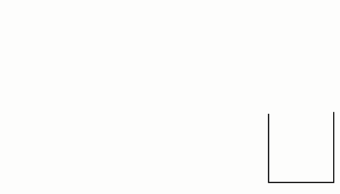
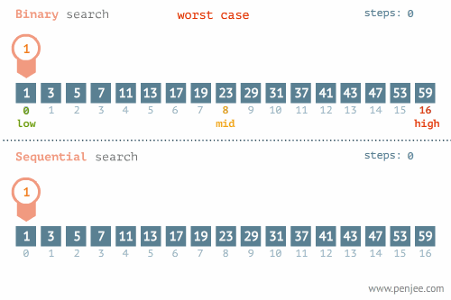

[toc]

# 1. 数据结构

## 1.1 数据结构概述

### 1.1.1 数据结构描述

```python
【1】概述
    1.1) 在工作中，我们为了解决问题，需要将数据保存下来，然后根据数据存储方式设计算法进行处理，根据数据的存储方式我们使用不同的算法处理，而我们现在需要考虑算法解决问题的效率问题，所以需要考虑数据究竟如何保存，这就是数据结构
  
【2】概念
    2.1) 数据是一个抽象的概念，将其进行分类后得到程序设计语言中的基本类型，如：list、tuple等。数据元素之间不是独立的，存在特定的关系，这些关系便是结构。数据结构指数据对象中数据元素之间的关系
    2.2) Python提供了很多现成的数据结构类型，如列表、元组、字典等，无须我们自己去定义，而Python没有定义的，就需要我们自己去定义实现这些数据的组织方式，称为Python扩展数据结构，如：栈、队列等

【3】为什么学习数据结构
   在真正的项目开发中，大部分时间都是从数据库取数据 -> 数据操作和结构化 -> 返回给前端，在数据操作过程中需要合理地抽象，组织、处理数据，如果选用了错误的数据结构，就会造成代码运行低效
```

### 1.1.2 数据结构分类

```python
【1】线性结构 : n个数据元素的有序集合
    1.2) 顺序表 : 将数据结构中各元素按照其逻辑顺序存放于存储器一片连续的存储空间中
    1.3) 链表   : 将数据结构中各元素分布到存储器的不同点，用记录下一个结点位置的方式建立它们之间的联系
    1.4) 栈 : 后进先出
    1.5) 队列 : 先进先出
    
【2】非线性结构
    2.1) 树形结构
    2.2) 图状结构
```

## 1.2 抽象数据类型

```python
【1】定义
    抽象数据类型是指一个数学模型以及定义在此数学模型上的一组操作，及把数据类型和数据类型上的运算捆在一起进行封装。引入抽象数据类型的目的是把数据类型的表示和数据类型上的运算的实现与这些数据类型和运算在程序中的引用隔开，使他们相互独立

【2】描述
    把原有的基本数据和这个数据所支持的操作放到一起，形成一个整体

【3】最常用的数据运算
    3.1) 插入
    3.2) 删除
    3.3) 修改
    3.4) 查找
    3.5) 排序
```

## 1.3 顺序表

**1.3.1 顺序表的基本形式**

```python
【1】特点 : 内存连续
【2】分类
    2.1) 基本形式: 数据元素本身连续存储,每个元素所占存储单元大小固定相同
    2.2) 元素外置: 数据元素不连续存储，地址单元连续存储
```

## 1.4 链表

### 1.4.1 定义

```python
【1】特点:
    1.1) 内存不连续的，而是一个个串起来的，需要每个链表的节点保存一个指向下一个节点的指针
  
【2】和顺序表的对比
    2.1) 顺序表的构建需要预先知道数据大小来申请连续的存储空间，而在进行扩充时又需要进行数据的搬迁，使用起来不灵活，而链表结构可以充分利用计算机的内存空间，实现灵活的内存动态管理
```

**示例 - 强化理解**

```python
将线性表L=(a0,a1,……,an-1)中各元素分布在存储器的不同存储块，称为结点，每个结点（尾节点除外）中都持有一个指向下一个节点的引用，这样所得到的存储结构为链表结构
```


### 1.4.2 单链表代码实现

```python
"""
python实现单链表
"""
class Node:
    """节点类:生成节点的超级工厂"""
    def __init__(self, value):
        self.value = value
        self.next = None

class SingleLinkList:
    """单链表类:数学模型"""
    def __init__(self):
        """初始化一个空链表:头节点为None的链表为空链表"""
        self.head = None

    def is_empty(self):
        """判断是否为空链表"""
        return self.head == None

    def travel(self):
        """遍历整个链表"""
        cur = self.head
        while cur:
            print(cur.value, end=' ')
            cur = cur.next
        # 打印空行
        print()

    def append(self, item):
        """在链表尾部添加一个节点"""
        node = Node(item)
        # 情况1: 空链表情况
        if self.is_empty():
            self.head = node
            return
        # 情况2: 非空链表情况
        cur = self.head
        while cur.next:
            cur = cur.next
        # while循环结束后,cur指向尾节点的位置
        cur.next = node
        node.next = None

    def add(self, item):
        """在链表头部添加一个节点"""
        node = Node(item)
        node.next = self.head
        self.head = node

    def remove(self, item):
        """删除链表中的某个节点"""
        # 定义两个游标
        cur = self.head
        pre = None
        while cur:
            if cur.value != item:
                pre = cur
                cur = cur.next
            else:
                pre.next = cur.next
                break

    def remove_head(self):
        """删除链表头节点"""
        if self.is_empty():
            return

        self.head = self.head.next

if __name__ == '__main__':
    s = SingleLinkList()
    # 终端1: True
    print(s.is_empty())
    # 链表: 100 -> 200 -> 300 -> 400 -> None
    s.add(200)
    s.add(100)
    s.append(300)
    s.append(400)
    # 终端2: 100 200 300 400
    s.travel()
    # 终端3: False
    print(s.is_empty())
    # 链表: 100 -> 200 -> 400 -> None
    s.remove(300)
    # 终端4: 100 200 400
    s.travel()
    # 链表: 200->400->None
    s.remove_head()
    # 终端5: 200 400
    s.travel()
```

### 1.4.3 链表练习

- **题目**

  ```python
  【1】题目描述
      输入一个链表，反转链表后，输出新链表的表头
    
  【2】试题解析
      可以将链表的每一个节点取出来，插入到新的链表表头，同时要保存原链表的下一个节点
  ```

- **代码实现**

  ```python
  """
  输入一个链表，反转链表后，输出新链表的表头
  思路:
      1、创建2个游标,代表要进行反转操作的节点 和 上一个节点
      2、代码逻辑:
         当前节点指针指向上一个节点
         两个游标同时往后移动
         结束标准: 当要操作的节点为None时,结束! 此时pre代表的是新链表的头节点
  """
  class Node:
      def __init__(self, value):
          self.value = value
          self.next = None
  
  class Solution:
      def reverse_link_list(self, head):
          # 1、空链表情况
          if head == None:
              return
          # 2、非空链表情况
          pre = None
          cur = head
          while cur:
              # 记录下一个要操作反转的节点
              next_node = cur.next
              # 反转节点cur,并移动两个游标
              cur.next = pre
              pre = cur
              cur = next_node
  
          return pre.value
  
  if __name__ == '__main__':
      s = Solution()
      # 1、空链表情况
      head = None
      print(s.reverse_link_list(head))
      # 2、只有1个节点情况
      head = Node(100)
      print(s.reverse_link_list(head))
      # 3、有多个节点情况
      head = Node(100)
      head.next = Node(200)
      head.next.next = Node(300)
      print(s.reverse_link_list(head))
  ```

## 1.5 栈（LIFO)

### 1.5.1 定义

```python
栈是限制在一端进行插入操作和删除操作的线性表（俗称堆栈），允许进行操作的一端称为"栈顶"，另一固定端称为"栈底"，当栈中没有元素时称为"空栈"
```

### 1.5.2 特点

```python
【1】栈只能在一端进行数据操作
【2】栈模型具有后进先出的规律（LIFO）
```


### 1.5.3 顺序栈代码实现

```python
"""
顺序存储的方式实现栈
思路：
    1、栈 ：LIFO 后进先出
    2、设计
       列表尾部作为栈顶（入栈、出栈操作）
       列表头部作为栈底（不进行任何操作）
"""
class Stack:
    def __init__(self):
        """初始化一个空栈"""
        self.elems = []

    def is_empty(self):
        """判断栈是否为空栈"""
        return self.elems == []

    def push(self, item):
        """入栈: 相当于在链表尾部添加1个元素"""
        self.elems.append(item)

    def destack(self):
        """出栈: 相当于在列表尾部弹出1个元素"""
        if self.is_empty():
            raise Exception('destack from empty stack')
        return self.elems.pop()

if __name__ == '__main__':
    s = Stack()
    # 栈(栈底->栈顶): 100 200 300
    s.push(100)
    s.push(200)
    s.push(300)
    # 终端1: 300 200 100 异常
    print(s.destack())
    print(s.destack())
    print(s.destack())
    print(s.destack())
```

### 1.5.4 链式栈代码实现

```python
"""
链式存储方式实现栈
思路：
    1、栈：LIFO 后进先出
    2、设计
       链表头部作为栈顶（入栈、出栈操作）
       链表尾部作为栈底（不进行任何操作）
"""
class Node:
    """节点类"""
    def __init__(self, value):
        self.value = value
        self.next = None

class LinkListStack:
    def __init__(self):
        """初始化一个空栈"""
        self.head = None

    def is_empty(self):
        """判断是否为空栈"""
        return self.head == None

    def push(self, item):
        """入栈操作: 相当于在链表的头部添加一个节点"""
        node = Node(item)
        node.next = self.head
        self.head = node

    def pop(self):
        """出栈操作: 相当于删除链表头节点"""
        if self.is_empty():
            raise Exception('pop from empty LinkListStack')
        item = self.head.value
        self.head = self.head.next

        return item

if __name__ == '__main__':
    s = LinkListStack()
    # 栈（栈底->栈顶）：300 200 100
    s.push(100)
    s.push(200)
    s.push(300)
    # 终端1: 300
    print(s.pop())
    # 终端2: False
    print(s.is_empty())
```

## 1.6 队列（FIFO）

### 1.6.1 定义

```python
队列是限制在两端进行插入操作和删除操作的线性表，允许进行存入操作的一端称为"队尾"，允许进行删除操作的一端称为"队头"
```

### 1.6.2 特点

```python
1) 队列只能在队头和队尾进行数据操作
2) 队列模型具有先进先出规律（FIFO）
```


### 1.6.3 顺序队列代码实现

```python
"""
顺序存储方式去实现队列模型
思路：
    1、队列：FIFO 先进先出,队尾负责入队,队头负责出队
    2、设计：
       列表头部作为队头,负责出队
       列表尾部作为队尾,负责入队
"""
class Queue:
    def __init__(self):
        """初始化一个空队列"""
        self.elems = []

    def is_empty(self):
        """判断队列是否为空"""
        return self.elems == []

    def enqueue(self, item):
        """队尾入队: append(item)"""
        self.elems.append(item)

    def dequeue(self):
        """队头出队: pop(0)"""
        if self.is_empty():
            raise Exception('dequeue from empty Queue')
        return self.elems.pop(0)

if __name__ == '__main__':
    q = Queue()
    # 队列: 100 200 300
    q.enqueue(100)
    q.enqueue(200)
    q.enqueue(300)
    # 终端1: 100
    print(q.dequeue())
    # 终端2: False
    print(q.is_empty())
```

### 1.6.4 链式队列代码实现

```python
"""
链式存储方式去实现队列
思路：
    1、队列：FIFO 先进先出
    2、设计：
       链表头部作为队头,负责出队操作
       链表尾部作为队尾,负责入队操作
"""
class Node:
    def __init__(self, value):
        self.value = value
        self.next = None

class LinkListQueue:
    def __init__(self):
        """初始化一个空队列"""
        self.head = None

    def is_empty(self):
        """判断队列是否为空"""
        return self.head == None

    def enqueue(self, item):
        """队尾入队: 相当于在链表尾部添加一个节点"""
        node = Node(item)
        # 空队列情况
        if self.is_empty():
            self.head = node
            return
        # 非空队列
        cur = self.head
        while cur.next:
            cur = cur.next
        # 循环结束后,cur一定是指向了原链表尾节点
        cur.next = node
        node.next = None

    def dequeue(self):
        """队头出队: 相当于删除链表头节点"""
        if self.is_empty():
            raise Exception('dequeue from empty LinkListQueue')
        cur = self.head
        # 删除头节点
        self.head = self.head.next

        return cur.value

if __name__ == '__main__':
    q = LinkListQueue()
    # 队列: 100 200 300
    q.enqueue(100)
    q.enqueue(200)
    q.enqueue(300)
    # 终端1: 100
    print(q.dequeue())
    # 终端2: False
    print(q.is_empty())
```

## 1.7 树形结构

### 1.7.1 定义

```python
树（Tree）是n（n≥0）个节点的有限集合T，它满足两个条件：有且仅有一个特定的称为根（Root）的节点；其余的节点可以分为m（m≥0）个互不相交的有限集合T1、T2、……、Tm，其中每一个集合又是一棵树，并称为其根的子树（Subtree）						
```


### 1.7.2 基本概念

```python
# 1. 树的特点
* 每个节点有零个或者多个子节点
* 没有父节点的节点称为根节点
* 每一个非根节点有且只有一个父节点
* 除了根节点外,每个子节点可以分为多个不相交的子树

# 2. 相关概念
1) 节点的度: 一个节点的子树的个数
2) 树的度: 一棵树中,最大的节点的度成为树的度
3) 叶子节点: 度为0的节点
4) 父节点
5) 子节点
6) 兄弟节点
7) 节点的层次: 从根开始定义起,根为第1层
8) 深度: 树中节点的最大层次
```


## 1.8 二叉树

### 1.8.1 定义

```python
二叉树（Binary Tree）是n（n≥0）个节点的有限集合，它或者是空集（n＝0），或者是由一个根节点以及两棵互不相交的、分别称为左子树和右子树的二叉树组成。二叉树与普通有序树不同，二叉树严格区分左孩子和右孩子，即使只有一个子节点也要区分左右
```


### 1.8.2 二叉树的分类

```python
【1】完全二叉树
    对于一颗二叉树，假设深度为d，除了d层外，其它各层的节点数均已达到最大值，并且第d层所有节点从左向右连续紧密排列

【2】满二叉树
    各层节点均已达到最大值的二叉树
    
【3】二叉排序树('二叉搜索树')
    任何一个节点，所有左边的值都会比此节点小，所有右边的值都会比此节点大
    
【4】平衡二叉树
    当且仅当任何节点的两棵子树的高度差不大于1的二叉树
```

- **二叉树 - 添加元素代码实现**

  ```python
  """
  二叉树
  """
  
  class Node:
      def __init__(self, value):
          self.value = value
          self.left = None
          self.right = None
  
  class Tree:
      def __init__(self, node=None):
          """创建了一棵空树或者是只有树根的树"""
          self.root = node
  
      def add(self, value):
          """在树中添加一个节点"""
          node = Node(value)
          # 空树情况
          if self.root is None:
              self.root = node
              return
  
          # 不是空树的情况
          node_list = [self.root]
          while node_list:
              cur = node_list.pop(0)
              # 判断左孩子
              if cur.left is None:
                  cur.left = node
                  return
              else:
                  node_list.append(cur.left)
  
              # 判断右孩子
              if cur.right is None:
                  cur.right = node
                  return
              else:
                  node_list.append(cur.right)
  ```

### 1.8.3 广度遍历

- **广度遍历 - 代码实现**

  ```python
      def breadth_travel(self):
          """广度遍历 - 队列思想（即：列表的append()方法 和 pop(0) 方法"""
          # 1、空树的情况
          if self.root is None:
              return
          # 2、非空树的情况
          node_list = [self.root]
          while node_list:
              cur = node_list.pop(0)
              print(cur.value, end=' ')
              # 添加左孩子
              if cur.left is not None:
                  node_list.append(cur.left)
              # 添加右孩子
              if cur.right is not None:
                  node_list.append(cur.right)
  
          print()
  ```

### 1.8.4 深度遍历

```python
【1】遍历
    沿某条搜索路径周游二叉树，对树中的每一个节点访问一次且仅访问一次。

【2】遍历方式
    2.1) 前序遍历： 先访问树根，再访问左子树，最后访问右子树 - 根 左 右
    2.2) 中序遍历： 先访问左子树，再访问树根，最后访问右子树 - 左 根 右
    2.3) 后序遍历： 先访问左子树，再访问右子树，最后访问树根 - 左 右 根
```


```python
【1】前序遍历结果: 1 2 4 8 9 5 10 3 6 7
【2】中序遍历结果: 8 4 9 2 10 5 1 6 3 7
【3】后序遍历结果: 8 9 4 10 5 2 6 7 3 1
```

- **深度遍历 - 代码实现**

```python
# 前序遍历
    def pre_travel(self, node):
        """前序遍历 - 根左右"""
        if node is None:
            return

        print(node.value, end=' ')
        self.pre_travel(node.left)
        self.pre_travel(node.right)

# 中序遍历
    def mid_travel(self, node):
        """中序遍历 - 左根右"""
        if node is None:
            return

        self.mid_travel(node.left)
        print(node.value, end=' ')
        self.mid_travel(node.right)

# 后续遍历
    def last_travel(self, node):
        """后序遍历 - 左右根"""
        if node is None:
            return

        self.last_travel(node.left)
        self.last_travel(node.right)
        print(node.value, end=' ')
```

### 1.8.5 二叉树代码实现

```python
"""
python实现二叉树
"""

class Node:
    def __init__(self, value):
        self.value = value
        self.left = None
        self.right = None

class Tree:
    def __init__(self, node=None):
        """创建了一棵空树或者是只有树根的树"""
        self.root = node

    def add(self, value):
        """在树中添加一个节点"""
        node = Node(value)
        # 空树情况
        if self.root is None:
            self.root = node
            return

        # 不是空树的情况
        node_list = [self.root]
        while node_list:
            cur = node_list.pop(0)
            # 判断左孩子
            if cur.left is None:
                cur.left = node
                return
            else:
                node_list.append(cur.left)

            # 判断右孩子
            if cur.right is None:
                cur.right = node
                return
            else:
                node_list.append(cur.right)

    def breadth_travel(self):
        """广度遍历 - 队列思想（即：列表的append()方法 和 pop(0) 方法"""
        # 1、空树的情况
        if self.root is None:
            return
        # 2、非空树的情况
        node_list = [self.root]
        while node_list:
            cur = node_list.pop(0)
            print(cur.value, end=' ')
            # 添加左孩子
            if cur.left is not None:
                node_list.append(cur.left)
            # 添加右孩子
            if cur.right is not None:
                node_list.append(cur.right)

        print()

    def pre_travel(self, node):
        """前序遍历 - 根左右"""
        if node is None:
            return

        print(node.value, end=' ')
        self.pre_travel(node.left)
        self.pre_travel(node.right)

    def mid_travel(self, node):
        """中序遍历 - 左根右"""
        if node is None:
            return

        self.mid_travel(node.left)
        print(node.value, end=' ')
        self.mid_travel(node.right)

    def last_travel(self, node):
        """后序遍历 - 左右根"""
        if node is None:
            return

        self.last_travel(node.left)
        self.last_travel(node.right)
        print(node.value, end=' ')

if __name__ == '__main__':
    tree = Tree()
    tree.add(1)
    tree.add(2)
    tree.add(3)
    tree.add(4)
    tree.add(5)
    tree.add(6)
    tree.add(7)
    tree.add(8)
    tree.add(9)
    tree.add(10)
    # 广度遍历：1 2 3 4 5 6 7 8 9 10
    tree.breadth_travel()
    # 前序遍历：1 2 4 8 9 5 10 3 6 7
    tree.pre_travel(tree.root)
    print()
    # 中序遍历:8 4 9 2 10 5 1 6 3 7
    tree.mid_travel(tree.root)
    print()
    # 后序遍历：8 9 4 10 5 2 6 7 3 1
    tree.last_travel(tree.root)
```


# 2. 算法

## 2.1 递归算法

### 2.1.1 递归定义及特点

```python
【1】定义
    递归用一种通俗的话来说就是自己调用自己，但是需要分解它的参数，让它解决一个更小一点的问题，当问题小到一定规模的时候，需要一个递归出口返回
    
【2】特点
    2.1) 递归必须包含一个基本的出口，否则就会无限递归，最终导致栈溢出
    2.2) 递归必须包含一个可以分解的问题
    2.3) 递归必须必须要向着递归出口靠近
```

### 2.1.2 递归示例

- **递归示例1**

  ```python
  def f(n):
      if n == 0:
          return 
      print(n)
      f(n-1)
  
  f(3)
  # 结果: 3 2 1
  # 调用递归之前的语句,是从外到内执行（递推的过程中依次执行）
  ```

- 


- **递归示例2**

  ```python
  def f(n):
    if n == 0:
      return 
    f(n-1)
    print(n)
    
  f(3)
  # 结果: 1 2 3
  # 调用递归之后的语句，是从内到外执行（是在回归的过程中依次执行）
  ```

  

- **递归示例3**

  ```python
  # 打印 1+2+3+...+n 的和
  def sumn(n):
    if n == 1:
      return 1
    return n + sumn(n-1)
  
  print(sumn(3))
  ```

  

  **递归练习**

  ```python
  # 使用递归求出 n 的阶乘
  def fac(n):
    if n == 1:
      return 1
    return n * fac(n-1)
  
  print(fac(5))
  ```

### 2.1.3 递归总结

```python
# 前三条必须记住
【1】递归一定要有出口,一定是先递推,再回归
【2】调用递归之前的语句，从外到内执行，最终回归
【3】调用递归或之后的语句，从内到外执行，最终回归

【4】Python默认递归深度有限制，当递归深度超过默认值时，就会引发RuntimeError，默认值998
【5】手动设置递归调用深度
    import sys
    sys.setrecursionlimit(1000000) #表示递归深度为100w
```

- **递归动态图解一**

  

- **递归动态图解二**

  

- **递归动态图解三**

  


### 2.1.4 递归练习题

```python
【1】一个青蛙一次可以跳1级台阶或2级台阶,一共有n级台阶,问青蛙跳到顶部有几种跳法
  思路一：举例大法(找规律-斐波那契数列)
         1级台阶：1
         2级台阶：2
         3级台阶：3
         4级台阶：5
         5级台阶：8
         ... ..
  思路二：递归思想(f(n))
        考虑最后一跳,最后一跳跳到顶部共有2种跳法
        最后一跳(1级台阶): f(n-1)
        最后一跳(2级台阶): f(n-2)
        总的跳法的种类：f(n) = f(n-1) + f(n-2)

def f(n):
    # 递归出口
    if n == 1:
        return 1
    if n == 2:
        return 2
    
    return f(n-1) + f(n-2)
```

## 2.2 冒泡排序

### 2.2.1 排序方式

```python
# 排序方式
遍历列表并比较相邻的元素对，如果元素顺序错误，则交换它们。重复遍历列表未排序部分的元素，直到完成列表排序
```


### 2.2.2 代码实现

```python
"""
冒泡排序
3 8 2 5 1 4 6 7
"""
def bubble_sort(li):
    # 代码第2步: 如果不知道循环几次，则举几个示例来判断
    for j in range(0,len(li)-1):
        # 代码第1步: 此代码为一波比对，此段代码一定一直循环，一直比对多次至排序完成
        for i in range(0,len(li)-j-1):
            if li[i] > li[i+1]:
                li[i],li[i+1] = li[i+1],li[i]

    return li

li = [3,8,2,5,1,4,6,7]
print(bubble_sort(li))
```

## 2.3 归并排序

### 2.3.1 排序规则

```python
# 思想
分而治之算法

# 步骤
1) 连续划分未排序列表，直到有N个子列表，其中每个子列表有1个"未排序"元素，N是原始数组中的元素数
2) 重复合并，即一次将两个子列表合并在一起，生成新的排序子列表，直到所有元素完全合并到一个排序数组中
```


### 2.3.2 代码实现

```python
"""
归并排序
"""
def merge_sort(li):
    # 递归出口
    if len(li) == 1:
        return li

    mid = len(li) // 2
    left = li[:mid]
    right = li[mid:]
    # 递归思想
    left_li = merge_sort(left)
    right_li = merge_sort(right)

    return merge(left_li, right_li)

def merge(left_li, right_li):
    result = []
    while left_li and right_li:
        if left_li[0] >= right_li[0]:
            result.append(right_li.pop(0))
        else:
            result.append(left_li.pop(0))

    # 循环结束时,一定有一个列表为空了
    if left_li:
        result.extend(left_li)
    else:
        result.extend(right_li)

    return result

if __name__ == '__main__':
    li = [6,4,5,3,1,66,8,6,7,520,2,4]
    r = merge_sort(li)
    print(r)
```

## 2.4 快速排序

### 2.4.1 排序规则

```python
【1】介绍
    快速排序也是一种分而治之的算法，在大多数标准实现中，它的执行速度明显快于归并排序

【2】排序步骤：
    2.1) 首先选择一个元素，称为数组的基准元素
    2.2) 将所有小于基准元素的元素移动到基准元素的左侧；将所有大于基准元素的移动到基准元素的右侧
    2.3) 递归地将上述两个步骤分别应用于比上一个基准元素值更小和更大的元素的每个子数组
```


### 2.4.2 代码实现

```python
"""
快速排序
    1、left找比基准值大的暂停
    2、right找比基准值小的暂停
    3、交换位置
    4、当right<left时，即为基准值的正确位置，最终进行交换
"""
def quick_sort(li, first, last):
    """快速排序"""
    # 递归出口
    if first > last:
        return

    # position:基准值正确位置下标索引,即:分隔li为左右两部分的值
    position = sort(li, first, last)
    # 递归思想,左右两部分继续执行快速排序
    quick_sort(li, first, position - 1)
    quick_sort(li, position + 1, last)

def sort(li, first, last):
    """
    :param li: 无序的数组
    :param first: 基准值所在位置的下标索引
    :param last: 右游标的索引值
    :return: 基准值正确位置的下标索引
    """
    lcur = first + 1
    rcur = last
    while True:
        # 左游标右移
        while lcur <= rcur and li[lcur] <= li[first]:
            lcur += 1
        # 右游标左移
        while lcur <= rcur and li[rcur] >= li[first]:
            rcur -= 1

        if lcur < rcur:
            # 左右游标互换位置
            li[lcur],li[rcur] = li[rcur], li[lcur]
        else:
            # 右游标和基准值互换位置
            # 右游标就是基准值的正确位置
            li[first], li[rcur] = li[rcur], li[first]
            # 返回了基准值正确位置的下标索引
            return rcur

if __name__ == '__main__':
    li = [6,5,3,1,8,7,2,8,666,6,2,4]
    quick_sort(li, 0, len(li)-1)

    print(li)
```

## 2.5 二分查找

### 2.5.1 定义及规则

```python
【1】定义及优点
	二分查找又称折半查找，优点是比较次数少，查找速度快，平均性能好

【2】查找过程
　　二分查找即搜索过程从数组的中间元素开始,如果中间元素正好是要查找的元素,则搜索过程结束;如果中间元素大于或小于要查找元素,则在小于或大于中间元素的那一半进行搜索,而且跟开始一样从中间元素开始比较. 如果在某一步骤数组为空,则代表找不到.这种算法每一次比较都会使搜索范围缩小一半.

【3】适用条件
	'数组必须有序'
```

- **二分查找图解一**

  

- **二分查找图解二**

  

### 2.5.2 代码实现

```python
"""
python实现二分查找
"""

def binary_search(li, item):
    # 1 2 3 4 5 6 7 8 9 10
    # 查找: 0
    first = 0
    last = len(li) - 1
    while first <= last:
        mid = (first + last) // 2
        if li[mid] > item:
            last = mid - 1
        elif li[mid] < item:
            first = mid + 1
        else:
            return True

    return False

if __name__ == '__main__':
    li = [1,2,3,4,5,6,7,8]
    # 终端1: True
    print(binary_search(li, 3))
  # 终端2: False
    print(binary_search(li, 666))
```


