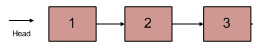
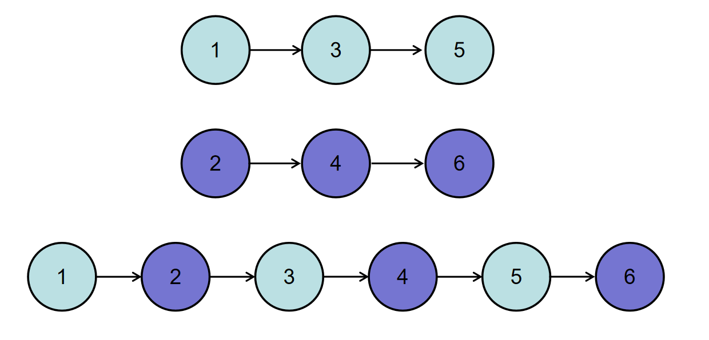

[toc]

# 时间复杂度空间复杂度

## 1 时间复杂度概念引入

1）请完成如下练习题

​	若n1 + n2 + n3=1000，且n1^2 + n2^2 = n3^2 (n1,n2,n3为自然数)，求出所有n1、n2、n3可能的组合

- 算法一实现

  ```python
  import time
  
  start_time = time.time()
  
  for n1 in range(0,1001):
      for n2 in range(0,1001):
          for n3 in range(0,1001):
              if n1 + n2 + n3 == 1000 and n1**2 + n2**2 == n3**2:
                      print(n1, n2, n3)
                      
  end_time = time.time()
  print('执行时间:%.2f' % (end_time-start_time))
  ```

- 算法二实现

  ```python
  import time
  
  start_time = time.time()
  
  for n1 in range(0,1001):
      for n2 in range(0,1001):
          n3 = 1000 - n1 - n2
          if n1**2 + n2**2 == n3**2:
              print(n1, n2, n3)
              
  end_time = time.time()
  print('执行时间:%.2f' % (end_time-start_time))
  ```

2）思考

​	解决同一个问题有多种算法，但是效率不尽相同，那如何衡量算法的效率？

​	执行时间？机器配置不同执行时间不同，不准确

​	运算数量？固定

## 2 算法的时间复杂度定义

​	在进行算法分析时，语句总的执行次数T(n)是关于问题规模n的函数，进而分析T(n)随n的变化情况并确定T(n)的数量级。

​	算法的时间复杂度，也就是算法的时间量度。记作：T(n)=O(f(n))  表示随问题n的增大，算法执行时间的增长率和f(n)的增长率相同，称作算法的渐进时间复杂度，简称为时间复杂度。其中，f(n)是问题规模n的某个函数。

​	这样采用 T(n)=O(f(n)) 来体现算法时间复杂度的记法，称为 大O记法。

## 3 推导大O阶方法

### 2.1 推导规则

- 用常数1取代运行时间中的所有加法常数。
- 在修改后的运行次数函数中，只保留最高阶项。
- 如果最高阶项存在且不是1，则去除与这个项目相乘的常数，得到的结果就是大O阶

### 2.2 大O阶推导

1）推导算法一的时间复杂度：T(n) = O(n^3)

```python
for n1 in range(0,1001):
	for n2 in range(0,1001):
    	for n3 in range(0,1001):
        	if n1 + n2 + n3 == 1000 and n1**2 + n2**2 == n3**2:
                print(n1, n2, n3)
        
# 运行步骤次数：n * n * n * 2  即：2 * n^3
# 大O记法：T(n) = O(n^3)
```

2）推导算法二的时间复杂度：T(n) = O(n^2)

```python
for n1 in range(0,1001):
    for n2 in range(0,1001):
        n3 = 1000 - n1 - n2
        if n1**2 + n2**2 == n3**2:
            print(n1, n2, n3)
            
# 运行步骤次数：n * n * 3  即：
# 大O记法：T(n) = O(n^2)
```

2）说明

​	对算法进行特别具体细致分析虽然好，但实践中实际价值有限。对我们来说算法的时间性质和空间性质最重要的是数量级和趋势，这些是分析算法效率的主要部分。所以要忽略系数，忽略常数，忽略低次幂。比如5*n^2 和 100*n^2属于一个量级，时间复杂度为O(n^2)

## 4 常见时间复杂度

### 4.1 常数阶O(1)

```python
s, n = 100, 500
sumn = (1 + n) * n / 2
print(sumn)
```

这个算法的运行次数函数是 f(n) = 3。根据大O阶方法，第一步将常数项3改为1，当保留最高阶项时发现并没有最高阶项，所以此算法时间复杂度为O(1)

另外，试想一下，如果此算法中的语句 sumn = (1 + n) * n / 2 有20句，则与示例给出的代码就是 3次 和 23次 的区别，与n的多少无关，执行时间恒定的算法我们称之为具有 O(1) 的时间复杂度，叫常数阶。

对于if分支结构而言，无论真假执行的次数都是恒定的，不会随着n的变化而发生变化，所以单纯的if分支结构的时间复杂度也是O(1)

### 4.2 线性阶O(n)

线性阶的循环结构相对复杂，要确定某个算法的阶次，我们常常要确定某个特定语句或某个语句集的运行的次数，因此要分析算法的复杂度，关机爱你是要分析循环结构的运行情况。

```python
for i in range(n):
    print("hello world")
```

如上代码循环的时间复杂度为 O(n)，因为循环体中的代码要执行n次

### 4.3 对数阶O(logn)

```python
# 示例代码一
n = 128
while n > 1:
    print(n)
    n = n // 2
    
# 示例代码二
count = 1
while count < n:
    count = count * 2
```

示例代码二详解：由于每次count * 2之后，就举例n更近了一部分。即有多少个2相乘后大于n就会退出循环。由2^x=n 得到 x=logn，所以此算法的时间复杂度为O(logn) 

### 4.4 平方阶O(n^2)

```python
# 示例代码一
for i in range(n):
    for j in range(n):
        print("hello world")
        
# 示例代码二
for i in range(n):
    print("hello world")
    for j in range(n):
        print("hello world")
```

两层循环，则时间复杂度为 O(n^2)

### 4.5 立方阶O(n^3)

三层循环，则时间复杂度为 O(n^3)

## 5 常见时间复杂度排序

**O(1) < O(logn) < O(n) < O(nlogn) < O(n^2) < O(n^3) < O(2^n)**

## 6 时间复杂度分析法则

1）单段代码看高频：比如循环

2）多段代码取最大：比如一段代码中有单循环和多重循环，则取多重循环的复杂度

3）嵌套代码求乘积：比如递归、多重循环等

- 只关注循环次数最多的一段代码
- 加法法则：总复杂度等于量级最大的那段代码的复杂度
- 乘法法则：嵌套代码的复杂度等于嵌套内外代码复杂度的乘积

## 7 空间复杂度

空间复杂度：用来评估自定义函数或算法内存占用大小，记作：S(n)=O(f(n))

一般情况下，一个程序在机器上执行时，除了需要存储程序本身的指令、常数、变量和输入数据外，还需要存储对数据操作的存储单元，如果输入数据所占空间只取决于问题本身，和算法无关，这样只需要分析算法在实现时所需的辅助单元即可。若算法执行时所需的辅助空间相对于输入数据量是个常数，则成此算法为原地工作，空间复杂度为O(1)。

通常我们使用时间复杂度来指运行时间的需求，使用空间复杂度指空间需求，当不用限定词地使用复杂度时，通常都是指时间复杂度。

### 7.1 空间复杂度O(1)

```python
name = "Python"
description = "Best"
```

### 7.2 空间复杂度O(n)

```python
list01 = [1, 2, 3, ..., n]
```

### 7.3 空间复杂度O(n^2)

```python
list01 = [[1, 2, 3, ..., n], [1, 2, 3, ..., n], ..., [1, 2, 3, ..., n]]
```

### 7.4 空间复杂度计算规则

- 如果代码开了数组，则为数组长度
- 如果有递归，则为递归深度
- 如果有数组有递归，则取最大值

# 数据结构

线性表：线性表就是数据排成一条线一样的结构，每个线性表上的数据最多只有前后两个方向，常见的线性结构有：顺序表、链表、栈、队列。

## 1 顺序表

1）数组是一种线性表数据结构，它用一组连续的存储空间，来存储一组数据。

2）优点：内存连续使的数组随机访问元素效率高。缺点：删除、插入数据效率低。

- 随机访问元素：时间复杂度为O(1)
- 插入：最好O(1) 最坏O(n) 平均O(n)
- 删除：最好O(1) 最坏O(n) 平均O(n)

3）对内存空间要求高，需要一块连续的存储空间

## 2 链表

1）和顺序表一样，也是一种线性表。

2）从内存结构来看，链表的内存结构是不连续的内存空间，是将一组零散的内存块串联起来，从而进行数据存储的数据结构

3）链表中的每个内存块称为节点Node。节点除了存储数据外，还需记录链上下一个节点的地址，即后继指针next

- 随机访问元素：时间复杂度O(n)
- 指定位置插入节点：最好O(1)  最坏O(n) 平均O(n)
- 删除指定节点：最好O(1)  最坏O(n)  平均O(n)

### 2.1 链表分类

- 单链表

  1）每个节点只包含一个指针，即：后继指针

  2）单链表有两个特殊节点，即首节点和尾节点。首节点地址表示整条链表，尾节点的后继指针指向空地址null

- 单向循环链表

  1）除了尾节点的后继指针指向首节点的地址外，均与单链表一致

- 双链表

  1）节点除了存储数据外，还有两个指针分别指向前一个节点地址（前驱指针prev）和下一个节点地址（后继指针next）。

  2）首节点的前驱指针prev和尾节点的后继指针next均指向空地址

  3）性能特点

  ​	和单链表相比，存储相同的数据，需要消耗更多的存储空间。

  ​	插入、删除操作比单链表效率更高。以删除操作为例，删除操作分为两种情况，给定数据值删除对应节点 和 给定节点地址删除对应节点，对于前一种情况单链表和双向链表都需要从头到尾遍历而找到对应节点进行删除，时间复杂度都为O(n)；但是对于第二种情况，要进行删除操作必须找到前驱节点，单链表需要从头到尾遍历然后进行删除，时间复杂度为O(n)，而双向链表可以直接找到前驱节点，时间复杂度为O(1)

- 双向循环链表

  首节点的前驱指针指向尾节点，尾节点的后继指针指向首节点。

## 3 堆栈

1）栈是一种抽象的数据结构，具有后进先出（LIFO）的特性，栈顶负责入栈和出栈，栈底不进行任何操作。

2）栈可以用数组来实现，也可以使用链表来实现。用数组实现的栈叫做顺序栈，用链表实现的栈叫做链式栈。

## 4 队列

1）队列是一种抽象的数据结构，具有先进先出（FIFO）的特性，支持在队尾插入元素，在队头删除元素。

2）队列可以用数组来实现，也可以使用链表来实现。用数组实现的栈叫做顺序队列，用链表实现的栈叫做链式队列。

# 数据结构与算法刷题

## 1. 从尾到头打印链表

- 输入一个链表的头节点，按链表从尾到头的顺序返回每个节点的值（用数组返回）

  如输入{1,2,3}的链表如下图:
  
  
  
  返回一个数组为 [3, 2, 1]

  0 <= 链表长度 <= 10000
  
  - ```text
    输入：{1,2,3}
    返回值：[3,2,1]
    ```
    
  - ```text
    输入：{67,0,24,58}
    返回值：[58,24,0,67]
    ```
    
  
  答案
  
  ```python
  class Solution:
      def printListFromTailToHead(self , listNode: ListNode) -> List[int]:
          # write code here
          pass
  ```
  
  ```python
  class ListNode:
      def __init__(self, x):
          self.val = x
          self.next = None
          
  class Solution:
      def printListFromTailToHead(self , listNode: ListNode) -> List[int]:
          # write code here
          result_array = []
          
          if not listNode:
              return []
          
          while listNode:
              result_array.append(listNode.val)
              listNode = listNode.next
              
          return result_array[::-1]
  ```

## 2. 两个链表的第一个公共节点

- 输入两个单向链表，找出它们的第一个公共结点，如果没有公共节点则返回空。（注意因为传入数据是链表，所以错误测试数据的提示是用其他方式显示的，保证传入数据是正确的）

  例如：输入{1,2,3},{4,5},{6,7}时，两个无环的单向链表的结构如下图所示：

  

  可以看到它们的第一个公共结点的结点值为6，所以返回结点值为6的结点。

  **输入描述：**输入分为是3段，第一段是第一个链表的非公共部分，第二段是第二个链表的非公共部分，第三段是第一个链表和第二个链表的公共部分。 后台会将这3个参数组装为两个链表，并将这两个链表对应的头节点传入到函数FindFirstCommonNode里面，用户得到的输入只有pHead1和pHead2。

  **返回值描述：**返回传入的pHead1和pHead2的第一个公共结点，后台会打印以该节点为头节点的链表。

  - ```text
    输入：{1,2,3},{4,5},{6,7}
    返回值：{6,7}
    说明：第一个参数{1,2,3}代表是第一个链表非公共部分，第二个参数{4,5}代表是第二个链表非公共部分，最后的{6,7}表示的是2个链表的公共部分
    这3个参数最后在后台会组装成为2个两个无环的单链表，且是有公共节点的 
    ```

  - ```text
    输入：{1},{2,3},{}
    返回值：{}
    说明：2个链表没有公共节点 ,返回null，后台打印{}
    ```

  答案：

  ```python
  class Solution:
      def FindFirstCommonNode(self , pHead1 , pHead2 ):
          # write code here
          pass
  ```

  ```python
  class ListNode:
      def __init__(self, x):
          self.val = x
          self.next = None
  
  class Solution:
      def FindFirstCommonNode(self , pHead1 , pHead2 ):
          # write code here
          # 使用栈的思想：append() + pop()
          stack1 = []
          stack2 = []
          
          while pHead1:
              stack1.append(pHead1)
              pHead1 = pHead1.next 
              
          while pHead2:
              stack2.append(pHead2)
              pHead2 = pHead2.next
              
          node = None
          # 从两个栈顶开始，依次比较，找到最后一个相等的节点
          while stack1 and stack2 and stack1[-1] is stack2[-1]:
              node = stack1.pop()
              stack2.pop() 
              
          return node
  ```

## 3.  链表中倒数最后k个结点

- 输入一个长度为 n 的链表，设链表中的元素的值为 int ，返回该链表中倒数第k个节点。如果该链表长度小于k，请返回一个长度为 0 的链表

  例如输入{1,2,3,4,5},2时，对应的链表结构如下图所示：

  

  其中蓝色部分为该链表的最后2个结点，所以返回倒数第2个结点（也即结点值为4的结点）即可，系统会打印后面所有的节点来比较

  - ```text
    输入：{1,2,3,4,5},2
    返回值：{4,5}
    说明：返回倒数第2个节点4，系统会打印后面所有的节点来比较。 
    ```

  - ```text
    输入：{2},8
    返回值：{}
    ```

  答案：

  ```python
  class Solution:
      def FindKthToTail(self , pHead: ListNode, k: int) -> ListNode:
          # write code here
          pass
  ```

  ```python
  class ListNode:
      def __init__(self, x):
          self.val = x
          self.next = None
          
  class Solution:
      def FindKthToTail(self , pHead: ListNode, k: int) -> ListNode:
          # write code here
          # 此方法空间复杂度为O(n)
  #         nodeList = []
  #         while pHead:
  #             nodeList.append(pHead)
  #             pHead = pHead.next
              
  #         if len(nodeList) >= k:
  #             return nodeList[-k]
          
  #         return None
          
          # 此方法空间复杂度为O(1)
          if not pHead:
              return None
          
          count = 0
          cursor = pHead
          while cursor:
              cursor = cursor.next
              count += 1
              
          # 由倒数第k个算出正数第length个
          length = count - k
          # 说明k的值大于了链表中节点的数量
          if length < 0:
              return None
          
          # 定位正数第length个节点
          while length:
              pHead = pHead.next
              length -= 1
              
          return pHead
  ```

## 4. 删除链表重复的节点

- 在一个排序的链表中，存在重复的结点，请删除该链表中重复的结点，重复的结点不保留，返回链表头指针。 例如，链表 1->2->3->3->4->4->5 处理后为 1->2->5

  例如输入{1,2,3,3,4,4,5}时，对应的输出为{1,2,5}，对应的输入输出链表如下图所示：

  

  - ```text
    输入：{1,2,3,3,4,4,5}
    返回值：{1,2,5}
    ```

  - ```text
    输入：{1,1,1,8}
    返回值：{8}
    ```

  答案：

  ```python
  class Solution:
      def deleteDuplication(self , pHead: ListNode) -> ListNode:
          # write code here
          pass
  ```

  ```python
  class ListNode:
      def __init__(self, x):
          self.val = x
          self.next = None
  
  class Solution:
      def deleteDuplication(self , pHead: ListNode) -> ListNode:
          # write code here
          # 如果是空链表，则返回None
          if not pHead:
              return None
          
          # 非空链表，创建两个指针
          cur = pHead
          pre = ListNode(pHead.val - 1)
          pre.next = cur
          
          while cur and cur.next:
              # 如果当前节点和下一个节点值不等，则直接向后移动两个指针
              if cur.val != cur.next.val:
                  pre = pre.next
                  cur = cur.next
              else:
                  # 如果相等，则循环删除此节点和继续判断下一个节点
                  while cur and cur.next and cur.val == cur.next.val:
                      # 删除和当前节点重复的下一个节点
                      temp = cur.next
                      cur.next = temp.next
                      del temp 
                  
                  # 考虑前几个节点重复的情况
                  temp = cur
                  if cur == pHead:
                      pHead = pHead.next
                      pre = cur
                      
                   # 删除当前节点
                  pre.next = cur.next
                  cur = cur.next
                  
          return pHead
  ```

### 4.1 删除链表中重复的节点，重复的节点保留一个

```python
class ListNode:
    def __init__(self, x):
        self.val = x
        self.next = None


class Solution:
    def deleteRepeatNode(self, pHead):

        cur = pHead
        while cur and cur.next:
            if cur.val == cur.next.val:
                cur.next = cur.next.next
            else:
                cur = cur.next

        return pHead


if __name__ == '__main__':
    s = Solution()
    # 链表：100 -> 200 -> 200 -> 200 -> 400 -> 600 -> None
    pHead = ListNode(100)
    pHead.next = ListNode(100)
    pHead.next.next = ListNode(100)
    pHead.next.next.next = ListNode(200)
    pHead.next.next.next.next = ListNode(600)
    pHead.next.next.next.next.next = ListNode(600)

    # 调用方法：返回头节点 Node(100)
    new_head = s.deleteRepeatNode(pHead)
    while new_head:
        print(new_head.val, end=" ")
        new_head = new_head.next
```

## 5. 反转链表

- 给定一个单链表的头结点pHead(该头节点是有值的)，长度为n，反转该链表后，返回新链表的表头。

  如当输入链表{1,2,3}时，

  经反转后，原链表变为{3,2,1}，所以对应的输出为{3,2,1}。

  以上转换过程如下图所示：

  

  - ```text
    输入：{1,2,3}
    返回值：{3,2,1}
    ```
  
  - ```text
    输入：{}
    返回值：{}
    ```
  
  答案：

  ```python
  class Solution:
      def ReverseList(self , head: ListNode) -> ListNode:
          # write code here
          pass
  ```
  
  ```python
  class ListNode:
      def __init__(self, x):
          self.val = x
          self.next = None
          
  class Solution:
      def ReverseList(self , head: ListNode) -> ListNode:
          # write code here
          # pre:记录要反转节点的前一个节点
          # cur：要反转的节点
          if not head:
              return 
          
          pre = None
          cur = head
          
          while cur:
              # 记录下一个要反转的节点
              next_node = cur.next
              # 反转节点
              cur.next = pre
              # 移动两个游标
              pre = cur
              cur = next_node
              
          return pre
  ```

## 6. 合并两个排序的链表

- 输入两个递增的链表，单个链表的长度为n，合并这两个链表并使新链表中的节点仍然是递增排序的。

  如输入{1,3,5},{2,4,6}时，合并后的链表为{1,2,3,4,5,6}，所以对应的输出为{1,2,3,4,5,6}，转换过程如下图所示：

  

  或输入{-1,2,4},{1,3,4}时，合并后的链表为{-1,1,2,3,4,4}，所以对应的输出为{-1,1,2,3,4,4}，转换过程如下图所示：

  

  - ```text
    输入：{1,3,5},{2,4,6}
    返回值：{1,2,3,4,5,6}
    ```
  
  - ```text
    输入：{},{}
    返回值：{}
    ```
  
  - ```text
    输入：{-1,2,4},{1,3,4}
    返回值：{-1,1,2,3,4,4}
    ```
  
  答案：

  ```python
  class Solution:
      def Merge(self , pHead1: ListNode, pHead2: ListNode) -> ListNode:
          # write code here
          pass
  ```
  
  ```python
  class ListNode:
      def __init__(self, x):
          self.val = x
          self.next = None
  
  
  class Solution:
      def ReverseLinkList(self, pHead1, pHead2):
          pnew_head = ListNode(-1)
          pnew_cur = pnew_head
  
          # 开始合并
          while pHead1 and pHead2:
              if pHead1.val <= pHead2.val:
                  pnew_cur.next = pHead1
                  pHead1 = pHead1.next
              else:
                  pnew_cur.next = pHead2
                  pHead2 = pHead2.next
  
              pnew_cur = pnew_cur.next
  
          # 循环结束，一定有一个链表为None，合并另一个链表剩余节点
          if pHead1:
              pnew_cur.next = pHead1
          else:
              pnew_cur.next = pHead2
  
          return pnew_head.next
  
  
  if __name__ == '__main__':
      s = Solution()
      # 链表：100 -> 200 -> 200 -> 200 -> 400 -> 600 -> None
      pHead1 = ListNode(100)
      pHead1.next = ListNode(200)
      pHead1.next.next = ListNode(300)
      pHead2 = ListNode(1)
      pHead2.next = ListNode(200)
      pHead2.next.next = ListNode(600)
      pHead2.next.next.next = ListNode(600)
  
      # 调用方法：返回头节点 Node(100)
      new_head = s.ReverseLinkList(pHead1, pHead2)
      # print(new_head.val)
      while new_head:
          print(new_head.val, end=" ")
          new_head = new_head.next
  ```

## 7. 删除链表的节点

- 给定单向链表的头指针和一个要删除的节点的值，定义一个函数删除该节点。返回删除后的链表的头节点

  题目保证链表中节点的值互不相同

  - ```text
    输入：{2,5,1,9},5
    返回值：{2,1,9}
    说明：给定你链表中值为 5 的第二个节点，那么在调用了你的函数之后，该链表应变为 2 -> 1 -> 9
    ```

  - ```text
    输入：{2,5,1,9},1
    返回值：{2,5,9}
    说明：给定你链表中值为 1 的第三个节点，那么在调用了你的函数之后，该链表应变为 2 -> 5 -> 9
    ```

  答案：

  ```python
  class Solution:
      def deleteNode(self , head: ListNode, val: int) -> ListNode:
          # write code here
          pass
  ```

  ```python
  class ListNode:
      def __init__(self, x):
          self.val = x
          self.next = None
  
  
  class Solution:
      def deleteNode(self, head: ListNode, val: int) -> ListNode:
          # write code here
  
          if not head:
              return None
  
          if head.val == val:
              return head.next
  
          temp = head
          while temp.next:
              if temp.next.val == val:
                  temp.next = temp.next.next
                  return head
              else:
                  temp = temp.next
  
  
  if __name__ == '__main__':
      s = Solution()
      # 链表：100 -> 200 -> 200 -> 200 -> 400 -> 600 -> None
      pHead = ListNode(100)
      pHead.next = ListNode(200)
      pHead.next.next = ListNode(300)
      pHead.next.next.next = ListNode(400)
      pHead.next.next.next.next = ListNode(500)
      pHead.next.next.next.next.next = ListNode(600)
  
      # 调用方法：返回头节点 Node(100)
      new_head = s.deleteNode(pHead, 400)
      while new_head:
          print(new_head.val, end=" ")
          new_head = new_head.next
  ```

## 8. 二叉搜索树的第k个节点

- 给定一棵结点数为n 二叉搜索树，请找出其中的第 k 小的TreeNode结点值。

  1.返回第k小的节点值即可

  2.不能查找的情况，如二叉树为空，则返回-1，或者k大于n等等，也返回-1

  3.保证n个节点的值不一样

  如输入{5,3,7,2,4,6,8},3时，二叉树{5,3,7,2,4,6,8}如下图所示：

  

  该二叉树所有节点按结点值升序排列后可得[2,3,4,5,6,7,8]，所以第3个结点的结点值为4，故返回对应结点值为4的结点即可。

  - ```text
    输入：{5,3,7,2,4,6,8},3
    返回值：4
    ```

  - ```text
    输入：{},1
    返回值：-1
    ```

  答案：

  ```python
  class Solution:
      def MidTravel(self, proot):
          # write code here
          pass
  ```

  ```python
  class TreeNode:
      def __init__(self, x):
          self.val = x
          self.left = None
          self.right = None
  
  
  class Solution:
      def MidTravel(self, proot):
          if not proot:
              return
  
          self.MidTravel(proot.left)
          result_array.append(proot.val)
          self.MidTravel(proot.right)
  
      def KthNode(self, proot: TreeNode, k: int) -> int:
          # write code here
          # 解题思路：二叉搜索树的定义就是：若它的左子树不空，则左子树上所有结点的值均小于它的根结点的值； 若它的右子树不空，则右子树上所有结点的值均大于它的根结点的值； 它的左、右子树也分别为二叉搜索树
  
          global result_array
          result_array = []
          self.MidTravel(proot)
  
          if not proot or k <= 0 or k > len(result_array):
              return -1
  
          return result_array[k - 1]
  
  
  if __name__ == '__main__':
      proot = TreeNode(5)
      node3 = TreeNode(3)
      node7 = TreeNode(7)
      node2 = TreeNode(2)
      node4 = TreeNode(4)
      node6 = TreeNode(6)
      node8 = TreeNode(8)
      proot.left = node3
      proot.right = node7
      node3.left = node2
      node3.right = node4
      node7.left = node6
      node7.right = node8
  
      s = Solution()
      result = s.KthNode(proot, 2)
      print(result)
  ```

## 9. 二叉树的镜像

- 操作给定的二叉树，将其变换为源二叉树的镜像。

  比如：

  源二叉树

  

  镜像二叉树

  

  - ```text
    输入：{8,6,10,5,7,9,11}
    返回值：{8,10,6,11,9,7,5}
    ```

  - ```text
    输入：{}
    返回值：{}
    ```

  答案：

  ```python
  class Solution:
      def Mirror(self , pRoot: TreeNode) -> TreeNode:
          # write code here
          pass
  ```

  ```python
  class TreeNode:
      def __init__(self, x):
          self.val = x
          self.left = None
          self.right = None
  
  
  class Solution:
      def Mirror(self, pRoot: TreeNode) -> TreeNode:
          # write code here
          if not pRoot:
              return None
  
          pRoot.left, pRoot.right = pRoot.right, pRoot.left
          # 递归处理左子树
          self.Mirror(pRoot.right)
          # 递归处理右子树
          self.Mirror(pRoot.left)
  
          return pRoot
  
  
  if __name__ == '__main__':
      proot = TreeNode(5)
      node3 = TreeNode(3)
      node7 = TreeNode(7)
      node2 = TreeNode(2)
      node4 = TreeNode(4)
      node6 = TreeNode(6)
      node8 = TreeNode(8)
      proot.left = node3
      proot.right = node7
      node3.left = node2
      node3.right = node4
      node7.left = node6
      node7.right = node8
  
      s = Solution()
      result = s.Mirror(proot)
      print(result.val)
      # 前序遍历
      def pre_travel(proot):
          if not proot:
              return
          print(proot.val, end=" ")
          pre_travel(proot.left)
          pre_travel(proot.right)
  
      # 前序：5 7 8 6 3 4 2
      pre_travel(proot)
  ```

## 10. 按之字形顺序打印二叉树

- 给定一个二叉树，返回该二叉树的之字形层序遍历，（第一层从左向右，下一层从右向左，一直这样交替）

  例如：给定的二叉树是{1,2,3,#,#,4,5}

  

  该二叉树之字形层序遍历的结果是:

  [

  [1],

  [3,2],

  [4,5]

  ]

  - ```text
    输入：{8,6,10,5,7,9,11}
    返回值：[[8],[10,6],[5,7,9,11]]
    ```

  - ```text
    输入：{1,2,3,4,5}
    返回值：[[1],[3,2],[4,5]]
    ```

  答案：

  ```python
  class Solution:
      def Print(self , pRoot: TreeNode) -> List[List[int]]:
          # write code here
          pass
  ```

  ```python
  import collections
  
  
  class TreeNode:
      def __init__(self, x):
          self.val = x
          self.left = None
          self.right = None
  
  
  class Solution:
      def Print(self, pRoot):
          # write code here
          if not pRoot:
              return []
  
          # result：用于存储最终结果的二维数组
          result = []
          # 双端队列一，打印节点：deque([<nc_tools.TreeNode object at 0x7f820951ff10>])
          # 一直从尾部添加即可，头部弹出即可
          double_queue = collections.deque([pRoot])
  
          while double_queue:
              # tmp：每一层一个双端队列，添加的顺序取决于奇数层还是偶数层
              # while循环走一次，需要将当前层添加到数组中完成
              tmp = collections.deque()
  
              # 一个for循环结束打印一层节点
              for i in range(len(double_queue)):
                  node = double_queue.popleft()
                  # 余数为1,添加偶数层,在头部添加
                  if len(result) % 2:
                      tmp.appendleft(node.val)
                  # 余数为0,添加奇数层,在尾部添加
                  else:
                      tmp.append(node.val)
  
                  if node.left:
                      double_queue.append(node.left)
  
                  if node.right:
                      double_queue.append(node.right)
  
              result.append(list(tmp))
  
          return result
  
  
  if __name__ == '__main__':
      pRoot = TreeNode(5)
      node3 = TreeNode(3)
      node7 = TreeNode(7)
      node2 = TreeNode(2)
      node4 = TreeNode(4)
      node6 = TreeNode(6)
      node8 = TreeNode(8)
      pRoot.left = node3
      pRoot.right = node7
      node3.left = node2
      node3.right = node4
      node7.left = node6
      node7.right = node8
  
      s = Solution()
      result = s.Print(pRoot)
      print(result)
  ```

## 11. 数字在升序数组中出现的次数

- 给定一个长度为 n 的非降序数组和一个非负数整数 k ，要求统计 k 在数组中出现的次数

  - ```text
    输入：[1,2,3,3,3,3,4,5],3
    返回值：4
    ```

  - ```text
    输入：[1,3,4,5],6
    返回值：0
    ```

  答案：

  ```python
  class Solution:
      def find_k(self, data, k):
          # write code here
          pass
  ```

  ```python
  class Solution:
      def find_k(self, data, k):
          left_index = 0
          right_index = len(data) - 1
          while left_index <= right_index:
              mid = (left_index + right_index) // 2
              if data[mid] < k:
                  left_index = mid + 1
              if data[mid] > k:
                  right_index = mid - 1
  
          return right_index
  
      def GetNumberOfK(self, data, k):
          if not data:
              return 0
  
          return self.find_k(data, k+0.5) - self.find_k(data, k-0.5)
  
  
  if __name__ == '__main__':
      s = Solution()
      li = [1, 2, 3, 3, 3, 3, 3, 4, 5]
      nums = s.GetNumberOfK(li, 3)
      print(nums)
  ```

## 12. 二叉树的深度

- 输入一棵二叉树，求该树的深度。从根结点到叶结点依次经过的结点（含根、叶结点）形成树的一条路径，最长路径的长度为树的深度，根节点的深度视为 1 。

  假如输入的用例为{1,2,3,4,5,#,6,#,#,7}，那么如下图:

  

  - ```text
    输入：{1,2,3,4,5,#,6,#,#,7}
    返回值：4
    ```
  
  - ```text
    输入：{}
    返回值：0
    ```
  
  答案：

  ```python
  class Solution:
      def TreeDepth(self , pRoot: TreeNode) -> int:
          # write code here
          pass
  ```
  
  ```python
  class TreeNode:
      def __init__(self, x):
          self.val = x
          self.left = None
          self.right = None
  
  
  class Solution:
      def TreeDepth(self, pRoot):
          # write code here
          # 此函数最终返回值为树的深度
          if not pRoot:
              return 0
  
          # 递归思想,获取左子树深度和右子树深度,取最大值
          left_depth = self.TreeDepth(pRoot.left)
          right_depth = self.TreeDepth(pRoot.right)
  
          # 可能存在左右孩子有其中一个不存在的情况
          tree_depth = max(left_depth, right_depth) + 1
  
          return tree_depth
  
  
  if __name__ == '__main__':
      pRoot = TreeNode(5)
      node3 = TreeNode(3)
      node7 = TreeNode(7)
      node2 = TreeNode(2)
      node4 = TreeNode(4)
      node6 = TreeNode(6)
      node8 = TreeNode(8)
      pRoot.left = node3
      pRoot.right = node7
      node3.left = node2
      node3.right = node4
      node7.left = node6
      node7.right = node8
  
      s = Solution()
      result = s.TreeDepth(pRoot)
      print(result)
  ```

## 13. 二叉搜索树的后序遍历序列

- 输入一个整数数组，判断该数组是不是某二叉搜索树的后序遍历的结果。如果是则返回 true ,否则返回 false 。假设输入的数组的任意两个数字都互不相同。

  提示：

  1.二叉搜索树是指父亲节点大于左子树中的全部节点，但是小于右子树中的全部节点的树。

  2.该题我们约定空树不是二叉搜索树

  3.后序遍历是指按照 “左子树-右子树-根节点” 的顺序遍历

  4.参考下面的二叉搜索树，示例 1

  

  - ```text
    输入：[1,3,2]
    返回值：true
    说明：是上图的后序遍历 ，返回true
    ```

  - ```text
    输入：[3,1,2]
    返回值：false
    说明：不属于上图的后序遍历，从另外的二叉搜索树也不能后序遍历出该序列 ，因为最后的2一定是根节点，前面一定是孩子节点，可能是左孩子，右孩子，根节点，也可能是全左孩子，根节点，也可能是全右孩子，根节点，但是[3,1,2]的组合都不能满足这些情况，故返回false
    ```

  答案：

  ```python
  class Solution:
      def VerifySquenceOfBST(self , sequence: List[int]) -> bool:
          # write code here
          pass
  ```

  ```python
  class TreeNode:
      def __init__(self, x):
          self.val = x
          self.left = None
          self.right = None
  
  
  class Solution:
      def VerifySquenceOfBST(self, sequence):
          # write code here
          # 思路：
          # 1. 后序遍历，数组最后一个元素是根节点
          # 2. 后序遍历结果：[左子树的值、右子树的值、根]，左子树的值都小于root，右子树的值都大于root
          # 3. 从数组左侧向右找，找到比root大的位置，将左右子树的值区分开，再用递归完成下一子规模查找
          if not sequence:
              return False
  
          # 获取到根节点的值
          root_val = sequence.pop()
  
          left_tree = []
          right_tree = []
  
          # 将左右子树分别放到一个列表中
          for i in range(len(sequence)):
              if sequence[i] < root_val:
                  left_tree.append(sequence[i])
              else:
                  right_tree.extend(sequence[i:])
                  break
  
          # 右子树的值都比root节点大
          for item_val in right_tree:
              if item_val < root_val:
                  return False
  
          # 将左右子树再按照相同的方式进行处理：递归思想
          if not left_tree:
              # 只有右子树的情况
              is_left = True
          else:
              is_left = self.VerifySquenceOfBST(left_tree)
  
          if not right_tree:
              # 只有左子树的情况
              is_right = True
          else:
              is_right = self.VerifySquenceOfBST(right_tree)
  
          return is_left and is_right
  
  
  if __name__ == '__main__':
  	s = Solution()
      result = s.VerifySquenceOfBST([2,4,3,6,8,7,5])
      print(result)
  ```

## 14. 从上往下打印二叉树

- 不分行从上往下打印出二叉树的每个节点，同层节点从左至右打印。例如输入{8,6,10,#,#,2,1}，如以下图中的示例二叉树，则依次打印8,6,10,2,1(空节点不打印，跳过)，请你将打印的结果存放到一个数组里面，返回。

  

  - ```text
    输入：{8,6,10,#,#,2,1}
    返回值：[8,6,10,2,1]
    ```

  - ```text
    输入：{5,4,#,3,#,2,#,1}
    返回值：[5,4,3,2,1]
    ```

  答案：

  ```python
  class Solution:
      def PrintFromTopToBottom(self , root: TreeNode) -> List[int]:
          # write code here
          pass
  ```

  ```python
  class TreeNode:
      def __init__(self, x):
          self.val = x
          self.left = None
          self.right = None
  
  
  class Solution:
      def PrintFromTopToBottom(self, root):
          # write code here
          result_array = []
  
          if not root:
              return result_array
  
          queue = [root]
  
          while queue:
              node = queue.pop(0)
              result_array.append(node.val)
  
              if node.left:
                  queue.append(node.left)
  
              if node.right:
                  queue.append(node.right)
  
          return result_array
  
  
  if __name__ == '__main__':
      pRoot = TreeNode(5)
      node3 = TreeNode(3)
      node7 = TreeNode(7)
      node2 = TreeNode(2)
      node4 = TreeNode(4)
      node6 = TreeNode(6)
      node8 = TreeNode(8)
      pRoot.left = node3
      pRoot.right = node7
      node3.left = node2
      node3.right = node4
      node7.left = node6
      node7.right = node8
  
      s = Solution()
      result = s.PrintFromTopToBottom(pRoot)
      print(result)
  ```

## 15. 二叉搜索树与双向链表

- 输入一棵二叉搜索树，将该二叉搜索树转换成一个排序的双向链表，如下图所示：

  

  注意：

  ​	1.要求不能创建任何新的结点，只能调整树中结点指针的指向。当转化完成以后，树中节点的左指针需要指向前驱，树中节点的右指针需要指向后继
  ​	2.返回链表中的第一个节点的指针
  ​	3.函数返回的TreeNode，有左右指针，其实可以看成一个双向链表的数据结构

  输入描述：二叉树的根节点

  返回值描述：双向链表的其中一个头节点

  - ```text
    输入：{10,6,14,4,8,12,16}
    返回值：From left to right are:4,6,8,10,12,14,16;From right to left are:16,14,12,10,8,6,4;
    说明：输入题面图中二叉树，输出的时候将双向链表的头节点返回即可
    ```

  - ```text
    输入：{5,4,#,3,#,2,#,1}
    返回值：From left to right are:1,2,3,4,5;From right to left are:5,4,3,2,1;
    说明：
                        5
                      /
                    4
                  /
                3
              /
            2
          /
        1
    树的形状如上图   
    ```

  答案：

  ```python
  class Solution:
      def Convert(self, pRootOfTree):
          # write code here
          pass
  ```

  ```python
  class TreeNode:
      def __init__(self, x):
          self.val = x
          self.left = None
          self.right = None
  
  
  class Solution:
      def inner_travel(self, root):
          if root is None:
              return
  
          self.inner_travel(root.left)
          result_array.append(root)
          self.inner_travel(root.right)
  
      def Convert(self, pRootOfTree):
          # write code here
          if not pRootOfTree:
              return None
          
          global result_array
          result_array = []
          self.inner_travel(pRootOfTree)
  
          if len(result_array) == 0:
              return None
          
          if len(result_array) == 1:
              return pRootOfTree
  
          # 先把头节点和尾节点搞定
          result_array[0].left = None
          result_array[0].right = result_array[1]
          result_array[-1].left = result_array[-2]
          result_array[-1].right = None
          # 搞定中间节点
          for i in range(1, len(result_array) - 1):
              result_array[i].left = result_array[i - 1]
              result_array[i].right = result_array[i + 1]
  
          return result_array[0]
  
  
  if __name__ == '__main__':
      pRoot = TreeNode(5)
      node3 = TreeNode(3)
      node7 = TreeNode(7)
      node2 = TreeNode(2)
      node4 = TreeNode(4)
      node6 = TreeNode(6)
      node8 = TreeNode(8)
      pRoot.left = node3
      pRoot.right = node7
      node3.left = node2
      node3.right = node4
      node7.left = node6
      node7.right = node8
  
      s = Solution()
      result = s.Convert(pRoot)
      print(result.val)
      while result:
          print(result.val, end=" ")
          result = result.right
  ```

## 16. 不用加减乘除做加法

- 求1+2+3+...+n，要求不能使用乘除法、for、while、if、else、switch、case等关键字及条件判断语句（A?B:C）。
  
  - ```text
    输入：1,2
    返回值：3
    ```
  
  - ```text
    输入：0,0
    返回值：0
    ```
  
  答案：
  
  ```python
  class Solution:
      def Sum_Solution(self , n: int) -> int:
          # write code here
          pass
  ```
  
  ```python
  class Solution:
      def Sum_Solution(self , n: int) -> int:
          # write code here、
          # 利用sum()函数和range()函数
          return sum(list(range(1, n+1)))
  ```


