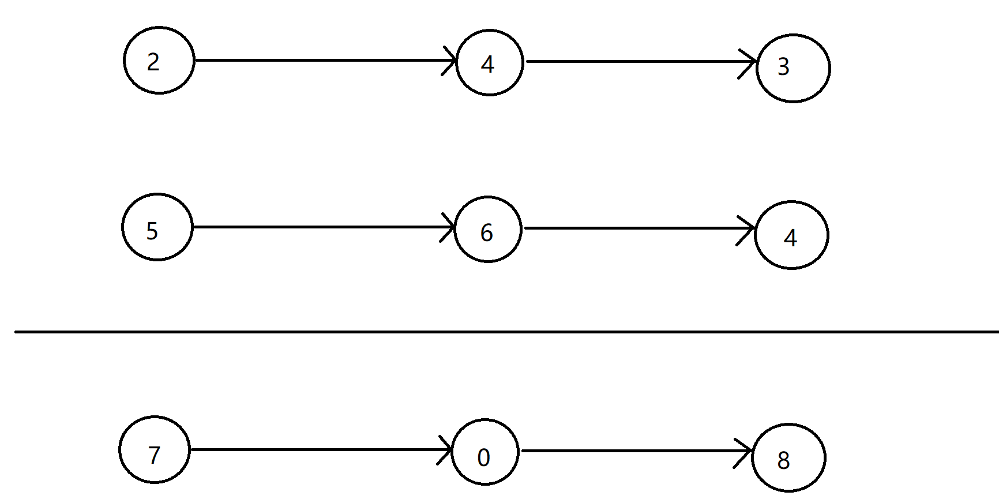

[toc]

##### 1. 两个数的和

- 给定一个整数数组 nums 和一个整数目标值 target，请你在该数组中找出 和为目标值 target  的那 两个 整数，并返回它们的数组下标。你可以假设每种输入只会对应一个答案。但是，数组中同一个元素在答案里不能重复出现。你可以按任意顺序返回答案。

  - ```
    输入：nums = [2,7,11,15], target = 9
    输出：[0,1]
    解释：因为 nums[0] + nums[1] == 9 ，返回 [0, 1]
    ```

  - ```
    输入：nums = [3,2,4], target = 6
    输出：[1,2]
    ```

  -  ```
     输入：nums = [3,3], target = 6
     输出：[0,1]
     ```

答案：

```python
class Solution:
    def twoSum(self, nums, target):
        """
        :type nums: List[int]
        :type target: int
        :rtype: List[int]
        """
        # list = sorted(iterable, key=None, reverse=False)  
        # iterable 表示指定的序列（元素的下标索引）
        # key 参数可以自定义排序规则（根据元素的值进行排序）
        # reverse=False 排序规则，默认降序，设置为True则为升序
        # 示例：nums=[1, 2, 8, 10, 5]
        #      sorted_id=[0,1,4,2,3]
        sorted_id = sorted(range(len(nums)), key=lambda k: nums[k])
        
        # 设定起始游标（左游标和右游标）
        head = 0
        tail = len(nums) - 1
        
        # 最小 + 最大，依次移动左右游标
        sum_result = nums[sorted_id[head]] + nums[sorted_id[tail]]
        while sum_result != target:
            if sum_result > target:
                # 右游标左移
                tail -= 1
            elif sum_result < target:
                # 左游标右移
                head += 1
                
            # 每移动一次重新求和，继续下一轮判断
            sum_result = nums[sorted_id[head]] + nums[sorted_id[tail]]
            
        return [sorted_id[head], sorted_id[tail]]
```

```python
class Solution:
    def twoSum(self, nums, target):
        """
        :type nums: List[int]
        :type target: int
        :rtype: List[int]
        """
        # 字典中key为元素值，value为对应的索引
        hashmap = {}
        for index, num in enumerate(nums):
            # 计算另一个元素的值
            another_num = target - num
            if another_num in hashmap:
                return [hashmap[another_num], index]
            hashmap[num] = index
            
        return None
```


##### 2. 学生分数最小差值

给你一个 下标从 0 开始 的整数数组 nums ，其中 nums[i] 表示第 i 名学生的分数。另给你一个整数 k 。

从数组中选出任意 k 名学生的分数，使这 k 个分数间 最高分 和 最低分 的 差值 达到 最小化 。

返回可能的 最小差值 。


- ```
  输入：nums = [90], k = 1
  输出：0
  解释：选出 1 名学生的分数，仅有 1 种方法：
  
  - [90] 最高分和最低分之间的差值是 90 - 90 = 0
    可能的最小差值是 0
  ```

- ```
  输入：nums = [9,4,1,7], k = 2
  输出：2
  解释：选出 2 名学生的分数，有 6 种方法：
  
  - [9,4,1,7] 最高分和最低分之间的差值是 9 - 4 = 5
  - [9,4,1,7] 最高分和最低分之间的差值是 9 - 1 = 8
  - [9,4,1,7] 最高分和最低分之间的差值是 9 - 7 = 2
  - [9,4,1,7] 最高分和最低分之间的差值是 4 - 1 = 3
  - [9,4,1,7] 最高分和最低分之间的差值是 7 - 4 = 3
  - [9,4,1,7] 最高分和最低分之间的差值是 7 - 1 = 6
    可能的最小差值是 2
  ```


答案：

```python
class Solution:
    def minimumDifference(self, nums: List[int], k: int) -> int:
        nums.sort()
        # zip函数: 分别得到每个k区间的第一元素索引值和最后一个元素索引值
        # 然后取出所有差值的最小值
        # 如果没有则给定默认值为0
        return min((nums[j] - nums[i] for i, j in zip(range(len(nums)), range(k - 1, len(nums)))), default=0)
```

```python
class Solution:
    def minimumDifference(self, nums: List[int], k: int) -> int:
        # 首先对数组进行升序排列
        nums.sort()
        n = len(nums)
        
        # 如果数组长度和k相等，则直接让最大值减去最小值得到差值即可
        if n == k :
            return nums[-1] - nums[0]
        
        # 给定一个较大的数字（任意）
        m = 10**7
        # 循环次数：从第k个位置的索引值一直到最后一个元素的索引值
        for i in range(n-k+1):
            # 让每k个数值的最后一个元素和第一个元素的差值和m比较
            if nums[i+k-1] - nums[i] < m:
                # 如果差值小于上一次的，则给m重新赋值
                m = nums[i+k-1] - nums[i] 
        
        # 最终返回值为m即为答案
        return m 

```


##### 3. 实现 [strStr()](https://baike.baidu.com/item/strstr/811469) 函数。

- 给你两个字符串 haystack 和 needle ，请你在 haystack 字符串中找出 needle 字符串出现的第一个位置（下标从 0 开始）。如果不存在，则返回  -1 。

- ```
  输入：haystack = "hello", needle = "ll"
  输出：2
  ```

- ```
  输入：haystack = "aaaaa", needle = "bba"
  输出：-1
  ```

- ```
  输入：haystack = "", needle = ""
  输出：0
  ```

答案

```python
class Solution:
    def strStr(self, haystack: str, needle: str) -> int:
        # 如果needle字符串更大，则不可能再haystack字符串中出现，直接返回 -1
        if len(haystack) < len(needle):
            return -1
        
        width = len(needle)
        L = 0
        # 利用字符串的切片
        while L + width <= len(haystack):
            if haystack[L:L+width] == needle:
                return L
            L += 1
            
        return -1
    
```


##### 4. 输出单词频率

- 编写一个程序来计算输入中单词的频率。 按字母顺序对键进行排序后输出。 

  - ```
    假设为程序提供了以下输入：  New to Python or choosing between Python 2 and Python 3? Read Python 2 or Python 3. 
    ```

  -  ```
     输出应该是：  
     2:2 
     3.:1 
     3?:1 
     New:1 
     Python:5 
     Read:1 
     and:1 
     between:1 
     choosing:1 
     or:2 
     to:1
     ```

答案：

```python
def Solution():
    # 字典：key为单词，value为该单词出现的次数
    freq = {}
    line = input("请输入字符串")
    
    for word in line.split():
        freq[word] = freq.get(word,0) + 1
    
    # 根据字典的key进行排序
    words = sorted(freq.keys())
    
    # 因此打印输出
    for w in words:
        print("%s:%d" % (w,freq[w]))
```


##### 5. 整数反转

- 给你一个 32 位的有符号整数 x ，返回将 x 中的数字部分反转后的结果。

  如果反转后整数超过 32 位的有符号整数的范围 [−231,  231 − 1] ，就返回 0。

  假设环境不允许存储 64 位整数（有符号或无符号）。

  - ```
    输入：x = 123
    输出：321
    ```

  - ```
    输入：x = -123
    输出：-321
    ```

  - ```
    输入：x = 120
    输出：21
    ```

  - ```
    输入：x = 0
    输出：0
    ```

答案：

```python
class Solution:
    def reverse(self, x):
        """
        :type x: int
        :rtype: int
        """
        if x == 0:
            return 0
        
        # 将整数转为字符串，首先处理符号
        str_x = str(x)
        
        # x用来接收最后处理完成之后的结果
        x = ''
        if str_x[0] == '-':
            x += '-'
            
        # 反向切片，去掉左侧的0和右侧的-
        x += str_x[len(str_x)-1::-1].lstrip("0").rstrip("-")
        x = int(x)
        
        # 有符号整数的范围，在范围之内直接返回
        if -2**31 < x < 2**31-1:
            return x
        
        # 超出32位有符号整数的范围返回0
        return 0
```


##### 6. 串联所有单词的子串

- 给定一个字符串 s 和一些 长度相同 的单词 words 。找出 s 中恰好可以由 words 中所有单词串联形成的子串的起始位置。

  注意子串要与 words 中的单词完全匹配，中间不能有其他字符 ，但不需要考虑 words 中单词串联的顺序。

  - ```
    输入：s = "barfoothefoobarman", words = ["foo","bar"]
    输出：[0,9]
    解释：
    从索引 0 和 9 开始的子串分别是 "barfoo" 和 "foobar" 。
    输出的顺序不重要, [9,0] 也是有效答案。
    ```

  - ```
    输入：s = "wordgoodgoodgoodbestword", words = ["word","good","best","word"]
    输出：[]
    ```

  - ```
    输入：s = "barfoofoobarthefoobarman", words = ["bar","foo","the"]
    输出：[6,9,12]
    ```

答案

```python
from typing import List
from collections import Counter


class Solution:
    def findSubstring(self, s: str, words: List[str]) -> List[int]:
        len_s = len(s)                                      # 总字符串s的长度
        num_words = len(words)                              # 模板单词的个数
        len_word = len(words[0])                            # 模板单词的长度
        window_size = num_words * len_word                  # 滑动窗口的长度
        
        # 得到字典
        pattern = Counter(words)                            # 模板单词计数器
        ans = []                                            # 结果列表

        
        # 从第一个字符开始依次遍历
        # 将最后不足window_size的部分就不用再遍历了
        # 所以循环的次数为：len_s-window_size+1
        for i in range(len_s - window_size + 1):    # 索引下标i代表滑动窗口的起始位置
            counter = Counter()                     # 每一个i都有一个对应的counter，用来计数窗口中长度len_word的各个单词的数
            for j in range(i, i + window_size, len_word): # 临时下标j用来按照len_words步长做遍历
                part = s[j: j + len_word]          # 选取当前切分下的连续子串
                counter[part] += 1                 # 临时计数器+1
            if counter == pattern:                 # 窗口中各单词计数器与模板中各单词计数器一致
                ans.append(i)                      # 将当前滑动窗口的起始位置添加到结果列表ans中

        return ans

```


##### 7. 旋转图像（二维矩阵）

- 给定一个 n × n 的二维矩阵 matrix 表示一个图像。请你将图像顺时针旋转 90 度。

  你必须在 原地 旋转图像，这意味着你需要直接修改输入的二维矩阵。请不要 使用另一个矩阵来旋转图像。

  - ```
    输入：matrix = [[1,2,3],[4,5,6],[7,8,9]]
    输出：[[7,4,1],[8,5,2],[9,6,3]]
    ```

    

  - ```
    输入：matrix = [[5,1,9,11],[2,4,8,10],[13,3,6,7],[15,14,12,16]]
    输出：[[15,13,2,5],[14,3,4,1],[12,6,8,9],[16,7,10,11]]
    ```

    


答案：

```python
import copy

class Solution:
    def rotate(self, matrix: List[List[int]]) -> None:
        """
        Do not return anything, modify matrix in-place instead.
        1. 先交换对角线
        2. 再左右交换
        """
        # 集合中存放所有交换过的索引值的元组，比如：{(1, 0), (2, 0), (2, 1)}
        numSet = set()
        l = len(matrix)
        
        # 首先对角线交换元素
        for i in range(l):
            for j in range(l):
                if i != j and (i,j) not in numSet:
                    matrix[i][j], matrix[j][i] = matrix[j][i], matrix[i][j]
                    # 此处要append  j 和 i 的顺序，避免重复交换（交换之后又交换回来的情况）
                    numSet.add((j,i))
                    
        # 随后交换左右两侧的元素
        # 外层for循环代表层，每一次循环交换一层，所以循环次数为l
        for i in range(l):
            # 左右交换，只需要循环整个列表长度的一半即可
            for j in range(l//2):
				matrix[i][j], matrix[i][l-j-1] = matrix[i][l-j-1],matrix[i][j]

```

```python
class Solution:
    def rotate(self, matrix: List[List[int]]) -> None:
        """
        Do not return anything, modify matrix in-place instead.
        """
        k = 0
        # zip(*matrix) i的值分别为：(1, 4, 7) (2, 5, 8) (3, 6, 9)
        for i in zip(*matrix):
            matrix[k] = i[::-1]
            k += 1
```

```python
# 此方法打印出列表中的元素为元组，并非小列表
matrix[:] = zip(*matrix[::-1])
```


##### 8. 颜色分类

- 给定一个包含红色、白色和蓝色、共 n 个元素的数组 nums ，原地对它们进行排序，使得相同颜色的元素相邻，并按照红色、白色、蓝色顺序排列。

  我们使用整数 0、 1 和 2 分别表示红色、白色和蓝色。

  必须在不使用库的sort函数的情况下解决这个问题。

  - ```
    输入：nums = [2,0,2,1,1,0]
    输出：[0,0,1,1,2,2]
    ```

  - ```
    输入：nums = [2,0,1]
    输出：[0,1,2]
    ```

答案：

```python
def sortColors(self, nums: List[int]) -> None:
        """
        Do not return anything, modify nums in-place instead.
        """
        # 使用数组来统计三种颜色的元素出现的次数
        dp = [0] * 3
        
        # [2,0,2,1,1,0]
        
        # 此循环结束，是有序的，第一个元素是 0出现的次数，第二个元素是1出现的次数，第3个元素是2出现的次数
        for i in nums:
            dp[i] += 1
            
        for i in range(dp[0]):
            nums[i] = 0
            
        for j in range(dp[0], dp[0] + dp[1]):
            nums[j] = 1
            
        for k in range(dp[0] + dp[1], dp[0] + dp[1] + dp[2]):
            nums[k] = 2
```


```python
class Solution(object):
    def sortColors(self, nums):
        """
        :type nums: List[int]
        :rtype: None Do not return anything, modify nums in-place instead.
        """
        # [0,1,2,1,2,2]
        i, j, k = 0, len(nums) - 1, 0
        # 2<3
        while k < len(nums):
            # 1==0 and 1>0
            if nums[k] == 0 and k > i:
                nums[k], nums[i] = nums[i], nums[k]
                i += 1
            # 2==2 and 2<4
            elif nums[k] == 2 and k < j:
                nums[k], nums[j] = nums[j], nums[k]
                j -= 1
            else:
                k += 1
```


##### 9. 快乐数

- 编写一个算法来判断一个数 n 是不是快乐数。

  「快乐数」 定义为：

  ​		1、对于一个正整数，每一次将该数替换为它每个位置上的数字的平方和。
  ​		2、然后重复这个过程直到这个数变为 1，也可能是 无限循环 但始终变不到 1。
  ​		3、如果这个过程 结果为 1，那么这个数就是快乐数。
  ​		4、如果 n 是 快乐数 就返回 true ；不是，则返回 false 。
  
  ​		2 8 → 2²+8²=68 → 6²+8²=100 → 1²+0²+0²=1
  
  ​		3 2 → 3²+2²=13 → 1²+3²=10 → 1²+0²=1
  
  ​		3 7 → 3²+7²=58 → 5²+8²=89 → 8²+9²=145 → 1²+4²+5²=42 → 4²+2²=20 → 2²+0²=4 → 4²=16 → 1²+6²=37……
  
  - ```
    输入：n = 19
    输出：true
    解释：
    12 + 92 = 82
    82 + 22 = 68
    62 + 82 = 100
    12 + 02 + 02 = 1
    ```

  - ```
    输入：n = 2
    输出：false
    ```
  
  
  
  答案：
  
  ```python
  class Solution:
      def isHappy(self, n: int) -> bool:
          # numSet集合：存放每一步生成的数字
          numSet = set()
          
          # 如果中间过程中发现有重复的数字了，代表进入了死循环，所以以此作为循环终止的条件
          while n not in numSet:
              numSet.add(n)
              new = 0
              for i in str(n):
                  new += int(i) ** 2
              if new == 1:
                  return True
              else:
                  n = new
                  
          return False
  ```
  
  

##### 10. 两个数相加

- 给你两个 非空 的链表，表示两个非负的整数。它们每位数字都是按照 逆序 的方式存储的，并且每个节点只能存储 一位 数字。

  请你将两个数相加，并以相同形式返回一个表示和的链表。

  你可以假设除了数字 0 之外，这两个数都不会以 0 开头。




- ```
  输入：l1 = [2,4,3], l2 = [5,6,4]
  输出：[7,0,8]
  解释：342 + 465 = 807
  ```

- ```
  输入：l1 = [0], l2 = [0]
  输出：[0]
  ```

- ```
  输入：l1 = [9,9,9,9,9,9,9], l2 = [9,9,9,9]  
  输出：[8,9,9,9,0,0,0,1]
  ```

答案：

```python
class Solution:
    def addTwoNumbers(self, l1, l2):
        """
        :type l1: ListNode
        :type l2: ListNode
        :rtype: ListNode
        """
        # 定义头
        re = ListNode(0)
        r=re
        # carry：用来判断后两个数之和是否需要加1
        carry=0
        while l1 or l2:
            # 当只有一个链表遍历完成时，还要继续遍历另一个链表
            x = l1.val if l1 else 0
            y = l2.val if l2 else 0
            
            # 判断本次需要计算的和（用于生成新节点）
            s = carry + x + y
            # 判断下一个数字是否需要加1
            carry = s//10
            # 增加本轮计算出的节点
            r.next = ListNode(s % 10)
            # 移动新链表的游标
            r = r.next
            # 移动两个链表的游标
            if l1:
                l1 = l1.next
                
            if l2:
                l2 = l2.next
                
        # 循环结束：判断是否需要增加新链表的最后一个节点ListNode(1)
        if carry > 0:
            r.next=ListNode(1)
            
        # 返回新链表的头节点
        return re.next
```

