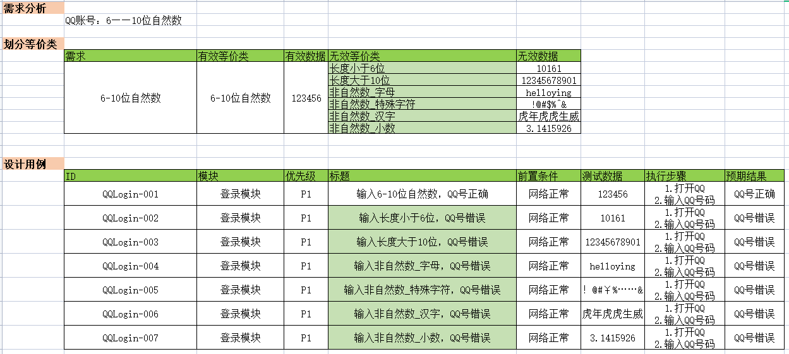
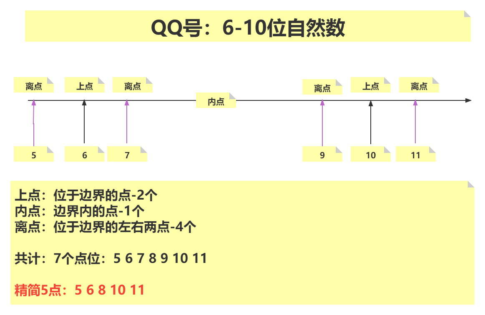
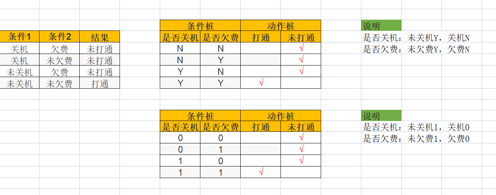
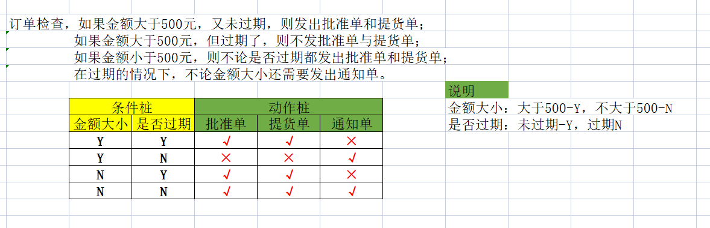
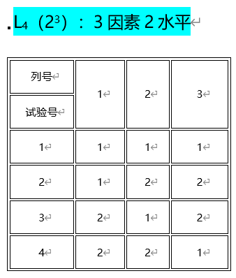

[toc]

# **1. 测试理论**

## **1.1 软件测试目的及原则**

**软件测试目的**

​	1. 用最少的人力、物力、财力，找到软件中的问题并修复，从而降低商业风险

**软件测试原则**

​	1. 只能证明软件存在问题，不能证明不存在问题

​	2. 应该分类别测试，不能穷举测试

	3. 测试工作要尽早的介入，降低修复成本
	4. 缺陷存在集群现象，二八原则：20%的模块中存在80%的缺陷
	5. 测试依赖环境（系统、浏览器）
	6. 杀虫剂现象
	7. 不存在缺陷谬论


## **1.2 软件测试分类**

### **1.2.1 按测试阶段划分**

1. 单元测试
   又称模块测试，针对软件设计中的最小单位-程序模块，进行正确性检查的测试工作。单元测试需要从程序内部结构出发设计测试用例

2. 集成测试
   又叫组装测试，通常在单元测试的基础上，将所有程序模块进行有序的、递增的测试

3. 系统测试
   指的是将整个软件系统看为一个整体进行测试，包含所需的周边硬件

4. 验收测试
   检验软件是否符合用户需求的测试


   α测试
   ​         Alpha 是内测版本
   ​         通常只在软件开发者内部交流
   ​         一般而言, 该版本软件的bug较多,普通用户最好不要安装
   β测试

   ​        Beta是公测版本，是对所有用户开放的测试版本
   ​        这一版本通常由软件公司免费发布, 用户可从相关的站点下载
   ​        通过一些专业爱好者的测试, 将结果反馈给开发者, 开发者们再进行有针对性的修改
   γ测试
   ​        Gamma版本，指的是软件版本正式发行的候选版。该版本已经相当成熟了, 与即将发行的正式版相差无几, 成为正式发布的候选版本


### **1.2.2 按是否查看源代码**

1. 黑盒测试
   又称数据驱动测试，完全不考虑程序内部结构和内部特性，注重于测试软件的功能需求，只关心软件的输入数据和输出数据。
2. 白盒测试
   指的是把盒子打开，去研究里面的源代码和程序结构
3. 灰盒测试
   灰盒测试，是介于白盒测试与黑盒测试之间的一种测试，不仅关注输出、输入的正确性，同时也关注程序内部的情况


### **1.2.3 按是否运行分类**

1. 静态测试
   指不实际运行被测软件，而只是静态地检查程序代码、界面或文档中可能存在的错误过程

2. 动态测试
   是指实际运行被测程序，输入相应的测试数据，检查实际输出结果和预期结果是否相符的过程


### **1.2.4 按照是否自动化**

1. 功能测试
   也叫做手工测试，俗称手动点点点
2. 自动化测试
   利用代码或者工具帮助人工进行测试


### **1.2.5 软件测试的更多分类**

1. 冒烟测试
   冒烟测试就是对系统进行最基本功能的测试，保证基本的功能和流程能走通

2. 回归测试
   当修复一个BUG后，把之前的测试用例在新的代码下进行再次测试

3. 随机测试
   随机测试主要是对被测软件的一些重要功能进行复测，也包括测试那些当前的测试用例没有覆盖到的部分

4. 探索性测试
   探索性测试意味着同时设计测试和执行测试。测试人员通过测试来不断学习被测系统

## **1.3 软件缺陷**

### **1.3.1 软件缺陷定义**

是指软件或程序中存在的各种问题及错误。软件缺陷的存在会导致软件产品在某种程度上不能满足用户的需求


### **1.3.2 软件缺陷的判定标准**

1. 软件未达到需求规格说明书中标明的功能

2. 软件出现了需求规格说明书指明不会出现错误的地方

3. 软件的功能超出了需求规格说明书指明的范围

4. 软件未达到需求规格说明书虽未指明但应该达到的目标

5. 软件测试人员认为软件难以理解，不易使用，运行速度慢，或者最终用户体验不好


### **1.3.3 软件缺陷产生的原因**

软件缺陷产生是不可避免的，造成软件缺陷产生的原因主要归纳如下：
1. 需求解释、记录或者定义错误

2. 设计文档说明存在错误或者拼写错误

3. 编码说明、程序代码有误

4. 硬件或者软件系统上存在错误


### **1.3.4 软件缺陷的类型**

1. 功能错误
2. 界面错误
3. 兼容性缺陷
4. 易用性问题
5. 改进建议


## **1.4 测试用例**

### **1.4.1 定义**

**测试用例**

​	(Test Case)是为特定的目的而设计的一组测试输入、执行条件和预期结果的文档。测什么？怎么测？

 **生活中的测试用例**
​		买手机、买电脑，要试用一下：开机、屏幕、运行速度、内存大小；这就是生活中的测试用例！

​	买手机：按开机键，相当于输入了一组数据来测试，执行条件指的是开机的前提条件，比如是否有电；预期结果就是能顺利打开手机，那么测试完毕后，是否达到了想要的需求（顺利开机）

### **1.4.2 测试用例组成要素与用例模板**

- ID
  - 唯一性
  - 项目-模块-001
- 模块
- 优先级
  - 作用：体现用例执行的先后顺序
  - 分类：
    - 高
    - 中
    - 低
- 用例标题
  - 唯一性
  - 见名知意
- 预置条件
- 测试步骤
  - 尽可能详细
- 测试数据
- 预期结果

### **1.4.3 软件测试用例的作用**

- 便于理清测试思路，确保需覆盖测试的功能点无遗漏
- 便于测试工作量的评估
- 便于提前准备测试数据
- 便于把控测试工作进度
- 便于回归测试
- 便于测试工作的组织，提高测试效率，降低测试交接成本


# **2. 功能测试**

## 1. 等价类

### 1.1 等价类划分法

- 概念：通过科学的方法找到具有共同特性的测试输入的子集，能够从穷举测试中解放（大大减少了测试用例的数量，从而提升测试效率。）

- 分类

  - 有效等价类：满足需求

  - 无效等价类：不满足需求

- 设计测试用例的步骤

  - 需求分析

  - 划分等价类（有效等几类和无效等价类）

  - 设计测试用例

- 典型应用场景

  - 输入框

**示例1：请设计QQ账号输入的测试用例**

```python
说明：QQ账号为6-10位自然数
```




## 2.边界值

- 作用：对等价类的补充，统计表明程序最容易出错的地方就是在边界附近。

- 概念：基于边界值【有效等价类和无效等价类的分界点】设计测试用例的一种黑盒方法

- 边界值

  - 上点：边界之上的点

  - 内点：边界之内的点

  - 离点：离边界最近的左右两点

- 设计测试用例步骤

  - 需求分析

  - 划分等价类

  - 确定边界（上点、内点和离点）

  - 设计测试用例

- 典型应用场景

  - 存在边界 > >= < <= 

### 示例1：QQ账号（6-10位自然数）

| 需求         | 数学表示 | 上点 | 内点 | 离点      | 精简5点     |
| ------------ | -------- | ---- | ---- | --------- | ----------- |
| 6-10位自然数 | [6,10]   | 6 10 | 8    | 5 7  9 11 | 5 6 8 10 11 |



- 边界值优化【7点变5点】
- 结论：
  - 上点：必选（不考虑区间开闭）
  - 内点：必选（建议选择中间范围）
  - 离点：开内闭外（考虑开闭区间，开区间选择内部离点，闭区间选择外部离点）

## 3.判定表

### 示例1：用户呼叫

- 概念：存在多个输入条件、多个输出结果，输入和输入之间有组合关系，输入和输出之间有依赖或制约关系。

- 判定表组成：

  - 条件桩：所有输入条件，如欠费状态、关机状态

  - 动作桩：所有的可能的输出结果，如打通、打不通

  - 条件项：单个条件的取值范围，一般都是有效等价类和无效等价类

    - 表示方式
      - 字符：
        - 真/有效等价类/Y
        - 假/无效等价类/N
      - 数字:
        - 真/有效等价类/1
        - 假/无效等价类/0

  - 动作项：基于每一种条件的组合，得到确认的结果，如打不通等

- 设计测试用例的步骤

  1. 明确条件桩（找到所有的输入条件）
  2. 明确动作桩（找到所有的输出结果）
  3. 对条件桩进行全组合
  4. 明确每个组合对应的动作项（基于每一种条件的组合情况，确定本组合下的输出结果。）
  5. 设计测试用例，每行数据对应一条测试用例

- 真假表示说明：

  | 表示形式 | 真   | 假   |
  | -------- | ---- | ---- |
  | 数字     | 1    | 0    |
  | 符号     | Y    | N    |


- 使用场景：

  - 多条件组合情况



### 示例2：订单状态

```yacas
订单检查，如果金额大于500元，又未过期，则发出批准单和提货单；
         如果金额大于500元，但过期了，则不发批准单与提货单；
         如果金额小于500元，则不论是否过期都发出批准单和提货单；
         在过期的情况下，不论金额大小还需要发出通知单。

条件桩：金额大小、是否过期
动作桩：是否发批准单、是否发提货单、是否发通知单
条件项：金额大于500元、不大于500元、过期、未过期
动作项：发批准单、不发批准单、发提货单、不发提货单、发通知单、不发通知单
```




## 4.正交法

### 4.1 核心思想

- 用最小的测试用例获得最大的测试覆盖率。

### 4.2 正交表

### 



**说明**

- k代表因素（输入参数）
- m叫水平（输入参数的取值）
- n代表测试用例数
- 读法：k因素m水平


### 4.3 基于正交表设计测试用例

- 步骤
  - 需求分析
  - 确定因素与水平（因素：控件名称；水平：每个控件对应的取值）
  - 确定要采用的正交表
  - 将正交表中的字母用文字代替
  - 设计测试用例（一行就是一条测试用例）


#### 示例1：字符属性设置程序

```yacas
窗体中有多个控件（字体、字符样式、颜色、字号），每个控件有多个取值
字体：仿宋、楷体、华文彩云
字符样式：粗体、斜体、下划线
颜色：红色、绿色、蓝色
字号：20号、30号、40号
```

| 列号   | 字体     | 字符样式 | 颜色 | 字号 |
| ------ | -------- | -------- | ---- | ---- |
| 试验号 |          |          |      |      |
| 1      | 仿宋     | 粗体     | 红色 | 20号 |
| 2      | 仿宋     | 斜体     | 绿色 | 30号 |
| 3      | 仿宋     | 下划线   | 蓝色 | 40号 |
| 4      | 楷体     | 粗体     | 绿色 | 40号 |
| 5      | 楷体     | 斜体     | 蓝色 | 20号 |
| 6      | 楷体     | 下划线   | 红色 | 30号 |
| 7      | 华文彩云 | 粗体     | 蓝色 | 30号 |
| 8      | 华文彩云 | 斜体     | 红色 | 40号 |
| 9      | 华文彩云 | 下划线   | 绿色 | 20号 |


## 5.场景法（流程图法）

- 概念：场景法就是模拟用户操作软件时的场景，主要用于测试多个功能之间的组合使用情况。

- 使用测试阶段

  - 集成测试
  - 系统测试
  - 验收测试

- 设计测试用例的步骤

  - 需求分析

  - 绘制流程图

  - 设计测试用例（一条流程路径就是一条测试用例）

- 流程图常用符号

  - 开始或结束：椭圆

  - 方向或路径：箭头

  - 处理或操作：长方形

  - 判断：菱形

  - 输入或输出：平行四边形

- 绘制流程图

  - 第1步：确认场景中关键业务步骤

  - 第2步：确定业务之间的先后顺序

  - 第3步：用箭头连接即可


#### 示例1：电商购物流程

.png)

------

## 6.错误推测法

- 概念：利用**经验**或**智慧**发现程序中**可能**犯错的地方。

- 使用场景

  - 重要功能

  - 使用同类型产品

  - 任务急、时间紧、资源少

------

## 7.测试用例设计方法总结

- 具有输入功能，但输入之间没有组合关系（**等价类**）
- 输入有边界 如长度、类型（**边界值**）
- 多输入、多输出、输入与输入之间存在组合关系、输入与输出之间存在依赖或制约关系（**判定表**）
- 用最少的测试用例获得最大测试覆盖率时（**正交表**）
- 多个功能的组合测试（**场景法｜流程图法**）
- 最后推荐使用（**错误推测法**）来进一步补充测试用例


