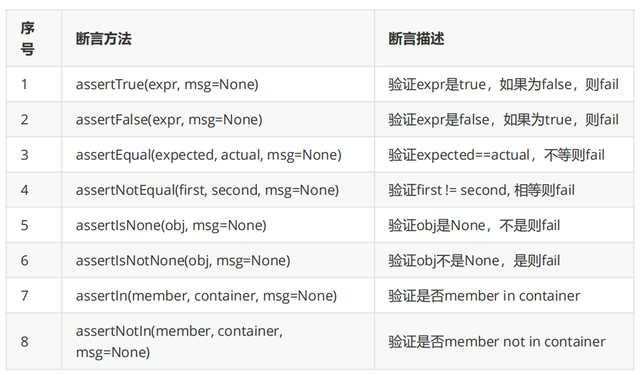

[toc]

# UnitTest单元测试框架

## **一、单元测试**

1. **单元测试概念**

   单元测试（unit testing），是指对软件中的最小可测试单元进行检查和验证
   
   对于单元测试中单元的含义，要根据实际情况去判定其具体含义
   
   一个单元可能是功能模块、类、方法（函数）等

2. **单元测试工具**

   不同的编程语言都有比较成熟的单元测试框架，语法规则有些差别，其核心思想都是相通的，常见的单元测试框架有：
   
   Java：Junit、TestNG
   
   Python：unittest、pytest

## **二、UnitTest框架概念**

1. **介绍**

   UnitTest是Python自带的一个单元测试框架，用它来做单元测试。也经常应用到UI自动化测试和接口自动化测试中，用来管理和维护测试用例脚本

2. **使用UnitTest框架的好处**

   2.1 能够组织多个用例去执行（可以把多条测试用例封装成一个测试套件，实现批量执行测试用例）
   
   2.2 提供了丰富的断言方法，方便对用例执行的结果进行判断
   
   2.3 能够生成HTML格式的测试报告
   
   2.4 使用Fixture功能可以减少代码的冗余

3. **UnitTest核心要素**

   3.1 TestCase：测试用例
   
   3.2 TestSuite：测试套件，多条测试用例集合在一起
   
   3.3 TestRunner：执行测试用例和测试套件

## **三、UnitTest使用**

### **1. TestCase测试用例**

1. 示例

   > **1.1 定义一个实现加法操作的函数，并对该函数进行测试**
   >
   > ```python
   > import unittest
   > 
   > 
   > def add(x, y):
   >        return x + y
   > 
   > 
   > class TestAdd(unittest.TestCase):
   >     def test01_add(self):
   >            result = add(1, 1)
   >            print(result)
   >            # 断言
   >            self.assertEqual(result, 2)
   > 
   >     def test02_add(self):
   >            result = add(2, 2)
   >            print(result)
   >            # 断言
   >         self.assertEqual(result, 3.1415926)
   > ```
   >
   > 1.2 如何执行测试用例
   >
   > ​	使用pycharm在代码上点击鼠标右键运行即可
   >

### **2. TestSuite**

1. 说明

   测试套件可以将多条测试用例集合在一起，就是一个TestSuite使用

2. 使用

   2.1 实例化：suite = unittest.TestSuite() (suite：为TestSuite实例化的名称)
   
   2.2 添加用例：suite.addTest(ClassName("MethodName"))(ClassName：为类名；MethodName：为方法名)
   
   2.3 添加扩展：suite.addTest(unittest.makeSuite(ClassName))(搜索指定ClassName内test开头的方法并添加到测试套件中)
   
   **注：TestSuite需要配合TestRunner才能被执行**

### **3. TextTestRunner**

1. 说明

   TextTestRunner是用来执行测试用例和测试套件的使用

2. 使用流程

   2.1 实例化：runner = unittest.TextTestRunner()
   
   2.2 .执行：runner.run(suite)  suite：为测试套件名称

3. 综合示例

   3.1 创建第2个测试模块：test_login.py

   ```python
   """
       测试达达商城登录模块
       python3 manage.py runserver
   """
   import unittest
   import requests
   
   
   class TestLogin(unittest.TestCase):
       def test01_login(self):
           """登录成功"""
           url = "http://127.0.0.1:8000/v1/tokens"
           data = {
               "username": "zhaoliying",
               "password": "123456",
               "carts": []
           }
           # {"code":200,"username":"zhaoliying",..}
           html = requests.post(url=url, json=data).json()
           # 断言
           self.assertEqual(html.get("code"), 200)
   
       def test02_login(self):
           """密码错误"""
           url = "http://127.0.0.1:8000/v1/tokens"
           data = {
               "username": "zhaoliying",
               "password": "87error",
               "carts": []
           }
           html = requests.post(url=url, json=data).json()
           # 断言
           self.assertEqual(html.get("code"), 10103)
       
       def test03_login(self):
           """用户名错误"""
           url = "http://127.0.0.1:8000/v1/tokens"
           data = {
               "username": "yingerror",
               "password": "123456",
               "carts": []
           }
           html = requests.post(url=url, json=data).json()
           # 断言
           self.assertEqual(html.get("code"), 10102)
   ```
   
     3.2 同时运行多个测试模块的测试用例：run_suite.py
   
   ```python
   # run_suite.py
   # 添加多个测试套件，运行测试用例
   
   import unittest
   from test01_add import TestAdd
   from test02_sub import TestLogin
   
   #实例化测试套件对象
   suite = unittest.TestSuite()
   
   # 添加测试用例
   suite.addTest(TestAdd("test01_add"))
   suite.addTest(TestAdd("test02_add"))
   suite.addTest(unittest.makeSuite(TestLogin))
   
   #实例化运行器对象
   runner = unittest.TextTestRunner()
   
   #运行测试套件
   runner.run(suite)
   ```

### **4. Fixture**

1. 说明

   Fixture是对一个测试用例环境的初始化和销毁操作

2. 方法级别使用

   2.1 初始化 ( 前置处理 )
   
   ​	def setUp(self) --> 首先自动执行 
   
   2.2 销毁 ( 后置处理 )
   
   ​	def tearDown(self) --> 最后自动执行 
   
   2.3 运行于测试方法的始末，
   
   ​	即：运行一次测试方法就会运行一次 setUp 和 tearDown

3. 类级别的使用

   3.1 初始化 ( 前置处理 ): 
   
   ​	@classmethod 
   
   ​	def setUpClass(cls): --> 首先自动执行 
   
   3.2 销毁 ( 后置处理 ): 
   
   ​	@classmethod 
   
   ​	def tearDownClass(cls): --> 最后自动执行 
   
   3.3 运行于测试类的始末，
   
   ​	即：每个测试类只会 运行一次 setUpClass 和 tearDownClass

4. 示例

   **4.1 模拟达达商城注册模块自动化测试用例-类级别的fixture**

   ```python
   """
       测试达达商城登录模块
       python3 manage.py runserver
   """
   import unittest
   import requests
   from parameterized import parameterized
   
   
   data_params = [
       ("zhaoliying", "123456", 200),
       ("zhaoliying", "87error", 10103),
       ("yingerror", "123456", 10102)
   ]
   
   class TestLogin(unittest.TestCase):
       @classmethod
       def setUpClass(cls):
           """类的初始化"""
           print("打开浏览器")
   
       @classmethod
       def tearDownClass(cls):
           """类的收尾工作"""
           print("关闭浏览器")
   
       def setUp(self):
           """每个测试用例方法执行前先执行此函数"""
           print("打开浏览器")
   
       def tearDown(self):
           """每个测试用例方法执行结束后执行此函数"""
           print("关闭浏览器")
   
       @parameterized.expand(data_params)
       def test01_login(self, uname, pwd, code):
           """登录成功"""
           url = "http://127.0.0.1:8000/v1/tokens"
           data = {
               "username": uname,
               "password": pwd,
               "carts": []
           }
           # {"code":200,"username":"zhaoliying",..}
           html = requests.post(url=url, json=data).json()
           # 断言
           self.assertEqual(html.get("code"), code)
   
   
   
   
       def test02_login(self):
           """密码错误"""
           url = "http://127.0.0.1:8000/v1/tokens"
           data = {
               "username": "zhaoliying",
               "password": "87error",
               "carts": []
           }
           # {"code":200,"username":"zhaoliying",..}
           html = requests.post(url=url, json=data).json()
           # 断言
           self.assertEqual(html.get("code"), 10103)
   
       def test03_login(self):
           """用户名错误"""
           url = "http://127.0.0.1:8000/v1/tokens"
           data = {
               "username": "yingerror",
               "password": "123456",
               "carts": []
           }
           # {"code":200,"username":"zhaoliying",..}
           html = requests.post(url=url, json=data).json()
           # 断言
           self.assertEqual(html.get("code"), 10102)
   ```
   

### **5. UnitTest断言**

1. 说明

   让程序代替人为判断测试程序执行结果是否符合预期结果的过程
   
   UnitTest 中提供了非常丰富的断言方法，但是常用的也就那么几个，并且使用起来也比较简单

2. 断言方法

   > 

3. 使用示例

   断言方法经在unittest.TestCase 类中定义好了，而且我们自定义的测试类已经继承了 TestCase ，所以在测试方法中直接调用即可
   

### **6. UnitTest参数化**

1. 说明

   1.1 通过参数的方式来传递数据，从而实现数据和脚本分离，也可以把测试数据定义到数据文件或者数据库中
   
   1.2 针对同一个测试方法，可以实现用例的重复执行，减少代码冗余，提高测试效率
   
   1.3 unittest测试框架，本身不支持参数化，但是可以通过安装 unittest 扩展插件rameterized 来实现

2. 环境安装

   sudo pip3 install parameterized

3. 使用

   3.1 导包
   
   ​	from parameterized import parameterized
   
   3.2 使用装饰器装饰需要传参的测试用例函数
   
   ​	@parameterized.expand([(1,1,2),(2,2,4)])
   
   ​	def test01_add(self, x, y, expect):
   
   ​		pass

4. 示例

   ```python
   """
       测试达达商城登录模块
       python3 manage.py runserver
   """
   import unittest
   import requests
   from parameterized import parameterized
   
   
   data_params = [
       ("zhaoliying", "123456", 200),
       ("zhaoliying", "87error", 10103),
       ("yingerror", "123456", 10102)
   ]
   
   class TestLogin(unittest.TestCase):
       @parameterized.expand(data_params)
       def test01_login(self, uname, pwd, code):
           """登录成功"""
           url = "http://127.0.0.1:8000/v1/tokens"
           data = {
               "username": uname,
               "password": pwd,
               "carts": []
           }
           # {"code":200,"username":"zhaoliying",..}
           html = requests.post(url=url, json=data).json()
           # 断言
           self.assertEqual(html.get("code"), code)
   ```

### **7. 生成HTML测试报告**

1. 说明

   测试脚本执行完后，可以生成以 HTML( 网页 ) 格式的测试报告

2. 为什么要测试报告

   2.1 测试报告是本次测试结果的体现形态
   
   2.2 测试报告内包含了有关本次测试用例的详情

3. 使用方法

   使用HTMLTestRunner 生成测试报告
   
   3.1 复制 HTMLTestRunner.py 文件到项目文件夹
   
   3.2 导入HTMLTestRunner、unittest 包 
   
   3.3 生成测试套件 
   
   ​	suite = unittest.TestSuite() 
   
   ​	suite.addTest(TestAdd("test_01"))
   
   3.4 设置报告生成路径和文件名 file_name = "./report/report.html"
   
   3.5 打开报告 with open(file_name,'wb') a s f:
   
   3.6 实例化 HTMLTestRunner 对象
   
   ​	runner = HTMLTestRunner(stream=f,[title],[description]) 
   
   ​	参数说明： 
   
   ​		stream ：文件流，打开写入报告的名称及 写入编码格式 ) 
   
   ​		title ： [ 可选参数 ] ，为报告标题 
   
   ​		description ： [ 可选参数 ] ，为报告描 述信息
   
   3.7 执行： runner.run(suite)

4. 使用示例

   ```python
   # run_suite.py
   # 导包
   import unittest
   from test01_add import TestAdd
   from tools.HTMLTestRunner import HTMLTestRunner
   
   #实例化测试套件对象
   suite=unittest.TestSuite()
   
   # 添加测试用例
   suite.addTest(unittest.makeSuite(TestAdd))
   
   # 定义测试报告存放路径(提前创建report文件夹)
   report_path = './report/report.html'
   # 打开文件流
   with open(report_path, 'wb') as f:
       # 实例化运行器对象
       runner = HTMLTestRunner(f, title='测试报告')
       #运行测试套件
       runner.run(suite)
   ```


