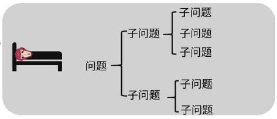
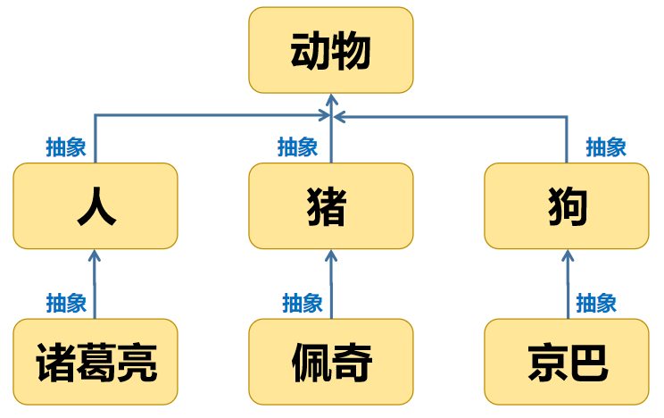
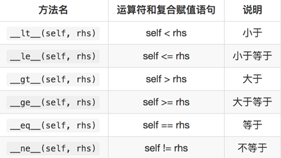

## 1. 概述

### 1.1 面向过程

(1) 定义：分析出解决问题的步骤，然后逐步实现。

例如：婚礼筹办

-- 请柬（选照片、措词、制作）

-- 宴席（场地、找厨师、准备桌椅餐具、计划菜品、购买食材）

-- 仪式（定婚礼仪式流程、请主持人）

(2) 公式：程序 = 算法 + 数据结构

(3) 优点：所有环节、细节自己掌控。

(4) 缺点：考虑所有细节，工作量大。 



### 1.2 面向对象

(1) 定义：找出解决问题的对象，然后分配职责。

例如：婚礼筹办

-- 发请柬：找摄影公司（拍照片、制作请柬）

-- 宴席：找酒店（告诉对方标准、数量、挑选菜品） 

-- 婚礼仪式：找婚庆公司（对方提供司仪、制定流程、提供设备、帮助执行）

(2) 公式：程序 = 对象 + 交互

(3) 优点

a. 思想层面：

-- 可模拟现实情景，更接近于人类思维。

-- 有利于梳理归纳、分析解决问题。

b. 技术层面：

-- 高复用：对重复的代码进行封装，提高开发效率。

-- 高扩展：增加新的功能，不修改以前的代码。

-- 高维护：代码可读性好，逻辑清晰，结构规整。

(4) 缺点：学习曲线陡峭。


## 2. 类和对象

(1) 类：用来描述具有相同属性或功能的对象集合。

- 一个抽象的概念，即生活中的”类别”。

(2) 对象：表示类的具体实例，即归属于某个类别的”个体”。

|  类  |    实例（对象）    |
| :--: | :----------------: |
|  狗  | 王奶奶家的拉布拉多 |
|  人  | 正在讲课的那个帅哥 |
| 老婆 |     老毕的老婆     |

(3) 类是创建对象的 ”模板”。 

- -- 数据成员：表明事物的特征。

- -- 方法成员：表明事物的功能或行为。

### 2.1 语法

#### 2.1.1 定义类

(1) 代码

```python
class 类名:
	"""
		文档字符串
	"""
     类成员    
     实例成员
```

(2) 说明

-- 类名：所有单词首字母大写。

#### 2.1.2 实例化对象

(1) 代码

```python
变量 = 类名([参数])
```

(2) 说明

- 变量存储的是实例化后的对象地址。

----

> **内置属性函数**：
>
> - getattr(object, name[, default])
>   - 获取对象属性名对应的属性值，如果属性名存在则返回对应的属性值，否则返回默认值。
> - hasattr(obj, name)
>   - 判断当前对象是否有此属性，若无，则返回False，否则返回True

----

### 2.2 实例成员

#### 2.2.1 实例变量

(1) 语法

a. 定义：对象.变量名

b. 调用：对象.变量名 

---

- ==**构造方法：**==

```python
class 类名:
    def __init__(self, 数据):
        self.变量名 = 数据
```

- 说明：
  1. \__init__ 方法：构造方法或初始化方法，名字不可变
  2. 在类实例化时被自动调用。
  3. self：表示实例对象本身，用在构造方法或实例方法中被自动传递。
  4. 类名后面的参数按照构造方法的形参传递

> 作用：多用于初始化对象的实例变量

---

(2) 说明

a. 首次通过对象赋值为创建，再次赋值为修改.

b. 通常定义在构造方法(\_\_init__)中

c. 每个对象存储一份，通过实例对象地址访问

----

(3) 查看

- 格式：实例对象.\__dict__
- 作用：查看实例对象的属性，用于存储自身实例变量的字典。

----

> 作用：表达不同个体（实例对象）的不同数据

#### 2.2.2 实例方法

(1) 定义

```python
class 类名:
      def 方法名称(self, 参数):
           方法体
```

(2) 调用： 

```python
对象.方法名称(参数)
# 不建议通过类名访问实例方法
```

(3) 说明

- 至少有一个形参，第一个参数绑定调用这个方法的实例对象，一般命名为self。
- 无论创建多少对象，实例方法只有一份，并且被所有实例对象共享。

(4) 本质

- 就是定义类内的 “函数” （参数可以参考函数的定义及传递方式）

---

> **作用**：表达不同个体（实例对象）的不同行为

---

练习1：创建狗类，实例化两个对象并调用其方法，画出内存图。

​	数据：品种、昵称、身长、体重

​	行为：吃(体重增长1)


练习2：将面向过程代码改为面向对象代码

```python
list_commodity_infos = [
  {"cid": 1001, "name": "屠龙刀", "price": 10000},
  {"cid": 1002, "name": "倚天剑", "price": 10000},
  {"cid": 1003, "name": "金箍棒", "price": 52100},
  {"cid": 1004, "name": "口罩", "price": 20},
  {"cid": 1005, "name": "酒精", "price": 30},
]

# 订单列表
list_orders = [
  {"cid": 1001, "count": 1},
  {"cid": 1002, "count": 3},
  {"cid": 1005, "count": 2},
]

def print_single_commodity(commodity):
	print(f"编号:{commodity['cid']},商品名称:{commodity['name']},商品单价:{commodity['price']}")

# 1. 定义函数,打印所有商品信息,格式：商品编号xx,商品名称xx,商品单价xx.
def print_commodity_infos():
	for commodity in list_commodity_infos:
    	print_single_commodity(commodity)

# 2. 定义函数,打印商品单价小于2万的商品信息
def print_price_in_2w():
	for commodity in list_commodity_infos:
    	if commodity["price"] < 20000:
			print_single_commodity(commodity)

# 3. 定义函数,打印所有订单中的商品信息,
def print_order_infos():
	for order in list_orders: 
		for commodity in list_commodity_infos:
	    	if order["cid"] == commodity["cid"]: 
		        print(f"商品名称{commodity['name']},商品单价:{commodity['price']},数量{order['count']}.")
                break # 跳出内层循环

# 4. 查找最贵的商品(使用自定义算法,不使用内置函数)
def commodity_max_by_price():
	max_value = list_commodity_infos[0]
	for i in range(1, len(list_commodity_infos)):
	    if max_value["price"] < list_commodity_infos[i]["price"]:
	    	max_value = list_commodity_infos[i]
	return max_value

# 5. 根据单价对商品列表降序排列
def descending_order_by_price():
	for r in range(len(list_commodity_infos) - 1):
		for c in range(r + 1, len(list_commodity_infos)):
		    if list_commodity_infos[r]["price"] < list_commodity_infos[c]["price"]:
			list_commodity_infos[r], list_commodity_infos[c] = list_commodity_infos[c], list_commodity_infos[r]
```

#### 2.2.3 跨类调用

> 原因：类与类的行为不同、对象与对象数据不同。

```python
# 写法1：直接创建对象
# 语义：老张每次创建一辆新车去
class Person:
    def __init__(self, name=""):
        self.name = name

    def go_to(self,position):
        print("去",position)
        car = Car()
        car.run()

class Car:
    def run(self):
        print("跑喽～")

lz = Person("老张")
lz.go_to("东北") 
```

```python
# 写法2：在构造函数中创建对象
# 语义：老张开自己的车去
class Person:
    def __init__(self, name=""):
        self.name = name
        self.car = Car()

    def go_to(self,position):
        print("去",position)
        self.car.run()

class Car:
    def run(self):
        print("跑喽～")

lz = Person("老张")  
lz.go_to("东北") 
```

```python
# 方式3：通过参数传递
# 语义：老张用交通工具去
class Person:
    def __init__(self, name=""):
        self.name = name

    def go_to(self,vehicle,position):
        print("去",position)
        vehicle.run()

class Car:
    def run(self):
        print("跑喽～")

lz = Person("老张")
benz = Car()
lz.go_to(benz,"东北")
```

---

练习1：以面向对象思想,描述下列情景.

玩家攻击敌人，敌人受伤（根据玩家攻击力，减少敌人的血量） 


练习2：以面向对象思想,描述下列情景.

张无忌教赵敏九阳神功

赵敏教张无忌玉女心经

张无忌工作挣了5000元

赵敏工作挣了10000元

---

### 2.3 类成员

#### 2.3.1 类变量

(1) 定义：在类中与方法外。

```python
class 类名:
       变量名 = 数据
```

(2) 调用：

```python
类名.变量名
# 不建议通过对象访问类变量

类名.变量名 = 数据
```

(3) 特点：

- 随类的加载而加载
- 存在优先于实例对象
- 只有一份，被所有对象共享。

(4) 功能：

- 描述所有对象的共有数据

----

> 作用：表达不同个体（实例对象）的相同数据

#### 2.3.2 类方法

(1) 定义：

```python
 class 类名:
      @classmethod
      def 方法名称(cls, [参数]):
             方法体
```

(2) 调用：

```python
类名.方法名(参数) 
# 不建议通过对象访问类方法
```

(3) 说明

- 至少有一个形参，第一个形参用于绑定类，一般命名为 'cls'
- 使用@classmethod修饰的目的是调用类方法时可以隐式传递类。
- 类方法中不能访问实例成员，实例方法中可以访问类成员。

(4) 功能

- 操作类变量

----

> 作用：表达不同个体（实例对象）的相同行为

----

练习：创建对象计数器，统计构造方法执行的次数，使用类变量实现并画出内存图。

### 2.4 静态方法

(1) 定义：

```python
class 类名:
    @staticmethod
    def 方法名称([参数]):
      	方法体
```

(2) 调用：

```python
类名.方法名称(参数) 
# 不建议通过对象访问静态方法
```

(3) 说明

- 使用@staticmethod修饰的目的是该方法不需要隐式传参数。
- 静态方法不能访问实例成员和类成员

----

> **作用**：定义常用功能工具。

## 3. 三大特征

### 3.1 封装 encapsulation

#### 3.1.1 数据角度

(1) 定义：将一些基本数据类型复合成一个自定义类型。

(2) 优势：

-- 将数据与对数据的操作相关联。

-- 代码可读性更高（类是对象的模板）。

#### 3.1.2 行为角度

(1) 定义：

- 向类外提供必要的功能，隐藏实现的细节。

(2) 优势：

- 简化编程，使用者不必了解具体的实现细节，只需要调用对外提供的功能。

(3) 私有成员：

- 作用：无需向类外提供的成员，可以通过私有化进行**屏蔽**。

- 做法：命名使用双下划线开头，如：self.\__属性名、def __方法名(self, 参数)。

- 本质：障眼法，实际也可以访问。

  - 私有成员的名称被修改为：**\_类名__成员名**，可以通过\_\_dict\__属性查看。


(4) 属性 **@property**

- 作用：保护实例变量

- 说明：在写入方法中可实现对数据有效性验证

- 分类：

  1. 可读可写模式

     ```python
     # 可读可写模式
     class 类名:
         def __init__(self, 参数):
             self.属性名 = 参数
     
         @property
         def 属性名(self):   # 读取方法
             return self.__属性名
     
         @属性名.setter    # 写入方法
         def 属性名(self, value):
             self.__属性名= value
     ```

     

  2. 只读模式

     ```python
     # 只读模式
     class 类名:
         def __init__(self, 参数):
             self.__属性名 = 参数
     
         @property
         def 属性名(self):   # 读取方法
             return self.__属性名
     ```

     

  3. 只写模式

     ```python
     # 只写方法
     class 类名:
         def __init__(self, 参数):
             self.属性名 = 参数
             
        def 写入方法名(self, value):    # 写入方法
             self.__属性名= value
             
        属性名 = property(fset=写入方法名)
     ```

     

- 调用：

```python
对象.属性名 = 数据
变量 = 对象.属性名
```

- 优点
  - 提高了代码的安全性。
  - 把代码用方法进行封装，提高了代码的复用性。

---

练习1：创建敌人类，并保护数据在有效范围内

 数据：姓名、攻击力（0-100）、血量（0-500）

​                         

练习2：创建店铺类，并保护数据在有效范围内

数据：店铺名称、店铺电话（7位、8位或11位）

----

### 3.2 继承 inherit

(1) 概念： 重用现有类的功能，并在此基础上进行扩展。

(2) 说明：子类直接具有父类的成员（共性），还可以扩展新功能。



> 抽象的目的：划分类别（隔离变化点，降低复杂度）

#### 3.2.1 继承方法

(1) 语法:

```python
class 父类:
   def 父类方法(self):
     方法体

class 子类(父类)：
   def 子类方法(self):
     方法体

儿子 = 子类()
儿子.子类方法()
儿子.父类方法()
```

(2) 说明：

- 子类直接拥有父类的方法.

(3) 演示：

```python
class Person:
    def say(self):
        print("说话")

class Teacher(Person):
    def teach(self):
        self.say()
        print("教学")

class Student(Person):
    def study(self):
        self.say()
        print("学习")

qtx = Teacher()
qtx.say()
qtx.teach()

xm = Student()
xm.say()
xm.study()
```

#### 3.2.2 内置函数

(1) isinstance(对象, 类型) 

​	返回指定对象是否是某个类的对象。

(2) type(对象)

​	返回指定对象的类型。

---

练习：

创建子类：狗(跑)，鸟类(飞)

创建父类：动物(吃)

体会子类复用父类方法

体会 isinstance 与 type 的作用.

#### 3.2.3 继承数据

(1) 语法

```python
class 子类(父类):
   def __init__(self,父类参数,子类参数):
      super().__init__(参数) # 调用父类构造函数
      self.实例变量 = 参数
```

(2) 说明

- 子类无构造方法，将自动执行父类的构造方法.
- 子类有构造方法，则覆盖父类的构造方法。此时必须通过super()函数调用父类的构造方法，以确保父类实例变量被正常创建。

---

练习：

创建父类：车(品牌，速度)

创建子类：电动车（electrocar）(电池容量（capacity）)

创建子类对象并画出内存图。

#### 3.2.4 多继承

(1) 相关知识

- 父类（基类、超类）、子类（派生类）。

- 父类相对于子类更抽象，范围更宽泛；子类相对于父类更具体，范围更狭小。

- 单继承：父类只有一个（例如 Java，C#）。

- 多继承：父类有多个（例如C++，Python）。

- Object类：任何类都直接或间接继承自 object 类。

(2) 定义：一个子类继承两个或两个以上的基类，父类中的属性和方法同时被子类继承下来。

(3) 同名方法解析顺序（MRO， Method Resolution Order）:

​	类自身 --> 父类继承列表（由左至右）--> 再上层父类

 	           A

​	      /         \

​	   /               \

​	  B                 C

​	   \               /

 	      \         /

​    	       D 

(3) 练习：写出下列代码在终端中执行效果

```python
class A:
	def func01(self):
	    print("A")
	    super().func01()

class B:
    def func01(self):
	    print("B")

class C(A,B):
 	def func01(self):
    	print("C")
	    super().func01()

class D(A, B):
    def func01(self):
	    print("D")
    	super().func01()

class E(C,D):
    def func01(self):
	    print("E")
	    super().func01()

e = E()
e.func01()
```

---

**总结**

- 优点
  - 提高了代码的 **复用性** （多个类相同的成员可以放在同一个类中）
  - 提高了代码的 维护性 （如果方法的代码需要修改，则修改一处即可）
- 缺点
  - 继承让类与类之间产生了关系，类的耦合性增强，当父类发生变化时，子类实现也得随着变化，削弱了子类的独立性。

---

### 3.3 多态 polymorphic

- **定义**
  - 父类的同一种动作或者行为，在不同的子类上有不同的实现。

- **作用**
  - 在继承的基础上，体现子类的个性化。
  - 增强程序扩展性。

#### 3.3.1 重写

**概念：**

​	子类实现了父类中相同的方法（方法名、参数）。

**说明：**

​	在调用该方法时，实际执行的是子类的方法。（父类方法被覆盖，不执行）  —> 体现个性

#### 3.3.2 内置函数

- 定义
  - Python中，以双下划线开头、双下划线结尾的是系统定义的成员。我们可以在自定义类中进行重写，从而改变其行为。

- \_\_str\_\_ 函数
  - 将对象转换为字符串(对人友好的)

----

练习：

  直接打印商品对象: xx的编号是xx,单价是xx

  直接打印敌人对象: xx的攻击力是xx,血量是xx

```python
class Commodity:
  def __init__(self, cid=0, name="", price=0):
    self.cid = cid
    self.name = name
    self.price = price

class Enemy:
  def __init__(self, name="", atk=0, hp=0):
    self.name = name
    self.atk = atk
    self.hp = hp
```

---

#### 3.3.3 运算符重载

**(1) 算术运算符重载**


练习：创建颜色类，数据包含r、g、b、a，实现颜色对象相加。

----

**(2) 增强运算符重载**


 练习：创建颜色类，数据包含r、g、b、a，实现颜色对象累加。

---

**(3) 比较运算重载**



---

 练习：创建颜色列表，实现in、count、index、max、sort运算。
