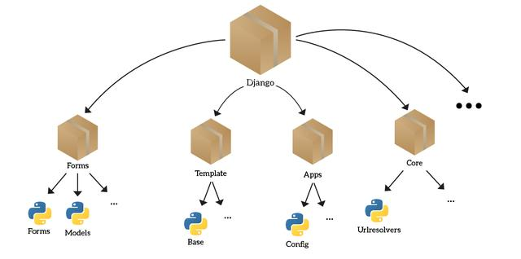
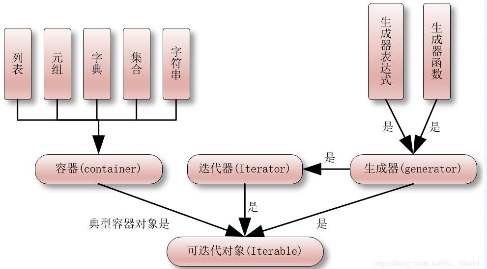

#  1 程序结构

## 1.1 模块 Module

### 1.1.1 定义

- 包含一系列数据、函数、类的文件，通常以 ==.py== 结尾。                  

### 1.1.2 作用

- 让一些相关的数据，函数，类有逻辑的组织在一起，使逻辑结构更加清晰。

- 有利于多人合作开发。

### 1.1.3 导入

#### 1.1.3.1 import

(1) 语法：

> import 模块名
>
> import 模块名 as 别名

(2) 作用：将模块整体导入到当前模块中

(3) 使用：模块名.成员

(4) 原理：创建变量名记录文件地址，使用时通过变量名访问文件中成员

(5) 适用性：适合面向过程(全局变量、函数)

#### 1.1.3.2 from import

(1) 语法：

> from 模块名 import 成员名
>
> from 模块名 import 成员名  as 别名
>
> from 模块名 import *

(2)  作用：将模块内的成员导入到当前模块作用域中

(3) 使用：直接使用成员名

(4) 原理：将模块的成员加入到当前模块作用域中

(5) 适用性：适合面向对象(类)

---

练习：创建2个模块module_exercise.py与exercise.py

​    将下列代码粘贴到module_exercise模块中，并在exercise中调用。

```python
data = 100

def func01():
    print("func01执行喽")

class MyClass:
    def func02(self):
        print("func02执行喽")

    @classmethod
    def func03(cls):
        print("func03执行喽")
```

### 1.1.4 加载过程

- 在模块导入时，模块的所有语句会执行。
- 如果一个模块已经导入，则再次导入时不会重新执行模块内的语句。

---

- 导入成功：真实路径 = 系统路径 + 导入路径

  - 1、在Pycharm中标记：选中路径 --> Make Directory As --> Source Root

  - 2、手动指定系统路径

    ```python
    import sys
    
    # 查看系统路径
    print(sys.path)
    
    # 添加系统路径
    path = 'xxx'     
    sys.path.insert(index, path)
    ```

### 1.1.5 模块变量

- \_\_doc\_\_变量：文档字符串。
- \__file__：查看模块对应的文件路径名

- \_\_name\_\_变量：模块自身名字，可以判断是否为主模块。
  - 当此模块作为主模块(第一个运行的模块)运行时，\__name__绑定 '\_\_main\_\_'，不是主模块名，而是被其它模块导入时，存储模块名。
  - 使用：if \__name__ == "\_\_main__"，用来表明当前为程序的执行入口，函数及类中方法调用应该改在if 语句中。

### 1.1.6 分类

(1) 内置模块(builtins)，在解析器的内部可以直接使用。

(2) 标准库模块，安装Python时已安装且可直接使用。

(3) 第三方模块（通常为开源），需要自己安装。

- 命令：pip install 模块名

(4) 用户自己编写的模块（可以作为其他人的第三方模块）

---

### 1.1.7 常用模块

#### 1.1.7.1 time

```python
# time - 关于时间的相关的操作
import time

# 1、时间戳: 从1970年1月1日 0时0分0秒到此刻的秒数
print(time.time())
# 作用: 1 计算程序的运行的时间   2 爬虫使用时间戳进行数据加密

# 时间元组
print(time.localtime())
print('过去的天数:', time.localtime()[-2])
print('过去的天数:', time.localtime().tm_yday)

# 时间元组 --> 时间戳
print(time.mktime(time.localtime()))

# 时间戳 --> 时间元组
print(time.gmtime(1000000000))

# 时间字符串
print(time.strftime('%Y/%m/%d %H:%M:%S %A'))

# 时间字符串 --> 时间元组
print(time.strptime('2008/8/8 10:08:08', '%Y/%m/%d %H:%M:%S'))

# 休眠
time.sleep(3)   # 休息3秒
```

#### 1.1.7.2 random

```python
# random  - 生成随机数
import random

# 生成随机浮点数
print(random.random())   # 范围:[0, 1)
print(random.uniform(2, 4))   # 范围:[a, b]

# 生成随机整数
print(random.randint(1, 10))  # 范围:[1,10]
print(random.randrange(1, 10, 2))  # 范围:(1,10,2)

# 从序列中随机返回元素#
L = [1, 2, 3, 6, 8, 9]
print(random.choice(L))     # 返回1个
print(random.sample(L, 3))     # 返回多个不重复的列表元素
```

----

练习1：定义函数, 根据年月日,计算星期。

输入：2020  9  15 

输出：星期二


练习2：定义函数，根据生日(年月日)，计算活了多天.

输入：2010  1  1 

输出：从2010年1月1日到现在总共活了3910天

## 1.2 包 package

### 1.2.1 定义

将模块以文件夹的形式进行分组管理。



### 1.2.2 作用

- 让一些相关的模块组织在一起，使逻辑结构更加清晰。

---

### 1.2.3 导入

#### 1.2.3.1 import

(1) 语法：

> import 包
>
> import 包 as 别名

(2) 作用：将包中\_\_init\_\_模块内整体导入到当前模块中

(3) 使用：包.成员 

#### 1.2.3.2 from import

(1) 语法：

> from 包 import 成员
>
> from 包  import 成员 as 别名

(2) 作用：将包中\_\_init\_\_模块内的成员导入到当前模块作用域中

(3) 使用：直接使用成员名

---

练习：根据下列结构，创建包与模块。

my_project02/

​	main.py

​	common/

​		\_\_init\_\_.py

​		list_helper.py

​       skill_system/

​		     \_\_init\_\_.py

​		    skill_manager.py

(1)  通过导入包的方式，在main.py中调用skill_manager.py中实例方法。 

(2)  通过导入包的方式，在skill_manager.py中调用list_helper.py中类方法。

# 2 异常处理 Error

## 2.1 异常

(1) 定义：运行时检测到的错误。

(2) 现象：当异常发生时，程序不会再向下执行，而转到函数的调用语句。

(3) 常见异常类型：

-- 名称异常(NameError)：变量未定义。

-- 类型异常(TypeError)：不同类型数据进行运算。

-- 索引异常(IndexError)：超出索引范围。

-- 属性异常(AttributeError)：对象没有对应名称的属性。

-- 键异常(KeyError)：没有对应名称的键。

-- 异常基类 Exception。

## 2.2 处理

(1) 语法：

```python
try:
	可能触发异常的语句
except 错误类型1 [as 变量1]：
	处理语句1
except 错误类型2 [as 变量2]：
	处理语句2
except Exception [as 变量3]：
	不是以上错误类型的处理语句
else:
	未发生异常的语句
finally:
	无论是否发生异常的语句
```

(2) 作用：将程序由异常状态转为正常流程。

(3) 说明

1. as 子句是用于绑定错误对象的变量，可以省略
2. except子句可以有一个或多个，用来捕获某种类型的错误。
3. else子句最多只能有一个。
4. finally子句最多只能有一个，如果没有except子句，必须存在。
5. 如果异常没有被捕获到，会向上层(调用处)继续传递，直到程序终止运行。

---

练习：创建函数，在终端中录入int类型成绩。如果格式不正确，重新输入。

效果： score = get_score()

​          print("成绩是：%d"%score)

## 2.3 raise 语句

(1) 作用：抛出一个错误，让程序进入异常状态。

(2) 目的：在程序调用层数较深时，向主调函数传递错误信息要层层return比较麻烦，所以人为抛出异常，可以直接传递错误信息。

```python
class Wife:
    def __init__(self, age):
        self.age = age

    @property
    def age(self):
        return self.__age

    @age.setter
    def age(self, value):
        if 20 <= value <= 60:
            self.__age = value
        else:
            # 创建异常  -- 抛出 错误信息
            raise Exception("我不要","if 20 <= value <= 60",1001)

# -- 接收 错误信息
while True:
    try:
        age = int(input("请输入你老婆年龄："))
        w01 = Wife(age)
        break
    except Exception as e:
        print(e.args) # ('我不要', 'if 30 <= value <= 60', 1001)
```

# 3 迭代 iteration

​    每一次对过程的重复称为一次“迭代”，而每一次迭代得到的结果会作为下一次迭代的初始值。例如：循环获取容器中的元素。



## 3.1 可迭代对象 iterable

(1) 定义：具有\_\_iter\_\_方法的对象，可以返回迭代器对象。

(2) 语法

```python
# 创建：
class 可迭代对象名称:
	def __iter__(self):
   		return 迭代器
# 使用：
for 变量名 in 可迭代对象:
	语句
```

(3) 迭代思想的原理：

```python
# 1 通过可迭代对象调用__iter__方法获取迭代器对象
迭代器 = 可迭代对象.__iter__()

while True:
    try: 
        # 2 通过迭代器调用__next__方法获取下一个元素
        print(迭代器.__next__())
        
    # 3 如果迭代器中无数据，则产生 StopIteration 异常
    except StopIteration:
        break
```

(4) 演示：

```python
message = "我是花果山水帘洞孙悟空"
# for item in message:
#     print(item)

# 1. 获取迭代器对象
iterator = message.__iter__()

# 2. 获取下一个元素
while True:
    try:
        item = iterator.__next__()
        print(item)
        
    # 3. 如果停止迭代则跳出循环
    except StopIteration:
        break
```

----

面试：不能使用for循环实现对容器中元素获取并打印。

练习1：创建列表，使用迭代思想，打印每个元素.

练习2：创建字典，使用迭代思想，打印每个键值对.

## 3.2 迭代器对象 iterator

(1) 定义：可以\__next__方法调用并返回下一个值的对象。

(2) 语法

```python
class 迭代器类名:
    def __init__(self, 聚合对象):
        self.聚合对象= 聚合对象 
 
    def __next__(self): 
        if 没有元素:
            raise StopIteration
        return 聚合对象元素
```

(3) 说明：聚合对象通常是容器对象。

(4) 作用：使用者只需通过一种方式，便可简洁明了的获取聚合对象中各个元素，而又无需了解其内部结构。

---

练习1：遍历图形控制器

```python
class GraphicController:
    pass
    
controller = CommodityController()
controller.add_graphic("圆形")
controller.add_graphic("矩形")
controller.add_graphic ("三角形")

for item in controller:
    print(item)
```


练习2：创建自定义range类，实现下列效果.

```python
class MyRange:
    pass

for number in MyRange(5):
    print(number)# 0 1 2 3 4
```

# 4 生成器 generator

(1) 定义：能够动态(循环一次、计算一次、返回一次)提供数据的可迭代对象。

(2) 作用：在循环过程中，按照某种算法推算数据，不必创建容器存储完整的结果，从而**节省内存空间**。数据量越大，优势越明显。以上作用也称之为延迟操作或惰性操作，通俗的讲就是在需要的时候才计算结果，而不是一次构建出所有结果。

## 4.1 yield语句

- 定义：yield 翻译为 ”产生” 或 ”生成”

- 原理：生成迭代器对象的大致规则如下

  - 1、将yield语句之前的代码定义到 \__next__方法中
  - 2、将yield语句后面的数据作为 \__next__方法的返回值

- 生成器类格式

  ```python
  class Generator:       # 生成器 = 可迭代对象 + 迭代器
      def __iter__(self):     # 可迭代对象
          return self
      
      def __next__(self):
          # 计算并返回数据
          # 产生异常StopIteration
  ```

## 4.1 生成器函数

(1) 定义：含有yield语句的函数，返回值为生成器对象。

(2) 语法

```python
# 创建：
def 函数名():
	…
	yield 数据
	…

# 调用：
for 变量名 in 函数名():
    语句
```

(3) 说明：

-- 调用生成器函数将返回一个生成器对象，不执行函数体。

(4) 执行过程：

​	a. 调用生成器函数会自动创建生成器对象。

​	b. 调用生成器对象的\__next__()方法时才执行生成器函数。

​	c. 每次执行到yield语句时返回数据，暂时离开。

​	d. 待下次调用\__next__()方法时继续从离开处继续执行。

```python
def myRange(stop):
    start = 0
    while start < stop:
        yield start
        start += 1

mr = myRange(5)
print('生成器对象：', mr)

mr_generator = mr.__iter__()
print('生成器对象：', mr_generator)

while True:
    try:
        number = mr_generator.__next__()
        print("当前的数为：", number)
    except StopIteration:
        break
```

----

练习1：定义函数,在列表中找出所有偶数

 [43,43,54,56,76,87,98]


练习2：定义函数,在列表中找出所有数字

 [43,"悟空",True,56,"八戒",87.5,98]

## 4.2 内置生成器

### 4.2.1 enumerate

(1) 语法：

```python
for 变量 in enumerate(可迭代对象):
    语句

for 索引, 元素 in enumerate(可迭代对象):
    语句
```

(2) 作用：遍历可迭代对象时，可以将索引与元素组合为一个元组。

(3) 演示：

```python
list01 = [43, 43, 54, 56, 76]
# 从头到尾读          -- 读取数据
for item in list01:
    print(item)

# 非从头到尾读        -- 修改数据
for i in range(len(list01)):
    if list01[i] % 2 == 0:
        list01[i] += 1

for i, item in enumerate(list01):  # -- 读写数据
    if item % 2 == 0:
        list01[i] += 1
```

---

练习1：将列表中所有奇数设置为None

练习2：将列表中所有偶数自增1

### 4.2.2 zip

(1) 语法：

```python
for item in zip(可迭代对象1, 可迭代对象2):
        语句
```

(2) 作用：将多个可迭代对象中对应的元素组合成一个个元组，生成的元组个数由最小的可迭代对象决定。

---

练习：使用学生列表封装以下三个列表中数据

list_student_name = ["悟空", "八戒", "白骨精"]

list_student_age = [28, 25, 36]

list_student_sex = ["男", "男", "女"]

## 4.3 生成器表达式

(1) 定义：用推导式形式创建生成器对象。

(2) 语法：

```python
变量 = (表达式 for 变量 in 可迭代对象 if 条件)
```

---

练习1：使用生成器表达式在列表中获取所有字符串.

​	list01 = [43, "a", 5, True, 6, 7, 89, 9, "b"]

练习2：在列表中获取所有整数,并计算它的平方.

# 5 函数式编程

(1) 定义：用一系列函数解决问题。

- 函数可以赋值给变量，赋值后变量绑定函数。

- 允许将函数作为参数传入另一个函数。

- 允许函数返回一个函数。

## 5.1 函数作为参数

- 将核心逻辑传入方法体，使该方法的适用性更广。

```python
list01 = [342, 4, 54, 56, 6776]

# 定义函数,在列表中查找所有大于100的数
def get_number_gt_100():
    for number in list01:
        if number > 100:
            yield number


# 定义函数,在列表中查找所有偶数
def get_number_by_even():
    for number in list01:
        if number % 2 == 0:
            yield number

# 参数：得到的是列表中的元素
# 返回值：对列表元素判断后的结果(True False)
def condition01(number):
    return number > 100

def condition02(number):
    return number % 2 == 0

# 通用函数
def find_all(condition): # 抽象
    for item in list01:
        # if number > 100:
        # if condition01(item):
        # if condition02(item):
        if condition(item):# 统一
            yield item

# 变化点函数：查找小于10的数据
def condition03(number):
    return number < 10

for item in find_all(condition03):
    print(item)
```

---

- 总结
  - 1、什么时候使用函数式编程思想？
     - 有很多的逻辑或者说核心点是不变的，大多数就是一致的，这个时候我们就可以使用函数式编程思想，可以很好的去定位这个逻辑【函数式编程思想相对于面向对象编程思想，它更接近于算法】。
   - 2、函数式编程思想替代了面向对象思想？
      - 如果需求中存在多个逻辑变化点时，可以使用类来进行，因为面向对象中存在继承、重写。而函数式编程思想则是将变化点提取到函数中，实现简单的逻辑。

---

练习1：

需求1：定义函数，在列表中查找奇数

需求2：定义函数，在列表中查找能被3或5整除的数字

步骤：

​    -- 根据需求，写出函数。

​    -- 因为主体逻辑相同,核心算法不同.

​    -- 在当前模块中调用


练习2：

需求1：定义函数，在员工列表中查找编号是1003的员工

需求2：定义函数，在员工列表中查找姓名是孙悟空的员工

步骤：

​    -- 根据需求，写出函数。

​    -- 因为主体逻辑相同,核心算法不同.

   -- 在当前模块中调用

```python
class Employee:
	def __init__(self, eid, did, name, money):
   		self.eid = eid # 员工编号
    	self.did = did # 部门编号
    	self.name = name
    	self.money = money

list_employees = [
  Employee(1001, 9002, "师父", 60000),
  Employee(1002, 9001, "孙悟空", 50000),
  Employee(1003, 9002, "猪八戒", 20000),
  Employee(1004, 9001, "沙僧", 30000),
  Employee(1005, 9001, "小白龙", 15000),
]
```


### 5.1.1 lambda 表达式

(1) 定义：是一种匿名函数

(2) 作用：

-- 作为参数传递时语法简洁，优雅，代码可读性强。

-- 随时创建和销毁，减少程序耦合度。

(3) 语法

```python
# 定义：
变量 = lambda 形参: 方法体

# 调用：
变量(实参)
```

(4) 说明：

-- 形参没有可以不填

-- 方法体只能有一条语句，且不支持赋值语句。

### 5.1.2 内置高阶函数

- 定义：将函数作为参数或返回值的函数。

- 常用：
  1. map(函数，可迭代对象)
     - 使用可迭代对象中的每个元素调用函数，将返回值作为新可迭代对象元素；返回值为新可迭代对象。
  2. filter(函数，可迭代对象)
     - 根据条件筛选可迭代对象中的元素，返回值为新可迭代对象。
  3. sorted(可迭代对象, key=函数, reverse=True)：
     - 排序，返回值为排序后的列表结果。
  4. max(可迭代对象, key = 函数)
     - 根据函数获取可迭代对象的最大值。
  5.  min(可迭代对象，key = 函数)
     - 根据函数获取可迭代对象的最小值。

---

练习：

-- 在商品列表，获取所有名称与单价

-- 在商品列表中，获取所有单价小于10000的商品

-- 对商品列表，根据单价进行降序排列

-- 获取元组中长度最大的列表  ([1,1],[2,2,2],[3,3,3])

```python
class Commodity:
    def __init__(self, cid=0, name="", price=0):
    	self.cid = cid
        self.name = name
        self.price = price

list_commodity_infos = [
  Commodity(1001, "屠龙刀", 10000),
  Commodity(1002, "倚天剑", 10000),
  Commodity(1003, "金箍棒", 52100),
  Commodity(1004, "口罩", 20),
  Commodity(1005, "酒精", 30),
]
```

## 5.2 函数作为返回值

### 5.2.1 外部函数嵌套作用域

- 前提：必须是函数嵌套
- 说明：
  1. 变量的查找顺序还是遵从：LEGB顺序
  2. 局部作用域中若要修改外部函数嵌套作用域中的变量需要使用：nonlocal 语句
     - 格式：nonlocal 变量名
     - 作用：将局部作用域中变量声明为外部函数嵌套作用域中的变量。

### 5.2.2 闭包 closure

(1) 三要素：

-- 必须有一个内嵌函数。

-- 内嵌函数必须引用外部函数中变量。

-- 外部函数返回值必须是内嵌函数。

(2) 语法

```python
# 定义：
def 外部函数名(参数):
    外部变量
    def 内部函数名(参数):
        使用外部变量
    return 内部函数名

# 调用：
变量 = 外部函数名(参数)
变量(参数)
```

(3) 定义：是由函数及其相关的引用环境组合而成的实体。 

(4) 优点：内部函数可以使用外部变量。

(5) 缺点：外部变量一直存在于内存中，不会在调用结束后释放，占用内存。

(6) 作用：

1. 逻辑连续，当内部函数被调用时，不脱离当前的逻辑。
2. 实现python装饰器。

----

练习：使用闭包模拟以下情景：

在银行开户存入10000

 购买xx商品花了xx元

 购买xx商品花了xx元

### 5.2.3 函数装饰器 decorator

(1)  定义：在不改变原函数的调用以及内部代码情况下，为其添加新功能的函数。

(2)  语法

```python
def 函数装饰器名称(func):
    def wrapper(*args, **kwargs):
        需要添加的新功能
        return func(*args, **kwargs)
    return wrapper

@ 函数装饰器名称
def 原函数名称(参数):
    函数体

原函数(参数)
```

(3) 本质：使用“@函数装饰器名称”修饰原函数，等同于创建与原函数名称相同的变量，关联内嵌函数；故调用原函数时执行内嵌函数。

​		原函数名称 = 函数装饰器名称（原函数名称）

(3)   装饰器链：

一个函数可以被多个装饰器修饰，执行顺序为从近到远。

---

练习1：不改变插入函数与删除函数代码，为其增加验证权限的功能

```python
def verify_permissions(): 
    print("验证权限") 

def insert(): 
    print("插入")

def delete():
    print("删除")

 
insert()
delete()
```

 

练习2：为sum_data,增加打印函数执行时间的功能.

​    函数执行时间公式： 执行后时间 - 执行前时间

```python
def sum_data(n):
    sum_value = 0
    for number in range(n):
        sum_value += number
    return sum_value 

print(sum_data(10))
print(sum_data(1000000))
```

---

# 6 二手房源信息管理系统项目

## 6.1 项目需求

1. 读取CSV文件中的房源信息。
2. 实现对房源信息展示、总价最高值房源信息、面积最小房源信息、按照总价升序排序房源信息、显示房源类型信息。

## 6.2 项目分析

**1、正确导入相关文件**

    1. 将文件夹house_information_manager_system拷贝到Pycharm工程中
    2. 标记项目根目录（house_information_manager_system）
    3. 运行dal.py，可以看到数据。

## 6.3 项目设计

> 架构：**MVC 框架**

2. 房源管理模型类：HouseManagerModel

   - 文件：hml    House Model Layer

   - 定义房源的信息：编号、标题、小区、年份、房型、建筑面积、楼层、描述信息、总价、单价、带看记录

3. 房源管理控制器类：HouseManagerController

   - 文件：hcl    House Controller Layer

   - 方法：

     - 1、房源信息列表：list_houses()

     - 2、查看总价最高的房源信息：get_house_by_max_total_price()

     - 3、查看面积最小的房源信息：get_house_by_min_area()

     - 4、按总价升序排序房源信息：ascending_by_total_price()

4. 房源管理视图类：HouseManagerView

   - 文件：hvl   House View Layer

   - 属性：\__controller
   - 方法：
     - 1、显示菜单：\__display_menu()
     - 2、选择菜单：\__select_menu()
     - 3、显示房源：\__show_houses()
     - 4、显示最高总价：\__show_house_by_max_total_price()
     - 5、显示最小面积：\__show_house_by_min_area()
     - 6、显示总价降序：\__show_houses_by_ascending_total_price()
     - 7、主方法：main()

## 6.4 项目实现

**1、显示所有房源信息**

- hvl:  \__show_houses()

  ```python
  # file: hvl.py
  class HouseManagerView:
     def __show_houses(self):
          for house in self.__controller.list_houses:
              # 直接打印对象,由对象的__str__方法决定打印风格
              print(house)
              
              
  # file: hml.py
  class HouseManagerModel:
      def __str__(self):
          return str(self.__dict__)    
  ```

---

**2、显示总价最高的房源信息**

- hcl：get_house_by_max_total_price()
- hvl：\__show_house_by_max_total_price()

- 解决方案：
  - 1、面向过程：计算出最高的房价 - max_total_price
  - 2、面向对象：通过 max(列表) 实现，重写 model 中的 \__gt__ 方法
  - 3、函数式编程：通过 max(列表, key=lambda ...)  实现，通过 IterableHelper 工具类实现。

```python
class HouseManagerView:
    def __show_house_by_max_total_price(self):
        house = self.__controller.get_house_by_max_total_price()
        print(house)	
```

---

- **1、面向过程实现方法：简单但不灵活**

  ```python
  # file：hcl.py
  class HouseManagerController:
      def get_house_by_max_total_price(self):
          # 重写模型的__gt__方法，最常用的比较大小策略
          return max(self.__list_houses)
      
  # file: hml.py
  class HouseManagerModel:
      # 对象最常用的比较大小逻辑(不灵活)
      def __gt__(self, other):
          return self.total_price > other.total_price
  ```

  

- **2、面向对象实现方法：内置高阶函数(性能高)**

  ```python
  # file：hcl.py
  class HouseManagerController:
      def get_house_by_max_total_price(self):
          # 重写模型的__gt__方法，最常用的比较大小策略
          return max(self.__list_houses, key = lambda house:house.total_price)
  ```

  

- **3、函数式编程实现方法： 自定义高阶函数(调试方便)**

  ```python
  # file：hcl.py
  class HouseManagerController:
      def get_house_by_max_total_price(self):
          return IterableHelper.get_max(self.__list_houses, lambda house: house.total_price)
      
      
   # file: common/iterable_tools.py
  class IterableHelper:
      """
          (集成操作框架)
          可迭代对象助手类:封装对可迭代对象操作的常用高阶函数
      """
      @staticmethod
      def get_max(iterable, condition):
          """
              根据条件在可迭代对象中获取最大元素
          :param iterable: 可迭代对象
          :param condition: 函数类型,查找条件
          :return: 最大元素
          """
          max_value = iterable[0]
          for i in range(1, len(iterable)):
              if condition(max_value) < condition(iterable[i]):
                  max_value = iterable[i]
          return max_value    
  ```

---

**3、显示面积最小的房源信息**

- hcl：get_house_by_min_area()
- hvl：\__show_house_by_min_area()

- 解决方案：
  - 1、面向过程：计算出最小的面积 - min_area
  - 2、面向对象：通过 min(列表) 实现，重写 model 中的 \__gt__ 方法
  - 3、函数式编程：通过 min(列表, key=lambda ...)  实现，通过 IterableHelper 工具类实现。

```python
class HouseManagerView:
    def __show_house_by_min_area(self):
        house = self.__controller.get_house_by_min_area()
        print(house)
```

---

- **面向对象实现方法：内置高阶函数(性能高)**

  ```python
  # file：hcl.py
  class HouseManagerController:
      def get_house_by_min_area(self):
          return min(self.__list_houses, key=lambda item: item.area)
  ```

---

**4、根据总价升序显示房源信息**

- hcl：ascending_by_total_price()
- hvl：\__show_house_type_info()
- 解决方案：
  - 1、使用sorted 函数
  - 2、使用 IterableHelper 中的 order_by 方法

```python
# file: hvl.py
class HouseManagerView:
    def __show_houses_by_ascending_total_price(self):
        list_result = self.__controller.ascending_by_total_price()
        for item in list_result:
            print(item)
```

---

- **1、使用 sorted 函数**

  ```python
  # file: hcl.py
  class HouseManagerController:
      def ascending_by_total_price(self):
           return sorted(self.__list_houses, key=lambda element: element.total_price)
  ```


- **2、使用 IterableHelper 中的 order_by 方法**

  ```python
  # file: hcl.py
  class HouseManagerController:
      def ascending_by_total_price(self):
          # 因为不希望改变原有列表,所以通过浅拷贝创建新列表
          new_list = self.__list_houses[:]
          IterableHelper.order_by(new_list,lambda element:element.total_price)
          return new_list
  ```

---

## 6.4 总体代码

### **6.4.1 数据访问层 - dal**

```python
# file: dal.py

"""
    数据访问层 - Data Access Layer
"""
import csv
from typing import List
from model import HouseModel


class HouseDao:
    """   房源数据访问对象   """
    __house_data = []       # type:List[HouseModel]
    __FILE_NAME = "house.csv"

    @classmethod
    def load(cls) -> List[HouseModel]:
        """
            加载房源信息
        :return:文件中所有房源信息
        """
        cls.__house_data.clear()

        with open(cls.__FILE_NAME, encoding="utf-8") as csvfile:
            # 使用csv模块读取数据
            for row in csv.reader(csvfile):
                model = cls.__string_to_HouseModel(row)
                cls.__house_data.append(model)
        return cls.__house_data

    @staticmethod
    def __string_to_HouseModel(line):
        return HouseModel(int(line[0]), line[1], line[2], line[3], line[4], float(line[5]), line[6], line[7],  float(line[8]), float(line[9]), line[10])

    @classmethod
    def save(cls) -> None:
        """  保存房源信息  """
        with open(cls.__FILE_NAME, "w") as csvfile:
            csv_writer = csv.writer(csvfile)
            for house in cls.__house_data:
                csv_writer.writerow(house.__dict__.values())

if __name__ == '__main__':
    for item in HouseDao.load():
        print(item.__dict__)
```

---

### **6.4.2 房源信息模型层 - hml**

```python
# file:  hml.py

"""
    房屋信息模型层 - House Model Layer
"""
from typing import Optional

class HouseManagerModel:
    """  房源模型 """
    def __init__(self, id: Optional[int] = 0, title: Optional[str] = "",
                 community: Optional[str] = "", years: Optional[str] = "",
                 house_type: Optional[str] = "", area: Optional[int] = 0.0,
                 floor: Optional[str] = "", description: Optional[str] = "",
                 total_price: Optional[float] = 0.0,
                 unit_price: Optional[float] = 0.0,
                 follow_info: Optional[str] = ""):
        """
            创建房源信息对象
        :param id:编号
        :param title: 标题
        :param community: 小区
        :param years:年份
        :param house_type:房型
        :param area:建筑面积
        :param floor:底层
        :param description:描述信息
        :param total_price:总价
        :param unit_price:单价
        :param follow_info:带看记录
        """
        self.id = id  # type:float
        self.title = title  # type:str
        self.community = community  # type:str
        self.years = years  # type:str
        self.house_type = house_type  # type:str
        self.area = area  # type:float
        self.floor = floor  # type:str
        self.description = description  # type:str
        self.total_price = total_price  # type:float
        self.unit_price = unit_price  # type:float
        self.follow_info = follow_info  # type:str

    def __str__(self):
        return str(self.__dict__)

    # 对象最常用的比较大小逻辑(不灵活)
    def __gt__(self, other):
        return self.total_price > other.total_price
```

---

### 6.4.3 房源信息业务层 - hcl

```python
# file：hcl.py

"""
    房源业务逻辑层 - House Controller Layer
"""
from common.iterable_tools import IterableHelper
from dal import HouseDao


class HouseManagerController:
    """
        房源信息管理系统控制器：负责处理业务逻辑
    """
    def __init__(self):
        """
            创建房源信息管理系统控制器
        """
        self.__list_houses = HouseDao.load()

    @property
    def list_houses(self):
        """
            所有房源信息
        """
        return self.__list_houses

    def get_house_by_max_total_price(self):
        # 写法1：简单但不灵活
        # 重写模型的__gt__方法
        # return max(self.__list_houses)

        # 写法2： 内置高阶函数(性能高)
        # return max(self.__list_houses,key = lambda house:house.total_price)

        # 写法3： 自定义高阶函数(调试方便)
        return IterableHelper.get_max(self.__list_houses, lambda house: house.total_price)

    def get_house_by_min_area(self):
        return min(self.__list_houses, key=lambda item: item.area)

    def ascending_by_total_price(self):
        # return sorted(self.__list_houses, key=lambda element: element.total_price)

        # 因为不希望改变原有列表,所以通过浅拷贝创建新列表
        new_list = self.__list_houses[:]
        IterableHelper.order_by(new_list, lambda element: element.total_price)
        return new_list
```

---

### **6.4.4 房源信息显示层 - hvl**

```python
# file: hvl.py

"""
    房源信息视图层 - House View Layer
"""
from hcl import HouseManagerController1
import sys

class HouseManagerView:
    def __init__(self):
        self.__controller = HouseManagerController()

    def __display_menu(self):
        print("1键显示所有房源信息")
        print("2键显示总价最高的房源信息")
        print("3键显示面积最小的房源信息")
        print("4键根据总价升序显示房源信息")

    def __select_menu(self):
        item = input("请输入选项：")
        if item == "1":
            self.__show_houses()
        elif item == "2":
            self.__show_house_by_max_total_price()
        elif item == "3":
            self.__show_house_by_min_area()
        elif item == "4":
            self.__show_houses_by_ascending_total_price()
        else:
            sys.exit(0)    # 结束当前程序

    def __show_houses(self):
        for house in self.__controller.list_houses:
            # 直接打印对象,由对象的__str__方法决定打印风格
            print(house)

    def __show_house_by_max_total_price(self):
        house = self.__controller.get_house_by_max_total_price()
        print(house)

    def __show_house_by_min_area(self):
        house = self.__controller.get_house_by_min_area()
        print(house)

    def __show_houses_by_ascending_total_price(self):
        list_result = self.__controller.ascending_by_total_price()
        for item in list_result:
            print(item)
            
    def main(self):
        while True:
            self.__display_menu()
            self.__select_menu()
```

---

### 6.4.5 程序入口 - main

```python
# file: main.py

from hvl import HouseManagerView

if __name__ == '__main__':
    view = HouseManagerView()
    view.main()
```

---

### 6.4.6 迭代工具 - iterable_tools

```python
# file: common/iterable_tools.py

class IterableHelper:
    """
        (集成操作框架)
        可迭代对象助手类:封装对可迭代对象操作的常用高阶函数
    """
    @staticmethod
    def get_max(iterable, condition):
        """
            根据条件在可迭代对象中获取最大元素
        :param iterable: 可迭代对象
        :param condition: 函数类型,查找条件
        :return: 最大元素
        """
        max_value = iterable[0]
        for i in range(1, len(iterable)):
            if condition(max_value) < condition(iterable[i]):
                max_value = iterable[i]
        return max_value

    @staticmethod
    def get_min(iterable, condition):
        """
           在可迭代对象中,根据条件查找最小元素
           :param iterable:可迭代对象
           :param condition:函数类型的参数
           :return:最小元素
        """
        min_value = iterable[0]
        for i in range(1, len(iterable)):
            if condition(min_value) > condition(iterable[i]):
                min_value = iterable[i]
        return min_value

    @staticmethod
    def order_by(iterable, condition):
        """
            根据条件对可迭代对象进行升序排列
        :param iterable:可迭代对象
        :param condition:函数类型,搜索条件
        """
        for r in range(len(iterable) - 1):
            for c in range(r + 1, len(iterable)):
                if condition(iterable[r]) > condition(iterable[c]):
                    iterable[r], iterable[c] = iterable[c], iterable[r]
```
