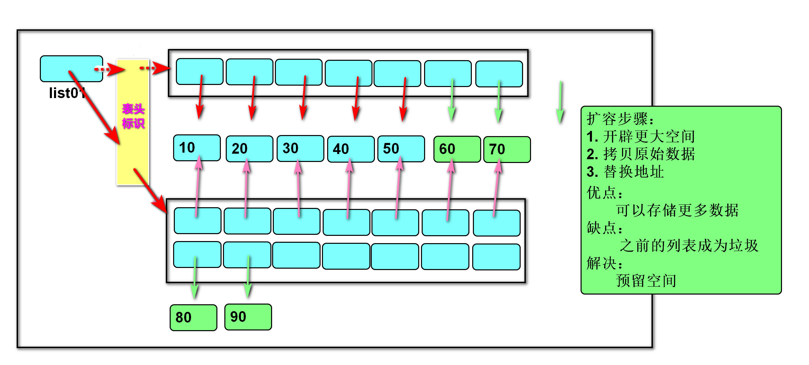

# 1 前言

## 1.1 课程介绍


## 1.2 学习理念

### 1.2.1 弱语法，重本质

>  是一种弱化语言规则，注重程序原理的学习过程。
> 
>  语法是表象，只有了解深层机理，才能灵活运用。
> 
>  学习编程要深入内存，剖析原理，才能看透语法。
> 
>  就像太极“用意不用力，先在心后在身”的道理。

### 1.2.2 是技术，更艺术

>  编程是一门技术，但更是一种艺术。
> 
>  写出高质量的代码（功能性、维护性，灵活性），享受编程所带来的乐趣。

### 1.2.3 项目化，实战化

>  2048核心算法贯穿Python核心。
> 
>  集成操作框架MVC贯穿Python高级。
> 
>  二手房信息管理系统贯穿全阶段。

## 1.3 学习方法

### 1.3.1 当天知识必须理解

1. **What** 是什么，即理解知识点的==**定义**==。
2. **Why** 为什么，即理解知识点的==**作用**==。
3. **Where** 在哪里，即理解知识点的==**适用性**==。
4. **How** 如何使用，即理解知识点的==**语法**==。

### 1.3.2 当天练习必须会做

1. 课堂演示用眼看 demo01、demo02 …
2. 课堂练习动手敲 exercise01、exercise02 …
3. 练习必须独立完成才算会做。

----

- 调查：之前是否有编程语言基础？

## 1.4 身份认知

- 身份：**程序猿**

- **高薪背后程序猿的日常**

  

---

- **程序员的自我成长之路**

  

# 2 Python 简介

## 2.1 计算机基础结构


### 2.1.1 硬件

1944年，美籍匈牙利数学家冯·诺依曼提出计算机基本结构。


> 五大组成部分：**运算器、控制器、存储器、输入设备、输出设备。**

- **1、运算器**：按照程序中的指令，对数据进行加工处理。

- **2、控制器**：根据程序需求，指挥计算机的各个部件协调工作。

---

通常将运算器和控制器集成在中央处理器（CPU）中。


- **3、存储器**：保存各类程序的数据信息。

​      内存RAM -- 容量小，速度快，**临时存储数据**，如：4GB、8GB、16GB、32GB

​      硬盘HDD（SSD) -- 容量大，速度慢，**永久存储数据**，如：256GB、512GB、1TB


- **4、输入设备**：外界向计算机传送信息的装置。

​        例如：鼠标、键盘、扫描仪…

- **5、输出设备**：计算机向外界传送信息的装置。  

​        例如：显示器、音响、打印机…


- **程序加载到内存中，由CPU执行。**

### 2.1.2 软件

> 软件分为：**系统软件与应用软件**。

- **操作系统**

​        -- 管理和控制计算机软件与硬件资源的**程序**。

​        -- 隔离不同硬件的差异，使软件开发简单化。

​        -- 常见操作系统：Windows，Linux（Ubuntu、CentOS、Redhat、Android、HarmonyOS、YunOS），Unix（macOS）。

- **应用软件**

  

  -- 为了某种特定的用途而被开发的软件。

---

- **软件 = 程序 + 文档**

​        ==**程序**==：是一组计算机能识别和执行的指令集合。

​        文档：是为了便于了解程序所需的说明性资料。

## 2.2 基础知识

### 2.2.0 Python 背景

Python的创始人为：**荷兰人 吉多·范罗苏姆** 在1989年圣诞节期间，在阿姆斯特丹为了打发圣诞节的无趣，决心开发一个新的脚本解释程序，作为 ABC语言 的一种继承。之所以选中Python（大蟒蛇的意思）作为该编程语言的名字，是取自英国20世纪70年代首播的电视喜剧《蒙提·派森的飞行马戏团》（Monty Python's Flying Circus），**1991年**发布Python的第一个版本。


### 2.2.1 Python 定义

Python是一门【**简洁优雅**】、【**免费开源**】、【**跨平台**】、【**面向对象**】的【**解释型**】【**计算机高级编程语言**】。

> **1、简洁优雅**：Python是一种代表简单主义思想的语言。阅读一个良好的Python程序就感觉像是在读英语一样。它使你能够==**专注于解决问题**==而不是去搞明白语言本身。
>
> **各种编程语言线上测试链接：http://www.dooccn.com/python3/**


----

> **2、免费开源**：完全提供给用户使用，并开放源代码，允许用户拷贝、改动、著作。

**世界编程语言排行榜：https://www.tiobe.com/tiobe-index/**


---

> **3、跨平台**：Python可以运行不同的系统平台上，比如：MacOS、Windows、Linuxs等主流操作系统；【教学中使用的 Ubuntu 就是基于 Linux 的操作系统】


### 2.2.2 Python执行方式

#### 2.2.2.1 交互式

> - **作用**：在命令行输入指令，回车即可得到结果。
>- **操作**：
>   - (1) 打开终端
>    - (2) 进入交互式：python3
>     - (3) 编写代码：print("hello world") 
>    - (4) 离开交互式：exit()
>   
>- **缺点**：执行的语句会随着交互环境的关闭而消失。

#### 2.2.2.2 文件式

> 将指令编写到 .py 结尾的文件中，即可重复运行程序。
>
> (1)  编写文件
>
> (2)  打开终端
>
> (3)   进入程序所在目录：cd 目录
>
> (4)  执行程序： python3 文件名

### 2.2.3 Linux常用命令

- **ls**：查看指定路径下的所有文件或文件夹
- **pwd**：查看当前工作目录的路径 
- **cd**：改变工作目录（进入到某个目录）

---

**练习**

(1) 在指定目录创建python文件.

   文件名：hello_world1.py

(2) 在文件中写入：print("你好，Python!")

(3) 运行python程序

----

- **总结**

  | 执行方式 | 特点                                         | 使用场景                   |
  | -------- | -------------------------------------------- | -------------------------- |
  | 交互性   | 进入交互环境即可执行简单的语句【退出即销毁】 | 测试单条或语句不多时可使用 |
  | 文件式   | 创建文件，编写语句，执行文件【不删除永存】   | 编写项目或逻辑复杂时使用   |

  

----

### 2.2.4 执行过程

- **计算机只能识别机器码(1010)，不能识别源代码(python)。**

  

(1) 由源代码转变成机器码的过程分成两类：**编译**和**解释**。

(2) **编译**：在程序运行之前，通过编译器将源代码变成机器码，例如：C语言。

 -- 优点：运行速度快

 -- 缺点：开发效率低。

(3) **解释**：在程序运行之时，通过解释器对程序**逐行翻译**，然后执行，例如：JavaScript。

 -- 优点：开发效率高；

 -- 缺点：运行效率较低。

(4) python是解释型语言，但为了提高运行速度，使用了一种编译的方法，编译之后得到 pyc 文件，存储了字节码（特定于Python的表现形式，不是机器码）。

​	源代码 --> 编译 --> 字节码 --> 解释 --> 机器码

​	   |————1次———|

- 不做编译也是可以的，产生的【字节码】文件是需要操作权限，且占用硬盘空间。

### 2.2.5 解释器类型

(1) CPython（C语言开发)

(2) Jython  (Java开发)

(3) IronPython (.net开发)

---

### 2.2.6 Pycharm软件

- **介绍**：是一种Python IDE（Integrated Development Environment，集成开发环境），使用Python语言开发时提高其效率的工具，比如==调试==、==语法高亮==、项目管理、代码跳转、==智能提示==、自动完成、单元测试、版本控制。

- **操作**：【温馨提醒】对于Pycharm软件创建项目操作过程不熟悉的小伙伴，可参照：==《**课前导学-教学环境使用介绍.pdf**》==

- **说明**：若按 Ctrl + Alt + F10 产生黑屏，则可按：Ctrl + Alt + F2 切换模式。

- **特点**：快捷键丰富

  > (1) 移动到本行开头：Home键
  >
  > (2) 移动到本行末尾：End键
  >
  > (3) 注释代码：Ctrl + /
  >
  > (4) 复制行：Ctrl + D
  >
  > (5) 删除行：Ctrl + Y
  >
  > (6) 选择列：Shift + Alt + 鼠标左键
  >
  > (7) 移动行：Ctrl  + Shift + 上下箭头
  >
  > (8) 代码格式化：Ctrl + Alt + L
  >
  > (9) 在光标所在行下新起一行：Shift + Enter


- 【**提醒**】其他快捷键，后续会随着课程进度依次告知，先不必重点记忆。

- 案例：汇率转换

  ```python
  """
      创建文件 : rate_change.py
      汇率转换器：输入指定的美元，将其转换为对应的人民币数，并打印转换后的结果。
  """
  
  # 1. 获取数据 - 美元
  usd = input("请输入美元:")
  
  # 2. 逻辑处理 - 美元 * 6.99
  cny = int(usd) * 6.99
  
  # 3. 输出结果 - xx美元是xx人民币
  print(usd + "美元是" + str(cny) + "人民币")
  
  # 总结
  # 1、熟悉程序编写的逻辑
  # 2、程序出错要学会排错
  ```

  

# 3 数据基本运算

## 3.1 基础知识

### 3.1.1 注释 Note

- 作用：给人看的，通常是对代码的描述信息。

> (1) 单行注释：以#号开头。
>
> (2) 多行注释：三引号开头，三引号结尾。

### 3.1.2 函数 Function

- 作用：表示一个特定的功能，函数定义者是提供功能的人，函数调用者是使用功能的人。
- **如何掌握好一个函数？** 
  - **（1）功能** 
  - **（2）参数** 
  - **（3）返回值**

---

#### **3.1.2.1 print 函数** 

- 语法：**print(value, ..., sep=' ', end='\n')**
- 作用：将括号中的内容显示在控制台中
- 参数：
  - **value**：表示要打印的数据，可以有0个、1个或多个。
  - **sep**：分隔符，两个值或两个以上值的分隔方式，默认为一个空格
  - **end**：结尾符，数据输出完毕后末尾打印的字符串，默认为换行符 ‘\n’
- 返回值：无
- 说明：
  - 1、sep 表示2个或2个以上数据内容之间的分隔方式，对单个数据无效。
  - 2、要实现不换行只需将end 的 \n 修改为其他字符。
  - 3、end 与 sep 2个参数设置无先后顺序。
- > **适用性**：显示结果

---

#### **3.1.2.2 input 函数** 

- 语法：**变量名 = input(prompt=None)** 
- 作用：将用户输入的内容赋值给变量
- 参数：
  
  - **prompt**：表示提示信息(输入显示的内容），默认为空
- 返回值：
  
  - 输入的【**字符串**】数据
- 说明
  - 1、阻塞等待用户输入。
  - 2、推荐添加提示信息。
- > **适用性**：获取数据

---

> **与计算机交互：**
>
> 

----

练习1: 在终端中显示古诗“登高”

效果：

​                     登高

​                 作者：杜甫

风急天高猿啸哀，渚清沙白鸟飞回。

无边落木萧萧下，不尽长江滚滚来。

万里悲秋常作客，百年多病独登台。

艰难苦恨繁霜鬓，潦倒新停浊酒杯。

---

练习2：分红包，在终端输入红包金额、红包个数，打印每人平均可以分得的金额。

效果：

请输入红包金额：10

请输入红包个数：5

打印：每人平均可以分得的金额：2 元

## 3.2 数据 data

### 3.2.1 变量 variable


- (1)  定义：关联一个数据对象的标识符。

- (2)  ==**命名规则**==

> A）由数字、字母、下划线组成
>
> B）不能以数字开头
>
> C）严格区分大小写
>
> D）不能使用Python关键字【深蓝色加粗】
>
> E）不能使用Python内置函数名

- <font>不能使用关键字(蓝色)，否则发生语法错误SyntaxError。</font>               

---

- **(3)  命名方法**
  - **驼峰命名法**【大驼峰/小驼峰】
  
  - **匈牙利命名法**【每个单词之间使用下划线方式连接】
  
    ```python
    # 大驼峰命名法: 每个单词首字母大写
    SaveToExcel  HelloWorld
    
    # 小驼峰命名法：第一个单词首字母小写，其他单词首字母大写
    saveToExcel  helloWorld
    
    # 匈牙利命名法：每个单词之间使用下划线方式连接
    save_to_Excel   connect_To_MySQL
    ```
  
- **应用场景**

  > 变量名、函数名、类名、文件名、项目名等名字的定义。
  >
  > ==**【核心：见名知意】**==

---

### 3.2.2 赋值 assignment


- 作用：创建或改变一个变量关联的数据对象。
- 语法：

  - **变量名 = 数据对象**

  - **变量名1 = 变量名2 = 数据对象**

  - **变量名1, 变量名2 = 数据对象1, 数据对象2**      **==【数据交换】==**
- 说明：
  - 1、变量在使用前必须先赋值。
  - 2、一个变量只能绑定在一个数据对象上 
  - 3、一个对象可以被多个变量所关联
  
  - 示例
  
    ```python
    # 1、变量在使用前必须先赋值
    print(first_name)
    
    # 2.1 创建
    first_name = '冰墩墩'
    print(first_name)
    
    # 2.2 修改：一个变量只能绑定在一个对象上
    first_name = '雪容融'
    print(first_name)
    
    # 3、一个对象上可以关联多个变量
    second_name = '欢欢'
    first_name = second_name
    print(first_name)
    ```
  
    

### 3.2.3 删除语句 del

(1) 语法: 

- **del 变量名**
- **del 变量名1, 变量名2, …**

(2) 作用：

- 用于删除变量，同时解除与对象的关联（**如果可能则释放数据对象**）

```python
name1 = '悟空'
name2 = '八戒'

# 方式1：
del name1
print(name1)    # NameError: name 'name1' is not defined【名字错误：名字 name1 没有定义】

# 方式2：
del name1, name2
print(name1, name2)     # 名字错误：变量名未定义
```

(3) **自动化内存管理的引用计数**：

- 每个对象记录被变量绑定(引用)的次数，当引用次数为0时被销毁。

> 数据的内存构成：
>
> 1、id：存储空间地址，唯一，由操作系统分配。
>
> 2、type：数据类型，记录数据的类型状态。
>
> 3、value：变量值，存储的是值本身。
>
> 4、references：引用次数，数据对象被引用的次数。

---

> **练习**：**画出以下代码的内存图，并说出终端显示的结果**
>
> ```python
> name_of_beijing, region = '北京', '市' 
> 
> # 拼接后称为一个独立的数据对象，不受源数据的变化而影响
> name_of_beijing_region = name_of_beijing + region     # '北京市'
> 
> region = '省'
> print(name_of_beijing_region)      
> 
> del name_of_beijing_region
> print(name_of_beijing_region)       
> ```

---

### 3.2.4 核心类型 CoreType

> 在python中变量没有类型，但关联的对象有类型。

#### 3.2.4.1 整型 int

(1) 包含正数、负数、0。

​	如： -5, 100, 0

(2) 字面值：

​	**十进制（Decimal）**：每位用十种状态计数，逢十进一，写法是0~9。

```python
num01 = 10
```

​	**二进制（Binary）**：每位用二种状态计数，逢二进一，写法是0b开头，后跟0或者1。

```python
num02 = 0b10
```

​	**八进制（octal）**：每位用八种状态计数，逢八进一，写法是0o开头，后跟0~7。

```python
num03 = 0o10
```

​	**十六进制（Hexadecimal）**：每位用十六种状态计数，逢十六进一，写法是0x开头，后跟0-9, A-F, a-f

```python
num04 = 0x10
```
> **适用性**：用于描述整数

#### 3.2.4.2 浮点型 float 

(1) 包含正数、负数，0.0。

(2) 字面值：

​	**小数**：1.0, 2.5, -3.14, 0.0

​	**科学计数法**：

​		e/E (正负号) 指数 

​         1.23e-2 (等同于0.0123)

​         1.23456e5(等同于123456.0)

```python
# 小数
num01 = 1.23

# 科学计数法
num02 = 1e-5
print(0.00001)
```

> **适用性**：用于描述的是小数

#### 3.2.4.3 字符串 str

(1) 用来记录文本信息(文字信息)。

(2) 字面值：单引号、双引号

```python
name01 = '龟叔'
print(name01)

name02 = "龟叔"
print(name02)
```

> **适用性**：用于描述文本信息

#### 3.2.4.4 布尔类型 bool

(1) 用来表示真和假的类型

(2) 只有两个值：

​	True 表示真(条件满足或成立)，本质是1

​	False 表示假(条件不满足或不成立)，本质是0

（3）注意：

​		<font>True、False 关键字首字母大写。</font>

```python
result = input("请输入您的职业:") == "老师"
print(result)  # 输入老师,结果True;输入其他,结果False
```

> **适用性**：用于描述逻辑关系

---

#### 3.2.4.5 空值对象 None

（1）概念：表示不存在的特殊对象。

（2）作用：占位和解除与对象的关联。

> **适用性**：用于描述不存在的对象。

---

==**扩展：**==

- 格式：**type(object)**
- 作用：查看对象的数据类型。
- 参数：**object**：查看的数据对象。
- 返回值：对象的数据类型（\<class 'xxx'>）

---

| 数据类型 | 英文  | 用法                                  | 作用             |
| -------- | ----- | ------------------------------------- | ---------------- |
| 整型     | int   | 如：5 0 -5                            | 描述整数         |
| 浮点数型 | float | 如：3.14  -3.14  0.0  3e5   3e-5      | 描述小数         |
| 字符串型 | str   | 如：'python'  "python"   '''字符串''' | 描述文本         |
| 布尔类型 | bool  | 如：True   False                      | 描述逻辑关系     |
| 空值类型 | None  | 如：None                              | 描述不存在的对象 |

## 3.3 运算 operation

### 3.3.1 类型转换 TypeChange

> (1) 转换为整形:  int(数据)
>
> (2)  转换为浮点型: float(数据)
>
> (3)  转换为字符串: str(数据)
>
> (4)  转换为布尔：bool(数据)
>
> ​     结果为假：0  0.0  ''  ""  False  None

- <font>注意</font>：字符串转为其他类型时，必须 "长得像" 目标类型。

> **适用性**：用于转换为指定的数据类型。

---

```python
# str -> int
data01 = int("3")

# int -> str
data02 = str(5)

# str -> float
data03 = float("1.2")

# float -> str
data04 = str(1.2)

# int -> float
data05 = float(250)

# float -> int
data06 = int(1.9)
print(data06)     # 1   向下取整(截断删除)

# 注意：字符串转为其他类型时，必须 "长得像" 目标类型。
# print(int("10.5"))　# 报错
# print(float("abc"))  # 报错
```

---

练习：在终端中输入商品单价、购买的数量和支付金额，计算应该找回多少钱。

效果：

请输入商品单价：5

请输入购买数量：3

请输入支付金额：20

应找回：5.0

---

- **二、八、十六进制转十进制** 
  - 按权展开求和法
- **十进制转二、八、十六进制**
  - 除基取余逆读法
- bin(number)：将整型转为二进制
- oct(number)：将整型转为八进制
- hex(number)：将整型转为十六进制


### 3.3.2 运算符 operator

#### 3.3.2.1 算术运算符 arithmetic 

\+   加法

\-   减法

\*   乘法

/   除法：获取小数商，结果为浮点数

//  整除：获取整数商，除的结果去掉小数部分

%  求余：获取余数

**  幂运算

> 说明：凡是浮点数参与的运算结果一定是浮点型
>
> **适用性**：用于数值型数据的计算。

---

**优先级从高到低：**

 ()

**

\* / % //

\+ -

---

练习1：古代的秤，一斤十六两。在终端中获取两，计算几斤零几两。

效果：

请输入总两数：100

结果为：6斤4两


练习2：从终端中录入：位移、时间、初速度，计算：加速度

匀变速直线运动的速度与位移公式：

位移 = 初速度 × 时间 + 加速度 * 时间的平方 / 2

效果：

请输入距离：100

请输入初速度：6

请输入时间：10

加速度是：0.8


练习3：反转一个3位数：

输入任意的3位数，如:

输入：123，输出：321

输入：120，输出：21

输入：100，输出：1

---

#### 3.3.2.2 增强运算符 enhanced

y += x     相当于 y = y + x

y -= x      相当于 y = y - x

y *= x      相当于 y = y * x

y /= x      相当于 y = y / x

y //= x     相当于 y = y // x

y %= x     相当于 y = y % x

y \**= x     相当于 y = y ** x

---

**作用**：为算术运算符增加对自身赋值的功能。

> **适用性**：用于数据的累积计算。

---

```python
data01 = 10
data01 = data01 + 5
print(data01)  # 10

data01 += 5   # 等同于：data01 = data01 + 5
print(data01)  # 15
```

---

练习：在终端中输入一个四位整数，计算每位相加和。

例如：录入1234，打印1+2+3+4结果

效果：

请输入四位整数：1234

结果是：10

---

#### 3.3.2.3 比较运算符 compare

 <     小于

 <=    小于等于

 \>     大于

 \>=    大于等于

 ==    等于

 !=     不等于

---

> **适用性**：用于数据之间的对比计算。
>
> **返回值**：布尔类型的值（True/False）

```python
result01 = 5 > 10
print(result01)   # False

result02 = 15 != 10
print(result02)   # True

x = 66
result02 = 0 <= x <= 100
print(result02)   # True
```

---

练习1：写出下列代码表达的命题含义

```python
print(666 == "666")
print(input("你爱我吗? ") == "爱")
print(float(input("请输入你的身高：")) > 170)
```

练习2： 根据命题写出代码

- 输入的是正整数

- 输入的是正确月份

- 输入的不是偶数

----

#### 3.3.2.4 逻辑运算符 logic

**(1) and - 与**

- 作用：表示【**并且**】的关系【**一假俱假**】    
- 格式：**表达式1 and 表达式2**
- 说明：只要表达式其中一个为False，结果都为False

示例:

| 表达式1 | 表达式2 | 返回值 |
| :-----: | :-----: | :----: |
|  True   |  True   |  True  |
|  True   |  False  | False  |
|  False  |  True   | False  |
|  False  |  False  | False  |

----

**(2) or - 或**

- 作用：表示【**或者**】的关系【**一真俱真**】    
- 格式：**表达式1 or 表达式2**
- 说明：表达式中只要一个为真结果都为True

示例:

| 表达式1 | 表达式2 | 返回值 |
| :-----: | :-----: | :----: |
|  True   |  True   |  True  |
|  True   |  False  |  True  |
|  False  |  True   |  True  |
|  False  |  False  | False  |

---

**(3) not - 非**

- 作用：表示【**取反**】的关系【**真亦假，假亦真**】    
- 格式：**not 表达式**
- 说明：如果表达式1为真，则返回 False，否则返回 True 

| 表达式1 | 返回值 |
| :-----: | :----: |
|  True   | False  |
|  False  |  True  |

---

> **适用性**：判断命题之间的关系

---

**练习**: 根据命题写出代码

- 年龄大于25 并且 身高小于170

- 职位是高管 或者 年薪大于500000

---

**(4) 短路运算**

 说明：一但结果确定，后面的语句将不再执行。

 扩展：逻辑运算时，尽量将复杂的（耗时的）判断放在最后面

- and：如果表达式1为假，则返回表达式1（表达式2不执行），否则返回表达式2 
- or：如果表达式1为真，则返回表达式1（表达式2不执行），否则返回表达式2 

示例：

```python
int(input("请输入身高（m）:")) > 1.8 and int(input("请输入资产:")) == 1000000
int(input("请输入身高（m）:")) > 1.8 or int(input("请输入资产:")) == 1000000
```

图示：


#### 3.3.2.5 身份运算符 identity

(1) 语法

```python
x is y
x is not y
```

(2) 作用

- is 用于判断两个对象是否是同一个对象, 是时返回True,否则返回False；is not 的作用与is相反

(3) 说明

- 是否为同一个对象：对象的内存存储地址是否一致。

---

> **适用性**：用于是否是同一个对象的判定。

==**扩展：**==

- 格式：**id(object)**
- 作用：查看对象的计算机内存地址
- 参数：**object**：表示查看的对象
- 返回值：对象在计算机的内存地址（十进制）

---

**小整数池**：系统会划分一片区域存储常用的一些常用整数和纯字母，范围为：[-5, 256]，包含：字母、 纯字母、符号等，程序初始化时，被Python在内存中存储到一个固定的内存空间中【如果没有这些会导致系统频繁的创建、回收，增大对资源的消耗】。

**大整数池**：没有提前创建好的数据存储空池子，需要自行创建 ，当你创建好，则会把整数对象保存到池子里，没有固定的内存地址。

---

#### 3.3.2.6 优先级 priority

从高到低：

​	算术运算符（()   **   * / % //    +  -）

​	比较运算符（> >= < <=  ==  !=）

​	增强运算符（*=  /=  %=  //=   +=  -=）

​	身份运算符（is  is not）

​	逻辑运算符（not   and   or）

# 4 语句 statement

## 4.1 行 line

(1) 物理行：程序员编写代码的行。

(2) 逻辑行：python解释器需要执行的指令。

(3) 建议：

- 一个逻辑行在一个物理行上。

- 如果一个物理行中使用多个逻辑行，需要使用分号 ；隔开==【不推荐】==。

(4) 换行： 

​	如果逻辑行过长，可以使用隐式换行或显式换行。

​	**隐式换行**：所有括号的内容换行，称为隐式换行【括号包括: () []  {} 三种】

​	**显式换行**：通过折行符 \ (反斜杠)换行，必须放在一行的末尾，目的是告诉解释器，下一行也是本行的语句。 

```python
# 4个物理行 4个逻辑行
a = 1
b = 2
c = a + b
print(c)

# 1个物理行 4个逻辑行(不建议)
a = 1;b = 2;c = a + b;print(c)

# 4个物理行 1个逻辑行
# -- 换行符
d = 1+\
    2+\
    3+4\
    +5+6

# -- 括号
e = (1+2+
     3+4
     +5+
     6)
```

---

**程序执行的3个结构：顺序结构、选择结构、循环结构**

- **顺序结构**：程序本来就是按照从上至下顺序执行【**默认**】。
- **选择结构**：if 语句。 
- **循环结构**：while循环语句、for循环语句。


## 4.2 选择语句

### 4.2.1 if 语句

(1)  作用:

- 让程序**根据条件选择性的执行**某条或某些语句。       


#### 4.2.1.1 if 结构

- **格式：**

```python
语句0
if 条件表达式:
	语句1
语句2
```

- **流程：**


> **适用性**：仅判断事物1种情况

- 示例：

  ```python
  sex = input("请输入性别 [男/女]:")
  
  if number == "男":
      print("您好，先生")
  ```

---

#### 4.2.1.2 if-else结构

- **格式：**

```python
语句0
if 条件表达式:
	语句1
else:
        语句2
```

- **流程：**


> **适用性**：判断事物2种情况

- 示例：

  ```python
  sex = input("请输入性别 [男/女]:")
  if number == "男":
      print("您好，先生")
  else:
      print("您好，女士")
  ```

---

#### 4.2.1.3 if-elif-else结构

- **格式：**

```python
语句块0
if 条件表达式1:
     语句块1
elif 条件表达式2:
     语句块2
elif 条件表达式3:
     语句块3
...
else:
     语句块n
```

- **流程：**


- **说明**:
  - elif 子句可以有0个或多个。

  - else 子句可以有0个或1个，且只能放在 if 语句的最后。

> **适用性**：判断事物3种或多种以上情况

- 示例：

  ```python
  sex = input("请输入性别 [男/女]:")
  
  if number == "男":
      print("您好，先生")
  elif number == "女":
      print("您好，女士")
  else:
      print("性别未知")
  ```

---

#### 4.2.1.4 代码调试 Debug

- **功能**：让程序中断，逐行执行。
- **目的**：审查代码的执行流程，明确每行执行的结果。
- **流程**：
  - **1、添加断点**：点击代码行【】前，出现红点。 
  - **2、调试模式**：右击选择 “debug” 。
  - 3、点击 “向下” 或 F7，逐行语句执行。
  - 4、Ctrl + F2 或 点击红色方块 结束调试模式。


---

练习1:

在终端中输入整数，打印是正数、负数、零


练习2：

在终端中输入课程阶段数,显示课程名称

效果：

  输入：                     输出：

​    1          					Python语言核心编程

​    2          					Python高级软件技术

​    3          					Web 全栈

​    4           				  项目实战

​    5           				  数据分析、人工智能


练习3：

在终端中录入4个同学身高,打印最高的值.

算法：

170  160  180  165

假设第一个就是最大值

使用假设的和第二个进行比较, 发现更大的就替换假设的

使用假设的和第三个进行比较, 发现更大的就替换假设的

使用假设的和第四个进行比较, 发现更大的就替换假设的

最后，假设的就是最大的.

效果：

请输入第1个同学身高:170

请输入第2个同学身高:160

请输入第3个同学身高:180

请输入第4个同学身高:165

最高的同学:180


练习4：

根据心理年龄与实际年龄，打印智商等级。

智商IQ = 心理年龄MA 除以 实际年龄CA 乘以 100

天才：140以上（包含）

超常：120-139之间（包含）

聪慧：110-119之间（包含）

正常：90-109之间（包含）

迟钝：80-89之间（包含）

低能：80以下

-----

### 4.2.2 真值表达式

- **定义**：条件表达式的布尔结果为真。

```python
if 100:
	print("真值")
    
# 等同于
if bool(100):
	print("真值")
```

---

练习：在终端中输入一个整数，如果是奇数为变量state赋值 "奇数"，否则赋值"偶数"。

效果：

​    请输入数字: 6

​	state变量存储的是：偶数

----

### 4.2.3 if 语句嵌套

- 定义：if 语句中嵌套 if 语句

> **适用性**：**分情况**逐步判断

```python
month = int(input('请输入一个月份：'))

if 0 < month < 13:
    if month < 4:   # month=1 2 3
        print('春季')
    elif month < 7: # month=4 5 6
        print('夏季')
    elif month < 10: # month=7 8 9
        print('秋季')
    else:   # month=10 11 12
        print('冬季')
else:
    print('月份输入错误')
```

---

练习1：商场推出了商品优惠活动，活动内容如下：

1、如果是VIP客户，消费小于500元，则享受85折，否则享受8折。

2、若不是VIP客户，消费大于800元，则享受9折，否则原价。

根据用户输入的账户类型及消费金额，打印折扣信息及折扣后的应付金额。


练习2：模拟北京出租车计价器 

​    1、起步价：13元（包含3公里）； 

​    2、超过3公里，但没超过15公里的部分，每公里2.3元 

​    3、超过15公里的部分，每公里加收2.3元的 50% 

​    要求：计算并打印应付的车费，小数部分保留2位数。

---

### 4.2.4 if 条件表达式

 (1) 语法：变量 = 结果1 if 条件 else 结果2

```python
value = 1 if input("请输入性别:") == "男" else 0
```

 (2) 作用：根据条件(True/False) 来决定返回结果1还是结果2。

 (3）说明：**<u>复杂的逻辑判断代码可读性差</u>**

> **适用性**：判断简单的2种情况

---

练习：

​	在终端中输入一个年份，如果是闰年为变量day赋值29，否则赋值28。

​    闰年条件：年份能被4整除但是不能被100整除，或者年份能被400整除

效果：

​    请输入年份:2020

​	2020年的2月有29天

---

- 总结

  ```python
  结构1：if 语句: 只做1种情况的判断
  结构2：if-else语句：2种情况的判断
  结构3：if-elif-else语句：3种或3种以上情况的判断
  结构4：if语句嵌套：分情况逐步判断 
  结构5：if条件表达式：简单的2种情况判断
  ```

## 4.3 循环语句

### 4.3.1 while 语句

(1) 作用: 

- 根据满足的条件**重复**执行。

(2) 语法:

```python
while 真值表达式:
      满足条件执行的语句
else:
      不满足条件执行的语句
```

(3) 说明:

- else子句可以省略。

---

> **适用性**：根据一定的条件重复执行语句。

```python
count = 0  # 1. 开始 
while count < 3:  # 2. 结束
    print(count)  # 0  1  2
    count += 1  # 3. 间隔
```

---

练习1：

在终端中显示0 1 2 3

在终端中显示2 3 4 5 6

在终端中显示1 3 5 7

在终端中显示8 7 6 5 4

在终端中显示-1 -2 -3 -4 -5


练习2：

在终端中循环录入5个成绩,

最后打印平均成绩(总成绩除以人数)

效果：

请输入成绩：98

请输入成绩：83

请输入成绩：90

请输入成绩：99

请输入成绩：78

平均分：89.6


练习3：

一张纸的厚度是0.01毫米

请计算，对折多少次超过珠穆朗玛峰(8844.43米)

思路:

数据：厚度、高度、次数

算法：厚度*=2      次数+=1

---

### 4.3.2 for 语句

(1) 作用:

- 用来**遍历** **可迭代对象**的数据元素。

---

**可迭代对象**：指能依次获取数据元素的对象，例如：容器类型。

**遍历**：指将可迭代对象中数据依次赋值给变量的过程。


**可迭代对象**：可以看作是购物车。

**数据元素**：可以看作是购物车中的 ‘每件商品’。

**遍历**：可以看作是从购物车中将每件商品取出结账的重复过程。

---

(2)  语法:

```python
for 变量列表 in 可迭代对象:
       循环体
else:
       语句块
```


(3) 说明:

- else子句可以省略，且放在最后。
- 在循环体内用break终止循环时，else子句不执行。

> **适用性**：根据可迭代对象获取数据。

```python
message = "我是齐天大圣孙悟空"

for item in message:
    print(item)  
```

---

练习:

在终端中输入任意整数，计算累加和.

"1234" -> "1" -> 累加 1

效果：

请输入一个整数:12345

累加和是 15

---

#### 4.3.2.1 range 函数

- **range(start, stop[, step])**
- 作用：用来创建一个**生成一系列整数的可迭代对象**(也叫整数序列生成器)。

- 参数：
  - **start**：起始值，默认为0【可省略】
  - **stop**：终止值，必须存在，且终止值无法取得
  - **step**：步长，默认为1，可正可负【可省略】
    - 正值：表示正向取值（数据从小到大）
    - 负值：表示反向取值（数据从大到小）
- 注意： 
  - 1、取值反向与步长方向不一致则为空  
  - 2、起始值与终止值相同,则结果为空


```python
# 写法1:range(开始, 结束, 间隔)
# 注意:不包含结束值
for item in range(1, 3, 1):
    print(item)

# 写法2:range(开始, 结束)
# 注意:间隔默认为1
for item in range(1, 3):
    print(item)

# 写法3:range(结束)
# 注意:开始默认为0
for item in range(3):
    print(item)
```

---

练习：

在终端中打印 0 1 2 3

在终端中打印 2 3 4 5 6

在终端中打印 1 3 5 7

在终端中打印 8 6 4 2 0

在终端中打印 -1 -2 -3 -4 -5

---

- **总结**

  | range格式                | 描述                                    |
  | ------------------------ | --------------------------------------- |
  | range(stop)              | 生成 [0, stop) 之间的整数               |
  | range(start, stop)       | 生成 [start, stop) 之间的整数           |
  | range(start, stop, step) | 生成 [start, stop) 之间间隔 step 的整数 |

  

### 4.3.3 跳转语句

#### 4.3.3.1 break 语句

**作用**：用来终止当前循环语句的执行。

说明：

- (1) while/for循环中执行了break语句，则后面的代码不再执行。
- (2) while/for循环中执行了break语句，则else部分不执行。
- (3) 只能用在循环中(while/for)。

----

#### 4.3.3.2 continue 语句

**作用**：跳过本次，继续下次循环。

**说明**：

- (1) while循环中执行了continue语句，后面的代码不再执行。
- (2)  只能用在循环中(while/for)。

**注意**：

- 在while循环中需要将变化条件语句放在continue语句之前。

```python
# 需求：累加1-100之间能被3整除的数字
# 思想：不满足条件跳过,否则累加.
sum_value = 0
for item in range(1, 101):
    if item % 3 != 0:
        continue
    sum_value += item
print(sum_value)
```

---

练习1：程序产生1个 1到100之间的随机数，玩家仅有3次猜测机会，每次提示：大了、小了，同时打印剩余的机会数，如果3次机会内猜对，则打印恭喜您猜对了。

效果：

请输入要猜的数字:80

大了

剩余 2 次机会

请输入要猜的数字:62

小了

剩余 1 次机会

请输入要猜的数字:66

恭喜您猜对了


练习2：累加10 -- 60之间，个位不是3/5/8的整数和。 


练习3：用户输入数，打印 xx 是（不是）素数


### 4.3.4 while 死循环

- 定义：真值表达式一直成立的while循环

- 语法：

  ```python
  while True:
        # 循环体
        break
  ```

- 说明：

  - while 死循环通常与 break 语句结合使用。

- 常用写法：

  ```python
  # 循环录入数据，直到输入为空，则结束输入
  
  while True:
       data = input('请输入：')
       if data == '':
       	break
       ...
  ```


- > **适用性**：未知循环次数重复执行。

---

练习1：程序产生1个 1到100之间的随机数，让玩家重复猜测,直到猜对为止，每次提示：大了、小了、恭喜猜对了,总共猜了多少次。

效果：

请输入要猜的数字:50

大了

请输入要猜的数字:25

小了

请输入要猜的数字:35

大了

请输入要猜的数字:30

小了

请输入要猜的数字:32

恭喜猜对啦,总共猜了5次


练习2：模拟网页登录，编写实现逻辑。

  设定初始的一个用户名与密码，限定有3次用户名及密码的验证机会，在3次机会内能输入正确，则打印登录成功；在3次机会内：如果用户名与密码都错误，则需用户重新录入用户名与密码；如果用户正确，则仅需验证密码；同时在3次机会内需提示用户剩余多少次机会；最后当3次机会使用完毕，则打印账号被锁定；

---

### 4.3.5 while 循环嵌套

- 定义：while循环中嵌套while循环

- 语法：

  ```python
  语句0
  while 真值表达式1:
  	语句1
  	while 真值表达式2:
  	        语句2
  ```

> **适用性**：根据一定的条件进行多次的循环。

----

### 4.3.6 for 循环嵌套

- 定义：for循环中嵌套for循环

- 语法：

  ```python
  for 变量1 in 可迭代对象1:
  	for 变量2 in 可迭代对象2:
  	        循环体
  ```

> **适用性**：根据可迭代对象中数据进行多次的循环。

---

示例：数字坐标矩阵：

|   （0, 0）   |   （0, 1）   |   （0, 2）   |   （0, 3）   |
| :----------: | :----------: | :----------: | :----------: |
| **（1, 0）** | **（1, 1）** | **（1, 2）** | **（1, 3）** |
| **（2, 0）** | **（2, 1）** | **（2, 2）** | **（2, 3）** |
| **（3, 0）** | **（3, 1）** | **（3, 2）** | **（3, 3）** |

----

练习1：输入边长，打印数字矩形。

效果：

请输入边长：4

0 1 2 3

1 2 3 4

2 3 4 5

3 4 5 6

请输入边长：6

0 1 2 3 4 5

1 2 3 4 5 6

2 3 4 5 6 7

3 4 5 6 7 8

4 5 6 7 8 9 

5 6 7 8 9 0 


练习2：生成正99 乘法表

```python
# 正乘法表
1*1=1 
1*2=2 2*2=4 
1*3=3 2*3=6 3*3=9 
1*4=4 2*4=8 3*4=12 4*4=16 
1*5=5 2*5=10 3*5=15 4*5=20 5*5=25 
1*6=6 2*6=12 3*6=18 4*6=24 5*6=30 6*6=36 
1*7=7 2*7=14 3*7=21 4*7=28 5*7=35 6*7=42 7*7=49 
1*8=8 2*8=16 3*8=24 4*8=32 5*8=40 6*8=48 7*8=56 8*8=64 
1*9=9 2*9=18 3*9=27 4*9=36 5*9=45 6*9=54 7*9=63 8*9=72 9*9=81 

# 倒乘法表
1*9=9 2*9=18 3*9=27 4*9=36 5*9=45 6*9=54 7*9=63 8*9=72 9*9=81 
1*8=8 2*8=16 3*8=24 4*8=32 5*8=40 6*8=48 7*8=56 8*8=64 
1*7=7 2*7=14 3*7=21 4*7=28 5*7=35 6*7=42 7*7=49 
1*6=6 2*6=12 3*6=18 4*6=24 5*6=30 6*6=36 
1*5=5 2*5=10 3*5=15 4*5=20 5*5=25 
1*4=4 2*4=8 3*4=12 4*4=16 
1*3=3 2*3=6 3*3=9 
1*2=2 2*2=4 
1*1=1 
```

---

- 总结

  | 循环方式       | 开始条件        | 结束条件                       | 变化条件        |
  | -------------- | --------------- | ------------------------------ | --------------- |
  | while 循环嵌套 | 变量名 = 初始值 | while 变量名 比较运算符 终止值 | 变量名 = 间隔值 |
  | for 循环嵌套   | start = 初始值  | stop = 终止值                  | step = 间隔值   |

# 5 容器类型

## 5.1 通用操作

### 5.1.1 数学运算符

(1) +：用于拼接两个容器

(2) +=：用原容器与右侧容器拼接,并重新绑定变量

(3) *：重复生成容器元素

(4) *=：用原容器生成重复元素, 并重新绑定变量

(5) < <= > >= == !=：依次比较两个容器中元素，一但不同则返回比较结果。

> **适用性**：字符串、列表、元组

```python
# 1. 拼接2个容器元素
name = "悟空"
name += "八戒"
print(name)  # 悟空八戒

# 2. 容器元素重复
name = "唐僧"
name *= 2
print(name)  # 唐僧唐僧

# 3. 比较运算：依次比较两个容器中元素,一但不同则返回比较结果。
print("悟空" > "唐僧")
```

----

练习：

在终端中获取一个整数，作为边长，打印矩形。

效果：

请输入整数:5

$$$$$

$     $

$     $

$     $

$$$$$


请输入整数:8

$$$$$$$$

$          $

$          $

$          $

$          $

$          $

$          $

$$$$$$$$

----

### 5.1.2 成员运算符

(1) 语法：

- 数据 in 序列

- 数据 not in 序列

(2) 作用：

- 如果在指定的序列中找到值，返回bool类型（True/False）。

> **适用性**：字符串、列表、元组、字典、集合容器。

```python
# 4. 成员运算
# True
print("悟空" in "我是齐天大圣孙悟空")
print("圣孙" in "我是齐天大圣孙悟空")

# False
print("齐圣" in "我是齐天大圣孙悟空")
print("圣大" in "我是齐天大圣孙悟空") 
```

### 5.1.3 索引 index

(1) 作用：定位单个容器元素。

(2) 语法：sequence[index]

(3) 说明：

- 正向索引从0开始，第二个索引为1，最后一个为len(s)-1。

- 反向索引从-1开始，-1代表最后一个，-2代表倒数第二个,以此类推，第一个是 -len(s)。

(4) 函数：

- 语法: len(str)
- 作用：返回字符串的长度

|  str   |  我  |  是  |  花  |  果  |  山  |  齐  |  天  |  大  |  圣  |
| :----: | :--: | :--: | :--: | :--: | :--: | :--: | :--: | :--: | :--: |
| index  |  0   |  1   |  2   |  3   |  4   |  5   |  6   |  7   |  8   |
| -index |  -9  |  -8  |  -7  |  -6  |  -5  |  -4  |  -3  |  -2  |  -1  |

> **适用性**：用于字符串、列表、元组等有序序列容器中。

-----

```python
message = "我是花果山齐天大圣"

print(message[2])    # 花
print(message[-2])   # 大
print(len(message))  # 9

# 注意：索引不能越界 IndexError
# print(message[99])
# print(message[-99]) 
```

---

### 5.1.4 切片 slice

- 语法：**sequence[[start] : [stop [: step]]]**

- 作用：定位多个容器元素。

- 参数：

  - start：起始索引值，默认表示字符串的最开头位置【可省略】

  - stop：结束索引值，不含终止索引值，默认表示字符串的最末尾位置【可省略】

  - step：步长，元素移动的方向和偏移量，默认为1【可省略】

    - ① 当步长为正数时，取正向切片；

    - ② 当步长为负数时，取反向切片。

      

  
  
  ---

> **适用性**：用于字符串、列表、元组等有序序列容器中。

```python
message = "我是花果山齐天大圣"
print(message[2:5:1])  # 花果山
print(message[1: 5])   # 是花果山
print(message[2:-4])   # 花果山
print(message[:-4])    # 我是花果山
print(message[:])      # 我是花果山齐天大圣
print(message[-3:])    # 天大圣 
print(message[:2])     # 我是
print(message[-2:])    # 大圣
print(message[-2: 3:-1])  # 大天齐山
print(message[1: 1])  # 空
print(message[2: 5:-1])  # 空
# 特殊:翻转
print(message[::-1])  # 圣大天齐山果花是我
```

---

练习：

  字符串： content = "我是京师监狱狱长金海。"

  打印第一个字符、最后一个字符、中间字符

  打印字前三个符、打印后三个字符

  命题：金海在字符串content中

  命题：京师监狱不在字符串content中

  通过切片打印“京师监狱狱长”

  通过切片打印“长狱狱监师京”

  通过切片打印“我师狱海”

  倒序打印字符

### 5.1.5 内建函数

- len(x)   返回序列的长度

- max(x)  返回序列的最大值元素

- min(x)  返回序列的最小值元素

- sum(x)  返回序列中所有元素的和(元素必须是数值类型)

## 5.2 字符串 str

### 5.2.1 定义

- 由一系列字符组成的**不可变** **有序** 序列容器，存储的是字符的编码值。


**特点：**占用连续内存空间，按需存储 --> ‘存储多少个字符开辟多大的存储空间’

> **适用性**：存储数字、字母、符号等文字信息

### 5.2.2 编码

#### 5.2.2.1 基础知识

(1) 字节byte：计算机最小存储单位，等于8 位bit.

(2) 字符：单个的数字，文字与符号。

(3) 字符集(码表)：存储字符与二进制序列的对应关系。

(4) 编码：将字符转换为对应的二进制序列的过程。

(5) 解码：将二进制序列转换为对应的字符的过程。

#### 5.2.2.2 编码方式

(1) ASCII编码：包含英文、数字等字符，每个字符1个字节。

(2) GBK编码：兼容ASCII编码，包含21003个中文；英文1个字节，汉字2个字节。

(3) Unicode字符集：国际统一编码，旧字符集每个字符2字节，新字符集4字节。

(4) UTF-8编码：Unicode的存储与传输方式，英文1字节，中文3字节。


网站：https://unicode-table.com/cn/

#### 5.2.2.1 相关函数

(1) ord(字符串): 返回该字符串的Unicode码。

(2) chr(整数): 返回该整数对应的字符串。

```python
# 文字 --> 数字
number = ord("我")
print(number)  # 25105

# 数字 --> 文字
char = chr(25105)
print(char)  # 我
```

---

练习：写程序生成如下字符串：

1) "ABCDEFG......XYZ" 

2) "AaBbCcDdEeFfGg......XxYyZz"

---

### 5.2.3 字面值

表示方式：

```python
''     
""     
''' '''      
""" """
```

#### 5.2.3.1 单引和双引号的区别

(1) 单引号内的双引号不算结束符

(2) 双引号内的单引号不算结束符

#### 5.2.3.2 三引号作用

(1) 换行会自动转换为换行符\n

(2)三引号内可以包含单引号和双引号

(3) 作为文档字符串

#### 5.2.3.3 转义字符

(1) 定义：改变字符的原始含义。

(2) 语法：

```python
\       续行符
\'      一个单引号
\"      一个双引号
\n      换行符
\\       一个反斜线
\t      水平制表符（Tab）
\r      返回光标至首行（覆盖）
```

---

```python
# 进度条
import time

for i in range(1, 101):
    print('\r{} {}%'.format('>' * i, i), end='')
    time.sleep(0.3)
```

(3) **==原始字符串（raw）==**：取消转义。

<font>表示方式：r''    r""   r''' '''   r""" """</font>

```python
 a = r"C:\newfile\test.py"
```

#### 5.2.3.4 格式化字符串

(1) 作用：生成一定格式的字符串。

---

##### **5.2.3.4.1 占位符**

- **格式**：
  - '占位符' % 变量
  - "占位符1, 占位符2, ..." % (变量名1, 变量名2, ...)
- **占位符**
  - %s 接收字符串   
  - %d 接收整数   
  - %f 接收浮点数（默认保留到小数点后6位）
    - 保留n位：%.nf
- **修饰符**
  - -：左对齐，默认字符串右对齐
  - %m符号：占m个字符宽度，若数据长度大于m，则m值无效。

```python
name = 'Python'
age = 10
patio = 25.6

print('我叫: %s，今年：%d 岁，成绩班级排名:%.1f%%' % (name, age, patio))
print('我叫: %10s，今年：%-4d 岁，成绩班级排名:%6.1f%%' % (name, age, patio))
```

---

##### **5.2.3.4.2 format方法**

- **格式**：
  - ’{} {} …‘.format(value1, value2, …)
  - ’{0} {1} …‘.format(value1, value2, …)

```python
name = 'Python'
age = 10
patio = 25.6

print('我叫: {}，今年：{}岁，成绩班级排名:{}%'.format(name, age, patio))
print('我叫: {0}，今年：{1}岁，成绩班级排名:{1}'.format(name, age))
```

----

##### **5.2.3.4.3 format简写**

- **格式**：
  - ==f=='{变量名1} {变量名2} …'
  - ==f=='{数据1} {数据2} …'
- 注意：
  - python解释器版本需在3.6或3.6以上。

```python
name = 'Python'
age = 10
patio = 25.6

print(f'我叫: {name}，今年：{age}岁，成绩班级排名:{patio}%')
print('我叫: {"Python"}，今年：{10}岁，成绩班级排名:{25.6}%')
```

---

练习：根据下列文字，提取变量，使用字符串格式化打印信息

- 湖北确诊67802人，治愈63326人，治愈率0.99

- 70秒是01分01秒

---

### 5.2.4 常用方法

#### 5.2.4.1 str.isdigit()

功能：判断字符串中字符是否全为数字

返回值：全是数字返回True，否则返回False

场景：字符串是否为数字的判断

#### 5.2.4.2 str.upper()/str.lower()

功能：将字符串中的英文字母字符转成 **大写** / **小写**

返回值：返回字符全是 大写 / 小写 的字符串结果

场景：字符串的 大写/ 小写 转换

#### 5.2.4.3 str.strip(char=None)

功能：去除字符串左右侧的空白字符或指定字符

参数：

​	char：去除的字符依据

返回值：去除后的字符串结果（str）

场景：用户输入误操作处理  & 爬虫数据清洗

#### 5.2.4.4 str.replace(old, new, count=-1)

功能：将字符串指定个数的旧字符**替换**为新字符

参数：

​	old: 将被替换的子字符串

​	new: 新字符串，用于替换old子字符串

​	conut：替换的个数，默认为-1表示全部替换

返回值：替换后的字符串结果

应用场景：字符串内容字符替换

#### 5.2.4.5 str.count(sub [, start [, end]])

功能：返回字符串指定的索引范围内字符出现的次数

参数：

   sub：搜索的子字符串

   start：字符串开始搜索的位置，默认为第一个字符,第一个字符索引值为0。

   end：字符串结束搜索的位置，字符中第一个字符的索引为 0。默认为字符串的最后一个位置。

返回值：字符出现的个数（int）

---

**面试题：判断输入的字符串是一个浮点数，并打印判断的结果（True/False)?**

```python
# 可能输入： '4.34'   '5.45.1'   '4.sd'

# 正确：3.14    3.    .4     3.0
# 错误：3.14.1    3.a    a.3  
```

---

- **总结**

  | 字符串操作 | 语法                                                         |
  | :--------: | ------------------------------------------------------------ |
  |  存储特点  | 占用连续内存空间，按需存储                                   |
  |  存储数据  | 存储数字、字母、符号等文字信息【存储有序】                   |
  |  表示方式  | '字符串'   "字符串"  '''字符串'''  """字符串"""              |
  |  转义字符  | \n    \t                                                     |
  |   运算符   | 拼接：字符串1 + 字符串2<br />重复：字符串1 * 次数<br />存在：字符 in/not in 字符串 |
  |    定位    | 字符串[index]<br />字符串[[start] : [stop] [:step]]          |
  |    遍历    | for 变量名 in 字符串:<br />   循环体                         |
  |    操作    | str.isdigit、str.strip、str.replace、str.count               |
  |   格式化   | '占位符1  占位符2 ...' % (数据1, 数据2, ...)    --> 占位符：%d   %f   %s<br />'{} {} ...'.format(数据1, 数据2, ...)<br />f"{数据1} {数据2} ..." |
  |  应用场景  | 存储文字数据                                                 |

## 5.3 列表 list

### 5.3.1 定义

- 由一系列变量组成的**可变** **有序**序列容器。


**特点**：占用连续内存空间，预留存储空间。

> **适用性**：存储单一维度的数据。

### 5.3.2 基础操作

> **表示方式**：[元素1, 元素2, ...]

**(1) 创建列表：** 

- 列表名 = []  
- 列表名 = list(可迭代对象)

**(2) 查看列表：**

- 长度：len(列表)
- 存在：元素 in/not in 列表
- 索引：列表[index]
- 切片：列表[[start] : [stop] [:step]]

**(3)  添加元素：**

- 列表名.append(元素) 

- 列表.insert(索引，元素)

**(4) 修改元素：**

- 列表名[索引] = 容器
- 列表名[切片] = 容器    # 右侧必须是可迭代对象，左侧切片没有创建新列表。
- 变量 = 列表名[切片]    # **赋值给变量的是切片所创建的新列表** 

**(5) 遍历：**

```python
正向：从头到尾读取数据
    for 变量名 in 列表名:
          # 变量名就是元素

正向:  非从头到尾读取数据
    for 索引名 in range(len(列表名)):
          # 列表名[索引名]   就是元素
            
反向：倒序读取数据
   for 索引名 in range(len(列表名)-1,-1,-1):
          # 列表名[索引名]   就是元素
```

**(6)  删除元素：**

- 列表名.remove(元素) 
- del 列表名[索引或切片]
- 列表名.clear()       —>清空列表  

**(7) 列表排序**

- 列表.sort(reverse=False)   --> 升序

---

```python
# 1. 创建
# 写法1: 根据数据
# 列表名 = [数据1, 数据2]
# 姓名列表
list_names = ["悟空", "唐三藏", "八戒", "沙僧"]

# 年龄列表
list_ages = [26, 23, 25, 16]

# 写法2: 根据可迭代对象
# 列表名 = list(可迭代对象)
list_name = list("孙悟空")
print(list_name)  # ['孙', '悟', '空']

# 2. 添加
# -- 追加:列表名.append(数据)
list_names.append("小白龙")

# -- 插入: 列表名.insert(索引,数据)
list_names.insert(2, "哪吒")
print(list_names) # ['悟空', '唐三藏', '哪吒', '八戒', '沙僧', '小白龙']

# 3. 定位
# -- 索引：容器名[整数]
# -- 读取
element = list_names[-1]
print(element) # 小白龙

# --  修改
list_names[-1] = "二郎神"
print(list_names) # ['悟空', '唐三藏', '哪吒', '八戒', '沙僧', '二郎神']

# -- 切片:容器名[整数:整数:整数]
# -- 通过切片读取，创建新列表(拷贝)
names = list_names[:3]
print(names) # ['悟空', '唐三藏', '哪吒']

# -- 通过切片修改，遍历右侧数据,依次存入左侧.
list_names[:3] = ["空空", "唐唐", "猪猪"]
# list_names[:3] = 100 # 因为100不能被for

list_names[:3] = "孙悟空"
print(list_names) # ['孙', '悟', '空', '八戒', '沙僧', '二郎神']

# 4. 遍历:操作容器每个元素
# -- 方式1： for 元素 in 容器
# 适用性：从头到尾依次读取
for name in list_names:
    print(name)

# -- 方式2：for 索引 in range(开始,结束,间隔):
# 适用性：非从头到尾依次读取
# len(list_names) - 1 是 最大索引(总数-1)
# -1 索引可以去到0
# -1 倒序
# 功能：倒序
for i in range(len(list_names) - 1, -1, -1):
    print(list_names[i])

# 功能：修改
for i in range(len(list_names)):
    # 文字长度是3的修改为None
    if len(list_names[i]) == 3:
        list_names[i] = None
print(list_names) # ['孙', '悟', '空', '八戒', '沙僧', None]

# 5. 删除
# -- 方式1：根据元素删除  列表名.remove(元素)
list_names.remove("八戒")

# -- 方式2：根据定位删除 del 容器名[索引或者切片]
del list_names[0]
del list_names[-2:]
print(list_names) # ['悟', '空']
```

---

练习1：创建地区列表、新增列表、现有列表，至少存储3行信息。


练习2：

向以上三个列表追加第4行数据

在第1个位置插入第5行数据


练习3： 

打印香港疫情信息(xx地区新增xx人现存xx人)

将地区列表后2个元素修改为 ["GD","SH"]

打印地区列表元素(一行一个)

倒序打印新增列表元素(一行一个)


练习4：

在地区列表中删除“云南”

在新增列表中删除第1个元素

在现有列表中删除前2个元素


练习5：

分别打印出：现有列表中最大值、最小值与总计人数。


练习6：

八大行星："水星" "金星" "地球" "火星" "木星" "土星" "天王星" "海王星"

  -- 创建列表存储4个行星：“水星” "金星" "火星" "木星"

  -- 插入"地球"、追加"土星" "天王星" "海王星"

  -- 打印距离太阳最近、最远的行星(第一个和最后一个元素)

  -- 打印太阳到地球之间的行星(前两个行星)

  -- 删除"海王星",删除第四个行星

  -- 倒序打印所有行星(一行一个)


练习7：使用程序实现打印一注双色球

红球：6个（1-33（包含）之间的整数）-不重复

篮球：1个（1-16（包含）之间的整数）


练习8：矩阵转置

将 二维列表 [[1, 2, 3, 4], [5, 6, 7, 8], [9, 10, 11, 12], [13, 14, 15, 16]] 转置为：[[1, 5, 9, 13], [2, 6, 10, 14], [3, 7, 11, 15], [4, 8, 12, 16]]


​		按照以上的规则：打印矩阵。

---

### 5.3.3 深拷贝和浅拷贝

**作用**：通过备份（复制），防止数据被意外修改。

**方式**：

- **浅拷贝**：
  - **定义**：复制过程中，只复制一层变量，不会复制深层变量绑定的对象的复制过程。
  - **优点**：占用内存较少。
  - **缺点**：修改深层数据时可能影响拷贝前的数据。
  
- **深拷贝**：
  - **定义**：复制整个依懒（所有层）的变量。
  - **优点**：修改拷贝数据，不会对原数据产生影响。
  - **缺点**：占用内存过多。


---

练习1：画出下列代码内存图

```python
list01 = ["北京", "上海"]
list02 = list01
list01[0] = "广东"
list03 = list01[:]
list03[-1] = "深圳"
print(list01)#?
```

 练习2：画出下列内存图

```python
list01 = ["北京", "上海", "深圳"]
list02 = list01 
list01.insert(0,"天津")
del list01[1]
print(list02)# ?
```

 练习3：画出下列内存图

```python
import copy

list01 = ["北京",["上海","深圳"]]
list02 = list01
list03 = list01[:]
list04 = copy.deepcopy(list01)
list04[0] = "北京04"
list04[1][1] = "深圳04"
print(list01) # ?

list03[0] = "北京03" 
list03[1][1] = "深圳03"
print(list01) # ?
list02[0] = "北京02" 
list02[1][1] = "深圳02"
print(list01) # ?
```

### 5.3.4 列表与字符串转换

**(1) 列表转换为字符串：** 

- **变量名 = "连接符".join(列表)**

```python
# 根据xxx逻辑，拼接一个字符串
str_result = ''
for item in range(10):
    # 每次循环拼接，则会产生一个新的字符串对象【产生一个新的字符串垃圾】
    str_result  += str(item)
print(str_result)

list01 = ["a", "b", "c"]
result = "-".join(list01)
print(result)
```

---

练习：

在终端中,循环录入字符串，如果录入空则停止.

停止录入后打印所有内容(一个字符串)

效果：

请输入内容：香港

请输入内容：上海

请输入内容：新疆

请输入内容：

香港\_上海\_新疆


**(2) 字符串转换为列表：**

- **列表 = “字符串”.split(“分隔符”)**

```python
# 使用一个字符串存储多个信息
list_result = "唐僧,孙悟空,八戒".split(",")
print(list_result)
```

---

练习：将下列英文语句按照单词进行翻转.

转换前：To have a government that is of people by people for people

转换后：people for people by people of is that government a have To

### 5.3.5 列表推导式

(1) 定义：

- 使用简易方法，将可迭代对象转换为列表。

(2) 语法：

- 变量 = [表达式 for 变量 in 可迭代对象]
- 变量 = [表达式 for 变量 in 可迭代对象 if 条件]
- 变量 = [表达式 for 变量 in 可迭代对象 [if 条件] for 变量 in 可迭代对象 [if 条件]]

(3) 说明:

- 如果 if 表达式的布尔值为False，则可迭代对象生成的数据将被丢弃。

> **适用性**：根据一个可迭代对象构建一定需求的列表。

```python
list01 = [9, 15, 65, 6, 78, 89]
# 需求:在list01中挑出能被3整除的数字存入list02
# list02 = []
# for item in list01:
#     if item % 3 == 0:
#         list02.append(item)
list02 = [item for item in list01 if item % 3 == 0]
print(list02)

# 需求:在list01中所有数字的个位存储list03
# list03 = []
# for item in list01:
#     list03.append(item % 10)
list03 = [item % 10 for item in list01]
print(list03)
```

----

- 练习： 

1、生成10--30之间能被3或者5整除的数字

​    [10, 12, 15, 18, 20, 21, 24, 25, 27]

2、生成5 -- 20之间的数字平方

​    [25, 36, 49, 64, 81, 100, 121, 144, 169, 196, 225, 256, 289, 324, 361]

3、生成二维列表：[[1, 2, 3, 4], [5, 6, 7, 8], [9, 10, 11, 12]]

---

### 5.3.6 列表扩容

- 在对列表进行添加数据项时，如果列表内部的容量已满则会触发扩容机制。
- **说明**：变量指向的表头，表头执行了内存中存储的元素空间。

> **适用性**：需要使用更大的数据存储空间。

---

- 总结

  | 列表操作 | 语法                                                         |
  | :------: | ------------------------------------------------------------ |
  | 存储特点 | 占用连续内存空间，预留空间                                   |
  | 存储数据 | 存储任意类型数据【存储有序】                                 |
  | 表示方式 | [元素1, 元素2, ...]                                          |
  |  运算符  | 列表1 + 列表2、列表1 * 次数、元素 in/not in 列表             |
  |   索引   | 列表[索引值]                                                 |
  |   切片   | 列表[[start] : [stop] [:step]]                               |
  |   增加   | 列表.append(元素)<br />列表.insert(位置, 元素)               |
  |   删除   | del 列表[索引值]<br />列表.remove(元素)                      |
  |   修改   | 列表[索引值] = 数据<br />列表[[start] : [stop] [:step]] = 可迭代对象 |
  |   遍历   | 正向：从头到尾读取数据<br/>    for 变量名 in 列表名:<br/>          # 变量名就是元素<br/><br/>正向:  非从头到尾读取数据<br/>    for 索引名 in range(len(列表名)):<br/>          # 列表名[索引名]   就是元素<br/>            <br/>反向：倒序读取数据<br/>   for 索引名 in range(len(列表名)-1,-1,-1):<br/>          # 列表名[索引名]   就是元素 |
  |  推导式  | [数据 for 变量名 in 可迭代对象 [if 条件表达式]]              |
  | 应用场景 | 存储单一维度的数据                                           |

## 5.4 元组 tuple

### 5.4.1 定义

- 由一系列变量组成的**不可变** **有序** 序列容器。


**特点**：占用连续内存空间，按需分配存储空间

**说明**：不可变：一但创建，不可以再添加/删除/修改元素。

> **适用性**：存储数据数量固定的数据。

### 5.4.2 基础操作

> **表示方式**：(元素1, 元素2, ...)

**(1) 创建空元组**

- 元组名 = ()

- 元组名 = tuple()

**(2) 创建非空元组**

- 元组名 = (数据1,)     【**单个元素**】
- 元组名 = (数据1, 数据2, 数据3)
- 元组名 = 数据1, 数据2, 数据3
- 元组名 = tuple(可迭代对象)

**(3) 查看元组**

- 长度：len(元组)
- 存在：元素 in/not in 元组
- 索引：元组[index]
- 切片：元组[[start] : [stop] [:step]]

**(4) 获取元素** 

- 变量 = 元组名[索引]

- 变量 = 元组名[切片]   # 赋值给变量的是切片所创建的新元组 

**(5) 遍历元组**

```python
正向：
for 变量名 in 元组名:
      # 变量名就是元素

反向：
for 索引名 in range(len(元组名)-1,-1,-1):
    # 元组名[索引名]就是元素
```

----

```python
# 1. 创建
# -- 元组名 = (元素1, 元素2, 元素3)
tuple01 = (10, 20, 30)
# -- 元组名 = tuple( 可迭代对象 )
list01 = ["a", "b", "c"]
tuple02 = tuple(list01)

# 2. 定位
# -- 读取(索引／切片)
print(tuple01[0]) # 10
print(tuple01[:2]) # (10, 20)

# 3. 遍历
for item in tuple01:
    print(item)

for i in range(len(tuple01) - 1, -1, -1):
    print(tuple01[i])

# 4. 特殊
# 注意1：小括号可以省略
tuple03 = 10, 20, 30

# 注意2：如果元组中只有一个元素,必须有逗号
tuple04 = (10,)

# 拆包:　多个变量　= 容器
# a,b,c = tuple03
# a,b,c = ["A","B","C"]
a,b,c = "孙悟空"
*a,b = "孙悟空"
print(a) # ['孙', '悟']
print(b) # 空
```

----

练习1：画出下列代码内存图

```python
name = "张无忌"
names = ["赵敏", "周芷若"]
tuple01 = ("张翠山", name, names)
name = "无忌哥哥"
tuple01[2][0] = "敏儿"
print(tuple01) # ?
```


练习2：

根据年月日,计算是这一年的第几天.

公式：前几个月总天数 + 当月天数

例如：5月10日

计算：31 29 31 30 + 10

---

### 5.4.3 总结

(1) 元组与列表都可以存储一系列变量，由于列表会预留内存空间，所以可以增加元素。

(2) 元组会按需分配内存，所以如果**变量数量固定**，建议使用元组，因为占用空间更小。

(3) 应用：

- 变量交换的本质就是创建元组：x, y = （y, x ）
- 格式化字符串的本质就是创建元组："姓名:%s, 年龄:%d" % ("tarena", 15)
- 一些模块方法的参数会是元组形式。

---

- 总结

  | 元组操作 | 语法                                                         |
  | :------: | ------------------------------------------------------------ |
  | 存储特点 | 占用连续内存空间，按需分配                                   |
  | 存储数据 | 存储任意类型数据【存储有序】                                 |
  | 表示方式 | 单个元素：(元素,)<br />多个元素：(元素1, 元素2, ...)<br />其他：元素1, 元素2, ... |
  |  运算符  | 元素 in 元组                                                 |
  |   索引   | 元组[索引值]                                                 |
  |   切片   | 元组[[start] : [stop] [:step]]                               |
  |   遍历   | 正向：从头到尾读取数据<br />    for 变量名 in 元组:          <br />        # 变量名就是元素 <br />正向:  非从头到尾读取数据    <br />    for 索引名 in range(len(元组)):          <br />        # 元组[索引名]   就是元素 |
  | 应用场景 | 1、存储数据固定的数据<br />2、作为一些方法的实参使用         |

## 5.5 字典 dict

### 5.5.1 定义

- 由一系列**键值对**组成的**可变** **散列**容器。


**特点**：占用离散空间，预留存储空间

 (1) 散列：对键进行哈希运算，确定在内存中的存储位置，每条数据存储无先后顺序。

 (2) 键必须唯一且不可变(字符串/数字/元组)，值没有限制。

---

> **适用性**：存储多维度的数据


### 5.5.2 基础操作

> **表示方式**：{键1：值1，键2：值2，...}

**(1) 创建字典**

- 字典名 = {键1：值1，键2：值2}
- 字典名 = dict (可迭代对象) 

**(2) 查看字典**

- 长度：len(字典)
- 存在：键 in/not in 字典

**(3) 添加/修改元素：**

语法:

- 字典名[键] = 数据

说明:

​	键不存在，创建记录。

​	键存在，修改值。

**(4) 获取元素：**

- 变量 = 字典名[键]    # 没有键则错误（KeyError）
- 变量 = 字典.get(键, 默认值=None)   # 获取键对应的值，键不存在则返回默认值
- 变量 = 字典.keys()      # 获取字典所有的键
- 变量 = 字典.values()    # 获取字典所有的值

**(5) 遍历字典：**

```python
for 键名 in 字典名:
       字典名[键名]

for 键名, 值名 in 字典名.items():
       语句
```

**(5)  删除元素**：

- del 字典名[键]

```python
# 1. 创建
# -- { 键1:值1, 键2:值2 }
dict_wk = {"name": "悟空", "age": 25, "sex": "女"}
dict_bj = {"name": "八戒", "age": 26, "sex": "男"}
dict_xbl = {"name": "小白龙", "age": 23, "sex": "女"}

# -- dict(  [(  ,  ),( , )]  )
# 列表转换为字典的格式要求：列表元素必须能够"一分为二"
list01 = ["八戒", ("ts", "唐僧"), [1001, "齐天大圣"]]
dict01 = dict(list01)

# 2. 添加 字典名[键] = 值
dict_wk["money"] = 100000
print(dict_wk) # {'name': '悟空', 'age': 25, 'sex': '女', 'money': 100000}

# 字典不能使用 索引 切片
# 3. 定位：字典名[键]
# -- 读取
print(dict_wk["name"])
# 注意：如果没有键则报错
# 解决：读取数据前,通过in判断.
if "money" in dict_wk:
    print(dict_wk["money"])

# -- 修改(与添加数据语法相同)
# 具有key为修改,没有key为添加
dict_wk["name"] = "空空"
print(dict_wk) # {'name': '空空', 'age': 25, 'sex': '女', 'money': 100000}

# 4. 删除 del 字典名[键]
del dict_wk["sex"]
print(dict_wk) # {'name': '空空', 'age': 25, 'money': 100000}

# 5. 遍历
# 方式1：for 键 in 字典名称
for key in dict_wk:
    print(key)

# 方式2：for 值 in 字典名称.values()
for value in dict_wk.values():
    print(value)

# 方式3：for 键,值 in 字典名称.items()
for key,value in dict_wk.items():
    print(key)
    print(value)

# 数据类型名称(   ... )
#　[('name', '李佳豪'), ('age', 25), ('sex', '女')]
print(list(dict_wk.items())) # [('name', '空空'), ('age', 25), ('money', 100000)]
```

---

练习1：

创建字典存储香港信息、字典存储云南信息、字典存储广东信息


练习2：

在终端中打印香港的现有人数

在终端中打印云南的新增和现有人数

广东新增人数增加1


练习3：

删除香港现有人数信息

删除广东新增人数信息

删除云南的新增和现有信息


练习4：

在终端中打印香港字典的所有键(一行一个)

在终端中打印云南字典的所有值(一行一个)

在终端中打印广东字典的所有键和值(一行一个)

在广东字典中查找值是40对应的键名称

### 5.5.3 字典推导式

(1) 定义：

- 使用简易方法，将可迭代对象转换为字典。

(2) 语法:

- {键:值 for 变量 in 可迭代对象}

- {键:值 for 变量 in 可迭代对象 if 条件}

---

练习1：**列表转为字典**

将两个列表，合并为一个字典

姓名列表：["张无忌","赵敏","周芷若"]

房间列表：[101,102,103]

{101: '张无忌', 102: '赵敏', 103: '周芷若'}


练习2：**数据过滤**

过滤出列表中给定的字典数据

```python
d1 = {'A': 65, 'B': 66, 'C': 67, 'D': 68, 'E': 69, 'F': 70}
L1 = ['A', 'C', 'F']

输出： {'A': 65, 'C': 67,  'F': 70}
```


练习3：录入一个长字符串，打印每个字符及出现的次数。


练习4：**数据分组**

将列表中的元素按照长度分类并打印

language = ['Python', 'Java', 'C', 'R', 'C++', 'HTML', 'SQL']

```python
输出：
长度为 6 的编程语言有：['Python']
长度为 4 的编程语言有：['java', 'HTML']
长度为 1 的编程语言有：['C', 'R']
长度为 3 的编程语言有：['C++', 'SQL']
```

---

- 总结

  | 字典操作 | 语法                                                         |
  | :------: | ------------------------------------------------------------ |
  | 存储特点 | 占用离散空间，预留空间                                       |
  | 存储数据 | 存储键值对数据（键：唯一、不可变类型）【存储无序】           |
  | 表示方式 | {键1: 值1, 键2: 值2, ...}                                    |
  |  运算符  | 键 in 字典                                                   |
  |   索引   | 字典[键]<br />字典.get(键)                                   |
  |   增加   | 字典[键] = 数据      --> 键不存在                            |
  |   修改   | 字典[键] = 数据      --> 键存在                              |
  |   删除   | del 字典[键]                                                 |
  |   遍历   | for 变量名 in 字典名:          <br />    # 变量名对应字典的键<br />for 变量名1, 变量名2 in 字典名.items():          <br />   # 变量名1 对应字典的键，变量名2 对应字典的值 |
  |  推导式  | {键表达式: 值表达式 for 变量 in 可迭代对象 [if 条件表达式]}  |
  | 应用场景 | 存储多维度的数据                                             |

## 5.6 集合 set

### 5.6.1 定义

- 由一系列**<u>不重复</u>**的**不可变类型变量**(元组/数字/字符串)组成的**可变** **散列**容器。


**特点**：占用离散空间，预留存储空间。

**说明**：相当于只有键没有值的字典(键则是集合的数据)。

> **适用性：**存储不重复的单一维度数据

### 5.6.2 基础操作

> **表示方式**：{元素1, 元素2, ...}

(1) 创建空集合：

- 集合名 = set() 

(2) 创建非空集合：

- 集合名 = set(可迭代对象)
- 集合名 = {元素1, 元素2, 元素3}

(3) 查看集合

- 长度：len(集合)
- 存在：元素 in/not in 集合

(4) 添加元素：

- 集合名.add(元素)

(5) 删除元素：

- 集合名.discard(元素)
- 集合名.remove(元素)

```python
# 1. 创建
# -- 集合名 = {元素1,元素2,元素3}
set01 = {"悟空", "唐僧", "八戒"}

list01 = ["唐僧", "悟空", "唐僧", "八戒", "唐僧"]
# -- 集合名 = set(可迭代对象)
set02 = set(list01)
print(set02) # {'八戒', '悟空', '唐僧'}

# 2. 添加:集合名.add(元素)
set02.add("小白龙")
print(set02) #　{'悟空', '八戒', '小白龙', '唐僧'}

# 定位
#(因为无序不能使用索引切片)
#(因为不是键值对不能使用键查找键)

# 3. 遍历
for item in set01:
    print(item)

# 4. 删除
if "悟空1" in set01:
    set01.discard("悟空1")
```

### 5.6.3 运算

(1) 交集&：返回共同元素。

```python
s1 = {1, 2, 3}
s2 = {2, 3, 4}
s3 = s1 & s2  # {2, 3}
```

(2) 并集：返回不重复元素

```python
s1 = {1, 2, 3}
s2 = {2, 3, 4}
s3 = s1 | s2  # {1, 2, 3, 4}
```

(3) 补集 -：返回只属于其中集合之一的元素

```python
s1 = {1, 2, 3}
s2 = {2, 3, 4}
s1 - s2 # {1} 属于s1但不属于s2
```

 (4) 补集 ^：返回两个集合不同的的元素

```python
s1 = {1, 2, 3}
s2 = {2, 3, 4}
s3 = s1 ^ s2 # {1, 4}  等同于(s1-s2 | s2-s1)
```

(5) 子集<：判断一个集合的所有元素是否完全在另一个集合中

(6) 超集>：判断一个集合是否具有另一个集合的所有元素

```python
s1 = {1, 2, 3}
s2 = {2, 3}
s2 < s1 # True
s1 > s2 # True 
```

(7) 相同或不同 ==  !=：判断集合中的所有元素是否和另一个集合相同。

```python
s1 = {1, 2, 3}
s2 = {3, 2, 1}
s1 == s2 # True
s1 != s2 # False
```

----

练习：一家公司有如下岗位：

​     "经理"："曹操","刘备","孙权"

​     "技术" ："曹操","刘备","张飞","关羽"

1. 定义数据结构,存储以上信息.

2. 是经理也是技术的都有谁?

3. 是经理不是技术的都有谁?

4. 不是经理是技术的都有谁?

5. 身兼一职的都有谁?

6. 公司总共有多少人数?

### 5.6.4 集合推导式

(1) 定义：

- 使用简易方法，将可迭代对象转换为集合。

(2) 语法:

- {表达式 for 变量 in 可迭代对象}

- {表达式 for 变量 in 可迭代对象 if 条件}

---

- 总结

  | 字典操作 | 语法                                                         |
  | :------: | ------------------------------------------------------------ |
  | 存储特点 | 占用离散空间，预留空间                                       |
  | 存储数据 | 存储不可变类型的数据【存储无序】                             |
  | 表示方式 | {元素1, 元素2, ...}                                          |
  |  运算符  | 存在：键 in/not in 字典<br />交集：集合1 & 集合2<br />并集：集合1  \| 集合2<br />补集：集合1 - 集合2<br />对称集：集合1 ^ 集合2<br />相等集：集合1 == / != 集合2 |
  |   增加   | 集合名.add(元素)                                             |
  |   删除   | 集合名.discard(元素) <br />集合名.remove(元素)               |
  |   遍历   | for 变量名 in 集合名:              <br />    # 变量名对应集合的值 |
  |  推导式  | {数据 for 变量 in 可迭代对象 [if 条件表达式]}                |
  | 应用场景 | 存储不重复的单一维度数据                                     |

## 5.7 固定集合 frozenset

### 5.7.1 定义

- 由一系列**<u>不重复</u>**的**不可变类型变量**(元组/数字/字符串)组成的**不可变** **散列**的 **无序** 容器。


- 说明：可以作为字典的键，还可以作为集合的值

> **适用性**：存储单一维度，不重复的数据。

### 5.7.2 基本操作

> **表示方式**：frozenset({元素1, 元素2, ....})

（1）创建空固定集合

- 变量名 = frozenset()

（2）创建非空固定集合

- 变量名 = frozenset(可迭代对象)

### 5.7.3 运算

|   运算符    | 描述                       |
| :---------: | -------------------------- |
|      &      | 返回2个集合的交集          |
|     \|      | 返回2个集合的并集          |
|      -      | 返回其中一个集合特有的元素 |
|      ^      | 返回2个集合除去公共的元素  |
| in / not in | 判断元素是否存在           |

## 5.8 容器综合训练

练习1：二维列表操作

> 列表：list\[index1]\[index2][...]
>
> 字典：dict\[key1]\[key2][...]

```python
# 生成如下列表：
list01 = [
        [1, 2, 3, 4, 5],
  	  [6, 7, 8, 9, 10],
 	 [11, 12, 13, 14, 15]] 
```

1、将第一行从左到右逐行打印 

效果：

​	1

​	2

​	3

​	4

​	5

2、将第二行从右到左逐行打印 

​    效果：

​	10

​	9

​	8

​	7

​	6

3、将第三列行从上到下逐个打印 

​    效果：

​	3

​	 8

​	13

4、将第四列行从下到上逐个打印 

​    效果：

​	14

​	9

​	4

5、将二维列表以表格状打印

​    效果：

​	1   2   3   4   5

​	6   7   8   9  10

​	11 12 13 14 15


练习2：多个人的多个爱好

```python
dict_hobbies = {
  "于谦": ["抽烟", "喝酒", "烫头"],
  "郭德纲": ["说", "学", "逗", "唱"],
}
```

1、打印于谦的所有爱好(一行一个)

效果：

抽烟

喝酒

烫头

2、计算郭德纲所有爱好数量

效果：4

3、打印所有人(一行一个)

效果：

于谦

郭德纲

4、打印所有人的爱好(一行一个) 

抽烟

喝酒

烫头

说

学

逗

唱


练习3：

```python
dict_travel_info = {
     "北京": {
    	"景区": ["长城", "故宫"],
    	"美食": ["烤鸭", "豆汁焦圈", "炸酱面"]},
  	"四川": {
    	"景区": ["九寨沟", "峨眉山"],
    	"美食": ["火锅", "兔头"]}
}
```

1. 打印北京的第一个景区

    效果：

    长城 

2. 打印四川的第二个美食

    效果：

    兔头 

3. 所有城市 (一行一个)

    效果：

    北京

    四川

4. 北京所有美食(一行一个) 

    效果：

    烤鸭

    豆汁焦圈

    炸酱面

5. 打印所有城市的所有美食(一行一个)

    效果：

    烤鸭

    豆汁焦圈

​	   炸酱面

​	   火锅

  	 兔头


练习4：

​	对数字列表进行升序排列（小 --> 大）

​    lists = [11, 77, 34, 6, 28]


练习5：

```python
# 商品字典
dict_commodity_infos = {
  1001: {"name": "屠龙刀", "price": 10000},
  1002: {"name": "倚天剑", "price": 10000},
  1003: {"name": "金箍棒", "price": 52100},
  1004: {"name": "口罩", "price": 20},
  1005: {"name": "酒精", "price": 30},
}
# 订单列表
list_orders = [
  {"cid": 1001, "count": 1},
  {"cid": 1002, "count": 3},
  {"cid": 1005, "count": 2},
]
```

1. 打印所有商品信息,

​	   格式：商品编号xx,商品名称xx,商品单价xx. 

2. 打印所有订单中的信息,

    格式：商品编号xx,购买数量xx. 

3. 打印所有订单中的商品信息,

    格式：商品名称xx,商品单价:xx,数量xx.

4. 查找数量最多的订单(使用自定义算法,不使用内置函数)

5. 根据购买数量对订单列表降序(大 --> 小)排列


# 6 函数 function

## 6.1 pycharm快捷键

Ctrl + P        查看参数信息

Ctrl + Q        快速查看函数的文档

## 6.2 定义

- 函数是可以重复执行的语句块。

> **说明**：用于封装一个特定的功能，表示一个功能或者行为

## 6.3 作用

- 提高代码的可重用性和可维护性（代码层次结构更清晰）。

## 6.4 基础语法

### 6.4.1 定义函数

(1) 语法：

```python
def 函数名([形式参数]):
    ''' 文档字符串 '''
    函数体
```

(2) 说明：

- def 关键字：全称是define，意为”定义”。

- 函数名：对函数体中语句的描述，规则与变量名相同。

- 形式参数：函数定义者要求调用者提供的信息（可省略）。
- 文档字符串：描述函数的功能、参数、返回值。

- 函数体：完成该功能的语句。

(3) 函数内的第一行语句建议使用文档字符串描述函数的功能与参数。

- 查看方式：函数名.\__doc__

### 6.4.2 调用函数

(1) 语法：函数名([实际参数]) 

(2) 说明：根据形参传递内容（可省略）。

---

> 总结：
>
> 1、函数定义后，不调用不会执行。
>
> 2、函数调用结束后，返回到函数调用的位置。

----

练习1： 定义函数,在终端中打印一维列表. 

```python
list01 = [5, 546, 6, 56, 76, ]
for item in list01:
    print(item)
    
list02 = [7,6,879,9,909,]
for item in list02:
    print(item)
```


练习2：创建函数，在终端中打印矩形.

```python
number = int(input("请输入整数:")) # 5

for row in range(number):
  if row == 0 or row == number - 1:
     print("*" * number)
 else:
     print("*%s*" % (" " * (number - 2)))
```

### 6.4.3 返回值

(1) 定义：

- 函数定义者告诉调用者的结果。

(2) 语法：

```python
def 函数名([形式参数]):
    ''' 文档字符串 '''
    函数体 
    return [数据] 
```

(3)  说明：

1. 在函数中没有return语句或return语句后没有数据，相当于返回 None。
2. 函数体的返回值可以有多个，即：多个数据其实是返回的元组。

(4) 作用：

1. 返回函数调用者函数执行的结果。
2. 中断函数的执行。

----

练习1：创建计算治愈比例的函数

```python
confirmed = int(input("请输入确诊人数:"))
cure = int(input("请输入治愈人数:"))
cure_rate = cure / confirmed * 100
print("治愈比例为" + str(cure_rate) + "%")
```


练习2：定义函数,根据总两数,计算几斤零几两:

提示：使用容器包装需要返回的多个数据

```python
total_liang = int(input("请输入两:"))
jin = total_liang // 16
liang = total_liang % 16
print(str(jin) + "斤零" + str(liang) + "两")
```


练习3：创建函数，根据课程阶段计算课程名称.

```python
number = input("请输入课程阶段数：")
if number == "1":
    print("Python语言核心编程")
elif number == "2":
    print("Python高级软件技术")
elif number == "3":
    print("Web全栈")
elif number == "4":
    print("项目实战")
elif number == "5":
    print("数据分析、人工智能")
```


练习4：创建函数，计算IQ等级

```python
ma = int(input("请输入你的心里年龄："))
ca = int(input("请输入你的实际年龄："))
iq = ma / ca * 100
if 140 <= iq:
   print("天才")
elif 120 <= iq:
    print("超常")
elif 110 <= iq:
    print("聪慧")
elif 90 <= iq:
    print("正常")
elif 80 <= iq:
    print("迟钝")
else:
    print("低能")
```


练习5：创建函数,根据年龄计算人生阶段

```python
age = int(input("请输入年龄："))
if age <= 6:
  print("童年")
elif age <= 17: # 程序能执行到本行,说明age一定大于6
  print("少年")
elif age <= 40:
  print("青年")
elif age <= 65:
  print("中年")
else:
  print("老年")
```


练习6：定义函数，根据年月日计算是这一年的第几天.

​              如果2月是闰年,则29天平年28

```python
month = int(input("请输入月:"))
day = int(input("请输入日:"))
days_of_month = (31, 29, 31, 30, 31, 30, 31, 31, 30, 31, 30, 31)
total_days = sum(days_of_month[:month - 1])
total_days += day 
print(f"{month}月{day}日是第{total_days}天.")
```

```python
year = int(input("请输入年份:"))
if year % 4 == 0 and year % 100 != 0 or year % 400 == 0:
	day = 29
else:
	day = 28
```

---

### 6.4.4 函数的内存分配

> 1、将函数的代码存储到代码区，函数体中的代码不执行。
>
> 2、调用函数时，在内存中开辟空间（栈帧），存储函数内部定义的变量。
>
> 3、函数调用后，栈帧立即被释放。

```python
def func(a, b):
	a = 20
	b[0] = 20

a = 10
b = [100]
func(a, b)
print(a)   # 10
print(b)   # [20] 
```


---

```python
(1) 不可变类型参数有:
- 数值型(整数，浮点数)
- 布尔值bool
- None 空值
- 字符串str
- 元组tuple

(2) 可变类型参数有:
- 列表 list
- 字典 dict
- 集合 set

(3) 传参说明：
- 不可变类型的数据传参时，函数内部不会改变原数据的值。
- 可变类型的数据传参时，函数内部可以改变原数据。
```

---

练习1：画出下列代码内存图，并写出打印结果。

```python
def func01(p1, p2):
  p1 = "孙悟空"
  p2["八戒"] += 50

a = "悟空"
b = {"八戒": 100}
func01(a, b)
print(a) # ?
print(b) # ?
```


练习2：画出下列代码内存图，并写出打印结果。

```python
def func01(p1, p2): 
	p1 = [100, 200] 
	p2[:] = [300, 400]

a = [10, 20]
b = [30, 40]
func01(a, b)
print(a) # ?
print(b) # ?
```


练习3：根据下列代码，创建降序排列函数。

```python
list01 = [5, 15, 25, 35, 1, 2]

for r in range(len(list01) - 1):
  for c in range(r + 1, len(list01)):
     if list01[r] < list01[c]:
         list01[r], list01[c] = list01[c], list01[r]
    
print(list01)
```


练习4：定义函数，将列表中大于某个值的元素设置为None

​     		  参数                       	   		 结果

  [34, 545, 56, 7, 78, 8]  -10-> [None,None,None,7,None,8]

  [34, 545, 56, 7, 78, 8]  -100-> [34, None, 56, 7, 78, 8]

---

### 6.4.5 跨函数调用

- 概念：在一个函数中调用另一个函数

- 示例：

  ```python
  # 输入年月日计算总天数
  
  def is_leap_year(year):
      '''
          判断输入的年份是否为闰年
      :param year: int,年份
      :return: bool,是闰年返回True,否则返回False
      '''
      if year % 4 == 0 and year % 100 != 0 or year % 400 == 0:
          return True
      return False
  
  def is_day_True(year, month, day):
      '''
          判断day输入是否正确
      :param year: int,年份
      :param month: int,月份
      :param day: int,天数
      :return: bool,正确则返回True,否则返回False
      '''
      if month in (1, 3, 5, 7, 8, 10, 12):
          if 32 > day > 0:
              return True
      elif month in (4, 6, 9, 11):
          if 31 > day > 0:
              return True
      else: # month == 2
          if is_leap_year(year):  # 闰年
              if 30 > day > 0:
                  return True
          else:  # 非闰年
              if 29 > day > 0:
                  return True
      return False
  
  
  def calculate_total_days(year, month, day):
      '''
          根据年月日计算总天数
      :param year: int,年份
      :param month: int,月份
      :param day: int,天数
      :return: int,总天数
      '''
      if year > 0 and 13 > month >= 1 and is_day_True(year, month, day):
          total_days = 0
          if month < 2:
              total_days += day
          elif month == 2:
              total_days += 31 + day
          else:
              tuple_day = (31, 28, 31, 30, 31, 30, 31, 31, 30, 31, 30)
              if is_leap_year(year):
                  total_days += 1
  
              total_days += sum(tuple_day[:month - 1])
              total_days += day
  
          return total_days
  
  
  print(calculate_total_days(2021, 3, 3))
  print(calculate_total_days(2021, 2, 29))
  ```

---

练习：输入一个结束点数，打印2-节点数之间所有的素数。

## 6.5 函数参数

### 6.5.1 实参传递方式 argument

> **作用**：与形参如何对应

#### 6.5.1.1 位置传参

定义：实参与形参的位置依次对应传递数据。

<font>注意：实参的个数与形参的个数相同</font>

```python
def fun01(p1, p2, p3):
    print(p1)
    print(p2)
    print(p3)
 
# 位置实参:根据顺序与形参进行对应
fun01(1, 2, 3)
```

---

#### 6.5.1.2 序列传参

定义：实参用 * 将序列拆解后与形参的位置依次对应传递数据。

```python
def func01(p1, p2, p3):
    print(p1, p2, p3)

# 序列实参:拆,按照顺序与形参对应
list01 = [1, 2, 3]
name = "孙悟空"
tuple01 = (4, 5, 6)
# func01(list01)
func01(*list01)  # 拆  1, 2, 3
func01(*name)  # 拆  孙 悟 空
func01(*tuple01)  # 拆  4, 5, 6
```

---

#### 6.5.1.3 关键字传参

定义：实参根据形参的名字进行对应传递数据。

```python
def fun01(p1, p2, p3):
    print(p1)
    print(p2)
    print(p3)
    
# 关键字实参:根据名字与形参进行对应
fun01(p1=1, p2=2, p3=3)
fun01(p2=2, p1=1, p3=3)
```

---

#### 6.5.1.4 字典关键字传参

(1) 定义：实参用 ** 将字典拆解后与形参的名字进行对应传递数据。

(2) 作用：配合形参的缺省参数，可以使调用者随意传参。

```python
def func01(p1, p2, p3):
    print(p1, p2, p3)
    
# 字典实参:拆,按照名称与形参对应
dict01 = {"p2":"B","p1":"A","p3":"C"}
func01(**dict01)
```

---

#### 6.5.1.5 实参传递优先级

优先级从高到低：

1. 位置传参、序列传参
2. 关键字传参、字典关键字传参

---

### 6.5.2 形参定义方式 parameter

> **作用**：限制（约束）实参

#### 6.5.2.1 缺省形参

(1) 语法：

```python
def 函数名(形参名1=默认实参1, 形参名2=默认实参2, ...):
      函数体
```

(2) 说明：

- 缺省参数必须自右至左依次存在，如果一个参数有缺省参数，则其右侧的所有参数都必须有缺省参数。

```python
def func01(p1 =0, p2="", p3=100):
    print(p1)
    print(p2)
    print(p3) 
    
func01(p2=2)
func01(p2=2,p3=3)
# 支持同时使用位置实参与关键字实参
func01(1,p3=3)
# 注意1:先位置实参,后关键字实参
# func01(p1 =1,2,3) # 错误
```

---

练习：

定义函数,根据小时、分钟、秒,计算总秒数

调用：提供小时、分钟、秒

调用：提供分钟、秒

调用：提供小时、秒

调用：提供分钟

---

#### 6.5.2.2 位置形参

定义：形参按照位置依次接收实参的数据。

语法：

```python
def 函数名(形参名1, 形参名2, ...):
      函数体
```

#### 6.5.2.3 命名关键字形参

1) 语法：

```python
def 函数名(*args, 命名关键字形参1, 命名关键字形参2, ...):
       函数体

def 函数名(*, 命名关键字形参1, 命名关键字形参2, ...):
      函数体
```

(2) 作用：

- 强制实参使用关键字传参 

```python
# 命名关键字形参:
# 星号元组形参后面的位置形参
# 限制实参必须是关键字实参
def func01(*args, p1, p2):
    print(args)
    print(p1)
    print(p2)

func01(p1=1, p2=2)
func01(1, 2, 3, p1=1, p2=2)


def func02(p1, *, p2=0):
    print(p1)
    print(p2)

# 通常星号后面的命名关键字形参属于辅助参数,可选.
func02(1)
func02(1, p2=2)
```

#### 6.5.2.4 星号元组形参

(1) 语法：

```python
def 函数名(*元组形参名):
     函数体
```

(2) 作用：

- 可以将多个位置实参合并为一个元组【接收多余的位置实参】

(3) 说明：

- 一般命名为'args'，且形参列表中最多只能有一个

```python
# 位置实参数量可以无限
def func01(*args):
    print(args)

func01()  # 空元组
func01(1, 2, 34)  # (1, 2, 34)
# 不支持关键字实参
# func01(args = 1,a=1)
```

----

练习：定义数值累乘的函数。

#### 6.5.2.5 双星号字典形参

(1) 语法：

```python
def 函数名(**字典形参名):
       函数体
```

(2) 作用：

- 可以将多个关键字实参合并为一个字典【接收多余的关键字实参】

(3) 说明:

- 一般命名为'kwargs', 形参列表中最多只能有一个

```python
# 关键字实参数量无限
def func01(**kwargs):
    print(kwargs) # {'a': 1, 'b': 2}

func01(a=1,b=2)
# func01(1,2,3) # 报错
```

#### 6.5.2.6 形参定义优先级

- 位置形参 --> 星号元组形参 --> 命名关键字形参 --> 双星号字典形参

---

练习：说出程序执行结果.

```python
def func01(list_target):
  print(list_target)  # ?

def func02(*args):
  print(args)  # ?

def func03(*args,**kwargs):
  print(args)  # ?
  print(kwargs)  # ?

def func04(p1,p2,*,p4,**kwargs):
  print(p1)  # ?
  print(p2)  # ?
  print(p4)  # ?
  print(kwargs)  # ?

func01([1,2,3])
func02(*[1,2,3])
func03(1,2,3,a=4,b=5,c=6) 
func04(10,20,p4 = 30,p5 = 40)
```

---


## 6.6 作用域 scope

### 6.7.1 定义

- 变量起作用的范围。

### 6.7.2 分类

> **简称**：LEGB

(1)  **L**ocal  局部作用域：函数内部。

(2)  **E**nclosing  外部嵌套作用域 ：函数嵌套。

(3)  **G**lobal  全局作用域：模块(.py文件)内部。 

(4)  **B**uiltin  内置模块作用域：builtins.py文件。


### 6.7.3 变量名的查找规则

由内到外（L -> E -> G -> B）：在访问变量时，先查找本地变量，然后是包裹此函数外部的函数内部的变量，之后是全局变量，最后是内置变量。

---

### 6.7.4 局部变量

**定义：**定义在函数内部的变量(形参也是局部变量)

**作用范围：**只能在函数内部使用

**说明：**调用函数时才被创建，函数结束后自动销毁

> **适用性**：在一个小范围内（一个函数中）操作数据。

---

### 6.7.5 全局变量

**定义：**定义在函数外部, 模块内部的变量。

**作用范围：**在整个模块(py文件)范围内访问（但函数内不能将其直接赋值）。

> **适用性**：在一个大范围内（多个函数中）操作数据。

---

### 6.7.6 global 语句

(1) 作用：

- 在函数内部修改为全局变量。

- 在函数内部定义全局变量(全局声明)。

(2) 语法：

- global 变量1, 变量2, …

(3) 说明

- 在函数内，使用global语句声明，并为变量赋值，视为创建新的局部变量。
- 不能为要声明的变量赋值，再用global声明为全局变量。
- global语句声明的变量名不能出现在形参列表中。
- 可变数据类型可以在函数内直接被修改，可不用global语句声明。

> **适用性**：在函数内修改全局变量。

```python
# 2. 全局作用域:文件内部
#   全局变量:在全部作用域内创建的变量
#   适用范围:整个文件
data02 = 20
data03 = [30]

def func01():
    # 1. 局部作用域:函数内部
    # 局部变量: 在局部作用域内创建的变量
    # 适用范围: 一个函数
    data01 = 10
    print(data01)
    print(data02)

def func02():
    # print(data01) # 不能访问其他函数局部变量
    print(data02) # 读取全局变量

def func03():
    # 在局部作用域中不能修改全局变量
    # data02 = 200
    # 必须通过global语句声明
    global data02
    data02 = 200

def func04():
    # 没有修改全局变量
    # 在修改全局变量指向的列表
    # 所以不需要通过global语句声明
    data03[0] = 300

func01()
func02()
func03()
func04()
print(data02) # 200
print(data03) # [300]
```

---

练习1：画出下列代码内存图

```python
data01 = 10

def func01(p):
    global data01
    data01 += 1
    p += 1

data02 = 10
func01(data02)
func01(data02)
print(data01)  # ?
print(data02)  # ?
```


练习2：根据下列代码，创建函数。

```python
# 商品字典
dict_commodity_infos = {
  1001: {"name": "屠龙刀", "price": 10000},
  1002: {"name": "倚天剑", "price": 10000},
  1003: {"name": "金箍棒", "price": 52100},
  1004: {"name": "口罩", "price": 20},
  1005: {"name": "酒精", "price": 30},
}

# 订单列表
list_orders = [
  {"cid": 1001, "count": 1},
  {"cid": 1002, "count": 3},
  {"cid": 1005, "count": 2},
]

# 1.定义函数，打印所有商品信息, 
for cid, info in dict_commodity_infos.items():
  print("商品编号%d,商品名称%s,商品单价%d." % (cid, info["name"], info["price"])) 

# 2. 定义函数，打印单价大于10000的商品信息, 
for cid, info in dict_commodity_infos.items():
    if info["price"]>10000:
 	    print("商品编号%d,商品名称%s,商品单价%d." % (cid, info["name"], info["price"])) 

# 3. 定义函数，查找数量最多的订单(使用自定义算法,不使用内置函数)
max_value = list_orders[0]
for i in range(1, len(list_orders)):
  if max_value["count"] < list_orders[i]["count"]:
      max_value = list_orders[i]
print(max_value)

# 4. 定义函数，根据购买数量对订单列表降序(大->小)排列
for r in range(len(list_orders) - 1):
  for c in range(r + 1, len(list_orders)):
     if list_orders[r]["count"] < list_orders[c]["count"]:
         list_orders[r], list_orders[c] = list_orders[c], list_orders[r]
print(list_orders)
```

---

## 6.8 递归 recursion

- 定义：在调用一个函数的过程中又直接或间接地调用该函数本身。

- 特征：

  - 1、必须有一个明确的结束条件；
  - 2、每次进入更深一层递归时，问题规模相比上次递归都应有所减少。
  - 3、相邻两次重复之间有紧密的联系，前一次要为后一次做准备（通常前一次的输出就作为后一次的输入）。
  - 4、递归效率不高，递归层次过多会导致栈溢出（在计算机中，函数调用是通过栈（stack）这种数据结构实现的，每当进入一个函数调用，栈就会加一层栈帧，每当函数返回，栈就会减一层栈帧。由于栈的大小不是无限的，所以，递归调用的次数过多，会导致栈溢出）

- 过程：递推 + 回归

- 释义：

  - **1、递推：**每一次都是基于上一次进行下一次的执行。
  - **2、回归：**在遇到终止条件，则从最后往回返一级一级的把值返回来

- 说明：

  - 只需要不满足终止条件，就会一直在函数内带着更新的参数调用函数自身。（到内部调用函数以下面的代码不会被执行，而是暂停阻塞；随着函数每调用一次自身，还没有触发返回值和到达终止条件，等同于在原来的基础上不断“向下/向内”开辟新的内存空间）。

- 本质：

  - 每调用一次函数，都会单独开辟一份栈帧空间，递归函数就是不停的开辟和释放栈帧空间的过程，具体来理解下：一个普通函数从执行到结束，就是一个开辟空间和释放空间的过程；而递归函数是在调用最外层函数时，先开辟一个最外层空间，每调用一次自身，就会在最外层空间内，再自己开辟本次的空间（所以**递归耗内存**）

- 实例：

  - 计算一个指定正整数阶乘。

  ```python
  def factorial(n):
      if n == 1:
          return 1
      return n * factorial(n - 1)
  
  import sys
  
  # 查看当前的递归深度
  print(sys.getrecursionlimit())
  
  # 设置递归深度
  sys.setrecursionlimit(1200)
  print(sys.getrecursionlimit())
  
  result = factorial(5)
  print(result)
  
  '''
  # 递推过程
  n = 5  --> return 5 * factorial(5-1) --> 5 * factorial(4)
  n = 4  --> return 4 * factorial(4-1) --> 4 * factorial(3)
  n = 3  --> return 3 * factorial(3-1) --> 3 * factorial(2)
  n = 2  --> return 2 * factorial(2-1) --> 2 * factorial(1)
  n = 1  --> return 1
  
  # 回溯过程
  n = 2 --> return 2 * factorial(1) --> 2 * 1
  n = 3 --> return 3 * factorial(2) --> 3 * 2 * 1
  n = 4 --> return 4 * factorial(3) --> 4 * 3 * 2 * 1
  n = 5 --> return 5 * factorial(4) --> 5 * 4 * 3 * 2 * 1
  
  # 结果
  5 * 4 * 3 * 2 * 1 = 120
  '''
  ```


---

练习1：某公司四个员工在一起计算工资，问第四个人薪水，他说比第三个人多1000，问第三个人薪水，第他说比第二个人多1000，问第二个人薪水，他说比第一个人多1000，最后第一人说自己每月5000，请问第四个人的薪水是多少？


练习2：打印20个斐波那契数列。

## 6.9 重构 refactor

- 概念：

  - 在不改变代码外在行为的前提下，对代码做出修改，改进程序的内部结构。【将代码划分为一系列完成具体工作的函数】

- 本质：

  - 对写好后的代码改进它的设计。

- 目的：

  - 结构清晰，主题鲜明，易于扩展。

- 快捷键：

  - Shift + F6：修改py文件中变量或函数的名字
  - Ctrl + Alt + M：提取为方法（Refactor —> Extract —> Method）

- 案例：

  ```python
  '''  用函数的方式实现购物程序 
  1、构建商品数据 
  2、购物 
  	1、打印商品数据 
  	2、输入商品编号及数量 
  	3、添加购买的商品到购物车 
  3、结算 
          1、打印购物车中的商品数据 
          2、计算已购商品的总价格 
          3、输入付款金额，并打印找零'''
  ```

# 7 阶段项目-2048核心算法

## 7.1 项目效果展示


## 7.2 项目核心功能

- 实现对二维列表进行上、下、左、右移动。