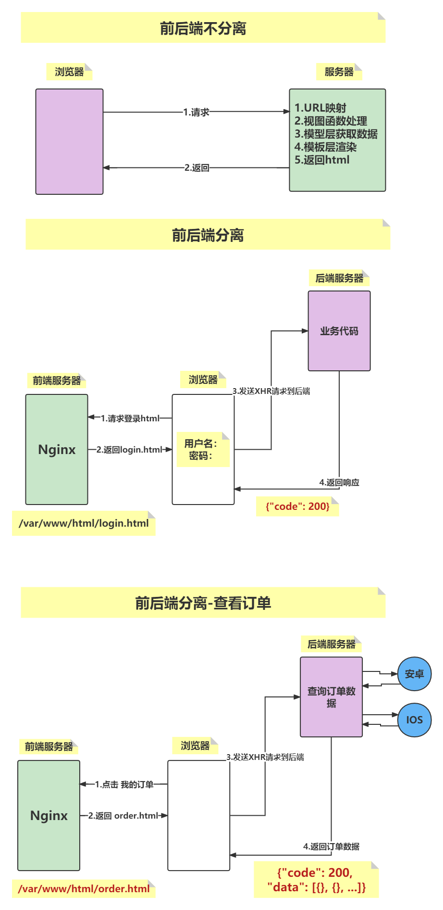
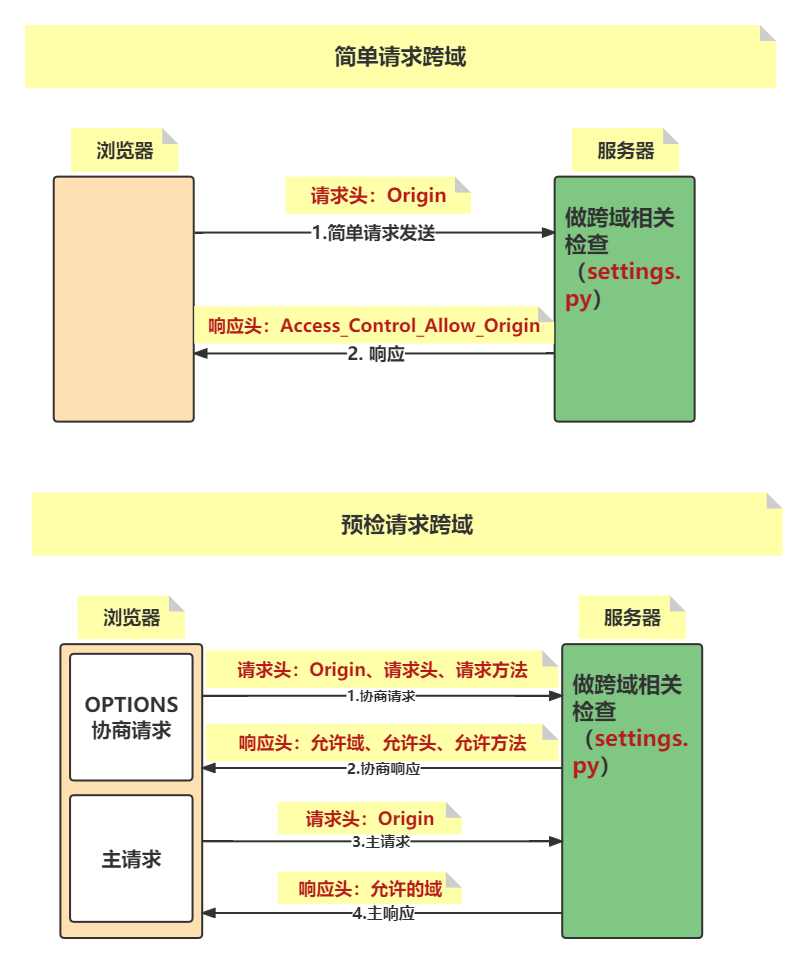

[TOC]

# PROJECT-DAY01

## 一、介绍

* 目的
  * 从事python开发工程师岗位。
  * 作为其他岗位的附加技能。
* 特点
  * 综合：装饰器、类、MySQL数据库、Redis数据库、进程、线程、协程、Django框架、Web前端、Django-Redis、Django对事物支持、Celey框架、第三方短信陪那个太、第三方登录平台、第三方支付平台.\.. .\..
  * 代码量相对较大，排错相对困难
  * 根据实战性：依据API文档进行开发

### 1）前后端分离流程

* 前端服务器（<font color=red>Nginx</font>）
  处理客户端所有请求，返回html、css、js，但是没有具体数据。
* 后端服务器（<font color=red>Django</font>）
  专门负责业务逻辑处理和数据返回（<font color=red>return JsonResponse({"code":200,"data":[]})</font>）。
* 前后端分离与不分离流程图
  

### 2）判断前后端分离的标准

* 项目中是否使用模板层，前后端分离后相当于把MTV中的T给分离出来。
* 分离后，所有视图函数返回值均为：return JsonResponse({})

### 3）前后端分离有点

* 前后端并行开发，效率高
* 一个后端可以灵活搭配各类前端，比如安卓、IOS、PC端。
* 有效利用客户端设备，减少服务器端压力。

## 三、编码和加密

### 1）BASE64编码

* 关于base64

  * base64不是加密，只是一种编码计数。
  * base64编码后的长度一定是4的倍数。
  * base64编码后的结果末尾可能会有0个、1个、2个等于号。
  * 编码过程：首先将字符串拆分为每三个字符一组，计算每个字符ASCII码对应的二进制，再按照每6位一组重新分组，计算对应的十进值，最后根据base64对照表得到base64编码的结果。

* 常用方法

  * base64.b64encode()
  * base64.b64decode()
  * base64.urlsafe_b64encode()
  * base64.urlsafe_b64decode()

  <font color=red>base64模块中左右方法的参数和结果都是字节串，项目中一旦使用base64编码，一定要注意encode()和decode()使用！</font>

### 2）SHA256

* 哈希三大特征
  不可逆、定场输出、雪崩

* 加密算法应用
  如果加密的结果用于存储，使用md5加密，比如：密码
  如果加密的结果用于计算，使用SHA系列，比如：JWT

* 实例
  ```python
  import hashlib
  
  s = hashlib.sha256()
  s.update("xxx".encode())
  s.hexdigest()  # 十六进制加密结果：string
  ```

### 3）HMAC-SHA256

* 用于校验数据的完整性和来源性

* 示例
  ```python
  import hmac
  
  r = hmac.new(key, msg, digestmod="SHA256").hexdigest()
  ```

## 四、JWT

* jwt流程图
  

* 作用
  <font color=red>会话保持</font>

* JWT三大组成部分

  * header:{"alg":"HS256","typ":"JWT"}
    对该部分进行base64编码

  * payload:{"exp":xxx,"username":xxx}
    对该部分进行base64编码

  * sign
    1. 对钱两部分的和进行hmac-sha256加密
    2. 再对加密后的结果进行base64编码

* pyjwt模块
  `import jwt`

  1. 生成token
     `token = jwt.encode(payload, key, algorithm="HS256")`
  2. 校验token
     `payload = jwt.decode(token, key, algorithms="HS256")`

  <font color=green>**jwt模块非常强硬，一旦token校验失败，则会抛出异常；所以后期在项目中只要用到了token的校验，则一定要加try语句。**</font>

## 五、前后端分离环境搭建

### 1）前端环境

* 安装并启动Nginx
* 创建项目配置文件：**/etc/nginx/conf.d/dadashop.conf**
  指定监听端口7000，设置根目录/var/www/html/
* 拷贝前端文件到指定目录
  **/var/www/html/dadashop/templates/index.html**

### 2）后端环境

* 项目名：dashopt
* 配置数据库：create database dashopt;

# PROJECT-DAY02

## 一、跨域资源共享CORS

### 1）协商式跨域

浏览器和服务器协商，浏览器告诉服务器它是谁，来自哪里，如果协商好了则允许跨域。

### 2）请求分类

#### 2.1 简单请求

* 请求头：Origin
* 响应头：`Access-Control-Allow-Origin`浏览器只要拿到此响应头，则跨域成功。

#### 2.2 预检请求

* OPTIONS请求
  * 请求头
    1. origin
    2. `Access-Control-Request-Methods`
    3. `Access-Control-Request-Headers`
  * 响应头
    1. `Access-Control-Allow-Origin`
    2. `Access-Control-Allow-Methods`
    3. `Access-Control-Allow-Headers`
* 主请求
  * 请求头：Origin
  * 响应头头：`Access-Control-Allow-Origin`
* 流程图
  

### 3）DJANGO配置跨域

* 依赖组件：`django-cors-headers`

  * 在线安装
    `sudo pip install django-cors-headers -i 国内pip源`
    国内pip源

    ```python
    清华：https://pypi.tuna.tsinghua.edu.cn/simple
    阿里云：http://mirrors.aliyun.com/pypi/simple/
    中国科技大学 https://pypi.mirrors.ustc.edu.cn/simple/
    华中理工大学：http://pypi.hustunique.com/
    山东理工大学：http://pypi.sdutlinux.org/
    豆瓣：http://pypi.douban.com/simple/
    ```

    示例
    ```python
    sudo pip3 install xxx -i https://pypi.tuna.tsinghua.edu.cn/simple
    ```

  * 离线安装

    1. 官网下载安装包
    2. 解压并cd到解压后的目录
       `tar-zxvf xxx.tar.gz`
    3. 安装：`sudo python3 setup.py，则查看README.rst`

* 配置跨域（settings.py）

  1. 添加cors应用：`INSTALLED_APPS:corsheaders`

  2. 添加cors中间件：`MIDDLEWARE:corsheaders.middleware.CorsMiddleware`

  3. 配置允许的域
     ```
     CORS_ORIGIN_ALLOW_ALL = True|False
     CORS_ORIGIN_WHITELIST = []
     ```

  4. 配置允许的方法：`CORS_ALLOW_METHODS = ()`

  5. 配置允许的头：`CORS_ALLOW_HEADERS = ()`

## 二、前后端分离项目细节

* 所有功能的请求方法、路由、请求体数据、查询字符串、响应状态码、响应内容，请查看接口文档！一切以接口文档为准！！！
* 项目模块细节
* 正确效应：{"code":200,..\.}
  错误响应：{"code":错误状态码,"error":"错误原因"}
  * 用户模块（**users**）
    错误状态码：10100 ~ 10199
    路由设计：v1/users/
  * 商品模块（**goods**）
    错误状态码：10200 ~ 10299
    路由设计：v1/users/
  * 购物车模块（**carts**）
    错误状态码：10300 ~ 10399
    路由设计：v1/users/
  * 订单模块（**orders**）
    错误状态码：10400 ~ 10499
    路由设计：v1/users/
  * 支付模块（**pays**）
    错误状态码：10500 ~ 10599
    路由设计：v1/users/

## 三、邮件激活功能

* 注册功能实现邮件激活，激活有效期是3天
  

* 思考整个流程
  * 发邮件（<font color=red>后端</font>）：`from django.core import mail`
  * 激活链接（<font color=red>前端</font>）：`http://127.0.0.1:7000/dadashop/templates/active.html`
  * 激活页面（<font color=red>前端</font>）:非常漂亮的激活页面
  * 激活用户（<font color=red>后端</font>）：`is_active=True`
* 关于激活链接体现用户标识问题
  <font color=red>激活链接中通过查询字符串体现用户标识，用于后期激活用户功能。</font>
  * **?code=bf**
  * **?code=base64(b"bf")**
  * **?code=base64(b"1234_bf")**
* 随机数存储在哪里？
  Redis数据库：{"active_bf":1234}
  激活有效期3天：Redis设置有效期

# PROJECT-DAY03

## 一、django-redis组件

### 1）安装

* 在线安装
  * 安装：`sudo pip3 install django-redis -i pip源`
  * 卸载：`sudo pip3 uninstall django-redis`
  * 更新：`sudo pip3 install django-redis --upgrade`
* 离线安装
  下载并解压安装包，执行`sudo python3 setup.py install`

### 2）使用

* settings.py定义缓存配置项CACHES
  ```python
  CACHES = {
      # db1:存储邮件激活随机数
      'default': {'LOCATION': 'redis://127.0.0.1:6379/1'},
      # db2:存储短信验证码
      'sms': {'LOCATION': 'redis://127.0.0.1:6379/2'},
      # db3:存储网站首页缓存
      'index': {'LOCATION': 'redis://127.0.0.1:6379/3'},
  }
  ```

* views.py中直接导入使用
  ```python
  from django.core.cache import caches
  
  # 1.set():设置键值对
  caches['default'].set(key, value, expire)
  # 2.get():获取值
  caches['sms'].get(key)
  # 3.delete():删除指定key，等价于 DEL key
  caches['index'].delete(key)
  # 4.clear():清除当前库，等价于 FLUSHDB
  caches['index'].clear
  ```

## 二、FBV和CBV

### 1）定义

* FBV：函数视图（**Function Base View**）
* CBV：类视图（**Class Base View**）

### 2）CBV优点

* 代码可读性较好。
* 类视图对于函数视图而言有更高的复用性，如果项目中的其他功能模块需要用到某个类视图的某个特定功能时，直接继承该类即可。

### 3）使用流程

* 配置路由（**url.py**）
  ```python
  from django.urls import path
  from . import views
  
  urlpatterns = [
      path('xx/xx', views.类名.as_view()),
  ]
  ```

* 完成视图（**views.py**）
  ```python
  from django.views import View
  
  class XxxView(View):
      def get(self, request):
          pass
      
      def post(self, request):
          pass
  ```

### 三、装饰器分类

* 普通函数装饰器
  ```python
  def check(func):
      def wrapper(*args, **kwargs):
          # 装饰逻辑|执行逻辑
          return func(*args, **kwargs)
      return warpper
  ```

* 视图函数装饰器
  ```python
  def check(func):
      def wrapper(request, *args, **kwargs):
          # 装饰逻辑|执行逻辑
          return func(request, *args, **kwargs)
      return warpper
  ```

* 类视图函数装饰器
  ```python
  def check(func):
      def wrapper(self, request, *args, **kwargs):
          # 装饰逻辑|执行逻辑
          return func(self, request, *args, **kwargs)
      return warpper
  ```

<font color=red>**登录状态装饰器**</font>

```python
def logging_check(func):
    def wrapper(self, request, *args, **kwargs):
        """
        1.获取token
        2.校验token
          校验失败：直接返回{'code': 403}
          校验成功：执行视图函数func
        """
        token = request.META.get('HTTP_AUTHORIZATION')
        key = settings.JWT_TOKEN_KEY
        try:
            payload = jwt.decode(token, key, algorithms="HS256")
        except Exception as e:
            return JsonResponse({"code": 403})
        username = payload.get('username')
        user = UserProfile.objects.get(username=username)
        request.myuser = user
        return func(self, request, *args, **kwargs)

    return wrapper
```

# PROJECT-DAY04

## 一、**事务**

* 说几条常用的Linux命令

  * ps -aux
  * chmod
  * chown
  * kill
  * ping
  * df -h
  * ssh
  * scp

* 事务的特性

  * 原子性：事务中的各个操作要么全都执行，要么全都不执行。
  * 一致性：数据库必须从一个一致性的状态转为另一个一致性的状态。
  * 隔离性：每个事物之间的执行是相互隔离的。
  * 持久性：一旦对数据库中数据做了更改，则更改是永久性的。

* 索引的优缺点

  * 增加数据检索的速度
  * 有索引文件存储在磁盘，占用物理存储空间。
  * 索引需要动态维护，需要计算机的资源。

  <font color=red>经常用来查询的字段建立索引。</font>

* MySQL优化

  * 索引：`经常用来查询的字段建立索引`
  * 语句：`尽量避免使用in、!=、*等条件判断的语句`
  * 引擎
    1. InnoDB：`支持外键，行级锁、支持事务，所以写操作多的表使用此引擎`
    2. MyISAM：`支持表级锁，索引读操作多的表使用此引擎`
    3. Memory：`表记录存储在内存中，索引一些临时表或中间表可以使用此引擎`

## 二、**Django对事务的支持**

* 事务模块：`from django.db import transaction`
* 常用方法
  * 开启事务：`with transaction.atomic()`
  * 创建储存点：`sid = transaction.savepoint()`
  * 提交事务：`tansaction.savepoint_commit(sid)`
  * 回滚事务：`transaction.savepoint_rollback(sid)`
  
  <font color=red>项目中：回滚+返回 必须结合</font>
  
* 使用示例
  ```python
  from django.db import transaction
  
  with transaction.atomic():
      # 1.创建储存点
      sid = transaction.savepoint()
      try:
      	# 2.事务中的各个操作
      except Exception as e:
          # 3.事务回滚
          transaction.savepoint_rollback(sid)
      # 4.提交事务
      transaction.savepoint_commit()

# 三、requests模块

## 1）介绍

### 1.1 定义

python中非常优秀的第三方请求库，支持多种HTTP METHOD请求，在开发中经常用来做单元测试，也是爬虫中使用频率最高的请求模块。

### 1.2 安装

`sudo pip3 install requests`

### 1.3 常用方法

* requests.get(url="", headers={})
* requests.post(url="", json={}, headers={})
* requests.put(url="", json={}, headers={})
* requests.delete(url="", json={}, headers={})

### 1.4 总结

<font color=red>requests.post(url="", data={}, headers={})</font>

* 参数
  1. url参数：字符串
  2. json参数：请求体 - {} `b'{"uname":xxx}'`
     <font color=blue>后端视图：request.body -> b'{"uname":xxx}'</font>
  3. data参数：请求体 - {} `b"uname=xxx&pwd=xx"`
     <font color=blue>后端视图：request.body -> b'uname=xxx&pwd=xxx'</font>
  4. headers参数：请求头 - {} 
* 响应对象属性
  <font color=red>resp = requests.get(.\..)</font>
  1. resp.text属性：响应内容 - 字符串
  2. resp.json()方法：响应内容 - 对象 json.loads('')

## 四、第三方短信平台

### 1）接第三方的流程

* 注册开发者账号。
* 依据第三方平台要求，是否需要进行实名认证或者资质审核（<font color=red>**容联云无此要求**</font>）
* 创建应用（<font color=red>**Application，容联云自动创建的**</font>）
* 根据开发文档开发。

### 2）容联云接口文档

<font color=red>**html=requests.post(url=url, json=data, hreaders=headers).json()**</font>

#### 1）请求URL地址

```python
https://app.cloopen.com:8883/2013-12-26/Accounts/{}/SMS/TemplateSMS?sig={}
        
1. accountSid: 控制台获取
2. sigParameter: md5(账户ID+令牌+时间戳)
                 加密结果变为大写
                 时间戳：yyyymmddHHMMSS
```

#### 2）请求头

```python
headers = {
    "Accept": "application/json;",
    "Content-Type": "application/json;charset=utf-8;",
    # Content-Length:256; 
    "Authorization": "base64(账户ID+":"+时间戳)"
}

# 时间戳需要和sigParameter相同
```

#### 3）请求方法

​	POST请求

#### 4）请求体

```python
data = {
    "to": "手机号",
    "appId": "控制台获取",
    "templateId": "1",
    "datas": [871016, 5]
}
```

#### 5）响应内容

```python
{
    "statusCode":"000000",
    "templateSMS":{
        "dateCreated":"20130201155306",
        "smsMessageSid":" ff80c94b0f0512345"
    }
}   
# statusCode: 000000  代表短信发送成功
```

#### 6）自己完成短信接口

```python
class YunApi:
    def __init__(self):
        pass
    
    def send_message(self):
        pass
    
if __name__ == "__main__":
    yunapi = YunApi()
    yunapi.send_message(...)
```

# PROJECT-DAY05

## 一、OAuth2.0协议

* 定义：第三方授权协议

* 授权交互模式

  * 授权码模式
  * 简化模式
  * 应用授信模式
  * 用户授信模式

  <font color=purple>**其中授权码模式被广泛应用于互联网开放平台，第三方授权登录是最常见的应用场景**</font>

* 查看开发文档
* 创建应用（**App key、App secret**）
* 设置授权回调地址（**http://localhost:7000/dadashop/templates/callback.html**）

## 二、第三方微博登录

### 1）微博开放平台

* 注册微博开放平台账号，并进行实名认证。

* 创建应用（**Application**）

  * 用用控制台 - 基本信息：`App key, App Secret`
  * 应用控制台 - 高级信息：`设置授权回调地址（不能是127.0.0.1）`

* 查看开发文档

  * 获取授权码接口文档：[oauth2/authorize](https://open.weibo.com/wiki/Oauth2/authorize)

    * 请求URL地址
      ```python
      https://api.weibo.com/oauth2/authorize?client_id=123456&redirect_uri=http://www.example.com/response&response_type=code
      ```

    * 授权码code会作为回调地址的查询字符串反回

  * 获取访问令牌接口文档：[oauth2/access_token](https://open.weibo.com/wiki/index.php?title=Oauth2/access_token&action=edit&redlink=1)

    * 请求URL地址
      ```python
      https://api.weibo.com/oauth2/access_token
      ```

    * 请求方法
      POST

    * 请求头
      ```python
      client_id
      client_secret
      grant_type
      code
      redirect_uri
      ```

    * 响应
      ```python
      {
          "access_token": "ACCESS_TOKEN",
          "expires_in": "7200",
          "remind_in": "7200",
          "uid": "1404376560"
      }
      ```


**DJANGO和CELERY结合**

* 创建celery配置文件（**和settings.py同路径**）
* 应用下封装tasks.py（**当前应用下所有的异步任务**）
* 视图中调用推送到消息中间件（**delay()**）
* 终端启动celery worker

<font color=red>**如果异步任务有修改或者新增，此时终端一定要重新启动celery worker**</font>

**IO阻塞**

* 本地磁盘IO
* 网络IO

数据库三范式3NF

* 1NF
  字段是最小的粒度不能在拆分
* 2NF
  满足1NF，表中的字段必须依赖于全部主键而非部分服主键
* 3NF
  满足2NF，表中的非主键字段之间不能相互依赖

## 电商网站相关概念

* SPU
  表中产品单元，比如：iPhone14
* SKU
  库存量单位，比如：iPhone14 深空灰 128G、iPhone14 珍珠白 256G.\..
* 销售属性：比如颜色、尺寸、内存
* 销售属性值：比如白色、黑色、128G
* 规格属性：比如商品产地、毛重
* 规格属性值：比如中国大陆、320.00g

测试200的分支
```mysql
确认微博表中数据(字段：user_profile_id为NULL)
select * from users_weibo_profile;
查询用户的id
select id,username from users_user_profile where username='用户名';
更新微博表外键
update users_weibo_profile set user_profile_id=6;
确认是否更新正确(确认外键已经为6，不为NULL了)
select * from users_weibo_profile;
```

* 使用微博扫码登录，会直接跳转到用户的主页
* 使用正式用户登录，也会跳转到用户的主页

## 数据备份

* 备份所有应用数据
  `python3 manage.py dumpdata > xxx.json`
* 备份指定应用数据
  `python3 manage.py dumpdata 应用名 > xxx.json`
* 备份指定应用指定模型类数据
  `python3 manage.py dumpdata 应用名.模型类名 > xxx.json`

## 数据恢复

`python3 manage.py loaddata xxx.json`
