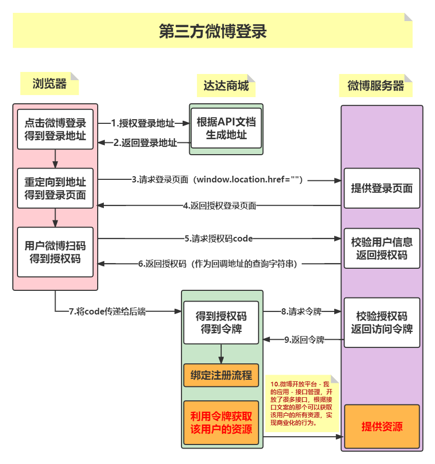
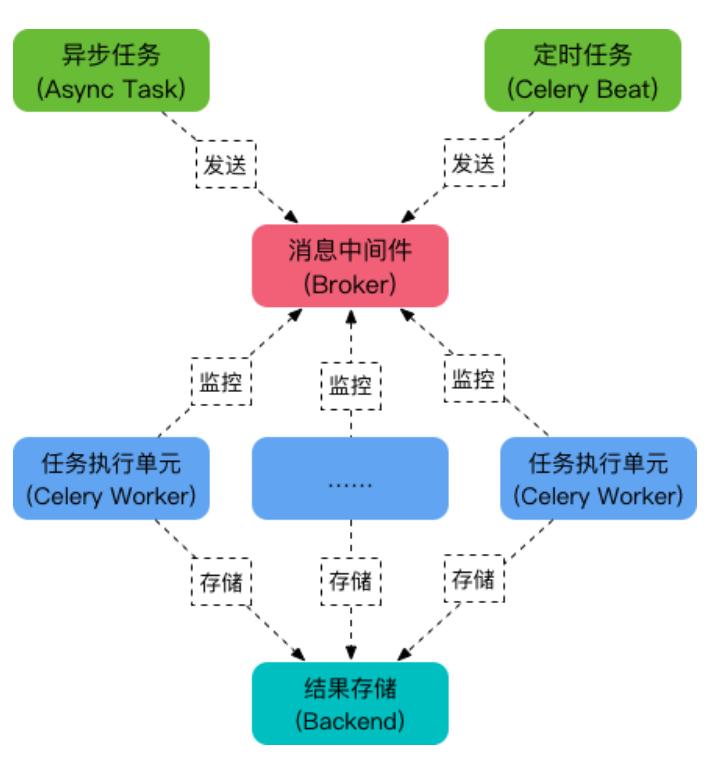

[TOC]

# PROJECT-DAY01

## 一、介绍

* 目的
  * 从事Python开发工程师岗位。
  * 作为其他岗位的附加技能。
* 特点
  * 综合：装饰器、类、MySQL数据库、Redis数据库、进程、线程、协程、Django框架、Web前端、django-redis、django对事物支持、Celery框架、第三方短信平台、第三方登录平台、第三方支付平台... ...
  * 代码量相对较大，排错相对困难
  * 根据实战性：依据API文档进行开发

## 二、前后端分离

### 1）前后端分离流程

* 前端服务器（<font color=red>Nginx</font>）

  处理客户端所有请求，返回html、css、js，但是没有具体数据。

* 后端服务器（<font color=red>Django</font>）

  专门负责业务逻辑处理和数据返回（<font color=red>return JsonResponse({"code": 200, "data": []})</font>）。

* 前后端分离与不分离流程图

  

### 2）判断前后端分离的标准

* 项目中是否使用模板层，前后端分离后相当于把 MTV 中的 T 给分离出去。
* 分离后，所有的视图函数返回值均为：return JsonResponse({})

### 3）前后端分离优点

* 前后端并行开发，效率高。
* 一个后端可以灵活搭配各类前端，比如安卓、IOS、PC端。
* 有效利用客户端设备，减少服务器端压力。

## 三、编码和加密

### 1）BASE64编码

* 关于base64

  * base64不是加密，只是一种编码技术。

  * base64编码后的长度一定是4的倍数。
  * base64编码后的结果末尾可能会有 0个、1个、2个 等于号。
  * 编码过程：首先将字符串拆分为每三个字符一组，计算每个字符ASCII码对应的二进制，再按照每6位一组重新分组，计算对应的十进制，最后根据base64对照表得到base64编码的结果。

* 常用方法

  * base64.b64encode()
  * base64.b64decode()
  * base64.urlsafe_b64encode()
  * base64.urlsafe_b64decode()

  <font color=red>base64模块中所有方法的参数和结果都是字节串，项目中一旦使用base64编码，一定要注意 encode() 和 decode() 使用！</font>

### 2）SHA256

* 哈希三大特性

  不可逆、定长输出、雪崩

* 加密算法应用

  如果加密的结果用于存储，使用md5加密，比如：密码

  如果加密的结果用于计算，使用SHA系列，比如：JWT

* 实例

  ```python
  import hashlib
  
  s = hashlib.sha256()
  s.update("xxx".encode())
  s.hexdigest()  # 十六进制加密结果：string
  ```

### 3）HMAC-SHA256

* 用于校验数据的完整性和来源性

* 示例

  ```python
  import hmac
  
  r = hmac.new(key, msg, digestmod="SHA256").hexdigest()
  ```

## 四、JWT

* jwt流程图

  

* 作用

  <font color=red>会话保持。</font>

* JWT三大组成部分
  * header：{"alg": "HS256", "typ": "JWT"}

    对该部分进行base64编码!

  * payload: {"exp": xxx, "username": xxx}

    对该部分进行base64编码!

  * sign

    1. 对前两部分的和进行hmac-sha256加密；
    2. 再对加密后的结果进行base64编码.

* pyjwt模块

  `import jwt`

  1. 生成token

     `token = jwt.encode(payload, key, algorithm="HS256")`

  2. 校验token

     `payload = jwt.decode(token, key, algorithms="HS256")`

  <font color=green>**jwt模块非常强硬，一旦token校验失败，则会抛出异常；所以后期在项目中只要用到了token的校验，则一定要加try语句。**</font>

## 五、前后端分离环境搭建

### 1）前端环境

* 安装并启动Nginx

* 创建项目配置文件：**/etc/nginx/conf.d/dadashop.conf**

  指定监听端口7000， 设置根目录 /var/www/html/

* 拷贝前端文件到指定目录

  **/var/www/html/dadashop/templates/index.html**

### 2）后端环境

* 项目名：dashopt
* 配置数据库：create database dashopt default charset utf8;

# PROJECT-DAY02

## 一、跨域资源共享CORS

### 1）协商式跨域

​	浏览器和服务器协商，浏览器告诉服务器它是谁，来自哪里，如果协商好了则允许跨域。

### 2）请求分类

#### 2.1 简单请求

* 请求头：`Origin`
* 响应头：`Access-Control-Allow-Origin 浏览器只要拿到此响应头，则跨域成功。`

#### 2.2 预检请求

* OPTIONS请求
  * 请求头
    1. `origin`
    2. `Access-Control-Request-Methods`
    3. `Access-Control-Request-Headers`
  * 响应头
    1. `Access-Control-Allow-Origin`
    2. `Access-Control-Allow-Methods`
    3. `Access-Control-Allow-Headers`
* 主请求
  * 请求头：`Origin`
  * 响应头：`Access-Control-Allow-Origin`

* 流程图

  

### 3）DJANGO配置跨域

* 依赖组件：`django-cors-headers`

  * 在线安装

    `sudo pip3 install django-cors-headers -i 国内pip源`

    国内pip源

    ```python
    1.清华大学
    https://pypi.tuna.tsinghua.edu.cn/simple/
    2.阿里云
    http://mirrors.aliyun.com/pypi/simple/
    3.中国科学技术大学
    http://pypi.mirrors.ustc.edu.cn/simple/
    4.华中科技大学
    http://pypi.hustunique.com/
    5.豆瓣源
    http://pypi.douban.com/simple/
    6.腾讯源
    http://mirrors.cloud.tencent.com/pypi/simple
    7.华为镜像源https://repo.huaweicloud.com/repository/pypi/simple/
        
    # 示例
    sudo pip3 install xxx -i https://pypi.tuna.tsinghua.edu.cn/simple/
    ```

  * 离线安装

    1. 官网下载安装包

    2. 解压并cd到解压后的目录

       tar -zxvf  xxx.tar.gz

    3. 安装：sudo python3 setup.py install

       如果没有setup.py，则查看README.rst

* 配置跨域（**settings.py**）

  1. 添加cors应用：`INSTALLED_APPS: corsheaders`

  2. 添加cors中间件：`MIDDLEWARE: corsheaders.middleware.CorsMiddleware`

  3. 配置允许的域

     `CORS_ORIGIN_ALLOW_ALL = True|False`

     `CORS_ORIGIN_WHITELIST = []`

  4. 配置允许的方法

     `CORS_ALLOW_METHODS = ()`

  5. 配置允许的头

     `CORS_ALLOW_HEADERS = ()`

## 二、前后端分离项目细节

* 所有功能的请求方法、路由、请求体数据、查询字符串、响应状态码、响应内容，请查看接口文档！一切以接口文档为准！！！

* 项目模块细节

  正确响应：{"code": 200, .........}

  错误响应：{"code": 错误状态码, "error": "错误原因"}

  

  - 用户模块（**users**）

    错误状态码：10100 ~ 10199

    路由设计： v1/users/

  - 商品模块（**goods**）

    错误状态码：10200 ~ 10299

    路由设计： v1/goods/

  - 购物车模块（**carts**）

    错误状态码：10300 ~ 10399

    路由设计： v1/carts/

  - 订单模块（**orders**）

    错误状态码：10400 ~ 10499

    路由设计： v1/orders/

  - 支付模块（**pays**）

    错误状态码：10500 ~ 10599

    路由设计： v1/pays/

## 三、邮件激活功能

* 注册功能实现邮件激活，激活有效期是3天

  

* 思考整个流程
  * 发邮件（<font color=red>后端</font>）：`from django.core import mail`
  * 激活链接（<font color=red>前端</font>）：`http://127.0.0.1:7000/dadashop/templates/active.html`
  * 激活页面（<font color=red>前端</font>）：`非常漂亮的激活页面`
  * 激活用户（<font color=red>后端</font>）：`is_active=True`

* 关于激活链接体现用户标识问题

  <font color=red>激活链接中通过查询字符串体现用户标识，用于后期激活用户功能。</font>

  * **?code=zhaoliying**   
  * **?code=base64(b"zhaoliying")**
  * **?code=base64(b"1016_zhaoliying")**

* 随机数存储在哪里？

  Redis数据库：{"active_zhaoliying": 1016}

  激活有效期3天：Redis设置有效期

# PROJECT-DAY03

## 一、django-redis组件

### 1）安装

* 在线安装

  * 安装：sudo pip3 install django-redis -i pip源
  * 卸载：sudo pip3 uninstall django-redis
  * 更新：sudo pip3 install django-redis --upgrade 

* 离线安装

  下载并解压安装包，执行 sudo python3 setup.py install

### 2）使用

* settings.py定义缓存配置项CACHES

  ```python
  CACHES = {
      # db1: 存储邮件激活随机数
      "default": {"LOCATION": "redis://127.0.0.1:6379/1"},
      # db2: 存储短信验证码
      "sms": {"LOCATION": "redis://127.0.0.1:6379/2"},
      # db3: 存储网站首页缓存
      "index": {"LOCATION": "redis://127.0.0.1:6379/3"},
  }
  ```

* views.py中直接导入使用

  ```python
  from django.core.cache import caches
  
  # 1.set(): 设置键值对
  caches["default"].set(key, value, expire)
  # 2.get(): 获取值
  caches["sms"].get(key)
  # 3.delete(): 删除指定key,等价于 DEL key
  caches["index"].delete(key)
  # 4.clear(): 清除当前库,等价于 FLUSHDB
  caches["index"].clear()
  ```

## 二、FBV和CBV

### 1）定义

* FBV：函数视图（**Function Base View**）
* CBV：类视图（**Class Base View**）

### 2）CBV优点

* 代码可读性较好。
* 类视图对于函数视图而言有更高的复用性，如果项目中的其他功能模块需要用到某个类视图的某个特定功能时，直接继承该类即可。

### 3）使用流程

* 配置路由（**urls.py**）

  ```python
  from django.urls import path
  from . import views
  
  urlpatterns = [
      path("xx/xx", views.类名.as_view()),
  ]
  ```

* 完成视图（**views.py**）

  ```python
  from django.views import View
  
  class XxxView(View):
      def get(self, request):
          pass
      
      def post(self, request):
          pass
  ```

## 三、装饰器分类

* 普通函数装饰器

  ```python
  def check(func):
      def wrapper(*args, **kwargs):
          # 装饰逻辑|执行逻辑
          return func(*args, **kwargs)
      return wrapper
  ```

* 视图函数装饰器

  ```python
  def check(func):
      def wrapper(request, *args, **kwargs):
          # 装饰逻辑|执行逻辑
          return func(request, *args, **kwargs)
      return wrapper
  ```

* 类视图函数装饰器

  ```python
  def check(func):
      def wrapper(self, request, *args, **kwargs):
          # 装饰逻辑|执行逻辑
          return func(self, request, *args, **kwargs)
      return wrapper
  ```

<font color=red>**登录状态校验装饰器**</font>

```python
"""
    装饰器:用户登录状态的校验
"""
import jwt
from django.conf import settings
from django.http import JsonResponse
from users.models import UserProfile


def logging_check(func):
    def wrapper(self, request, *args, **kwargs):
        """
        1.获取token
        2.校验token
          校验失败:直接返回{"code":403}
          校验成功:执行视图函数func
        """
        token = request.META.get("HTTP_AUTHORIZATION")
        key = settings.JWT_TOKEN_KEY
        try:
            payload = jwt.decode(token, key, algorithms="HS256")
        except Exception as e:
            return JsonResponse({"code": 403})

        username = payload.get("username")
        user = UserProfile.objects.get(username=username)
        request.myuser = user

        return func(self, request, *args, **kwargs)
    return wrapper
```

# PROJECT-DAY04

## 一、事务

* 说几条常用的Linux命令
  * ps -aux
  * chmod 
  * chown
  * kill
  * ping
  * df -h
  * ssh
  * scp

* 事务的特性
  * 原子性：事务中的各个操作要么全都执行，要么全都不执行。
  * 一致性：数据库必须从一个一致性的状态转为另一个一致性的状态。
  * 隔离性：每个事务之间的执行是相互隔离的。
  * 持久性：一旦对数据库中数据做了更改，则更改是永久性的。

* 索引的优缺点

  * 增加数据检索的速度。
  * 有索引文件存储在磁盘，占用物理存储空间。
  * 索引需要动态维护，需要计算机的资源。

  <font color=red>经常用来查询的字段建立索引。</font>

* MySQL优化

  * 索引：`经常用来查询的字段建立索引。`
  * 语句：`尽量避免使用in、!=、*等条件判断的语句。`
  * 引擎
    1. InnoDB：`支持外键、行级锁、支持事务,所以写操作多的表使用此引擎。`
    2. MyISAM：`支持表级锁，所以读操作多的表使用此引擎。`
    3. Memory：`表记录存储在内存中，所以一些临时表或中间表可以使用此引擎。`

## 二、django对事务支持

* 事务模块: `from django.db import transaction`

* 常用方法
  * 开启事务：`with transaction.atomic():`
  * 创建存储点：`sid = transaction.savepoint()`
  * 提交事务：`transaction.savepoint_commit(sid)`
  * 回滚事务：`transaction.savepoint_rollback(sid)`

  <font color=red>**项目中：回滚+返回 必须结合。**</font>
  
* 使用示例

  ```python
  from django.db import transaction
  
  with transaction.atomic():
      # 1.创建存储点
      sid = transaction.savepoint()
      try:
      	# 2.事务中的各个操作
      except Exception as e:
          # 3.事务回滚
          transaction.savepoint_rollback(sid)
          
      # 4.提交事务
      transaction.savepoint_commit()
  ```

## 三、requests模块

### 1）介绍

#### 1.1 定义

​	Python中非常优秀的第三方请求库，支持多种HTTP METHOD请求，在开发中经常用来做单元测试，也是爬虫中使用频率最高的请求模块。

#### 1.2 安装

​	sudo pip3 install requests

#### 1.3 常用方法

* requests.get(url="", headers={})
* requests.post(url="", json={}, headers={})
* requests.put(url="", json={}, headers={})
* requests.delete(url="",json={}, headers={})

#### 1.4 总结

<font color=red>requests.post(url="", data={}, headers={})</font>

* 参数

  1. url参数:   `字符串`

  2. json参数：`请求体 - {}`

     <font color=blue>后端视图：request.body  --> b'{"uname":xxx}'</font> 

  3. data参数：`请求体 - {}`

     <font color=blue>后端视图：request.body  --> b'uname=xxx&pwd=xxx'</font> 

  4. headers参数：`请求头 - {}`

* 响应对象属性 

  <font color=red>resp = requests.get(...)</font>

  1. resp.text属性：`响应内容 - 字符串`
  2. resp.json()方法：`响应内容-对象 json.loads('')`

## 四、第三方短信平台

### 1）接第三方的流程

* 注册开发者账号。
* 依据第三方平台要求，是否需要进行实名认证或者资质审核（<font color=red>**容联云无此要求**</font> ）。
* 创建应用（<font color=red>**Application，容联云自动创建的**</font>）。
* 根据开发文档开发。

### 2）容联云开发文档

<font color=red>**html = requests.post(url=url, json=data, headers=headers).json()**</font>

#### 1）请求URL地址

```python
https://app.cloopen.com:8883/2013-12-26/Accounts/{}/SMS/TemplateSMS?sig={}
        
1. accountSid: 控制台获取
2. sigParameter: md5(账户ID+令牌+时间戳)
                 加密结果变为大写
                 时间戳：yyyymmddHHMMSS
```

#### 2）请求头

```python
headers = {
    "Accept": "application/json;",
    "Content-Type": "application/json;charset=utf-8;",
    # Content-Length:256; 
    "Authorization": "base64(账户ID+":"+时间戳)"
}

# 时间戳需要和sigParameter相同
```

#### 3）请求方法

​	POST请求

#### 4）请求体

```python
data = {
    "to": "手机号",
    "appId": "控制台获取",
    "templateId": "1",
    "datas": [871016, 5]
}
```

#### 5）响应内容

```python
{
    "statusCode":"000000",
    "templateSMS":{
        "dateCreated":"20130201155306",
        "smsMessageSid":" ff80c94b0f0512345"
    }
}   
# statusCode: 000000  代表短信发送成功
```

#### 6）自己完成短信接口

<font color=red>**答案见：TTS作业（smsapi.zip）**</font>

```python
class YunApi:
    def __init__(self):
        pass
    
    def send_message(self):
        pass
    
if __name__ == "__main__":
    yunapi = YunApi()
    yunapi.send_message(...)
```

# PROJECT-DAY05

## 一、OAuth2.0协议

* 定义：第三方授权协议

* 授权交互模式

  * 授权码模式
  * 简化模式
  * 应用授信模式
  * 用户授信模式

  <font color=purple>**其中授权码模式被广泛应用于互联网开放平台，第三方授权登录是最常见的应用场景！**</font>

## 二、第三方微博登录

### 1）微博开放平台

* 注册微博开放平台账号，并进行实名认证。

* 创建应用（**Application**）。

  * 应用控制台 - 基本信息：`App key、App Secret`
  * 应用控制台 - 高级信息：`设置授权回调地址（不能是127.0.0.1）。`

* 查看开发文档

  * 获取授权码接口文档

    [oauth2/authorize](https://open.weibo.com/wiki/Oauth2/authorize)

    * 请求URL地址

      ```python
      https://api.weibo.com/oauth2/authorize?client_id={}&redirect_uri={}&response_type=code
      ```

    * 授权码code会作为回调地址的查询字符串返回

  * 获取访问令牌接口文档

    [oauth2/access_token](https://open.weibo.com/wiki/index.php?title=Oauth2/access_token&action=edit&redlink=1)

    * 请求URL地址

      <https://api.weibo.com/oauth2/access_token>

    * 请求方法

      POST

    * 请求头

      ```python
      client_id
      client_secret
      grant_type
      code
      redirect_uri
      ```

    * 响应

      ```python
      {
          "access_token": "ACCESS_TOKEN",
          "expires_in": "7200",
          "remind_in": "7200",
          "uid": "1404376560"
      }
      ```

* 微博授权登录流程图

  

# PROJECT-DAY06

## 一、celery

### 1）定义

​	简单、灵活、可靠的处理大量消息的分布式系统。

### 2）核心组件

* 生产者：`Django项目，生产异步任务。`
* 消息中间件broker：`生产者只要有任务，则会发送至broker。`
* 消费者Celery Worker：`从消息中间件中获取并执行异步任务。`
* 存储结果backend：`存储异步任务的执行结果，一般不使用，除非一定要跟进异步任务的执行结果。`

### 3）Celery结构图



### 3）celery使用流程

* 创建celery配置文件（**和settings.py同路径**）

  ```python
  import os
  from celery import Celery
  from django.conf import settings
  
  # 1.设置环境变量
  os.environ.setdefault("DJANGO_SETTINGS_MODULE", "dashopt.settings")
  # 2.初始化celery应用
  app = Celery("名字", broker="redis://127.0.0.1:6379/15")
  # 3.设置自动发现任务
  app.autodiscover_tasks(settings.INSTALLED_APPS)
  ```

* 应用下封装tasks.py（**当前应用下所有的异步任务**）

  ```python
  from 项目名.celery import app
  
  @app.task
  def async_xxx(param1, param2):
      pass
  ```

* 视图中调用推送到消息中间件（**delay()**）

  ```python
  from .tasks import async_xxx
  
  async_xxx.delay(param1, param2)
  ```

* 终端启动celery worker

  * 进程

    `celery -A 项目名 worker -l info`

  * 协程

    `celery -A 项目名 worker -P gevent -c 1000 -l info`

<font color=red>**1. 如果异步任务有修改或者新增，此时终端一定要重新启动celery worker！**</font>

<font color=blue>**2. 生产环境一般以协程方式启动celery worker，一般为1000-2000不等。**</font>

## 二、三范式和反范式

### 1）三范式3NF

* 1NF：拆字段

  字段是最小的粒度不能再拆分；

  <font color=red>比如：地址字段要区分省、市、区县、街道。</font>

* 2NF：拆表

  满足1NF，表中的字段必须依赖于全部主键而非部分主键；

  <font color=red>比如：商品ID和分类ID是复合主键，但是分类名依据分类ID这一个部分主键就能索引到，所以此时应该拆表。</font>

* 3NF：拆表

  满足2NF，表中的非主键字段之间不能相互依赖；
  
  <font color=red>比如：仓库和仓库负责人两个字段相互依赖，拆表！</font>

### 2）反范式

<font color=blue>**在一定程度上适当增加数据的冗余。**</font>

* 适当字段的冗余可以增加查询效率，比如：商品表、定价表、分类表中都冗余销量字段。
* 适当字段的冗余可以还原数据的真实性，比如：订单表中冗余地址相关字段。

## 三、DJANGO数据备份和恢复

### 1）数据备份dumpdata

- 备份所有应用数据

  `python3 manage.py dumpdata > xxx.json`

- 备份指定应用数据

  `python3 manage.py dumpdata 应用名 > xxx.json`

- 备份指定应用指定模型类数据

  `python3 manage.py dumpdata 应用名.模型类名 > xxx.json`

### 2）数据恢复loaddata

`python3 manage.py loaddata xxx.json`

## 四、电商网站相关概念

* SPU

  标准产品单元，比如：iphone14

* SKU

  库存量单位，比如：iphone14 深空灰 128G 、iphone14 珍珠白 256G、... ...

* 销售属性：比如颜色、尺寸、内存

* 销售属性值：比如白色、黑色、128G

* 规格属性：比如商品产地、毛重

* 规格属性值：比如中国大陆、320.00g

## 五、商品模块数据准备

* 数据表数据

  `python3 manage.py loaddata goods_data.json`

* 图片类数据（配置静态路由）

  ```python
  # 1.settings.py中定义相关变量,并创建对应目录将图片文件拷贝到此目录
  MEDIA_URL = "/media/"
  MEDIA_ROOT = os.path.join(BASE_DIR, "media")
  ```

# PROJECT-DAY07

## 一、缓存

### 1）自带缓存装饰器cache_page

* settings.py添加缓存配置项CACHES

  ```python
  CACHES = {
      "default": {},
      "index": {}
  }
  ```

* 路由|视图中使用cache_page

  ```python
  # 1.路由中使用
  path("xxx", cache_page(60, cache="index")(views.xxx_view))
  
  # 2.视图中使用
  @cache_page(60, cache="index")
  def xxx_view(request):
      pass
  ```

<font color=red>**Django自带的缓存装饰器cache_page会自行构建缓存的key，并且key没有任何规律，所以很难做到精准的缓存清除，可以使用FLUSHDB清库的方式来实现清除缓存。**</font>

### 2）自定义缓存装饰器

* 结构（可传参的装饰器）

  ```python
  def cache_check(**cache_kwargs):
      def _cache(func):
          def wrapper(request, *args, **kwargs):
              # 装饰逻辑|执行逻辑
              return func(request, *args, **kwargs)
          return wrapper
      return _cache
  ```

* 可传参的缓存装饰器

  ```python
  from django.core.cache import caches
  
  
  def cache_check(**cache_kwargs):
      def _cache_check(func):
          def wrapper(self, request, *args, **kwargs):
              """
              装饰逻辑|缓存装饰器逻辑
              :cache_kwargs 装饰器参数
              :func 被装饰的方法
              :self request args kwargs 方法参数
              """
              # cache_kwargs: {'expire': 30, 'cache': 'detail', 'key': 'gd'}
              # kwargs: {'sku_id': 1}
  
              # 1.确认缓存中是否存在数据(Redis-get())
              rcache = caches[cache_kwargs.get("cache", "default")]
              rkey = f"{cache_kwargs.get('key')}{kwargs.get('sku_id')}"
              rresp = rcache.get(rkey)
              #  1.1 存在:直接返回
              if rresp:
                  print("\033[31mdata from redis\033[0m")
                  return rresp
  
              #  1.2 不存在:先走视图,再缓存,最后返回
              mresp = func(self, request, *args, **kwargs)
              expire = cache_kwargs.get("expire", 60)
              rcache.set(rkey, mresp, expire)
  
              return mresp
          return wrapper
      return _cache_check
  ```

### 3）关于缓存面试

* 面试官：你负责的是哪些模块？
* <font color=blue>你：我负责的是用户模块和商品模块的功能开发。</font>
* 面试官：我这里有电脑，你输入地址给我演示一下。
* <font color=blue>你：当时离职时项目还没最终上线呢。</font>
* 面试官：用户模块和商品模块一共几张数据表，介绍一下？
* <font color=blue>你：用户模块3张（用户表、地址表、微博表），商品模块10张（SKU、SPU、类别表、销售属性、销售属性值、规格属性、规格属性值、详情图片等）。</font>
* 面试官：首页或者详情页并发量大会产生什么问题？
* <font color=blue>你：后端会进行大量的ORM查询，给MySQL数据库带来极大的查询压力。</font>
* 面试官：有哪些解决方案？
* <font color=blue>你：利用缓存处理并发。</font>
* 面试官：用的什么缓存？
* <font color=blue>你：首页使用django自带的缓存装饰器cache_page()，详情页自定义开发了一个缓存装饰器。</font>
* 面试官：为什么开发一个装饰器？django自带的装饰器有什么问题？
* <font color=blue>你：Django自带的缓存装饰器不能自定义缓存的key，并且自己生成的key很复杂没有规律，很难实现精准的缓存清除。</font>
* 面试官：缓存清除是怎么触发的？
* <font color=blue>你：我调研了Django的源码，发现当工作人员在admin后台修改或者删除商品数据时，会调用admin.ModelAdmin中的save_model()方法和delete_model()方法，所以我们通过重写这两个方法实现缓存的精准的清除。</font>
* 面试官：那你还做了什么其他的优化没？
* <font color=blue>你：因为Redis基于内存的，大量的缓存会消耗大量的内存，为了能够节约内存，每个缓存的key设置了30-60秒的过期时间，同时考虑将数据压缩之后再存入缓存。</font>
* 面试官：怎么压缩的，用什么压缩的？
* <font color=blue>你：查看了Django的官方文档发现Django自带的缓存装饰器cache_page()并没有开放压缩的接口，于是转换思路看了django_redis的文档，发现提供了压缩的接口，使用django_redis组件将数据压缩之后存入缓存，大大节约了内存。</font>

# PROJECT-DAY08

## 一、购物车功能会议

### 1）参会人员

​	前端工程师、后端开发工程师、产品经理

### 2）思考的问题

#### 2.1 购物车数据特点

* 数据量相对较大
* 价值相对较低
* 访问频率较高

#### 2.2 确定存储介质

* MySQL

  `把MySQL资源留给用户模块、订单模块、支付模块等。`

* Redis

  * 基于内存，存取速度很快。
  * Redis数据类型丰富。

#### 2.3 设计数据结构

* 存储的数据

  ```python
  1.用户id
  2.商品id
  3.商品数量count
  4.选中状态selected   0|1
  ```

* 数据结构

  <font color=red>设计Redis中的：key - value</font>

  ```python
  1.字符串
    "carts_1" : {
        "sku1": [5,1],
        "sku2": [3,0],
        "sku3": [8,0],
    }
      
  2.列表：消息队列（排除！！！）
  3.哈希散列：哈希优势在于针对性提取（排除！！！）
    1: {1: "5,1", 2: "8,0"}
  4.集合：共同关注、共同好友; 增量爬虫（排除！！！）
  5.有序集合：排行榜（排除！！）
  ```


## 二、订单模块

### 1）订单流程

* 购物车点击去结算 或 详情页点击立即购买

  `?settlement_type=0`

  `?sku_id=1&buy_num=4&settlement_type=1`

* 订单确认页（<font color=red>只是显示地址和商品信息，并没有创建订单</font>）

* 点击提交订单（<font color=red>真正创建订单</font>）

  * 订单表中插入数据
  * 订单商品表中插入数据
  * 更新SKU的库存和销量

* 选择支付方式（支付宝|微信），进入支付流程


### 订单模块数据表

* 用户表（**UserProfile**）

  <font color=green>**用户表:订单表 ---> 1..n**</font>

* 订单表（**OrderInfo**）

  <font color=green>**订单表:订单商品表 ---> 1..n**</font>

  | 订单编号 | 订单金额 | 商品数量 | 运费 | 用户表外键 |
  | :------: | :------: | :------: | :--: | :--------: |
  | 11111111 |  10000   |    2     |  0   |     1      |
  | 22222222 |   3000   |    1     |  0   |     1      |

* 订单商品表（**OrderGoods**）

  <font color=green>**SKU表:订单商品表 ---> 1..n**</font>

  | 商品名称 | 商品单价 | 数量 | 订单表外键 |
  | :------: | :------: | :--: | :--------: |
  | iphone14 |   6000   |  1   |  11111111  |
  | iwatch 8 |   4000   |  1   |  11111111  |
  | iphone14 |   3000   |  1   |  22222222  |


* 购物车链条：点击 确认并付款
  * settlement_type : 0
  * address_id : 1
* 立即购买链条：点击 确认并付款
  * settlement_type : 1
  * address_id: 1
  * buy_count:  数量
  * sku_id: 商品id


```mysql
select id,name,stock,sales from goods_sku;
select * from orders_order_info\G;
select * from orders_order_goods\G;


delete from orders_order_goods;
delete from orders_order_info;
再成交3个订单，点击订单查询。

select order_id,status from orders_order_info;
update orders_order_info set status=2 where order_id="某个订单的ID";
页面中查询待发货订单

select order_id,status from orders_order_info;
update orders_order_info set status=3 where order_id="某个订单的id";
```


```python
sudo gedit /var/www/html/dadashop/templates/headers.html

sudo gedit
/var/www/html/dadashop/templates/login.html

register.html  ---> register_sms.html
```


* **终端1：启动项目 python3 manage.py runserver**

* **终端2：MySQL   mysql -uroot -p123456**   

  ​              **use dashopt;**

* **终端3：celery -A dashopt worker -l info**

* ##### 终端4：常规打开

* **打开pycharm**

* **打开浏览器，进入达达商城首页，并登录**

* ##### 打开订单模块接口文档


```python
ksaubzkrslrvbggb
```


